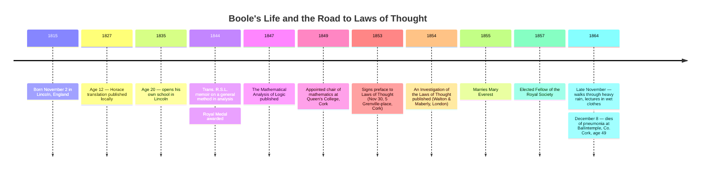

:::tip[In one paragraph]
In 1854, the self-taught Lincoln mathematician George Boole published *An Investigation of the Laws of Thought*, arguing that reasoning itself obeys mathematical laws. From three operations, two values (Nothing and Universe), and a single second-degree equation $x^2 = x$, he built a calculus of classes and propositions on paper. His addition was strictly disjoint; ten years later, William Stanley Jevons would redefine it as inclusive union, and modern Boolean algebra would begin.
:::

<strong>Cast of characters</strong>

| Name | Lifespan | Role |
|---|---|---|
| George Boole | 1815–1864 | Self-taught Lincoln mathematician; chair of mathematics at Queen's College, Cork (1849); author of *An Investigation of the Laws of Thought* (1854). |
| Mary Everest Boole | 1832–1916 | Boole's wife (married 1855); after his death, librarian at Queen's College, London; mathematics educator; inventor of "curve stitching." |
| Augustus De Morgan | 1806–1871 | London mathematician; near-contemporary witness to Boole's work, recorded as writing that Boole had "got hold of the true connection of algebra and logic." |
| Duncan F. Gregory | 1813–1844 | Founding editor of the *Cambridge Mathematical Journal*; helped Boole bring his early mathematical work into print. |
| John Ryall | — | Vice-President and Professor of Greek at Queen's College, Cork; dedicatee of *Laws of Thought*; Mary Everest's uncle on her mother's side. |
| William Stanley Jevons | 1835–1882 | British logician who, in 1864, redefined `+` as inclusive disjunction, abandoned Boole's framework, and built what scholars call the first version of modern Boolean algebra. |

<strong>Timeline (1815–1864)</strong>

<strong>Plain-words glossary</strong>

- **Algebra of logic** — A system in which logical reasoning is performed by symbol manipulation, the way arithmetic algebra performs numerical reasoning. Boole's 1854 book is the founding text.
- **Class** — In Boole's vocabulary, the collection of objects that a name picks out. "Men" is a class; "white things" is a class; "white sheep" is the class of objects that belong to both.
- **Calculus (Boole's sense)** — Not differential calculus. Boole uses the word in its older meaning: a system of symbolic computation, a method for getting from premises to conclusions by mechanical manipulation of signs.
- **Universe of discourse** — The class containing every object in the domain under discussion. Boole assigned the symbol $1$ to it, and $0$ to its opposite, the empty class ("Nothing").
- **Law of duality / idempotent law** — Boole's name for the equation $x^2 = x$: intersecting any class with itself returns the class unchanged. The modern name "idempotent law" was given by the Harvard mathematician Benjamin Peirce in 1870.
- **Strict-disjoint addition** — In Boole's 1854 system, $x + y$ was defined only for classes with no shared member. For overlapping classes he wrote $x + y(1 - x)$ as a separate workaround. Jevons later replaced the partial $+$ with an inclusive one (under which $x + x = x$), and modern Boolean algebra followed.

<strong>The math, on demand</strong>

The whole of Boole's symbolic system in *Laws of Thought* runs on a short list of equations.

- **Law of duality (the fundamental equation):** $x^2 = x$. Intersecting any class with itself yields the class unchanged. Boole identified this as the algebraic form of Aristotle's principle of contradiction.
- **Complement (logical NOT):** $1 - x$. Subtraction from the universal class produces the class of everything not in $x$.
- **Contradiction:** $x(1 - x) = 0$. Equivalent to $x^2 = x$ by expansion. No object belongs both to a class and to its complement.
- **Strict-disjoint sum:** $x + y$ — defined only when $x$ and $y$ share no member. Equation (3) of Chapter II §11.
- **Inclusive-OR workaround:** $x + y(1 - x)$ — Boole's own construction (Chapter IV §§7-8) for the case where the two classes overlap: $x$, plus the part of $y$ that does not already lie inside $x$.
- **Jevons's 1864 reformulation:** $x + x = x$. Achievable only by redefining $+$ as inclusive disjunction. Boole rejected the move in correspondence; Jevons abandoned Boole's framework and built the first version of modern Boolean algebra on the new definition.

George Boole was born on November 2, 1815, in the small cathedral city of Lincoln, Lincolnshire, England. His father was a tradesman of very limited means whose true and serious avocations were the pursuit of mathematics and the construction of optical instruments. In a household where formal academic pathways were financially out of reach, the elder Boole instructed his son in elementary mathematics and the use of optical devices. A friendly Lincoln bookseller helped the boy with Latin grammar, but beyond these initial foundations, the younger Boole was entirely self-taught. At the age of twelve, his metrical translation of an ode of Horace was published by his proud father in a local Lincoln journal, an achievement that prompted a neighbouring schoolmaster to write in and publicly deny that a translation of such quality could have been produced by one so young.

Between the ages of sixteen and twenty, Boole worked as an assistant teacher, first at Doncaster in Yorkshire and then at Waddington near Lincoln. He devoted his sparse leisure hours to the study of modern languages and patristic literature, teaching himself Greek, German, and French. At the age of twenty, in order to support his ageing parents, he opened his own school in Lincoln. Amidst the daily demands of school-teaching, Boole's intellectual focus shifted firmly back to mathematics. Working alone in the original French, he began to study Pierre-Simon Laplace's *Mécanique céleste* and Joseph-Louis Lagrange's *Mécanique analytique*. Out of the meticulous notes he took while working through Lagrange, his first mathematical memoir began to take shape.

He soon found an advocate in Duncan F. Gregory, the founding editor of the *Cambridge Mathematical Journal*, who helped the provincial schoolmaster bring his early work into print. Gregory and others in the Cambridge circle recognised Boole's talent and suggested he take the regular mathematical course at the university. Boole declined; he could not afford to leave his parents or the school that sustained them. Working entirely outside the university system, he submitted a memoir on a general method in analysis—applying the algebraic "separation of symbols" technique to differential equations with variable coefficients—which was published in 1844 in the *Transactions of the Royal Society of London*. The paper earned him a Royal Medal. Three years later, in 1847, he published a slim volume titled *The Mathematical Analysis of Logic*, his first foray into the algebra of reasoning.

The slim volume had a specific occasion. Sir William Hamilton of Edinburgh and Augustus De Morgan of London were quarrelling publicly over what came to be called the *quantification of the predicate* — whether logic should formally distinguish "all men are mortal" from "all men are some-mortals" — and the dispute had given the long-quiet question of logic-as-algebra new currency. Boole's *Mathematical Analysis of Logic* answered the technical question by treating logic itself as an algebra, in which the quantification problem dissolved into a routine of symbolic manipulation. De Morgan was the most-qualified British contemporary witness to what Boole was attempting. In a letter to Sir William Rowan Hamilton — the Irish mathematician, not the Edinburgh philosopher of the quantification dispute — preserved by Macfarlane some sixty-three years later, De Morgan wrote that he would "be glad to see his work out, for he has, I think, got hold of the true connection of algebra and logic." That phrase — a private compliment to a colleague — is as close as the verified record comes to a contemporary verdict on what Boole was about to publish.

In 1849, Boole's life was transformed when he was appointed to the chair of mathematics at the newly founded Queen's College, Cork, in Ireland. Queen's College Cork was one of three non-denominational colleges (with Belfast and Galway) established in 1849 under the 1845 Queen's Colleges Act, in a country whose existing university provision — Trinity College Dublin and Maynooth — was sectarian. The college offered Boole an institutional home, a regular salary, and the time he had never possessed in Lincoln. There, in late 1853, sitting at his desk at 5, Grenville-place, Cork, Boole signed the preface to the book he had been preparing for years.

In 1854, the London firm of Walton & Maberly published *An Investigation of the Laws of Thought, on which are founded the Mathematical Theories of Logic and Probabilities*. It was dedicated to Dr. John Ryall, the Vice-President and Professor of Greek at Queen's College, Cork. In its opening chapter, Boole laid out an ambitious, unifying design statement: "to investigate the fundamental laws of those operations of the mind by which reasoning is performed; to give expression to them in the symbolical language of a Calculus."

In Chapter II, "Of Signs in General, and of the Signs Appropriate to the Science of Logic in Particular," Boole established the infrastructure of his system on the printed page. Proposition I, in the fourth section, gives the enumeration in his own words: "All the operations of Language, as an instrument of reasoning, may be conducted by a system of signs composed of the following elements" — first, literal symbols such as $x$ and $y$, representing things or classes of things; second, signs of operation — $+$, $-$, and $\times$ — by which these conceptions are combined or resolved; third, the sign of identity, $=$. Three classes of element, the third of them a single symbol. The whole calculus would be built from this short list.

The move on which the rest of the book depends is the move from a *name* to a *class*. Boole began with words. The substantive "men" picks out, in language, the people who fall under that name; the adjective "good," in "good things," picks out the objects to which the quality applies. Boole's first formal step was to treat both — substantive and adjective alike — as picking out the same kind of thing: a class, the collection of objects to which the word, or the combination of words, refers. Once a noun and an adjective alike denoted classes, the operations of language became operations on classes, and operations on classes admitted an algebra. The leap is small in form and immense in consequence: it is the turn that makes everything in the rest of the book possible.

Boole demonstrated it with what would become his most famous worked example. "Let $x$ represent 'all men,' or the class 'men,'" he wrote in section 6 of Chapter II. If $x$ alone stands for "white things," and $y$ stands for "sheep," then let $xy$ stand for "white sheep." This operation of multiplication represented the logical intersection of two classes, gathering only the objects to which both names apply. From this definition Boole swiftly derived, as equation (1) of section 7, that the multiplication of literal symbols is commutative: $xy = yx$. The order in which the mind conceptually combines "white" and "sheep" does not change the resulting class. The proof is not by inspection but by the meaning of intersection itself: a thing belongs to "white sheep" if and only if it belongs to "sheep that are white," because the two phrases pick out the same objects in the world.

When Boole turned to addition, however, he made a restriction that would define the limits of his original system. He insisted, in section 11 of Chapter II, that "the words 'and,' 'or,' interposed between the terms descriptive of two or more classes of objects, imply that those classes are quite distinct, so that no member of one is found in another." On Boole's reading, ordinary language, used in strictness, did not run together overlapping classes under a single connective; "all the men and all the women in the room" implied two non-overlapping groups, not a category that would double-count anyone who was somehow both. Consequently, in Boole's 1854 calculus the addition $x + y$ was a *partial* operation. Equation (3) — $x + y = y + x$ — was valid, but only when the classes were mutually exclusive. Boole's symbol $+$ was not the modern inclusive-OR; it was strictly disjoint.

The cost of the restriction would emerge in Chapter IV, when Boole had to construct a separate form for the inclusive case, and again ten years later, when a younger logician sat down to write Boole a letter about it.

With the elements defined, Boole proceeded in Chapter III, "Derivation of the Laws," to ask which numerical interpretations were compatible with his calculus. He had noticed already, in working through Chapter II, that the literal symbols of his system are universally subject to a strange equation: $x \cdot x = x$, or in the more familiar shorthand, $x^2 = x$. The equation says that intersecting any class with itself returns the class unchanged — which is true by the meaning of intersection, since the things that are both *men* and *men* are simply the things that are *men*. But $x^2 = x$ is *not* an identity in the ordinary algebra of numbers. If $x$ is a number, the equation $x^2 = x$ is satisfied only by $x = 0$ and $x = 1$. From this collision of the calculus and the number system Boole drew a startling conclusion: the symbols of logic, if interpreted numerically at all, must take only those two values. He assigned them at the boundaries of class extension. Proposition II of Chapter III gives the assignment in plain prose: "the respective interpretations of the symbols 0 and 1 in the system of Logic are Nothing and Universe." Zero is the empty class, the class to which no object belongs; one is the universe of discourse, the class that contains everything in the domain under consideration. If $x$ represents any class of objects, Boole then defined the logical complement, in Proposition III, as $1 - x$ — "the contrary or supplementary class of objects, i.e. the class including all objects which are not comprehended in the class $x$." Subtraction from the universal class produces the negation.

From these three definitions — the literal class symbols, the two extremes 0 and 1, and the complement $1 - x$ — emerged the cornerstone of the entire calculus. In Proposition IV, Boole drew the consequence directly. If the class $x$ is multiplied by its contrary $1 - x$, the result must be empty, because no object can both belong to a class and lie outside it. Algebraically, $x(1 - x) = 0$, which expands to $x - x^2 = 0$, or $x^2 = x$. Boole identified this fundamental equation as the algebraic expression of the Aristotelian principle of contradiction. To prove the lineage, he quoted Aristotle's *Metaphysica* directly in Greek in a footnote: in Boole's own English paraphrase, "It is impossible that the same quality should both belong and not belong to the same thing." What Aristotle had stated in dialectic, Boole had now stated as an equation of the second degree.

He went further. Boole termed the equation $x^2 = x$ the "law of duality" — his own coinage, attached to it in the closing section of Chapter III "for reasons which are made apparent by the above discussion." (It would not receive its modern name, the "idempotent law," until the Harvard mathematician Benjamin Peirce renamed it in 1870, six years after Boole's death.) More importantly, Boole argued that the mathematical *form* of this equation revealed a deep truth about human cognition. "It is a consequence of the fact that the fundamental equation of thought is of the second degree," Boole wrote, "that we perform the operation of analysis and classification, by division into pairs of opposites, or, as it is technically said, by dichotomy." This was Boole's own justification for a two-valued logic. The natural mode of human analysis is binary not because the world has only two kinds of thing, but because the algebra that governs reasoning is a *quadratic* — and a quadratic equation has, in general, two roots.

Boole pursued the argument in the form of a counterfactual that has no equal in the rest of the book. Had the fundamental equation been of the third degree rather than the second, he wrote, "the mental division must have been threefold in character, and we must have proceeded by a species of trichotomy […] the real nature of which it is impossible for us, with our existing faculties, adequately to conceive." Two values are not a convention. They are the natural consequence of an equation Boole has just derived in print. A reasoner with our faculties cannot, on Boole's account, even imagine what reasoning would look like under a cubic.

By the end of Chapter III, in fewer than twenty pages of running text, Boole had finished the symbolic core of *Laws of Thought*. He had a calculus of classes, two values, three operations, and one fundamental law. *An Investigation of the Laws of Thought* runs to twenty-two chapters; the first three give the design, the calculus, and its laws, and the remaining nineteen apply the system — to the elimination of variables in a system of propositions, to the secondary propositions that constitute his propositional logic, and finally, in the long second half of the book, to the science of probability. The structure is the inverse of the modern logic textbook, where definitions are brief and applications fill the volume; in Boole's book, the algebra is brief and the applications are the volume. What he had built, on paper, in symbols, was complete enough that a human reader equipped with a pencil could in principle work out the consequences of any well-formed system of premises by algebraic manipulation alone. He had built a calculus, not a machine.

The strict-disjoint addition was a limitation, and Boole himself knew it. In sections 7 and 8 of Chapter IV, he provided a manual workaround for the non-disjoint case. The construction is in his own text: when the classes denoted by $x$ and $y$ are exclusive, write $x + y$; when they are not exclusive, write $x + y(1 - x)$. The second formula is the modern reader's inclusive-OR, dressed in unfamiliar notation. Read it slowly: $x$, plus the part of $y$ that does not already lie inside $x$, is exactly the union of the two classes — every member of $x$, every member of $y$ not also in $x$, and no double-counting. The construction was therefore present in Boole's own pages from 1854. What Boole did *not* do was redefine his fundamental $+$ symbol to mean union; the partial operation remained partial, and the workaround remained a workaround. He preferred a calculus in which the symbol $+$ retained its strict reading and the inclusive case was an explicit composite, over a calculus in which $+$ silently absorbed the disjointness assumption and the algebra acquired the slightly strange identity $x + x = x$.

Boole also demonstrated that his algebra was not limited to the classification of objects. The first ten chapters of *Laws of Thought* — what Boole called the "primary propositions" — develop the algebra of classes. Chapters XI and XII then apply the same calculus, on the same two values, with the same three operations, to "secondary propositions," or propositions about propositions. A primary proposition asserts a relation between classes ("all men are mortal"); a secondary proposition asserts a relation between primary propositions ("if all men are mortal and Socrates is a man, then Socrates is mortal"). What modern logicians and computer scientists call *propositional logic* is recognisable, in this strict sense, in Chapters XI and XII of Boole's 1854 book. The popular framing that Boole invented only a class algebra, and that computer scientists later had to rediscover propositional logic from elsewhere, is wrong by omission; both systems exist side by side in the same volume, treated by the same calculus.

The leap from Boole's partial algebra to what computer scientists today call Boolean algebra occurred not under Boole's hand but under the next generation's. In 1864 — the same year Boole walked into the rain that killed him — the British logician William Stanley Jevons wrote to Boole proposing a small, simplifying change: that the $+$ symbol should be redefined as inclusive disjunction, with the consequence that $x + x = x$. The proposal flattened Boole's careful partial operation into a total one. Boole rejected it. In correspondence as cited in the *Stanford Encyclopedia of Philosophy*'s entry on his work, Boole replied bluntly that "it is not true that in Logic $x + x = x$." Jevons, undeterred, abandoned Boole's framework entirely. Within months he had published a system in which $+$ was inclusive by definition, the partial operation was gone, and what Stanley Burris's modern survey calls "the first version of modern Boolean algebra" was on the page.

The progression from there is dateable. In 1864 Jevons abandoned Boole's partial $+$ and built an inclusive one. In 1870 the Harvard mathematician Benjamin Peirce — father of C. S. Peirce — supplied the modern name *idempotent law* for what Boole had called the law of duality. From the late 1860s onward C. S. Peirce extended Boole's algebra into the logic of relations and the early predicate calculus. Between 1890 and 1895 Ernst Schröder published the three volumes of his *Vorlesungen über die Algebra der Logik*, the work in which the Jevons–Peirce–Schröder Boolean algebra reached its mature, encyclopaedic form. The popular notion that Boole's algebra slept untouched for the eighty years before its engineering interpretation in the early twentieth century is, on this record, simply false; mathematical logicians worked continuously on and against Boole's calculus throughout the period. What was missing was not work on Boolean algebra but the *engineering interpretation* of it, and that absence is the subject of a later chapter, not this one.

By the time Jevons's revision began to circulate, Boole's life was drawing to a sudden close. In 1855, a year after the publication of *Laws of Thought*, he married Mary Everest. She was the niece of Dr. John Ryall — the Cork colleague to whom Boole had dedicated his book — and also the niece of Sir George Everest, the former Surveyor General of India for whom Peak XV in the Himalayas would be renamed in 1865. Macfarlane, drawing on Robert Harley's 1866 obituary notice in the *Proceedings of the Royal Society*, connects the dedication and the marriage in a single line that has amused readers ever since: "In the following year, perhaps as a result of the dedication, he married Miss Everest, the niece of that colleague." The couple settled in Cork and had five daughters together. In 1857, Boole's mathematical achievements were formally recognised when he was elected a Fellow of the Royal Society.

In late November 1864 — Britannica gives the date specifically as November 24, though Macfarlane and the MacTutor archive give only "one day in 1864" — Boole walked from his residence to Queen's College Cork in heavy rain. The accounts of the distance differ: Macfarlane and MacTutor say two miles; Britannica says three. The walk was, on either account, long enough that lecturing in wet clothes afterwards mattered. Arriving soaked, Boole delivered his lecture without changing. The chill he contracted soon developed, in Macfarlane's wording, into "a feverish cold which soon fell upon his lungs"; the modern diagnosis, given in the *Stanford Encyclopedia of Philosophy* and in Britannica, is pneumonia. George Boole died at Ballintemple, County Cork, on December 8, 1864 — Macfarlane writes "in the 50th year of his age," the Victorian ordinal-year idiom for a man who was forty-nine years and thirty-six days old.

Mary Everest Boole is sometimes described in retrospectives as the keeper of her husband's mathematical legacy — the patient guardian of his archive, the spouse who kept his logical theories in academic circulation. The verified open-access record does not support that framing; it tells a different, though equally remarkable, story. After Boole's death the family moved to London. With the support of the theologian Frederick Denison Maurice, Mary Everest Boole took a post as librarian at Queen's College, London — the women's college Maurice had helped to found. She taught mathematics to women and children, drawing on methods she had absorbed from a Monsieur Deplace who had been her own tutor as a girl. She invented what she called *curve stitching* — the technique of producing the visible envelope of a curve by drawing straight stitches between numbered points on a card, a method that survives in primary-school classrooms and that introduces a child to the concept of a tangent before the language of calculus is in reach. From the 1880s onward she published prolifically: a long sequence of books and pamphlets on the philosophy of mathematical education and on a sometimes-mystical philosophy of mind. The framing that she preserved George Boole's symbolic logic is folk history; her own documented legacy lies in mathematical pedagogy, not in formal algebraic logic.

Her contemporaries were sometimes hostile to the work she did do. Macfarlane in 1916 dismissed one of her books as "a paradoxical book of the false kind." The chapter takes the documented version of her life from the *MacTutor* biographical record and refuses the more sentimental framing. The distinction matters because this is the AI-history book's first chapter, and the standard of evidence the book will hold to in later chapters is the standard set here. Her own legacy is real, and is in mathematics education. It is simply not in the preservation of Boole's logic, and the chapter says so plainly.

George Boole left behind a calculus of classes and propositions, etched entirely in paper and ink. He framed the project, in the opening paragraph of *Laws of Thought*, as the investigation of "the fundamental laws of those operations of the mind by which reasoning is performed" — a science of the mind, on a par with (and arguably superior to) the contemporary science of probability. At no point in the book did he propose the construction of physical machinery to execute his equations; the text contains no diagrams of circuits, no proposed apparatus, no anticipation of an engine. The work that Jevons, Charles Sanders Peirce, and Schröder did with the calculus in the half-century after Boole's death was logical, not engineering — a continuous mathematical activity, not a dormancy. The bridge from this algebra to a physical apparatus that performs reasoning by passing electrical current through wires belongs to a later chapter; it requires its own evidence and a different cast. The chapter ends, as Boole's book ends, on a calculus.

:::note[Why this still matters today]
Boole gave the world a calculus of classes and propositions, written entirely with paper and ink. He proposed no machinery; he made no engineering predictions. Yet every digital circuit you have ever used resolves into AND, OR, and NOT — three operations Boole formalised in 1854. Every search query, every conditional in every program, every database filter executes a chain of Boolean evaluations. The path from this page to silicon takes another half-century of mathematical work and a fresh engineering insight; the chapters that follow trace it. What matters here is that the algebra was already on paper.
:::
