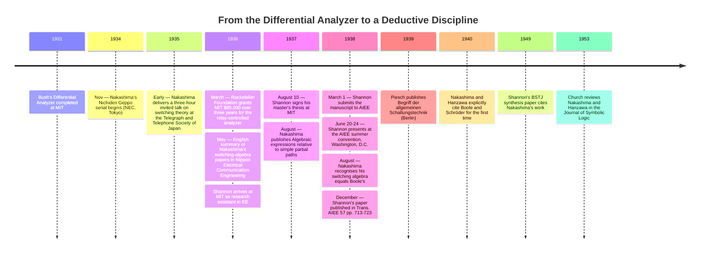

:::tip[In one paragraph]
In August 1937, Claude Shannon signed a master's thesis at MIT that gave switching-circuit design an axiomatic foundation: eight postulates, perfect-induction proofs, and an explicit identification of relay algebra with George Boole's calculus of propositions. Akira Nakashima at NEC had reached the same insight in Tokyo two years earlier; Hannsi Piesch and Plechl-Duschek would arrive at related ideas in German-speaking Europe. Shannon's distinctive contribution was axiomatic completeness — circuit design became a deductive discipline, not a uniquely Shannon-only insight.
:::

<strong>Cast of characters</strong>

| Name | Lifespan | Role |
|---|---|---|
| Claude Shannon | 1916–2001 | Research assistant in MIT EE (1936–1937); signed "A Symbolic Analysis of Relay and Switching Circuits" on August 10, 1937; published it in *Trans. AIEE* in December 1938. The chapter's primary protagonist; contribution is the axiomatic completeness of the calculus. |
| Vannevar Bush | 1890–1974 | MIT Vice-President and Dean of Engineering; architect of the Differential Analyzer program whose setup problem motivated Shannon's thesis. Recipient of the March 17, 1936 Rockefeller grant. |
| Akira Nakashima | 1908–1970 | Engineer at Nippon Electric Company (NEC), Tokyo; developed a relay-network algebra ahead of Shannon's thesis and later recognised its identity with Boole's algebra. |
| Masao Hanzawa | — | Engineer at NEC's exchange-engineering team; co-author with Nakashima from 1936 onward, including the 1940 papers that first explicitly cite Boole and Schröder. |
| Frank L. Hitchcock | 1875–1957 | Professor of mathematics at MIT; Shannon's *formal* thesis supervisor — distinct from Bush, who was Shannon's research-program supervisor and MIT employer. |
| Samuel H. Caldwell | 1904–1960 | Bush's MIT colleague and deputy on the Rockefeller Differential Analyzer project; took on day-to-day responsibility for the new analyzer as Bush's vice-presidential duties accumulated; thanked in Shannon's 1938 byline footnote. |

<strong>Timeline (1931–1953)</strong>

<strong>Plain-words glossary</strong>

- **Hindrance** — Shannon's term for the algebraic value assigned to a two-terminal switching circuit. `0` denotes the hindrance of a *closed* circuit (current flows; "no hindrance"); `1` denotes the hindrance of an *open* circuit (no current flows). The inverse of the modern Boolean convention where `1` is "true / closed."
- **Series-parallel circuit** — In Shannon's calculus, `X + Y` represents the *series* connection of two two-terminal circuits and `X · Y` (often written `XY`) represents the *parallel* connection. Any expression in `+`, `·`, and negation describes a series-parallel network, and vice versa.
- **Postulate** — A foundational axiom the calculus asserts rather than proves. Shannon's thesis lists eight postulates, arranged in dual pairs `1a/1b` through `4a/4b`, that fix how `+`, `·`, `0`, and `1` interact.
- **Perfect induction** — Shannon's name for proof by case-exhaustion. Because every variable takes only two values, every theorem can be verified by computing both sides for each finite combination of inputs.
- **Make / break contact** — The two physical kinds of relay contact. A *make* contact is normally open and closes when the relay is energised; a *break* contact is normally closed and opens. Shannon defined negation `X'` as "the hindrance of the break contacts of the same relay whose make contacts have hindrance `X`" — turning logical NOT into a physically realisable operation.
- **Calculus of propositions** — Boole's 1854 algebra of logical propositions, where `+` is OR-on-truth and `·` is AND-on-truth. Shannon's thesis identifies his switching algebra with this calculus under the inversion induced by the hindrance convention; Table I of the 1938 paper makes the analogue explicit row by row.

In 1931, Vannevar Bush's Differential Analyzer was completed at the Massachusetts Institute of Technology. It was a mechanical machine, consisting of a long table-like framework crisscrossed by interconnectible shafts, with a series of drawing boards along one side and six disc integrators along the other. The machine cost approximately $25,000 to construct. The disc integrator was, as historian Larry Owens observed, "the heart of the analyzer and the means by which it performed the operation of integration"—a variable-friction gear whose geometry forced the constituent shafts to turn in accordance with a specified relationship.

The 1931 machine occupied a modest footprint by the standards of large industrial equipment, but it embodied a dense relationship between mechanical motion and mathematical operation. Each of the six disc integrators performed one integration; chains of gear shafts carried the resulting shaft rotations to the drawing-board pens, which traced the analyzer's solution curves on paper. To solve a fresh differential equation, an operator routed gear couplings between the integrators, the drawing-board outputs, and the bus shafts that ran the length of the table, in effect "wiring" the analyzer for that one problem. Reconfiguration was hand work, not the throwing of a switch.

In March 1936, seeking to automate this arduous setup process, the Rockefeller Foundation awarded MIT a grant of $85,000 over three years to build the Rockefeller Differential Analyzer. This successor machine was intended to rely on automatic electrical interconnection of machine elements rather than manual gear configuration.

The grant was formally documented in a letter from Bush to Warren Weaver, the director of Rockefeller's Natural Sciences Division, on March 17, 1936. Samuel H. Caldwell, Bush's MIT colleague who appears in archival photographs of the 1931 machine, assumed day-to-day responsibility for the new project as Bush's vice-presidential and dean responsibilities accumulated. The new analyzer, eventually demonstrated for the first time on December 13, 1941 and dedicated to wartime work in 1942, would ultimately incorporate "some two thousand vacuum tubes, several thousand relays, a hundred and fifty motors, and automated input units" and weigh nearly a hundred tons. That post-war scale belongs to the finished machine. In 1936 and 1937, however, the relay-controlled successor existed only on Bush's drawing boards; the working machine at MIT was still the 1931 mechanical analyzer, with no relays in its computational path at all.

The hardest engineering challenge in the new machine was automatic control—assigning computing elements to different problems quickly, efficiently, and automatically. The challenge, according to Owens, "posed, in fact, a software problem." Claude E. Shannon arrived as a research assistant in the MIT Department of Electrical Engineering during the period when the 1931 mechanical analyzer was still the working machine and the Rockefeller successor was being planned and designed. His work on the analyzer setup problem would motivate a new way of thinking about circuit design.

Shannon had completed a B.S. at the University of Michigan in 1936 and arrived at MIT later that year. The verified record places him as a research assistant in MIT's electrical engineering department while the analyzer setup problem was active. Around him was a stream of small, intricate configuration problems: each new differential equation had to be encoded as a particular arrangement of gears and shafts. The configuration burden of one mechanical machine was tractable; the configuration burden Bush was now planning—a relay-controlled successor that would be reassigned automatically from one problem to the next—was not, except as a problem in something more abstract than gears.

## The Parallel Discovery

While MIT engineers wrestled with the setup problem of the analyzer, similar theoretical breakthroughs were happening independently across the world. Akira Nakashima, a graduate of Tokyo University, was working as an engineer at the Nippon Electric Company (NEC) in Tokyo on the design of relay networks. Nakashima undertook an extensive analysis of many case studies of relay networks, trying to formulate a unified design theory. He began considering the impedances of relay contacts as two-valued variables, using logic OR and AND operations to represent series and parallel connections.

Nakashima's NEC career placed him at the same kind of telephone-switching frontier that drove Shannon's MIT context. Niwa Yasujiro, NEC's chief engineer, and Shimazu Yasujiro served as senior figures in the laboratory; Nakashima conducted much of his switching-theory research after office hours. In 1936 he was transferred to NEC's transmission engineering group but continued the relay-network research alongside his new duties, increasingly in collaboration with Masao Hanzawa from NEC's exchange-engineering team. Three different English spellings of his surname—Nakashima, Nakasima, Nakajima—appear across his publications, a reflection of romanization conventions in flux during the period; the kanji rendering also varies between two forms across his corpus. The researcher Akihiko Yamada, who reconstructed the publication record decades later, would describe Nakashima as the author of "the first paper on switching theory in the World."

Nakashima presented his results in a serial in *Nichiden Geppo* (the NEC Technical Journal) running from November 1934 through September 1935 in Japanese. The Telegraph and Telephone Society of Japan engaged Nakashima to give a three-hour invited talk on switching theory at the Society's annual meeting in early 1935. The talk was subsequently published as "Synthesis theory of relay networks" in the *Journal of the Institute of Telegraph and Telephone Engineers of Japan* in September 1935, and an English-language summary appeared in *Nippon Electrical Communication Engineering* in May 1936.

Nakashima developed his algebra initially without using symbolic notation. He recognized only in August 1938—after Shannon's work had been presented in the United States—that his independently developed switching algebra was "actually equal to the Boolean algebra," and his first explicit citation of George Boole and Ernst Schröder appeared in a 1940 paper co-authored with Hanzawa. Nakashima's notation paralleled Shannon's subsequent work almost exactly: Nakashima used `A=∞` for open circuits and `A=0` for closed circuits (the opposite of Shannon's hindrance convention), while both used `+` for series connection and `·` for parallel connection, and both used an overline or prime for negation.

The historical asymmetry deserves to be stated cleanly. Nakashima reached the *insight*—that relay networks have an algebra of their own—earlier than Shannon, by approximately two years if one measures from the *Nichiden Geppo* serial that began in late 1934, or by fifteen months if one measures from the May 1936 English summary in *Nippon Electrical Communication Engineering* against Shannon's August 1937 thesis signature. There is no documented path showing that Shannon read either Nakashima's Japanese papers or the English summaries before submitting his own thesis, and the parsimonious historical reading is independent simultaneous discovery on opposite sides of the Pacific. What Shannon contributed, and Nakashima had not yet—in 1937—was the *axiomatic completeness*: the closed list of postulates, the perfect-induction proof method, and the explicit identification of the calculus with George Boole's algebra of propositions at first publication rather than at second or third revision.

## The Thesis

On August 10, 1937, Claude Shannon signed his master's thesis, "A Symbolic Analysis of Relay and Switching Circuits," in the MIT Department of Electrical Engineering. His formal thesis supervisor was Professor F. L. Hitchcock.

The thesis opened by establishing a two-problem framework for circuit design: "analysis" (determining the operating characteristics of a given circuit) and "synthesis" (finding a circuit that incorporates given characteristics while ideally requiring the least number of switch blades and relay contacts). Shannon explicitly named the practical motivating applications for this theory: "automatic telephone exchanges, industrial motor control equipment and in almost any circuits designed to perform complex operations automatically."

The synthesis problem was the heart of the matter. A telephone exchange in the late 1930s routed a single call through a sequence of relay contacts, and each of those contacts cost money, occupied floor space, and added a small but cumulative probability of mechanical failure. Engineers had known for decades how to *analyze* a given relay network—start from one terminal, trace possible paths to the other, enumerate the conditions under which current would flow—but no one had a clean procedure for the inverse problem. Given a desired behavior expressed as a truth table over the relays' inputs, what was the simplest network that would realize it? Shannon's thesis aimed to convert this engineering question into one of algebraic manipulation.

Shannon introduced a "hindrance" notation to map physical circuits to mathematics. "The symbol 0 (zero) will be used to represent the hinderance of a closed circuit," he wrote, "and the symbol 1 (unity) to represent the hinderance of an open circuit." He denoted series connection of two-terminal circuits with a `+`, and parallel connection with a `·` (multiplication). He then listed eight postulates, arranged in pairs to emphasize their duality: "if in any of the *a* postulates the zero's are replaced by one's and the multiplications by additions and vice versa, the corresponding *b* postulate will result."

The first pair of postulates, 1a and 1b, asserted that a closed circuit in series with a closed circuit was closed (`0 + 0 = 0`) and that an open circuit in parallel with an open circuit was open (`1 · 1 = 1`). The next pairs captured the asymmetric cases. Postulate 4 fixed the two-valued constraint—every variable was either `0` or `1` at any given time—and that constraint made every later proof an exhaustive case-check. The pair-and-duality structure was not stylistic ornament. It made the algebra symmetric under the simultaneous swap of `+` with `·` and `0` with `1`, which in turn meant that every theorem in the thesis came packaged with a free dual theorem on the opposite side of the page.

To prove his theorems, Shannon used the method of "perfect induction"—the verification of the theorem for all possible cases, which is finite because each variable takes only the values 0 and 1. He defined negation, `X'`, based on the physical properties of a relay: "If X is the hindrance of the make contacts of a relay, then X' is the hindrance of the break contacts of the same relay." The negation theorems—`X + X' = 1`, `X · X' = 0`, `0' = 1`, `1' = 0`, and `(X')' = X`—followed directly from this definition.

The hindrance convention is worth pausing on, because Shannon's choice of which value represented which physical state runs in the opposite direction of the convention that would dominate digital logic textbooks two generations later. In modern Boolean notation, `1` is *true* and corresponds to a closed switch through which current flows; series circuits implement AND. In Shannon's 1937 framing, `1` is the *hindrance of an open circuit*—a circuit through which no current flows—and series of two open circuits is itself open, so the operation `+` acts as OR on open-ness, equivalent to AND on closed-ness. The two formulations are interchangeable through a simple inversion, but a reader cross-checking the thesis against a modern textbook needs to apply the inversion carefully or risk reading every postulate inside out.

Most importantly, Shannon explicitly identified his calculus with George Boole's work. "The algebra of logic ... originated by George Boole, is a symbolic method of investigating logical relationships," he wrote. Shannon's reference 4 in the published 1938 paper pointed to E. V. Huntington's 1904 *Transactions of the American Mathematical Society* paper "Sets of independent postulates for the algebra of logic"—the same paper that historians of switching theory would later identify as the canonical postulate set for Boolean algebra. The identification was therefore not a vague analogy. Shannon was claiming, with Huntington's postulate set in hand and his own postulates derived from relay behavior on the other, that the two systems were the same algebra under different physical interpretations. Boole's variables were truth values of propositions; Shannon's were hindrances of two-terminal circuits; the formal structure was identical. In a table (later published as Table I: "Analogue Between the Calculus of Propositions and the Symbolic Relay Analysis"), Shannon explicitly mapped the concepts: `X+Y` as series connection corresponded to the proposition that either X or Y is true, `XY` as parallel connection to the proposition that both are true, and `X'` as the contradictory proposition. From that identification the methodology of switching-circuit design followed without further metaphysics. To design a relay network that performed a given logical function, an engineer wrote down the function in Boolean form, simplified it algebraically, and read off the simplified expression as a series-parallel circuit.

Shannon's algebra demonstrated that mathematics, rather than trial-and-error, could be the primary tool for hardware optimization. Before this theoretical foundation, designing a complex relay circuit meant using a "cut and try" method, "first satisfying one requirement and then making additions until all are satisfied." The resulting design, Shannon observed, "will seldom be the simplest" and often contained "hidden 'sneak circuits.'"

Instead, Shannon wrote, "any expression formed with the operations of addition, multiplication, and negation represents explicitly a circuit containing only series and parallel connections. Such a circuit will be called a series-parallel circuit. Each letter in an expression of this sort represents a make or break relay contact, or a switch blade and contact." To find the circuit requiring the least number of contacts, "it is therefore necessary to manipulate the expression into the form in which the least number of letters appear."

## The Simplification

He provided a worked example to prove this methodology. The original hindrance function, drawn as Figure 5 in the thesis, was `Xab = W + W'(X+Y) + (X+Z)(S+W'+Z)(Z'+Y+S'V)`—a circuit with thirteen element-occurrences distributed across six distinct relays (`W`, `X`, `Y`, `Z`, `S`, `V`). Through repeated application of theorem 17b—a rewriting rule that absorbed nested expressions of a single variable—and the distributive law, the function reduced to `Xab = W + X + Y + ZS'V`. The simplified form was Figure 6: a circuit with five element-occurrences across the same six distinct relays. "Note the large reduction in the number of elements," Shannon remarked. The popular shorthand that the reduction was "from five relays to three"—repeated in many later popularizations—does not match the primary source. The number of relays did not change; the number of contacts and switch-blade elements dropped from thirteen to five.

:::tip[Plain reading]
Theorem 17b is the absorption law: in Shannon's algebra, $X + XY = X$, meaning that a variable already present in a branch absorbs a product that includes the same variable. Used with the distributive law $X(Y+Z) = XY + XZ$, it lets the 13-contact expression collapse by equality-preserving rewrites until only `W + X + Y + ZS'V` remains.
:::

The pedagogical move embedded in the worked example deserves a name. The example showed an engineer how to take an arbitrary requirement, express it in algebraic form, and reduce that form to its minimum number of contacts before any physical hardware was constructed. The savings were not theoretical. In a telephone-routing frame, every contact removed by simplification was a real piece of metal that would not have to be installed or maintained. Shannon's algebra moved the cost of design from the physical bench to the mathematician's notebook, where it was paid in symbols rather than in soldering and copper.

He demonstrated even further reductions in his Section V *Selective Circuit* example, where a relay `A` was required to operate when any one, any three, or all four of the relays `w`, `x`, `y`, `z` were operated. Starting with an initial series-parallel form of 20 elements—a sum of seven product terms enumerating each operating combination—Shannon recognized the requirement as a *symmetric function* of its four arguments and rewrote it as `A = S₄(1, 3, 4)`, the function that selected the cases of weight one, three, or four. The symmetric-function form required 15 elements. He then noticed that the *complement* function, `A' = S₄(0, 2)`, was simpler still, and constructed `A` as the dual network of the realization of `A'`—a transformation that exchanged series with parallel and break-contacts with make-contacts. The dual-network form required 14 elements, which Shannon noted was "probably the most economical circuit of any sort" for the given requirement.

Turing's 1936 universal-machine paper belongs nearby only as a pointer, not as a premise: Shannon's thesis addressed relay-circuit synthesis, and the two works were not in conversation.

## From Thesis to Standard

Shannon submitted his manuscript to the American Institute of Electrical Engineers on March 1, 1938. The paper was made available for preprinting on May 27, 1938, and he presented it at the AIEE summer convention in Washington, D.C., in June. It was published in the *Transactions of the American Institute of Electrical Engineers* in December 1938. In the byline footnote, Shannon acknowledged his debt to Doctor F. L. Hitchcock, Doctor Vannevar Bush, and Doctor S. H. Caldwell.

The formulation of switching-circuit algebra was an idea occurring across multiple engineering centers. In 1939, Hannsi Piesch published "Begriff der allgemeinen Schaltungstechnik" in *Archiv für Elektrotechnik* (volume 33, number 10, pages 672 through 686), the first sustained German-language formulation of relay-network algebra. In 1946, after the war, Otto Plechl and Adolf Duschek published "Grundzüge einer Algebra der elektrischen Schaltungen" in the Vienna *Österreichisches Ingenieur-Archiv* (volume I, issue 3, pages 203 through 230), an Austrian formulation that arrived too late to be a true parallel discovery and whose first publication cites Nakashima but not Shannon. Shannon's first major Western citation of Nakashima's work appeared in his 1949 *Bell System Technical Journal* paper, "The synthesis of two-terminal switching circuits" (volume 28, number 1, pages 59 through 98). The Japanese work was brought fully into the symbolic-logic literature in 1953 when Alonso Church reviewed Nakashima and Hanzawa's papers in *The Journal of Symbolic Logic* (volume 18, number 4, page 346).

The 1938 *Trans. AIEE* paper was an engineering-trade publication, not an academic-mathematics one. Its later reach is best stated more cautiously than the usual origin story allows: across the post-war acknowledgments, the framework appears less as a single-origin event than as a deductive language for circuit design that gradually became part of the foundation of digital logic.

The thesis deserves its reputation, but only with careful framing. It was not the moment the digital computer was invented; that conjunction came later, through the wartime work of Atanasoff and Berry, the ENIAC team at the Moore School, the Colossus engineers at Bletchley Park, and the post-war stored-program designs of von Neumann and his collaborators. It was not the moment Boolean algebra entered engineering practice everywhere; Nakashima had begun that move in Japan in 1934 and 1935, Piesch and Plechl-Duschek would do it in German-speaking Europe in 1939 and 1946, and the underlying mathematical apparatus had been waiting in Boole's *Laws of Thought* since 1854. It was not even a uniquely Shannon-only insight; the documented record points to multiple independent paths into the same axiomatic territory. What it *was* was the moment one careful master's thesis fixed the postulates, the proofs, the negation, the calculus-of-propositions identification, and the simplification methodology in a single deductive system, and tied that system explicitly to the work of George Boole. Circuit design, after August 1937, could be carried out as a deductive discipline. That, not the invention of the computer, is the contribution of Shannon's thesis worth preserving.

:::note[Why this still matters today]
Every digital chip in production today — every CPU, GPU, microcontroller, FPGA — is, at its lowest combinational layer, a series-parallel network of two-state elements designed by exactly the deductive discipline Shannon's thesis named. Modern hardware-description languages describe Boolean functions; logic-synthesis tools simplify them into minimal gate-level networks; place-and-route tools lay them out in silicon. Each step is a continuation of the Figure 5 → Figure 6 simplification — algebra performed before any physical hardware is built, savings paid in symbols rather than copper. The chapter's quieter lesson — that the same insight reached Tokyo two years earlier, and Berlin and Vienna shortly after — is the historiographical correction that survives.
:::
