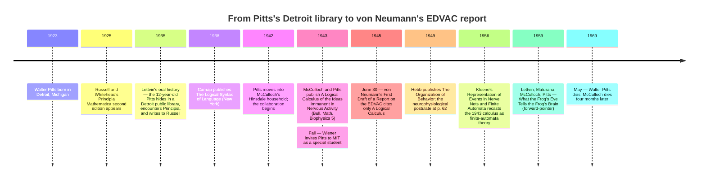

:::tip[In one paragraph]
In 1943, Warren McCulloch and Walter Pitts published "A Logical Calculus of the Ideas Immanent in Nervous Activity" in the *Bulletin of Mathematical Biophysics*. They did not invent the mathematical study of neurons — Nicolas Rashevsky's biophysics community already existed at Chicago — but they replaced its continuous differential equations with the propositional logic of Carnap and Russell-Whitehead. That shift named the right level of abstraction. Two and a half years later, "A Logical Calculus" became the only journal citation in von Neumann's *First Draft of a Report on the EDVAC*.
:::

<strong>Cast of characters</strong>

| Name | Lifespan | Role |
|---|---|---|
| Warren McCulloch | 1898–1969 | Neurophysiologist; in 1943 affiliated jointly with the Department of Psychiatry at the Illinois Neuropsychiatric Institute and the University of Chicago. Co-author of "A Logical Calculus of the Ideas Immanent in Nervous Activity" (1943). |
| Walter Pitts | 1923–1969 | Self-educated logician; co-author of the 1943 paper at age 19–20; subsequently a "special student" at MIT under Wiener. The Lettvin-oral-history scenes (Detroit library, Russell letter, Chicago run-away) are reconstructions, not documentary facts. |
| Jerome Lettvin | 1920–2011 | University of Chicago medical student in the early 1940s; introduced Pitts to McCulloch and is the source for nearly every popular Pitts-biography scene (recorded in *Talking Nets*, 2000). Co-author of the 1959 frog's-eye paper. |
| Nicolas Rashevsky | 1899–1972 | Mathematical biophysicist at the University of Chicago; founder and editor of the *Bulletin of Mathematical Biophysics* — the journal that published the 1943 paper. The institutional context the chapter must keep in view. |
| Donald Hebb | 1904–1985 | Canadian psychologist at McGill; *The Organization of Behavior* (1949) places his work alongside the Rashevsky-Pitts-McCulloch line and gives the "neurophysiological postulate" at p. 62 — a *biological* hypothesis about synaptic strengthening, not an algorithm. |
| John von Neumann | 1903–1957 | Cited "A Logical Calculus" in §4.2 of his June 1945 *First Draft of a Report on the EDVAC* — the only journal citation in the entire report. The route by which the 1943 paper's vocabulary entered stored-program computer architecture. |

<strong>Timeline (1923–1969)</strong>

<strong>Plain-words glossary</strong>

- **All-or-none neuron** — Idealisation of the biological neuron in which firing is binary: at any time step the neuron either fires (output 1) or does not (output 0). One of the five physical assumptions on p. 118 of the 1943 paper.
- **Threshold-logic gate** — A unit that fires when the (weighted) sum of its excitatory inputs reaches a fixed threshold and no inhibitory input is active. McCulloch and Pitts realised AND at threshold 2, OR at threshold 1, and NOT via an inhibitory connection.
- **Net without circles** — A McCulloch-Pitts network with no feedback loops — equivalent in expressive power to propositional logic. The combinational core of the 1943 calculus.
- **Net with circles** — A McCulloch-Pitts network containing feedback loops, in which a neuron's firing now can depend on its (or another neuron's) firing one or more time steps ago. Carries bounded memory and expresses recursive predicates; later legible as a *finite automaton* in Kleene's 1956 vocabulary.
- **Theorem 7** — The 1943 paper's formal accommodation of plasticity: "Alterable synapses can be replaced by circles" (original p. 124). A net whose connections change over time can be re-expressed as a fixed net with extra circular pathways gating signal flow. The theorem absorbs learning; it does *not* supply a learning algorithm.
- **Hebbian postulate** — Hebb's 1949 hypothesis (*Organization of Behavior* p. 62) that repeated co-firing between two neurons strengthens the synapse between them. A *biological* hypothesis about where plasticity might live in nervous tissue, not a weight-update rule. The textbook-compressed "Hebb's rule" was assigned the name later.

In the history of computation, the transition from continuous physical processes to discrete logical operations is often treated as an inevitable progression. But in the early 1940s, the application of mathematics to the nervous system was overwhelmingly dominated by differential equations and biophysics. The intellectual leap that treated an idealized neuron's firing as a proposition, and a network of neurons as a propositional calculus, required a profound change in mathematical language. That change was formalized in a 1943 paper by Warren McCulloch and Walter Pitts, titled "A Logical Calculus of the Ideas Immanent in Nervous Activity." It was not the first mathematical model of neurons, nor did it offer a functional learning algorithm that could be trained on data. Instead, it was an act of naming the right level of abstraction, providing a formal bridge that connected the biology of the brain to the symbolic logic of early computer science.

To understand how this abstraction came to be, we must look at the unlikely collaboration that produced it. The popular history of Walter Pitts's life is often rendered in dramatic, almost mythological terms. Much of what is commonly repeated about his early years traces through the oral history of his friend and colleague Jerome Lettvin, recorded decades later and preserved in subsequent biographical accounts—and these events are best read as Lettvin's oral-history reconstructions, not as settled documentary facts. In the version Lettvin remembered, Pitts was born in Detroit in 1923. He is said to have sought refuge from neighborhood bullies by hiding in a public library in 1935. According to this reconstruction, the twelve-year-old Pitts encountered Bertrand Russell and Alfred North Whitehead's monumental *Principia Mathematica*. He reportedly read its extensive volumes over three days, identified errors in its formidable logic, and wrote a letter directly to Russell. Russell reportedly replied, acknowledging the corrections and inviting the young prodigy to study at Cambridge—an invitation the twelve-year-old boy could not accept.

Three years later, in 1938, Lettvin's account claims that upon hearing Russell would be visiting the University of Chicago, the fifteen-year-old Pitts ran away from Detroit to Chicago, never to see his family again. By the early 1940s, Pitts was reportedly hanging around the University of Chicago campus, working menial jobs and sneaking into Russell's lectures. It was during this period that Lettvin, then a medical student at the university, introduced Pitts to Warren McCulloch.

McCulloch, born around 1898, was a neurophysiologist of a vastly different background. He had studied mathematics at Haverford College, philosophy and psychology at Yale, and had taken a medical degree at Columbia with a focus on neurophysiology. He was forty-two years old when he met the eighteen- or nineteen-year-old Pitts. In the early 1940s, McCulloch was affiliated with both the Department of Psychiatry at the Illinois Neuropsychiatric Institute, College of Medicine at the University of Illinois, and the University of Chicago. Recognizing the younger man's extraordinary facility for symbolic logic, McCulloch invited Pitts to live with him and his family in Hinsdale, Illinois. It was in this household that the two began the intensive collaboration that would result in the 1943 paper. The older neurophysiologist and the young logician forged a partnership that would permanently alter the trajectory of neural modeling, moving it from the realm of continuous biology into discrete mathematics.

These popular scenes deserve to be held at arm's length. The most careful published Pitts biography is Neil Smalheiser's 2000 article in *Perspectives in Biology and Medicine*, and downstream summaries of Smalheiser describe a more measured account than the dramatic version Lettvin later told and Gefter later rendered. The popular account asserts a precise three-day reading of the *Principia*'s roughly two thousand pages, an identification of errors, and a specific letter from Russell; outside Lettvin's later oral history, the documentary record does not independently establish those scene-level details. The Detroit beginnings, the Chicago arrival, and the introduction by Lettvin are widely repeated in Lettvin-derived accounts. The dramatic specifics are attached to those events through Lettvin's later retelling. The collaboration that produced the 1943 paper is what the reader needs; the prodigy backstory is what the reader is most likely to remember, and most likely to remember wrong.

Pitts's intellectual reputation, once it had a setting, extended well beyond Hinsdale. In late 1943 Norbert Wiener invited Pitts to MIT as a "special student"—a doctoral track despite the absence of any formal high-school credential—and Pitts moved to Cambridge, Massachusetts. He wrote McCulloch from MIT that December that he now understood "at once some seven-eighths of what Wiener says, which I am told is something of an achievement," a private letter preserved in the McCulloch Papers (BM139) at the American Philosophical Society and quoted by Gefter. Four years later McCulloch wrote to Rudolf Carnap describing Pitts as "the most omnivorous of scientists and scholars" and adding that "in my long life, I have never seen a man so erudite or so really practical." Both attestations are reported through Gefter's reading of the McCulloch correspondence and remain provisional until cross-anchored at the archive itself; neither is essential to the chapter's argument. They simply locate the writer of the 1943 paper inside the working cybernetics circle that would, two years later, circulate his calculus into the context in which von Neumann cited it.

It is a common misconception that McCulloch and Pitts were the first to bring mathematics to the study of neurons. As the philosopher Gualtiero Piccinini has observed, in 1943 there already existed a lively community of biophysicists doing mathematical work on neural networks. This community was centered at the University of Chicago around Nicolas Rashevsky, who founded and edited the *Bulletin of Mathematical Biophysics*. This journal was the primary venue for mathematical approaches to biology at the time, and it was precisely where the 1943 McCulloch-Pitts paper would be published.

McCulloch had been searching for a logical foundation for nervous activity since his years at Yale and Columbia. He envisioned a Leibnizian project—an "alphabet of thought" where the complex, messy operations of the mind could be reduced to discrete, fundamental logical units. However, the prevailing mathematical biophysics of the Rashevsky school was built on continuous mathematics. It modeled the diffusion of chemical exciters and the smooth, continuous dynamics of electrical potentials in the cell membrane. McCulloch required a different symbolic apparatus to represent thought as computation.

He found it in the mathematical logic of the era. The 1943 paper explicitly adopted the symbolic notation of Rudolf Carnap's 1938 *The Logical Syntax of Language*, referring to it as "Language II of Carnap," and augmented it with notations drawn from the second edition of Russell and Whitehead's *Principia Mathematica* (published between 1925 and 1927). The literature list at page 131 of the paper named a third borrowing as well: David Hilbert and Wilhelm Ackermann's 1927 *Grundzüge der Theoretischen Logik*, the textbook of mathematical logic from whose machinery the paper would later derive the Hilbert disjunctive normal form used in its handling of recursive predicates. The 1943 paper did not take its decisive novelty from Rashevsky-style biophysics; it borrowed the symbolic technology of the 1920s and 1930s mathematical-logic tradition. Carnap, Russell, and Hilbert provided the syntax; Pitts provided the technical capability to wield it.

The choice of venue carried its own weight. The *Bulletin of Mathematical Biophysics* was a Rashevsky-controlled journal, and to publish there was to publish inside the existing community rather than outside it. McCulloch's joint affiliation across the Illinois Neuropsychiatric Institute and the University of Chicago—reproduced verbatim in the author block on page 115—placed the paper at the seam between clinical neurophysiology and the Chicago mathematical-biophysics circle. Pitts, with no formal affiliation, appeared on the page as McCulloch's collaborator rather than as anyone's student.

The historical novelty of the 1943 paper, therefore, was not the application of mathematics to the brain, but the specific choice to use propositional logic instead of differential equations. As Donald O. Hebb would later note in the introduction to his 1949 book *The Organization of Behavior*, the application of mathematics more directly to the interaction of populations of neurons was an effort pursued "by Rashevsky, Pitts, Householder, Landahl, McCulloch, and others." They were part of a recognized community. What McCulloch and Pitts did was shift the paradigm from the continuous physics of the cell to the discrete logic of the proposition.

The 1943 paper, "A Logical Calculus of the Ideas Immanent in Nervous Activity," opens with a bold abstract declaration: "neural events and the relations among them can be treated by means of propositional logic." To read the paper slowly is to witness the deliberate construction of a new theoretical universe, built meticulously upon a set of explicit, idealized biological axioms.

In Section 2 of the paper, titled "The Theory: Nets Without Circles," the authors lay out five physical assumptions that form the foundation of their calculus. First, they assumed that the activity of the neuron is an "all-or-none" process. Second, a certain fixed number of synapses must be excited within the period of latent addition in order to excite a neuron at any time, and this number is independent of previous activity and position on the neuron. Third, they posited that the only significant delay within the nervous system is synaptic delay. Fourth, the activity of any inhibitory synapse absolutely prevents excitation of the neuron at that time. Finally, and perhaps most crucially for their later arguments, they assumed that the structure of the net does not change with time.

These assumptions deliberately stripped away the messy, continuous biological reality of real neurons—the varying conduction velocities, the synaptic delays greater than 0.5 milliseconds, the latent-addition periods around 0.25 milliseconds that the introduction at page 116 records. The authors justified the all-or-none assumption with quantitative biological glosses in their introduction on page 116, noting that synaptic delay was greater than 0.5 milliseconds, that the period of latent addition was around 0.25 milliseconds, and that axonal conduction velocity ranged from less than one meter per second in thin axons to greater than one hundred and fifty in the thick. These numbers grounded the all-or-none assumption in the neurophysiology of the 1940s, but they did not enter the formal calculus. The biophysics was background; the symbolic logic was the foreground.

Having established these physical constraints, McCulloch and Pitts introduced their symbolic notation. They denoted the proposition "neuron $i$ fires at time $t$" by the expression $N_i(t)$. To handle the progression of time across synapses, they defined a temporal-shift functor $S$, such that $S(P)(t) \equiv P(t-1)$. This meant that if a neuron fired, the logical consequence of that firing would propagate to the next neuron with a precise delay of one time step. The notational apparatus drew on three traditions at once: Carnap's syntactical conventions appeared in boldface, the *Principia* tradition supplied dots as grouping devices, and an inverted-E existential operator was, for typographical convenience in the journal's typesetting, replaced by an upright `E`. An arrow stood for implication. The reader of the 1943 paper was assumed to have absorbed *Principia Mathematica* and *The Logical Syntax of Language* as background; the paper made no concession to a reader unfamiliar with formal logic.

With this vocabulary, they demonstrated how networks of these idealized neurons could compute fundamental logical operations. They constructed threshold-logic gates via pencil-and-paper diagrams. To compute the logical AND of two input neurons, they connected them to a target neuron with a firing threshold of 2. The target neuron would only fire if both inputs fired simultaneously. To compute the logical OR, they set the threshold of the target neuron to 1, meaning it would fire if either or both of the inputs fired. Logical NOT was achieved through the fourth physical assumption: an absolute inhibitory connection that would veto the firing of the target neuron regardless of other excitatory inputs. Because absolute inhibition was assumed, a single inhibitory afferent was sufficient to encode negation; there was no need to balance excitatory and inhibitory weights or to introduce graded influences, and the calculus stayed strictly inside the binary regime.

These three constructions—conjunction at threshold two, disjunction at threshold one, negation by inhibition—were enough to mechanize the propositional calculus. Any well-formed propositional formula could be parsed into a tree of conjunctions, disjunctions, and negations and then assembled, gate by gate, into a corresponding net without circles. The translation was direct, mechanical, and unambiguous. A formula on the page produced one specific net; the net, in turn, fired exactly when the formula's truth conditions were met by the activity at its input fibers.

Through these elegant constructions, the paper proved a profound theorem: every propositional-logic expression has a corresponding neural net without circles, and conversely, every net without circles realizes such an expression. A physical network of nerve fibers, if idealized according to their five assumptions, was mathematically equivalent to a system of formal propositional logic. The proof did not depend on any specific count of neurons or specific assignment of thresholds; it depended only on the equivalence of the two formal languages. McCulloch and Pitts had shown that the architecture of an idealized nervous system was exactly the architecture of a deductive logic.

But the calculus did not stop at simple feed-forward logic gates. In Section 3, titled "The Theory: Nets with Circles," McCulloch and Pitts extended their framework to networks that contained loops, where the outputs of neurons fed back as inputs to themselves or to upstream neurons. This extension was crucial. Nets with circles allowed the system to maintain states over time, effectively granting the network bounded memory. It allowed the calculus to express recursive predicates, vastly expanding its computational reach.

The argument across pages 124 to 130 used the Hilbert disjunctive normal form to express any logical predicate as a disjunction of conjunctions of past states, then mapped those disjunctions and conjunctions onto threshold-logic nets whose feedback loops carried earlier propositions forward in time. A circle in the net effectively held a proposition in activity—neuron firing now because neuron fired one time step ago—and a finite population of such circles could carry forward the past states a recursive predicate required. With memory present in this bounded form, the calculus could compute the recursive predicates M-P explicitly defined in their text — work that would later become retrospectively legible, in Stephen Kleene's 1956 vocabulary, as finite-automata work. The reach was substantial: nets with circles described what would later be recognised, in the language Stephen Kleene introduced in 1956, as finite automata.

Section 4, "Consequences," at pages 130 and 131, gathered the implications. The authors argued that any condition the nervous system could specify in the form of a logical predicate over past sensory input could be computed by some net with circles, and that the converse held as well: the function of any such net could be exhibited as a logical specification. The result was an equivalence theorem at the level of the entire nervous system, abstracted to its all-or-none core. The "ideas immanent in nervous activity" of the paper's title were, in their formal reading, just the predicates a finite automaton could compute over its input history.

It is inside this larger framework that the paper addresses the problem of learning. A common retrospective criticism of the McCulloch-Pitts model is that it was hard-coded and possessed no mechanism for learning. This is a flattening of the historical text. The 1943 paper explicitly recognized synaptic plasticity; what it did was formally absorb that plasticity into its fixed-connection calculus.

In the framing paragraph of Section 1, the authors stated plainly: "for nets undergoing both alterations [facilitation, extinction, and learning], we can substitute equivalent fictitious nets composed of neurons whose connections and thresholds are unaltered." They formalized this idea in Section 3 with Theorem 7, which states succinctly: "Alterable synapses can be replaced by circles."

This was the paper's explicit mathematical move on learning. If a neural network changes its connections over time—if it learns—that changing network can be mathematically re-expressed as a larger, fixed network containing extra circular pathways. These circular pathways, set into activity by specific peripheral afferents, would act as a memory of the learning event, gating the flow of signals in a way that mimicked an altered synapse. The move was conservative in the precise mathematical sense: no new theoretical machinery was needed to accommodate plasticity. The calculus already had what it required, in the form of memory loops, to formally represent the alterable synapses Theorem 7 absorbed into the model. McCulloch and Pitts did not ignore learning; they provided a theoretical treatment that proved learning did not break their logical calculus.

What the 1943 paper lacked was not a treatment of learning, but a learning algorithm. Theorem 7 proved that an altered net could be represented by a fixed net with circles, but it provided no procedure for finding the correct alterations from a set of data. It offered no step-by-step mechanism by which the network could update its own thresholds or connection weights based on experience. The theorem assumed that, somehow, the right pattern of plastic changes had occurred; it then re-expressed that already-completed result inside the fixed calculus. Nothing in the paper said how the right pattern would arise. The distinction is critical: McCulloch and Pitts achieved a formal accommodation of plasticity, but they did not provide an algorithm for it. The theorem was, in effect, an existence result; the procedure that produces such a result from data would have to be found by someone else.

The search for how learning might actually occur in biological tissue took a significant step forward six years later, with the publication of Donald O. Hebb's *The Organization of Behavior: A Neuropsychological Theory* in 1949. As noted earlier, Hebb viewed his work as running parallel to the mathematical biophysics community of Rashevsky, Pitts, Householder, Landahl, and McCulloch. The introduction at page xv of his book is unusually frank about the placement: he describes the application of mathematics directly to populations of neurons as the work of others—the named list—and frames his own project as a complementary, more biological approach. He did not claim succession from McCulloch and Pitts; he claimed adjacency. Hebb's contribution was biological, not algorithmic.

Chapter 4 of the book, titled "The First Stage of Perception: Growth of the Assembly," opens at page 60 with a careful setup of what Hebb called the growth of the assembly: the idea that perception itself depends on the formation of stable groups of neurons whose firings reinforce one another over the course of an organism's life. Such an assembly, on Hebb's account, was not laid down in advance by genetics; it accreted through experience. The question Chapter 4 then poses is mechanistic—what physical change in the nervous tissue could turn repeated co-firing into a durable bond between cells?

Hebb answered with the now-famous neurophysiological postulate at page 62: "When an axon of cell A is near enough to excite a cell B and repeatedly or persistently takes part in firing it, some growth process or metabolic change takes place in one or both cells such that A's efficiency, as one of the cells firing B, is increased."

The proposal was a biological hypothesis about where and how plasticity might be realized in the physical nervous system—namely, through the strengthening of synapses between repeatedly co-active neurons. It is worth being precise about what this postulate is and is not. It is not a weight-update rule applied to a McCulloch-Pitts network. It is not a mathematical algorithm. Hebb did not write a difference equation. He did not specify a time constant. He did not propose a learning rate. He gave a verbal hypothesis about cellular biology, and he did so in prose that names a class of cellular events—growth, metabolic change—rather than a formula. The textbook compression of "Hebb's rule," in which the connection weight $w_{ij}$ between two model neurons is updated in proportion to coincident activity, reads back into the postulate a precision that the postulate did not contain. That mathematical framing arrived later, in the work of researchers who needed an algorithm and who used Hebb's name for the rule that resulted.

What Hebb did supply was the biological bridge: a hypothesis about where, in living tissue, the alterations Theorem 7 had absorbed into circles might actually live. The McCulloch-Pitts calculus had shown that learning, however it was effected, did not break the logical structure of the nervous system. Hebb suggested a physical seat for the effecting. The algorithmic realization of learning—a procedure that could automatically adjust the connections of an artificial network so as to make it perform a target computation—would have to wait for Frank Rosenblatt and the invention of the perceptron later in the 1950s.

The legacy of the 1943 paper is defined as much by where its influence flowed as by what it originally claimed. Its most profound documented impact was on the nascent field of computer science; biological-neuroscience uptake of the highly abstract logical model is beyond this chapter's scope. The anchored line of influence runs through computing. Piccinini has identified four major contributions of the 1943 paper: it introduced a formalism whose refinement led directly to the theory of finite automata; it provided a technique that inspired digital logic design; it marked the first use of computation to address the mind-body problem; and it stood as the first modern computational theory of mind and brain.

The paper's influence on computer architecture was rapid and direct. When John von Neumann drafted the foundational architecture of the modern stored-program computer in his June 1945 *First Draft of a Report on the EDVAC*, he explicitly modeled the machine's logical units on McCulloch and Pitts's idealized neurons. In Section 4.2 of the report, on page twelve of the document, von Neumann wrote: "Following W. Pitts and W. S. McCulloch ('A logical calculus of the ideas immanent in nervous activity', Bull. Math. Bio-physics, Vol. 5 (1943), pp 115-133) we ignore the more complicated aspects of neuron functioning…" A full-document scan of the report finds no other journal citation anywhere in its hundred-plus pages: the McCulloch-Pitts paper is the singular journal reference under the founding document of stored-program computing. Two and a half years after publication, the 1943 calculus had become the technical primitive on which von Neumann was prepared to build the EDVAC's logical units. Through that route, the paper's vocabulary of threshold logic and discrete binary states became permanently embedded in the hardware of the digital age.

By the end of the 1950s the same group's 1959 *Frog's-Eye* paper, by Pitts with Lettvin, McCulloch, and Maturana, would point past a strictly logical reading of the 1943 calculus — a thread later chapters will pick up.

The 1943 paper did not provide a working blueprint for how brains learn, nor did it offer an algorithm that could be trained to recognize patterns. What Warren McCulloch and Walter Pitts achieved was something more foundational. By replacing the differential equations of biophysics with the discrete symbols of propositional logic, they named the right level of abstraction. They proved that the seemingly ineffable operations of the mind could be mapped, mathematically and rigorously, onto a network of binary switches. In doing so, they created the theoretical language that would allow the study of the brain and the engineering of the computer to speak to one another for the rest of the century.

:::note[Why this still matters today]
Every artificial neural network in production today inherits the McCulloch-Pitts abstraction: a unit whose output is a thresholded combination of weighted inputs. The vocabulary — "neuron," "weight," "threshold," "activation" — is the 1943 paper's lexicon, even where modern training procedures have left the strict logic-circuit reading behind. The Section 1 / Theorem 7 absorption of plasticity into fixed-with-loops nets prefigures the way modern recurrent networks carry state in cyclic structure. The chapter's quieter point — that 1943 named a level of abstraction without supplying a learning algorithm, and that the algorithm waited for Rosenblatt's perceptron in the late 1950s — preserves a historical sequence the textbook compression often blurs.
:::
