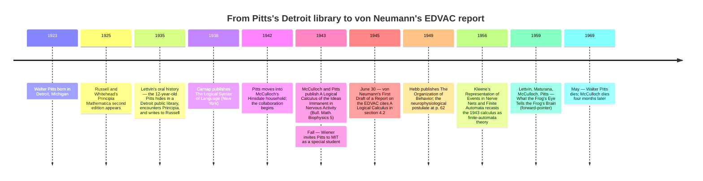

:::tip[In one paragraph]
In 1943, Warren McCulloch and Walter Pitts published "A Logical Calculus of the Ideas Immanent in Nervous Activity" in the *Bulletin of Mathematical Biophysics*. They did not invent the mathematical study of neurons — Nicolas Rashevsky's biophysics community already existed at Chicago — but they replaced its continuous differential equations with the propositional logic of Carnap and Russell-Whitehead. Von Neumann's 1945 *First Draft of a Report on the EDVAC* explicitly cites their paper while discussing simplified neuron functions and computing elements.
:::

<strong>Cast of characters</strong>

| Name | Lifespan | Role |
|---|---|---|
| Warren McCulloch | 1898–1969 | Neurophysiologist; in 1943 affiliated jointly with the Department of Psychiatry at the Illinois Neuropsychiatric Institute and the University of Chicago. Co-author of "A Logical Calculus of the Ideas Immanent in Nervous Activity" (1943). |
| Walter Pitts | 1923–1969 | Self-educated logician; co-author of the 1943 paper at age 19–20; subsequently a "special student" at MIT under Wiener. The popular early-life scenes rely heavily on later oral history. |
| Jerome Lettvin | 1920–2011 | University of Illinois medical student in the early 1940s; introduced Pitts to McCulloch and is the source for nearly every popular Pitts-biography scene (recorded in *Talking Nets*, 2000). Co-author of the 1959 frog's-eye paper. |
| Nicolas Rashevsky | 1899–1972 | Mathematical biophysicist at the University of Chicago; founder and editor of the *Bulletin of Mathematical Biophysics* — the journal that published the 1943 paper. The institutional context the chapter must keep in view. |
| Donald Hebb | 1904–1985 | Canadian psychologist at McGill; *The Organization of Behavior* (1949) proposes a cellular account of learning. Its postulate appears at p. 62; p. 63 separates it from a particular anatomical mechanism for which direct evidence was lacking. |
| John von Neumann | 1903–1957 | His June 1945 *First Draft of a Report on the EDVAC* cites "A Logical Calculus" in §4.2, then connects simplified neuron functions to relays and vacuum tubes (printed pp. 12–13). |

<strong>Timeline (1923–1969)</strong>

```mermaid
timeline
    title From Pitts's Detroit library to von Neumann's EDVAC report
    1923 : Walter Pitts born in Detroit, Michigan
    1925 : Russell and Whitehead's Principia Mathematica second edition appears
    1935 : Lettvin's oral history — the 12-year-old Pitts hides in a Detroit public library, encounters Principia, and writes to Russell
    1938 : Carnap publishes The Logical Syntax of Language (New York)
    1942 : Pitts moves into McCulloch's Hinsdale household; the collaboration begins
    1943 : McCulloch and Pitts publish A Logical Calculus of the Ideas Immanent in Nervous Activity (Bull. Math. Biophysics 5)
         : Fall — Wiener invites Pitts to MIT as a special student
    1945 : June 30 — von Neumann's First Draft of a Report on the EDVAC cites A Logical Calculus in section 4.2
    1949 : Hebb publishes The Organization of Behavior; the neurophysiological postulate at p. 62
    1956 : Kleene's Representation of Events in Nerve Nets and Finite Automata recasts the 1943 calculus as finite-automata theory
    1959 : Lettvin, Maturana, McCulloch, Pitts — What the Frog's Eye Tells the Frog's Brain (forward-pointer)
    1969 : May — Walter Pitts dies; McCulloch dies four months later
```

<strong>Plain-words glossary</strong>

- **All-or-none neuron** — Idealisation of the biological neuron in which firing is binary: at any time step the neuron either fires (output 1) or does not (output 0). One of the five assumptions on visible p. 101 of the 1990 reprint of the 1943 paper.
- **Threshold-logic gate** — A unit that fires when enough excitatory synapses are active and no inhibitory input blocks it. The paper constructs conjunction, disjunction, and *conjoined negation*: one input excites the output while another can inhibit it.
- **Net without circles** — A McCulloch-Pitts network with no feedback loops. Its realizability results require the paper's stated truth-table and temporal-expression conditions; they do not license an unqualified claim about every logical form.
- **Net with circles** — A network containing feedback loops, so present firing can depend on earlier activity. Kleene later treats such nets in a finite-state framework under stated conditions; this does not make an entire biological nervous system a finite automaton.
- **Theorem 7** — A representation result for the paper's specified rule of synaptic alteration: the assumed connection changes can be represented by a fixed net with circles ([1990 reprint, visible p. 108](https://www.cs.cmu.edu/~epxing/Class/10715/reading/McCulloch.and.Pitts.pdf#page=10)). This does not guarantee that the rule will train a network to perform a chosen task.
- **Hebbian postulate** — Hebb's 1949 hypothesis that when cell A repeatedly helps fire cell B, growth or metabolic change increases A's effectiveness in doing so. This is a proposed cellular process, not evidence of successful training on a chosen task ([printed p. 62](https://pure.mpg.de/rest/items/item_2346268/component/file_2346267/content#page=80)).

How much of a neuron can you leave out and still reason about its behavior? McCulloch and Pitts's 1943 paper makes a deliberate simplification: treat a firing event as a proposition, then describe connections in symbolic logic. We can inspect what follows from their assumptions without treating the construction as a complete biological account. The useful questions are concrete: what does this circuit do, which assumptions make it work, and what would still be needed for it to learn a chosen task?

To understand how this abstraction came to be, we must look at the unlikely collaboration that produced it. The popular history of Walter Pitts's life is often rendered in dramatic, almost mythological terms. Much of what is commonly repeated about his early years traces through the oral history of his friend and colleague Jerome Lettvin, recorded decades later and preserved in subsequent biographical accounts—and these events are best read as Lettvin's oral-history reconstructions, not as settled documentary facts. In the version Lettvin remembered, Pitts was born in Detroit in 1923. He is said to have sought refuge from neighborhood bullies by hiding in a public library in 1935. According to this reconstruction, the twelve-year-old Pitts encountered Bertrand Russell and Alfred North Whitehead's monumental *Principia Mathematica*. He reportedly read its extensive volumes over three days, identified errors in its formidable logic, and wrote a letter directly to Russell. Russell reportedly replied, acknowledging the corrections and inviting the young prodigy to study at Cambridge—an invitation the twelve-year-old boy could not accept.

Three years later, in 1938, Lettvin's account claims that upon hearing Russell would be visiting the University of Chicago, the fifteen-year-old Pitts ran away from Detroit to Chicago, never to see his family again. By the early 1940s, Pitts was reportedly hanging around the University of Chicago campus, working menial jobs and sneaking into Russell's lectures. It was during this period that Lettvin, then a University of Illinois medical student, introduced Pitts to Warren McCulloch.

McCulloch, born around 1898, was a neurophysiologist of a vastly different background. He had studied mathematics at Haverford College, philosophy and psychology at Yale, and had taken a medical degree at Columbia with a focus on neurophysiology. He was forty-two years old when he met the eighteen- or nineteen-year-old Pitts. In the early 1940s, McCulloch was affiliated with both the Department of Psychiatry at the Illinois Neuropsychiatric Institute, College of Medicine at the University of Illinois, and the University of Chicago. Recognizing the younger man's extraordinary facility for symbolic logic, McCulloch invited Pitts to live with him and his family in Hinsdale, Illinois. It was in this household that the two began the intensive collaboration that would result in the 1943 paper. Their paper represented idealized neural activity in discrete logical terms.

This telling follows Amanda Gefter's [2015 account in *Nautilus*](https://nautil.us/the-man-who-tried-to-redeem-the-world-with-logic-235253/), whose references include Lettvin's later oral history in *Talking Nets*. That is the attribution chain for the scenes here, rather than independent documentary confirmation of the library episode or Russell letter. Smalheiser's 2000 biography is a further research lead, but its full text has not been inspected for this chapter. The collaboration can be studied directly through the published paper even where the early-life anecdotes remain uncertain.

Pitts's intellectual reputation, once it had a setting, extended well beyond Hinsdale. In late 1943 Norbert Wiener invited Pitts to MIT as a "special student"—a doctoral track despite the absence of any formal high-school credential—and Pitts moved to Cambridge, Massachusetts. He wrote McCulloch from MIT that December that he now understood "at once some seven-eighths of what Wiener says, which I am told is something of an achievement," a private letter preserved in the McCulloch Papers (BM139) at the American Philosophical Society and quoted by Gefter. Four years later McCulloch wrote to Rudolf Carnap describing Pitts as "the most omnivorous of scientists and scholars" and adding that "in my long life, I have never seen a man so erudite or so really practical." Both attestations are reported through Gefter's reading of the McCulloch correspondence and remain provisional until cross-anchored at the archive itself; neither is essential to the chapter's argument. These reported letters do not establish how the paper reached von Neumann.

## The Chicago Mathematical Biophysics Setting

It is a common misconception that McCulloch and Pitts were the first to bring mathematics to the study of neurons. As the philosopher Gualtiero Piccinini has observed, in 1943 there already existed a lively community of biophysicists doing mathematical work on neural networks. This community was centered at the University of Chicago around Nicolas Rashevsky, who founded and edited the *Bulletin of Mathematical Biophysics*. This journal was the primary venue for mathematical approaches to biology at the time, and it was precisely where the 1943 McCulloch-Pitts paper would be published.

McCulloch had been searching for a logical foundation for nervous activity since his years at Yale and Columbia. He envisioned a Leibnizian project—an "alphabet of thought" where the complex, messy operations of the mind could be reduced to discrete, fundamental logical units. However, the prevailing mathematical biophysics of the Rashevsky school was built on continuous mathematics. It modeled the diffusion of chemical exciters and the smooth, continuous dynamics of electrical potentials in the cell membrane. McCulloch required a different symbolic apparatus to represent thought as computation.

He found it in the mathematical logic of the era. The 1943 paper explicitly adopted the symbolic notation of Rudolf Carnap's 1938 *The Logical Syntax of Language*, referring to it as "Language II of Carnap," and augmented it with notations drawn from the second edition of Russell and Whitehead's *Principia Mathematica* (published between 1925 and 1927). Hilbert and Ackermann appear too, but the paper's citations disagree: the literature list prints 1927, while the Theorem 3 discussion prints 1938 ([reprint pp. 104 and 115](https://www.cs.cmu.edu/~epxing/Class/10715/reading/McCulloch.and.Pitts.pdf#page=17)). Independent edition metadata identifies a 1928 edition of their *Grundzüge der theoretischen Logik*; that does not establish which edition the authors used. The 1943 paper did not take its decisive novelty from Rashevsky-style biophysics; it borrowed the symbolic technology of the 1920s and 1930s mathematical-logic tradition. Carnap, Russell, and Hilbert provided the syntax; Pitts provided the technical capability to wield it.

The choice of venue carried its own weight. The *Bulletin of Mathematical Biophysics* was a Rashevsky-controlled journal, and to publish there was to publish inside the existing community rather than outside it. McCulloch's joint affiliation across the Illinois Neuropsychiatric Institute and the University of Chicago—reproduced verbatim in the author block on [visible reprint p. 99](https://www.cs.cmu.edu/~epxing/Class/10715/reading/McCulloch.and.Pitts.pdf#page=1)—placed the paper at the seam between clinical neurophysiology and the Chicago mathematical-biophysics circle. Pitts, with no formal affiliation, appeared on the page as McCulloch's collaborator rather than as anyone's student.

Piccinini locates the 1943 paper's contribution in its use of symbolic logic and computation within an existing mathematical-biophysics community. Hebb's 1949 introduction names Rashevsky, Pitts, Householder, Landahl, McCulloch and others working mathematically on populations of neurons. He also qualifies the discussion: the preliminary studies had greatly simplified the psychological problem, and further results were needed before their success could be judged ([printed xi–xii; scan pages 7–8](https://pure.mpg.de/rest/items/item_2346268/component/file_2346267/content#page=7)). The list supplies context; it does not establish a chain of influence.

## The 1943 Paper, Read Slowly

The 1943 paper, "A Logical Calculus of the Ideas Immanent in Nervous Activity," opens with a bold abstract declaration: "neural events and the relations among them can be treated by means of propositional logic." To read the paper slowly is to witness the deliberate construction of a new theoretical universe, built meticulously upon a set of explicit, idealized biological axioms.

In Section 2 of the paper, titled "The Theory: Nets Without Circles," the authors lay out five physical assumptions that form the foundation of their calculus. First, they assumed that the activity of the neuron is an "all-or-none" process. Second, a certain fixed number of synapses must be excited within the period of latent addition in order to excite a neuron at any time, and this number is independent of previous activity and position on the neuron. Third, they posited that the only significant delay within the nervous system is synaptic delay. Fourth, the activity of any inhibitory synapse absolutely prevents excitation of the neuron at that time. Finally, and perhaps most crucially for their later arguments, they assumed that the structure of the net does not change with time.

The five assumptions begin on visible p. 101 of the [1990 reprint](https://www.cs.cmu.edu/~epxing/Class/10715/reading/McCulloch.and.Pitts.pdf). Its introduction (visible pp. 99–100) gives the biological background the authors were abstracting from: axonal conduction below 1 metre per second in thin axons and above 150 in thick ones, latent addition below 0.25 milliseconds, and synaptic delay above 0.5 milliseconds. Those are the paper's reported figures, not present-day physiological constants. The formal model replaces these different physical times with discrete steps measured in synaptic delays. The page references in this discussion use the visible reprint labels; its pagination differs from the original article.

Having established these physical constraints, McCulloch and Pitts introduced their symbolic notation. They denoted the proposition "neuron $i$ fires at time $t$" by the expression $N_i(t)$. To handle the progression of time across synapses, they defined a temporal-shift functor $S$, such that $S(P)(t) \equiv P(t-1)$. This meant that if a neuron fired, the logical consequence of that firing would propagate to the next neuron with a precise delay of one time step. The notational apparatus drew on three traditions at once: Carnap's syntactical conventions appeared in boldface, the *Principia* tradition supplied dots as grouping devices, and an inverted-E existential operator was, for typographical convenience in the journal's typesetting, replaced by an upright `E`. An arrow stood for implication. The reader of the 1943 paper was assumed to have absorbed *Principia Mathematica* and *The Logical Syntax of Language* as background; the paper made no concession to a reader unfamiliar with formal logic.

Figure 1 turns the notation into small networks. Its conjunction network needs both inputs; its disjunction network needs either one. The inhibition example is more revealing: Figure 1d represents $N_3(t) \equiv N_1(t-1) \land \neg N_2(t-1)$. Input 1 must excite the output, and input 2 must not inhibit it. This is **conjoined negation**, not a standalone NOT gate. The one-step delay also matters: the output at time $t$ depends on the inputs at the preceding step (reprint pp. 104–105).

### Try the Abstraction: Will the Output Fire?

Try Figure 1d in the [1990 reprint, visible p. 105](https://www.cs.cmu.edu/~epxing/Class/10715/reading/McCulloch.and.Pitts.pdf#page=7). This is a reader exercise derived from its formula, not a historical experiment or a measurement of biological neurons. Input 1 supplies excitation; input 2 supplies inhibition. The output at the next step is:

$N_3(t) = N_1(t-1) \land \neg N_2(t-1).$

Before opening the answer, fill in the four outputs. A `1` means firing; a `0` means silence.

| Input 1 at the preceding step | Input 2 at the preceding step | Output at the next step |
|---|---|---|
| 0 | 0 | Predict |
| 0 | 1 | Predict |
| 1 | 0 | Predict |
| 1 | 1 | Predict |

Check your four predictions

The outputs, in row order, are **0, 0, 1, 0**. Only the third row provides excitation without inhibition. In the first row nothing inhibits the output, but nothing excites it either. That is why this circuit expresses *input 1 AND NOT input 2*, rather than simply *NOT input 2*. All four answers concern the next step; they do not imply an instantaneous response.

Now change the question: suppose the desired next-step outputs are `1, 0, 1, 0`. Can this same formula produce them? Identify the row that decides the question before opening the explanation.

Check the changed specification

No. The first row now requires firing when both inputs are silent, but the formula produces `0`. Those desired outputs describe NOT input 2. This mismatch proves that the displayed formula does not meet the new specification; it does not prove that every possible network construction is incapable of doing so. Specifying a behavior, constructing a network that realizes it, and finding a way to learn that behavior are separate tasks. The four-row calculation addresses the first two for this one fixed circuit; it supplies no learning procedure.

The paper builds larger networks from these operations and delays, but it states conditions on the expressions it can realize. Theorem 2 concerns its defined *temporal propositional expressions* and nets of order zero—nets without circles. The preceding discussion distinguishes narrow and extended realizability and uses the extended sense for the following theorems. Theorem 3 supplies further conditions on when a logical sentence qualifies (reprint pp. 102–104). The result is a correspondence within that formal model, not a promise that any arbitrarily written logical sentence has the same construction.

Nor does a formula pick out a unique network. After the Theorem 2 construction, the authors explicitly allow an indefinite number of topologically different nets realizing the same temporal propositional expression (reprint p. 104). That distinction gives the diagrams their practical interest: a specified behavior can have more than one implementation. The formal result concerns idealized neurons under the paper's assumptions; it does not establish that biological nervous systems are literally deductive-logic machines.

## What the Paper Said About Learning

How could a fixed wiring diagram represent a lasting change? McCulloch and Pitts confronted that question in their introduction. They distinguished temporary changes in responsiveness from learning that permanently altered a net, then proposed equivalent fictitious nets with fixed connections and thresholds. They explicitly warned that formal equivalence was not a factual explanation of the physiological changes ([1990 reprint, visible p. 101](https://www.cs.cmu.edu/~epxing/Class/10715/reading/McCulloch.and.Pitts.pdf#page=3)).

Their treatment was more specific than simply assuming that learning happened somehow. Near the end of Section 2 (visible p. 108), they supposed that an initially ineffective axonal termination became an ordinary excitatory synapse when its excitation coincided with firing of the succeeding neuron. That is an activity-dependent rule for changing a connection within the model. Theorem 7 then replaces such alterable synapses with circles, using Figure 1i. The result concerns representing the assumed alteration; it does not establish that this rule will train a network to solve a chosen task ([reprint p. 108](https://www.cs.cmu.edu/~epxing/Class/10715/reading/McCulloch.and.Pitts.pdf#page=10)).

Section 3 turns to nets with circles. Activity could keep circulating for an indefinite time, allowing a much earlier input to remain relevant. Persistence matters, but it should not be confused with unlimited storage. A later treatment makes that boundary clearer.

In his 1956 *Representation of Events in Nerve Nets and Finite Automata*, Stephen Kleene treated a McCulloch–Pitts net as a particular finite automaton. His Theorem 3 constructs nerve-net representations of regular events with specified timing and suitable initial states; Theorem 5 gives the reverse regularity result for finite automata started in a specified internal state. Together, they connect a defined class of input histories to these finite-state representations—not to arbitrary computation ([standalone reproduction, pp. 31 and 37, §§7.3 and 9](https://www.dlsi.ua.es/~mlf/nnafmc/papers/kleene56representation.pdf#page=31)).

Kleene explicitly distinguished this finite-state setting from a Turing machine when its unbounded tape is included as part of the machine ([reproduction p. 40](https://www.dlsi.ua.es/~mlf/nnafmc/papers/kleene56representation.pdf#page=40)). The connection is a qualified mathematical relationship in a later formulation, not a theorem identifying the whole biological nervous system with a finite automaton. The page numbers here refer to the linked reproduction; they are not a conversion to the original book's pagination.

## The Hebbian Bridge

What physical change could make experience matter to a neuron? In *The Organization of Behavior* (1949), Donald O. Hebb proposes an account at the level of cells. Chapter 4 opens with the idea that repeated stimulation slowly forms an assembly whose activity can persist briefly after stimulation ends, allowing time for structural change ([printed p. 60](https://pure.mpg.de/rest/items/item_2346268/component/file_2346267/content#page=78)). This is his proposed explanation, not an observation of an assembly forming.

At printed page 62, Hebb states the postulate: if cell A repeatedly or persistently participates in firing cell B, growth or metabolic change in one or both cells increases A's effectiveness in firing B. The surrounding discussion considers a temporary reverberating activity working with a more lasting structural change ([printed p. 62](https://pure.mpg.de/rest/items/item_2346268/component/file_2346267/content#page=80)). The question is how repeated activity could leave a lasting effect.

The next page introduces a distinction worth pausing over. Hebb discusses a particular synaptic-knob mechanism, but explicitly says direct evidence for it is lacking. His subsequent argument depends on the more general postulate, rather than on that specific anatomical proposal ([printed p. 63](https://pure.mpg.de/rest/items/item_2346268/component/file_2346267/content#page=81)).

**Before reading on:** if the proposed synaptic-knob mechanism turned out to be wrong, would that alone disprove the more general postulate?

Separate the postulate from the mechanism

No. A claim that repeated participation increases a cell's effectiveness is broader than a claim about the anatomical process that produces that increase. Rejecting one proposed mechanism would not, by itself, reject every way the general postulate might be realized. It would not prove the postulate either: each claim still needs evidence appropriate to it.

In these inspected passages, Hebb offers a verbal cellular hypothesis, not a worked procedure for training an artificial network on a selected task. That is a useful limit on what we can infer here. It does not justify a claim about every equation, time scale or quantitative rule elsewhere in the book, nor establish the later history of rules called Hebbian.

The two questions should remain separate. Theorem 7 concerns a model's assumed connection changes and their representation by circuits; it does not establish that every form of biological learning preserves a logical structure. The authors themselves distinguish formal equivalence from physiological explanation ([reprint p. 101](https://www.cs.cmu.edu/~epxing/Class/10715/reading/McCulloch.and.Pitts.pdf#page=3)). We can now distinguish three questions: what might change in nervous tissue, what a chosen circuit represents, and how a system could learn a desired behavior. A construction that answers one does not automatically answer the others.

## What the Abstraction Made Possible

These distinctions also help us assess the paper's historical reach. Piccinini's historical interpretation identifies four major contributions of the 1943 paper: it introduced a formalism whose refinement led directly to the theory of finite automata; it provided a technique that inspired digital logic design; it marked the first use of computation to address the mind-body problem; and it stood as the first modern computational theory of mind and brain.

One connection can be checked directly in a later technical report. What could an idealized neuron have to do with a computing machine? John von Neumann's *First Draft of a Report on the EDVAC*, dated June 30, 1945, gives us a concrete connection. In §4.2, the report explicitly cites Pitts and McCulloch's 1943 paper while setting aside complications of neuron functioning. The following paragraph says that the simplified functions can be imitated by telegraph relays or vacuum tubes ([printed pp. 12–13; archive scan pages 35 and 37](https://archive.org/download/firstdraftofrepo00vonn/firstdraftofrepo00vonn.pdf#page=35)). The interesting move is the comparison itself: a proposed computing element and an idealized neuron could perform the same simplified function. This passage documents that connection; it does not establish that the paper was the report's only citation or explain the whole subsequent development of computer architecture.

The comparison with computing elements does not settle what real neurons do. In 1959, Lettvin, Maturana, McCulloch, and Pitts investigated a different question: what information does a frog's eye send to its brain? Recording individual optic-nerve fibers, they found responses chiefly associated with local patterns of light variation. Their paper, [*What the Frog's Eye Tells the Frog's Brain*](https://stuff.mit.edu/afs/athena/course/9/9.49/www/Supplementary/Frog.pdf#page=1), argued that the eye was already organizing visual information before sending it onward. The authors explicitly restricted their interpretation to frogs. That gives us a concrete question to carry forward: how much processing has already happened before a signal reaches the brain?

The 1943 paper gives us a precise question to ask of a model: under its stated assumptions, which patterns of activity can a network express? McCulloch and Pitts answered that question through logical constructions using idealized neurons. A construction within those assumptions is not proof that the mind works that way. Keeping that boundary visible makes the result more useful: we can test what the abstraction does without confusing it with everything a living nervous system does.

## Sources and reading notes

- McCulloch and Pitts, [“A Logical Calculus of the Ideas Immanent in Nervous Activity” (1943), 1990 reprint](https://www.cs.cmu.edu/~epxing/Class/10715/reading/McCulloch.and.Pitts.pdf). The inspected reprint has visible pages 99–115; its footer gives the original article's pages 115–133. Those are different pagination systems, not a verified page-by-page conversion.
- Hebb, [*The Organization of Behavior* (1949)](https://pure.mpg.de/rest/items/item_2346268/component/file_2346267/content). The passages used here are printed xi–xii and 60, 62–63; links above point to the corresponding scan pages.
- Von Neumann, [*First Draft of a Report on the EDVAC* (1945)](https://archive.org/download/firstdraftofrepo00vonn/firstdraftofrepo00vonn.pdf), §4.2 and the following paragraph, printed 12–13. This establishes the cited connection, not a complete influence history.
- Kleene, [“Representation of Events in Nerve Nets and Finite Automata” (1956), reproduction](https://www.dlsi.ua.es/~mlf/nnafmc/papers/kleene56representation.pdf). The linked reproduction's pages 31, 37 and 40 supply the finite-state and initial-state qualifications discussed above.
- Lettvin, Maturana, McCulloch and Pitts, [“What the Frog's Eye Tells the Frog's Brain” (1959)](https://stuff.mit.edu/afs/athena/course/9/9.49/www/Supplementary/Frog.pdf), printed 1940 and 1950. The forward pointer uses the reported eye findings, not an inferred private reaction.
- Piccinini, [“The First Computational Theory of Mind and Brain” (2004)](https://link.springer.com/article/10.1023/B:SYNT.0000043018.52445.3e). The historical interpretation cited here is supported at abstract level; the article body was not available for this review.
- Gefter, [“The Man Who Tried to Redeem the World with Logic” (2015)](https://nautil.us/the-man-who-tried-to-redeem-the-world-with-logic-235253/). A secondary narrative source for the biographical passages and reported correspondence; attribution does not turn those episodes into independently verified archival facts.
