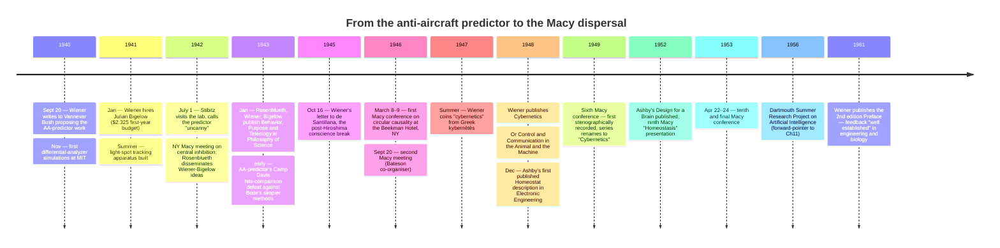

:::tip[In one paragraph]
Between 1940 and 1953 a parallel research program took shape — built on physical feedback machines, interdisciplinary lab meetings, and a vocabulary of steering and homeostasis rather than logic. Cybernetics had its own failed weapons program (Wiener's anti-aircraft predictor), founding paper (Rosenblueth, Wiener, and Bigelow 1943), institutional venue (the Macy Conferences at the Beekman Hotel), and canonical machine (Ashby's Homeostat). By 1953 it had dispersed — information theory absorbed the symbolic side, control engineering the analog, neurophysiology kept the McCulloch-Pitts substrate, and the "thinking machine" question went to Dartmouth in 1956.
:::

<strong>Cast of characters</strong>

| Name | Lifespan | Role |
|---|---|---|
| Norbert Wiener | 1894–1964 | Professor of Mathematics, MIT. Anti-aircraft predictor work (1940–1943); co-author of the 1943 paper; coined "cybernetics" from Greek *kybernētēs* in summer 1947; published *Cybernetics* in 1948. Withdrew from classified weapons work after Hiroshima. |
| Julian Bigelow | 1913–2003 | MIT-trained electrical engineer; hired by Wiener in January 1941 for the AA-predictor circuits. Designed the deliberately-sluggish "pilot" control stick that mimicked human reaction lag in the 1941 light-spot tracking apparatus. Co-author of the 1943 paper. |
| Arturo Rosenblueth | 1900–1970 | Cardiologist and physiologist; with Wiener at the Harvard Medical School discussion group until 1944. Diagnosed "purpose tremor" as the cerebellar-feedback condition that became the bridge between the AA-predictor work and the 1943 redefinition of teleology. Co-author of "Behavior, Purpose and Teleology." |
| Warren McCulloch | 1898–1969 | Neurophysiologist; chairman and intellectual moderator of the Macy Conferences from 1946. Architect of the strict disciplinary-parity attendance policy. Cross-link to Ch5 for the 1943 Pitts-McCulloch logical calculus. |
| W. Ross Ashby | 1903–1972 | Director of Research, Barnwood House Hospital, Gloucester. Designed the Homeostat (first published 1948 in *Electronic Engineering*; formalised in the 1952 *Design for a Brain* book). Presented "Homeostasis" at the ninth Macy Conference (1952). Refused to call his machine "intelligent" — only "ultrastable." |
| Gregory Bateson | 1904–1980 | Anthropologist; co-organiser of the second Macy meeting on "Teleological Mechanisms in Society" (20 September 1946). Coined the closing line: "I think that cybernetics is the biggest bite out of the fruit of the Tree of Knowledge that mankind has taken in the last 2000 years." |

<strong>Timeline (1940–1961)</strong>

<strong>Plain-words glossary</strong>

- **Cybernetics** — Wiener's 1947 coinage from Greek *kybernētēs* ("steersman") for the interdisciplinary study of control and communication in animals and machines. The term named the field; the field had been forming since 1942 under earlier labels ("circular causal mechanisms," "feedback").
- **Negative feedback** — A control loop in which a system measures the difference between its current state and a target state, and uses that error signal to drive its next action so as to *reduce* the error. The thermostat is the textbook example. Cybernetics elevated negative feedback from a control-engineering term to the operational definition of *purpose*.
- **Teleology (cybernetic sense)** — In the Rosenblueth-Wiener-Bigelow 1943 paper, "teleological behavior" is recast in strictly mechanical terms: behaviour controlled by negative feedback. A torpedo with a target-seeker is teleological by this definition; metaphysical readings of teleology as a future-cause-acting-on-the-present are dropped.
- **Macy Conferences** — A series of ten closed interdisciplinary meetings (1946–1953), sponsored by the Josiah Macy, Jr. Foundation, organised by Frank Fremont-Smith and chaired by McCulloch. Approximately 20 attendees per meeting under a strict disciplinary-parity policy. The first five had no stenographic record; conferences 6–10 (1949–1953) were transcribed by Heinz von Foerster.
- **Servo-mechanism** — The control-engineering term for a feedback-driven system that drives an output to match a target input — gun aimers, autopilots, factory positioners. The 1943 paper deliberately equated "servo-mechanism" with cybernetic teleology.
- **Homeostat** — Ashby's 1948 electromechanical demonstration of an *ultrastable* system: four units with pivoted magnets, water-trough electrodes, triode outputs, and 25-position stepping switches that searched 781,250 configurations until the magnets returned to centre. Demonstrated equilibrium-finding, not symbol manipulation. Ashby refused the adjective "homeostatic" — that priority belonged to Cannon's 1932 coinage.

On September 20, 1940, as the German Luftwaffe waged an aerial campaign against Britain that had escalated significantly after "The Day of the Eagle" in August, mathematician Norbert Wiener wrote to Vannevar Bush. Seeking a role in the unfolding war effort, Wiener offered to find some "corner of activity" in which he might be of use during the emergency. His specific proposal focused on anti-aircraft fire control. The challenge of shooting down a maneuvering airplane was fundamentally a problem of extrapolation: the anti-aircraft gun needed to fire not at where the plane was, but at where it would be when the shell arrived.

By November 1940, Wiener was testing his theoretical models for this anti-aircraft predictor on Bush's mechanical differential analyzer at the Massachusetts Institute of Technology, simulating straight-line, doubled slope, parabolic, and semicircle-integral trajectory types. Realizing he needed engineering expertise to translate his statistical theories into functional hardware, Wiener hired Julian Bigelow, an MIT-trained electrical engineer, in January 1941. The project was funded by the National Defense Research Committee's Section D-2, directed by Warren Weaver. The scale of the endeavor was decidedly modest; its first-year budget was just $2,325, with $1,200 allocated for circuit building and approximately $450 for three man-months of time on the differential analyzer. Compared to the massive federal expenditures that would soon pour into the Radiation Laboratory and the Manhattan Project, the anti-aircraft predictor was an infinitesimal operation.

That small budget matters because it fixes the project in the material world it actually occupied. This was not a general wartime computing program waiting to become software. It was a narrowly specified analog fire-control experiment, built around the available machinery of MIT and the immediate operational problem of delayed response. The differential analyzer could simulate curves, but it did not turn Wiener's theory into a reusable digital procedure. The proposed predictor had to be embodied as circuits, filters, controls, and test tracks. Even the patent arrangements followed the earlier servomechanism program, underscoring that the institutional category available to the project was not "thinking machine" but feedback apparatus.

During the summer of 1941, Wiener and Bigelow constructed their simulation hardware in an MIT laboratory. The apparatus featured a light-spot projector that threw an irregular, bouncing white spot onto a wall. Bigelow, who was an active pilot, designed a deliberately sluggish control stick intended "to have the 'feel' of an actual control" to mimic the inherent physiological lag of a human operator. An operator would use this stick to guide a second colored spot in pursuit of the first, generating tracking data that fed directly into the predictor circuits.

The scene was deliberately artificial, but the artificiality was the point. A plane under fire could not be brought into the laboratory. A pilot's evasive behavior had to be compressed into a manipulable trace: a spot on a wall, a lagging human hand, a second spot trying to follow the first, and circuits trying to infer the next position from the recent past. The predictor's scientific premise was therefore already behavioral. It did not model the pilot's intentions by asking what the pilot believed or feared. It modeled the pilot as a pattern of corrections under constraint, a body and machine together trying to reduce positional error while the target moved.

For a time, the engineering results seemed remarkably promising. On July 1, 1942, George Stibitz of Bell Laboratories visited the laboratory and observed the predictor in action. He recorded in his diary that for lead times of approximately two seconds, Wiener and Bigelow's statistical predictor "accomplishes miracles." The demonstration was so impressive that Stibitz noted Warren Weaver "threatens to bring along a hack saw on the next visit and cut through the legs of the table to see if they do not have some hidden wires somewhere."

Yet, the project's ultimate verdict would not be determined by laboratory demonstrations, but by hard tracking data. In late 1942, the team analyzed flight tracks 303 and 304, recorded at one-second intervals by the Anti-Aircraft Board at Camp Davis, North Carolina. In December 1942 and January 1943, Wiener compiled a hits-comparison chart for Weaver, matching his statistical method against two simpler geometric predictors developed by Hendrik Bode at Bell Laboratories. The results demonstrated that the statistical predictor was a near-miss. On track 303, Bode's simple method scored 6 hits, Bode's ten-second method scored 22, and Wiener's complex statistical method scored 23. On track 304, Bode's simple method scored 35, the ten-second method scored 55, and Wiener's method scored only 49. As a functional weapon, the predictor was at most marginally better on one track and strictly inferior on the other.

Wiener recommended halting further research on the predictor until after the war. In early 1943, he wrote to Weaver acknowledging the defeat: "I still wish that I had been able to produce something to kill a few of the enemy instead merely of showing how not to try to kill them."

The conflict in the record is important. Stibitz's July 1942 diary captured a real engineering effect; the device could look astonishing when the laboratory target moved smoothly enough for the statistical apparatus to get ahead of it. The Camp Davis comparison captured a different truth: against actual tracking data, the sophisticated statistical predictor did not justify itself over Bode's simpler geometric extrapolators. Cybernetics would grow out of both facts at once. Its first machine was neither a triumph nor an embarrassment to be forgotten. It was an engineering near-miss whose conceptual yield exceeded its weapons yield.

## Behavior, Purpose, Teleology

While the anti-aircraft predictor failed as a military weapon, it succeeded as a conceptual crucible. The engineering framework that Wiener and Bigelow had built to model a pilot evading anti-aircraft fire treated the human operator not as a conscious entity making free choices, but as a component attempting to minimize the error between a target and a current position. The pilot under flak operated "like a servo-mechanism, attempting to overcome the intrinsic lag due to the dynamics of his plane."

To formalize this insight, Wiener and Bigelow sought out Arturo Rosenblueth, a cardiologist and physiologist then working with Wiener in a Harvard Medical School discussion group. They presented Rosenblueth with a specific clinical question: was there any known pathological condition in which a patient, attempting to perform a voluntary action such as picking up a glass of water, overshoots the mark and falls into an uncontrollable oscillation? Rosenblueth answered immediately. The condition was known as "purpose tremor," and it was characteristically associated with cerebellar injury. To Wiener and Bigelow, the implication was clear: the neurologically impaired patient behaved exactly like a mechanical feedback system suffering from insufficient damping.

This interdisciplinary synthesis culminated in the January 1943 publication of "Behavior, Purpose and Teleology," co-authored by Rosenblueth, Wiener, and Bigelow. Crucially, the paper was not placed in an engineering or physiological journal, but appeared in *Philosophy of Science*, a venue that framed the paper's ambitions broadly. In just seven dense pages, the authors proposed a comprehensive behaviorist taxonomy that encompassed both living organisms and machines. Behavior, they argued, could be classified as either active or passive; active behavior was either purposeful or purposeless (random); purposeful behavior was either feedback or non-feedback; and feedback behavior was predictive or non-predictive. They further categorized predictive behavior into orders, comparing first-order prediction to a cat chasing a mouse, second-order prediction to throwing a stone at a moving target, and higher orders to the use of a sling or bow.

The order of that taxonomy did philosophical work. The authors did not begin with mind, consciousness, or representation. They began with observable behavior and with the source of energy that made action possible. Passive behavior was behavior in which the object did not supply the energy for the response. Active behavior did. From there the key division was whether the activity could be interpreted as directed toward a final condition or whether it was random. Only after those distinctions were in place did feedback enter the argument. Feedback was not a decorative metaphor; it was the mechanism that allowed purpose to be treated as an operational property rather than an inner state.

The paper's most radical philosophical maneuver was its redefinition of teleology. Historically regarded as a metaphysical embarrassment that implied future causes acting on present events, teleology was recast in strictly mechanical terms. "Teleological behavior thus becomes synonymous with behavior controlled by negative feedback," the authors wrote. Under this definition, a torpedo equipped with a target-seeking mechanism was intrinsically purposeful, and the engineering term "servo-mechanism" was precisely the correct designation for it.

Prediction sharpened the claim. A non-predictive feedback system could correct only against the present error between its current state and its goal. A predictive feedback system could act on the future position implied by the target's motion. That was exactly the wartime problem Wiener and Bigelow had just failed to solve well enough for anti-aircraft fire control. The 1943 paper preserved the intellectual structure of that failure while stripping away the classified weapon. The moving aircraft became a general case of pursuit; the operator's lag became a general problem of error correction; the predictor became one member in a family of purposive mechanisms.

To illustrate how biological systems relied on these same principles, they deployed the cerebellar-disease analogy that had sparked their collaboration: "If he is asked to carry a glass of water from a table to his mouth, however, the hand carrying the glass will execute a series of oscillatory motions of increasing amplitude as the glass approaches his mouth, so that the water will spill and the purpose will not be fulfilled." Consequently, the authors "venture to suggest that the main function of the cerebellum is the control of the feed-back nervous mechanisms involved in purposeful motor activity." Purpose was no longer an unobservable mental state; it was a measurable property of an error-correcting mechanical loop.

## The Macy Conferences

The vocabulary of feedback, error correction, and circular causality quickly found institutional momentum. In 1942, Rosenblueth disseminated the early Wiener-Bigelow ideas at a New York meeting on central inhibition sponsored by the Josiah Macy, Jr. Foundation, an event attended by the neurophysiologist Warren S. McCulloch. By late winter of 1943-1944, Wiener and the mathematician John von Neumann convened a joint meeting in Princeton that brought together engineers, physiologists, and mathematicians. McCulloch and Lorente de Nó represented the physiologists, Herman Goldstine attended as a computing-machine designer, while von Neumann, Walter Pitts, and Wiener represented mathematics. At the conclusion of the Princeton gathering, it had become clear to all that there was a substantial common basis of ideas, and that some attempt should be made to achieve a common vocabulary.

In the spring of 1946, McCulloch arranged with the Macy Foundation to host a dedicated conference on these themes. The Foundation's medical director, Frank Fremont-Smith, who was known as "Mr. Interdisciplinary Conference" for his experience managing other medical meeting series, applied his standard operating format to the new subject. The first conference on circular causality was held on March 8 and 9, 1946, at the Beekman Hotel on Park Avenue in New York. Fremont-Smith served as the administrative organizer, while McCulloch acted as the intellectual moderator. The original title of the series was "Circular Causal and Feedback Mechanisms in Biological and Social Systems."

The Macy Conferences maintained a strict format: a closed group of approximately twenty core attendees met for two days, filling the time with informal papers, extensive discussions, and shared meals. McCulloch insisted on rigorous disciplinary parity, deliberately balancing the room with quotas such as three mathematicians, three physiologists, three psychiatrists, three sociologists, and three psychologists. Recommendations for new members were rejected if they would break this disciplinary parity, keeping the meetings largely closed to outside requests.

This was infrastructure, not merely hospitality. The format forced a mathematician, a physiologist, a psychiatrist, an anthropologist, and an engineer to remain in the same small room long enough to learn one another's technical irritations. It also limited the movement's diffusion. A closed meeting could create intensity, but it could not create the open recruitment channel that a journal, a laboratory course, or a shared formal notation could provide. The early Macy series was built to cultivate cross-disciplinary translation among selected participants, not to train a field at scale.

The organizers attempted to draw the absolute highest echelons of science, but not all accepted. Bertrand Russell, Albert Einstein, and Alan Turing each declined their invitations. Russell declined on the grounds of post-trip fatigue following an American "jaunt" in early 1953. Einstein offered a dismissive remark, characterizing the topic as merely "applied mathematics," a useful tool for "specialists," but an area where his own knowledge was too "superficial" to contribute. Turing, whose work on the ACE machine and wartime cryptography perfectly bridged the mathematical and engineering domains the group sought to unify, declined citing that he was "a stay-at-home type," pointing to the start of a new academic semester and likely harboring confidentiality concerns.

The declined invitations should not be overread as a failure of prestige. They show McCulloch's ambition for the room and the limits of the network he could assemble. Turing's absence is especially revealing because it keeps this chapter from collapsing cybernetics into the whole history of computation. The Macy group and British digital-machine work were adjacent, aware of overlapping questions, and partly connected through figures such as von Neumann and Bigelow, but they were not the same institutional project.

Despite these notable absences, the Macy group forged what would later be recognized as a powerful three-pillar synthesis of 1940s intellectual currents. This synthesis rested on Pitts and McCulloch's 1943 logical calculus of nervous activity, Claude Shannon's emerging information theory, and the Wiener-Bigelow-Rosenblueth 1943 behavioral theory of feedback. It was a bold attempt to combine a universal theory of digital machines, a stochastic theory of symbolic communication, and a non-deterministic yet teleological theory of feedback to explain everything from biological organisms to economic and aesthetic phenomena.

To ensure the social sciences were fully integrated, anthropologists Margaret Mead and Gregory Bateson became core members of the group. Bateson even helped organize the second Macy meeting, titled "Teleological Mechanisms in Society," on September 20, 1946. A third meeting later that year expanded the sociological focus, including Paul Lazarsfeld, Mead, and F. S. C. Northrop. The result was not a narrow engineering seminar with occasional biological analogies. From the beginning, the conferences treated communication, social organization, economic choice, and nervous control as possible members of one family of circular causal systems. Bateson, reflecting on the movement's ambition, later remarked: "I think that cybernetics is the biggest bite out of the fruit of the Tree of Knowledge that mankind has taken in the last 2000 years."

The field received its definitive name in 1948, when Wiener published his book *Cybernetics: Or Control and Communication in the Animal and the Machine*. Wiener coined the term in the summer of 1947 from the Greek *kybernētēs*, meaning "steersman," deliberately seeking a new label to encompass the interdisciplinary framework. Following the book's publication, the Macy series officially renamed itself to "Cybernetics" in 1949.

Over their lifespan, ten Macy conferences on cybernetics were held between 1946 and 1953. The first five conferences (1946-1948) were never stenographically recorded, leaving their debates to be reconstructed from correspondence and agendas. The published transactions began with the sixth conference, held on March 24-25, 1949, where Heinz von Foerster assumed the role of secretary and began maintaining a strict stenographic record.

That asymmetry matters for the historian. The meetings that made the institutional break from wartime predictor work into an interdisciplinary movement are precisely the meetings whose spoken exchanges are least recoverable. The richly quotable Macy record belongs mostly to the period after the name had stabilized and after von Foerster began producing edited transactions. For the first five conferences, the surviving evidence is thinner: agendas, correspondence, participant lists, and later recollections. The chapter therefore has to resist making the early room sound more documented than it is. The institution was real; the transcript surface is uneven.

## The Homeostat

While the Macy meetings provided the theoretical and social infrastructure, the cybernetics movement also required physical demonstration. If the anti-aircraft predictor was the movement's foundational engineering artifact, its canonical machine was the Homeostat, designed by W. Ross Ashby, the Director of Research at Barnwood House Hospital in Gloucester, England. Ashby's bibliography places a first published description in a December 1948 paper in *Electronic Engineering*, but the verified construction account for this chapter comes from his 1952 book *Design for a Brain* (heavily revised in its 1960 second edition) and his 1956 *An Introduction to Cybernetics*.

Ashby's aim was not to build a machine that reasoned in propositions. He wanted a physical display of an ultrastable system: a system that could survive disturbance by finding a new configuration in which its essential variables returned within limits. The Homeostat was therefore not a model of symbol manipulation. It was a model of adaptive equilibrium. Its drama lay in watching a physical system search its own couplings until its needles settled.

The Homeostat was an electromechanical embodiment of equilibrium-finding. The machine's physical construction, designated as Part A, consisted of four interconnected units. Each unit carried a pivoted magnet on top, whose angular deviation from the central position provided one of the system's four main variables. In front of each magnet was a trough of water containing electrodes at each end to provide a potential gradient. A wire attached to the magnet dipped into the water, picking up a position-dependent electrical potential that was fed to the grid of a triode, producing an anode-output proportional to the magnet's deviation.

This continuous analog behavior was governed by a discrete switching system, designated as Part B. This section contained an electrical relay and four 25-position stepping-switches, with each switch position carrying a resistor of a specific value. The architecture provided 781,250 possible internal configurations for Part B. The coupling rule between the two parts defined the machine's behavior: the relay was non-energized when, and only when, the magnets in Part A were stable at their central positions. Whenever the magnets deviated from the center, whether due to internal instability or the experimenter manually perturbing a unit, the relay became energized. While energized, none of Part B's states were equilibrial, causing the stepping switches to continuously move and reconfigure the internal resistance parameters. The switches scanned through random configurations until the system happened upon a set of parameters under which Part A's magnets returned to central equilibrium. At that moment, the relay de-energized, the switches stopped moving, and the machine "remembered" its stable state by holding those switch positions.

The number 781,250 is easy to mistake for computational generality. It was not that. It came from the relay's two states multiplied by four 25-position stepping switches, or 2 x 25^4. The resulting search space was large for a tabletop electromechanical apparatus, but it was a search space of resistor settings in a fixed four-unit system. The Homeostat did not parse an input, store a symbolic description, or execute a detachable procedure. It changed its own internal couplings until the analog variables of the same apparatus returned to a stable center.

When Ashby presented his work at the ninth Macy Conference in 1952 under the title "Homeostasis," the session drew an animated round of questions. Wiener asked directly: "What sort of a randomly connected net is inside the box?" Ashby, preferring to maintain a principle-level theoretical focus rather than descending into pure circuit schematics, deferred to a discussion of part-functions, full-functions, step-functions, and null-functions in random networks.

The exchange captures the Macy style at its best. Wiener heard the Homeostat as a question about random nets; McCulloch, Pitts, Bigelow, Wiesner, and others pressed from their own disciplinary angles; Ashby tried to keep the discussion at the level of functions and stability rather than the peculiarities of his hardware. The machine gave the group a common object to argue over. It also exposed how much of cybernetics still depended on objects whose physical construction did the theoretical work.

Crucially, the Homeostat demonstrated exactly what cybernetics claimed about purpose, and nothing more. The machine proved that an electromechanical system could autonomously find its way back to ultrastability through a search of part-function-rich state spaces. Ashby carefully avoided inflating his claims. He referred to his system as "ultrastable," not intelligent. He even disclaimed the linguistic origin of the machine's behavior; in a footnote, he wrote: "It was given the name of Homeostat for convenience of reference, and the noun seems to be acceptable. The derivatives 'homeostatic' and 'homeostatically', however, are unfortunate, for they suggest reference to the machine, whereas priority demands that they be used only as derivatives of Cannon's 'homeostasis'."

The Homeostat also highlighted the inherent limitations of the cybernetic analog substrate. It was entirely task-specific. The 781,250 configurations of the stepping switches only altered the internal coupling parameters of the four-magnet equilibrium apparatus. The Homeostat could not be reprogrammed to filter signal from noise, nor could the anti-aircraft predictor be reprogrammed to play chess. The physical structure of these machines *was* their program.

This is the strongest sense in which cybernetics was a parallel program to symbolic AI rather than its prehistory. Cybernetic machines made purpose visible as controlled error, stability, pursuit, and adaptation. They did not yet provide a medium in which the same machine could be instructed to perform a radically different intellectual task. A digital stored-program computer could, at least in principle, separate the machine from the program. The Homeostat could not. Its intelligence, if one wanted to use that dangerous word, was inseparable from its magnets, relays, troughs, electrodes, and stepping switches.

## The Aftermath

The dispersal had more than one cause, and the record does not support a single clean explanation. The analog substrate mattered: the predictor and the Homeostat were powerful examples but poor templates for a general reprogrammable research program. The Macy format mattered: a closed interdisciplinary conversation could generate vocabulary and friendships without producing a shared technical medium. Wiener's own moral break with classified weapons work also mattered, but it has to be kept attached to Wiener rather than generalized to every Macy participant.

The specter of nuclear weaponry had profoundly altered Wiener's perspective. On October 16, 1945, merely two months after the bombings of Hiroshima and Nagasaki, Wiener wrote to philosopher Giorgio de Santillana: "Ever since the atomic bomb fell I have been recovering from an acute attack of conscience as one of the scientists who has been doing war work and who has seen his war work as part of a larger body which is being used in a way of which I do not approve... I have seriously considered the possibility of giving up my scientific productive effort because I know no way to publish without letting my inventions go to the wrong hands."

Two days later, on October 18, Wiener drafted a letter to MIT President Karl T. Compton, declaring his intent to "leave scientific work completely and finally" and to retreat to his farm in the country. Though he did not resign from MIT, the letter marked a permanent pacifist break. Galison's account links this private break to Wiener's later public refusal to participate in classified military research. That refusal removed Wiener himself from a postwar weapons-funding path that other mathematicians and engineers continued to use. It did not make the whole Macy group pacifist, and it did not by itself explain cybernetics' later dispersal.

The Macy Conferences held their tenth and final meeting on April 22-24, 1953, and the series ended without a formal dissolution. By the time Wiener penned the Preface to the second edition of *Cybernetics* in 1961, the landscape had irrevocably shifted. He observed that "the role of feed-back both in engineering design and in biology has come to be well established. The role of information and the technique of measuring and transmitting information constitute a whole discipline for the engineer, for the physiologist, for the psychologist, and for the sociologist." The early, foundational models had been surpassed; "the simple linear feedbacks... now are seen to be far less simple and far less linear than they appeared at first view."

The cybernetics movement had not failed; rather, it had successfully distributed its insights into its constituent disciplines. Information theory absorbed the symbolic and stochastic dimensions of communication; control engineering inherited the analog feedback mechanisms, leading to servomechanisms and process control; neurophysiology retained the McCulloch-Pitts logical substrate; and psychiatry and anthropology integrated the concepts of social feedback. That dispersal left no single cybernetic institution with ownership of the whole synthesis. It also left the "thinking machine" question available for a different coalition to claim. In 1956, the Dartmouth Summer Research Project would gather that question under a new name, artificial intelligence, and under a different technical expectation: that intelligence could be pursued through digital symbolic computation rather than through analog machines whose bodies were their programs.

:::note[Why this still matters today]
The vocabulary of feedback, control, and homeostasis is so embedded in modern engineering and biology that it has stopped looking like a contribution at all. Thermostats, autopilots, PID controllers, robotic arms, error-correcting codes, training-loop telemetry, and the closed-loop reward signal of reinforcement learning are all heirs of the 1943 paper's redefinition of purpose as negative-feedback-controlled behaviour. Cybernetics' analog-substrate limitation is also visible in the modern split: anything that needs to be reprogrammable for radically different tasks runs on stored-program digital hardware; anything that needs continuous, fast, low-latency control of physical state still uses dedicated feedback loops with their structure built into the substrate.
:::

