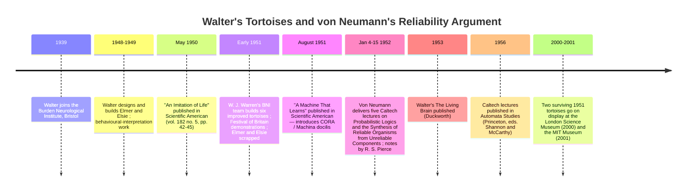

:::tip[In one paragraph]
Between 1948 and 1949, the neurophysiologist W. Grey Walter built two electronic tortoises — Elmer and Elsie — at the Burden Neurological Institute in Bristol. With two miniature radio tubes, one photocell, one touch contact, and two motors, they explored, sought light, avoided obstacles, and self-recharged. Walter's *Machina speculatrix* proved life-like behaviour did not require a brain. But behaviour was the wiring; revising it meant rebuilding the circuit. In January 1952, von Neumann's Caltech lectures quantified the scaling wall — a multiplexing factor of N ≈ 14,000 to make a 2,500-tube machine reliable enough to run for 8 hours.
:::

<strong>Cast of characters</strong>

| Name | Lifespan | Role |
|---|---|---|
| W. Grey Walter | 1910–1977 | Kansas City–born neurophysiologist; director of the physiological department at the Burden Neurological Institute (BNI), Bristol, from 1939; designer of *Machina speculatrix*. |
| John von Neumann | 1903–1957 | Professor at the Institute for Advanced Study, Princeton; delivered five Caltech lectures (January 1952) on probabilistic logics and reliable organisms from unreliable components. |
| R. S. Pierce | — | Note-taker for von Neumann's January 1952 Caltech lectures; the 1956 *Automata Studies* text is "based on notes taken by R. S. Pierce." |
| W. J. "Bunny" Warren | — | BNI engineer, recruited by Walter after the war; built the more robust 1951 batch of six improved tortoises that supported public demonstrations. |
| Owen E. Holland | — | Roboticist whose 2003 *Phil. Trans. R. Soc. A* paper is the chained anchor for the chapter's circuit-level reconstruction and biographical detail. |
| Bernarda Bryson Shahn | — | Artist whose eight stylised sketches accompanied Walter's May 1950 *Scientific American* article *An Imitation of Life*. |

<strong>Timeline (1939–2001)</strong>

<strong>Plain-words glossary</strong>

- **Machina speculatrix** — Walter's name for the genus of his electronic tortoises. The Latin *speculatrix* means "the one who watches" or "the explorer"; Walter coined the term to mark them as instruments for testing how much nervous-system-like behaviour could be produced by a small number of interacting parts.
- **Photoelectric cell (photocell)** — A device whose electrical output varies with the light falling on it. The tortoise's "eye" was a single photocell shrouded so that it saw only what lay directly in front of the front drive wheel; voltage from the photocell controlled the first stage of the two-tube amplifier.
- **Multivibrator** — A two-stage electronic oscillator that flips back and forth between two states. In the tortoise, the obstacle-avoidance circuit converted the ordinary two-stage amplifier into a multivibrator whenever the shell-mounted contact closed; relays RL1 and RL2 then oscillated, producing the characteristic butt–withdraw–sidestep pattern.
- **Tropism (positive / negative)** — Walter's term for orientation toward (positive) or away from (negative) a stimulus. The tortoise exhibited a positive tropism toward moderate light and a negative tropism away from intense light, with the threshold built into the amplifier's saturation behaviour.
- **Multiplexing (von Neumann sense)** — A reliability technique in which each computational line is replaced by a bundle of N parallel lines, the true state determined by majority vote among them. Von Neumann's January 1952 Caltech lectures showed that N grows quickly with target reliability — for a 2,500-tube machine running 8 hours, N ≈ 14,000.
- **Mean free path (between errors)** — Borrowed from physics, where it means the average distance a particle travels between collisions. Von Neumann used the phrase for the average time a computing machine runs before a system-crashing error; his worked example asked for an 8-hour mean free path.
- **Hardware-as-program** — The arrangement in which a machine's behaviour is fixed by the physical layout of its components: to revise the behaviour, you open the shell and rewire. Elmer and Elsie were the canonical case; the architectural escape route — separating *what* a machine does from *how* its parts are wired — is the subject of Chapter 8.

Between the years 1948 and 1949, the American-born neurophysiologist W. Grey Walter designed and constructed two electronic tortoises, pioneering prototypes of an artificial genus he called *Machina speculatrix*. The design of these tortoises, and the intricate interpretation of their behaviour, was carried out during those two critical years in Bristol (Holland 2003, p. 2087). Walter himself was an eclectic figure. Born on February 19, 1910, in Kansas City, Missouri, his career would unfold almost entirely across the Atlantic in the United Kingdom, ending in his death in Clifton, Bristol, in May 1977.

By 1939, Walter had taken up a position as a neurophysiologist at the Burden Neurological Institute (BNI) in Bristol, where he served as director of the physiological department. He would remain at the BNI for decades, working continuously until 1970, when a severe motor-scooter accident abruptly ended his active research career. Within the history of cybernetics, Walter occupies a unique space. As described by Rhodri Hayward and quoted by Owen Holland (2003, p. 2088), Walter possessed a "maverick" and "swashbuckling" public profile, yet he was fundamentally a working clinical researcher rather than an isolated outsider. He always received due recognition for his achievements from the electroencephalography (EEG) community.

This matters because the tortoises can easily be made to look like a lone-inventor detour, when the record points to a narrower and more interesting case. Walter's day job was not building theatrical robots. It was clinical and experimental neurophysiology inside an institution founded to work on the nervous system. In the short author note attached to the 1950 article, *Scientific American* identified him not as a showman or engineer but as director of the physiological department at the Burden Neurological Institute in Bristol (Walter 1950, p. 45). The tortoises belonged to that context: small working models built by a neurophysiologist trying to test how much nervous-system-like behaviour could be produced by a very small number of interacting elements.

Crucially, the electronic tortoises for which Walter is now most famous constituted only a minor fraction of his lifelong scientific output. The tortoise project was not a definitive pivot away from his primary clinical EEG work. As Holland documents, the project resulted in only a single chapter in Walter's 1953 book, *The Living Brain*, and a handful of papers among the 174 recorded under his authorship in the BNI bibliography (Holland 2003, p. 2088). Elmer and Elsie were important not because Walter abandoned neurophysiology for robotics, but because a short side-project inside a neurological institute gave unusually clean evidence for a larger claim: life-like, goal-seeking behaviour did not require an extraordinarily complex, brain-like architecture.

The first scientific publication dealing with the tortoises reached the public in the May 1950 issue of *Scientific American*, under the title "An Imitation of Life." Occupying four pages (pages 42 through 45), the article offered an accessible introduction to Walter's creations while leaving many constructional details for later sources. The text was accompanied by a series of eight stylised sketches drawn by the artist Bernarda Bryson Shahn (Holland 2003, p. 2089). In his opening, Walter distinguished the cybernetic approach from mere illusion. An imitation of life, he noted, could be achieved through sorcerer's-image magic that "is content to copy external appearance," but the scientific imitation of life "is concerned more with performance and behavior" (Walter 1950, p. 42).

That distinction let Walter stage the tortoises as instruments rather than dolls. The question was not whether a metal-and-plastic shell could be made to resemble an animal. The question was whether a machine with almost no parts could move through an environment in ways that an observer would ordinarily describe with biological verbs: searching, avoiding, choosing, returning, feeding, and interacting. Walter placed his work beside earlier stationary cybernetic devices, including W. R. Ashby's homeostat, but the tortoise added mobility. It had to encounter the world rather than merely settle into an internal equilibrium.

Walter christened the genus of his machines *Machina speculatrix*. He nicknamed the first two prototype tortoises Elmer and Elsie, acronyms derived from the specific terms describing them: "ELectro MEchanical Robots, Light-Sensitive, with Internal and External stability" (Walter 1950, p. 42). In a remarkably brief paragraph, Walter laid out the complete inventory of their hardware. The machines relied on surprisingly minimal equipment: "two miniature radio tubes, two sense organs, one for light and the other for touch, and two effectors or motors, one for crawling and the other for steering. Their power is supplied by a miniature hearing-aid B battery and a miniature six-volt storage battery" (Walter 1950, p. 42).

Despite this minimalism, the behaviours depicted in the article were intricately varied. Walter described a continuous, cycloidal exploration when the tortoise operated in the dark. Driven by its scanning motor, the tortoise's eye would constantly search the environment. When the photocell detected a moderately bright light, the tortoise exhibited a positive tropism, abandoning its cycloidal wanderings for a direct, oriented motion toward the light. However, if the light proved too intense—such as "a flashlight about six inches away"—the tortoise would experience a negative tropism, where it "abruptly sheers away and seeks a more gentle climate" (Walter 1950, p. 43).

In more complex environments, the tortoises demonstrated an uncanny ability to navigate competing stimuli. Placed between two attractive light sources, the tortoise did not freeze like Buridan's ass, paralyzed between two identical bales of hay. Instead, it traced "a complex path of advance and withdrawal" to resolve the conflict (Walter 1950, p. 43). Walter also detailed the tortoise's recharging cycle. Within a "hutch" or "kennel," he had installed a battery charger and a 20-watt lamp. As the tortoise's internal storage battery began to run down, its amplifier became hypersensitive. Consequently, the 20-watt lamp, which would normally repel a fully charged tortoise, became highly attractive.

The tortoise would navigate into the kennel and connect to the charger. "The moment current flows in the circuit between the charger and the batteries," Walter explained, "the creature's own nervous system and motors are automatically disconnected; charging continues until the battery voltage has risen to its maximum" (Walter 1950, p. 43). Once the charging completed, the internal circuits automatically reconnected. Now fully charged, the tortoise found the bright 20-watt lamp deeply repellent once again, and would circle away for further adventures.

Walter further noted an obstacle-avoidance mechanism. The tortoise's shell was mounted on a single rubber contact; when deflected by an obstacle, a multivibrator circuit engaged. The important detail was not merely that the tortoise backed away. During this mode, the contact suppressed ordinary light-seeking and converted locomotion into a pattern of collision, withdrawal, and sidestep. The machine behaved as if frustration had temporarily taken command of perception.

Walter also described how the addition of a small indicator light to the steering circuit endowed the machines with an entirely new mode of behaviour. Confronted with a mirror, a tortoise would see its own flickering indicator light, causing the model to "flicker and jig at its reflection in a manner so specific that were it an animal a biologist would be justified in attributing to it a capacity for self-recognition" (Walter 1950, p. 45). The hedge is doing real work. Walter did not claim literal self-recognition for Elmer or Elsie. He said that, if an animal behaved this way, a biologist might reasonably reach for that description. The same caution applies to the two-tortoise interaction, in which each machine's light could become part of the other's sensory world, leading finally to a stately retreat. Or, in a scenario Walter dubbed the "dog-in-the-manger," an interfering tortoise might block a battery-depleted companion from reaching the kennel, "leading to the more needy one expiring from exhaustion within sight of succor" (Walter 1950, p. 45). Defending the simplicity of his design, Walter calculated that just six elements could generate "a new pattern every tenth of a second for 280 years — four times the human lifetime of 70 years" (Walter 1950, p. 43).

## Inside the Shell

If the May 1950 *Scientific American* article offered the public a behavioural narrative, the reality inside the shell was grounded in precise, hardwired engineering. Holland notes that the popular article gave only the briefest constructional account; the circuit-level view comes from Walter's later book, BNI archival diagrams, and Holland's reconstruction of them (Holland 2003, pp. 2089, 2098–2102). In Walter's Bristol home study, which had been converted into a workshop, the tortoise became a relay-mediated finite-state machine rather than a continuous analog soup. As Holland (2003, pp. 2099–2100) details from archival diagrams, the core of the tortoise's "brain" consisted of two miniature thermionic valves, or radio tubes, arranged as a two-stage amplifier.

The sensory inputs were strictly mechanical and photoelectric. The "eye" was a single photoelectric cell, fitted with a shroud that blocked light from all directions except the front. Crucially, this photocell was mounted on the same vertical spindle as the front drive wheel. This mechanical alignment ensured that the eye was always looking exactly in the direction the tortoise was moving. Voltage from this photocell controlled the first-stage current of the amplifier. The first stage, in turn, controlled the second-stage current, which drove two relay coils, RL1 and RL2. These relays were responsible for switching the steering motor and the drive motor between off, half, and full power states. Holland's circuit explanation adds a small but revealing asymmetry: RL1 was connected to the power line through the headlamp and a resistor, so it could deliver only about half the current of RL2, which was connected directly (Holland 2003, p. 2100). Behaviour arose from that kind of arranged imbalance, not from a hidden central controller.

The structural chassis of the tortoise relied on three wheels: a single front drive wheel that also rotated about the vertical axis to steer the machine, and two undriven rear wheels. The translucent plastic shell rested on a single rubber mounting. This mounting held a ring contact that would close whenever the shell was deflected by gravity on a slope or by physical contact with an obstacle. Furthermore, a small headlamp, a torch bulb, was wired in series with the steering motor, ensuring it lit up only when the steering motor was active. This indicator light, visible through a hole in the front of the shell, enabled the machine's complex interactions with mirrors and with other tortoises.

The power system was just as constrained as the control system. Walter's 1950 inventory separated the miniature hearing-aid B battery from the miniature six-volt storage battery, the latter supplying the A and C current for the tubes as well as current for the motors (Walter 1950, p. 42). That division helps explain why the kennel scene mattered as engineering, not just as theatre. The tortoise was built around a finite onboard energy store, a charger, and a lamp whose behavioural meaning changed with battery state. What looked like appetite in the demonstration was a bias shift in a small amplifier tied to a recharging circuit.

The interplay of these components resulted in four distinct behavioural modes, which Walter later formalized in an unpublished 1960 BNI typescript ("Machina speculatrix — notes on operation") using the letters E, P, N, and O (Holland 2003, pp. 2100–2102).

Behaviour E represented exploration. In the absence of an attractive light source, the drive motor operated at half speed while the steering motor rotated continuously at full speed. This created the tortoise's characteristic cycloidal trajectory and continuous environmental scanning.

Behaviour P represented positive tropism. When the photocell aligned with a moderately bright light, the first-stage current decreased slightly while the second-stage current increased markedly, turning on relay RL2. In this state, the steering motor received no current, while the drive motor received full current, propelling the tortoise directly toward the light.

Behaviour N represented negative tropism. When the photocell encountered a strong, intense light source, both stages of the amplifier saturated. Relay RL1 switched its state; the turning motor operated at half speed while the drive motor remained at full speed, with the steering effect inverted. Consequently, the tortoise sheered away from the glaring source.

Behaviour O represented obstacle-avoidance. When the tortoise collided with an object, the rubber-mounted shell deflected, closing the ring contact. This transformed the two-stage amplifier into a multivibrator. The relays began to oscillate, and the input from the photocell was entirely suppressed. As Walter described it, "all stimuli are ignored and its gait is transformed into a succession of butts, withdrawals and sidesteps" (Walter 1950, p. 44). This oscillation persisted for about a second after the obstacle was cleared, acting as a "short memory of frustration" that ensured the tortoise gave the hazard a wide berth before resuming its search.

This is why the later shorthand of "analog" against "digital" is too coarse for Walter's machine. The eye and amplifier were continuous devices, but the named behaviours were relay-mediated states: exploration, positive tropism, negative tropism, and obstacle-avoidance. Elmer and Elsie were already hybrids. They did not contain a stored list of instructions, but neither were they free-flowing analog computers in the later sense. Their logic lived in the placement of tubes, relays, batteries, motors, contacts, and a lamp.

## Hardware Is the Program

The architecture of Elmer and Elsie, a continuous photocell amplifier driving discrete, relay-mediated behaviour states, embodied Walter's overarching design philosophy. In Appendix C of *The Living Brain* (1953), Walter outlined three strict conditions for what he considered a legitimate working model of biological phenomena. First, he required that "several features of the mystery must be known." Second, he insisted that "the model must contain the absolute minimum of working parts to reproduce the known features." Third, he mandated that "the model must reproduce other features, either as predictions, or as unexpected combinations" (Walter 1953, p. 280, quoted in Holland 2003, p. 2095).

This was not minimalism for elegance alone. It was a method of biological argument. If a model used too many parts, the source of its behaviour would become hard to locate; if it used too few, it would fail to reproduce the target phenomenon. The tortoise was meant to sit on that knife-edge. It had enough structure to seek, avoid, recharge, and interact, but so few parts that a reader could plausibly trace the behaviour back through the circuit. Walter's ambition was not to simulate every detail of an animal nervous system. It was to show that a small analog of nervous-system relations could generate further features without those features being separately installed.

For Walter, the physical model was a direct instantiation of theoretical relationships. "The model is simply the analogue of one set of familiar mathematical expressions relating to passive networks linked by a nonlinear operator in the form of a discharge tube," he wrote. "It could quite well be formed of chemical or mechanical parts and does not in theory contain more information than do the algebraic equations" (Walter 1953, pp. 284–286, quoted in Holland 2003, pp. 2095–2096). The staggering combinatorial output of the tortoises—where six elements could generate a new pattern every tenth of a second for 280 years—served as his primary defence of minimalism. A low-component-count model could, in principle, explore an almost inexhaustible state space.

However, this same combinatorial defence simultaneously revealed the central bottleneck of the approach: hardware was the program. The emergent behaviour of the tortoise was inextricably bound to its physical wiring. The only way to revise the machine's underlying logic, or to alter its repertoire of behaviours, was to open the shell and rebuild the circuitry. The organism's behavioural repertoire was fixed by the schematic diagram of its components.

That fixedness did not make the behaviour simple. It made revision expensive. A new relationship among light, touch, steering, and drive was not a new instruction typed into a memory; it was a new physical arrangement. The same fact that gave Walter's model its evidential force also limited its future. Because the working parts were few, their causal roles could be inspected. Because the working parts were physical, changing those roles meant altering the machine. The bottleneck, in other words, was not that the tortoise was analog. It was that the model's behaviour and its wiring were the same object.

Furthermore, the initial implementation of this philosophy suffered from severe mechanical fragility. As Holland observes, Elmer and Elsie were "cobbled together from wartime surplus components and scrap materials — for example, their gearwheels were salvaged from old gas meters and alarm clocks" (Holland 2003, p. 2092). Because of their improvised construction, the prototype tortoises were chronically unreliable. By the time the 1951 Festival of Britain approached, bringing a demand for public demonstrations of the famous robotic creatures, the original models were no longer viable.

To meet the demand, Walter had to rely on W. J. "Bunny" Warren and the BNI engineering team to build a fresh batch of six improved tortoises in early 1951. While this new batch retained an almost identical circuit logic to the prototypes, the mechanical engineering was significantly more robust, finally providing a stable platform for exhibition (Holland 2003, pp. 2092, 2099). Elmer and Elsie themselves appear to have been scrapped around this time. The replacement is an important corrective to romance. Even before anyone tried to scale the principle into a large artificial nervous system, the two original research instruments were fragile enough that public demonstrations required a more carefully engineered generation.

This fragility was not a moral failing of Walter's vision, nor did it mean that analog computation was invalid. It illustrated that building reliable behaviour directly out of physical components made these prototypes brittle, exposing the conceptual ceiling of the hardware-as-program paradigm. The first ceiling was practical: scrap gears, old gas-meter parts, and delicate valves made the prototypes unreliable. The second ceiling was architectural: adding new behaviours meant adding or rearranging physical mechanisms. Von Neumann's 1952 lectures would make the same kind of ceiling quantitative, but at a much larger scale.

## Von Neumann's Caltech Calculus

The quantitative boundaries of reliable behaviour from unreliable parts were formalized mathematically in January 1952, when John von Neumann delivered a series of five lectures at the California Institute of Technology. Titled *Probabilistic Logics and the Synthesis of Reliable Organisms from Unreliable Components*, the lectures were delivered between January 4 and January 15. The anchored text is the Caltech lecture typescript as reprinted by the Institute for Advanced Study; it was based on notes taken by R. S. Pierce and revised by von Neumann, and the paper later appeared in the 1956 collection *Automata Studies* (von Neumann 1952, IAS PDF p. 1).

Von Neumann's lectures opened with a radical reframing of the relationship between computation and component failure. Rather than treating failure as a frustrating engineering artifact that could simply be polished away, von Neumann elevated error to a foundational principle of design. "Error is viewed, therefore, not as an extraneous and misdirected or misdirecting accident," he argued in the opening section, "but as an essential part of the process under consideration — its importance in the synthesis of automata being fully comparable to that one of the factor which is normally considered, the intended and correct logical structure" (von Neumann 1952, IAS PDF p. 1).

In section 10 of his text, von Neumann introduced the concept of basic components that fail with a specific probability during each operation (von Neumann 1952, IAS PDF p. 37). The basic organs in the surrounding analysis were digital logical elements, such as Sheffer-stroke organs and majority organs, so the lecture cannot be used as evidence that digital machines were exempt from the problem. They were the problem case. To combat inherent unreliability, he analyzed how errors propagate and how they might be suppressed. His proposed mechanism was multiplexing: replacing each single computational line in a network with a bundle of N parallel lines, and determining the true state of the system by taking a majority vote among the lines.

The idea is easy to state and expensive to implement. If one component may fail, duplicate it; if duplicates may fail independently, use many of them and let the majority outvote the errors. The catch is that the number of redundant lines required depends on the desired reliability of the whole machine, not only on the reliability of one part. A small demonstration can tolerate visible mishaps. A large calculating machine cannot let a single bad actuation corrupt an entire run. Von Neumann's example therefore asked what redundancy would be needed for an ordinary, finite engineering target rather than an ideal machine.

To demonstrate the staggering cost of this approach, von Neumann presented a detailed worked example in section 10.5.3.1. "Consider first a computing machine with 2500 vacuum tubes each of which is actuated on the average once every 5 microseconds," he posited. "Assume that a mean free path of 8 hours between errors is desired" (von Neumann 1952, IAS PDF p. 45). Over that 8-hour period, he calculated, the system would undergo a massive 1.4 × 10¹³ actuations. To achieve the target mean free path without a system-crashing fault, the required error rate per actuation had to be vanishingly small: approximately 7 × 10⁻¹⁴.

Applying his multiplexing mathematics to achieve this degree of reliability from basic, unreliable vacuum tubes, von Neumann calculated the necessary redundancy. He determined that the system would require a multiplexing factor of N ≈ 14,000. In plain terms, the cure was larger than the disease. A 2,500-tube computer made reliable by this method would not merely add a few safety circuits around vulnerable components; the logical communication of the machine would have to be carried in 14,000-line bundles (von Neumann 1952, IAS PDF p. 46).

The conclusion drawn in section 11.1 was clear and unsparing. "The multiplexing technique is impractical on the level of present technology," von Neumann stated, "but quite practical for a perfectly conceivable more advanced technology and for the natural relay organs (neurons)" (von Neumann 1952, IAS PDF p. 47). This verdict was not a blanket condemnation of analog circuits, nor was it a simple endorsement of digital computation. The 2,500-vacuum-tube computer of von Neumann's worked example was itself a digital, discrete-state machine. The lecture's contrast was not analog versus digital. It was present component technology versus a future micro-componentry dense enough, cheap enough, and numerous enough to make redundancy practical.

Instead, von Neumann had mapped the scaling wall. The challenge of building highly reliable, complex organisms from fundamentally unreliable physical components was insurmountable using the brute-force multiplexing of 1952 hardware. Walter's two-tube tortoises had elegantly bypassed the need for a brain, but von Neumann's mathematics warned that any attempt to scale the same component technology into a complex, brain-like architecture would pay a crushing reliability tax.

The two stories should not be forced into a direct line of influence. The anchored record here contains no evidence that Walter and von Neumann corresponded about the tortoises, or that either man read the other's work at the relevant moment. Their connection is structural. Walter showed how much behaviour could be obtained from a tiny hardwired organism in a real environment. Von Neumann showed how punishing it would be to build a large reliable organism by multiplying unreliable components. Put together, they make the analog bottleneck more precise: small hardwired machines could surprise observers, but reliability and revisability did not scale by simply adding more physical parts.

## The Bridge, Not the Funeral

Yet, the realization of this bottleneck did not result in a sudden funeral for Walter's cybernetic work. Walter himself never portrayed the tortoises as a defeated methodology, and Holland's account follows the line forward through CORA, *Machina docilis*, and later IRMA work rather than stopping at Elmer and Elsie (Holland 2003, pp. 2110–2114). In fact, even as the original scrap-built tortoises were struggling to maintain their physical integrity, Walter was already looking beyond them. In the final, forward-looking paragraph of his May 1950 *Scientific American* article, he announced his next conceptual leap.

"More complex models that we are now constructing have memory circuits in which associations are stored as electric oscillations," Walter wrote, "so the creatures can learn simple tricks, forget them slowly and relearn more quickly. This compact, plastic and easily accessible form of short-term memory may be very similar to the way in which the brain establishes the simpler and more evanescent conditioned reflexes" (Walter 1950, p. 45).

This vision materialized the following year as CORA, an acronym for Conditioned Reflex Analogue, which Walter introduced in his August 1951 paper, "A Machine That Learns." CORA represented an ambitious attempt to implement Pavlovian conditioning in hardware. Holland's chained quotation, drawn from Walter 1951, is enough to show the direction of travel. In one arrangement, the specific stimulus was a moderate light and the neutral one was a whistle; after repeated pairings, the model would come to the whistle as though it were a light (Walter 1951, p. 62, via Holland 2003, pp. 2112–2113). In another arrangement, touch supplied the specific stimulus, so that a whistle paired with collision could later trigger withdrawal. The training protocol was vividly direct: "After a dozen kicks the model will know that a whistle means trouble, and it can thus be guided away from danger by its master" (Walter 1951, p. 62, via Holland 2003, pp. 2112–2113).

CORA sharpens the boundary rather than dissolving it. Walter did not stop at light-seeking and obstacle-avoidance, and he did not treat Elmer and Elsie as a finished dead end. He kept asking how much plasticity could be obtained from accessible circuits. At the same time, CORA also confirms the central constraint: learning itself was still being built as a circuit. Association, memory, forgetting, and relearning were not yet separable programs laid over a stable general-purpose machine. They remained physical arrangements of oscillations, sensors, and responses.

Simultaneously, the mechanical legacy of the *Machina speculatrix* lineage was secured. Of the six robust, improved tortoises engineered by W. J. Warren's team for the 1951 Festival of Britain, two managed to survive into the modern era. These exemplars of early cybernetic hardware eventually found permanent homes in major institutions, with one going on display in the London Science Museum in 2000 and another joining the MIT Museum in 2001 (Holland 2003, p. 2092).

Ultimately, Walter's electronic tortoises were an essential bridge in the history of artificial intelligence. They proved that life-like, goal-directed behaviour could emerge from a minimal network of physical components. But unreliable components and the rigid constraint of hardware-as-program meant that complex behaviour could not endlessly scale by simply adding more relays and amplifiers. The architectural escape route, separating *what* a machine does from *how* its parts are physically wired together, was already being worked out in parallel at the Institute for Advanced Study. That is the subject of the next chapter. This one ends at the bottleneck, not at a funeral.

:::note[Why this still matters today]
Two of this chapter's themes still shape working systems. *Hardware-as-program* — behaviour fixed by wiring — is still how custom silicon and FPGAs work; the answer Walter could not yet reach, separating logic from physical layout, is now the default in everything from microcontrollers running firmware to GPUs running tensor kernels. *Reliability from unreliable parts* — von Neumann's framing of error as essential rather than incidental — is the design principle of every modern distributed system, from RAID arrays and blockchain consensus to Kubernetes leader election. Walter's tortoises also anticipated a quieter idea: that goal-directed behaviour can come from a small number of well-chosen feedback loops, not from a central controller.
:::

