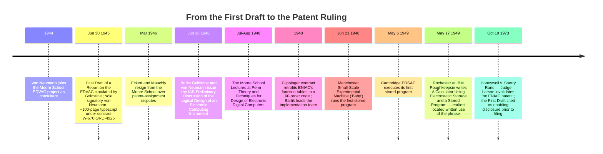

:::tip[In one paragraph]
On June 30, 1945, John von Neumann's *First Draft of a Report on the EDVAC* — a 100-page mimeographed typescript bearing only his name — proposed dividing a digital computing system into five logical organs and storing instructions in writable memory alongside data. A year later, Burks, Goldstine, and von Neumann's IAS *Preliminary Discussion* sharpened the rule. The *First Draft*'s mailed circulation invalidated Eckert and Mauchly's patent claim. The phrase "stored program" itself arrived later, in an internal IBM report.
:::

<strong>Cast of characters</strong>

| Name | Lifespan | Role |
|---|---|---|
| John von Neumann | 1903–1957 | IAS mathematician; Moore School EDVAC consultant from summer 1944; sole signatory of the *First Draft* (June 30, 1945); co-author of the IAS *Preliminary Discussion* (1946). |
| J. Presper Eckert Jr. | 1919–1995 | Chief electrical engineer of the Moore School ENIAC project; co-developer with Mauchly of the EDVAC successor concept; resigned March 1946 over patent assignment; gave the 1977 OH 13 oral history. |
| John Mauchly | 1907–1980 | Physics professor at Ursinus College; proposed ENIAC in his August 1942 Moore School memorandum; co-developer of EDVAC with Eckert. |
| Herman H. Goldstine | 1913–2004 | Army Ordnance liaison at the Moore School; mailed copies of the *First Draft* in summer 1945; co-author of the IAS *Preliminary Discussion*. |
| Jean Jennings Bartik | 1924–2011 | One of the original six ENIAC programmers; led the four-programmer team that retrofitted ENIAC's function tables to hold a 60-instruction order code in 1948. |
| Nathaniel Rochester | 1919–2001 | IBM Poughkeepsie engineer; author of the May 17, 1949 internal report "A Calculator Using Electrostatic Storage and a Stored Program" — the earliest located written use of the phrase. |

<strong>Timeline (1944–1973)</strong>

<strong>Plain-words glossary</strong>

- **First Draft** — The June 30, 1945 typescript "First Draft of a Report on the EDVAC, by John von Neumann," roughly 100 mimeographed pages distributed under U.S. Army Ordnance Contract W-670-ORD-4926. Its title page lists only von Neumann; later readers treated it as the founding document of the digital-computer architecture.
- **ENIAC** — The Electronic Numerical Integrator and Computer, completed at the Moore School of Electrical Engineering at the University of Pennsylvania in 1945. Programmed by physically rearranging cables and switches until the 1948 retrofit gave it a 60-instruction order code held in its function tables.
- **EDVAC** — The Electronic Discrete Variable Automatic Computer, the proposed successor to the ENIAC and the subject of the *First Draft*. The architecture survived the document; the actual EDVAC was completed only in 1951.
- **Stored program** — The arrangement in which a machine's instructions are held in writable electronic memory alongside its data, so that a new program can be loaded by writing it into memory rather than by rewiring the machine. The phrase itself was not used in any 1940s publication before May 1949.
- **Modern code paradigm** — Haigh, Priestley, and Rope's term for the execution of writable instructions held in main memory, distinct from the other ideas later compressed into the catch-all label "stored-program concept."
- **Von Neumann architecture** — The decomposition of a computing machine into specialized logical "organs": a central arithmetical part (CA), a central control (CC), a memory (M), and input/output (I, O). Stated tentatively in the *First Draft* and crisply in the 1946 IAS report.
- **Order code** — The set of numerical codes that a machine treats as instructions. Early retrofits used small numerical order codes; later machines used much larger and more flexible instruction sets.

The origins of the stored-program computer lie in the grueling physical labor of managing the machines that preceded it. By the middle of the Second World War, the task of calculating ballistics trajectories at the Aberdeen Proving Ground and the University of Pennsylvania's Moore School of Electrical Engineering had grown beyond the capacity of traditional methods. As historian Jennifer S. Light notes, "Nearly two hundred young women, both civilian and military, worked on the project as human 'computers,' performing ballistics computations during the war." Using mechanical desk calculators and the Bush differential analyzer, a single trajectory calculation could take a human computer anywhere from twenty minutes to several days. The sheer volume of these calculations motivated the creation of the ENIAC, a sprawling electronic behemoth containing thousands of vacuum tubes.

But the machine's speed created a new bottleneck: the problem of configuring it. In mid-1945, as the ENIAC neared operational status, Army liaison Captain Herman H. Goldstine assigned six of the best human computers to learn how to program the machine and report to John Holberton. The six women chosen for this task were Kathleen McNulty, Frances Bilas, Betty Jean Jennings, Ruth Lichterman, Elizabeth Snyder, and Marlyn Wescoff. Their initial introduction to the ENIAC was entirely abstract, as their security clearances had not yet been finalized. McNulty later recalled the experience: "Somebody gave us a whole stack of blueprints, and these were the wiring diagrams for all the panels, and they said 'Here, figure out how the machine works and then figure out how to program it.'"

Programming the ENIAC was not a matter of writing lines of code; it was a matter of physically reconstructing the machine's pathways for each new mathematical problem. The ENIAC was a parallel machine constructed with multiple memory buses rather than a centralized program counter. As Betty Jean Jennings (later Bartik) explained, "instead of having a program counter... it had program trays which you plugged in and out of to stimulate the next operation. And then of course you had whatever the operation you were doing, instead of doing in software, you had to set the switches and round offs and all that kind of stuff." Conditional branching required a complex arrangement of specialized adaptors to route numerical data directly into program control lines, while a dedicated Master Programmer unit managed the coordination of loops.

The mismatch between electronic speed and human setup labor was built into the machine's storage arrangement. ENIAC had a small amount of writable electronic numeric memory, but much of the information that made a calculation run lived outside anything resembling a modern memory. It lived in program trays, switch settings, function tables, and cable paths. The function tables themselves were not originally designed as a program store. They were large banks of switches meant to return tabulated mathematical values. To prepare a new run, the programmers had to decide which units performed which operations, how pulses moved between units, where loops would be counted, how signs and round-off settings should be handled, and how a condition could be made to alter the next operation. A mistake could be logical, electrical, or spatial: the right mathematical step could still be placed on a panel path that did not match the machine's timing.

That is why McNulty's stack of blueprints mattered. The six women were not handed a programming language. They were handed the machine's anatomy and asked to infer a method of use. Before they had regular access to the physical ENIAC, the diagrams had to stand in for the panels themselves. The resulting practice was not "software" in the later sense, but it was not clerical operation either. It required treating a mathematical procedure as a physical circuit through a distributed machine, with each future branch and repetition translated into settings that the ENIAC could enact.

The original expectation was that the mathematicians or physicists who owned the problems would figure out the logical steps, and the six women would serve simply as machine operators, plugging cables according to instructions. This division of labor collapsed almost immediately. The challenge of translating abstract mathematical logic into the physical constraints of the ENIAC's panels was so profound that the women themselves had to take over the intellectual work of programming. "Our role switched," Bartik noted, "so that we really were programmers." But even for expert programmers, the physical infrastructure of the ENIAC was fundamentally unscalable. The leaders of the Moore School team, J. Presper Eckert and John Mauchly, understood that the successor to the ENIAC would need to abandon the cable-and-switch model entirely. It would need to store its instructions inside writable electronic memory.

## Von Neumann's Draft

During the summer of 1944, John von Neumann joined the Moore School project as a consultant. By that time, discussions among Eckert, Mauchly, and the engineering team regarding an ENIAC successor—eventually named the EDVAC—were already underway. Decades later, Eckert would assert that the foundational ideas for this new architecture came entirely from the Moore School engineers. While priority remains disputed, historians Thomas Haigh, Mark Priestley, and Crispin Rope note that the Moore School team "had created at least some of the ideas included in the First Draft."

What von Neumann brought to the project was not merely new ideas, but a formal logical idiom and unparalleled academic credibility. He synthesized the ongoing discussions into a single, cohesive text. On June 30, 1945, a mimeographed typescript of roughly 100 pages was formally distributed under Contract No. W-670-ORD-4926 between the United States Army Ordnance Department and the University of Pennsylvania. Its title page bore exactly one name: "First Draft of a Report on the EDVAC, by John von Neumann." Neither Eckert nor Mauchly was listed as an author.

The physical document was modest: a typescript reproduced for circulation, not a polished monograph. The surviving reset prepared by Michael D. Godfrey preserves the feel of a working technical report, with section numbers doing much of the argumentative labor. Godfrey notes that the original typewriter lacked Greek letters, so mathematical symbols had to be inserted by hand or represented by ordinary letters. Even this material detail matters, because the later phrase "von Neumann architecture" can make the report sound like a canonical blueprint descending fully formed. The artifact itself was more provisional than that: a wartime engineering memorandum, written in formal mathematical prose, moving through mimeographed copies before the people whose work it summarized had settled the questions of credit and patent ownership.

The document proposed breaking an automatic digital computing system into specialized, distinct subsystems. Von Neumann enumerated five logical organs. The first was a central arithmetical part, which he designated CA. The second was a central control, or CC. The third, and most consequential, was the memory, M. In section 2.5 of the text, von Neumann articulated the core architectural premise of the design, though he did so with uncharacteristic tentativeness: "it is nevertheless tempting to treat the entire memory as one organ, and to have its parts even as interchangeable as possible." This single, unified memory would hold both the numerical data being processed and the instructions directing the calculation. The fourth and fifth organs were the input (I) and output (O) systems.

The opening sections also reveal the kind of problem von Neumann thought he was formalizing. He did not begin with a business machine, a laboratory instrument, or a calculator in the ordinary desk-machine sense. He began with an "automatic digital computing system," a device whose work could be decomposed into arithmetic, control, memory, and communication with the outside world. The terminology of "organs" was not decorative. It allowed him to separate the logical parts of a computer from the particular panels and plugs of the ENIAC. Arithmetic could be treated as one organ, control as another, memory as a third, input and output as interfaces. That abstraction is one reason the report traveled so well. Readers could argue over the hardware while still recognizing the same functional machine.

The text also reached back to the conceptual vocabulary of cybernetics and neural modeling. In section 2.6, von Neumann drew an explicit analogy to the human brain: "The three specific parts CA, CC (together C) and M correspond to the associative neurons in the human nervous system. It remains to discuss the equivalents of the sensory or afferent and the motor or efferent neurons." To ground this biological metaphor, section 4.2 formally cited the 1943 paper by Warren McCulloch and Walter Pitts, "A logical calculus of the ideas immanent in nervous activity." The document that would come to define the architecture of the digital computer was therefore explicitly anchored to the abstract neural networks of its era.

However, the *First Draft* was genuinely a draft—a fragmentary and incomplete sketch. As Michael D. Godfrey, who later prepared a modern typesetting of the document, observed: "throughout the text von Neumann refers to subsequent Sections which apparently were never written. Most prominently, the Sections on programming and on the input/output system are missing." Where those sections should have been, the typescript contained empty braces `{}`. Furthermore, the text rendered the Moore School's collaborative environment almost invisible. A search of the text reveals that "J. W. Mauchly" is mentioned exactly once in the body of the document, in a passing parenthetical attributing a multiplication encoding scheme. Eckert is not mentioned at all.

The missing sections are not peripheral omissions. A report that later readers would treat as an architectural origin document had little finished material on how ordinary programmers would actually use the machine. The order code described in the surrounding discussion was austere. It did not provide the later conveniences that make loops and branches feel natural: no index register, no ordinary conditional-branch instruction, no independent store of symbolic labels. In the design Haigh, Priestley, and Rope reconstruct, changing an instruction's address field was not an exotic trick reserved for clever programmers. It was the mechanism by which a loop could end, a conditional path could be chosen, or the next element of an array-like sequence could be reached. The famous unity of code and data therefore carried a technical burden from the start. If instructions were numbers in memory, then instructions could also become the objects of arithmetic and transfer operations.

Despite its gaps, Goldstine mailed copies to a list of computing researchers in the United States and the United Kingdom. Its impact was immediate. Within months, Alan Turing cited it as the definitive source on the design of general-purpose computers in his proposal for the British Pilot ACE project.

## The IAS Re-formalization

Almost exactly a year later, the architectural sketch of the *First Draft* was tightened, formalized, and re-issued. On June 28, 1946, the Institute for Advanced Study in Princeton, New Jersey, published a follow-on report titled *Preliminary Discussion of the Logical Design of an Electronic Computing Instrument*. The document was issued under Contract W-36-034-ORD-7481 between the Army Ordnance Department and the IAS.

This new report made significant adjustments to the presentation of the ideas. First, the title page acknowledged multiple contributors: Arthur W. Burks, Herman H. Goldstine, and John von Neumann were listed as co-authors. The preface also expanded the circle of credit slightly, thanking "Dr. John Tukey of Princeton University for many valuable discussions and suggestions."

The change in title also mattered. The 1945 document had been a report on the EDVAC, a particular successor machine still tied to the Moore School's engineering discussions. The 1946 IAS paper was a "logical design" for an "electronic computing instrument." Its first sections re-presented the machine in more general terms: an arithmetic organ, a memory organ, a control organ, and human-operated input and output channels. It is therefore tempting, but misleading, to treat the two reports as interchangeable. The first is the rough and famous document; the second is the cleaner design statement. The later label "von Neumann architecture" draws much of its apparent crispness from the 1946 formulation.

Crucially, the 1946 IAS report stripped away the hesitations of the *First Draft*. Where von Neumann had previously called it "tempting" to treat the memory as one unified organ, section 1.3 of the IAS report laid down the rule with absolute clarity: "Conceptually we have discussed two different forms of memory: storage of numbers and storage of orders. If, however, the orders to the machine are reduced to a numerical code and if the machine can in some fashion distinguish a number from an order, the memory organ can be used to store both numbers and orders."

As Haigh, Priestley, and Rope reconstruct it, the 1946 IAS design had specified a mechanism for distinguishing numbers from orders inside the unified memory: a flag bit tagging each word, with a transfer to a data word overwriting its entire contents and a transfer to an instruction word overwriting only its address field. That arrangement let a program safely modify its own instructions—a structural necessity for performing loops and conditional branches in the *First Draft*'s order code, where instruction modification was the only mechanism provided to terminate a loop, perform a conditional branch, or alter the address from which an instruction fetched data. Later von Neumann–style designs would drop the flag-bit construction once richer instruction sets made self-modifying code optional rather than load-bearing.

The 1946 IAS document is thus the cleaner statement of the architecture. The *First Draft* provided the initial rough taxonomy of organs, but the IAS report delivered the polished rule set. Yet for Eckert and Mauchly, the IAS report solved nothing. While Burks and Goldstine had been added as authors, the two chief engineers of the Moore School were still entirely absent from the foundational literature of the field they had helped inaugurate.

That absence shaped the later vocabulary of computing in a subtle way. "Von Neumann architecture" came to name the organ-subdivision style: arithmetic, control, memory, input, output. But the Moore School dispute was never only about that taxonomy. Eckert's strongest claim concerned the engineering design of the EDVAC successor, including the memory technology and the decision to store instructions in writable electronic storage. Haigh, Priestley, and Rope's point is that the later single label hides several different claims. A person could accept von Neumann's role as the report's formalizer, reject him as sole originator of the engineering ideas, and still use the 1946 IAS report as the clearest printed statement of the architecture. The dispute persists because those positions are not mutually exclusive.

## The Credit Dispute and the Departure

Goldstine's decision to circulate the *First Draft* through the mail in the summer of 1945 had consequences that reached far beyond academic prestige. By distributing the technical details of the EDVAC design to scientists across the world before any formal patent applications were filed, Goldstine effectively placed the contents of the report into the public domain. Legally, the mimeographed typescript functioned as a patent bar.

Decades later, in an oral history interview with Nancy Stern in October 1977, J. Presper Eckert offered a bitter reading of these events. In Eckert's view, the circulation of the *First Draft* was not a mere administrative misstep or a gesture of academic openness, but a calculated maneuver. He claimed that von Neumann deliberately dumped the team's engineering work into the public domain to circumvent patent restrictions, specifically to facilitate his own consulting arrangements. "Look, he sold all our ideas through the back door to IBM as a consultant for them," Eckert argued. His recounting of the mechanism was stark: "von Neumann went down and published all that stuff. All the reports of the engineers went to the Library of Congress which put a bar on any patents being obtained by any of his employees" (Eckert OH 13, pp. 46–47, via Haigh-Priestley-Rope).

The important discipline is to keep the layers separate. The circulation of the report is documented. The later patent-bar effect is documented. Eckert's interpretation of motive is also documented, but it remains Eckert's interpretation, offered thirty-two years after the events by a principal who had lost both credit and legal leverage. The available anchors do not allow the chapter to decide whether von Neumann engineered the disclosure for IBM-related reasons, whether Goldstine circulated the report under academic and military norms of technical exchange, or whether both frames capture part of the same institutional confusion. What can be said is narrower and firmer: the public distribution happened before the relevant patent filings, and it damaged the ability of Eckert and Mauchly to claim exclusive ownership over the disclosed design.

The fallout was immediate and severe. In early 1946, the conflict over patent assignment rights had fractured the Moore School team, leading Eckert and Mauchly to resign their positions entirely. That departure belongs to the same institutional story as the title page. The issue was not simply that a name had been left off a report. It was that a working group had produced ideas whose ownership was being sorted simultaneously by military contract, university policy, academic circulation, consulting relationships, and emerging commercial opportunity. The *First Draft* made the technical architecture portable. It also made the credit dispute portable.

The final ironic consequence of the *First Draft*'s distribution would not arrive until nearly three decades later. On October 19, 1973, in the United States District Court for the District of Minnesota, Judge Earl R. Larson issued his ruling in the landmark case *Honeywell, Inc. v. Sperry Rand Corp.* (180 U.S.P.Q. 673). The litigation sought to invalidate the foundational ENIAC patent held by Sperry Rand, the corporate successor to Eckert and Mauchly's computer company. Judge Larson struck down the patent. One of the cited grounds for invalidation was that the June 30, 1945 *First Draft* constituted an enabling disclosure of the technology prior to the patent application. The legal system eventually recognized the patent-bar mechanism Eckert complained about, but it did so while canceling the patent whose value that complaint was meant to protect.

## The First Machine Actually to Do It

Despite the conceptual leap represented by the *First Draft*, the machine it described—the EDVAC—was not the first computer to execute a stored order code from main electronic storage. The first machine to actually execute instructions in this new style was, somewhat surprisingly, the ENIAC itself, which after a 1948 retrofit ran its instruction set out of its read-only function tables.

In 1948, Richard Clippinger, a mathematician at the Ballistics Research Laboratory, initiated a contract with the Moore School to fundamentally alter how the ENIAC was programmed. Rather than physically routing cables and setting switches to define the control flow, the ENIAC's large banks of function tables—originally designed for table-lookup of interpolated mathematical values—were repurposed to hold a numerical instruction set. Jean Jennings Bartik was hired back to head the four-programmer team responsible for implementing the conversion.

The architecture of the new instruction set was heavily influenced by consultations in Princeton. Clippinger initially favored a 3-address instruction format, but, as Bartik recalled, "he talked to von Neumann, and von Neumann said no, to use a 1-address instruction." Bartik and Adele Goldstine made consulting trips to Princeton, where, in Bartik's recollection, they met with von Neumann briefly each day. The memory device was not elegant. It was ENIAC's old function-table infrastructure, pressed into a new role. But that is exactly why the retrofit is historically sharp: a substantial execution of the modern code paradigm did not wait for the EDVAC to be completed. It emerged by teaching the older machine to treat switch-set numerical entries as orders.

The resulting "60 order code" profoundly changed the relationship between the machine and its operators. Once the conversion was completed, the manual labor of rewiring was eliminated. Programs were entered into the function tables numerically. As Bartik put it, it rendered the horrendous problem of programming the ENIAC gone, in Bartik's phrasing. Under this 1948 modification, the ENIAC ran a complex mathematical program that included conditional branches, calculated-address data reads, and a subroutine called from multiple points in the code—a complete, production-scale demonstration of the new programming style.

Other machines quickly followed, and they did so with different memory technologies. On June 21, 1948, the Manchester Small-Scale Experimental Machine, known as the "Baby," ran its first program, becoming the first system built from the ground up as a stored-program computer. Its main store used a Williams tube, a cathode-ray-tube electrostatic memory. The following year, on May 6, 1949, the EDSAC at the University of Cambridge executed its first successful run using mercury delay-line memory. Those machines matter not because they settle the priority dispute once and for all, but because they show how quickly the architectural idea detached itself from the EDVAC project. By 1949, the stored-program style was no longer a report about one proposed machine. It was a race among laboratories to make electronic memory reliable enough for orders as well as numbers.

But the phrase "stored program" itself did not exist during the wartime discussions, nor was it coined by von Neumann, Eckert, or Mauchly. Haigh, Priestley, and Rope's archival research reveals that the phrase cannot be found in any publication from the 1940s prior to 1949. The earliest located use appears in a May 17, 1949 internal report by Nathaniel Rochester's team at IBM's Poughkeepsie facility, titled "A Calculator Using Electrostatic Storage and a Stored Program." The vocabulary of the modern computing era arrived four years after the *First Draft*, written by engineers at IBM.

That IBM setting is more than a footnote about terminology. Rochester's Poughkeepsie team was working around IBM's existing punched-card computing culture, where plugboards and card-fed control had their own long practical history. In that environment, "stored program" named a contrast that mattered operationally: once a machine reached a certain complexity, a calculation program could no longer be conveniently embodied in external wiring and plugboard arrangements. It had to be loaded into electronic storage. The phrase therefore arrived not as a philosophical label for a 1945 breakthrough, but as a practical engineering description inside a company trying to move from electromechanical calculation toward electronic computing.

Looking back, the priority disputes over the "stored-program concept" are tangled partly because the phrase compresses several distinct ideas into one label. As Haigh, Priestley, and Rope argue, the concept actually consists of three distinct paradigms: the modern code paradigm (the execution of writable instructions held in main memory), the von Neumann architecture paradigm (the division of the machine into specialized organs like the CA, CC, and M), and the EDVAC hardware paradigm (the specific use of serial bit-stream layouts and acoustic delay lines). The *First Draft* contained all three. Not all three survived. The modern code paradigm is what Bartik pointed to when she later claimed that, thanks to the 1948 retrofit, "the ENIAC was really the first stored program computer, actually." Strictly speaking, the ENIAC delivered the first substantial execution of the modern code paradigm, but it was not built from scratch as a stored-program machine; that priority belongs to the Manchester Baby.

This is why the chapter cannot end by awarding a single medal. If the question is which document first circulated the five-organ architecture in a form that researchers across the United States and Britain could cite, the answer points to the *First Draft*. If the question is which report stated the unified-memory rule most cleanly, the answer points to the 1946 IAS *Preliminary Discussion*. If the question is which working electronic machine first ran substantial code in the new style, the answer points back, unexpectedly, to the retrofitted ENIAC. If the question is which purpose-built machine first did so, the answer shifts to Manchester. The label "stored program" arrived only after these events had already begun to diverge.

Ultimately, the *First Draft* did not invent the digital computer out of whole cloth. It formalized a structure and gave later readers a durable way to discuss computing organs, memory, and control. But the architectural vision it described—a single, unified electronic memory handling both instructions and data at high speeds—remained theoretical in 1945. The architecture worked on paper, but it could only become reality once engineers managed to build memory hardware that was fast, silent, and reliable enough to hold it. The memory technologies that closed that gap belong to the next chapter's story.

:::note[Why this still matters today]
Two ideas in this chapter still shape every working computer. The decomposition into specialized organs — arithmetic, control, memory, input, output — survives, in only mildly modified form, as the layout of every CPU and microcontroller built since. And the unified-memory rule — that instructions and data live in the same writable store — is what makes ordinary software loadable, updatable, and patchable in place. The phrase "stored program" feels invisible because the alternative, programming a machine by rewiring it, has receded so far that few practitioners ever see it. The credit dispute also persists: every argument about whose work counts as "the design," when many hands shape it, descends from the patent-vs-publication tension the *First Draft* exposed.
:::
