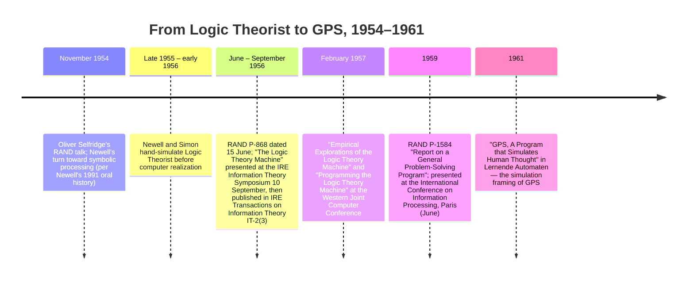

:::tip[In one paragraph]
Allen Newell, Herbert Simon, and J. C. Shaw built two different symbol machines. Logic Theorist (1956) searched for proofs in the sentential calculus of *Principia Mathematica* using heuristics rather than blind enumeration. GPS (1959) tried to turn that success into a broader architecture for problem solving. The chapter's hinge is the move from a working theorem prover to a "general" system whose reach still depended on hand-built representations.
:::

<strong>Cast of characters</strong>

| Name | Lifespan | Role |
|---|---|---|
| Allen Newell | 1927–1992 | Co-designer of LT and GPS at RAND. Brought non-numerical computing, organizational simulation, and symbolic-processing ambitions into the collaboration. |
| Herbert A. Simon | 1916–2001 | Co-designer at Carnegie Tech. Organizational theorist and cognitive scientist; later 1978 Nobel laureate in economics — out of scope here. |
| J. C. "Cliff" Shaw | — | RAND programmer; central to making LT and GPS programmable rather than only conceptual specifications. Author of the IPL programming languages on which LT and GPS ran. |
| Oliver Selfridge | 1926–2008 | MIT/Lincoln Lab researcher whose mid-November 1954 RAND talk Newell later remembered as a turning point toward symbolic processing. |
| Alfred N. Whitehead & Bertrand Russell | 1861–1947 / 1872–1970 | Authors of *Principia Mathematica* (1910–1913). The sentential calculus from Chapter 2 was LT's task domain — its theorems the program's targets. |

<strong>Timeline (1954–1961)</strong>

<strong>Plain-words glossary</strong>

- **Logic Theorist (LT)** — Newell, Shaw, and Simon's 1956 program that searched for proofs of theorems in the sentential calculus of *Principia Mathematica*, using a small set of heuristics rather than exhaustive enumeration.
- **GPS (General Problem Solver)** — Newell, Shaw, and Simon's 1959 successor, designed to test whether problem solving could be described through a reusable symbolic architecture rather than one theorem-proving task.
- **Means-ends analysis** — GPS's signature heuristic: compare the current state with the goal, then choose actions aimed at reducing the relevant difference.
- **Sentential calculus / propositional logic** — The logical system of *Principia Mathematica* Chapter 2 — propositions combined by AND, OR, NOT, IMPLIES — the formal domain LT searched.
- **IPL (Information Processing Language)** — Shaw's family of list-processing languages (IPL-I through IPL-V, 1956–1960). LT and GPS ran on IPL. The languages were designed for symbolic, not numerical, computation.
- **JOHNNIAC** — RAND's copy of the IAS computer, built 1952–1953. The hardware on which Shaw eventually ran LT.
- **Performance vs. simulation** — The chapter's organising distinction between solving a task and modelling the trace of human problem solving.

Before artificial intelligence had settled into a discipline, Allen Newell, Herbert Simon, and J. C. Shaw built two different kinds of symbol machines. The first, the Logic Theorist, was a performance program: it tried to find proofs in a real formal domain. The second, GPS, was a simulation program: it tried to make a machine's problem solving resemble the structure of human problem solving. The temptation is to blend them into one origin myth, as if theorem proving at Dartmouth simply grew into a general theory of mind. The more accurate story is more interesting. Logic Theorist showed that heuristic symbol manipulation could work. GPS showed that turning that success into a general account of thinking required a different architecture, a different psychology, and far more infrastructure than the name "General Problem Solver" suggests.

## Paper Before Machine

The first scene should not open in a machine room. It should open with paper.

Newell and Simon's 1956 paper did not present the final computer realization of the Logic Theory Machine as a completed artifact. It presented a specification: a formal description of a complex information-processing system that could search for proofs in symbolic logic. The paper explicitly separated that specification from the realization work, crediting Shaw with the computer implementation that would be reported later. That distinction matters because the Logic Theorist sits at a delicate historical boundary. It belongs to the first generation of running symbolic AI programs, but the earliest evidence is not a clean console demonstration. It is a design that could be followed, painfully, by hand.

The program was "small" only in the special sense that a human could simulate it if the person had enough patience and paper. Newell and Simon emphasized that the system could barely be hand simulated. That phrase is a useful antidote to both kinds of myth: it was not a casual thought experiment, but it was also not yet a frictionless electronic mind. The drama was that a procedure written over symbolic expressions could be stepped through like a machine. A person could keep the lists, apply the tests, choose a routine, record a new expression, and see a proof search unfold.

Newell's path into this work ran through RAND, not through an already named AI field. In his later oral history, he described RAND's organizational simulations, his work with Shaw, and a growing interest in non-numerical computing. He also remembered Oliver Selfridge's 1954 RAND talk as clarifying the possibility of arbitrary information processing, symbolic processing, and adaptive behavior. That recollection should be handled as retrospective evidence, not as a transcript of inner conversion. Still, it captures the setting: a research environment in which computation was beginning to mean more than numerical calculation.

Simon brought the Carnegie Tech side of the collaboration: organization theory, decision-making, and a serious interest in problem solving as a human activity. Shaw brought programming skill and the practical discipline of making symbolic structures live on actual computing machinery. The collaboration was not a lone-genius episode. It was a two-node RAND-Carnegie effort, joined by exchanges of drafts and a shared conviction that thinking might be studied by building systems whose steps could be inspected.

This setting also explains why Shaw cannot be treated as a footnote. The step from a paper trace to a running symbolic system was not clerical transcription. Ordinary numerical programming conventions were poorly suited to expressions, linked memories, and lists of symbolic objects. The implementation problem was part of the research problem. A proof-search theory that could not be realized in a language and memory organization would remain a diagram. In the Newell-Simon-Shaw collaboration, programming was one of the places where the theory became testable.

That is why the early name "Logic Theory Machine" is revealing. It names an artifact, not a person. Later retellings often call it the Logic Theorist, a phrase that sounds more agent-like, as if the machine were a mathematician in miniature. But in 1956 the safer image is still mechanical: a set of symbolic memories, tests, and routines designed to discover proofs. It was a machine for reasoning only because reasoning had been recast as a sequence of operations on expressions.

The machine, in this sense, existed before the machine. It existed as a specification rigorous enough to run in the hands of people and eventually in the memory of a computer. That is the point from which the chapter has to start. If the opening scene becomes a triumphant machine-room display, the history loses the very thing that made Logic Theorist new: it made a proof search into a manipulable symbolic process before the field had agreed on what to call such work.

## How LT Represented Logic

The Logic Theorist's task domain was not all of mathematics. It worked in the sentential calculus of Whitehead and Russell's *Principia Mathematica*. That restriction was essential. The program could treat formulas as formal objects, not as sentences requiring ordinary-language understanding. It did not need to know what a proposition "meant" in a human philosophical sense. It needed to recognize expressions, compare them with stored expressions, apply allowable transformations, and search for a route from known material to a desired theorem.

Newell and Simon's specification described an information-processing system built out of symbols and expressions. Expressions were not inert print marks. They were structured objects the program could inspect and transform. The system had memories, lists, instructions, tests, and routines. It kept theorem lists and problem lists. It had working memory for the material currently under attention and storage memory for material that might be used later. A proof attempt became a controlled movement through these structures.

This was a decisive abstraction. Earlier calculating machines had already shown that electronic hardware could carry out numerical procedures at high speed. Logic Theorist asked a different question: could a computer manipulate symbolic structures in a way that resembled reasoning? The answer depended on representing formulas so that operations could be performed on their parts. A theorem was not a mystical whole. It was an expression that could be matched, decomposed, compared, substituted into, and related to other expressions.

The program also had to choose. In formal logic, a blind enumeration of possible formulas quickly becomes useless. The number of legal transformations can grow beyond practical reach long before a desired proof appears. Logic Theorist therefore used heuristics: methods that seemed likely to reduce the search, without guaranteeing success in the way a complete decision procedure would. Its importance was not that it solved logic once and for all. Its importance was that it made heuristic search over symbolic expressions executable.

A useful way to imagine the program is as a paper workspace. One list contains known theorems. Another contains problems to be attacked. A working memory holds the current expression. A routine tests whether an expression has a desired form. Another routine tries a transformation. A branch selects a next line of attack. When the program derives something useful, it can add that result to a list and use it later. The proof is not discovered by insight in the romantic sense. It is assembled by moving through a space of formal possibilities under guidance.

That guidance was the historical novelty. Logic Theorist did not merely store the rules of a formal system. It organized a search. The program could prefer some paths over others, use subgoals, and exploit similarity between expressions. If the desired theorem looked close to something already known, the system could try to bridge the difference. If a direct route failed, it could try an intermediate expression. This is the seed of a larger style of AI: intelligence as the management of a search space too large to exhaust.

The representation also made the program inspectable. A proof attempt could be traced as a sequence of symbolic operations. The designers could ask why the system had selected one route rather than another, where it had failed, and how a heuristic changed its behavior. That mattered for the later psychological ambitions of Newell and Simon. A program that merely produced an answer would have been useful. A program whose intermediate steps could be compared with human problem-solving behavior was something more: a candidate theory of cognition.

The memories and lists were therefore not implementation trivia. They defined what the program could notice. If a theorem had been stored, it could become a resource. If a problem had been placed on a list, it could be revisited. If a routine created a useful intermediate expression, that expression could alter the future search. Symbolic AI's early promise lay in this reusability: once expressions were made into manipulable data structures, reasoning could be broken into operations that left inspectable traces behind them.

The cost was that every representation narrowed the world. Logic Theorist could move powerfully within the formal language it had been given, but only because that language had already been disciplined into symbols, rules, and proposition numbers. The machine did not read *Principia Mathematica* as a student reads a book. It worked on a prepared formal environment. That limitation is not an embarrassment. It is the engineering condition that made the experiment possible.

But that later ambition should not be pushed back too aggressively onto LT. Logic Theorist was first a theorem-proving performance program. Its claim was practical and narrow. Within a carefully represented formal domain, using explicitly designed symbolic structures and heuristic routines, a machine-oriented system could search for proofs. The fact that this had to be specified in such detail is part of the achievement. Symbolic AI did not begin as a vague declaration that computers could think. It began as a memory layout, a set of lists, and a search procedure over formal expressions.

## What LT Did and Did Not Prove

Logic Theorist attacked theorems from the early propositional material of *Principia Mathematica*. That gave the program a demanding but bounded target. Whitehead and Russell's system supplied numbered propositions, formal transformations, and a prestigious mathematical setting. If a machine could find proofs there, it would be doing more than playing with toy symbols.

The safe historical claim is that Logic Theorist discovered proofs in symbolic logic by heuristic search. It did not prove that computers understood mathematics as mathematicians do. It did not prove that symbolic AI had solved reasoning in general. It did not even establish that the most efficient way to do theorem proving would forever look like Newell, Simon, and Shaw's machinery. Later automated reasoning would develop very different methods. Logic Theorist's accomplishment was earlier and more specific: it showed that proof discovery could be treated as an information-processing task.

Some later summaries attach a precise count to the system's performance on the first group of *Principia Mathematica* theorems. That count is part of the historical folklore and may well be recoverable from the 1957 empirical paper, but the qualitative achievement does not depend on the exact tally. A symbolic program was searching through a real formal corpus, finding proofs, and making heuristic choices in the course of that search.

The same caution applies to colorful reception stories around the program. Vivid stories are exactly where early AI history most easily turns into morality play. This chapter does not need a drama of enlightened machines against resistant outsiders to make Logic Theorist important. The structural evidence — the specification of the system, the representation of symbolic logic, the hand-simulation boundary, and the later empirical-programming line of work — provides the most reliable foundation for the program's historical significance.

What LT did not do is as important as what it did. It did not operate over unrestricted mathematical language. It did not select its own domain. It did not invent its own formalism. It depended on a carefully prepared representation, a stock of rules, and heuristics supplied by its designers. If one calls it a first running symbolic-AI program, the word "symbolic" has to stay attached. Other machine-intelligence traditions, including neural modeling and game-playing work, had their own earlier or contemporary claims. Logic Theorist belongs to a particular lineage: formal symbols, lists, memories, and heuristic search.

That narrower claim is not a downgrade. It is the reason the program mattered. It gave the new field a concrete example of machine reasoning without requiring a grand theory of all intelligence. It made the question operational: if a proof can be found by manipulating symbolic expressions, what other kinds of problem solving might be described the same way?

## Dartmouth as Cross-Link, Not Origin

The Dartmouth summer of 1956 named a field, but it did not create all of its technical substance from nothing. Chapter 11 belongs to the naming event: McCarthy's proposal, the small group of researchers, and the phrase "artificial intelligence" becoming available as a banner. From the Newell-Simon-Shaw side, Dartmouth looks different. It was a moment when a concrete symbolic program entered a conversation that was still trying to define itself.

Newell later recalled Dartmouth as a place where the field did not yet have a settled name before the conference. He remembered contacts with McCarthy, Minsky, Shannon, and others, and he located the Logic Theorist in that formative period. The careful wording is that LT was discussed or demonstrated as work in that orbit, not that Dartmouth itself supplied the technical realization scene.

That distinction changes the narrative. Dartmouth was not the birthplace of Logic Theorist in the simple sense. The program had already been specified and hand traced in the RAND-Carnegie orbit, and the 1956 Logic Theory Machine paper was presented later that year at the IRE Information Theory Symposium. Dartmouth was instead a crossing point. McCarthy's naming project met Newell and Simon's working symbolic program. The field acquired both a name and an example.

The example mattered because much of the Dartmouth ambition was promissory. Researchers proposed that aspects of intelligence could be described so precisely that a machine could simulate them. Logic Theorist gave that proposition a concrete form. Here was a system, however narrow, that treated reasoning as symbol manipulation and proof discovery as heuristic search. It made the digital approach feel less like philosophical speculation and more like a research program.

It also helped define what counted as evidence. A paper proposal could claim that machines might reason someday. LT supplied a traceable artifact: expressions entered a system, routines operated on them, and proof attempts emerged as sequences of formal steps. Even when the computer-realization chronology is kept cautious, the system's presence in the Dartmouth orbit changes the tone of the conversation. It made symbolic AI something one could argue over in technical detail.

Yet the Dartmouth cross-link should stay compact. If every early AI story is pulled back into that summer, the texture of the field disappears. Logic Theorist came from RAND computing, Carnegie problem-solving theory, Shaw's programming work, and the technical problem of representing logic. Dartmouth supplied a name and a network. It did not supply the theorem lists, memories, routines, or infrastructure that made LT possible.

The historiographic trap is to turn sequence into origin. Because Dartmouth named artificial intelligence, and because Logic Theorist stood near Dartmouth, it is easy to write as if the name produced the program. The chronology runs the other way. The symbolic program helped make the name plausible.

## GPS Architecture

GPS, the General Problem Solver, was not simply Logic Theorist with a broader title. It was a different kind of program with a different ambition. Where LT was built around a particular formal task, GPS tried to describe a more general architecture for problem solving. The basic move was to separate, as much as possible, a problem-solving method from the details of any one task environment.

In the 1959 account, Newell, Shaw, and Simon described GPS-I as a digital-computer program for investigating intelligent, adaptive, and creative behavior by synthesis. That phrase signals the method: build a program that exhibits the behavior, then study what the construction reveals. By 1961, Newell and Simon framed GPS even more explicitly as a program that simulates human thought, developed in relation to protocol data from people solving problems. This was the pivot from performance alone toward cognitive simulation.

:::note[GPS as synthesis]
> "Our principal means of investigation is synthesis: programming large digital computers to exhibit intelligent behavior..."

The methodological wager: GPS was built as an instrument for studying problem solving, not just as a solver.
:::

GPS represented a problem in terms of objects, operators, and differences. An object was a state or expression in the task environment. An operator was an action that could transform one object into another. A difference was a way of describing how the current object diverged from the desired object. Problem solving became a disciplined cycle: identify the difference, choose an operator that might reduce it, and create whatever subgoal is necessary to make that operator applicable.

This pattern is usually called means-ends analysis. Its appeal is easy to see. Suppose the current state and the goal state differ in some respect. Rather than search blindly through every possible operator, the system asks which operator is associated with reducing that kind of difference. If the operator cannot yet be applied, the system does not simply give up. It sets a subgoal: change the situation so the operator becomes feasible. That subgoal may generate another subgoal, creating a recursive structure of problem solving.

Newell and Simon's 1961 description gave GPS three broad types of goals. One goal type was to transform object A into object B. Another was to reduce a difference D between objects. A third was to apply an operator Q to an object. These goal types turned problem solving into a small grammar of action. Instead of writing a separate program for each task from scratch, the designers could ask how a task environment supplied objects, operators, differences, feasibility tests, and connections among them.

The three goal types also show why GPS was not just a bigger theorem prover. A theorem prover can be described as moving from assumptions and rules toward a desired expression. GPS tried to describe the control pattern behind many such tasks. To transform one object into another, the program might first need to reduce a named difference. To reduce that difference, it might need to apply an operator. To apply the operator, it might need another transformation. The architecture turned problem solving into a stack of mutually generating intentions.

Planning entered through abstraction. A system could reason about operators and differences before committing to every detailed step. That made GPS more than a reaction machine. It could construct a plan at one level, then descend into subgoals required to execute it. But each abstraction had to be tied back to a task environment. A plan that could not be grounded in available operators remained only a description of what one wished the system could do.

The architecture was general in a structural sense. Chess, theorem proving, symbolic integration, and programming could all be described, at least in principle, as spaces of objects and operators. But "in principle" carries weight. GPS did not arrive with a universal inventory of all useful objects, operators, and differences. Those had to be supplied. The task environment still had to be encoded. The connections between differences and operators had to be defined. The system needed tests for whether an operator could be applied. It also needed methods for choosing among alternatives.

This is where the performance-versus-simulation distinction becomes central. If GPS is judged only as a performance system, its limitations appear quickly. It did not solve hard problems across arbitrary domains by itself. It was not broad autonomous competence in working form. But if GPS is judged as a simulation system, the question changes. Newell and Simon were also asking whether a program could fail, hesitate, decompose, and redirect itself in ways that resembled human problem solving. The intermediate trace mattered, not just the final answer.

The protocol-data turn sharpened that ambition. Human subjects solving logic problems could be asked to think aloud. Their steps, errors, and subgoals could then be compared with the program's organization. This did not make GPS a transparent copy of the mind. It did, however, make the program a bridge between AI and psychology. The same machinery that looked underpowered as an all-purpose solver could look productive as a theory of how problem solvers organize means and ends.

That dual role explains both the promise and the confusion around GPS. The name invited readers to hear "general problem solver" as a claim of broad competence. The papers themselves show a more constrained idea. GPS was an architecture for representing problems and methods, and a hypothesis about human problem-solving organization. It generalized the lesson of Logic Theorist, but it did not merely extend LT's theorem proving. It changed the unit of explanation from a proof search in one formal domain to a recursive control structure over goals, differences, and operators.

## Infrastructure Ceiling

The limits of GPS were not incidental. They were built into the infrastructure required to make the architecture work.

Logic Theorist already needed more than a theory of reasoning. It needed symbolic memories, theorem and problem lists, routines, and an interpretive or pseudo-code language adequate for non-numerical structures. The 1956 paper emphasized that digital-computer realization depended on memory, speed, and a suitable language for the processes being described. It was not enough to own a fast machine. The system needed a way to represent expressions and move among them.

GPS raised that infrastructure demand. Its architecture required task vocabularies: what counts as an object, which operators exist, which differences matter, how operators affect differences, and when an operator is feasible. It also required evaluation. When more than one path was available, the program needed some basis for preferring one. When a subgoal was created, the system needed memory organization sufficient to keep the larger goal from disappearing into the stack of smaller ones.

Newell, Shaw, and Simon were clear about this ceiling. The 1959 GPS paper noted that the program had little task-environment information and needed special heuristics. It also treated the realization of GPS-like programs as a major programming-language and information-handling task, tied to the development of information-processing languages. That point is easily lost when the history is told only as a parade of ideas. The idea of means-ends analysis could be stated compactly. Making it run required languages, memories, tables, and hand-built representations.

This is also where the IPL chronology matters. Later IPL-V documentation belongs to 1960 and should not be projected backward as if it were the language environment of the first LT implementation. The LT-era work belongs to the earlier IPL-I, IPL-II, and IPL-III line, whose exact primary anchors remain a technical worklist. The distinction is not pedantic. It reminds us that symbolic AI was being built while its own programming tools were still under construction.

The generality ceiling therefore had two sides. Conceptually, GPS separated problem-solving method from task content more cleanly than LT had done. Practically, every new task still demanded representation work. A domain had to be translated into objects and operators before GPS could operate on it. Differences had to be named. Feasibility conditions had to be encoded. A program advertised as general still lived inside the boundaries of what its designers had represented.

That is why GPS can look like both a success and a failure, depending on the historical question. As a route to immediate domain-spanning competence, it fell short. As a disciplined way to study problem solving, it was powerful. It gave researchers a vocabulary for goals and subgoals, for reducing differences, for planning at one level of abstraction before executing at another. Later planning systems would inherit parts of this vocabulary even when they moved beyond the Carnegie-RAND setting.

The ceiling, then, was not simply a weakness. It exposed the cost of symbolic intelligence. Once thinking is treated as symbol manipulation, someone must decide which symbols exist, how they are stored, how they are connected, and which transformations are worth trying. Logic Theorist and GPS made those costs visible.

## Defining the Achievement

Newell, Simon, and Shaw deserve a precise claim. Logic Theorist was among the first running symbolic-AI programs, and its specification showed how a machine-oriented system could search for proofs in formal logic. GPS was an early architecture for general problem solving and a serious attempt to simulate human problem-solving processes. Those are strong claims. They do not need to be inflated.

Logic Theorist should not be given an unqualified priority title. The broader prehistory includes neural models, cybernetic devices, game-playing programs, and other attempts to mechanize aspects of intelligence. GPS did not deliver domain-spanning autonomy. It was a framework whose power depended on supplied task environments and carefully engineered symbolic infrastructure. Dartmouth did not cause LT to exist; it was one crossing point in a larger RAND-Carnegie technical story.

The honest version is richer. In the mid-1950s, a research team built a program that made formal reasoning into inspectable symbolic search. Then the same line of work tried to turn problem solving into a reusable architecture and a psychological model. The first achievement belonged to performance: could the program find proofs? The second belonged to simulation: could the program's organization illuminate how people solve problems?

Keeping those achievements separate also keeps the chronology humane. The field did not leap from a summer workshop to a machine mind. It learned how much had to be built before symbolic reasoning could run at all: representations, memories, languages, heuristics, task encodings, and methods for comparing program traces with human behavior. That lesson would shape the next decade as much as the early successes did.

The next chapter follows the infrastructure that made this style of work portable. LT and GPS depended on list structures, symbolic memories, and languages able to manipulate expressions rather than just numbers. McCarthy's answer would be LISP: not merely another programming language, but a way of making symbolic computation feel native.

:::note[Why this still matters today]
Every problem-solving program that decomposes a goal into subgoals and chooses operators by how much they reduce a specific kind of difference traces back to means-ends analysis. So does the practice of treating a hard task as objects + operators + differences before reaching for a learning algorithm. The deeper lesson is the one GPS exposed by failing: a "general" architecture is only as general as the task representations someone hand-builds for it. Modern systems hide that work behind training data and learned representations rather than hand-coded operator tables, but the dependency on representation has not gone away — it has only been moved.
:::

## Sources

### Primary

- **Newell, Allen, and Herbert A. Simon. "The Logic Theory Machine: A Complex Information Processing System." RAND P-868 / IRE Transactions on Information Theory IT-2(3), 1956.**
- **Newell, Allen, J. C. Shaw, and Herbert A. Simon. "Empirical Explorations of the Logic Theory Machine: A Case Study in Heuristic." Proceedings of the 1957 Western Joint Computer Conference, 1957.**
- **Newell, Allen, J. C. Shaw, and Herbert A. Simon. "A General Problem-Solving Program for a Computer." International Conference on Information Processing, Paris, 1959.**
- **Newell, Allen, and Herbert A. Simon. "GPS, A Program that Simulates Human Thought." In Heinz Billing, ed., *Lernende Automaten*, 1961; reprinted in *Computers and Thought*, 1963.**
- **Norberg, Arthur L. Oral history interview with Allen Newell. Charles Babbage Institute, 10-12 June 1991.**
- **Newell, Allen, and J. C. Shaw. "Programming the Logic Theory Machine." Proceedings of the 1957 Western Joint Computer Conference, 1957.**
- **Newell, Allen, et al. *Information Processing Language V Manual*. RAND P-1897, 1960.**
- **Newell, Shaw, and Simon. Early Information Processing Language manuals for IPL-I, IPL-II, and IPL-III, 1956-1958.**
- **Newell, Allen. "The Chess Machine: An Example of Dealing with a Complex Task by Adaptation." RAND P-671, 1955.**
- **Simon, Herbert A. *Models of My Life*. BasicBooks, 1991.**

### Secondary

- **Computer History Museum. "Logic Theorist." Timeline entry, 1955.**
- **AAAI AITopics. "Computers and Thought" metadata.**
- **McCorduck, Pamela. *Machines Who Think*. 1979 / 2004.**
- **Crevier, Daniel. *AI: The Tumultuous History of the Search for Artificial Intelligence*. 1993.**
- **Nilsson, Nils J. *The Quest for Artificial Intelligence*. Cambridge University Press, 2010.**
- **Dreyfus, Hubert. *What Computers Can't Do*. 1972.**
- **Feigenbaum, Edward. "The Simulation of Verbal Learning Behavior." 1959 / 1961.**
- **Lindsay, Robert. "Inferential Memory as the Basis of Machines Which Understand Natural Language." 1958.**
- **Stone, Philip, et al. *The General Inquirer*. 1960s.**
- **Fikes, Richard, and Nils J. Nilsson. STRIPS and GPS-derivative planning work, 1971 and after.**
