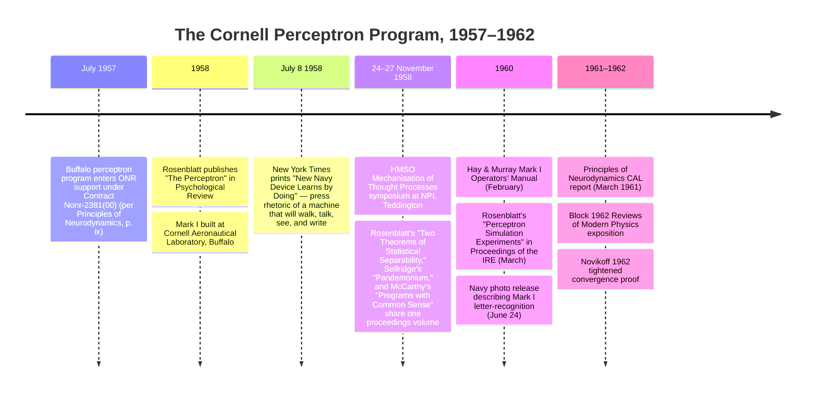

:::tip[In one paragraph]
Frank Rosenblatt's Perceptron program at the Cornell Aeronautical Laboratory (1958–1962) was a cybernetic research project, not a failed AI system. A 1958 *Psychological Review* paper, IBM 704 simulations, and the Mark I electromechanical machine pursued *learning* — supervised error correction over a random association layer — as engineering practice. The chapter separates three things later commentators tend to collapse: the convergence theorem (mathematics), the Mark I (analog hardware), and the *New York Times* press rhetoric of a machine that would walk, talk, see, and write.
:::

<strong>Cast of characters</strong>

| Name | Lifespan | Role |
|---|---|---|
| Frank Rosenblatt | 1928–1971 | Psychologist at the Cornell Aeronautical Laboratory in Buffalo; author of the 1958 *Psychological Review* paper and *Principles of Neurodynamics* (1961). Designed the perceptron's S/A/R architecture and the supervised error-correction reinforcement rule. |
| Charles Wightman | — | Cornell Aeronautical Laboratory engineer; principal Mark I builder. *Principles of Neurodynamics* p. ix records that he and Francis Martin carried out the engineering work on the machine. |
| Francis Martin | — | Cornell Aeronautical Laboratory engineer; co-built Mark I with Wightman. |
| John C. Hay | — | Cornell Aeronautical Laboratory experimentalist; ran the experimental programme on Mark I. Co-author with Albert E. Murray of the 1960 *Mark I Perceptron Operators' Manual* (Project PARA). |
| H. D. Block | — | Perceptron-theory contributor; author of "The Perceptron: A Model for Brain Functioning. I" in *Reviews of Modern Physics* 34(1), January 1962 — the chapter's anchor for independent mathematical legitimacy. |
| Albert B. J. Novikoff | — | Mathematician who published a tightened convergence proof for the perceptron in 1962, under cleaner separability assumptions. |

<strong>Timeline (1957–1962)</strong>

<strong>Plain-words glossary</strong>

- **Perceptron** — Rosenblatt's class of adaptive networks that learn to classify sensory inputs. The Mark I was the headline electromechanical instance; the term also covers the idealised mathematical model and the IBM 704 simulations.
- **S/A/R units** — The three layers of Rosenblatt's perceptron architecture: *sensory* units (input from a retina-like array), *association* units (random fixed connections from sensory to association), and *response* units whose weights are adjusted by reinforcement.
- **Reinforcement / supervised error correction** — Rosenblatt's learning rule: when the perceptron's response is wrong, adjust the weights of association-to-response connections in the direction that would have produced the correct response. Repeat until correct.
- **Convergence theorem** — Rosenblatt's mathematical claim (tightened by Novikoff 1962) that, when a solution exists under the stated separability conditions, the perceptron learning procedure converges on it in a finite number of steps.
- **Linear separability** — The condition under which the convergence theorem applies: two classes in the input space are *linearly separable* if some hyperplane divides them. The boundary case beyond which a single-layer perceptron cannot learn — and the precise object of Minsky and Papert's 1969 critique (Ch17).
- **Mark I Perceptron** — The electromechanical instantiation built at Cornell Aeronautical Laboratory in 1958. Sensory input via a photocell array; analog weights stored in motor-driven potentiometers; response read out from a panel. Hardware, not software simulation.
- **ADALINE / MADALINE** — Bernard Widrow and Marcian Hoff's contemporary Stanford analog-hardware learning systems (1960). The parallel cybernetic-hardware programme that puts Mark I into broader 1960 context.

# Chapter 14: The Perceptron

The perceptron was not born as a punch line. In its own moment, from 1958 through the early 1960s, it was a serious research program about learning, perception, and adaptive organization. It had mathematics. It had simulations. It had a physical machine. It also had press coverage so extravagant that later readers learned to remember the hype before they learned the work.

That order distorts the history. Frank Rosenblatt did not build a failed general intelligence system at Cornell Aeronautical Laboratory and then wait for symbolic AI to expose it. He built a cybernetic program around a more specific question: how could a network change after experience so that later stimuli produced different responses? The answer moved through three layers that have to be kept separate: the convergence theorem, the Mark I Perceptron hardware, and the public rhetoric around the Navy announcement.

The theorem was a bounded mathematical result. The hardware was an electromechanical analog system built and operated by a team. The rhetoric was a period artifact, useful for understanding reception but dangerous as a capability claim. If those layers collapse into one story, Rosenblatt becomes either a prophet of deep learning or a foolish salesman. He was neither. He was a cybernetic researcher working a live alternative to the symbolic AI program that had just named itself at Dartmouth.

## Buffalo, not Dartmouth

The place matters. The perceptron story begins in Buffalo, New York, at Cornell Aeronautical Laboratory, not in Hanover, not at RAND, and not inside the MIT list-processing world. Rosenblatt's 1958 *Psychological Review* paper identified him with Cornell Aeronautical Laboratory and named Office of Naval Research support under Contract Nonr-2381(00). In *Principles of Neurodynamics*, the larger 1961 report that consolidated the program, he described ONR support for the Buffalo work beginning in July 1957 and later support for the Ithaca side of the Cornell program.

That institutional setting puts the perceptron on a different track from the symbolic-AI line followed in the previous chapters. Chapter 11's Dartmouth scene gave "artificial intelligence" a name and a social center of gravity. Logic Theorist and GPS made intelligence visible as heuristic search through formal problem spaces. LISP then made symbolic manipulation feel like a native programming style. Rosenblatt's laboratory was asking a different kind of question. It did not start with a theorem to prove or a list structure to transform. It started with organisms sensing a world, storing traces of experience, and changing behavior.

The contrast should not be overstated into a culture war. The symbolic researchers were not unserious, and Rosenblatt was not working outside computation. His program used digital simulations as well as hardware. But the emphasis was different enough to matter. The symbolic line treated intelligence as explicit representation and rule-governed search. Rosenblatt's line treated intelligence as adaptive organization in a network whose connections could be modified by reinforcement.

That difference explains why the perceptron seemed exciting in 1958. It promised a machine that did not need every recognition rule written in advance. It also explains why the project later became easy to misremember. If intelligence means formal reasoning in a digital program, then Mark I looks like an odd side road. If intelligence can also mean learning from sensory experience, then the perceptron is not a failed imitation of symbolic AI. It is a rival definition of what counted as progress.

The contract number is not incidental background. ONR support made Rosenblatt's questions more than a psychology seminar. It tied a theory of adaptive nervous systems to a postwar research infrastructure willing to pay for apparatus, simulation time, and laboratory staff. That funding logic will become more visible in Chapter 16, but here it explains why a paper about perception could become a cabinet with a photoelectric input, response displays, and operators.

## Rosenblatt's problem statement

Rosenblatt's 1958 paper opened with questions about how information is sensed, how it is stored, and how stored information influences recognition and behavior. That is not the opening of a commercial classifier manual. It is the opening of a brain-modeling paper, written in the vocabulary of physiological psychology and cybernetics.

The perceptron was Rosenblatt's name for a class of theoretical nerve nets. This matters because later accounts often treat "the Perceptron" as if it were only the Mark I cabinet. Rosenblatt's own program was broader. It included hypothetical networks, digital simulations, and a physical machine. In *Principles of Neurodynamics*, he even complained that popular discussion tended to turn the term into a single capitalized device and obscure the larger theory.

The background reaches back to earlier chapters. McCulloch and Pitts had already supplied the logical threshold neuron. Hebb had already made learning and changing connection strengths central to neural psychology. Wiener and the cybernetic movement had already framed control, communication, and feedback across animals and machines. Rosenblatt did not invent all of that. His narrower contribution was to combine random association-layer connections, supervised error correction, and a convergence theorem into a research program that could be tested.

This is why the 1958 article should be read as a bridge text. It stood between biophysics and psychology, between theory and experiment, between nervous-system metaphor and machine implementation. Its ambition was not that a single device in Buffalo could already see the world as a person sees it. Its ambition was that recognition and memory might be studied through networks whose organization changed with experience.

The timing also matters. As Rosenblatt was developing the S/A/R architecture, Hubel and Wiesel were beginning the physiological work that would soon describe receptive-field organization in the visual cortex. No direct causal link between the two programmes is established in the primary record, but the structural resonance is revealing: late-1950s researchers in different rooms were trying to understand perception as layered organization, not merely as a flat mapping from stimulus to response.

That shared concern with organization gives the perceptron its period texture. Rosenblatt was not asking whether a machine could imitate a human conversation through a text channel, as Turing had proposed, or whether a program could search a proof space, as Logic Theorist had demonstrated. He was asking how a system could acquire selectivity. What had to change inside the machine so that the next encounter with the same class of stimulus would be handled differently?

## Unit architecture and reinforcement

The basic perceptron vocabulary is simple enough to state without turning the chapter into a modern neural-network tutorial. S-units are sensory units. They receive the stimulus. A-units are association units. They collect and transmit signals through intermediate connections. R-units are response units. They express the system's answer. A stimulus activates a pattern in the sensory layer; signals move through the association layer; response units compete or cross thresholds; reinforcement changes what will happen next time.

Rosenblatt's theory used this vocabulary to discuss environments, signals, response functions, solutions, and reinforcement systems. The point was not that every biological detail had been captured. The point was that learning could be formalized as a change in the system after an error. A trainer could present a stimulus, observe the response, and force a correction when the system was wrong. The correction altered connection strengths so that the same or similar stimulus would be more likely to produce the desired response later.

That is the perceptron's key engineering idea. It makes memory a physical or numerical state of the system rather than a stored symbolic rule. A symbolic program might contain a line saying that a particular feature implies a particular category. The perceptron instead adjusted weights through experience. Its "knowledge" was distributed across the settings that shaped later responses.

The vocabulary also blocks a common mistake. A perceptron is not simply a modern one-line linear classifier wearing an old name. The elementary perceptron that later textbooks teach is one historically important case, but Rosenblatt's program ranged across signal-generating units, environments, response thresholds, reinforcement, discrimination, detection, generalization, and non-simple systems. The simplified modern object is useful for teaching the mathematics. It is not the whole 1958-1962 program.

The public object record for Mark I preserves the same S/A/R structure. The sensory unit received patterns. Association units transformed the incoming activity. Response units displayed the output. That continuity between theory and hardware is important: the Mark I was not an unrelated showpiece bolted onto a paper theory. It was a physical attempt to make the theory visible.

Reinforcement is the hinge between the paper model and the machine. Without reinforcement, the architecture is only a signal path. With reinforcement, an error becomes an event the system can use. The trainer's correction is not a symbolic explanation of why the answer was wrong. It is a forced outcome that changes the future state of the network. That is why the perceptron looked so different from a hand-coded recognizer. Its rule for improvement was local and repetitive: respond, compare, correct, adjust.

## Mark I as analog hardware

Mark I was electromechanical analog hardware, not a program running on the IBM 704. The distinction is central to the chapter. Rosenblatt's group did use digital computers, including IBM 704 simulation work, to study perceptual learning and classification. Those simulations mattered. They let the program explore network behavior faster than physical rewiring alone would allow. But they did not replace the machine.

The Smithsonian object record describes Mark I as made at Cornell Aeronautical Laboratory in Buffalo with ONR and Rome Air Development Center support. It was arranged as a machine of sensory input, plugboard, potentiometer array, response panel, and meters. The Navy's June 1960 public release described a trainable electromechanical device in which letter patterns could be placed before a photoelectric "eye" and wrong responses could be corrected by forcing the right answer.

That language must be handled carefully. A Navy release is not a laboratory performance table. It is public-facing text. Still, it gives the reader a useful bounded image: a trainer presents restricted patterns; the machine responds; the trainer corrects errors; the machine's later behavior changes. Learning here is not a metaphor floating above the apparatus. It is a workflow involving light, circuits, controls, response displays, and adjustable settings.

The engineering was not Rosenblatt alone. In *Principles of Neurodynamics*, he credited Charles Wightman and Francis Martin with the engineering work on Mark I and John Hay with the experimental program. The operator-manual metadata adds Albert Murray alongside Hay. Other staff supported the digital-computer side of the project. Those names matter because the famous photographs can make the machine look like the material extension of one psychologist's idea. It was instead a Cornell Aeronautical Laboratory engineering object, built and operated by a team under defense-research sponsorship.

Some hardware details deserve a hedge. The sensory array is often described as a roughly gridded photoelectric input, and later accounts discuss motor-adjusted analog weights, but exact component counts and some specific mechanisms are still awaiting direct extraction from the operator manual. What can be stated confidently is enough for the chapter: Mark I was a physical analog learning machine with a sensory layer, association circuitry, response units, and adjustable electrical settings. It was not merely an algorithm illustrated by a cabinet.

The digital simulation layer sits beside that hardware story. Rosenblatt's 1960 IRE paper reported IBM 704 simulation experiments at Cornell Aeronautical Laboratory dating back to 1957. *Principles* also credits computing facilities and programming assistance. This dual infrastructure is part of the point. The perceptron program lived across proof, simulation, and apparatus. Its primary public machine was analog, while its experimental reach was extended by digital computation.

The team structure also explains why the machine should not be remembered as a theatrical prop. Wightman and Martin's engineering work, Hay's experimental program, Murray's operator-manual role, and the programming assistance around the simulations show a division of labor. Rosenblatt supplied the intellectual architecture and wrote the theoretical synthesis, but Mark I required technicians, operators, institutional support, and computing facilities. The "learning machine" was a laboratory system.

## Convergence and separability

The theorem is the part of the story most easily lost between hype and dismissal. Rosenblatt's serious mathematical claim was not that Mark I possessed general visual intelligence. It was that under stated conditions a perceptron learning procedure could converge on a solution. If a suitable solution existed for the classification problem, repeated correction could drive the system toward weights that produced the right responses.

Modern readers usually translate this into the language of linear separability. Imagine a set of examples that can be divided by a boundary. The perceptron does not need to be handed that boundary. It starts with weights, makes mistakes, receives correction, and changes the weights. If the examples are separable in the relevant way, the procedure is guaranteed to find a solution after enough corrections. If no such boundary exists for the representation the system is using, the theorem does not promise success.

The intuitive example is a table of points that can be split into two groups by a straight edge. The exact geometry can live in many dimensions, but the lesson is the same. If such a separating boundary exists, a sequence of mistakes can be informative. Each correction nudges the weights toward a boundary that treats the training cases properly. The theorem says that this process is not just hopeful tinkering. Under the right conditions, the corrections cannot wander forever.

That last sentence is not a footnote. It is the boundary that keeps the mathematics honest. Convergence is powerful because it is specific. It says something real about a class of problems. It does not say that arbitrary perception follows from reinforcement, or that every visual judgment can be reduced to the elementary case. Rosenblatt's program was ambitious, but the theorem was not a magic wand.

In *Principles of Neurodynamics*, the convergence material appears inside a larger structure of elementary perceptrons, existence and attainability of solutions, and the principal convergence theorem. The surrounding chapters also examine discrimination, detection, generalization, and more complex systems. That organization matters because it shows Rosenblatt treating the limits as part of the theory. He was not only announcing a learning machine to the newspapers. He was writing a book-length technical argument about when such systems could and could not be expected to work.

This is why importing the 1969 controversy backward does damage. The later critique matters, and Chapter 17 will take it up, but it should not be used to make the original theorem seem naive. Rosenblatt's result did not secretly claim to solve every recognition problem. It claimed convergence for a learning procedure when a solution was available under the relevant assumptions. The limits that later became famous are limits of that claim, not proof that the claim was empty.

The safest way to teach the theorem is to keep the three layers visible. The mathematics says that a correction procedure can reach a solution under the right separability conditions. The hardware gives one physical way to stage restricted pattern-recognition experiments. The press makes a different kind of claim about future machines. Only the first two belong to the technical program. The third belongs to reception.

Chapter 15 will later reinterpret perceptron learning in a more modern optimization language, as kin to gradient descent on a linear classifier. That is a useful bridge, but it is not the vocabulary of this chapter's historical actors. Here the period language is reinforcement, solutions, separability, and convergence. The modern reinterpretation should clarify Rosenblatt's result, not overwrite it.

## Experiments and limits without failure framing

Rosenblatt's experiments were restricted, and the restrictions are part of the science. The Mark I did not see an open world. It learned controlled pattern tasks. The simulation program likewise tested selected environments and classification problems. Acknowledging that does not make the perceptron a failure. It makes it an experiment.

The difference is important because later histories often reverse the order. They begin from the eventual limits of elementary perceptrons and then read those limits backward into 1958 as if Rosenblatt had promised a finished artificial mind. The source record does not require that story. *Principles of Neurodynamics* includes discussions of discrimination, error correction, detection, and generalization. It also discusses limits in organized environments and the difficulty elementary perceptrons face with richer figural organization.

:::note[Rosenblatt's own framing]
> "A perceptron is first and foremost a brain model, not an invention for pattern recognition."

Rosenblatt's preface makes the anti-hype argument in his own voice: neurodynamic theory first, engineering application second.
:::

Those limits were not external accusations pasted onto a triumphant press release. They were internal to the program's theory. Rosenblatt wanted to know what kinds of environments a perceptron could handle, what counted as a solution, how correction changed later behavior, and how far generalization could go. A bounded learning machine can be scientifically important even when it is not a general intelligence.

This is also where the word "recognition" needs care. In the Navy release context, recognition could mean identifying restricted letter patterns after training. In ordinary language, recognition can imply open-world visual understanding. Those are not the same claim. The perceptron program worked in the first sense. The chapter must not silently slide into the second.

What made the work historically consequential was the combination: a theory that described learning as adjustment, a machine that made adjustment visible, and a theorem that bounded when adjustment would terminate successfully. The limits define the edge of that achievement. They do not erase it.

The better verdict, then, is not "failure" but "bounded success." The perceptron worked as a research machine for the kind of simplified pattern environments it was built to explore. It also exposed a question that would haunt neural-network research for decades: how can a system acquire useful internal representations when the surface input is not already separable in the right way? That question belongs partly to Chapter 15 and partly to the later multilayer story, but it begins here.

## Independent mathematical legitimacy

Rosenblatt's own book was not the only sign that perceptron mathematics had standing in the early 1960s. H. D. Block published "The Perceptron: A Model for Brain Functioning. I" in *Reviews of Modern Physics* in 1962. Albert B. J. Novikoff published "On Convergence Proofs on Perceptrons" the same year in the *Symposium on the Mathematical Theory of Automata* proceedings.

The details of those papers should not be overstated without page-level extraction. But their bibliographic presence is already useful. They show that the perceptron was not merely a Navy publicity object or Rosenblatt's private enthusiasm. It entered the mathematical and physical-science literature as a subject worthy of exposition and proof.

Block is especially important as a boundary marker because he also appears inside Rosenblatt's acknowledgments as a serious contributor and critic. Novikoff matters for a different reason: the later learning-theory tradition repeatedly returned to convergence proofs, refinements, and assumption sets. The perceptron did not disappear into embarrassment as soon as the cameras left Buffalo. It became a mathematical object that other researchers could formalize.

This independent legitimacy matters because it changes the tone of the later controversy. The question was not whether Rosenblatt had tricked everyone with a flashy machine. The question was how far a real and bounded theorem could be generalized, what kinds of representations could satisfy its assumptions, and whether richer networks could escape the limits of elementary cases. That is a serious research dispute, not an embarrassment.

## The 1958 collision at Teddington

The cybernetic-symbolic tension was not invented later by historians. In November 1958, the National Physical Laboratory at Teddington hosted the *Mechanisation of Thought Processes* symposium. The 1959 HMSO proceedings placed Rosenblatt's "Two Theorems of Statistical Separability in the Perceptron," Oliver Selfridge's "Pandemonium: A Paradigm for Learning," and John McCarthy's "Programs with Common Sense" in the same documentary frame.

That co-presence is the chapter's cleanest evidence for a real 1958 collision. It does not prove a dramatic face-to-face debate, and the chapter should not invent one. But it does show that competing approaches to machine intelligence were already visible side by side: statistical separability and adaptive networks; Selfridge's cybernetic learning architecture; McCarthy's symbolic common-sense program.

Seen this way, Rosenblatt was not outside AI because he missed Dartmouth. He was outside the Dartmouth center of gravity because he belonged to a different lineage. The symbolic researchers asked how a machine could manipulate explicit descriptions and reason with them. Rosenblatt asked how an adaptive network could organize responses from sensory experience. Both paths claimed part of the future. In 1958, neither had earned the right to declare the other obsolete.

McCarthy's "Programs with Common Sense" pointed toward explicit representations and formal reasoning about the world. Selfridge's Pandemonium offered another learning-oriented architecture, with semi-independent feature demons contributing to recognition. Rosenblatt's "Two Theorems" put separability and adaptive classification on the same proceedings shelf. The volume did not need to announce a schism. Its table of contents already staged the alternatives.

The Teddington proceedings also keep the rivalry from becoming a personality story. The important contrast is not Rosenblatt versus McCarthy as temperaments. It is learning systems versus symbolic reasoning as research programs. Chapter 17 will return to the later controversy. Here, the point is simply that the split was already legible before the perceptron had been flattened into a cautionary tale.

That is why this section is load-bearing. Without Teddington, the cybernetic-versus-symbolic contrast could sound like a retrospective map imposed after later neural-network revivals. With Teddington, the contrast has a primary documentary anchor from 1958 itself. The rivalry was not yet settled, but the alternatives were already co-present.

## The cybernetic-hardware contemporary

Mark I was not an isolated Buffalo curiosity. In 1960, Bernard Widrow and Marcian Hoff at Stanford published work on adaptive switching circuits, the line that became associated with ADALINE and MADALINE. Their project was not the same as Rosenblatt's, and the chapter should not turn it into a priority fight. But it belongs in the same broader movement: analog and hybrid learning machines that adjusted weights from experience.

Selfridge's Pandemonium belongs nearby as a cybernetic cousin, even though its architecture and emphasis differed. Wightman's later Tobermory auditory-perceptron work at Cornell Aeronautical Laboratory also suggests program continuity beyond the famous Mark I demonstration, though the specific publications remain a source-worklist item. Taken together, these examples make the perceptron look less like a one-off spectacle and more like one node in a late-1950s and early-1960s learning-machine family.

That broader family helps explain why the symbolic victory narrative is too simple. Symbolic AI had better programming infrastructure and a clearer intellectual brand after Dartmouth, IPL, GPS, and LISP. Cybernetic learning had hardware, physiology, feedback, adaptation, and defense support. The field had not yet decided which style would dominate. For a brief period, both seemed plausible.

Chapter 16 will take up the larger Navy and Cold War funding logic. Here the funding point is narrower: ONR and related military research channels made it possible for a psychological theory of learning to become a machine, and for that machine to become public. The institutional support did not prove the theory correct. It did make the theory materially testable.

## Press, controversy, and historiographic muting

The press layer is real, but it is not the same as the technical layer. The July 1958 *New York Times* story carried the kind of future-facing rhetoric that later made the perceptron easy to mock, including the famous sequence about machines that might "walk, talk, see, write" and reproduce themselves. The exact attribution of that language is still debated — variously assigned to Rosenblatt, to Navy spokespeople, or to the reporter — and it should be treated as period press rhetoric rather than as Rosenblatt's technical claim or Mark I's capability.

Rosenblatt's own later preface is the safer guide. In *Principles of Neurodynamics*, he complained that popular press treatment had contributed to controversy and emphasized that the perceptron program was first a theory of brain mechanisms, not simply the invention of artificial-intelligence devices. That distinction does not make him modest in ambition. It makes the ambition more precise.

The three-layer separation is the reader's protection against myth. The mathematics supports convergence under separability conditions. The hardware supports restricted learning experiments in an electromechanical system. The press imagined a much larger future. All three belong to the history, but only the first two belong to the demonstrated technical achievement.

The later fate of the story also had a human asymmetry. Rosenblatt died in a sailing accident in 1971, after the publication of Minsky and Papert's *Perceptrons* and before the late-1970s and 1980s connectionist revival could fully rewrite the public memory. That fact should not be turned into melodrama, and it does not decide the mathematics. It helps explain why the counter-narrative was muted. The program's most visible defender was no longer available to argue its historical meaning through the next cycle of debate.

So the chapter should close before the fall. In 1958-1962, the perceptron was not a failed AI system. It was a serious cybernetic research program with a bounded theorem, a team-built analog machine, and an overexcited public reception. Its limits were real. Its achievement was real too.

That balance is the handoff. Chapter 15 can reinterpret the learning rule in modern mathematical terms. Chapter 16 can widen the lens to defense funding. Chapter 17 can return to the later controversy without making it the origin story. The perceptron deserves to be met first as its builders and critics first encountered it: not as a solved future, and not as a debunked mistake, but as a working, bounded, contested path for making machines learn.

:::note[Why this still matters today]
Every modern neural network — every deep model with backpropagated weight updates, every linear classifier trained by gradient descent — descends from the perceptron's basic architectural move: random fixed input transformations, *learnable* output weights, and an adjust-on-error rule. The convergence theorem still holds for the linearly separable case it covered. What changed was hardware (digital throughput far past analog potentiometers), depth (layers and non-linearities far past Mark I's single decision layer), and the reframe of weight adjustment as *gradient descent on a loss function* — the topic of the next chapter. The chapter's discipline matters: the perceptron's limits were real and well-known to Rosenblatt by 1961; the 1969 verdict came from somewhere else.
:::

## Sources

### Primary

- **Rosenblatt, Frank. "The Perceptron: A Probabilistic Model for Information Storage and Organization in the Brain." *Psychological Review* 65(6), 1958.**
- **Rosenblatt, Frank. *Principles of Neurodynamics: Perceptrons and the Theory of Brain Mechanisms*. Cornell Aeronautical Laboratory report, 1961; Spartan Books, 1962.**
- **Hay, John C., and Albert E. Murray. *Mark I Perceptron Operators' Manual (Project PARA)*. 1960.**
- **Smithsonian National Museum of American History. "Electronic Neural Network, Mark I Perceptron."**
- **National Museum of the U.S. Navy. "Experimental Machine Able To Identify Letters of Alphabet Announced By Navy." Release metadata, June 24, 1960.**
- **Rosenblatt, Frank. "Perceptron Simulation Experiments." *Proceedings of the IRE* 48(3), 1960.**
- **"New Navy Device Learns by Doing; Psychologist Shows Embryo of Computer Designed to Read and Grow Wiser." *The New York Times*, July 8, 1958.**
- **Rosenblatt, Frank. "The Design of an Intelligent Automaton." *Research Trends*, Cornell Aeronautical Laboratory, Summer 1958.**
- **Rosenblatt, Frank. "Two Theorems of Statistical Separability in the Perceptron." In *Mechanisation of Thought Processes*, HMSO, 1959.**
- **Rosenblatt, Frank. "The Perceptron: A Theory of Statistical Separability in Cognitive Systems." Cornell Aeronautical Laboratory report VG-1196-G-1, 1958.**
- **National Physical Laboratory. *Mechanisation of Thought Processes: Proceedings of a Symposium Held at the National Physical Laboratory on 24th, 25th, 26th and 27th November 1958*. HMSO, 1959.**
- **Block, H. D. "The Perceptron: A Model for Brain Functioning. I." *Reviews of Modern Physics* 34(1), 1962.**
- **Novikoff, A. B. J. "On Convergence Proofs on Perceptrons." In *Proceedings of the Symposium on the Mathematical Theory of Automata*, 1962.**
- **Widrow, Bernard, and Marcian E. Hoff. "Adaptive Switching Circuits." *1960 IRE WESCON Convention Record*, 1960.**
- **Hubel, David H., and Torsten N. Wiesel. "Receptive Fields of Single Neurones in the Cat's Striate Cortex." *Journal of Physiology* 148(3), 1959.**
- **Hubel, David H., and Torsten N. Wiesel. "Receptive Fields, Binocular Interaction and Functional Architecture in the Cat's Visual Cortex." *Journal of Physiology* 160(1), 1962.**
- **Cornell Aeronautical Laboratory records on the Tobermory auditory-perceptron successor project, ca. 1962-1965.**
- **Cornell University and Office of Naval Research records on Frank Rosenblatt's 1971 death.**
- **Local chapter contracts for Chapter 5, Chapter 6, and Chapter 11.**

### Secondary

- **Olazaran, Mikel. "A Sociological Study of the Official History of the Perceptrons Controversy." *Social Studies of Science* 26(3), 1996.**
- **Anderson, James A., and Edward Rosenfeld, eds. *Neurocomputing: Foundations of Research*. MIT Press, 1988.**
- **Nilsson, Nils J. *The Quest for Artificial Intelligence*. Cambridge University Press, 2010.**
- **McCorduck, Pamela. *Machines Who Think*. 1979 / 2004.**
- **Crevier, Daniel. *AI: The Tumultuous History of the Search for Artificial Intelligence*. 1993.**
- **Cornell Chronicle. "Professor's perceptron paved the way for AI - 60 years too soon." 2019.**
