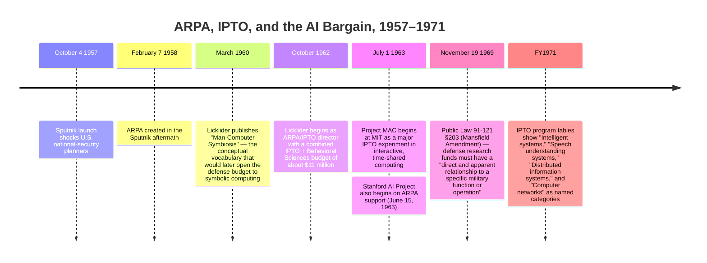

:::tip[In one paragraph]
The "blank check" early symbolic AI received was not literally blank. Before ARPA/IPTO, RAND, ONR, Air Force, and MIT military-lab channels had already funded Logic Theorist, GPS, and the MIT AI Project. What changed after October 1962 was scale, coherence, and tolerance for long horizons. Licklider's IPTO translated command-and-control anxiety into center-based funding for machines, languages, time-sharing, and graduate communities rather than narrowly specified weapons. By 1969 the Mansfield Amendment had begun to tighten the bargain.
:::

<strong>Cast of characters</strong>

| Name | Lifespan | Role |
|---|---|---|
| J. C. R. Licklider | 1915–1990 | Author of "Man-Computer Symbiosis" (March 1960). First director of ARPA's Information Processing Techniques Office (IPTO) from October 1962. The chapter's central protagonist; translated command-and-control anxiety into center-based funding. |
| Jack Ruina | 1923–2015 | ARPA director who hired Licklider and personally approved the $3-million Project MAC commitment within days of receiving the proposal. |
| Allen Newell & Herbert A. Simon | 1927–1992 / 1916–2001 | Carnegie Tech / RAND. Their Logic Theorist (1956) and GPS (1959) were the field's earliest defense-funded symbolic-AI demonstrations. |
| John McCarthy & Marvin Minsky | 1927–2011 / 1927–2016 | Co-founders of the MIT Artificial Intelligence Project in September 1957 — initially "a room, two programmers, a secretary, and a keypunch machine." McCarthy later founded the Stanford AI Lab on ARPA support beginning June 1963. |
| Senator Mike Mansfield | 1903–2001 | Sponsor of Public Law 91-121 §203, signed November 19, 1969. The "Mansfield Amendment" required defense research funds to relate to a "direct and apparent" military function. |
| Ivan Sutherland & Robert Taylor | — | Licklider's successors at IPTO. Carried the centers-of-excellence philosophy forward into graphics, networking, and resource-sharing. |

<strong>Timeline (1957–1971)</strong>

<strong>Plain-words glossary</strong>

- **ARPA / DARPA** — Advanced Research Projects Agency, created February 7, 1958. Renamed DARPA (Defense Advanced Research Projects Agency) in 1972 — out of scope for the period this chapter covers.
- **IPTO** — Information Processing Techniques Office. The ARPA office Licklider directed from October 1962. The chapter's central institutional actor.
- **Command and control** — The defence-planning frame under which interactive computing, time-sharing, theorem proving, symbolic languages, and machine perception could all be described as future decision infrastructure. The capacious umbrella that made ARPA/IPTO funding plausible to defence officials.
- **Centers of excellence** — Licklider's term for institutional bets like Project MAC, Carnegie Tech, and Stanford AI: large, broad-mandate funding to a handful of departments rather than scattered grants for narrow deliverables.
- **Project MAC** — Multiple Access Computer / Machine-Aided Cognition. MIT's IPTO-funded interactive computing experiment, beginning July 1, 1963 with a $3-million commitment from Jack Ruina.
- **Mansfield Amendment** — Public Law 91-121 §203 (1969). The statute that required defence research funds to relate to a "direct and apparent" military function. The boundary that started to tighten the open-ended bargain.
- **JOHNNIAC** — RAND's copy of the IAS computer, Air Force-funded. Newell, Shaw, and Simon's Logic Theorist ran on it.

## Sputnik Makes a Patron

The story of how artificial intelligence secured its first massive wave of institutional funding begins not with computers, but with a sudden crisis in the sky. On October 4, 1957, the Soviet Union successfully launched Sputnik, the first artificial satellite. The event was small in physical size and enormous in political meaning. It exposed a fear that the United States could be surprised not only by a weapon, but by an entire scientific and engineering system moving faster than American institutions could notice, interpret, and answer. The shock led directly to the creation of the Advanced Research Projects Agency (ARPA) on February 7, 1958. From the start, the agency was associated with preventing another technological surprise and preserving the technological superiority of the United States.

That origin matters because ARPA did not immediately turn to artificial intelligence as a named cause. The more urgent problem, as defense planners framed it, was command and control: how to collect information, process it quickly, present it intelligibly, and keep human decision-makers from being buried beneath the speed and scale of modern warfare. The problem was not simply that generals lacked faster calculators. The deeper anxiety was that radar screens, communications channels, warning systems, and military staffs could produce more data than a human organization could absorb in time. Between June and November 1961, studies conducted by the Institute for Defense Analyses for the Department of Defense identified computer-related research as a crucial avenue for improving these command-and-control systems. It was within this setting, not inside a campaign to sponsor "AI" as a self-contained discipline, that the Information Processing Techniques Office (IPTO) was formed in 1962.

The command-and-control frame also explains why the early funding story can look paradoxical. The research that benefited from IPTO often seemed far removed from a battlefield: theorem proving, symbolic languages, time-sharing, graphics, speech, and machine-aided problem solving. Yet the defense problem was defined at a level where all of those topics could plausibly matter. A command system was not one device. It was an arrangement of sensors, communications, computers, displays, procedures, and people. If that arrangement failed, it might fail because the machines were too slow, because the software could not represent the right situation, because the operator could not interact with the machine fast enough, or because the organization could not turn information into a decision. Under that definition, improving the relationship between people and computers became a national-security problem in its own right.

The conceptual vocabulary that would eventually open the defense budget to symbolic computing was provided by J. C. R. Licklider. In March 1960, Licklider published "Man-Computer Symbiosis," a paper that imagined close, cooperative interaction between humans and computers. Its central premise was not automation in the crude sense of replacing the human operator. Licklider wanted a partnership in which machines handled routinized, formal, and rapidly executed operations while humans supplied goals, judgment, and shifts of strategy. For such cooperation to work, the machine could not remain a remote batch processor that accepted a stack of cards and returned an answer hours later. It had to become an interactive partner.

Licklider therefore treated infrastructure as part of thought itself. He named computer time-sharing, memory components, memory organization, programming languages, and input and output equipment as prerequisites for the kind of cooperative work he imagined. Those categories sound mundane only in retrospect. In 1960, they marked a concrete technical program. Time-sharing promised that more than one person could work with a machine in a conversational rhythm. Improved memory and memory organization mattered because symbolic programs had to store lists, names, procedures, and intermediate structures, not just columns of numbers. Better languages mattered because researchers needed to express procedures at a level closer to reasoning than wiring. Input and output equipment mattered because a machine that was to assist judgment had to be seen, queried, corrected, and interrupted.

Licklider’s vision offered a powerful translation: interactive computing was not merely an abstract scientific pursuit, but possible infrastructure for future military decision-making. As historian Paul N. Edwards has argued, artificial intelligence entered ARPA partly by riding on these interactive command-and-control concerns. The link was broad, but it was not empty. A program that could manipulate symbols, answer questions, prove theorems, schedule tasks, or help a person explore alternatives could be described as part of a future command system even when no immediate weapon was specified. When Licklider became the first director of IPTO in October 1962, he carried this philosophy into government. His selection criteria, as reconstructed by Arthur Norberg and Judy O'Neill, emphasized scientific excellence, prospects for relevance to Department of Defense problems, and coherence among the efforts he sponsored. The money that would flow to early artificial intelligence researchers was permissible precisely because the military problem it aimed to serve was broad: keeping command, control, communication, and intelligence from being surprised.

## Government AI Before the Big Program

To understand the magnitude of IPTO's impact, it is necessary to look at the baseline of artificial intelligence research before the agency began funding at scale. Government money was already underwriting early symbolic reasoning work, but it was fragmented and modest, scattered across defense-adjacent institutions. ARPA did not create artificial intelligence from nothing. It changed the order of magnitude, the institutional shape, and the patience available to the field.

At the RAND Corporation, Allen Newell, Herbert A. Simon, and J. C. Shaw developed the Logic Theorist, an early milestone demonstrating that a machine could prove mathematical theorems. The surrounding institution was already part of the Cold War research state: the work was funded almost entirely by the Air Force through Project RAND, and the program ran on the JOHNNIAC computer, a machine itself funded by the Air Force. The result is often remembered as a conceptual breakthrough, but its mechanics were inseparable from hardware and language. Newell’s 1957 paper on the Logic Theory Machine described a non-numerical problem class that required variable storage and an interpretive pseudo-code language for the RAND JOHNNIAC. That detail is easy to pass over, yet it is central to this chapter. Symbolic reasoning was not just a clever algorithm dropped onto an available calculator. It required a way to represent changing symbolic structures, keep them in memory, and let a program interpret operations over them.

The theorem-proving demonstration therefore made two points at once. It showed that a digital machine could operate over symbols in a way that resembled a narrow form of reasoning. It also showed that such work was constrained by the architecture around it. A proof search had to be stored, modified, abandoned, resumed, and compared against alternatives. A program working on a non-numerical task could not be treated as if it were merely solving a differential equation faster than a human computer. It needed conventions for names, lists, procedures, and temporary results. The intellectual leap of the Logic Theorist depended on a material environment capable of supporting those conventions.

Newell and Simon continued this trajectory at the Graduate School of Industrial Administration at Carnegie Tech, developing the General Problem Solver. The name carried an ambition far larger than any one Air Force project: a program that could model problem solving itself. Yet until the early 1960s, this work remained principally funded by a patchwork of Air Force and Office of Naval Research money. That pattern is important. Defense agencies were already present in artificial intelligence, but the support was piecemeal. A laboratory could receive help, a machine could be available, a small group could push a program forward, but there was not yet a single office deliberately trying to build a national ecology of interactive computing and symbolic research.

The General Problem Solver also sharpened the distinction between early AI and ordinary numerical computation. Newell and Simon were not merely asking a machine to carry out arithmetic operations more quickly. They were trying to describe problem solving as a process of representing a current state, representing a goal, comparing the difference, and choosing operations that might reduce that difference. That style of work sat close to psychology, management science, and computer programming at once. It was therefore attractive to funders interested in decision processes, but it did not fit neatly into the procurement categories of finished equipment. Before IPTO, such work could survive through sympathetic Air Force and naval support. It could not yet assume the machine access, programming support, and long-run institutional protection that a large center would provide.

A similar environment existed at the Massachusetts Institute of Technology. In September 1957, John McCarthy and Marvin Minsky established the MIT Artificial Intelligence Project. The timing is striking: the project began in the same month as the Sputnik shock, but its early form was nothing like the later image of a lavish laboratory. Supported through military-funded arrangements via the Research Laboratory of Electronics, it consisted of little more than a room, two programmers, a secretary, and a keypunch machine. The phrase has become memorable because it compresses the contrast between ambition and means. McCarthy and Minsky were naming a field and recruiting a style of work, but the available infrastructure was thin. The intellectual agenda of early symbolic artificial intelligence was already present. What it lacked was interactive access, dedicated machines, a broader community of graduate students and programmers, and a funding structure that could tolerate long horizons without requiring every experiment to look like a finished military device.

## Licklider's IPTO Bet

The establishment of IPTO under Licklider radically changed the scale of artificial intelligence research, transforming it from a collection of small, isolated efforts into a large, high-profile academic domain. From the 1960s onward, the defense agency provided the bulk of United States support for artificial intelligence, an influx of resources that helped legitimize it as a permanent discipline. The new feature was not simply a larger pot of money. It was the decision to spend that money on centers, machines, languages, meetings, and continuity.

Licklider managed IPTO and the Behavioral Sciences Office with a combined budget of about $11 million and a lean administrative structure. That combination gave the office unusual leverage. A small staff could move quickly, but the funds it controlled were large enough to alter the lives of entire departments. Licklider's approach represented a departure from ordinary military procurement. Rather than scattering small grants to individual researchers for narrow deliverables, IPTO funded coherent programs and established major centers of excellence. Early commitments clustered around MIT and Carnegie Tech, reflecting his preference for broad institutional bets over isolated experiments.

The administrative style was personal, but not casual. Licklider looked for researchers who already seemed capable of defining important problems, then tried to place their work in relation to other sponsored efforts. That stance helps explain both the generosity and the limits of the period. A strong investigator might receive support for work whose military payoff was distant, but the work still had to belong to an intelligible program. The office was trying to make interactive computing real: to move from papers about symbiosis to machines that many people could use, languages that could express symbolic procedures, and laboratories where those pieces reinforced each other. In that sense, Licklider's budget was not a prize fund for isolated brilliance. It was a tool for building a distributed research system.

At MIT, Project MAC became one of IPTO's first major investments. The project was conceived as an experiment in interactive computing, aimed broadly at human-computer interaction and general-purpose time-sharing. Licklider was deeply involved in the evaluation of the proposal, and ARPA director Jack Ruina backed a $3-million commitment within days. The speed of that approval helps explain why later participants remembered the period as unusually permissive. Yet the permissiveness had a shape. Project MAC was not a blank order to do anything that seemed interesting. It offered a way to pursue machine-aided cognition, time-sharing, and online computation under the larger premise that future command systems would require more fluent interaction between people and machines.

Carnegie Tech offered a different but complementary center. Its proposal drew strength from the combined presence of Simon, Newell, Alan Perlis, and Herbert Green. Licklider wanted to reinforce their ongoing information-processing work and later identified the institution as an essential early center of excellence. The point was not merely to reward famous names. Carnegie joined behavioral science, computer science, programming languages, and problem-solving research in a setting where symbolic AI could be treated as part of a larger inquiry into information processing. That fit Licklider’s criteria: a strong team, a plausible connection to defense problems, and a relationship to the rest of the sponsored portfolio.

Stanford soon emerged as a third major center after John McCarthy relocated there. According to the laboratory's own retrospective, the Stanford Artificial Intelligence Project obtained its initial ARPA support beginning on June 15, 1963. Over the next decade, the project expanded significantly, ordered a PDP-6 computer, and relocated to the D.C. Power Laboratory. The exact local story belongs partly to Stanford's own institutional history, but for this chapter the larger point is clear: ARPA support allowed McCarthy's group to grow from a research program into a durable laboratory with its own machine culture. A subsequent center emerged at the Stanford Research Institute. Later summaries describe its early work in terms of automata intended for hostile environments, a formulation that links robotics, perception, and planning back to defense concerns without reducing the research to a single weapons project.

While this era of funding is sometimes described retrospectively as a "blank check," that phrase works best as a metaphor for open-ended support, not as a literal description of government paperwork. Licklider and his successors maintained a coherent strategy aligned with command-and-control objectives. IPTO’s direction actively shaped local decisions, sometimes forcing researchers to share resources rather than building independent silos. When McCarthy requested an independent time-sharing system for Stanford, IPTO refused. Instead, the office funded development of a LISP programming system for the System Development Corporation's Q-32 computer, a West Coast machine that multiple researchers could access. This is the crucial correction to the mythology of the period. Researchers enjoyed unusual freedom inside their domains, but the patron still cared about resource sharing, program coherence, and the strategic use of expensive machines.

The community itself became part of the infrastructure. Licklider instituted regular Principal Investigator meetings and used them as mechanisms for exchange, evaluation, and coordination across time-sharing, networking, graphics, and artificial intelligence. Such meetings mattered because the early field was small enough that a few laboratories could define its norms. A program manager could make researchers at MIT, Carnegie, Stanford, SDC, and related sites visible to one another; he could encourage them to borrow ideas, compare systems, and understand their local work as part of a larger project. Funding bought machines, but it also bought repeated contact among the people learning what those machines could do.

This social architecture continued beyond Licklider's own term. Ivan Sutherland, Robert Taylor, and Lawrence Roberts would each carry parts of the IPTO program into adjacent domains, especially graphics, resource sharing, networking, and later application-driven projects. The full ARPANET story belongs elsewhere, but the early logic is already visible here. A time-sharing machine became more valuable when researchers could imagine it as one node in a wider community of machines and users. Artificial intelligence benefited from that setting because its programs were demanding, experimental, and hard to isolate from the languages and operating systems around them. A symbolic system built at one site became more useful when its assumptions, tools, and failures could circulate among the others.

## What the Money Bought

The permissive funding provided by IPTO did not buy magic; it bought physical and software infrastructure. The shift from theoretical proposals to operational symbolic systems required interactive access, immense memory by the standards of the day, symbolic languages, device interfaces, and rooms full of terminals where graduate communities could live inside the systems they were building. The distinction matters because artificial intelligence did not advance by pure inspiration alone. A theorem prover, a planning system, a symbolic algebra program, or a robot controller needed a machine responsive enough to let researchers test, revise, and test again.

Project MAC’s 1964-1965 progress report stated the infrastructure problem directly. Its core objective was online computing for individual intellectual work, sustained by a large multiple-access system. The Compatible Time-Sharing System, running on an IBM 7094, served two purposes at once. It was a reliable service facility for users who needed computing power, and it was an active laboratory for man-machine interaction. In that dual role, CTSS embodied the IPTO bargain. It was useful infrastructure in the present and an experiment in the future style of computing that defense planners hoped would make command systems more responsive.

Time-sharing also changed the daily rhythm of research. A batch machine encouraged researchers to plan carefully, submit a job, wait, and interpret the output after the fact. An interactive system made programming more conversational. Errors could be found sooner. Programs could be explored rather than merely executed. Graduate students could become habitual users, shaping their questions around what the machine made possible. For symbolic AI, that rhythm was not a luxury. Programs that manipulated expressions, searched spaces of possibilities, or controlled devices needed continual adjustment. The closer the system came to immediate response, the more ambitious the research could become.

By the 1968-1969 period, the MIT Artificial Intelligence section was documenting an advanced ecosystem built on defense-funded hardware. Its environment relied heavily on PDP-6 and PDP-10 computers running the Incompatible Timesharing System. The money had also purchased symbolic manipulation infrastructure such as MATHLAB and MACLISP, alongside hardware for real-time device control, including robotic hands, computer eyes, and remote-control equipment. This catalog should not be read as a list of curiosities. It shows the widening meaning of AI infrastructure. A laboratory needed languages for symbolic expression, operating systems for interactive use, processors with enough memory to sustain large programs, and physical devices through which symbolic plans could meet the world.

MATHLAB and MACLISP are especially revealing because they sit between theory and machinery. A symbolic mathematics system required representations for expressions, transformations, simplification, and search. A LISP system required enough memory and responsiveness to make list processing useful as a daily medium of work rather than an occasional demonstration. Robot hands and computer eyes pushed the same issue into physical space. A program that reasoned about a proof could live entirely in symbols; a program connected to a hand or camera had to coordinate symbols with timing, signals, and equipment. IPTO's support let these layers coexist in one laboratory environment. The result was not a single invention called artificial intelligence, but a stack of mutually reinforcing systems.

The dependence on shared infrastructure meant that hardware limitations routinely shaped theoretical research. At the System Development Corporation, the Q-32 computer proved to have too little memory for the planned implementation of LISP 2. As McCarthy later recalled, the Q-32 had been the intended target, but its limited memory forced developers to redirect the language effort toward the IBM 360/67 and the PDP-6 and PDP-10 machines. This was not a minor procurement inconvenience. LISP was one of the core languages through which symbolic AI expressed itself. If a machine could not hold the intended system, the research agenda had to bend toward machines that could.

Stanford's PDP-6 and MIT's PDP-6/PDP-10 environment therefore belong in the chapter not as brand names but as constraints and enablers. The machines defined who could log in, how large a symbolic structure could become, how quickly an experiment could be repeated, and whether a language or robot system could be maintained as a living research tool. The same was true of the SDC Q-32 episode in reverse: a machine intended to support shared work could also become a bottleneck when its memory ceiling collided with the ambitions of a language project. The first era of large-scale AI funding was, at ground level, an era of allocation decisions about processors, memory, terminals, operating systems, and programmer time.

This is where the "blank check" metaphor both illuminates and misleads. It illuminates the unusual tolerance for long-horizon work. Researchers could build languages, operating systems, robot interfaces, and mathematical tools that did not immediately become fielded military systems. It misleads if it suggests indifference. IPTO’s broad command-and-control rationale made room for exploration, but that room was furnished with specific machines and governed by program managers who cared about coherence. The laboratories did not simply receive money. They received a durable environment in which symbolic AI could become a way of life for a generation of students and researchers.

## The Check Gets a Memo Line

By the late 1960s, the political and administrative climate surrounding defense research began to change. The permissive bargain of the early Cold War, in which open-ended basic research could be tolerated under the broad umbrella of command and control, started to require much more explicit justification. The change did not mean that artificial intelligence funding vanished. It meant that the language used to defend such funding became less casual.

The shift was visible within the agency's own documentation. During fiscal year 1965, IPTO program areas were described with broad labels such as command-and-control processes, human-machine interaction, computer languages, programming techniques, time-sharing, and advanced software. Artificial intelligence work could live inside those categories without appearing as a separate public line. Edwards notes that AI did not appear as a separate ARPA budget line until 1968. By fiscal year 1971, Norberg and O'Neill's program tables show a more explicit vocabulary: "Intelligent systems," "Speech understanding systems," "Distributed information systems," and "Computer networks." The discipline had become more visible as a named, trackable activity.

That visibility cut both ways. A named program could be defended, managed, and expanded. It could also be questioned. The same process that recognized intelligent systems as a category made it easier for legislators and administrators to ask why defense money was paying for a particular line of research. The old umbrella of command and control remained powerful, but it now had to be translated into more specific terms.

The timing creates a useful historical tension. In the early 1960s, the breadth of command and control helped make AI fundable before it was administratively neat. By the end of the decade, the growing success of the field made it more visible and therefore more vulnerable to demands for explanation. A line called advanced software could hide a great deal of exploratory work. A line called intelligent systems invited a different kind of scrutiny. The change did not prove that the work had become less relevant to defense. It showed that relevance itself had to be written down in a more inspectable form.

Congress imposed that pressure directly in November 1969, when Public Law 91-121 was enacted. Section 203 of the statute, widely known as the Mansfield Amendment, barred the use of fiscal year 1970 defense research funds unless a project or study had "a direct and apparent relationship to a specific military function or operation." The phrasing is worth lingering over because it drew a line through the earlier style of justification. Licklider's language of symbiosis and thinking centers had been capacious: it could encompass time-sharing, languages, graphics, theorem proving, and machine perception as pieces of future decision infrastructure. Mansfield's language demanded a shorter path from expenditure to military function.

:::note[The statutory text]
> "None of the funds authorized to be appropriated by this Act may be used to carry out any research project or study unless such project or study has a direct and apparent relationship to a specific military function or operation."

Public Law 91-121 §203 (1969). The legal/rhetorical narrowing from Licklider's broad symbiosis-and-thinking-centres vocabulary to the "direct and apparent" test happens in one sentence on the page.
:::

The statute did not act as a sudden winter that ended artificial intelligence funding overnight. The agency's support for major centers continued, and the later history of defense-funded AI would include speech understanding, robotics, expert systems, networking, and many other projects. But the rhetorical room for pure, open-ended scientific inquiry narrowed. Program managers and researchers had to make the military relevance of their work more legible. Some projects could still be defended as command, control, communications, intelligence, or hostile-environment automation. Others required more careful explanation than they had needed in the earliest IPTO years.

The Cold War blank check, then, was never truly blank. Before IPTO, defense money had already helped produce the Logic Theorist, the General Problem Solver, and MIT's tiny AI foothold. After IPTO, the difference was scale, coherence, and patience: a federal office willing to build centers, buy machines, sponsor languages, convene researchers, and let symbolic AI mature inside a broad national-security frame. By the early 1970s, that frame had not disappeared, but it had acquired a memo line. The bargain that made artificial intelligence large was still in force, only less willing to leave its purpose implicit.

:::note[Why this still matters today]
Every academic AI lab that depends on federal grants — every NSF or DARPA-funded research line that's allowed to ask broad questions before specifying a deliverable — descends from the Licklider bargain. The historiographic discipline matters: the bargain was never blank. Federal money flowed because researchers could plausibly describe their work as future command, control, communication, and intelligence infrastructure. When that justification became harder to sustain administratively (Mansfield 1969, then later DARPA retrenchment), the field's relationship to its patron changed even though the research continued. Modern reframings — "AI safety" funding, "national competitiveness" funding — repeat the same translation pattern Licklider invented in 1962.
:::
