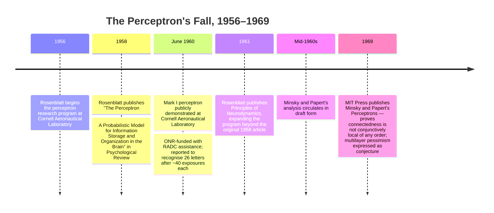

:::tip[In one paragraph]
The perceptron's fall was not one theorem killing neural networks. Frank Rosenblatt's Mark I — a real electromechanical machine backed by the Office of Naval Research — learned simple patterns from examples. Minsky and Papert's 1969 *Perceptrons* exposed severe limits in a defined class of local, single-layer systems. The winter effect came from how that precise result was absorbed by a field whose funding and authority had already shifted toward symbolic AI.
:::

<strong>Cast of characters</strong>

| Name | Lifespan | Role |
|---|---|---|
| Frank Rosenblatt | — | Cornell Aeronautical Laboratory psychologist; originator of perceptron theory and director of the ONR/RADC-funded Mark I program. |
| Marvin Minsky | — | MIT AI leader; co-author of *Perceptrons* (1969). Earlier neural-net researcher as well as symbolic-AI institution builder. |
| Seymour Papert | — | Co-author of *Perceptrons*; later explicitly addressed whether he and Minsky had tried to "kill connectionism." |
| Marvin Denicoff | — | ONR program officer; quoted by Olazaran on the funding scale gap between ONR support for Rosenblatt and ARPA's larger backing of symbolic AI. |
| Mikel Olazaran | — | Historian and sociologist whose 1996 *Social Studies of Science* analysis is a key later source on the controversy. |
| Leon Bottou | — | Author of the 2017 MIT Press foreword to *Perceptrons*; key later commentator on the book's reception. |

<strong>Timeline (1956–1969)</strong>

<strong>Plain-words glossary</strong>

- **Perceptron** — A computing element that applies weights to features of its input, sums them, and outputs a yes/no decision above a threshold. Rosenblatt's machine adjusted those weights by correcting its own errors during training.
- **Predicate** — A function that returns true or false about its input. Minsky and Papert asked which predicates a perceptron can compute given that its parts each see only a limited portion of the input field.
- **Connectedness** — A central example in *Perceptrons*, used to show how an apparently simple visual property can require nonlocal information.
- **Order (of a perceptron)** — Minsky and Papert's measure of how many input pixels a single partial predicate may examine simultaneously. Higher order means larger and more expensive local tests; the required order grows with problem size for parity and connectedness.
- **Locality/diameter-limited** — A perceptron whose partial predicates each look only at a bounded neighborhood of the input field. Minsky and Papert's proofs apply specifically to this constrained architecture, not to all possible multilayer systems.
- **Prior structure** — The representational bias built into a learning system before training begins: features, combinations, and architectural constraints.

# Chapter 17: The Perceptron's Fall

The standard story is too sharp. A neural network learned to recognize
patterns. Marvin Minsky and Seymour Papert proved that it could not solve XOR.
Funding vanished. Neural networks died until backpropagation brought them back.

That version is memorable because it has the shape of a fable. It has a
promise, a theorem, a villain, and a resurrection. It is also wrong in the ways
that matter most.

The perceptron did not fall because one toy Boolean example defeated the whole
idea of learning machines. The fall came from a collision between a physical
machine, a formal mathematical limitation, and an institutional shift. Frank
Rosenblatt's perceptron program was not empty hype. It was an ambitious attempt
to model perception as learned association rather than hand-coded symbolic
description. The Mark I perceptron was not just a diagram. It was a physical
research machine, backed by military research money, that demonstrated limited
forms of pattern learning with electromechanical hardware.

Minsky and Papert's critique was also not empty hostility. They studied a
particular mathematical class of perceptrons and showed that local, single-layer
systems ran into severe limits on global predicates such as parity and
connectedness. Their deeper point was not "learning is impossible." It was that
learning machines need prior structure. A system whose parts are not matched to
the task may be elegant, parallel, and trainable, and still scale badly.

The winter effect came later, when that critique was absorbed into a field
where symbolic AI had stronger institutions, stronger funding channels, and a
more persuasive story about what intelligence should look like. Neural-network
research did not disappear. It became unfashionable inside mainstream AI and
survived in scattered forms until new algorithms, new data, and more compute
made the old questions look different.

> [!note] Pedagogical Insight: A Theorem Is Not a Funeral
> Minsky and Papert exposed limits of a class of perceptrons. The historical
> damage came from how that result traveled through funding, authority, and the
> symbolic-AI climate of the 1970s.

## The Machine That Learned Letters

The Mark I perceptron was a machine before it became a myth. In June 1960, the
Cornell Aeronautical Laboratory demonstrated it as a research device for
pattern recognition. The setup was concrete enough to resist later caricature.
It had a sensory unit, a field of photocells, association units, response units,
and a training procedure. It was not a metaphor for future machine learning. It
was a built system that moved Rosenblatt's idea out of psychology and into a
room full of hardware.

The physical details mattered. The machine's "eye" used a 20 by 20 array of
photocells. It connected that sensory field to 512 association units and eight
response units. The public report described error-correction training: the
machine made a response, the trainer supplied correction, and the system
changed its associations. In the alphabet demonstration, it was reported to
recognize the letters after repeated exposures. That was a serious achievement
for the period, especially because the machine was not matching a stored
photographic template. It was learning associations from examples.

The same source also carried the limits. Mark I was described as a
limited-capacity research device. It was not being sold as a finished
application. Considerable research and development still stood between the
demonstration and practical uses, and the economics of useful deployment were
not established. That caveat is important because the later mythology often
forces the perceptron into one of two roles: either a ridiculous overpromise or
a suppressed breakthrough. The machine was neither. It was an early research
instrument that made a bold idea tangible.

The sponsorship mattered too. The Office of Naval Research funded the work,
with Air Force assistance through the Rome Air Development Center. In the early
Cold War AI environment, a public demonstration was never just a lab curiosity.
Pattern recognition promised military and industrial uses: reading, sensing,
classification, automated perception. A machine that could learn even a small
alphabet task suggested a path toward systems that did not need every rule
written by hand.

That promise should be read with restraint. The 26-letter demonstration was a
demonstration, not proof of general vision. The retina was tiny by human
standards. The response set was small. The hardware was special-purpose and
awkward. But a research device does not have to be a product to be historically
important. Mark I showed that learning from correction could be embodied in
hardware and made visible to sponsors. It turned connectionism into something
one could fund, photograph, and argue about.

It also made the limits visible. A machine with a fixed sensory array and a
finite set of association units had to confront scale immediately. Recognition
tasks that look small in a demonstration can become enormous when the input
field grows, when the categories multiply, or when the relevant distinction is
not local. The perceptron was born inside that tension: it was attractive
because it learned from examples, and vulnerable because learning still had to
be organized through a constrained physical architecture.

That physicality is easy to lose when the perceptron is remembered only as an
abstract network. Mark I did not run inside a modern software stack where one
could add units by changing a configuration file. Its "retina," association
machinery, and response channels were engineering commitments. Every increase
in the richness of the input or the number of possible responses implied more
hardware, more wiring, more training, and more uncertainty about whether the
learned associations would generalize. The later mathematical critique would
make that scaling problem cleaner. The machine had already made it visible.

The public demo also set a pattern that would recur throughout AI history.
Sponsors and journalists saw a working example and inferred a trajectory. The
researchers saw a working example and a long list of unsolved problems. Both
readings could be sincere. A small learning machine really did show that
pattern recognition might be approached through adaptation. It also left open
whether the same approach could survive more complex visual fields, noisier
inputs, and tasks where the important relation was spread across the whole
image. The fall of the perceptron begins with that double image: a legitimate
demonstration that invited a larger promise than its hardware could yet carry.

## Rosenblatt's Connectionist Bet

Rosenblatt's theory was broader than the Mark I hardware. In his 1958 paper, he
framed the perceptron around recognition, generalization, storage, memory, and
the influence of memory on behavior. Those are not small engineering topics.
They are the central questions of a psychology of intelligence. The perceptron
was meant to model how a system could acquire useful behavior from experience
without first receiving a symbolic inventory of the world.

The key move was associative. Rosenblatt opposed the idea that recognition
required stored, topographic images that could be compared against incoming
patterns. In the perceptron view, retained information lived in connections.
The system did not need a little picture of every object hidden inside it. It
needed a pattern of association strengths that could be changed by experience.
That made the perceptron both a machine-learning proposal and a theory of
memory.

This was why the program felt different from symbolic AI. A symbolic system
stores explicit structures that can often be inspected as rules, lists, or
expressions. Rosenblatt's perceptron stored its history in the weights and
connections of a network. The knowledge was distributed through the system's
organization. Recognition was not a lookup operation. It was a response
emerging from many simple units acting together.

That vision had real power. It gave AI a way to talk about learning as
adaptation rather than as search through already formalized descriptions. It
also connected machine intelligence to brain modeling, not because the
perceptron was a faithful brain, but because it made memory and recognition
properties of a network rather than of a central symbolic table. The point was
not that the machine thought like a person. The point was that experience could
reshape a system so that future stimuli produced different behavior.

Rosenblatt did not only talk in slogans. He distinguished kinds of perceptron
systems, and his later book made clear that the minimal three-layer
series-coupled perceptron was not the end of the program. He treated it as a
basic form, useful for analysis, while also discussing multilayer and
cross-coupled systems as directions where more complex behavior might appear.
That matters because a careless history turns Rosenblatt into someone who bet
everything on the simplest possible model. The actual program was more varied.

He also acknowledged practical deficiencies. Three-layer series-coupled
perceptrons could be described as universal in a formal sense, but that did not
make them efficient learning systems. Rosenblatt discussed problems of
generalization, analysis, size, learning time, and dependence on external
evaluation. Those are not the confessions of a naive promoter. They are the
problems any real learning architecture has to face.

The gap between formal possibility and practical learning was crucial. A system
can be universal in principle and still be nearly useless if it requires too
many components, too much supervision, or too much time to find the useful
organization. Rosenblatt's own categories show that he understood this. The
minimal perceptron was analytically convenient, but richer arrangements were
where he expected some of the hard cases to move. That made the program more
reasonable than the later caricature. It also made it more vulnerable, because
its strongest future claims depended on machinery and learning procedures that
were not yet demonstrated at the same level as the simple perceptron.

This distinction matters for the book's larger arc. Early AI often moved by
turning a philosophical question into a small operational system. Logic
Theorist turned proof into search. GPS turned problem solving into means and
ends. Mark I turned recognition into learned association. Each move was real,
but each also created a temptation to generalize from the small operational
case to the whole human faculty. Rosenblatt's program sat exactly on that line.
It had enough evidence to be taken seriously and enough unresolved structure to
be attacked seriously.

This is the first place where the perceptron story becomes subtle. Rosenblatt's
positive program and Minsky and Papert's later critique were not talking past
each other entirely. Both sides understood that the interesting question was
not whether a device could change weights in some small example. The question
was whether a learning architecture could scale, generalize, and receive the
right structure for difficult tasks. Rosenblatt thought more complex
perceptron organizations might solve some of those problems. Minsky and Papert
argued that the popular perceptron program had not earned that optimism.

## The Mathematical Turn

Minsky and Papert's Perceptrons did not examine every possible neural network
that later researchers might build. It defined a mathematical object and asked
what that object could compute. That definition is the part of the story most
often lost when the book is reduced to "XOR killed neural nets."

In their treatment, a perceptron computes a predicate by combining partial
predicates with weights and a threshold. A partial predicate looks at some
limited part or feature of the input. The perceptron then decides by a linear
combination of those partial results. This formulation let Minsky and Papert
ask geometric questions. Which global properties of an input field can be
recognized by a system built from local or limited pieces? How does the answer
change as the input field grows?

Connectedness was one of the central examples. Imagine a pattern on a retina:
some pixels are marked, and the question is whether the marked region is
connected. This is a global property. A small local patch can tell you
something about nearby marks, but it cannot by itself know how the whole
pattern is linked across the field. Minsky and Papert showed that connectedness
was not conjunctively local of any fixed order. They also showed that
diameter-limited perceptrons could not compute connectedness. In plain terms,
the local pieces did not scale into the global judgment.

The example is powerful because it feels visually simple. A person can glance
at many drawings and say whether the marked region hangs together. That
intuitive ease is deceptive. The property depends on relations among parts that
may be far apart. A broken bridge in one corner can change the answer for a
shape spanning the whole field. If each partial predicate only sees a bounded
neighborhood, then no fixed-size local test can guarantee the global answer as
the retina grows. The perceptron has to smuggle the global relation into its
partial predicates, and once it does that, the cheap local-parallel story
starts to break.

This is a much stronger historical lesson than the usual XOR anecdote. XOR is
useful as a tiny parity example: it shows that a linear threshold unit cannot
represent a simple nonlinearly separable relation without additional structure.
But XOR by itself is too small to explain the controversy. The larger issue was
order. For parity and connectedness, the required machinery grows with the
problem. A learning machine that looks plausible on small local distinctions
can become infeasible when the relevant property depends on relationships
spread across the whole input.

Parity is the bridge between the famous shorthand and the larger theorem. XOR
is the two-input case that later readers remember; the harder historical claim
is about parity as the input grows and the required order grows with it.

The geometry also mattered because perceptrons were sold partly through their
parallelism. Many simple units could operate at once. But parallelism is not
magic if each unit needs access to the whole field or if the useful partial
predicates become too large. The architecture has to match the structure of the
task. Local parallel summation is powerful when the task has local features
that combine cleanly. It is weak when the task requires an organized account of
global relations.

This was an infrastructure argument in mathematical form. The problem was not
only whether a predicate could be represented somewhere in a sufficiently
generous system. The problem was what had to be built for the representation to
work. How many partial predicates were needed? How large were they? Did they
remain local as the input grew? Could a learning procedure discover them, or
would a designer have to provide them in advance? These questions turned
representation into cost. They translated an apparent psychological promise
into requirements on architecture, training, and scale.

Minsky and Papert's target, then, was not learning as such. It was a kind of
unstructured optimism about learning. They argued that meaningful learning at
meaningful rates needs prior structure. If the partial predicates are chosen
randomly or quasi-universally, the system may contain the ingredients for many
computations in some abstract sense, but still have little chance of solving a
high-order problem efficiently. A big bag of possible features is not the same
as the right representation.

That argument was not anti-AI. It was a demand for theory. It said that learning
machines could not be judged only by small demonstrations or by biological
analogy. They needed mathematical accounts of what their architectures could
represent and how their learning procedures would find useful structure. In
that sense, the critique was severe but not irrational. It exposed a real
weakness in the way perceptrons had been promoted.

It was also easy to overread. A theorem about a defined class of local,
single-layer perceptrons is not a theorem about all future multilayer neural
networks. The later official story often blurred that boundary. It treated the
limits of a restricted architecture as if they had settled the fate of
connectionism. That is where the mathematics ended and the politics of
interpretation began.

## The Scaling Dilemma

The fairest version of the critique is also the most useful one for later AI.
A learning system does not become general because it has trainable weights. It
needs a representational bias that makes the task learnable. This was the
lesson hidden inside the perceptron controversy.

Rosenblatt's own later discussion helps make the point. He recognized that
minimal perceptrons faced serious practical problems. Their theoretical reach
did not automatically produce good generalization. Large systems could demand
too many units, too much learning time, or too much external evaluation. Adding
layers or cross-couplings might help, but that was a research hope, not a
working training method comparable to later backpropagation.

Minsky and Papert pressed exactly that gap. A perceptron might be universal
under some broad construction and still be poor at the actual tasks that made
perception interesting. If the system requires enormous or task-specific
partial predicates, it has not solved the problem of learning perception. It
has moved the hard part into the design of the feature set.

That is why "single-layer" is important but not sufficient. The book's strict
results applied to a class of single-layer systems defined through partial
predicates and linear thresholds. But the authors also expressed skepticism
about multilayer extensions because the field lacked convincing learning
procedures for them. That second claim was not the same as the theorem. It was
a conjectural judgment about research prospects. Later history would prove
that judgment too pessimistic, but not foolish. Multilayer learning really did
need better algorithms, better examples, and better compute before it could
become practical.

The straw man goes both ways. It is wrong to say Rosenblatt believed the Mark I
had solved vision. It is also wrong to say Minsky and Papert merely feared a
rival approach and killed it with a trick example. The serious disagreement was
about whether perceptron-style systems had a credible path from small learning
demonstrations to structured, scalable intelligence.

The answer in 1969 was not encouraging. The Mark I hardware was limited.
Rosenblatt's more ambitious architectures were not yet operational solutions.
The mathematical critique showed that local linear arrangements failed on
important global predicates. Symbolic AI, meanwhile, could point to programs
that manipulated explicit structures in theorem proving, planning, language,
and problem solving. Those symbolic systems had their own severe limits, but
they matched the institutional imagination of AI more cleanly. They looked like
reasoning.

That contrast shaped what counted as progress. A symbolic program could expose
its rules, goals, and search tree. A perceptron hid its knowledge in weights.
When the perceptron worked, it could seem mysterious. When it failed, it could
seem theoretically empty. Minsky and Papert's critique gave that discomfort a
mathematical language.

The discomfort was also methodological. Symbolic AI could say, "Here is the
knowledge, here is the inference rule, here is the search." Perceptrons asked
researchers to accept that the relevant knowledge might be a learned pattern of
associations whose internal organization was not easy to name. That was not
only a technical difference. It was a difference in what counted as an
explanation. In a field trying to establish itself as a science of
intelligence, inspectable structure carried authority. Distributed weights
looked less like explanation and more like behavior.

The result was not simply that neural networks lost an argument. They lost
status. The field's center of gravity moved toward systems that promised
explicit knowledge, structured representations, and programmable reasoning.
Perceptrons became associated with an earlier, overexcited phase of AI, even
though the actual scientific question was still open.

## From Theorem to Winter

The phrase "the perceptron killed neural networks" compresses too much. Leon
Bottou's later foreword captures the aftereffect more carefully: perceptron
research became unfashionable, funding was no longer forthcoming, and the
revival came only in the mid-1980s with the PDP movement and backpropagation.
That is a historical pattern, not a single-cause mechanism.

Mikel Olazaran's sociological account is useful because it separates the
technical proof from the official history built around it. The official history
said, roughly, that Minsky and Papert showed neural-network progress was
impossible. Olazaran argued that this was a closure story. It helped explain
why one research tradition had lost legitimacy while another had become
dominant. The proof concerned single-layer nets defined in a particular way.
The broader claim that multilayer connectionism had no future was a social and
institutional interpretation, not a mathematical consequence.

Funding made that interpretation consequential. Olazaran connects the decline
of perceptron research to an environment in which ARPA backed symbolic AI while
neural-net work struggled for support. ONR had supported Rosenblatt, but ONR
support was not the same as the larger funding possibilities available through
ARPA's AI priorities. Once the prestige and money moved toward symbolic
approaches, the perceptron critique became more than a book. It became part of
the justification for what the field would and would not pursue.

This is why the chronology should not be told as a clean before-and-after
switch. Perceptron work had already faced hardware and scaling doubts before
1969, and symbolic AI had already built institutional momentum. The book gave a
sharp, prestigious, mathematically literate form to doubts that sponsors could
understand. It did not need to be the only cause in order to be effective. In a
competitive funding environment, a respected negative result can change the
burden of proof. The next neural-network proposal has to explain not only what
it will build, but why it escapes the known critique.

That burden falls unevenly. A symbolic planning or theorem-proving project
could present itself as advancing the central program of AI. A perceptron
project had to present itself as reviving a suspect line. The result was a
feedback loop: less funding meant fewer demonstrations; fewer demonstrations
made the critique feel more decisive; the critique made new funding harder to
obtain. This is how a research style can decline without being formally
refuted.

The causality has to stay modest. Minsky and Papert did not single-handedly
cause the first AI winter. They did not close every lab or erase every neural
idea. The funding environment, the limits of early hardware, the difficulty of
scaling demonstrations, and the rise of symbolic AI all mattered. The book was
powerful because it arrived at a moment when sponsors and researchers already
needed ways to choose among competing visions of intelligence.

That is how a theorem becomes a winter story. A mathematical result identifies
a limit. A community turns the limit into a lesson. Sponsors use the lesson to
decide what looks promising. Graduate students notice which problems have
money, status, and advisors. Over time, a research direction can become not
false but unfashionable. It becomes a path that ambitious researchers avoid
unless they have unusual persistence or a home in a neighboring field.

Neural-network work did continue. Some ideas survived in psychology,
neuroscience, and pattern-recognition work adjacent to mainstream AI.
That survival matters because it prevents another myth: the idea that the field
went silent until the 1980s. What changed was not the total existence of neural
research. What changed was its position inside AI's official narrative. It
became peripheral, contested, and easier to dismiss.

That distinction also helps explain the later revival. The mid-1980s did not
create neural networks from nothing. It reconnected AI to techniques, questions,
and communities that had never fully vanished. The PDP program, the renewed
attention to distributed representations, and the practical use of
backpropagation were dramatic because they moved connectionist ideas back
toward the center. They did not erase the intervening work at the margins. They
made the margins newly visible.

The perceptron controversy therefore belongs at the start of the first winter
because it shows how AI cools. It does not cool only when a system fails. It
cools when a style of explanation loses credibility. It cools when sponsors
stop believing that the next grant will solve the missing piece. It cools when
technical limits harden into institutional common sense.

## The Door Left Open

The right ending is not vindication. Later neural networks did not prove that
Rosenblatt had already solved the problem. They proved that the problem was
still alive.

Backpropagation would reopen hidden-layer learning by making credit assignment
through internal units executable. Later mathematical and statistical work
would give multilayer learning a different kind of legitimacy. Reinforcement
learning and statistical learning would supply other ways to think about
adaptation. None of that makes the early perceptron controversy a simple story
of suppressed truth. The early systems really were limited. The mathematical
critique really did matter. The funding shift really did narrow what AI treated
as central.

What changed later was the machinery around the idea. The field gained better
training procedures, richer datasets, faster processors, and a different
statistical culture. The questions Rosenblatt cared about, recognition,
generalization, memory, and learned association, did not vanish. They waited
for a setting in which they could be attacked with stronger tools.

That is why Minsky and Papert should not be cast as villains. Their critique
forced a question that every later neural-network success also had to answer:
what structure makes learning possible? Modern systems do not escape that
question. Convolution builds image structure into the architecture. Attention
builds a different structure for sequence and context. Scaling laws depend on
data, optimization, and compute regimes. The lesson is not that prior structure
was unnecessary. The lesson is that the right structures were not the ones the
early perceptron program could yet supply.

Rosenblatt should not be cast as a fool either. His central bet, that useful
information could be stored in learned associations rather than explicit
symbolic descriptions, became one of the major ideas of modern machine
learning. But history did not reward the bet immediately. It punished the gap
between vision and infrastructure.

The perceptron's fall was therefore a hinge. On one side was the early optimism
that learning machines might grow intelligence out of examples. On the other
was the first winter's harder demand: show the representation, show the
scaling, show the path from demonstration to durable method. Symbolic AI would
take center stage for a while because it seemed to answer those demands more
directly. Neural networks would return only after they could answer them in
their own language.

The theorem did not close the door. It marked the threshold. For a generation,
most of AI chose not to walk through it.

:::note[Why this still matters today]
Every modern deep-learning system still answers the question Minsky and Papert posed: what built-in assumptions make learning tractable? Convolutional layers encode spatial locality and translation invariance. Attention mechanisms build a different structure for sequence context. Scaling laws depend on the relationship between data, parameters, and compute. The specific architecture of the perceptron lost, but the argument from the perceptron controversy — that trainable weights alone do not guarantee useful generalization — remains the working assumption behind every architecture choice in contemporary machine learning.
:::

