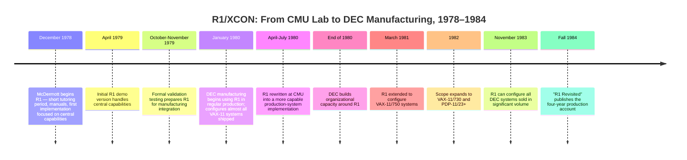

:::tip[In one paragraph]
R1/XCON, developed at Carnegie Mellon and deployed by Digital Equipment Corporation around 1980, was the first expert system to become industrial infrastructure. John McDermott's production-rule program configured VAX computer orders — translating customer requests into buildable hardware descriptions — by matching thousands of component facts and constraints rather than searching blindly. Its commercial success validated the expert-system boom; its maintenance story revealed the permanent cost: encoding expertise creates a knowledge base that must be fed, tested, and repaired indefinitely.
:::

<strong>Cast of characters</strong>

| Name | Lifespan | Role |
|---|---|---|
| John McDermott | — | CMU researcher; primary architect of R1 and author of the 1982 *Artificial Intelligence* paper documenting its task, rules, and manufacturing deployment. |
| Judith Bachant | — | DEC Intelligent Systems Technology Group; co-author of the 1984 "R1 Revisited" retrospective anchoring the four-year production and maintenance account. |
| Barbara Steele | — | Co-author of the 1981 IJCAI paper on ad-hoc constraints; her chapter relevance is the XSEL/R1 extension and customer-specific configuration advice. |
| Charles L. Forgy | — | Creator of the OPS-family production-system languages that provided R1's rule-matching substrate. |
| Allen Newell | 1927–1992 | Pittsburgh cognitive scientist whose Match method and production-system tradition underpinned R1's recognize-act architecture. |
| Reid G. Smith | — | Schlumberger researcher and author of the 1984 commercial expert-systems article that framed the engineering discipline R1 instantiated. |

<strong>Timeline (1978–1984)</strong>

<strong>Plain-words glossary</strong>

- **Production system** — A rule-based program architecture in which knowledge is stored as individual if/then rules (productions). Each rule specifies a pattern that must match the current program state and an action to take when it matches.
- **Working memory** — The production system's dynamic store of the current situation: for R1, the partial configuration in progress, active subtasks, selected components, and facts retrieved so far. Rules fire by pattern-matching against working memory and update it with each action.
- **Recognize-act cycle** — The basic rhythm of a production system: scan all rules to find those whose conditions match working memory, select one, execute its action, and repeat. R1's intelligence came not from the cycle itself but from encoding enough domain knowledge for the cycle to produce useful configurations.
- **Expert system** — A program that applies a domain-specific body of knowledge, typically extracted from human specialists, to produce outputs useful within a narrow task. R1 is an expert system because its rules encode the configuration constraints that experienced DEC engineers knew but could not easily state as a formula.
- **Knowledge engineering** — The discipline of extracting, encoding, testing, and maintaining the knowledge that drives an expert system. The Ch21 development and maintenance narrative is primarily a knowledge-engineering story: experts tutor, inspect output, identify missing cases, and the knowledge base grows accordingly.
- **Match** — The step in the recognize-act cycle where the interpreter finds rules whose left-hand-side conditions are satisfied by the current working memory.
- **OPS5** — The production-system language R1 used for its manufacturing-scale implementation.

# Chapter 21: The Rule-Based Fortune

The expert-system boom did not begin with a machine that understood the world.
It began with a machine that could help configure computers.

At Digital Equipment Corporation, a customer order for a VAX system was not yet
a buildable machine. It might name a processor, memory, storage, terminals,
interfaces, cabinets, and options, but the factory still had to turn the order
into a physical configuration. Which components were missing? Which boxes and
backplanes were compatible? Which cables were required? Which floor-layout
constraints mattered? Which exceptions did experienced configurators know from
hard practice but not from a clean theory?

R1, later known as XCON, made that problem commercially visible. It did not
reason like a general intelligence. It did not discover configuration knowledge
for itself. It did not remove human experts from the process. Its success came
from a narrower bargain: represent a difficult industrial task as thousands of
rules and component facts, run those rules in a production-system architecture,
validate the output against expert judgment, and keep maintaining the knowledge
base as products and customers changed.

The setting matters because it was neither a toy puzzle nor an open-ended
conversation. A VAX configuration was constrained by real hardware. The
processor, memory, buses, peripheral devices, cabinets, interfaces, and cables
had to fit together. The output had to be useful before assembly, not merely
interesting after the fact. If a configuration was wrong, people in the
manufacturing process would have to notice, correct it, and absorb the delay.
That made the domain ideal for showing what expert systems could and could not
do. The system could be judged against operational artifacts, but the knowledge
needed to produce those artifacts was scattered across experts, manuals, and
exceptional cases.

That bargain made expert systems feel real to business. MYCIN had shown that a
rule-based consultation system could perform seriously in a bounded domain, but
it stayed in research medicine. R1 moved the same broad idea onto the factory
floor. Its output was not only advice. It was an operational description that
could guide assembly. The fortune was not magic intelligence. It was the moment
when encoded expertise became part of a manufacturing workflow.

The warning was built into the success. The more R1 mattered, the more DEC had
to feed it new knowledge, correct missing cases, test releases, watch errors,
and maintain component descriptions. The rule-based fortune was also a
maintenance contract.

> [!note] Pedagogical Insight: The Product Was The Process
> R1/XCON's lesson is not "rules equal intelligence." It is that a narrow,
> structured, valuable task can make rule-based expertise operational if an
> organization keeps supplying, testing, and maintaining the knowledge.

## The Order That Was Not A Machine

Configuration was an unusually good expert-system problem because it sat
between a catalog and a factory.

A catalog alone was not enough. A VAX-11/780 system could be assembled in many
variations, with different peripheral devices, cabinets, interfaces, and
supporting parts. The customer might know what they wanted the machine to do,
but the order still had to become a valid arrangement of physical components.
The factory needed a description detailed enough for technicians to build the
system. A missing cable, wrong cabinet, unsupported peripheral combination, or
bad floor layout could turn a plausible order into a production problem.

This was not the kind of problem a general theorem prover could solve by
searching blindly through all possibilities. The task had structure, but much
of the structure came from local engineering knowledge. McDermott's 1982
account emphasized that a configurer needed properties for hundreds of
supported components, yielding thousands of pieces of component information.
It also needed constraints: rules about what could go with what, where things
could be placed, what had to be added when one option appeared, and which
ordinary assumptions failed in special cases.

That is why configuration belonged to the expert-system moment. A human expert
was not simply calculating from first principles. The expert carried a web of
product knowledge, shop-floor practice, exceptions, and design constraints. R1
made that web explicit enough for a program to act on it.

The physicality matters. R1's useful output included configuration descriptions
and diagrams. The system was not merely printing a conclusion such as "order
accepted." It produced material that helped people assemble a machine. This
keeps the story grounded. R1 succeeded because a narrow body of expertise could
be made operational in a process that already had clear stakes.

Those stakes make the word "fortune" more concrete. The chapter does not need
an exact savings number to explain why R1 attracted attention. A system that
could reduce the friction between sales orders and factory assembly had a
visible business role. It could help catch missing pieces earlier. It could
make expert configuration knowledge less dependent on a few people being in the
right place at the right time. It could help field offices screen orders sooner.
That is enough to explain the commercial excitement without turning the story
into an unverified return-on-investment claim.

The problem was also high volume. DEC sold many configurations, and each order
created opportunities for delay, rework, or expert bottlenecks. A successful
configurer could therefore be valuable without pretending to be intelligent in
the broad human sense. It only had to know this world well enough to help the
factory.

## Knowledge As Constraints

R1's knowledge was not one elegant theory. It was many small judgments written
as constraints.

McDermott described the original knowledge-acquisition task in concrete
numbers: hundreds of supported components, thousands of component properties,
and hundreds of extracted rules. Some rules initiated subtasks. Others extended
partial configurations. Many had an ad hoc flavor. They were not easy to derive
from clean physical laws or a compact mathematical model. They reflected how
particular VAX configurations actually had to be built.

That ad hoc quality is the key to the expert-system boom. Expert systems became
attractive where organizations already depended on specialized, practical
knowledge. The promise was not that the computer would invent expertise. The
promise was that expertise could be moved into a form that the organization
could run, inspect, and extend.

Configuration knowledge also had layers. Some facts described components: what
a part was, what it connected to, what space it occupied, and what other parts
it implied. Some rules controlled the order of work: which subtask to create,
which partial configuration to extend, or which missing item to retrieve. Some
rules embodied ordinary engineering constraints. Others captured exceptions.
The power of the system came from combining these layers so that a customer
order gradually became a more complete physical arrangement.

That gradual process is important. R1 did not receive a finished problem and
choose between a few options. It built a configuration step by step. Each rule
action could add structure, create a context, retrieve information, or make a
partial decision that prepared the next decision. The program's apparent
competence came from many small recognitions accumulating into a buildable
description.

Rules were a plausible representation because configuration decisions often
looked conditional. If this device is present, add that interface. If this box
is selected, reserve that space. If this customer-specific condition applies,
relax or strengthen an ordinary constraint. If this subtask is active, retrieve
the relevant component information. The rule form made each piece of knowledge
small enough to edit while still allowing the system as a whole to perform a
large task.

But small pieces did not mean simple maintenance. A rule could be locally clear
and globally troublesome. A missing rule could leave a configuration incomplete.
An overgeneral rule could fire in the wrong context. A component description
could lag behind the product line. An exceptional case could remain invisible
until an expert saw a bad diagram. The knowledge base turned expertise into
software, and software made expertise easier to run at scale. It also made
expertise something that could decay.

Decay is not a metaphor here. Product lines change. Supported options change.
Parts appear and disappear. Field practices change. Customers ask for special
arrangements. A rule base that was correct last quarter could become incomplete
without anyone making a dramatic mistake. R1's knowledge therefore had to be
treated as living operational data, not as a one-time capture of expert wisdom.

This is the commercial version of the knowledge-acquisition bottleneck from
Ch19. MYCIN had shown that domain knowledge had to be extracted from experts.
R1 showed that industrial knowledge also had to be kept synchronized with a
moving product line.

## Rules That Recognize

R1 was implemented as a production system. Its machinery can be explained
without turning the chapter into a programming-language manual.

The system maintained a working memory: a changing representation of the
current order, partial configuration, active subtasks, selected components, and
facts known so far. Rules contained conditions and actions. During a cycle, the
system looked for rules whose conditions matched working memory, selected an
appropriate rule, performed its action, and repeated the process. This is the
recognize-act rhythm.

The drama is not that recognize-act is mysterious. The drama is that enough
real-world knowledge had to be encoded so that this simple rhythm could produce
useful configurations. R1 did not wander through a huge abstract search space
hoping to stumble on a solution. Its Match method and rule organization used
domain structure to decide what to do next when enough information was
available. The system worked because the domain had enough local regularity for
rules to recognize meaningful situations.

The implementation history made that practical issue concrete. R1 began in the
OPS production-system family and was rewritten from OPS4 into OPS5 at CMU during
April-July 1980. OPS5's Rete matching network mattered because the interpreter
had to find relevant rules efficiently as the rule base grew. Without that
matching machinery, the recognize-act rhythm would have been an elegant
description of a system too expensive to run at manufacturing scale.

That distinction separates R1 from both brute-force search and magical
expertise. The program did not enumerate every possible VAX system and score
them. It used rules to recognize the next relevant configuration situation. If
the current partial system needed a device, a rule could propose one. If a
selected device implied a controller, another rule could add it. If a cabinet
choice created a placement constraint, the working memory changed and a new
rule became relevant. Intelligence, in this setting, looked like disciplined
local action.

McDermott's 1982 account reported hundreds of rules, with a distinction between
configuration-specific knowledge and more general control or support rules. Not
all rules were used on every order. In sample runs, only a fraction of the
available knowledge was needed for a particular configuration. That is exactly
what one would expect from a rule base encoding many possible component
relationships and exceptions. The system carried more knowledge than any single
order required.

This helps explain why R1 was commercially promising. A human expert could
remember a large number of cases, but that memory was tied to people. A rule
base could make the same body of constraints available repeatedly, in a
manufacturing process, provided the organization kept it accurate. The program
made expertise operational, not autonomous.

The rule representation also made correction possible. If an output exposed a
missing exceptional case, developers could add or split rules. McDermott
emphasized that rule splitting and context structure helped confine many
changes to related parts of the knowledge base. That did not eliminate the
maintenance burden, but it made continued growth imaginable. A brittle monolith
would have died early. A modular rule base could be taught.

The architecture therefore fit the sociology of the task. Experts could point
to a bad output and explain a missing condition. Knowledge engineers could turn
that explanation into a new rule or a more specific version of an old rule. The
system could be rerun on the same order to see whether the correction helped.
This was not automatic learning. It was an engineered loop between expert
inspection and rule revision.

## Experts Looking At Output

R1's development story is a useful antidote to expert-system mythology.

Work began in December 1978. After a short period of tutoring and manuals, an
early version could handle simple orders but failed on complex ones. That is
not an embarrassment. It is the shape of real knowledge acquisition. Experts
can explain central cases more easily than exceptions. Manuals can describe
product structure, but they do not automatically reveal every case that matters
in production.

The next stage depended on experts looking at the system's output. R1 produced
configuration descriptions and diagrams. Experts inspected them and pointed out
what was wrong, missing, or too simple. The knowledge base grew as these
failures became teachable moments. Exceptional cases were especially hard
because experts did not always produce them on demand. They recognized them
when they saw a flawed configuration.

That is a subtle but crucial feature of expertise. People often know how to
judge a case before they know how to state the rule that produced the judgment.
An expert asked in the abstract may forget an exception; the same expert
looking at an impossible cabinet layout may immediately see what is wrong.
R1's output therefore became a knowledge-acquisition instrument. The program
made partial ignorance visible.

This scene is important because it shows the human labor inside the machine's
success. The expert system was not a replacement for expertise; it was a way to
capture, test, and operationalize expertise. The experts had to tutor the
system. They had to examine output. Developers had to translate corrections
into rules. Then the system had to be run again.

Formal validation made the point sharper. In late 1979, R1 was tested on 50
orders. Six experts spent one to two hours per order examining the results.
They found errorful knowledge, the rules were changed, and the orders were
resubmitted. Only after that process did the system move into manufacturing
integration.

The validation scene also shows why expert-system development was laborious.
Fifty orders may sound small beside later production volume, but each order
required careful human scrutiny. Six experts spending hours on the results were
not rubber-stamping a demo. They were asking whether a technician could build
from the output. That made validation slow, expensive, and meaningful.

That validation should not be rewritten as perfection. It was a disciplined
transition from research artifact to production tool. The question was not
"does the program have intelligence?" The question was whether its output could
survive expert scrutiny well enough to enter the factory workflow.

## Into Manufacturing

R1's leap into DEC manufacturing is the chapter's turning point.

After validation, the system began producing configuration descriptions before
assembly. It also moved toward same-day screening of orders at regional field
offices. McDermott and Steele wrote in 1981 that R1 was being used by DEC
manufacturing to configure almost all VAX-11 systems shipped, and that DEC had
a group of people maintaining and extending the system.

Those claims should be handled with precision. They concern VAX-11 systems in
that period, not every DEC product and not all possible computer systems. They
also do not say that humans disappeared. The organization around the system was
part of the deployment. R1 became commercially important because it was
embedded in a workflow with experts, maintainers, field offices, product
knowledge, and manufacturing needs.

This is what distinguishes R1 from a laboratory demonstration. A demo can
impress by working once. A manufacturing system has to work again tomorrow,
with a slightly different order, a new product option, an incomplete component
description, or a customer exception that was not in yesterday's rule base.
Production does not ask whether the architecture is elegant. It asks whether
the system helps the organization ship correct machines.

Manufacturing also changed the error budget. In a research setting, a wrong
configuration could become an interesting failure case. In a production
setting, it could become rework. That did not mean R1 had to be perfect before
use; the later production story argues against waiting for impossible
completeness. It did mean that errors needed a reporting path, a review path,
and a release process. Once R1 became part of manufacturing, its quality became
an organizational responsibility.

The expert-system boom fed on this difference. R1 showed that rule-based AI
could be more than a research curiosity when the domain was right. Configuration
was narrow, valuable, structured, and repetitive. The organization had experts
who could supply knowledge. The output had operational value. The system could
be tested against real orders. Those conditions made the success credible.

Those same conditions limit the conclusion. R1 did not prove that rules could
run any business process or that expert systems were ready for every domain.
It proved that a particular class of industrial configuration problem could be
formalized enough for production use. The narrower claim is stronger because it
is true.

They also made the success expensive. Every new configuration family, product
change, and exception threatened to create new rule work. The system's value
depended on keeping up.

## Four Years In The Trenches

The later R1 Revisited account is valuable because it changes the scale of the
story. The 1982 paper shows how R1 worked and how it entered manufacturing.
The later account shows what happened after production use made the system
important.

By the early 1980s, the R1 organization had grown. The knowledge base moved from
about 250 rules in the April 1979 demonstration to about 850 by the end of 1980,
roughly 2000 in 1982, and about 3300 rules plus 5500 component descriptions by
November 1983. The system handled more product families and more orders. DEC
built a group around knowledge-based systems, and R1 remained a continuing
maintenance project rather than a finished artifact.

The four-year account described a system that had become both more capable and
more dependent on its support organization. It reported growth in rules,
component descriptions, system coverage, and order volume. It also described
testing, mentors, and continuing knowledge work. These details matter more than
the aura of success. They show what commercial expert systems actually became
when they mattered: not frozen expert brains, but maintained software and data
systems embedded in production.

The most important lesson is not any single number. It is the direction of the
numbers. More use meant more knowledge. More products meant more component
descriptions. More dependence meant more testing. More errors meant more
feedback from production. The system was not done when it succeeded. Success
created the conditions for further growth.

The maintenance process also changed the role of human experts. Former
technical editors and configuration specialists did not simply vanish. They
became reviewers, mentors, and sources of problem reports. They watched the
system's output, found cases where the rules or data were incomplete, and fed
those cases back to developers. That human loop was not a temporary defect. It
was how production knowledge stayed alive.

The mentor role is the opposite of the replacement myth. If anything, R1 made
expert judgment more structured. People who had once configured directly now
helped supervise a program that performed much of the routine work. Their
expertise moved into review, exception handling, and knowledge maintenance.
The labor changed shape; it did not disappear.

This is why "expert system" is a slightly misleading phrase if it makes the
expert disappear. R1 was better understood as an expert organization expressed
partly in software. The rules were one layer. The component database was
another. The release process, testing discipline, mentors, and maintenance
group were also part of the system.

The later production account also warns against a fantasy of complete coverage.
Even after tens of thousands of orders, the possible configuration space
remained larger than the observed cases. Missing or incorrect rules could
become rare while missing component descriptions and product changes remained
real problems. A rule-based system in a moving industrial domain had to live
with incompleteness.

That is one of the most useful lessons for later AI history. Deployment does
not end uncertainty. It changes how uncertainty is managed. R1 became valuable
not because it exhausted the domain, but because the organization found a way
to use it while continuing to repair it. The system's reliability was a moving
achievement, not a static property.

That incompleteness did not make R1 a failure. It made it a product.

## Customers Push Back

XSEL shows a different kind of pressure: customers did not always fit the clean
ordinary case.

XSEL was a sales-assistant system under development. It was not the same system
as R1. Its role was to help produce a skeletal order that R1 could then flesh
out and configure. But customers introduced ad hoc constraints: special
preferences, physical circumstances, or requirements that temporarily changed
what ordinary configuration rules should do.

McDermott and Steele's 1981 paper treated this as a bounded extension to R1.
The problem was not to make R1 generally intelligent. The problem was to let
XSEL pass customer-specific commands into the configuration process. R1 then
had to recognize those commands, let them take precedence where appropriate,
alter part of the configuration, and resume ordinary rule-based work.

That scene is small but revealing. Commercial systems meet customers, and
customers bring exceptions. A research system can define the task cleanly. A
sales and manufacturing system has to absorb pressure from actual use. If a
customer needs something unusual, the organization cannot simply reply that the
ontology is inconvenient.

The ad hoc constraint work also shows why R1's narrowness was strength rather
than weakness. The extension stayed inside configuration. It made R1 more
flexible within its domain, not beyond it. That is the honest lesson: a
rule-based system could be extended when the new demand still matched the
structure of the task. It could not become a universal reasoner by adding
customer commands.

The implementation details make the point vivid. XSEL could communicate a
limited set of commands. R1 needed rules to recognize those commands and adjust
the ordinary configuration flow. Only a modest portion of the existing rule
base had to change, because the extension was designed around the same
configuration problem rather than a new domain. Customer pressure entered the
system, but it entered through a controlled interface.

## Commercial Reality

R1 helped make expert systems attractive, but Smith's 1984 discussion of
commercial expert-system development shows why attraction was not enough.

Commercial systems solve real problems. That sounds obvious, but it separates a
product from a demonstration. A demo can be optimized for a conference room. A
commercial system must fit users, data, tools, release schedules, maintenance
teams, and organizational responsibility. It needs domain experts, knowledge
engineers, tool builders, and programmers. It needs rapid prototyping, but it
also needs transfer from prototype to product. It needs successive refinement,
but commercial settings may be reluctant to throw away the first working code.

This is why commercial expert systems were engineering projects as much as AI
projects. The knowledge engineer had to extract and encode expertise. The tool
builder had to make the representation usable. Programmers had to integrate the
system with surrounding software. Domain experts had to keep judging whether
the system's behavior matched practice. Managers had to decide when a prototype
was good enough to release and how much risk to accept while it improved.

R1 fits that frame. Its architecture mattered, but the architecture was not the
whole story. DEC had to collect knowledge, encode rules, manage component
data, test releases, review output, and keep the system aligned with the
product line. Those are product-development problems, not just AI problems.

This is where the fortune and the trap become the same thing. The fortune was
that a narrow expert system could become useful enough to justify an
organization around it. The trap was that the organization then had to keep
paying the knowledge cost. A successful expert system did not end knowledge
engineering. It institutionalized it.

The broader boom would not always remember that part. R1's story could be
compressed into a slogan: expert systems make money. The accurate version is
more demanding. Expert systems can create value when a domain is narrow enough,
structured enough, and valuable enough; when experts can supply and validate
knowledge; when the organization accepts ongoing maintenance; and when the
system is deployed as part of a real workflow rather than as a stand-alone
miracle.

That demanding version is more useful for understanding both the rise and the
later disappointment of expert systems. The boom was not built on nothing.
R1 was a real success in a real industrial setting. But the ingredients of that
success were specific. Where companies copied the slogan without the domain
fit, knowledge labor, testing discipline, and maintenance organization, the
same rule-based approach could become brittle, expensive, or disappointing.

That lesson carries directly into the next chapters. Ch20 showed the machine
room that made large symbolic systems practical. Ch21 shows those systems
becoming business infrastructure. Ch22 will follow one consequence of that
confidence: specialized AI hardware and companies built around the appetite of
symbolic programs. Ch23 will show another: national-scale ambitions that
treated knowledge processing as strategic infrastructure.

R1/XCON did not prove that expert systems would solve intelligence. It proved
something narrower and historically powerful: under the right industrial
conditions, rules could become fortune-bearing machinery, as long as people
kept feeding the machinery what it needed to know.

:::note[Why this still matters today]
The R1/XCON pattern reappears in every era of applied AI. Modern knowledge bases — whether stored as rules, embeddings, or retrieval indexes — still face the same maintenance contract: domain drift erodes accuracy, new products create coverage gaps, and deployment exposes exceptional cases that no training set anticipated. The distinction between a narrow, structured task that can be made operational and a broad domain that resists encoding remains the central engineering judgment in applied AI. R1 proved the distinction is real, not theoretical, and that success in the former does not licence ambition in the latter.
:::
