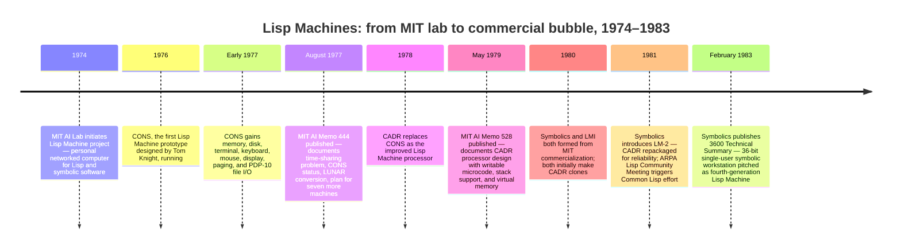

:::tip[In one paragraph]
In the late 1970s, MIT's AI programmers had outgrown time-shared PDP-10s — address limits, swapping, and slow response time were strangling large interactive Lisp systems. The Lisp Machine Group's answer was a personal processor and memory for each programmer, a 24-bit virtual address space, writable microcode, and an environment written almost entirely in Lisp. Commercialized as LMI and Symbolics (culminating in the 3600), the machines were technically coherent; the bubble formed when specialized hardware economics could no longer outrun improving stock workstations and portable Common Lisp.
:::

<strong>Cast of characters</strong>

| Name | Lifespan | Role |
|---|---|---|
| Thomas F. Knight Jr. | — | MIT AI Lab hardware designer; designed CONS, the first Lisp Machine prototype; co-authored the CADR memo. |
| Jack Holloway | — | MIT Lisp Machine Group member; co-authored the CADR memo alongside Knight. |
| David A. Moon | — | MIT Lisp Machine Group member; co-authored the CADR memo and the Lisp Machine Manual; key Symbolics figure. |
| Daniel Weinreb | — | MIT Lisp Machine Group member; co-authored the Lisp Machine Manual with Moon. |
| Guy L. Steele Jr. | 1952– | Co-authored the CADR memo; later co-authored "The Evolution of Lisp," the chapter's main historical synthesis. |
| Richard P. Gabriel | — | Co-authored "The Evolution of Lisp" with Steele; the chapter's key source for commercialization, Common Lisp, and stock-hardware pressure. |

<strong>Timeline (1974–1983)</strong>

<strong>Plain-words glossary</strong>

- **Time-sharing** — A mode of computer operation in which a single central machine divides its processor time among many logged-in users in rapid rotation, giving each the illusion of a private machine. Project MAC built interactive AI on time-sharing; by the mid-1970s the shared resource had become too crowded for large Lisp programs.
- **Tagged architecture** — A design in which each word of memory carries extra "tag" bits recording what kind of object it holds (symbol, integer, list pointer, function, etc.). Hardware and microcode can then act on type information directly, without software inspecting every value. The Lisp Machine used 4 tag bits per 32-bit word.
- **Writable microcode** — Microprogram memory that can be updated at runtime, unlike the read-only microcode of most commercial processors. Writable microcode let the Lisp Machine's implementation of the Lisp runtime stay close to the processor and be tuned as the system evolved.
- **Virtual address space** — The range of memory addresses a program can name, independent of how much physical RAM is installed. The PDP-10 had a 256K-word (18-bit) address limit that large Lisp programs were outgrowing; the CADR gave each Lisp Machine a 24-bit virtual space, supporting far larger programs.
- **Zetalisp** — The Lisp dialect that ran on the MIT Lisp Machines and their commercial successors. A descendant of Maclisp, it added object-oriented programming (Flavors), closures, and operating-system-like facilities, all accessible from the same Lisp environment.
- **Common Lisp** — A portable Lisp standard assembled from Maclisp, Interlisp, Spice Lisp, and Lisp-machine dialects after ARPA's 1981 community meeting. Its portability across stock hardware weakened the assumption that serious Lisp required a specialized machine.

# Chapter 22: The Lisp Machine Bubble

The Lisp machine should not be introduced as a joke. It was not an obviously
doomed luxury box for academics who refused to use ordinary computers. In the
late 1970s, it was a serious answer to a serious infrastructure problem.

MIT's AI programmers had grown up inside the time-sharing world. That world had
made interactive symbolic programming possible, but it also made every large
Lisp system compete with every other user for processor time, memory, and
responsiveness. Editors, debuggers, MACSYMA, LUNAR, programming assistants, and
experimental AI systems were not batch jobs that could politely wait their
turn. They wanted conversation with the machine. They wanted fast feedback,
large address spaces, display interaction, and a programming environment that
could stay alive while the programmer thought.

This is the first point to hold onto: the Lisp machine emerged from a culture
that had already learned to think interactively. Nobody wanted to go backward
to the old rhythm of preparing a job and waiting for a printout. The problem
was that the shared interactive machine had become too crowded and too small
for the programs that AI researchers wanted to build. The next step was not
less interaction. It was more personal interaction.

The Lisp machine inverted the time-sharing bargain. Instead of making one
central computer fair to many users, it gave each AI programmer a personal
processor and memory, then used the network for shared resources. It treated
service to the interactive programmer as more important than aggregate
efficiency. That was a rational choice when large Lisp systems were pressing
against PDP-10 address limits, swapping behavior, and response-time problems.

The bubble came later, when an excellent local infrastructure solution became a
commercial bet. If Lisp machines could stay far enough ahead of general-purpose
workstations, specialized AI hardware could define the future of symbolic
computing. If ordinary hardware caught up, and portable Lisp systems became
good enough, the same integration that made the Lisp machine beautiful could
become an economic trap.

> [!note] Pedagogical Insight: The Failure Was Not Technical Absurdity
> Lisp machines were fragile as businesses because they depended on special
> hardware staying far enough ahead. Their core idea, an interactive,
> inspectable, networked development environment, survived elsewhere.

## The Time-Sharing Wall

Project MAC had made time-sharing feel like liberation. By the mid-1970s, the
same environment could also feel like a wall.

A Lisp programmer working on a large symbolic system needed more than a prompt.
They needed an editor, a compiler, a debugger, running program state, files,
display interaction, and enough memory to keep the system from constantly
swapping. When the machine thrashed, the research rhythm broke. The programmer
was no longer conversing with a symbolic system. They were waiting for a shared
resource to recover.

The MIT Lisp Machine Group described this pressure directly. Lisp had become
central to AI work, especially in Maclisp and related systems, but the programs
kept growing. Language changes could hide some pain, but not all of it. Large
systems such as MACSYMA and Woods's LUNAR pressed against address-space limits.
The group imagined future intelligent systems that might need many times the
address space of the PDP-10. The problem was not that Lisp was unsuitable for
AI. The problem was that the hardware and operating assumptions around it were
becoming too small.

:::note[The address-space forecast]
> "Future programs are likely to be quite a bit bigger; intelligent systems with natural language front ends may well be five or ten times the size of a PDP-10 address space."

In 1977, the Lisp Machine Group framed a dedicated 24-bit virtual address space as an engineering answer to this pressure.
:::

This was a human problem as much as a technical one. The AI style depended on
incremental change. A programmer edited a function, tested it, inspected the
data structure, changed another function, asked the debugger a question, and
kept going. Slow response time did not merely waste seconds. It changed what
kind of work felt possible. If the machine could not stay with the programmer,
the exploratory style that symbolic AI depended on became expensive.

The editor and debugger are easy to underrate in this story. They were not
office conveniences. They were research instruments. A large Lisp program might
contain a living collection of definitions, data, partial experiments, and
debugging state. Losing the flow of that environment meant losing more than a
few minutes. It meant breaking the thread between idea, program, observation,
and correction. For symbolic AI, that thread was the method.

Gabriel and Steele later described the late-1970s hardware situation for Lisp
as bleak enough that Lisp machines looked like the wave of the future. That
judgment is easier to understand if we avoid hindsight. A general-purpose
machine that was acceptable for many programming tasks could still be poor for
large, interactive Lisp. Symbolic programs manipulated pointers, tags, lists,
stack frames, dynamic objects, and garbage-collected memory. They wanted an
environment designed around those operations rather than around batch-era
expectations.

The Lisp machine began as relief from that mismatch.

The address-space issue sharpened the same point. If a system such as MACSYMA
or LUNAR could not comfortably coexist with the rest of the development
environment, then the researcher had to choose between ambition and
interactivity. The Lisp machine promised not merely more speed, but more room
for the whole working world to remain present.

## One Processor Per Programmer

The MIT answer was personal computing for AI before personal computing became a
mass-market phrase.

The design did not try to make the central time-sharing system more polite. It
gave each user a processor and memory. Shared disks, file servers, and networks
could still connect the lab, but the most painful resources no longer had to be
time-division-multiplexed among many logged-in users. The programmer got the
full attention of a machine.

This was a philosophical break from the utility model. Time-sharing optimized
the distribution of a scarce central resource. The Lisp machine treated
personal responsiveness as the resource worth protecting. If the programmer was
the bottleneck in exploratory AI work, then a machine that served that
programmer directly could be justified even when it looked inefficient from the
machine room's aggregate view.

That sounded inefficient if one measured only total utilization. A central
machine could keep itself busy by juggling users. A personal Lisp machine could
sit idle while its user was thinking. The Lisp Machine Group argued that this
was the wrong measure for interactive AI work. The scarce resource was not only
processor cycles. It was the human research loop. A machine that wasted some
cycles but preserved the programmer's flow could be more effective than a busy
machine that made everyone wait.

The 1981 Lisp Machine Manual made the same world visible from the user's side.
The machine was a personal computation environment with Zetalisp, system
software, and interactive tools living together. It inherited much from
Maclisp, but it was not simply a Lisp interpreter placed on a workstation. The
language, runtime, editor, debugger, display, and system services were part of
one environment.

That environment also changed ownership of the machine. On a shared
time-sharing system, the user inhabited an account inside a larger service. On
a personal Lisp machine, the user inhabited the machine itself. The editor, the
compiler, the debugger, the window system, the file interface, and the running
program could all be understood as parts of a single extensible world. That
made the computer feel less like a remote service and more like a laboratory
bench for symbolic work.

This is the direct continuation of Ch20. Project MAC made shared interaction a
new norm. The Lisp machine asked what happened if that interaction became
personal, fast, and language-specific. Time-sharing had taught AI researchers
to expect an online environment. The Lisp machine tried to remove the
time-sharing pain while keeping the interactive culture.

It also kept the lab connected. The personal machine was not imagined as an
isolated appliance. Shared resources still mattered. Files, networks, and
communication linked machines into a working environment. The point was not to
abandon community; it was to stop other users' jobs from destroying your
response time while you were debugging a large symbolic system.

That balance explains why Lisp machines were seductive. They promised the best
parts of time-sharing, shared tools and shared culture, without the worst part:
waiting for someone else's job to stop swapping.

They also promised continuity. The AI Lab did not have to abandon Lisp,
Maclisp habits, EMACS-style editing, or the expectation that powerful programs
should be modified while alive. The machine adapted itself to the culture that
already existed. That is one reason the design felt natural to its native
users and harder to sell outside that world.

## CONS To CADR

The hardware story should stay concrete without becoming a parts catalog.

CONS was the prototype. Designed by Tom Knight, it showed that a processor
could be built around the needs of a Lisp environment. By early 1977, the
prototype had memory, disk, terminal support, paging, keyboard, mouse, display,
and file I/O through the PDP-10. The AIM-444 progress report described LUNAR
running on the machine and emphasized the capacity relief of putting large Lisp
systems in a bigger address space.

CADR was the next, more documented processor. The CADR memo is useful because
it keeps terminology precise: CADR was the processor; the Lisp machine was
CADR plus Lisp microcode and system software. That distinction matters because
later product names can blur hardware, microcode, and the operating
environment into one mythic object.

CADR was a 32-bit microprogrammable processor with writable microcode, virtual
memory, and support for stack and pointer manipulation. It was influenced by
Lisp, but it was not a toy that could only execute one frozen instruction
format. Writable microcode gave the system room to implement the Lisp machine
order code efficiently. Virtual addressing gave large symbolic systems more
space. Stack support and pointer operations served the running shape of Lisp
programs.

These details matter because they show what "special hardware" meant. The Lisp
machine was not special because it had mystical AI circuits. It was special
because the hardware, microcode, memory model, and software environment were
co-designed around interactive symbolic programming. Tags could help the
machine know what kind of object it was manipulating. Microcode could make
common runtime operations efficient. The display and input devices could make
the programming environment feel alive.

The tag idea is especially revealing. Lisp programs manipulate many kinds of
objects: symbols, numbers, lists, functions, arrays, and internal structures
that point to other structures. A conventional machine can represent all of
that in software, but the runtime pays for the translation. A machine with tag
bits and microcode support could make the representation part of the hardware
contract. The goal was not to make the machine conscious. It was to make the
ordinary operations of symbolic programming less awkward.

Writable microcode served a similar role. It let the implementation of the Lisp
runtime live close to the processor without freezing every design choice
forever. For a research environment, that mattered. The machine could be tuned
around the language and adjusted as the system evolved. The boundary between
architecture and language implementation was more porous than on ordinary
machines.

That integration is easy to lose in a modern summary. If we say only that Lisp
machines were "computers optimized for Lisp," the phrase sounds like a niche
preference. In the lab, it meant a machine whose architecture matched the work:
editing, compiling, debugging, allocating, inspecting, displaying, and running
large symbolic systems without fighting a general time-sharing host.

This is also why Lisp machines were general-purpose in a meaningful sense.
They were optimized for Lisp, but Lisp itself was the medium of a whole
computing environment. The machine could support editors, graphics, networking,
mathematics, language tools, and application programs. It was not a single AI
appliance. It was a general computer whose center of gravity was symbolic,
interactive development.

## The Operating System Was Also Lisp

The Lisp machine's deepest technical romance was not only its processor. It was
the software environment.

The MIT progress report described I/O software as essentially written in Lisp,
with only timing-critical pieces pushed down into microcode. The manual
described both the language and the operating-system-like parts of the machine.
That fusion was central. The user did not experience Lisp as one application
running on top of a separate, alien operating system. Lisp was the material of
the environment.

The editor made this visible. The Lisp Machine Group described a real-time
display editor written in Lisp, drawing on EMACS but taking advantage of the
machine's high-speed display, self-documentation, user-extensible commands, and
mouse interaction. The editor was not just where code was typed. It was a
front door into a live, inspectable system.

The display mattered because it changed how much state could be visible. A
terminal line can ask and answer questions, but a bitmapped display can keep
more of the working context present. Windows, menus, documentation, program
text, debugger output, and graphical objects could coexist. The mouse mattered
for the same reason. It made interaction with a live system less purely textual
without abandoning the programmability of the environment.

A Lisp programmer could work inside a world whose tools were themselves
available to the same language and style of extension. Commands could be
customized. Documentation could be near the program. The debugger could show
the running system rather than merely report a crash after the fact. The
compiler and runtime were part of the working conversation. The environment
made the distinction between using the system and changing the system feel
thinner than on more conventional machines.

That was powerful for AI. Symbolic programs often failed in ways that required
inspection, not just rerunning. The programmer needed to see structures, follow
control flow, change definitions, and resume work. A rich all-Lisp environment
turned debugging into a continuation of thinking.

The integration also had tradeoffs. AIM-444 noted that sophisticated display
interaction reduced ordinary device independence; the machine was not meant to
be used remotely over ARPANET like a simple terminal system. The very features
that made local interaction rich made the system less generic. That is the
recurring Lisp-machine bargain: deep integration bought power by narrowing the
assumptions around use.

That tradeoff foreshadows the business problem. A simple terminal interface can
travel widely because it assumes little. A rich local environment can be much
better for its intended user, but it also assumes a particular display,
keyboard, mouse, runtime, and culture. The Lisp machine's strength was that it
stopped pretending all computing environments were interchangeable. Its
weakness was that the market eventually punished some of that specificity.

Symbolics later productized this environment with tools such as Zmacs, a
display debugger, online documentation, networking, Flavors, incremental
compilation, and development support. The vendor pitch should be read as a
pitch, but the technical direction is clear. The product was not only hardware.
It was an entire high-level programming world.

That world also made source code unusually present. Symbolics emphasized the
scale and accessibility of its system software. The promise was that advanced
users could understand and extend the environment rather than treat it as a
closed layer beneath their programs. Again, this is a lab virtue turned into a
product claim. For the right user, inspectability was part of the machine's
value.

## Commercializing The Lab

Commercialization seemed sensible before it seemed dangerous.

The MIT prototypes had shown that personal Lisp hardware could solve real lab
problems. Gabriel and Steele describe CONS, CADR, and the spread of dozens of
CADR machines before commercialization. If AI labs, universities, and companies
were building larger symbolic systems, why not sell machines designed for that
work?

The move from lab artifact to product company produced LMI and Symbolics,
shifting the Lisp machine from a shared research tool toward competitive
commercial products. The interpersonal conflicts of the era are part of the
local lore, but the larger historical turn was technical and economic:
specialized Lisp hardware and its integrated environment had become valuable
enough to support companies that had to sell machines, support customers, and
defend a specialized stack against a changing hardware market.

Symbolics' own 1983 technical summary gave a clean product chronology. It
traced the project to the mid-1970s MIT AI Lab effort, described CONS and CADR,
identified Symbolics' formation, and presented the LM-2 as a CADR repackaged
for reliability and serviceability. The 3600 was framed as the more mature
fourth-generation expression of the idea.

The important shift is from relief to destiny. Inside MIT, a Lisp machine
solved an immediate infrastructure problem: time-sharing was hurting large
interactive Lisp. In the market, the same solution had to become a claim about
the future of computing. Customers had to believe that specialized symbolic
workstations would remain better enough, long enough, to justify buying into a
special vendor, special environment, and special culture.

That was not irrational. Expert systems were becoming commercially exciting.
Symbolic programming looked important. AI companies and labs needed rich
development environments. General-purpose workstations were improving, but
they had not yet erased the advantage of a machine built for Lisp. For a time,
the Lisp machine looked like the right future arriving early.

The timing also matched a broader shift in computing. Personal workstations,
local networks, high-resolution displays, and interactive software tools were
becoming symbols of serious technical work. Lisp machines belonged to that
world, but with an AI-specific center. They offered the workstation idea as
seen from inside a Lisp lab: not spreadsheets and office documents, but
inspectable symbolic systems, large runtimes, and language-aware tools.

## The 3600 Bet

The Symbolics 3600 shows the mature bet in one product.

Symbolics described it as a 36-bit single-user computer for high-productivity
software development and large symbolic programs. It combined a tagged
architecture, demand-paged virtual memory, a high-resolution display, disk,
Ethernet, mouse, audio, console processor, and a large software environment.
The system code was presented as accessible and extensive, with object-oriented
techniques throughout and an integrated world that did not look like a normal
operating system plus a language implementation.

The application list was broad: artificial intelligence, CAD, expert systems,
simulation, signal processing, education, physics, animation, VLSI, speech,
vision, and natural-language understanding. A vendor list like that is not
proof of adoption. It is evidence of ambition. Symbolics was not selling a
single-purpose AI appliance. It was selling a general symbolic workstation,
optimized for Lisp but pitched at many high-end technical tasks.

Networking was central to the pitch. Symbolics framed Ethernet as a way to keep
the communication and resource-sharing benefits of time-sharing while giving
each user single-user response, memory, customization, and crash isolation.
That is the Lisp-machine philosophy in product form: keep the community, remove
the wait.

This was not a small claim. It meant the 3600 did not have to choose between
the isolated personal computer and the shared institutional machine. A user
could have a private responsive environment while still reaching file servers,
mail, remote systems, and other Lisp machines. The product tried to make
personal computing compatible with the collaborative habits formed in the
time-sharing era.

The development environment was equally important. Zmacs carried forward the
EMACS lineage with real-time display editing, Lisp syntax awareness,
customization, mouse interaction, and online documentation. Debugging,
incremental compilation, dynamic loading, packages, streams, macros, and
Flavors made the machine a place to build large systems. A programmer did not
buy only a processor. They bought a style of work.

The application list makes sense in that light. AI and expert systems were
obvious targets, but Symbolics also pointed to CAD, simulation, graphics,
education, VLSI, speech, vision, and natural language. The common thread was
not that all these domains were identical. It was that they could benefit from
high-level interactive development, large symbolic or structured programs, and
rich displays. Symbolics was selling a platform for complex technical software.

This is why the 3600 should be allowed to seem impressive. The later fragility
of the market does not erase the technical achievement. The machine embodied a
coherent answer to the problems of large symbolic software. It made the
environment personal, visual, networked, inspectable, and deeply integrated.

But the same coherence raised the stakes. If the world moved toward portable
languages, cheaper workstations, and good-enough Lisp implementations on stock
hardware, the integrated special machine had to defend every part of its cost.
The better the 3600 was as a complete environment, the more it depended on
customers valuing the whole environment.

That dependence is the business risk hidden inside the technical achievement.
A customer who wanted the entire world, hardware, language, debugger, editor,
networking, graphics, and source-level environment, could see the appeal. A
customer who only needed a capable Lisp implementation might eventually ask why
ordinary hardware was not enough.

## Portability Arrives

Common Lisp changed the story without simply killing Lisp machines.

By the early 1980s, Lisp had fragmented into communities: Maclisp, Interlisp,
Spice Lisp, and Lisp-machine dialects among them. ARPA called a community
meeting in 1981, and the Common Lisp effort tried to pull the field toward a
portable standard. LMI and Symbolics participated even though the commercial
energy around Lisp still seemed concentrated in Lisp machines.

This was a success and a warning. The success was that a fragmented Lisp world
could converge on a shared language. The warning was that portable Lisp made it
harder to assume Lisp's future required a Lisp machine. If a substantial
language could run across broad classes of computers, then the special machine
had to justify itself by environment, performance, and integration, not by Lisp
alone.

That shift should not be overstated. Common Lisp did not instantly erase the
advantages of a dedicated environment. A portable language standard is not the
same as a mature workstation with editor, debugger, graphics, networking, and a
well-tuned runtime. But it changed the direction of travel. It made the
language less captive to any one machine family and gave implementers on stock
hardware a clearer target.

Common Lisp also exposed what could not easily be standardized. Features tied
to hardware, microcode, windows, graphics, Flavors, locatives, multiprocessing,
and multitasking were not simply portable language features. They belonged to
rich environments. Excluding or setting aside such features helped portability,
but it also separated the language from parts of the Lisp-machine experience.

Gabriel and Steele later noted criticism that Common Lisp assumed a large,
Lisp-machine-like world. That criticism cuts both ways. Lisp-machine ideas had
influenced expectations about what a serious Lisp environment should provide.
At the same time, standardization made it possible to chase those expectations
on machines that were not Lisp machines.

The portability turn also altered procurement logic. A company considering a
special Lisp workstation had to compare not only today's performance, but the
future path. Would the special machine keep improving faster than general
hardware? Would the vendor ecosystem remain healthy? Would code written in the
rich local environment move easily elsewhere? Common Lisp did not answer all
those questions, but it made them harder to avoid.

The portability turn therefore weakened the business assumption more than the
technical idea. The idea of a powerful interactive Lisp environment survived.
The requirement that such an environment live on a specialized vendor machine
became less secure.

## The Bubble Logic

The Lisp machine bubble was a timing problem, not a stupidity problem.

The machines solved real problems in their native setting. They gave AI
programmers personal responsiveness, large symbolic environments, mouse and
display interaction, networked resources, and a system written in the language
they used. They were not technically silly. They were excellent expressions of
a particular moment in computing economics.

The risk was that the moment would not last. Special hardware had to stay far
enough ahead of general-purpose hardware to justify its price, vendor
dependence, and cultural specificity. As stock workstations improved, as Lisp
implementations on general machines matured, and as Common Lisp made portable
paths more serious, the gap narrowed. A special machine could still be better,
but better was not enough if cheaper, broader, and good enough alternatives
kept improving.

This is the economic shape of many infrastructure bubbles. A specialized stack
can be the right answer when general tools are too weak. It becomes fragile
when the general tools absorb enough of its best ideas. The Lisp machine's
legacy was not erased by that process. Its environment anticipated later
expectations about interactive development, online help, graphical debugging,
networked workstations, and language-aware tools. The vendor box became
vulnerable; parts of the experience became normal.

The Lisp machine was a brilliant integration of hardware, language, tools, and
culture, but the commercial bet required that integration to remain
economically decisive.

That is the handoff to the next chapter. R1/XCON had made expert systems look
commercially real. Lisp machines made the symbolic-AI workstation look like a
business category. Then the Japanese Fifth Generation project would turn
knowledge processing and symbolic computing into a national strategic drama.
The early 1980s were full of confidence that special architectures,
knowledge-rich systems, and AI-specific infrastructure could define the future.

Some of that confidence was justified. Some of it was fragile. The Lisp machine
shows both truths at once: a machine can be technically brilliant and still
lose the economic race around it.

:::note[Why this still matters today]
The Lisp machine's core ideas did not die with the companies. Tagged-word architectures influenced later managed-runtime designs. The all-Lisp development environment — editor, debugger, compiler, and runtime as one inspectable world — is the ancestor of modern integrated REPLs, live-reload development tools, and notebook computing. The bubble itself is a durable economic lesson: a specialized stack is defensible only as long as its integration advantage outpaces general-purpose alternatives. Every wave of AI-specific hardware — from vector processors to tensor processing units — inherits the same race. The Lisp machine lost it first.
:::

