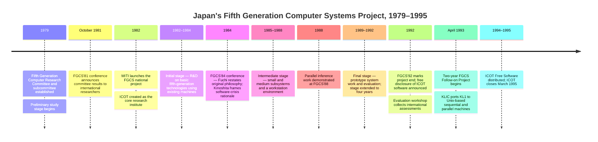

:::tip[In one paragraph]
In 1982, Japan's MITI launched the Fifth Generation Computer Systems project and created ICOT to pursue knowledge information processing on logic-programming languages and parallel inference machines. The Western reaction was larger than the project: observers read a national research bet as a strategic threat that might leapfrog existing software and hardware advantages. FGCS built real machines, languages, and researchers, but did not produce the popular AI revolution.
:::

<strong>Cast of characters</strong>

| Name | Lifespan | Role |
|---|---|---|
| Kazuhiro Fuchi | — | ICOT Research Center director; articulated the original predicate-logic/kernel-language philosophy in his 1984 keynote. |
| H. Kinoshita | — | Director-General of MITI's Machinery and Information Industries Bureau; framed FGCS within Japan's software crisis and the ambition for an advanced information society in his 1984 keynote. |
| Koichi Furukawa | — | ICOT researcher and author of TR-228 (1986/1987), a key mid-project technical account. |
| Takashi Kurozumi | — | ICOT author of the 1992 ten-year overview; documented the preliminary study, launch, staged R&D, and budget. |
| H. Gallaire | — | External evaluator at the 1992 FGCS evaluation workshop. |
| T. Moto-oka | — | Conference and project figure; edited the 1982 FGCS proceedings that announced the project to international audiences. |

<strong>Timeline (1979–1995)</strong>

<strong>Plain-words glossary</strong>

- **Fifth Generation Computer Systems (FGCS)** — Japan's 1982–1992 national research project aimed at building computers organized around knowledge information processing, logic programming, and highly parallel architectures. The "fifth generation" implied a new epoch beyond mainframes, minicomputers, and microprocessors.
- **Knowledge information processing** — FGCS's term for computing that works with facts, rules, relations, and inference rather than only numerical or administrative data. Distinguished from ordinary data processing by its concern with meaning and relationships.
- **Logic programming** — A programming style in which programs are expressed as logical relations and inference rules rather than step-by-step procedures. In the FGCS stack, logic programming served as the bridge between knowledge-level applications and parallel hardware. Prolog is the canonical logic-programming language.
- **ICOT (Institute for New Generation Computer Technology)** — The central research institute created in 1982 to pursue the FGCS project. Distinct from MITI (the policy sponsor) and from Japanese computer manufacturers (who participated but had their own interests).
- **PSI / PIM (Personal Sequential Inference / Parallel Inference Machine)** — The FGCS hardware sequence. PSI gave researchers a workstation environment in the intermediate stage; PIM prototypes targeted parallel inference in the final stage.
- **KL1 (Kernel Language 1)** — The integrating logic-programming language for the FGCS final stage. All application and system software, including operating systems, was intended to be written in KL1. Derived from GHC (Guarded Horn Clauses), itself a concurrent/parallel logic-programming language.
- **KLIC** — A compiler developed in the FGCS follow-on project that translated KL1 into C for Unix-based sequential and parallel machines, enabling FGCS software to escape its special-hardware dependency.

# Chapter 23: The Japanese Threat

The "Japanese threat" was a Western story about Japan, not a verdict this book
endorses.

In the early 1980s, Japan's Fifth Generation Computer Systems project landed in
the United States and Europe as more than a research plan. It sounded like a
warning. Japan had already become formidable in electronics and manufacturing.
Software was widely seen as a bottleneck. Expert systems and symbolic AI had
made knowledge look like a possible industrial resource. If Japan could combine
logic programming, parallel inference machines, and national industrial policy,
perhaps it could leap over the existing computer industry rather than merely
compete inside it.

That fear was larger than the project itself. MITI and ICOT did not build a
machine that overturned the world computer market. The Fifth Generation project
did not deliver the popular image of a computer that would understand language,
translate effortlessly, and reason at human scale by the early 1990s. But it
was not empty hype either. It was a coherent research bet around knowledge
information processing, logic programming, and parallel architectures. It built
machines, languages, operating systems, prototypes, and research communities.
It also helped mobilize rival programs abroad.

That duality is why the project is easy to misremember. If the standard is the
public fantasy, FGCS failed. If the standard is whether Japan organized a real
research program around a distinctive architecture for knowledge processing,
FGCS clearly happened and mattered. The historical task is to keep both truths
in view without letting either one swallow the other.

The project belongs at the end of Part 4 because it took the symbolic-AI
infrastructure story to national scale. Expert systems had made narrow rule
systems commercially credible. Lisp machines had made specialized symbolic
hardware plausible. FGCS asked whether a country could organize the next
generation of computing around knowledge processing itself.

> [!note] Pedagogical Insight: Threat Was A Perception Layer
> FGCS was a real Japanese research program. The "threat" was how foreign
> observers read it through fears about software lock-in, industrial policy, and
> losing the next computer architecture.

## A Conference Becomes A Warning

The Fifth Generation project became famous before it became fully understood.

Fuchi later recalled that the early public image was sensational. Reports
outside Japan often pictured a ten-year march toward machines that would solve
very hard AI problems, translate language, recognize patterns, and reason in
ways that sounded close to human intelligence. That image mattered because it
reached foreign observers at exactly the moment when Japan's industrial
strength already frightened competitors.

The phrase "fifth generation" helped the reaction. It suggested a clean break:
not just faster machines, but a new epoch after mainframes, minicomputers, and
microprocessors. To a U.S. or European reader in 1981 or 1982, the phrase did
not sound like a modest research program. It sounded like a strategic roadmap.

The name also converted a technical hypothesis into a story about succession.
Generations imply replacement. A new generation does not merely improve the old
one; it pushes it aside. That made the label powerful in foreign coverage. A
program about logic programming and inference machines could be heard as a
claim that existing architectures, existing software inventories, and existing
vendors would soon belong to the past.

The U.S. Office of Technology Assessment captured that mood in 1983. Its
analysis framed Japan's announced objectives as part of a competitive challenge
to the American computer industry. It linked the project to artificial
intelligence, information organization, natural-language input and output, and
the possibility of leapfrogging existing software lock-in. The fear was not
only that Japan would build better hardware. It was that Japan might change the
basis of competition.

That reading was understandable, but it was not the same as the project. The
actual FGCS program had a technical center: knowledge information processing
using logic programming on highly parallel machines. The Western warning story
wrapped that center in broader anxieties about semiconductors, supercomputers,
mainframes, software productivity, and national technology policy.

The warning story also simplified the Japanese side. MITI's role, ICOT's
research agenda, manufacturer participation, university work, and conference
publicity were folded into one image of "Japan" moving as a single strategic
actor. That simplification was useful for alarm. It was less useful for
understanding how the project actually worked.

This chapter has to keep both layers visible. The threat story explains why
FGCS mattered internationally. The project mechanics explain what ICOT actually
tried to build.

The mechanics are where the most interesting history lies. FGCS was not a
business plan with some AI vocabulary attached. It was an attempt to bind a
programming model, a machine architecture, and an industrial-policy problem into
one research program. That made it more ambitious than a normal product
roadmap and more fragile than a normal laboratory project.

## Japan's Software Crisis

Inside Japan, the rationale was not simply "beat America at AI."

Kinoshita's 1984 MITI keynote framed the project inside a rapidly computerizing
society. Japan had seen steep growth in installed general-purpose computers and
personal-computer shipments. Semiconductor technology was moving quickly. More
organizations wanted to use computers. The question was how to turn hardware
progress into useful information systems without drowning in software labor.

The numbers in Kinoshita's account were meant to show acceleration. General
computers and personal computers were spreading quickly through the economy.
That spread did not automatically create useful information systems. It created
demand for software, maintenance, expertise, and new ways to express problems
to machines. The more successful hardware became, the more visible the software
constraint became.

That was the domestic software crisis. If computer use kept expanding, Japan
would need far more software personnel. Kinoshita projected a large shortage by
1990 under continued growth assumptions. The exact projection should be read as
a planning estimate, not prophecy. Its significance is that software labor
looked like a structural constraint on the next stage of computerization.

Furukawa made the same point from inside the project. Hardware productivity was
improving, but software productivity lagged. If Japan wanted a new computer
market, it needed a way to make computers handle more knowledge-rich tasks with
less conventional programming effort. Knowledge information processing was the
name for that ambition.

The phrase "knowledge information processing" carried a promise different from
ordinary data processing. Data processing suggested records, transactions, and
procedures. Knowledge processing suggested facts, rules, relations, inference,
and interaction with human concepts. In the early 1980s, that sounded like the
next frontier: computers that could work with meanings and relationships rather
than only numerical or administrative data.

This matters because it makes FGCS less mysterious. The project did not arise
from science-fiction fascination alone. It responded to a practical industrial
question: if ordinary programming could not scale fast enough, could a new
computer architecture and a new programming model make knowledge processing
more productive?

That question links FGCS to the rest of Part 4. Expert systems had shown that
hand-coded knowledge could be useful but labor-intensive. Lisp machines had
shown that symbolic programs wanted specialized environments. FGCS asked
whether a deeper reorganization around logic programming and parallel inference
could make the whole process more systematic.

The answer FGCS explored was logic programming.

## The Technical Bet

FGCS was not just another expert-system program.

Fuchi said explicitly that the project was not an artificial-intelligence
project or an expert-system project, though it was closely related to both. The
distinction matters. Expert systems encoded domain rules inside existing
computing environments. FGCS aimed deeper in the stack. It treated logic
programming as the bridge between knowledge-level applications and parallel
computer architecture.

Furukawa's structure is useful: knowledge information processing sat above
logic programming, which sat above highly parallel architecture and VLSI
technology. Logic programming was the hinge. If problems could be expressed as
logical relations and inferences, then a parallel machine might execute many
parts of the reasoning process at once. The kernel language would not merely be
a user convenience. It would become something like the machine-language
equivalent for a new architecture.

This is what made FGCS different from simply buying faster machines. The
project imagined a vertical stack. At the top were applications that dealt with
knowledge. In the middle was a logic-programming language capable of expressing
the needed relations and control. At the bottom were parallel architectures
designed to run inference efficiently. The bet was that alignment across those
layers would produce a new kind of computing system.

That was the coherence of the bet. Symbolic AI had made knowledge and inference
central. The software crisis made conventional programming look insufficient.
Parallel hardware promised more computing power. Logic programming appeared to
connect them: a high-level way to express knowledge that might also expose
parallelism to the machine.

This was also the risk. A research hypothesis became a national architecture
strategy. If logic programming could carry the load, FGCS might open a new path
around existing software and hardware assumptions. If it could not, the program
would produce serious research without producing the industrial revolution that
foreign observers feared.

Logic programming therefore had to do too much. It had to be a research
language, a system-building language, a bridge to hardware, and a credible
basis for applications. That concentration was elegant, but it was also brittle.
The more the project unified around one language family, the more it depended
on that family being expressive, efficient, teachable, and portable enough for
many kinds of work.

The project therefore should be judged as a research architecture, not as a
promise to ship human-level AI. Its technical bet was ambitious and legible.
It was also narrower than the public fantasy.

## A National Lab For A Hypothesis

The organizational form matched the ambition.

Kurozumi described a three-year preliminary study from 1979 to 1981, followed
by the 1982 launch of the project and the creation of ICOT as the central
research institute. This was not a single university lab or a single company
product group. MITI coordinated a national research effort involving ICOT,
Japanese computer manufacturers, universities, and staged development goals.

The preliminary study matters because it shows FGCS was not invented overnight
by a speech or conference slogan. Committees examined future computer
technologies and moved from catch-up thinking toward original risky
development. That shift was part of the program's meaning. Japan did not merely
want to follow existing IBM-compatible paths forever. FGCS was presented as a
chance to define a new technological frontier.

That structure is why foreign observers read FGCS as industrial policy, not
only computer science. A nation-state was organizing a long-range computing
project around a new paradigm. The plan had stages: initial, intermediate, and
final. It had a schedule that eventually stretched from the intended ten years
to eleven. It had budgets and participating companies. It had conferences and
public reports. It looked like a strategic program.

But "Japan" was not a single actor. MITI, ICOT researchers, manufacturers,
universities, and foreign commentators had different roles and incentives. MITI
framed the industrial-policy problem. ICOT pursued research platforms and
languages. Manufacturers participated and watched for practical value.
Foreign observers turned the program into a signal about competition. Treating
all of that as one national will would flatten the history.

The staged structure also reveals the project as an experiment. The initial
stage used Prolog on existing machines. The intermediate stage built PSI and
SIMPOS around ESP. The final stage moved toward KL1, Multi-PSI, PIM, and PIMOS.
That progression shows an attempt to climb from language and workstation
infrastructure toward parallel inference machines.

The staging also gave the project a way to learn. Early work could use existing
machines and languages to explore the programming model. Intermediate systems
could give researchers an environment for building software. Final-stage
machines could test whether parallel inference hardware made the architecture
real. The plan was ambitious, but it was not formless.

The staged plan also made the project publicly legible. Foreign observers could
look at the schedule and imagine a countdown: first prototypes, then better
tools, then final inference machines. That made FGCS easier to turn into a
threat narrative. A vague research agenda is hard to fear. A staged national
program with conferences, institutes, participating manufacturers, and named
machines gives the imagination something to hold.

The program was not simply buying hardware. It was trying to align language,
operating system, and machine architecture around inference.

That alignment was the project's deepest continuity. The initials and machine
names changed across stages, but the research question stayed recognizable:
could a logic-programming model organize the whole stack from applications down
to parallel execution? Whether or not that became the future, it was a coherent
attempt to make symbolic reasoning architectural rather than merely
programmatic.

## Machines For Inference

The technical artifacts matter because they keep FGCS from dissolving into
geopolitical theater.

PSI, the personal sequential inference machine, gave researchers a workstation
environment for the intermediate stage. SIMPOS was written in ESP, itself a
more user-friendly language in the logic-programming family. That is already a
different path from the Lisp machine. Ch22's world optimized an all-Lisp
environment for an individual symbolic programmer. FGCS optimized around logic
programming as an interface between software and inference hardware.

The PSI stage is important because it shows how infrastructure precedes
ambition. Before final parallel machines could carry the whole project,
researchers needed daily tools. PSI and SIMPOS gave them an environment in
which logic-programming systems could be written, tested, and used. The machine
was not the final dream. It was a working platform for the research community.

GHC and KL1 continued that direction. GHC developed concurrent and parallel
logic-programming ideas; KL1 became the integrating language for final-stage
research. Multi-PSI and the PIM prototypes pushed toward parallel inference
machines. PIMOS extended the operating-system side of the project. Kappa, MGTP,
HELIC-II, and other systems showed application and theorem-proving work around
the platform.

Those names should not become an acronym parade. Their purpose in the chapter
is to show that FGCS became a layered engineering effort. Languages, operating
systems, prototype machines, theorem provers, and applications all had to make
sense together. The project was trying to build an ecosystem for inference,
not a single showcase program.

The project tried to discipline itself through language. Fuchi later described
an effort to write application software and basic software such as operating
systems in KL1. This "one language" ambition was bold. It promised coherence
across application, system, and architecture. It also made the project depend
heavily on whether that language could serve many roles well enough.

The ambition is easier to understand if we compare it with ordinary software
layers. Most computer systems separate application languages from operating
system implementation languages and from hardware control. FGCS wanted a much
tighter relationship. The same family of logic languages would express
applications, system software, and machine-facing computation. If successful,
that would reduce translation between layers. If unsuccessful, weaknesses in
the language choice would propagate through the whole architecture.

Here again, FGCS looks less like hype and more like a concentrated research
program. The researchers built tools, languages, operating systems, and
machines to explore one architectural thesis: inference could be the center of
future computing.

That thesis was historically important even when the market did not validate
it. It pushed researchers to ask how much parallelism logic programs could
expose, how operating systems should support inference workloads, and how
knowledge-processing applications should be written when the language itself
was meant to be close to the machine.

The problem was not that nothing was built. The problem was that building
research infrastructure is not the same as transforming the computer industry.

## The Threat Lands Abroad

Western alarm had its own logic.

OTA's 1983 analysis did not view FGCS in isolation. It placed the project next
to Japanese mainframes, supercomputers, semiconductors, government-backed
projects, and the competitive position of U.S. firms. It noted that U.S.
companies still held a much larger share of the world market than Japanese-owned
firms. That made the fear more specific: Japan was not already dominant in
general computers, but it might use a new generation to change the rules.

That distinction made the threat more dramatic. If Japan had already dominated
general computing, FGCS would have looked like consolidation. Instead, it
looked like a possible bypass. U.S. firms had enormous installed advantages,
especially software compatibility and market share. A new architecture that
made old software less important could threaten those advantages in a way that
ordinary compatible machines could not.

Software lock-in was central to that fear. Existing computer markets were tied
to installed software inventories. If fifth-generation systems made current
software less decisive by shifting toward knowledge processing, natural-language
interfaces, or new architectures, Japanese firms might leapfrog the advantage
held by incumbents. In that story, AI was not just a scientific frontier. It was
a way around the software moat.

This is why natural-language interfaces and knowledge processing sounded
strategic even when they were technically immature. If users could interact
with machines in higher-level ways, and if knowledge bases could replace some
traditional programming, then the old advantage of existing software libraries
and compatible machines might weaken. That was the leapfrog fantasy: not that
Japan would clone the existing stack better, but that it would make parts of
the existing stack less important.

Later, the National Research Council described FGCS as one of the Japanese
announcements that concerned U.S. policymakers and helped stimulate a
substantial U.S. response led by DARPA, including the Strategic Computing
Initiative. That wording matters. FGCS helped stimulate the reaction. It did
not alone cause Strategic Computing, Alvey, MCC, or the second AI winter.
Western programs had their own politics, budgets, constituencies, and fears.

This bounded causation is essential. National technology programs rarely have
one cause. U.S. and European responses drew on military needs, industrial
competition, academic lobbying, semiconductor concerns, and local policy
debates. FGCS was a catalyst and symbol, not a puppet master.

The reaction nevertheless shows FGCS' symbolic power. A Japanese research
program about logic programming and parallel inference became a mirror in which
Western institutions saw their own vulnerabilities: software productivity,
hardware competition, industrial policy, and the possibility that AI-specific
architectures might matter.

That mirror effect is part of AI history. Technologies do not influence the
world only through working products. They also influence funding decisions,
research agendas, institutional alliances, and fear. FGCS changed what other
countries thought they had to be ready for.

That influence should not be dismissed because the feared takeover did not
arrive. A program can fail to dominate markets and still redirect money,
attention, and research labor. FGCS made symbolic AI infrastructure appear
strategic. That perception helped make the early 1980s a moment when AI was not
only a laboratory pursuit or a commercial expert-system opportunity, but a
matter of national competitiveness.

That is why the title of this chapter belongs in quotation marks conceptually,
even if not typographically. The "Japanese threat" was a reading of the moment.
It was a perception layer built on real research and real competition.

## The Hype Narrows

By 1992, Fuchi was explicit about the gap between image and project.

He said the 1981 conference and early reports had produced an exaggerated
worldwide image. The public fantasy included very hard AI problems and
human-level machine translation inside the project schedule. Before launch, the
practical goals narrowed. Application systems such as machine translation and
most pattern-recognition topics were removed from the practical project goals.
The actual program centered on the infrastructure for parallel inference and
knowledge information processing.

:::note[The project director's correction]
> "When this project started, an exaggerated image of the project was engendered, which seems to persist even now."

Fuchi's 1992 correction matters because it came from ICOT's director, not from a foreign critic trying to dismiss the project after the fact.
:::

This retrospective correction is unusually valuable because it came from inside
the project. Fuchi was not simply a foreign critic dismissing FGCS after the
fact. He was distinguishing the sensational image from the research program
ICOT actually pursued. That distinction lets us avoid both triumphalism and
ridicule.

This narrowing should not be treated as a scandal. It is what happens when an
ambitious public image meets research planning. The project had to decide what
could actually be built. It chose languages, machines, operating systems, and
parallel inference platforms rather than a direct march toward all the popular
AI applications.

The final evaluation material gives the balanced view. Uchida and Fuchi framed
the project as combining highly parallel processing and knowledge information
processing using logic programming, culminating in prototypes and free software
dissemination. Gallaire's external evaluation was more critical: the project
had little real-world application use and limited direct manufacturer impact,
but it developed strong technical work in parallel operating systems, hardware,
logic programming, networks, load distribution, and related skills.

Gallaire's criticism is especially useful because it separates research value
from adoption. A project can produce sophisticated prototypes and skilled
researchers while still failing to reshape industry. That is not a contradiction.
It is the common fate of ambitious research programs whose technical center
does not become the market center.

That mixture is the honest legacy. FGCS did not triumph as an industrial
forecast. It did not make Japan the uncontested owner of the next computer
generation. It did, however, produce a body of research and people trained in
parallel logic programming and knowledge-processing infrastructure.

The follow-on work reinforces the same point. ICOT Free Software made project
software available, while KLIC helped move KL1 ideas onto Unix-based sequential
and parallel machines. Even the dissemination story contained a portability
lesson: software tied to special machines spreads less easily than software
that can move to broader platforms.

That portability lesson echoes Ch22. Lisp machines struggled when their rich
environment remained tied to special hardware while general machines improved.
FGCS faced a related problem from a different direction: PIM/PIMOS and KL1
work could be technically interesting, but dissemination became easier when
KLIC moved KL1 toward Unix-based machines. Special infrastructure can be
powerful in the lab and difficult in the world.

## Legacy Without Triumph

FGCS closes Part 4 by showing symbolic AI at its most infrastructural and most
political.

The project combined ideas that had been building for decades: symbolic
knowledge, rule-like reasoning, special architectures, interactive development,
and the desire to make computation serve higher-level intellectual work. But it
also showed the danger of projecting too much from a research architecture. A
coherent technical bet is not the same as an industrial forecast. A national
program can catalyze research without controlling the future.

That is the sober lesson behind the threat story. FGCS was not wrong because it
asked whether new architectures could serve knowledge processing. That was a
reasonable question in the early 1980s. It became overread when observers
treated the research hypothesis as a near-term industrial destiny.

The same pattern will repeat in later AI history. A technical result becomes a
forecast; a research direction becomes a national race; infrastructure choices
become claims about who will control the future. FGCS is an early, unusually
clear example because the project made the stack explicit. Language, hardware,
software productivity, industrial policy, and foreign reaction were all visible
at once.

The Western panic was not imaginary, but it was amplified. Observers saw Japan's
electronics success, a software crisis, and a bold AI architecture program, and
they inferred a possible industrial realignment. Some responses were
productive. FGCS helped spur rival research efforts and forced governments and
companies to ask what computing after conventional software might look like.
But the feared takeover did not occur.

That failure-to-take-over should not flatten the project into ridicule. FGCS
advanced parallel logic-programming research, built prototype machines,
developed operating-system and language work, disseminated software, and trained
researchers. Its limits are equally important: the popular AI applications were
too hard, the architecture did not become the new mainstream, and practical use
lagged behind technical ambition.

This is the hinge into Part 5. The symbolic/infrastructure arc had reached a
high point: expert systems in factories, Lisp machines as symbolic
workstations, and FGCS as a national architecture for knowledge processing. The
next revival would come from a different direction. Statistical learning,
probability, optimization, and data-driven methods would begin to regain
authority, not because symbolic AI had produced nothing, but because the limits
of hand-built symbolic infrastructure had become visible.

The Japanese Fifth Generation project therefore deserves neither mockery nor
myth. It was an ambitious national research program that made sense in its
moment, frightened competitors beyond its actual scope, and left behind a mixed
legacy: real research, no revolution, and a lasting warning about mistaking the
future of AI for a plan announced at a conference.

:::note[Why this still matters today]
Every decade produces a version of the FGCS story: a government-backed AI initiative, a credible technical bet, and a threat narrative larger than the project. Today's practitioners encounter the same pattern in national AI strategies, large-model race coverage, and claims that one architecture will make existing software irrelevant. The FGCS legacy offers two calibration points: research programs can produce real technical output — languages, machines, trained people — without delivering the industrial revolution observers feared; and software tied to proprietary hardware spreads less easily than software portable to commodity platforms. Both lessons remain live.
:::
