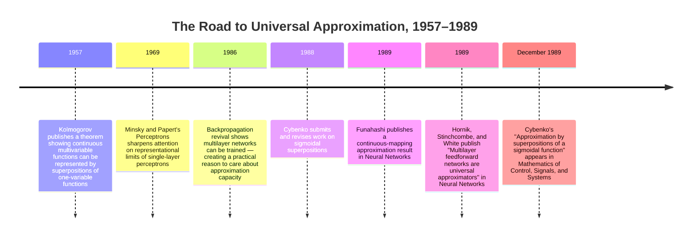

:::tip[In one paragraph]
In 1989, George Cybenko proved that finite sums of sigmoidal units can uniformly approximate any continuous function on the unit hypercube. The same year, Hornik, Stinchcombe, and White showed multilayer feedforward networks are universal approximators, and Funahashi gave a parallel continuous-mapping result. The 1989 cluster did not make neural networks easy to train; it ended a representational doubt left by the perceptron backlash, giving researchers mathematical permission to keep building hidden-layer systems.
:::

<strong>Cast of characters</strong>

| Name | Lifespan | Role |
|---|---|---|
| George Cybenko | — | Author of the 1989 sigmoidal-superposition theorem; proved finite sums of sigmoidal units are dense in continuous functions on compact domains. |
| Kurt Hornik | — | Co-author of the 1989 "Multilayer feedforward networks are universal approximators" paper in *Neural Networks*. |
| Maxwell Stinchcombe | — | Co-author of Hornik/Stinchcombe/White 1989; contributed the multi-author framing of universal approximation for feedforward networks. |
| Halbert White | — | Co-author of Hornik/Stinchcombe/White 1989; brought econometric and statistical-learning context to the universal-approximation result. |
| Ken-ichi Funahashi | — | Author of the 1989 continuous-mapping approximation result; showed three-layer networks can approximate continuous mappings. |
| A. N. Kolmogorov | 1903–1987 | Soviet mathematician whose 1957 theorem on superpositions of one-variable functions forms the mathematical prehistory of 1989 neural-network approximation results. |

<strong>Timeline (1957–1989)</strong>

<strong>Plain-words glossary</strong>

- **Feedforward network** — A neural network in which information flows in one direction only: from inputs, through one or more hidden layers, to the output. No cycles, no feedback loops.
- **Universal approximator** — A model family is a universal approximator if, for any continuous target function on a compact domain and any desired error tolerance, some member of the family can come within that tolerance. The phrase describes representational richness, not training ease.
- **Uniform approximation** — A guarantee that a network can get close to a target function everywhere on the domain simultaneously, not just on average or at scattered points. Cybenko's theorem is phrased in terms of uniform approximation.
- **Sigmoidal function** — A smooth, bounded, S-shaped activation function that is nondecreasing and approaches distinct limits as its input goes to positive and negative infinity. The logistic function is the canonical example.
- **Compact domain** — A closed and bounded region, such as the unit hypercube $[0,1]^n$. Compactness is a key assumption in classical universal-approximation theorems; it rules out unbounded or open domains.
- **Density** — In approximation theory, a family of functions is dense in a larger class if every function in that class can be approximated arbitrarily closely by some member of the family. Density is what the theorem proves; it is not the same as saying a specific network exists that is ready to use.
- **Existence result** — A mathematical statement that guarantees some object with a desired property exists, without providing a method to find or construct it. Universal approximation is an existence result: it promises a suitable network is in the family, not that training will locate it.

<strong>The math, on demand</strong>

The 1989 results established that multilayer networks with nonlinear activations could approximate continuous functions arbitrarily well. Here are the key mathematical claims.

- **Cybenko 1989 — core theorem (Theorem 1):** Let $\sigma$ be a continuous sigmoidal function. Then finite sums of the form $\sum_{j=1}^{N} \alpha_j \sigma(\mathbf{w}_j^\top \mathbf{x} + \theta_j)$ are dense in $C(I_n)$, the space of continuous functions on the unit hypercube $I_n = [0,1]^n$. In words: for any continuous target $f$ and any $\varepsilon > 0$, there exists a one-hidden-layer sigmoidal network that approximates $f$ to within $\varepsilon$ uniformly on $I_n$.
- **Cybenko 1989 — discriminatory functions (Theorem 2):** A sigmoidal function $\sigma$ is discriminatory: if $\int \sigma(\mathbf{w}^\top \mathbf{x} + \theta) \, d\mu(\mathbf{x}) = 0$ for all $\mathbf{w}, \theta$ implies $\mu = 0$, then finite sums of $\sigma$-units are dense in $C(I_n)$. This is the technical engine that makes Theorem 1 possible.
- **Hornik, Stinchcombe, and White 1989:** Any nonconstant, bounded, and continuous activation function makes a standard multilayer feedforward network a universal approximator of measurable functions (in a suitable $L^p$ sense). The result generalises beyond the sigmoidal special case.
- **Funahashi 1989 — Theorem 1:** For any continuous mapping $f : K \to \mathbb{R}^m$ on a compact set $K \subset \mathbb{R}^n$ and any $\varepsilon > 0$, there exists a three-layer neural network (input, one hidden layer, output) that approximates $f$ to within $\varepsilon$ uniformly on $K$.
- **Barron 1993 — approximation rate:** For functions whose Fourier transform satisfies a first-moment bound $C_f = \int |\omega| |\hat{f}(\omega)| \, d\omega < \infty$, a one-hidden-layer sigmoidal network with $n$ units achieves integrated squared error bounded by $O(C_f^2 / n)$. This is an efficiency result: it says how fast approximation error can fall as units are added, and shows that some well-behaved functions are approximated efficiently — but it does not remove the computational cost of training.
- **Key separations the math enforces:** (1) $\exists$ a network that approximates $\not\Rightarrow$ gradient descent finds it; (2) approximation on compact domain $\not\Rightarrow$ generalisation from finite samples; (3) "finite" network $\not\Rightarrow$ computationally affordable network.

# Chapter 25: The Universal Approximation Theorem

The Universal Approximation Theorem is one of the most useful ways to say
something true about neural networks and one of the easiest ways to say
something misleading. In its careful form, it says that certain feedforward
networks, given enough hidden units and the right mathematical conditions, can
approximate broad classes of functions as closely as desired. In its careless
form, it becomes the slogan that neural networks can approximate anything.

Those two sentences do not mean the same thing.

The careful version is an existence result. It tells us that a family of models
is rich enough. Somewhere inside that family there is a network that gets close
to the target function. The theorem does not say that a training algorithm will
find that network. It does not say how many hidden units are practical. It does
not say that the result will generalize from limited data. It does not say that
the computation will be affordable. It does not turn approximation theory into
engineering.

But existence mattered. After the damage done by the perceptron backlash, the
neural-network field needed more than demonstrations. Backpropagation had shown
that hidden layers could be trained in small settings. That answered a practical
credit-assignment problem. It did not, by itself, answer a representational
question. If a network could train its hidden units, what kinds of functions
could those hidden units represent?

The cluster of results around 1989 gave the field a sober answer. George
Cybenko proved a sigmoidal-superposition result for continuous functions on the
unit hypercube. Kurt Hornik, Maxwell Stinchcombe, and Halbert White argued that
multilayer feedforward networks were universal approximators. Ken-ichi
Funahashi proved a related continuous-mapping result for neural networks. The
point was not that one paper magically restarted neural networks. The point was
that several mathematical routes converged on a legitimacy claim: multilayer
networks were not merely heuristic gadgets. Under real assumptions, they had
representational power.

That was narrower than the myth and more important than the myth. The theorem
did not make neural networks practical. It made them worth continuing to make
practical.

> [!note] Pedagogical Insight: Existence Is Not a Training Recipe
> A universal-approximation theorem says that a suitable network family is rich
> enough to contain good approximations. It does not identify the right weights,
> guarantee that gradient descent will find them, or prove that the learned
> network will generalize from finite data.

## The Aftertaste of Perceptrons

By the late 1980s, neural networks carried a memory of humiliation. The first
perceptron wave had promised too much. The critique that followed had not
destroyed every neural-network idea, but it had taught researchers to be wary
of vague claims about machine learning. The question was no longer just whether
a network could change its weights. The question was what a network could
possibly express.

A single-layer perceptron can only draw a limited kind of boundary. That
limitation was not a minor engineering annoyance. It exposed a deeper issue:
learning rules are only useful inside the space of functions a model can
represent. If the target relationship is outside the model class, no amount of
training discipline will make the architecture adequate. Training a weak
representation harder does not make it strong.

This is why the hidden layer mattered. A hidden layer gives the network an
internal stage on which it can build intermediate features. Chapter 24 showed
why backpropagation was important for making that internal stage trainable. But
trainability was only half of the rehabilitation. A trainable hidden layer had
to be worth training. It had to open a richer function class than the one-layer
systems that had made the earlier disappointment so visible.

The late-1980s theorem work entered at that point. It did not erase the
perceptron critique. It answered a different version of it. If the old lesson
was that simple perceptrons were not universal, the new claim was that
multilayer nonlinear networks could be universal approximators under stated
conditions. The qualifier mattered. The field was not returning to the old
style of unrestricted optimism. At its best, it was learning to attach
optimism to mathematical footnotes.

That shift had psychological force. Demonstrations can be dismissed as clever
examples. A theorem changes the burden of doubt. It says that the architecture
is not obviously impoverished in the way the older system was. It does not
prove that the method will work in the messy world, but it prevents a simple
objection from ending the conversation. The objection "hidden-layer networks
are just another weak gadget" became harder to sustain.

This was especially important because backpropagation had reopened the
practical question. Once researchers had a plausible way to adjust hidden
weights, the next doubt was whether hidden weights could in principle carry
enough structure. The universal-approximation results supplied a clean answer:
for continuous functions on compact domains, with appropriate nonlinear units,
the representational family was broad.

The answer was abstract, but abstraction was part of its value. It did not
depend on one toy task, one benchmark, or one hand-built example. It lived in
the language of approximation theory. Neural networks were no longer just
devices that seemed to work in some small demonstrations. They were objects
that could be placed inside a mathematical tradition concerned with how
complicated functions can be built from simpler ones.

## Existence, Not Recipe

The plain-language idea is simple. Imagine a complicated surface. The theorem
does not say a small network will capture that surface. It does not say the
surface will be easy to learn from data. It says that, if the surface is in the
right mathematical class and if the network is allowed enough hidden units, the
network family can get arbitrarily close.

"Close" is not a metaphor here. In Cybenko's 1989 paper, the core setting was
uniform approximation of continuous functions on the unit hypercube. The paper
treated finite sums of sigmoidal functions and showed that they were dense in
the relevant continuous-function space. In ordinary language, density means
that the network family is not missing whole regions of the target space. For
any continuous target function and any desired error tolerance, there is some
finite combination of sigmoidal units that lies within that tolerance.

The words around that claim carry much of the discipline. Continuous functions
are not arbitrary functions. Compact domains are not the whole uncontrolled
world. Sigmoidal units are not every possible activation. "There exists" is not
"we know how to find." "Finite" is not "small." Approximation is not exact
symbolic reasoning. Uniform approximation is a particular mathematical demand,
not a general certificate of intelligence.

:::tip[Plain reading]
Read this as the theorem's guardrail list. "Universal" here means: for continuous targets on bounded domains, with sigmoidal units, some finite network can get uniformly close. It does not mean arbitrary tasks, exact symbolic reasoning, easy training, or a small network.
:::

These conditions are why the theorem is powerful without being magic. It tells
us that a certain kind of network can, in principle, build complicated
input-output relationships by combining many simple nonlinear responses. Each
hidden unit contributes a shaped response. The output layer combines those
responses. With enough such pieces, the network can form increasingly subtle
approximations.

That explanation should not be stretched into a proof. The proof belongs to
analysis, not narrative history. What matters historically is the kind of
objection the proof removed. It removed a representational objection. It did
not remove the optimization problem. It did not remove the data problem. It did
not remove the compute problem.

This distinction was especially easy to lose because the theorem's conclusion
sounds grand. "Universal approximator" has the shape of a victory slogan. The
phrase invites readers to skip the assumptions and hear only the universality.
But universality in approximation theory is a statement about a model class,
not a promise about a working system. A warehouse may contain the right part
somewhere. That does not mean the mechanic can find it quickly, install it
correctly, or make the machine reliable under load.

The theorem also did not say that all architectures were equally good. A giant
unstructured network may have enough representational capacity and still be a
poor engineering choice. Later deep learning would depend heavily on
architectural bias: convolution for images, recurrence and then attention for
sequences, normalization and residual structure for very deep networks. The
universal-approximation result lives at a higher level of abstraction. It says
that a family is broad enough; it does not tell engineers which constraints
will make learning efficient.

That is why the result belongs between backpropagation and convolution in this
history. Backpropagation made hidden-layer learning executable. Universal
approximation made hidden-layer representation mathematically plausible. The
next step was not to build a shapeless universal function machine. The next
step was to constrain networks so their power could be used in real domains.

## The Older Question of Superposition

The 1989 results felt new inside neural-network research, but the mathematical
question beneath them was older. Approximation theory had long asked how
complicated functions could be built out of simpler pieces. Neural networks
gave that old question a new machine-shaped form. A hidden unit was not just a
biological metaphor. In the mathematics, it was a simple nonlinear function
applied to a weighted combination of inputs. A network layer became a finite
sum of such pieces.

That framing connected neural networks to a larger tradition of representation
by superposition. Kolmogorov's 1957 theorem is part of the background because
it showed that representing multivariable continuous functions through
superpositions of one-variable functions was already a serious mathematical
topic. But the connection has to be handled carefully. Kolmogorov's theorem was
not a late-1980s neural-network training method. It did not give engineers a
backpropagation procedure, a practical architecture, or a dataset. In this
chapter it belongs as prehistory, not as a hidden origin story.

The safer historical claim is that neural networks entered a preexisting
mathematical conversation. Once researchers described hidden-layer networks as
finite superpositions of nonlinear functions, they could ask the same kind of
question approximation theorists had asked elsewhere: is this family dense
enough to approximate the functions we care about?

That question made the hidden layer less mysterious. In popular neural-network
language, hidden units can sound like little synthetic neurons discovering
features. In approximation-theory language, they are basis-like components
whose weighted combinations can form more complicated shapes. The biological
metaphor was not needed for the representational claim. The theorem did not
say the network behaved like a brain. It said the network family had a
mathematical richness.

This shift helped neural networks survive a legitimacy test. Earlier
connectionist rhetoric had often leaned on analogy: neurons, learning,
adaptation, intelligence. The approximation results moved part of the argument
into analysis. A skeptical reader did not have to accept a biological story to
accept that nonlinear superpositions could approximate continuous functions
under stated conditions.

That distinction mattered for the larger field because AI was splitting into
many styles of explanation. Symbolic AI claimed power through explicit rules
and representations. Statistical learning claimed power through data and
estimation. Neural networks needed a way to say that their distributed,
parameterized representations were not merely suggestive diagrams. Universal
approximation supplied one such answer. It did not make neural networks
symbolic. It did not make them statistically complete. It made them
mathematically admissible as function approximators.

The point sounds modest only if we read history backward from later deep
learning. In 1989, modest credibility was valuable. The field did not yet have
ImageNet-scale victories, transformer scaling curves, or commodity GPU
software. It had demonstrations, arguments, doubts, and a recent memory of
overpromising. A theorem that answered a precise representational doubt was
therefore not a footnote. It was a license to keep working.

## The 1989 Cluster

The theorem is often remembered through Cybenko, but the historically honest
story is a cluster. In 1989, several related results stabilized the
representational claim from different directions. Treating the year as a
cluster matters because it prevents the chapter from becoming another
single-inventor fable.

Cybenko's paper, "Approximation by superpositions of a sigmoidal function,"
appeared in *Mathematics of Control, Signals, and Systems*. Its abstract
framed the result around finite linear combinations of compositions of a fixed
univariate function with affine maps. The neural-network interpretation was
clear: these combinations corresponded to one-hidden-layer networks with
sigmoidal activation. The paper's theorem work gave the strongest anchor for
the disciplined version of the claim: uniform approximation of continuous
functions on the unit hypercube by finite superpositions of sigmoidal
functions.

Hornik, Stinchcombe, and White published "Multilayer feedforward networks are
universal approximators" in *Neural Networks* the same year. The title itself
helped supply the durable phrase. Their result emphasized standard multilayer
feedforward networks as a class of universal approximators. That framing
mattered because it spoke in the language neural-network researchers already
used. Cybenko gave a clean approximation-theory result for sigmoidal
superpositions. Hornik, Stinchcombe, and White helped attach the universal
approximation idea directly to the ordinary multilayer feedforward network
category.

Funahashi's 1989 paper, "On the approximate realization of continuous mappings
by neural networks," supplied another route through the same landscape. Its
abstract stated the problem in terms of approximating continuous mappings by
neural networks, and its theorem statements described approximation by
three-layer networks. In that terminology, the input, hidden, and output
layers are counted; this is not a contradiction of the one-hidden-layer framing
used elsewhere. Funahashi is important in this chapter not because every reader
needs a priority chart, but because his work reminds us that the
representational question was being closed from multiple sides.

The convergence is the story. Different authors, journals, and mathematical
framings were circling the same problem: could neural networks with nonlinear
hidden units represent a sufficiently rich class of functions? The answer was
yes, with assumptions. That "with assumptions" is not a minor detail; it is
what made the result respectable.

There was also older mathematical prehistory. Kolmogorov's 1957 superposition
theorem belonged to a different setting, but it showed that the question of
representing multivariable continuous functions through superpositions had
deep roots. It would be misleading to make Kolmogorov the direct engineer of
1980s neural networks. The safer use is background: neural-network universal
approximation did not appear in a vacuum. It drew on a broader mathematical
concern with how complex functions can be assembled from simpler functions.

This matters for the book's larger argument. AI history is often told as a
series of sudden breaks. The universal-approximation chapter is a case where
the important movement was quieter. It was a legitimacy layer. It did not
produce a famous machine. It did not win a public contest. It did not announce
a new product category. It gave researchers a reason to stop treating
multilayer networks as mathematically suspect.

It also helped separate two questions that popular discussions often collapse.
One question asks whether a model class is expressive enough. Another asks
whether a learning process can find a useful member of that class from data.
The 1989 cluster strengthened the first answer. It left the second question
open.

That boundary shaped the honest research program that followed. If neural
networks failed on a task, the failure could no longer be blamed casually on
the model class being too poor in principle. It might be the architecture, the
training procedure, the data, the optimization landscape, the amount of
compute, or the mismatch between the theorem's assumptions and the real
problem. The theorem did not remove failure. It forced failure to become more
specific.

## The Useful Misunderstanding

The phrase "neural networks can approximate anything" survived because it is
useful. It gives a short explanation for why neural networks deserve attention.
It tells a skeptical audience that these systems are not trapped inside a tiny
function class. It gives engineers and researchers permission to search for
training methods, regularization strategies, and architectures without
worrying that the whole representational project is doomed from the start.

The phrase also survives because it hides the boring parts.

The first hidden part is the domain. Classical universal-approximation results
usually speak about functions on compact sets. Real problems do not arrive as
tidy mathematical domains. They arrive as images, sounds, documents, sensor
streams, measurements, and labels. Turning those into an appropriate function
approximation problem is already a modeling act.

The second hidden part is continuity. Many theorem statements concern
continuous functions. That is a broad and important class, but it is still a
condition. It does not mean every arbitrary rule, discontinuous boundary, or
symbolic structure is covered in the same way under the same norm.

The third hidden part is size. A theorem may promise that some finite network
exists without promising that the finite network is small enough to build,
train, or run. A result that requires an impractically large hidden layer is
still mathematically meaningful. It is not automatically useful infrastructure.

The fourth hidden part is optimization. Even if a good network exists, the
loss landscape may be difficult. A training set may be too small, biased, or
noisy. Gradient descent may settle in a poor region. The architecture may make
the useful representation hard to discover. Existence is silent about those
failures.

The fifth hidden part is generalization. A network can fit known examples and
still fail on new ones. Approximation theory and statistical learning theory
are related, but they are not the same promise. The theorem's legitimacy claim
does not dissolve the need to ask how much data is required, how the model is
regularized, and why performance should transfer outside the training sample.

These caveats do not weaken the theorem. They protect it. A theorem that says
one precise thing is stronger than a slogan that pretends to say everything.
The historical error is not believing universal approximation mattered. The
error is making it carry the weight of all later neural-network success.

The later approximation-theory literature is useful here because it keeps the
mathematics sober. Pinkus's survey treated the multilayer perceptron model as
an object of approximation theory, not as an all-purpose explanation of
learning. Barron's 1993 work on approximation bounds pushed the conversation
toward efficiency: not merely whether approximation exists, but how the error
can behave as the number of units grows under additional assumptions. That was
the more practical question. A model family can be universal and still be
expensive.

This is the difference between a permission structure and a performance
explanation. Universal approximation gave permission to search. It did not
explain why a particular trained network would succeed. Later success would
come from a stack of other facts: better optimizers, better initialization,
larger datasets, faster matrix multiplication, specialized hardware, and
architectures that matched the structure of the domain. The theorem sits under
that stack as a representational floor. It is not the whole building.

This is where the theorem's afterlife becomes double-edged. As a research
signal, it was healthy. It said: do not dismiss multilayer neural networks as
representationally trivial. As public rhetoric, it could become lazy. It said,
or seemed to say: neural networks can do anything. The first statement helped
the field. The second invited confusion.

## The Cost of Being Universal

Universality can be cheap on paper and expensive in silicon.

That tension is central to the infrastructure story. A proof can allow an
arbitrarily large number of hidden units. A working machine cannot. Every
hidden unit means parameters. Parameters mean memory. Memory and arithmetic
mean hardware cost. Training means repeated passes through data. Inference
means latency and energy. The theorem lives in a world where "enough units" is
an abstract phrase. Engineering lives in a world where every unit must be paid
for.

This is why universal approximation did not become an immediate industrial
engine. The late 1980s and early 1990s still lacked the scale of data, compute,
software tooling, and hardware acceleration that later deep learning would
consume. A theorem can justify exploration before the infrastructure exists,
but it cannot substitute for the infrastructure.

Barron's work helps sharpen the issue. Once one asks how approximation error
falls as units are added, the slogan becomes a cost question. A network that
can approximate a function only after becoming enormous may be universal in
principle and poor in practice. The important engineering question is not only
"can it approximate?" but "how efficiently, under what assumptions, and with
what training procedure?"

That question leads naturally to architecture. A general multilayer perceptron
does not know that images have local structure. It does not know that nearby
pixels are related. It does not share weights across space unless the designer
forces it to. Convolutional networks, the subject of Chapter 27, made a
different kind of claim. They did not merely rely on abstract universality.
They built a bias into the network so that the system could use fewer
parameters and exploit the structure of visual data.

The same pattern would repeat across AI history. General capacity is not
enough. Successful systems usually combine capacity with constraint.
Backpropagation supplies a way to move weights. Approximation theory supplies a
reason to believe the function class is rich. Architecture supplies a way to
spend that richness efficiently. Data supplies the examples. Compute supplies
the repetition. No single layer of that stack is the whole story.

This is why the Universal Approximation Theorem belongs in a history of AI
infrastructure even though it is a mathematical theorem. It changed what the
field could responsibly believe about multilayer networks. But it also showed
the limits of belief. The proof could clear a conceptual road. It could not
pave the road with GPUs, datasets, optimization tricks, and production
systems.

The honest conclusion is therefore balanced. Universal approximation was not a
minor footnote. It helped restore the mathematical credibility of neural
networks at a moment when the field was trying to recover from earlier
overpromising. It gave the late-1980s connectionist revival a representational
backbone. But it was not a secret explanation for all later success.

The theorem said hidden-layer networks were not too weak in principle. The
next decades would be about making them useful in practice.

## The Door It Opened

The door opened by universal approximation was intellectual permission. It
allowed researchers to say that multilayer networks were expressive enough to
deserve the hard work of training, constraining, scaling, and deploying them.
That is not a small gift. Many research programs die because they cannot answer
a simple theoretical objection. Neural networks now had an answer to one of
the most important objections.

But the answer came with a warning label. The theorem did not bless every
neural-network claim. It did not excuse weak experiments. It did not make
generalization automatic. It did not make arbitrary functions easy. It did not
make a training recipe out of an existence proof.

The best way to read the theorem is as a hinge between eras. Before it, hidden
layers were attractive but mathematically suspect to many skeptics. After it,
the suspicion had to move. The question was no longer simply whether
multilayer networks could represent rich functions. The question became how to
find the right representations, with finite data, finite compute, and finite
patience.

That shift set up the next practical breakthrough. If a network family is rich
but unconstrained, it can be wasteful. If a network family is rich and shaped
by the structure of the task, it can become useful. LeNet and convolutional
document recognition would show what happened when representational capacity
was narrowed into an architecture built for images and characters.

The Universal Approximation Theorem did not solve AI. It changed what kind of
unsolved problem AI had.

:::note[Why this still matters today]
Every modern deep-learning framework rests, at some level, on the assurance the 1989 cluster provided: nonlinear multilayer networks are not representationally impoverished. Transformers, diffusion models, and large language models inherit that assurance. But they also confirm the theorem's honest limits — none of them work because of the existence proof alone. They work because architecture encodes inductive bias, because optimisation has improved, because data is abundant, and because compute has scaled. Universal approximation is still the floor; the building above it is everything the theorem declined to specify.
:::

## Sources

### Primary

- George Cybenko, ["Approximation by superpositions of a sigmoidal
  function"](https://link.springer.com/article/10.1007/BF02551274),
  *Mathematics of Control, Signals, and Systems* 2, 303-314 (1989): core
  anchor for finite sigmoidal superpositions, uniform approximation, theorem
  conditions, and the one-hidden-layer neural-network interpretation.
- Kurt Hornik, Maxwell Stinchcombe, and Halbert White, ["Multilayer
  feedforward networks are universal
  approximators"](https://doi.org/10.1016/0893-6080(89)90020-8), *Neural
  Networks* 2(5), 359-366 (1989): parallel 1989 anchor for the standard
  multilayer feedforward-network framing and the durable "universal
  approximators" language.
- Ken-ichi Funahashi, ["On the approximate realization of continuous mappings
  by neural networks"](https://math.bu.edu/people/mkon/MA751/FunahashiTheorem.pdf),
  *Neural Networks* 2(3), 183-192 (1989): parallel 1989 anchor for continuous
  mappings, three-layer networks, and theorem-level support outside a
  single-paper priority story.

### Secondary

- Allan Pinkus, ["Approximation theory of the MLP model in neural
  networks"](https://www.cambridge.org/core/services/aop-cambridge-core/content/view/18072C558C8410C4F92A82BCC8FC8CF9/S0962492900002919a.pdf/approximation_theory_of_the_mlp_model_in_neural_networks.pdf),
  *Acta Numerica* 8, 143-195 (1999): retrospective approximation-theory
  survey used to keep the universal-approximation claim mathematically
  bounded and historically sober.
- Andrew R. Barron, ["Universal approximation bounds for superpositions of a
  sigmoidal function"](https://pages.cs.wisc.edu/~brecht/cs838docs/93.Barron.Universal.pdf),
  *IEEE Transactions on Information Theory* 39(3), 930-945 (1993): follow-up
  anchor for approximation efficiency and the difference between existence and
  practical cost.

> [!note] Honesty Over Output
> This chapter treats the theorem as a representational legitimacy result, not
> as proof that neural networks can learn any task. The sources support a
> careful capacity claim under assumptions; they do not support a blanket story
> about training, generalization, or practical deployment.

