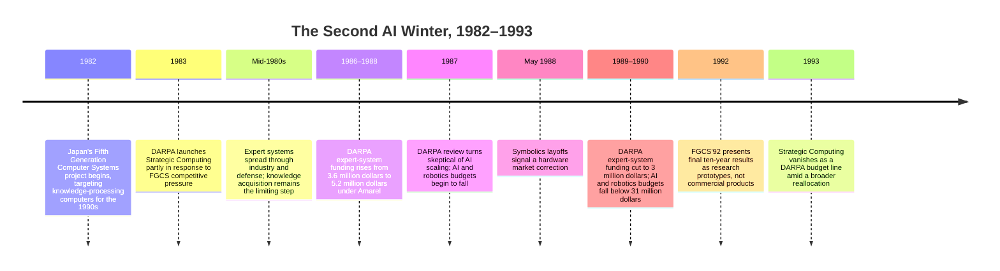

:::tip[In one paragraph]
The second AI winter arrived not because AI ideas were proven wrong, but because organizations discovered what it cost to keep them running. Expert systems encoded real domain expertise but demanded relentless maintenance. Knowledge acquisition made building them slow and expensive. DARPA funding priorities shifted as demonstrations struggled to scale. Specialized AI hardware lost its moat to cheaper workstations. The winter was an infrastructure correction, not a simple intellectual collapse.
:::

<strong>Cast of characters</strong>

| Name | Lifespan | Role |
|---|---|---|
| Bernd Neumann | — | Author of the 1988 XCON case study documenting the maintenance problem inside large configuration expert systems. |
| Jack Schwartz | — | DARPA ISTO director who oversaw the late-1980s budget shift away from AI and expert-system expansion. |
| John McDermott | — | CMU researcher associated with XCON/R1 and later defense expert-system technology-transfer work. |
| Gerald L. Atkinson | — | Author of the IAAI-90 account of automated knowledge-acquisition tools for defense technology transfer. |
| Tohru Moto-oka | — | Late professor credited with initiating Japan's Fifth Generation Computer Systems project in 1982. |
| Steve Squires | — | Architectures/HPC advocate in DARPA's reallocation from machine intelligence toward high-performance computing. |

<strong>Timeline (1982–1993)</strong>

<strong>Plain-words glossary</strong>

- **Expert system** — A software program that encodes human specialist knowledge as explicit if-then rules and uses an inference engine to apply those rules to new cases. Unlike a database, it can draw conclusions, not just retrieve stored facts.
- **Knowledge acquisition** — The process of extracting informal expertise from human specialists and translating it into machine-readable rules. A persistent bottleneck because tacit professional judgement is difficult to verbalize.
- **Knowledge-acquisition bottleneck** — The practical limit on how fast expert systems could be built and maintained, caused by the mismatch between the AI technologist's "how" knowledge and the domain expert's "what" knowledge.
- **Rule maintenance** — The ongoing work of updating, correcting, and reorganizing the rules inside an expert system as the underlying domain changes.
- **Lisp machine** — A workstation built specifically to run Lisp efficiently, optimized for AI software of the 1970s–1980s. Lost its economic advantage once commodity Unix workstations (Sun, Apollo) became fast enough for most AI tasks.
- **Strategic Computing** — DARPA's 1983–1993 program to connect microelectronics, computer architecture, AI software, and military applications into a path toward machine intelligence.
- **Fifth Generation Computer Systems (FGCS)** — Japan's 1982–1992 national research program, coordinated by MITI, to build knowledge-processing computers using logic programming and parallel inference hardware (KL1/PIM). Its international announcement raised U.S. competitive alarm and helped sell Strategic Computing.

# Chapter 28: The Second AI Winter

The second AI winter did not arrive because computers suddenly forgot how to
reason. It arrived because organizations discovered what it cost to keep
reasoning systems alive.

The 1980s had given artificial intelligence a commercial story it had not had
in the first winter. Expert systems could encode specialist knowledge and make
useful decisions in bounded domains. They configured computer orders, helped
transfer technical expertise, supported diagnosis-like tasks, and made AI look
less like a laboratory dream. For a while, the story was convincing. The field
had products, companies, conferences, dedicated hardware, and government
programs willing to talk about machine intelligence as an engineering target.

The problem was that the success did not scale smoothly. A rule base that
worked in one domain had to be built rule by rule, checked rule by rule, and
revised rule by rule as products, parts, policies, and operational conditions
changed. The expert's knowledge was often tacit. The knowledge engineer did
not merely copy facts into a database; they had to extract informal judgement,
translate it into rules, and keep those rules coherent. The hardware and
software around the systems also carried economic assumptions. Specialized AI
machines looked powerful while general workstations were weaker. They looked
less inevitable once commodity machines improved.

That is why the winter should not be told as a morality play about stupid
optimism. It was an infrastructure correction. Expert systems were useful where
the domain stayed narrow, the knowledge could be captured, and maintenance
could be afforded. They became fragile when organizations tried to treat
demonstrations, shells, and specialized hardware as proof that the whole path
to machine intelligence had been solved.

The cold came from several directions at once: rule maintenance, knowledge
acquisition, hardware economics, government expectation management, and the
gap between research demos and durable systems. The winter did not end AI. It
changed where serious money and prestige went next.

> [!note] Pedagogical Insight: Winter Is Maintenance Reality
> The second AI winter is easier to understand as an operations story than as
> an ideas story. The question was not only "Can the system reason?" It was
> "Can we build, update, finance, and transition it at scale?"

## The Successful Warning Sign

XCON is the right place to begin because it blocks the lazy version of the
story. Expert systems did not fail because none of them worked. XCON worked.
It configured Digital Equipment Corporation computer orders by checking a
customer's purchase order, identifying missing or incompatible components, and
producing a consistent configuration. It was not a toy example. It was one of
the most famous industrial AI systems of its period.

Its success is exactly why it makes such a strong warning. In Bernd Neumann's
1988 analysis of configuration expert systems, XCON appears as a large
rule-based system with more than 6,200 rules drawing on a database of about
20,000 parts. That is not a proof of failure. It is a measure of commitment.
The system had become large because it was doing a real job in a changing
technical domain.

But size changed the engineering problem. Neumann recorded that about half of
the rules were expected to change each year. In a small demonstration, a rule
base can look like transparent knowledge. At XCON scale, the rule base became
software with operational debt. Every new product, part, exception, and
compatibility rule could require edits. Every edit risked interacting with
other rules. The expert system was no longer just an expression of expertise.
It was a living codebase.

The control problem was especially revealing. Rule-based programming is
attractive when many local conditions can fire independently. Configuration,
however, often has global structure. Some choices should happen before other
choices. Some substitutions make sense only after placement decisions. Some
rules must not fire too early. XCON used contexts and rule tricks to impose
order, but Neumann's account notes that developers increasingly struggled to
ensure that rules fired in the proper order. When a rule served more than one
situation, changing it could obscure its original purpose.

This is the maintenance story hidden inside the expert-system boom. The rule
base looked like knowledge, but it behaved like software. It needed structure,
ownership, regression discipline, and a way to survive change. If a system had
thousands of rules and half could change in a year, then maintenance was not a
side activity. Maintenance was the product.

XCON therefore should be treated with respect. It was a real achievement. It
showed that symbolic AI could help with a bounded, economically meaningful
task. But it also showed the price of that success. The more useful the system
became, the more it exposed the limits of hand-coded knowledge at scale.

That is the winter in miniature: not a sudden discovery that rules were
worthless, but a growing recognition that rules needed an infrastructure the
boom had not fully priced.

The deeper problem was that successful expert systems turned knowledge into
configuration management. A human specialist can carry exceptions in memory,
notice when a product line changes, and rely on judgement when an order looks
strange. A rule base needs those shifts represented explicitly. If the parts
database changes, the rules must still line up with it. If a rule encodes an
old compatibility assumption, the system may continue to apply it with machine
confidence. If two rules were written by different maintainers under different
assumptions, the conflict may appear only when an unusual order arrives.

That kind of fragility was not unique to AI. Large conventional software
systems had similar problems. The difference was rhetorical. Expert systems
were often sold as captured expertise, as if knowledge itself had been
preserved in executable form. The maintenance evidence made the metaphor less
comfortable. What had been captured was not expertise in its living social
setting, but a formal approximation of expertise inside a changing software
artifact.

Once seen that way, the question changed. The issue was not whether XCON was
impressive. It was whether the expert-system industry had a repeatable way to
build many XCONs, keep them intelligible, and pay the cost of continuous
revision. The winter began when more buyers, managers, and funders realized
that the answer was not obvious.

## The Knowledge Acquisition Bottleneck

The maintenance problem began before the first rule was written. Expert systems
depended on knowledge acquisition: getting expertise out of human specialists
and into a form the machine could use.

Period sources did not hide this problem. A 1987 NASA/JSC human-factors report
described expert systems as promising for knowledge-intensive organizations,
but also as a technology still in transition. It identified the basic problem:
domain experts had "what" knowledge, AI technologists had "how" knowledge, and
the gap between them became the knowledge-acquisition bottleneck.

Atkinson's 1990 IAAI account of automated knowledge-acquisition tools makes
the problem even more concrete. First-generation expert systems were built
through discourse between a knowledge engineer and a human expert. The expert
had to communicate not only facts but also informal judgement and heuristics.
Those heuristics were often not written in textbooks or journal articles. They
were habits of practice. They were hard to verbalize because the expert often
did not experience them as explicit rules.

This mattered because expert systems had been sold partly as a way to multiply
scarce expertise. In Atkinson's defense-hardening example, there were more
systems needing survivability expertise than there were experts available to
advise them. That is a perfect use case for AI in the 1980s imagination:
capture expert knowledge once, then distribute it widely.

But the capture step was not free. If the expert could not easily articulate
why they made a judgement, the knowledge engineer had to probe, test, and
formalize. If the knowledge engineer misunderstood the domain, the rules could
encode the wrong distinction. If the domain changed, the captured knowledge
aged. Shells and tools helped, but they did not abolish the human transfer
problem.

The bottleneck also made expert systems expensive in a way that was easy to
underestimate during a demo. A working prototype might show that a few hundred
rules could solve selected cases. A production system needed coverage,
exceptions, validation, training, maintenance, and organizational trust. The
hard part was not only the inference engine. The hard part was building a
knowledge supply chain.

This is where the second winter connects to the book's larger infrastructure
theme. AI systems need more than algorithms. They need channels through which
data, expertise, compute, money, and evaluation move. Expert systems depended
on a channel from human experience into symbolic rules. That channel was slow,
lossy, and expensive.

When the boom was rising, that bottleneck could be described as a temporary
engineering problem. When many organizations tried to deploy and maintain
systems, it became a structural constraint.

Atkinson's account is useful because it does not come from an anti-AI polemic.
It describes a domain where expert systems made sense: the defense community
had more weapon systems needing hardening expertise than it had experts able
to advise every program. The response was not to abandon AI, but to build
tools that helped automate knowledge acquisition and technology transfer. That
is exactly the kind of bounded, institutional use case where expert systems
could be valuable.

Even there, the hard human work remained visible. The system had to preserve
judgement about a specialized technical domain and make it usable by program
managers and staff who were not themselves nuclear-hardening experts. That
meant the AI artifact stood between communities: specialists, knowledge
engineers, tool builders, and operational users. Any weak link in that chain
could reduce trust. A rule might be technically correct but presented poorly.
A user might misunderstand the domain assumptions. An expert might revise a
heuristic after seeing edge cases. The system could not be better than the
process that kept those relationships aligned.

This is why the phrase "knowledge acquisition bottleneck" mattered so much.
It named the point where the expert-system dream met organizational reality.
The bottleneck was not only that experts were busy. It was that expertise is
often embodied in practice, examples, exceptions, and context. Turning that
into stable symbolic form was itself a research and management problem.

## The Demonstration Trap

Government programs faced a related problem. Demonstrations could show
promise, but promise was not the same as transition.

DARPA's Strategic Computing program was built around an ambitious idea:
connect microelectronics, computer architecture, AI software, and applications
into a path toward machine intelligence. In the early 1980s this looked
plausible enough to fund at large scale. Japan's Fifth Generation project
added urgency. Roland and Shiman describe Japanese competition as a powerful
political lever and a concern for U.S. computer and defense technology
leadership.

By the late 1980s, the tone had changed. Jack Schwartz, the director of
DARPA's Information Science and Technology Office, did not reject AI on
philosophical grounds. Roland and Shiman describe his view as pragmatic. AI
was possible and promising, but not ripe. Computing still lacked enough power,
and the underlying concepts needed refinement. Current algorithms did not
scale. New ideas could not be forced into existence by a crash program.

That judgement mattered because it turned optimism into budget pressure. In
1987, the combined basic and Strategic Computing budgets for AI and robotics
programs in ISTO were about 47 million dollars. By 1989, Schwartz's budget in
those areas was under 31 million dollars. Expert systems were cut as well:
funding rose to 5.2 million dollars in 1988, then fell to 3 million dollars by
1990.

The cuts were not evenly anti-AI. That nuance is important. Schwartz increased
support for speech work that was making progress with standard benchmark
tests. He supported CMU's NavLab in part because of Takeo Kanade's prestige.
New work in neural modeling, machine learning, and computational logic also
appeared. The winter did not mean no one funded intelligence. It meant funders
became more selective about what counted as progress.

The questions changed. What are the major accomplishments? How can progress
be measured? How will the result transfer to industry or the military? How much
money will it take? What impact will it have? Those are not anti-scientific
questions. They are infrastructure questions. They ask whether a research
front can survive outside its laboratory.

Strategic Computing struggled because it had promised connection. Research
would feed applications. Applications would pull technology forward. But
software produced by different contractors was hard to integrate. Lab
components did not always work under real conditions. Demonstration schedules
could encourage shopping for techniques that worked well enough for a demo
instead of building reusable systems.

The winter, then, was partly a revolt against the demonstration trap. A demo
could prove that something happened once. A funder wanted evidence that the
technology could be sustained, measured, transitioned, and improved.

The autonomous vehicle story inside Strategic Computing sharpened this lesson.
The ALV program produced real progress, including improved hardware and better
software architecture. But Roland and Shiman describe how the program became
demo-driven and difficult to justify as a transition vehicle. Components built
under laboratory conditions did not necessarily integrate cleanly into a
working system. Researchers were not always motivated by the same operational
goals as military users. A demonstration milestone could reward short-term
assembly more than reusable infrastructure.

This did not mean the research was wasted. NavLab and later unmanned vehicle
programs continued to matter. The point is subtler: a successful research
demonstration and a sustainable fielded capability are different objects.
Strategic Computing repeatedly tried to connect them through plans, pyramids,
technology bases, applications, and transition strategies. The difficulty of
that connection made funders skeptical of broad promises.

Schwartz's skepticism therefore belongs beside the expert-system maintenance
story. In both cases, the same pattern appears. AI could show local success.
The harder question was whether the success could become a repeatable
production system. Expert systems had to maintain rules; DARPA programs had to
maintain a technology pipeline. Both were infrastructure problems disguised as
confidence problems.

## The Fifth Generation Shadow

Japan's Fifth Generation Computer Systems project belongs in this chapter
because it shaped expectations. It should not be caricatured as a simple
failure. It was an ambitious national research project, launched around the
idea of computers for knowledge processing in the 1990s. Its final 1992
proceedings presented work on logic programming, parallel processing,
knowledge processing, KL1, and parallel inference machines.

The international effect, however, came earlier. Roland and Shiman describe
MITI's 1981 announcement as a program to develop a Fifth Generation of
computers capable of human intelligence. They also describe how Japanese
competition helped sell Strategic Computing. Japan had already challenged U.S.
industries in automobiles and electronics. It was threatening memory and chip
manufacturing. Even if the United States remained ahead in computer research,
DARPA could not ignore the possibility of losing leadership.

This made FGCS both a technical program and a political symbol. It made AI,
parallel architecture, and knowledge processing feel like strategic territory.
It gave U.S. advocates a way to argue that computer research was not only a
university matter but a matter of national competitiveness.

That symbolic role matters more for this chapter than a verdict on whether
FGCS succeeded or failed. The 1992 proceedings can support the official story:
the project presented prototype systems and research results in knowledge
processing and parallel inference. They cannot, by themselves, prove that the
project transformed commercial computing or failed to do so. The honest
chapter keeps those lanes separate.

FGCS helped raise the temperature of the 1980s AI boom. Its final results
helped reveal the difference between a powerful research agenda and a
commercial or military revolution. That difference is one of the emotional
sources of winter. Big research programs can produce real artifacts and still
fall short of the public meaning attached to them.

The U.S. response also shows how external competition can distort technical
expectations. Strategic Computing was not only a plan for AI; it was also a
way to argue that the United States should protect leadership in computing.
That argument could gather support from people who cared about different
things: military applications, university research, industrial competitiveness,
microelectronics, architectures, and artificial intelligence. The more agendas
attached to the program, the heavier the eventual burden of proof became.

When the promised revolution did not arrive on schedule, disappointment did
not land on one narrow research objective. It landed on a whole bundle of
expectations. AI was supposed to reason. New architectures were supposed to
enable it. National programs were supposed to transition research to users.
International competition was supposed to justify urgency. If the bundle felt
less convincing by the late 1980s, support could drain away even while pieces
of the research remained technically alive.

That is why the chapter should keep FGCS separate from Strategic Computing
while showing their interaction. FGCS had its own Japanese institutional goals
and research outputs. Strategic Computing had its own DARPA politics and
military-transition pressures. The shared historical role was expectation:
both made machine intelligence sound like an infrastructure race that national
programs could organize and win.

## Hardware Loses Its Moat

Specialized AI hardware made sense inside the boom. Lisp machines and related
systems were built for the languages and environments AI researchers used.
When general-purpose machines were weaker, specialized hardware could look
like a necessary foundation for serious AI work.

The economics changed as workstations improved. A concrete business signal
appeared at Symbolics in 1988. The Los Angeles Times reported that Symbolics
laid off 225 of its 640 workers nationwide, including 90 workers at its
Chatsworth plant. The company expected the layoffs to save 15 million dollars a year.
It had once employed more than 1,000 people; after the cuts it had slightly
more than 400. The same article reported a 4.9 million dollar quarterly loss and
a 24.8 million dollar nine-month loss on 65.2 million dollars in revenue. It also identified
competition from less expensive workstations by Sun Microsystems and Apollo
Computer.

This does not prove every Lisp-machine company had the same trajectory or the
same dates. It does show the hardware story in miniature. Specialized AI
machines were not only technical platforms. They were businesses with cost
structures, customers, financing needs, and competitors. Once general
workstations could run enough AI software well enough, the specialized machine
lost some of its reason to exist.

That hardware shift reinforced the expert-system slowdown. If customers had to
buy expensive machines, specialized environments, consulting, and maintenance,
the economic case narrowed. If the system also required constant rule updates
and difficult knowledge acquisition, the total cost became harder to justify.

Again, the lesson is not that specialized hardware is always wrong. Later
chapters will show GPUs becoming central to deep learning. The lesson is that
hardware has to ride the right cost curve. Lisp machines were optimized for one
AI ecosystem just as general computing became good enough to pull customers
away.

The winter was therefore not just intellectual disappointment. It was also a
market correction around infrastructure that no longer looked inevitable.

The Symbolics scene also prevents another oversimplification. It is easy to
say that specialized hardware failed because general hardware became cheaper.
That is true as far as it goes, but the timing mattered. Specialized machines
were most attractive when the software ecosystem, language assumptions, and
performance advantages all pointed in the same direction. Once customers began
asking for AI programs on machines they already owned, the dedicated machine
became an adoption barrier. The value proposition shifted from "this is the
machine serious AI requires" to "this is another expensive dependency."

That shift fed back into expert-system economics. A manager evaluating a
rule-based project had to count more than inference speed. They had to count
the machine, the vendor, the language environment, the consultants, the
knowledge-acquisition process, the maintenance staff, and the uncertainty of
future support. If general workstations could carry enough of the workload,
the specialized stack looked less like infrastructure and more like lock-in.

The lesson would return later in a different form. Deep learning would also
depend on specialized hardware, especially GPUs, but GPUs succeeded partly
because they rode broader graphics and parallel-computing markets. The 1980s
AI hardware story was narrower. Its economics were tied closely to a symbolic
AI boom whose maintenance and adoption costs were already under pressure.

## Winter as Reallocation

Strategic Computing did not end with a ceremonial declaration that AI was
over. Roland and Shiman describe something more revealing: by 1993, Strategic
Computing had vanished as a DARPA budget line and had been transmuted into
High Performance Computing. The machine-intelligence dream faded, while
architectures, networking, and speed survived.

This is how winters often work. Money does not simply freeze. It moves.
Prestige moves. Evaluation standards move. People who had been funding broad
machine intelligence begin asking for benchmarks, products, transition paths,
and measurable progress. Researchers who can answer those questions keep
working. Researchers who cannot are pushed to the margins or forced to rename
their work.

For AI history, this reallocation matters because the next chapters do not
come from nowhere. Support vector machines will make a different promise: not
hand-coded expertise, but margins, kernels, and statistical learning theory.
Speech recognition will increasingly move toward data and hidden Markov
models. Reinforcement learning will build a mathematics of delayed reward.
Neural networks will survive in pockets and later return when data, compute,
and training recipes change.

The second winter cleared space for those alternatives. It made brittle rule
maintenance less glamorous. It made benchmarks more important. It made
statistical methods look less like an academic side path and more like a way
around the knowledge-acquisition bottleneck.

That does not mean symbolic AI ended. Many symbolic systems continued. Some
expert systems remained valuable. Logic, planning, knowledge representation,
and rules never disappeared from computing. The winter changed the terms of
trust. A system had to show not just that it could reason on selected cases,
but that it could be built, maintained, measured, and financed.

The honest conclusion is that the second AI winter was not a refutation of AI.
It was a demand for better infrastructure. Hand-coded expertise had carried AI
from laboratories into organizations, but it exposed limits that the next wave
would try to route around: get more data, learn more from examples, measure
performance more consistently, and rely less on the impossible dream of
writing down every expert judgement by hand.

That is why this chapter sits between LeNet and the statistical chapters that
follow. Chapter 27 showed architecture making neural learning practical in a
bounded visual task. Chapter 28 shows the older rule-based commercial story
running into maintenance reality. The next turn in the story will not be a
simple victory of one philosophy over another. It will be a search for systems
whose knowledge can scale with the infrastructure around them.

## Sources

### Primary and Near-Primary

- Navaratna S. Rajaram, ["Tools and Technologies for Expert Systems: A Human
  Factors Perspective"](https://ntrs.nasa.gov/citations/19880005500),
  NASA/JSC Summer Faculty Program final report (1987): period source for
  expert systems as technology-transfer tools and for the knowledge-acquisition
  bottleneck.
- Gerald L. Atkinson, ["Technology Transfer Using Automated
  Knowledge-Acquisition Tools"](https://cdn.aaai.org/IAAI/1990/IAAI90-013.pdf),
  *IAAI-90 Proceedings*, AAAI, 159-176 (1990): defense technology-transfer
  source for tacit heuristics, scarce expertise, and knowledge acquisition as a
  major 1980s expert-system bottleneck.
- Bernd Neumann, ["Configuration Expert Systems: A Case Study and
  Tutorial"](https://kogs-www.informatik.uni-hamburg.de/publikationen/pub-neumann/Neumann88.pdf),
  in Horst Bunke, ed., *Artificial Intelligence in Manufacturing, Assembly and
  Robotics*, 27-68 (1988): XCON maintenance, rule-base size, rule churn, and
  rule-order/control issues.
- Alex Roland and Philip Shiman,
  [*Strategic Computing: DARPA and the Quest for Machine Intelligence,
  1983-1993*](https://gwern.net/doc/cs/hardware/2002-roland-strategiccomputing-darpaandthequestformachineintelligence19831993.pdf),
  MIT Press (2002): DARPA Strategic Computing, FGCS as U.S. political trigger,
  late-1980s AI budget pressure, and the shift toward high-performance
  computing.
- Institute for New Generation Computer Technology (ICOT), ed.,
  [*Fifth Generation Computer Systems 1992: Proceedings of FGCS'92, Volume
  1*](https://www.bitsavers.org/pdf/icot/Fifth_Generation_Computer_Systems_1992_Volume_1.pdf),
  Ohmsha/IOS Press (1992): official final-results context for FGCS, KL1, PIM,
  knowledge processing, and parallel inference.
- James Bates, ["Symbolics Lays Off 90 at Plant in
  Chatsworth"](https://www.latimes.com/archives/la-xpm-1988-05-24-fi-3053-story.html),
  *Los Angeles Times*, May 24, 1988: business-press anchor for Symbolics
  layoffs, losses, and competition from less expensive workstations.

### Secondary

- James Hendler, ["Avoiding Another AI Winter"](https://doi.org/10.1109/MIS.2008.20),
  *IEEE Intelligent Systems* 23(2), 2-4 (2008): later retrospective context on
  winter dynamics; used only for broad framing.

> [!note] Honesty Over Output
> This chapter does not claim that expert systems were useless, that FGCS was a
> simple failure, or that DARPA stopped funding all AI. It treats the second AI
> winter as a convergence of maintenance, knowledge-transfer, hardware,
> funding, and transition pressures.

:::note[Why this still matters today]
Every AI deployment cycle still hits the same constraints the second winter exposed. Large language models require ongoing prompt engineering, fine-tuning, and guardrail maintenance — a distributed form of the knowledge-acquisition bottleneck. Specialized AI accelerators (TPUs, custom inference chips) face the same commodity-hardware threat that ended Lisp machines: general GPUs keep improving. DARPA's shift from Strategic Computing to benchmarks and measurable transition goals now appears in every enterprise AI evaluation: demos are not deployments. The winter's core lesson — that brittle hand-coded knowledge cannot scale without the infrastructure to build, update, and finance it — is the same lesson driving investment in retrieval, fine-tuning, and data pipelines today.
:::
