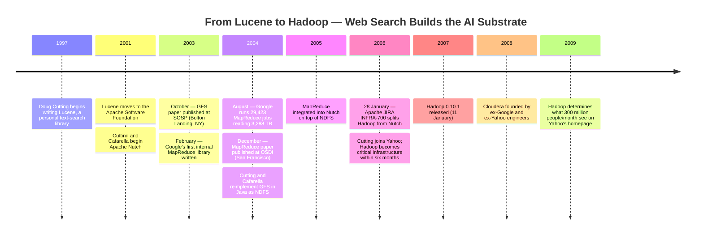

:::tip[In one paragraph]
Between 2003 and 2004, Google engineers published two papers — the Google File System (SOSP 2003) and MapReduce (OSDI 2004) — describing production systems that stored and processed hundreds of terabytes across thousands of commodity machines while treating failure as normal. Doug Cutting and Mike Cafarella ported those specifications to Java as Apache Hadoop, splitting it from the Nutch crawler on 28 January 2006. The compute the deep-learning era would later inherit was not built for AI; it was pre-paid by web search.
:::

<strong>Cast of characters</strong>

| Name | Lifespan | Role |
|---|---|---|
| Jeffrey Dean | — | Google engineer; co-author of *MapReduce: Simplified Data Processing on Large Clusters* (OSDI 2004) with Ghemawat. |
| Sanjay Ghemawat | — | Google engineer; lead author of *The Google File System* (SOSP 2003) and co-author of the MapReduce paper. |
| Howard Gobioff | — | Google engineer; co-author of *The Google File System* (SOSP 2003) with Ghemawat and Leung. |
| Shun-Tak Leung | — | Google engineer; co-author of *The Google File System* (SOSP 2003) with Ghemawat and Gobioff. |
| Doug Cutting | — | Author of Lucene (1997); co-creator of Apache Nutch; reporter on Apache JIRA INFRA-700 (28 January 2006) splitting Hadoop out of Nutch; joined Yahoo January 2006. |
| Mike Cafarella | — | University of Washington graduate student; Cutting's collaborator on Apache Nutch and the Java re-implementation of GFS and MapReduce that became Hadoop. |

<strong>Timeline (1997–2009)</strong>

<strong>Plain-words glossary</strong>

- **Distributed file system** — A file system that stores data across many machines at once, making them appear as one large, reliable store. GFS was Google's version; NDFS (later HDFS) was its open-source Java clone.
- **Chunkserver** — In GFS, one of many machines that actually holds file data. Files are cut into 64 MB chunks; each chunk lives on multiple chunkservers so that if one machine dies the data is not lost.
- **MapReduce** — A programming model in which the user writes two functions — Map (transform each record) and Reduce (aggregate matching records) — and the runtime handles splitting the work, running it on many machines, and recovering from failures automatically.
- **Commodity hardware** — Ordinary, inexpensive off-the-shelf machines rather than specialized fault-tolerant servers. GFS and MapReduce were designed assuming these machines *would* fail, and built failure recovery into the system itself.
- **Straggler / backup task** — A straggler is a worker machine that runs unusually slowly near the end of a job. MapReduce counters this by launching duplicate backup copies of nearly-finished tasks; whichever copy finishes first is used, cutting total job time significantly.
- **Fault tolerance** — The ability of a system to continue operating correctly when individual components fail. GFS achieved this through replication (three copies of each chunk by default); MapReduce achieved it by detecting dead workers and reassigning their tasks.
- **Open-source port** — Reimplementing a design described in a research paper as publicly available software anyone can run. Cutting and Cafarella used the GFS and MapReduce papers as specifications and rebuilt them in Java, giving the broader industry access to the same architecture Google had built internally.

The compute substrate that the deep-learning revolution would later inherit was not built for machine learning. It was built for web search. In the early 2000s, the engineering challenge of the era was not the training of massive neural networks but the indexing of the rapidly expanding World Wide Web. The scale of data required to map billions of web pages forced a fundamental rethinking of how computers should work together. The solution that emerged--a pair of systems designed at Google and later cloned into the open-source project known as Hadoop--provided the reliable, planet-scale plumbing that AI researchers would eventually use to feed their models. The machine learning era did not have to invent its own compute substrate; it rented one that web indexing had already paid for.

### The Four-Machine Ceiling

In the late 1990s and early 2000s, the work of building a public index of the web was largely the province of a few well-funded corporations. For Doug Cutting, the journey toward Hadoop began not with a grand vision of artificial intelligence, but with the practical need for better search. In 1997, Cutting began writing Lucene, a personal text-search library, which he open-sourced in 2000. By 2001, Lucene had moved to the Apache Software Foundation, where it was widely adopted.

However, Lucene was a library for indexing text on a single machine. It could help a program search a collection once the documents had been gathered and organized; it did not, by itself, solve the work of crawling the public web, storing the fetched pages, and refreshing the index as pages changed. To index the entire web, Cutting needed a crawler. In late 2001, he teamed up with Mike Cafarella, then a graduate student at the University of Washington, to start Apache Nutch. Their goal was ambitious: a full-scale, open-source web crawler and search engine. But as the web exploded toward a billion pages by 2003, Nutch hit a physical limit that had nothing to do with its search algorithms.

The problem was the distributed-systems plumbing. A single machine running the Nutch crawler could index approximately 100 web pages per second. At that rate, the crawler could maintain an index of about 100 million pages. While significant for a personal or small-team project, this was a mere fraction of the growing web. To scale further, Cutting and Cafarella attempted to distribute the workload. They expanded their cluster to four machines, but as they tried to push beyond that, the complexity of the system became unmanageable.

The four-machine ceiling mattered because a web crawler is not a single large calculation that can be neatly cut into four equal pieces. It has a frontier of URLs to visit, a record of pages already seen, a store of fetched documents, and a sequence of indexing passes that convert raw pages into searchable structures. Each new machine adds useful capacity, but it also adds questions: which machine owns which pages, where should intermediate files live, what happens if a worker dies halfway through a crawl, how can a failed task be restarted without duplicating or losing work, and how can the system keep moving if the network pauses or a disk disappears? Those questions are mundane only after a reliable framework exists. Before that, they are the project.

This is why the Nutch story belongs in a history of AI compute even though no neural network is at the center of it. The early pressure came from a much older information-retrieval problem: gather the public web, keep enough of it fresh, and make it searchable. A single-machine search library could be elegant and useful, but an open web index had to become a distributed data system. Cutting and Cafarella did not lack a search idea. They lacked the layer that would let ordinary machines behave like one larger, failure-tolerant machine.

In a distributed system, failure is the norm rather than the exception. On a single machine, a disk failure or a network glitch is a rare catastrophe. In a cluster of hundreds of machines, something is always broken. To scale Nutch beyond four machines, Cutting and Cafarella would have needed machinery for data distribution, node coordination, restartable work, and failure recovery. "Faced with this scalability limit," as Marko Bonaci's later history of Hadoop put it, "Cutting and Cafarella expanded Nutch to run across four machines. Expanding it beyond that would create too much complexity." For a small open-source team, the engineering cost of building this reliable substrate from scratch was a wall they could not climb. The wall was not algorithmic; it was the absence of a reliable, battle-tested distributed-systems substrate.

### The Specifications

While Nutch was hitting its four-machine ceiling, Google had already solved the same class of problem at the scale of thousands of machines. Between 2003 and 2004, Google engineers published two papers that would serve as the blueprints for the next decade of data engineering. These were not just academic research; they were descriptions of production systems that Google was already using to index the planet.

The first, published in October 2003 at the Symposium on Operating Systems Principles (SOSP) in Bolton Landing, New York, was "The Google File System" by Sanjay Ghemawat, Howard Gobioff, and Shun-Tak Leung. The second, appearing in December 2004 at the Symposium on Operating System Design and Implementation (OSDI) in San Francisco, was "MapReduce: Simplified Data Processing on Large Clusters" by Jeffrey Dean and Sanjay Ghemawat. These papers were not source code, but they were written with such technical clarity that they functioned as specifications.

The Google File System (GFS) paper began with a radical premise: "component failures are the norm rather than the exception." Google built its clusters from inexpensive, commodity parts. In a fleet made from hundreds or thousands of machines, the authors wrote, the quantity and quality of the components guaranteed that some would be broken at any given time and some would not recover. This was not an apology for cheap hardware. It was the design point. The file system was built for a world in which failure was continuous background weather.

By October 2003, Google's largest GFS clusters already had over 1,000 storage nodes and over 300 terabytes of disk storage, concurrently accessed by hundreds of clients. The abstract of the paper described hundreds of terabytes spread across thousands of disks on over a thousand machines. Those numbers are small by later cloud standards, but they were decisive in 2003: Google was not describing a laboratory prototype. It was explaining how a production service stored and moved data at a scale that open-source web crawlers could not yet approach.

The architecture was deceptively simple: a single master coordinated multiple "chunkservers," and clients contacted both. The master did not carry all file data through itself. Its job was to hold the namespace, know where chunks lived, and coordinate placement and recovery. Files were broken into 64-megabyte chunks, much larger than typical filesystem blocks, so that the system could manage huge files without drowning the master in metadata. For reliability, each chunk was replicated three times by default on different chunkservers, with different replication levels available for different regions of the namespace. If a machine died, the master could notice the missing replicas and coordinate their recreation on other nodes. This transparent fault tolerance meant that a programmer could write a file without worrying about which physical disk it lived on or whether that disk would survive the night.

The particular choices mattered. A single master simplified global decisions, including chunk placement and re-replication, while the large chunk size reduced the number of separate objects the master had to track. Replication turned unreliable IDE disks into a reliable storage service. The result was not a conventional filesystem made slightly bigger. It was a storage system tuned for very large files, streaming reads and writes, and continuous failure in a data center assembled from ordinary machines.

On top of this storage layer sat MapReduce. If GFS was the cluster's hard drive, MapReduce was its operating system for batch data work. The 2004 paper described a programming model that reduced many massive data-processing jobs to two primitives. The "Map" function processed a key/value pair to generate a set of intermediate pairs, and the "Reduce" function merged all intermediate values associated with the same key. The programmer wrote those two functions. The runtime handled partitioning the input, scheduling execution across machines, recovering from machine failures, and managing inter-machine communication. By restricting the user-facing model, MapReduce made parallelism a property of the system rather than a custom engineering project for each application.

Google's cluster hardware in 2004 was plain by design: dual-processor x86 Linux machines with 2 to 4 gigabytes of RAM, inexpensive IDE disks attached directly to individual machines, and commodity networking, typically 100-megabit or 1-gigabit Ethernet at the machine level. Storage was provided by GFS. Users submitted jobs to a scheduling system, and jobs were mapped onto available machines in the cluster. The published benchmark cluster made the picture even more concrete: about 1,800 machines, each with two 2 GHz Intel Xeon processors, 4 GB of memory, two 160 GB IDE disks, and a gigabit Ethernet link, arranged in a two-level switched network with roughly 100 to 200 Gbps of aggregate bandwidth at the root.

On this modest hardware, MapReduce achieved planet-scale results. In August 2004 alone, Google's production systems ran 29,423 MapReduce jobs. The average job completed in 634 seconds. Across the month, those jobs consumed 79,186 machine-days, read 3,288 terabytes of input data, produced 758 terabytes of intermediate data, and wrote 193 terabytes of output. The average job used 157 worker machines, 3,351 map tasks, and 55 reduce tasks. The table also reported 1.2 worker deaths per job, a number that makes the paper's philosophy tangible: machine failure was not a rare exception to be handled by an operator after the fact. It was part of the ordinary cost of doing the work.

The system's resilience was its defining feature. The master pinged workers, noticed workers that failed to respond, and reassigned their tasks. The paper described an incident where network maintenance caused groups of 80 machines to become unreachable for several minutes; the MapReduce master simply re-executed the work on other machines, and the job continued to make forward progress. To handle "stragglers"--machines that were functioning but slow due to bad disks, other load, or some local pathology--the system would schedule backup copies of nearly finished tasks near the end of a job. This systems-level optimization was critical; in one benchmark, a sort program took 1,283 seconds without backup tasks but only 891 seconds with them, a 44 percent slowdown when the mechanism was disabled.

That small detail explains why MapReduce mattered. The novelty was not that "map" and "reduce" were mathematically exotic ideas. They were not. The novelty was that Google wrapped a restricted programming model in a runtime that understood locality, scheduling, worker death, duplicate execution, and slow machines. A user could express a large batch job as a pair of functions, and the library would turn that expression into thousands of tasks running near the data they needed. The bargain was deliberate: accept a narrower programming model, get automatic distribution and failure handling in return.

The paper also showed that MapReduce had already escaped its first use cases inside Google. The first version of the library had been written in February 2003, with significant enhancements, including locality optimization and dynamic load balancing, added that August. By late September 2004, almost 900 separate MapReduce program instances were checked into Google's source tree. The paper's experience section listed large-scale machine-learning problems, clustering for Google News and Froogle, deriving data for Google Zeitgeist, deriving properties from web pages for new experiments and products, and graph computations. Machine learning was there, but it was one workload among many. The center of gravity was still the web: crawling it, indexing it, deriving properties from it, and making services out of it.

Crucially, the authors did not claim to have invented the concept of distributed data processing from a vacuum. The MapReduce paper's "Related Work" section acknowledged a long lineage of systems including Condor, River, NOW-Sort, Active Disks, Charlotte, and BAD-FS. Google's contribution was not the invention of the primitives but the successful application of them to a massive production environment where failure was constant.

### The Open-Source Port

Doug Cutting and Mike Cafarella recognized the Google papers as the blueprints they needed. Later timeline accounts describe them using the GFS paper over the course of 2004 to reimplement the file system in Java, naming the result the Nutch Distributed File System (NDFS). In 2005, with the exact month less firmly established than the broad sequence, they integrated a Java version of MapReduce on top of NDFS.

This work was initially performed inside the Apache Nutch project. It was a functional, open-source clone of the Google stack, adapted for the Java ecosystem and for the realities of open-source users running their own clusters. The port did not give Cutting and Cafarella Google's source code or Google's data centers. It gave them a public design: a replicated distributed file system underneath a batch-processing model that could run computation close to stored data, recover from failed workers, and divide one logical job into many small tasks.

The choice to build inside Nutch also kept the work honest. The system had a demanding application attached to it from the beginning. It was not enough for NDFS to pass small demonstrations or for MapReduce to run toy examples; the point was to push a crawler and indexer beyond the point where manual partitioning and one-off recovery code had stopped making sense. That made the port less like an academic exercise and more like a translation: the Google papers described one production environment, and the Nutch work asked whether the same architecture could carry an open-source crawler on different hardware, in a different language, under a different institutional roof.

The engineering work was arduous. Reimplementing a production system from a paper requires filling in the gaps that a research publication inevitably leaves out: network protocols, retry behavior, data placement, task bookkeeping, file naming, operational defaults, and all the ordinary code that turns a clean diagram into a program people can run. Cutting and Cafarella had to build the part Nutch had lacked: not another crawler feature, but a layer that could keep useful work moving when individual machines did not.

The abstraction's payoff was visible in Google's own experience. After rewriting its production indexing system to use MapReduce, Google described the indexing process as a sequence of five to ten MapReduce operations over more than 20 terabytes of raw crawl data. One phase of the computation dropped from approximately 3,800 lines of C++ to approximately 700 when expressed using MapReduce. The important number is not just the line-count reduction. It is what disappeared from the application: explicit distributed coordination, ad hoc recovery paths, and the repetitive machinery of splitting work across machines.

For Nutch, that was exactly the missing layer. A web crawler and search engine could now sit above a more general system for storing and processing large data sets. The same split that had made Google's indexing rewrite smaller also changed the shape of the open-source project. The storage and compute machinery was no longer merely an implementation detail of one crawler. It was becoming a reusable substrate.

### The Hadoop Ticket

The transition from a Nutch component to a standalone project occurred in early 2006. In January of that year, Doug Cutting joined Yahoo. For Yahoo, which was locked in a fierce rivalry with Google for search supremacy, Hadoop represented a way to catch up with Google's infrastructure without having to reinvent it from scratch.

On January 28, 2006, at 5:01 AM UTC, Cutting opened a ticket in the Apache JIRA system, INFRA-700. "The Lucene PMC has voted to split part of Nutch into a new sub-project named Hadoop," he wrote. He requested three new mailing lists: `hadoop-user`, `hadoop-dev`, and `hadoop-commits`. The Apache infrastructure team responded with a "Done" within thirty-six minutes, at 5:37 AM UTC.

The ticket is a useful piece of institutional history because it shows how small the formal act was. The new system that would become a global data-processing standard entered Apache infrastructure as a mailing-list request. It needed a place for users, a place for developers, and a place for commit notifications. The Lucene Project Management Committee had already voted to split part of Nutch into the new subproject; the JIRA ticket recorded the administrative hinge. The broader split continued through the following months, but the public name and project boundary were visible in that January request.

The name "Hadoop" was famously not an acronym. It was the name of a stuffed yellow elephant owned by Cutting's son, who was then two years old and just beginning to talk. The name was pronounced with the stress on the first syllable: *HA-doop*. Cutting's criteria for a software name were practical: it should be short, easy to spell, easy to pronounce, meaningless, and not already in use. He argued that software names should be meaningless because the use of software often drifts over time; if the name is too tightly bound to an initial purpose, it can become wrong as the project changes. The toy elephant itself was eventually "banished to a sock drawer," as the *New York Times* later reported, but its name became the identifier for a new era of computing.

The name also did useful work. It did not say "web crawler," "search engine," or "Google file-system clone." That mattered because the project was already escaping the narrow task that had produced it. Cutting's own naming rule fit the technical trajectory: a meaningless name could survive a change in purpose. The software that began as a way to make Nutch scale could become a general platform for data processing without dragging a crawler's name behind it.

Yahoo's adoption of Hadoop was rapid. "Within six months," Cutting later said, "Hadoop was a critical part of Yahoo and within a year or two it became supercritical." That sentence should be read as a participant's recollection rather than a complete deployment ledger; Yahoo did not publish a clean public accounting of the money, teams, and cluster sizes behind the bet. What is clear is that Hadoop moved quickly from an Apache subproject into the machinery of a major web company. By January 2007, the Apache archive shows Hadoop 0.10.1 being released, evidence of an active project moving through public versions.

By 2009, Hadoop was load-bearing enough to appear in mainstream business reporting. Yahoo used Hadoop-powered analysis to determine what 300 million people a month saw on its homepage. The company tracked user behavior to gauge what types of stories and other content people preferred, adjusted the homepage accordingly, and used similar software to match advertisements with certain types of stories. That was not an artificial-intelligence story in the later deep-learning sense. It was a web company using distributed data processing to observe, rank, personalize, and monetize a constantly changing public web audience.

The January 2006 timing matters because it separates two histories that are often blurred together. Hadoop did not begin as a response to the commercial deep-learning boom; it was already an Apache project before that boom had a public identity. Its early institutional momentum came from search competition, web personalization, and advertising. Those incentives paid for a large amount of systems engineering that later machine-learning work could reuse without inheriting the original business purpose.

### The Substrate the AI Era Inherited

By the time the deep-learning revolution arrived in 2012, the data infrastructure it required was already battle-tested and commercially available. The years between the Hadoop split and the ImageNet breakthrough were not a blank space waiting for neural networks to arrive. They were the years in which the open-source clone of Google's 2003 and 2004 papers became part of the web industry's ordinary operating environment. Cloudera, founded in 2008 by Christophe Bisciglia, Amr Awadallah, Jeff Hammerbacher, and Mike Olson, turned Hadoop into a commercial product that organizations outside the original web-search race could buy and deploy.

It is a common historical misconception that the compute infrastructure of the AI era was designed for machine learning. In reality, the MapReduce paper's own list of intended uses in 2004 placed "machine learning problems" as just one item in a list that included Google News clustering, Google Zeitgeist, and deriving properties from web pages. Machine learning was seen as a workload that fit the abstraction, not the reason the abstraction was built.

The distinction matters. MapReduce could be useful for machine learning because many machine-learning data-preparation jobs look like large batch computations over records: parse the data, emit features or counts, group related values, aggregate them, and write results for the next stage. But that fit does not make MapReduce a deep-learning system, and it does not make Hadoop a cause of the 2012 surge. The papers came from web indexing, data mining, sorting, clustering, and production search. Their contribution to AI history is infrastructural: when larger learning systems needed to ingest and transform huge data sets, the surrounding industry already had a vocabulary and a toolchain for doing that work across many unreliable machines.

That inheritance was practical rather than symbolic. The hard problems were not only how to train a model, but how to collect examples, clean them, deduplicate them, compute statistics over them, join them with other records, and write the resulting data sets somewhere the next stage could read. Those chores are easy to dismiss because they are not the glamorous part of AI. At scale, they are the difference between a research idea and a repeatable industrial pipeline. GFS, MapReduce, and Hadoop made those chores ordinary enough that later teams could treat them as infrastructure.

When researchers began feeding billions of images and trillions of tokens into their models, they did not have to solve the fundamental problem of how to read terabytes and eventually petabytes of data across thousands of machines without the system collapsing at the first disk failure. That problem had been made routine by web search engineers a decade earlier. GFS had shown how to store hundreds of terabytes across over a thousand machines while assuming failures would happen. MapReduce had shown how to express large computations so a runtime could partition input, schedule tasks, restart failed work, and push through slow machines. Hadoop had made an open-source version of that pattern available outside Google.

The convergence was not accidental, but it was also not planned as a deep-learning program. The MapReduce programming model, with its emphasis on simple primitives and massive parallelism, aligned with the needs of large-scale data preparation because both were responses to the same underlying pressure: too much data for one machine, too much failure for manual recovery, and too much repeated plumbing for every application team to write alone. As the OSDI 2004 paper concluded, MapReduce was already being used for "the generation of data for Google's production web search service, for sorting, for data mining, for machine learning, and many other systems." By the time the world needed a planet-scale machine for AI, it already had one, named after a toddler's toy.

:::note[Why this still matters today]
The design commitments GFS and MapReduce introduced in 2003–2004 — treat failure as the norm, replicate data across commodity machines, let the runtime manage scheduling and recovery — became the baseline assumptions of cloud-native engineering. HDFS underpins the Hadoop ecosystem still in production at major enterprises; the Map-then-Reduce batch pattern lives on in Apache Spark and Flink. More broadly, every cloud object store (S3, GCS, Azure Blob) inherits the GFS principle that cheap hardware plus transparent replication equals durable storage. The "failure is weather, not catastrophe" design philosophy now runs through Kubernetes itself.
:::
