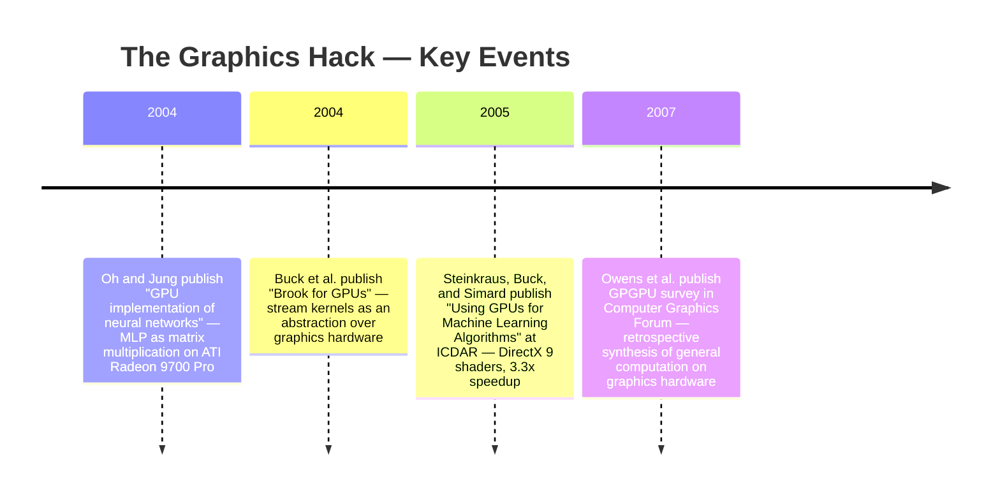

:::tip[In one paragraph]
Between 2004 and 2005, researchers Kyoung-Su Oh, Keechul Jung, Dave Steinkraus, Ian Buck, and Patrice Y. Simard proved that consumer graphics cards could accelerate neural-network training — not because GPUs were designed for machine learning, but because matrix operations could be disguised as pixel-shader rendering. The hack delivered real speedups (up to 20-fold for Oh and Jung; 3.3x for Steinkraus et al.) while also making clear that the graphics API was the wrong long-term abstraction.
:::

<strong>Cast of characters</strong>

| Name | Lifespan | Role |
|---|---|---|
| Dave Steinkraus | — | Co-author of the 2005 ICDAR paper applying DirectX 9 shaders to machine-learning primitives; reported a 3.3x speedup on a GeForce 6800 Ultra. |
| Ian Buck | — | Co-author of both Steinkraus et al. 2005 and Brook for GPUs (2004); appeared in both the ML-GPU and stream-abstraction lines of the chapter. |
| Patrice Y. Simard | — | Co-author of Steinkraus et al. 2005; the paper's handwriting-recognition setting supplied the CPU-bottleneck and speedup anchors. |
| Kyoung-Su Oh | — | Co-author of Oh and Jung 2004; mapped MLP inner products to matrix multiplication on an ATI Radeon 9700 Pro and reported up to a 20-fold speedup. |
| Keechul Jung | — | Co-author of Oh and Jung 2004; same neural-network GPU implementation and speedup evidence. |

<strong>Timeline (2004–2007)</strong>

<strong>Plain-words glossary</strong>

- **Pixel shader** — A small program that the graphics hardware runs once for every pixel generated in a scene. Because millions of pixels are processed independently and simultaneously, the chip runs many copies of the shader in parallel. Researchers exploited this to run the same numerical operation over many data elements at once.
- **GPGPU (General-Purpose computing on Graphics Processing Units)** — Using a graphics card to perform computations that have nothing to do with rendering images. In the shader era, this required disguising the computation as graphics operations; later, dedicated APIs like CUDA removed the disguise.
- **Texture** — In graphics, a 2-D image applied to a surface to give it color or detail. In the GPGPU hack, textures were repurposed as flat numerical arrays: a matrix of weights or input data packed into the color channels of an image the GPU could read at high speed.
- **Stream kernel (Brook's framing)** — Brook's abstraction for a computation applied identically across an ordered collection of data elements (a "stream"). The term recast the GPU's pixel-shader invocations as a general-purpose parallel loop, hiding the graphics vocabulary beneath a more mathematical one.
- **AGP bus** — The Accelerated Graphics Port, the physical link between a PC's CPU and its graphics card in this era. Its bandwidth was asymmetric: fast in the CPU-to-GPU direction (sending textures and geometry) and much slower reading back from the GPU. This asymmetry forced researchers to keep weights and intermediate results on the card throughout training.
- **Multilayer perceptron (MLP)** — A class of neural network organized into layers, where each unit in a layer computes a weighted sum of the previous layer's outputs. Oh and Jung showed that these weighted sums can be organized as matrix multiplication, which is the mathematical bridge that made GPU acceleration possible for their workload.

```mermaid
flowchart LR
    %% Form: flowchart LR — the GPGPU data flow is a left-to-right pipeline: inputs enter as
    %% textures, pass through fixed graphics stages, and numerical results emerge as rendered pixel
    %% values. flowchart LR reflects this directionality more naturally than TD (which implies
    %% hierarchy) or sequenceDiagram (which adds a time-axis that obscures the structural point).
    A["Input data\n(weights & activations\nencoded as textures)"] --> B["Vertex shader\n(maps texture coordinates\nto geometry)"]
    B --> C["Rasteriser\n(generates per-pixel\ninvocations)"]
    C --> D["Pixel shader\n(computes inner product\nper output element)"]
    D --> E["Render target\n(frame buffer stores\nnumerical results)"]
    E --> F["Read-back\n(results retrieved\nfrom GPU memory)"]
```

<strong>Architecture sketch</strong>

The diagram shows how matrix arithmetic travels through a graphics pipeline designed for image rendering. Input data enters disguised as textures; the rasteriser uses a full-screen rectangle to trigger one pixel-shader invocation per output element; the shader performs the numerical work; and the frame buffer stores results that can be read back as computed values rather than pixels.

## The CPU Ceiling

In the early 2000s, the ambition to build more capable machine-learning systems collided with a hard physical limit. The algorithms for training neural networks were well understood, but the processors tasked with executing them were not designed for the sheer volume of arithmetic required. As Dave Steinkraus, Ian Buck, and Patrice Y. Simard detailed in their 2005 work on handwriting recognition, the time required to train a model had become a major bottleneck for the field. In their specific setting, pushing for better accuracy naturally demanded more training data and larger, more complex models. Yet, expanding the dataset or the network size directly compounded the training time. They described neural-network training as a weeks-long problem in that workload, with some cases stretching beyond three weeks.

This delay was not merely an inconvenience; it dictated the pace of research. When a single iteration of a model takes weeks to evaluate, the cycle of hypothesis, experiment, and refinement slows to a crawl. The bottleneck extended beyond training and into inference. Steinkraus and his colleagues reported that their CPU-based optical character recognition (OCR) throughput was sharply limited. While functional for limited offline tasks, it represented a ceiling on how quickly and broadly such models could be deployed in practice. 

The distinction between those two clocks mattered. Training time governed how quickly a research group could try a larger network, alter a parameter, or add more examples and see whether the model improved. Test-time throughput governed how quickly a trained recognizer could be applied to documents once the learning was done. Steinkraus, Buck, and Simard did not collapse these into one generic complaint about slow computers. They described a workflow in which accuracy, training scale, and deployment throughput pulled against available CPU capacity from different directions. The more ambitious the recognizer became, the more the ordinary processor looked like the narrowest part of the system.

The standard solution to computational bottlenecks in specialized domains was to design custom hardware—application-specific integrated circuits tailored precisely to the mathematics of machine learning. However, custom silicon was prohibitively expensive to design, manufacture, and distribute. Steinkraus and his team observed a different, more pragmatic path. Rather than waiting for dedicated machine-learning accelerators to become economically viable, they looked toward commodity graphics processing units (GPUs). These single-chip processors were already being mass-produced for the consumer video game market, making them remarkably inexpensive at commodity pricing. More importantly, they were already installed in standard personal computers. The hardware necessary to accelerate machine learning was not locked in a supercomputing laboratory; it was already sitting quietly in millions of desktop machines, waiting for researchers to figure out how to harness it.

That economic point was as important as the arithmetic. A custom accelerator can be elegant and still fail to matter broadly if only a few laboratories can afford it, program it, or maintain it. The consumer GPU followed a different path to capability. It was subsidized by the enormous market for games and interactive graphics. Its manufacturers had strong incentives to deliver more memory bandwidth, more parallel arithmetic, and more programmable effects every product cycle, because those traits produced better visual performance on ordinary PCs. The machine-learning opportunity emerged from that sideways investment. Researchers did not need the graphics card to have been designed for neural networks; they needed enough of its existing strengths to line up with the operations neural networks already required.

## The Pixel Factory Becomes Programmable

The reason commodity graphics cards looked so promising to machine-learning researchers was a matter of architectural convergence. As Steinkraus and his co-authors described, the trajectory of GPU development was defined by rapid increases in memory capacity, memory bandwidth, massive parallelism, and, crucially, a growing degree of programmability. A 2007 retrospective survey by John D. Owens and his colleagues formalized this shift, noting that modern GPUs had evolved from rigid, fixed-function drawing devices into programmable, parallel processors. Their raw arithmetic capability and memory bandwidth had begun to far outstrip those of traditional central processing units.

The comparison was not that a graphics card was a better general-purpose computer in every respect. CPUs were still built for complicated control flow, low-latency decision making, operating-system duties, and the messy branching behavior of ordinary programs. Graphics processors were built for throughput. A rendered scene contains enormous numbers of small, similar calculations: vertices transformed into screen space, fragments shaded, texture samples combined, and pixel values written out. The architecture rewarded the case where the same operation could be applied to many pieces of data at once. Machine-learning workloads did not match graphics perfectly, but many of their expensive inner loops had that same repeated arithmetic shape.

To understand why a chip built for video games was capable of accelerating a neural network, one must look at how graphics hardware was structured to render a scene. The core engine of a consumer graphics card in this era was essentially a massive pixel factory. By 2005, Steinkraus, Buck, and Simard took advantage of the fact that the graphics pipeline had become exposed to developers through DirectX 9 vertex and pixel shaders.

A pixel shader is a small, specialized program designed to dictate the color and behavior of a single pixel on the screen. Because rendering a fluid, high-resolution 3D environment requires calculating the state of millions of pixels dozens of times per second, the hardware was engineered to run these pixel shaders independently and simultaneously. This independent execution across a vast array of generated pixels was the fundamental source of the GPU's parallelism. The chip did not care if the math it was performing represented the glint of light on a virtual sword or the adjustment of a statistical weight; it only knew how to perform the same set of instructions over a massive grid of data with relentless efficiency. The parallel architecture required for rendering graphics happened to align perfectly with the parallel arithmetic required for machine learning.

The phrase "pixel shader" can obscure how much freedom this gave a programmer, and how little. It gave freedom because the programmer could place a numerical procedure inside a stage that would be invoked independently for every generated pixel. If the computation could be laid out so that each output element corresponded to a pixel, the graphics card could be made to produce a field of numerical results rather than a visible picture. It gave very little freedom because the procedure still lived inside a rendering pipeline. Inputs arrived in graphics-friendly forms. Outputs were written like rendered pixels. The hardware scheduling, memory access patterns, and programming model were all inherited from the business of drawing images.

That inheritance shaped the kind of machine-learning work that could be moved onto the card. The most attractive operations were those that looked like dense numerical grids: many inputs, many weights, many repeated multiply-and-add operations, and relatively little need for the CPU to inspect each intermediate value. A graphics card could not accelerate an arbitrary learning algorithm merely because it was fashionable. It helped when the algorithm could be expressed as a stream of similar operations over arrays of numbers. That is why the programmable pixel stage became so important: it supplied a way to run the same mathematical kernel over many output locations at once, even though the official story of the hardware was still image synthesis.

## Linear Algebra in Disguise

Recognizing the hardware's potential was one thing; actually programming it to perform machine learning was entirely another. Because the GPU was still fundamentally a graphics device, researchers could not simply write standard code and expect the hardware to execute it. Instead, they had to translate the mathematics of neural networks into the visual vocabulary of the graphics pipeline. 

In 2004, Kyoung-Su Oh and Keechul Jung provided a critical demonstration of how this translation could work. They showed that the inner-product operations within the layers of a multilayer perceptron could be mathematically represented as matrix operations. This was the vital conceptual bridge: neural networks relied on matrix operations, and while graphics cards did not have native commands for manipulating abstract matrices, they were exceptionally fast at the kind of linear algebra required to manipulate 3D geometry and screen space.

A multilayer perceptron layer can be understood, in simplified form, as a bank of weighted sums. Each output unit combines many input values with many learned weights; the layer then passes those sums onward through the network. Oh and Jung's useful move was not to suggest that neural learning and image rendering were identical. It was narrower: many of those inner products could be organized as matrix multiplication, and matrix multiplication could be arranged so that a graphics card would perform the repetitive arithmetic. In that mapping, the row of a weight matrix and the column of an input or intermediate matrix became the operands for one output element. The familiar neural-network operation was made to look like the sort of regular grid computation the GPU could execute efficiently.

To execute this matrix multiplication on an ATI Radeon 9700 Pro, Oh and Jung had to orchestrate an elaborate disguise. They implemented the computation by instructing the graphics API to render a full-screen rectangle. The matrices containing the neural network's data and weights were encoded not as standard arrays, but as image textures applied to that rectangle. They then authored a custom pixel shader that, instead of calculating color gradients, performed the inner product of the texture's rows and columns to compute the output elements of the matrix. 

The full-screen rectangle was not a decorative detail. It was the mechanism that caused the graphics pipeline to generate the right set of pixel invocations. Each pixel position could correspond to a location in the output matrix. The pixel shader, normally responsible for determining the final color of that location on a display, instead sampled the encoded texture data and performed the numerical work needed for the corresponding matrix entry. The result was still delivered through the machinery of rendering, but the intended interpretation had changed. A rectangle on the screen had become a launch grid. A texture had become a numerical array. A pixel value had become a matrix element.

This is why the early GPU neural-network work can feel both ingenious and awkward at the same time. Nothing about a multilayer perceptron naturally demands a rectangle. Nothing about a weight matrix naturally demands a texture. Those forms were imposed because they were the forms the hardware and driver stack understood. The trick worked because dense neural-network arithmetic could tolerate the disguise. The numbers could be packed into graphics resources, processed by shader programs, and recovered as computational results. But the programmer had to keep two descriptions of the same operation in mind: the neural-network description, where layers compute weighted sums, and the graphics description, where a shader writes pixels into a rendered target.

Steinkraus, Buck, and Simard employed a similar strategy for their machine-learning primitives. They placed their dataset onto the GPU disguised as textures and dispatched vertex and pixel shaders to process the information over artificially generated geometry. The neural network was, from the perspective of the hardware and the drivers, simply another complex texture being rendered onto a shape. Even when shader programming became more accessible than the earliest fixed-function graphics interfaces, the fundamental translation into graphics concepts was still required.

Their 2005 implementation also shows why the term "primitive" mattered. The problem was not only to accelerate one glamorous end-to-end application. It was to find GPU versions of the lower-level operations from which learning systems were built, and then to arrange those operations so that data did not constantly fall back to the CPU. In a conventional program, a developer could allocate arrays, loop over them, and pass intermediate values from function to function using the host language's ordinary memory model. In the graphics version, the developer had to decide how to represent those arrays as textures, how to create geometry that would cause the required shader invocations, and how to keep the results available for the next stage of computation without paying a heavy transfer penalty.

This created a peculiar split between mathematical clarity and programming clarity. The mathematical structure of the work was often simple enough to describe in a few lines: multiply matrices, apply repeated numerical operations, update learning parameters, evaluate the recognizer. The program that made the GPU do it was far less direct. It had to be phrased in terms of graphics resources, graphics pipeline stages, and shader programs. The clearer the computation looked on paper, the stranger it could become when translated into the only language the commodity card could actually execute.

This awkward translation layer highlighted the need for a better way to speak to the hardware. In 2004, Ian Buck and his colleagues introduced "Brook for GPUs," an ambitious attempt to formalize and abstract the underlying process. Brook proposed viewing the GPU not as a graphics rendering engine, but as a streaming coprocessor. In this framework, the pixel shaders were conceptually recast as "kernels," and the textures were recast as "streams" of data. By offering a system that compiled stream programs down into the fragment programs and shaders required by the hardware, Brook provided a glimpse of a programming model that focused on the computation itself, rather than the graphical disguise.

Brook's vocabulary is revealing because it names what the graphics interface concealed. A stream is an ordered collection of data elements. A kernel is a computation applied across that stream. Those words describe a large class of numerical programs more naturally than the vocabulary of triangles, fragments, and textures. Yet Brook still had to target the graphics hardware beneath it. Its importance in this story lies in that double position. It accepted the GPU as the powerful machine available in the present, while also making the case that programmers should not have to think like graphics specialists in order to use it for non-graphics work.

## The Cost of the Hack

The ingenuity of disguising linear algebra as rendering commands proved that the GPU could accelerate machine learning, but it also exposed the severe infrastructure constraints of the era. The hardware had been engineered specifically to push pixels to a display monitor, and forcing it to perform iterative scientific computing introduced immense friction.

One of the most immediate bottlenecks was the physical pathway between the computer's main processor and the graphics card. Steinkraus and his colleagues identified the Accelerated Graphics Port (AGP) bus as a major architectural constraint. The AGP bus was designed for a very specific, asymmetric workflow: the CPU would send massive amounts of texture data and geometry to the graphics card, and the graphics card would output the result to a screen. Consequently, the bandwidth from the CPU to the GPU was relatively wide, while the bandwidth for reading data back from the GPU to the CPU was severely restricted and slow. Because transferring intermediate calculations back and forth across this bus was unacceptably slow, researchers were forced to design their implementations so that the neural network's parameters and learning weights remained almost entirely resident on the GPU throughout the training process. The data could check in, but reading it back out for inspection or CPU-side processing carried a heavy performance penalty.

That asymmetry made the graphics hack an exercise in system design, not just clever arithmetic. A naive implementation could win time inside the shader and lose it again by shuttling every intermediate result across the bus. The winning strategy was to treat the GPU as more than a temporary calculator. Once the data and learning parameters were placed on the card, as much of the training loop as possible had to remain there. The programmer therefore had to manage locality in a very literal way: not merely whether a value was in cache, but whether it lived on the side of the machine where it could be used without an expensive journey back to the CPU.

The bus also affected what kinds of intermediate visibility the programmer could afford. Scientific programmers often like to inspect values, print diagnostics, or move partial results into ordinary host-side tools for analysis. In the shader-era GPU workflow, that habit could become prohibitively expensive. Reading back from the card was exactly the slow direction. The architecture encouraged long stretches of computation in which the GPU was treated as a closed numerical island, with the CPU setting up work and receiving results only when the cost was justified. That was a poor fit for the interactive, inspect-and-debug habits of ordinary software development.

Beyond data movement, researchers also had to contend with the fact that graphics hardware was optimized for visual approximation, not scientific exactness. If a pixel's color value is miscalculated by a fraction of a percent, the human eye will rarely notice. However, in the context of machine learning, these small numerical discrepancies compound over millions of iterations, potentially destroying a model's ability to learn. Steinkraus's team encountered exactly this issue with vendor-specific floating-point implementations. They reported that the 24-bit floating-point precision utilized by the ATI Radeon X800 was insufficient for their specific handwriting-recognition workload; training runs on that hardware failed to converge to a usable solution.

The precision problem is a useful corrective to any simple story about raw speed. A faster chip was not automatically a better learning machine if its numerical format damaged the computation being accelerated. In Steinkraus, Buck, and Simard's results, the ATI hardware's lower-precision behavior could be faster and still fail the practical test, because the training did not converge to a usable recognizer. The NVIDIA card under test, with a different numerical profile, produced the useful training result they emphasized. The point is not a general verdict on one vendor or another. It is that machine learning converted graphics-card details that might have been tolerable in rendering into scientific constraints.

Ultimately, the most pervasive constraint was the programming interface itself. As Buck and his co-authors observed, programming the GPU through existing graphics APIs was undeniably powerful, but it was incredibly hard to use for non-graphics applications. Owens's 2007 survey captured the essence of the problem: general-purpose computing on graphics processing units (GPGPU) required researchers to fundamentally recast their computational logic and data structures into graphics constructs. Every array had to become a texture; every function had to become a shader; every execution loop had to be mapped to drawn geometry. The intellectual overhead of maintaining this illusion was a constant tax on research.

That tax was paid at every layer. Data types had to fit what the graphics pipeline could store. Memory access had to respect the patterns that texture hardware and render targets made efficient. Control flow had to be arranged around what shader programs could express. Even success could be fragile, because the implementation depended on details of graphics APIs, driver behavior, and hardware precision that were not designed around machine-learning correctness. The hack opened a path, but it did not make that path smooth.

## Useful Proof, Insufficient Abstraction

Despite the asymmetric buses, the precision hazards, and the necessity of writing algorithms as pixel shaders, the graphics hack delivered undeniable results. The performance gains varied significantly depending on the specific workload and the hardware under test, but they proved that the core thesis was correct.

Oh and Jung's multilayer perceptron implementation reported up to a 20-fold speedup when running on an ATI Radeon 9700 Pro compared to a traditional CPU execution. For their distinct OCR pipeline and handwriting-recognition setting, Steinkraus, Buck, and Simard achieved a 3.3x speedup using an NVIDIA GeForce 6800 Ultra. These were not merely marginal improvements; they were the kind of performance leaps that could fundamentally alter what researchers considered computationally feasible.

The two numbers should be read side by side, not averaged into a slogan. Oh and Jung's result came from their neural-network implementation and their Radeon 9700 Pro setup. Steinkraus, Buck, and Simard's result came from a different machine-learning pipeline, different hardware, and a workload constrained by data movement and precision as well as arithmetic. Together they made a stronger point than a single headline speedup would have made. GPU acceleration was real, but it was conditional. It depended on the shape of the computation, the card, the bus, the numerical format, and how successfully the program could stay inside the graphics pipeline once it began.

The era of the graphics hack served as a critical proof of concept. It demonstrated that the commodity graphics card could function as a highly effective, low-cost engine for certain data-parallel machine-learning workloads. The hardware possessed the raw arithmetic capability and the memory bandwidth required to push beyond the CPU limits these papers described.

Yet, this period also proved that the software abstraction was entirely insufficient for the future of the field. Researchers had demonstrated that neural networks could be trained on a GPU, but they had to fight the architecture at every step to do so. Brook's effort to compile stream programs into shader code stood as a vital abstraction bridge, proving that it was conceptually possible to hide the graphics plumbing from the programmer. Brook presented the GPU as a stream processor, arguing forcefully that the immense power of the hardware needed to be exposed through a more general programming system rather than raw graphics APIs. The hardware had been validated; the next essential step was dismantling the graphics disguise entirely.

That is the historical hinge. The early GPU machine-learning papers did not show that graphics hardware by itself would create the next era of artificial intelligence, and they did not eliminate the need for better algorithms, larger datasets, or cleaner software. They showed something narrower and durable: the economics of consumer graphics had produced a parallel numerical engine that machine-learning researchers could already use, provided they were willing to speak in the strange dialect of textures and shaders. The proof was powerful precisely because the method was so uncomfortable. Once the performance was visible, the discomfort became impossible to ignore.

:::note[Why this still matters today]
The graphics hack established the principle that commodity parallel hardware — hardware built for a completely different market — can be repurposed for machine-learning arithmetic at a fraction of the cost of custom accelerators. That principle now shapes every layer of modern AI infrastructure: the practice of mapping tensor operations onto hardware pipelines, the economic logic of riding game-console manufacturing curves, and the design tension between general-purpose programmability and hardware efficiency. Every time a training framework selects a device kernel, it is resolving the same abstraction problem Brook first made visible in 2004.
:::
