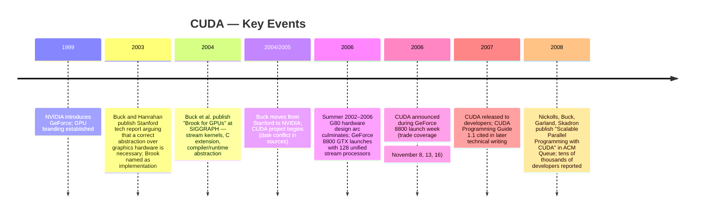
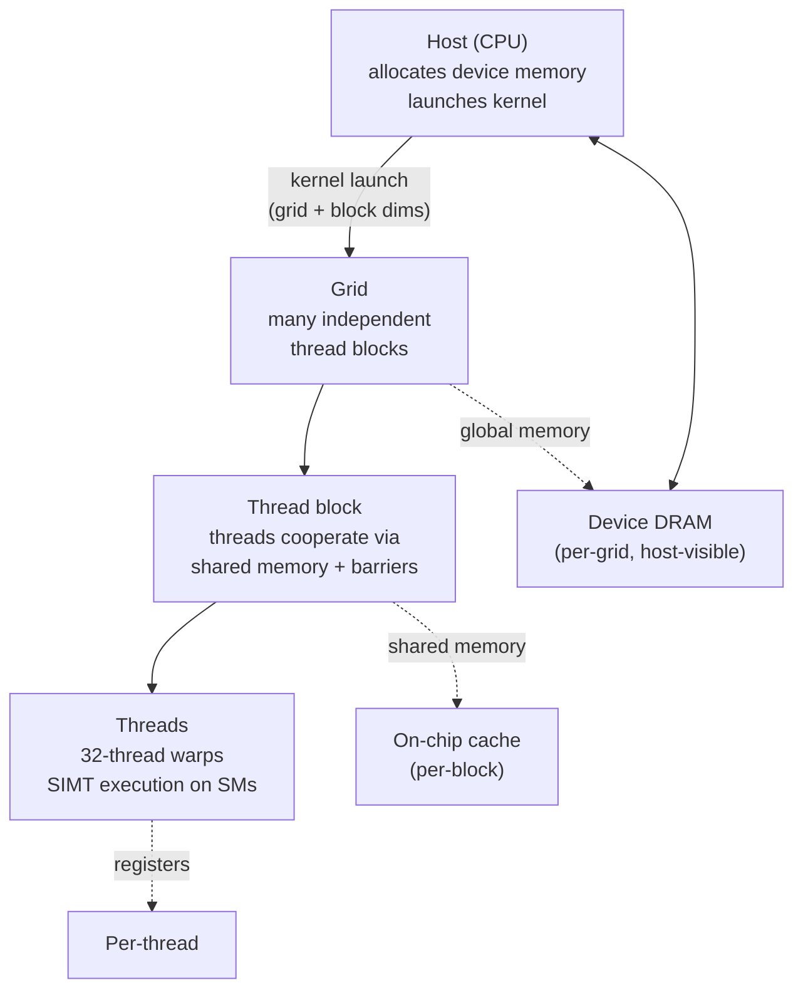

:::tip[In one paragraph]
Before 2006, harnessing GPU arithmetic for non-graphics work required disguising computations as pixel-shader tricks. CUDA ended that era. By marrying Ian Buck's C-like programming model to NVIDIA's G80 unified architecture — with its 128 stream processors, shared on-chip memory, and a grid/block/thread execution hierarchy — NVIDIA converted GPGPU from a research curiosity into a stable, vendor-supported infrastructure platform. The GPU did not stop rendering; it became a parallel compute engine that scientists could program without first becoming graphics specialists.
:::

<strong>Cast of characters</strong>

| Name | Lifespan | Role |
|---|---|---|
| Ian Buck | — | Stanford PhD researcher, Brook development lead; joined NVIDIA to start CUDA (date conflict: NVIDIA bio says 2004, Buck said 2005). |
| Pat Hanrahan | — | Stanford graphics professor and Buck's co-author on the 2003 data-parallel computation report and the 2004 Brook SIGGRAPH paper. |
| John Nickolls | — | NVIDIA director of architecture for GPU computing; co-author of the 2008 ACM Queue CUDA article documenting the programming model. |
| Michael Garland | — | NVIDIA researcher; co-author of the 2008 ACM Queue CUDA article. |
| Kevin Skadron | — | University of Virginia professor, on sabbatical with NVIDIA Research; co-author of the 2008 ACM Queue CUDA article. |
| Jensen Huang | — | NVIDIA CEO; later reporting describes him marketing programmable GPUs to the supercomputing community in 2006. |

<strong>Timeline (1999–2008)</strong>

<strong>Plain-words glossary</strong>

- **Kernel (CUDA)** — A C-like function written once by the programmer but executed simultaneously by thousands of GPU threads. The programmer writes the logic for one thread; CUDA launches it across the entire grid.
- **Grid / thread block / thread** — The three-level hierarchy CUDA uses to organize parallel work. A kernel launch specifies a grid of blocks; each block contains a set of cooperating threads; threads inside a block can share data and synchronize with barriers. Blocks are independent of one another, which lets the hardware schedule them freely.
- **SIMT (Single-Instruction, Multiple-Thread)** — CUDA's execution model: the hardware issues the same instruction to many threads at once, each operating on its own data. It differs from classical SIMD in that individual threads can take divergent code paths, at a performance cost.
- **Shared memory** — A small, fast, on-chip memory space available to all threads within a block. On Tesla-architecture GPUs it maps to low-latency SRAM, making it a software-managed cache that threads can use to cooperate without hitting the slower board DRAM.
- **Host / device split** — CUDA's term for the CPU-side ("host") and GPU-side ("device") memory spaces. Data must be explicitly copied between them; this transfer cost shapes how CUDA programs are designed, encouraging programmers to keep large computations on the GPU side rather than shuttling results back and forth.

<strong>Architecture sketch</strong>

The diagram makes visible why the same CUDA program runs faster on a chip with more streaming multiprocessors: blocks are independent, so the hardware schedules them across however many SMs the chip provides. The memory hierarchy attaches at the level that owns each scope (registers per thread, shared memory per block, global DRAM per grid) — the price the abstraction pays to preserve that portability across chips.

In the early years of the new millennium, the commodity graphics processing unit remained a powerful but deeply awkward machine. The foundational architecture of a programmable graphics processor was explicitly engineered to push pixels to a screen, processing textures, shading surfaces, and rendering complex visual scenes at high frame rates. Yet, the sheer, raw computational horsepower of these specialized cards had steadily begun to tempt scientists and computer science researchers. This growing community was increasingly looking to graphics hardware for the kind of demanding numerical work that had previously been the exclusive domain of central processing units. The central problem, however, was that the gap between what the graphics hardware could theoretically compute and what a software programmer could practically express was immense. If commodity GPUs were ever to break out of their rendering constraints and become broadly useful processing resources, the abstraction bridging the programmer and the silicon had to be correct.

At Stanford University, researchers Ian Buck and Pat Hanrahan observed this escalating tension within the computing field. Their early analysis noted that while researchers were actively attempting to run CPU-style workloads on graphics hardware, the available software surface was rigid and unyielding. The programming models of the era exposed only the specific language of rendering: shaders, textures, graphics application programming interfaces, and rigid graphics-pipeline constraints. A developer who wanted to run a mathematical simulation had to artificially trick the GPU, contorting pure numerical work into a format that the rendering pipeline could understand. Programmers were forced to conceptualize their algorithms in terms of vertices and pixels, rather than utilizing standard computational data structures and loops. The act of mapping a standard mathematical problem onto texture memory and pixel shaders was a complex, counter-intuitive puzzle that deterred widespread adoption.

The difficulty was not that the mathematical problems were alien to the hardware. Many useful numerical workloads were highly regular: perform the same operation across a large array, combine neighboring values, or repeatedly apply the same update rule to many independent elements. A graphics processor already excelled at doing a similar kind of work for images, where the same shader might be evaluated across enormous numbers of pixels. The awkwardness came from the route into the machine. A programmer trying to express a simulation or matrix operation had to dress the computation in the clothing of graphics, deciding which values became textures, which operations became shader programs, and how intermediate results would be moved through a pipeline designed for images rather than ordinary arrays. The promise was real, but the intellectual toll was high.

The wider high-performance computing environment was simultaneously awakening to this awkward, locked-away power. By late 2006, the atmosphere in the supercomputing sector was defined by a growing curiosity about graphics processors. Researchers were actively comparing the floating-point performance of GPUs against traditional CPUs, running specialized benchmarks at institutions such as the University of North Carolina at Chapel Hill to measure the potential gains. At the same time, the Stanford-based Folding@Home project was experimenting with GPU clients, attempting to harness the latent processing power of consumer graphics cards to accelerate complex protein folding calculations. Yet, despite these ambitious academic and distributed-computing efforts, the barrier to entry remained punishingly high. The commodity graphics card was still a specialized rendering engine. Unlocking its general-purpose potential required not just a computational problem to solve, but a deep, highly specialized expertise in the arcane, specialized details of computer graphics pipelines. The research community needed a way to present the graphics hardware as a standard processor, hiding the rendering stages behind a familiar computational model. The abstraction itself was the missing technology.

The search for that correct abstraction led directly to Brook. Presented in 2004 as a paper at the SIGGRAPH conference, Brook for GPUs was a system explicitly designed to enable general-purpose computation on programmable graphics hardware. It approached the problem by extending the familiar C programming language with data-parallel constructs, attempting to make the graphics card look and act like a streaming coprocessor. Instead of demanding that developers understand shaders, textures, and rendering pipelines, Brook offered a cleaner mental model built entirely on streams and kernels. In this model, a stream was a collection of data requiring similar computation, and a kernel was a specific function applied sequentially to each element of that stream.

The ingenuity of the Brook system lay in its underlying compiler and runtime environment, which worked together to virtualize the physical graphics hardware. The system effectively abstracted away the idiosyncrasies of the rendering pipeline, presenting a much more generalized computational interface to the programmer. In a later retrospective interview, Ian Buck explained the pressing necessity of this approach. He described Brook as an attempt to systematically abstract the inherent "graphics-isms" into general programming concepts. Before such a system existed, he noted, porting a standard non-graphics application to run on a graphics card effectively required specialized graphics expertise. Brook provided a much-needed framework for thinking about GPUs as pure compute devices, systematically stripping away the rendering metaphors that had previously defined GPU programming.

Brook's importance was that it changed the programmer's first question. Instead of asking how to draw a useful picture whose pixels happened to encode a computation, the programmer could ask where the data parallelism lived. A simple operation such as SAXPY, usually written as `y = ax + y` across the elements of two vectors, was a natural fit for the stream model because each element could be updated by the same small kernel. A matrix-vector multiply had a similar shape, though with more demanding memory access and reduction behavior. Fast Fourier transforms, image segmentation, and ray tracing were more varied, but they still showed how far the stream idea could be pushed when a compiler and runtime absorbed the graphics-specific bookkeeping.

The inclusion of reductions was especially important because many scientific programs do not merely transform arrays element by element. They also need to combine results: sum values, find extrema, accumulate partial products, or collapse a large intermediate structure into a smaller one. On a graphics pipeline, those operations were awkward because the machine was happiest when many independent pixels could be processed without coordination. Brook did not make the GPU a general CPU, but it gave programmers a vocabulary for describing both broad parallel maps and the more constrained operations that gathered results back together. That vocabulary made the remaining limitations visible. The programmer could see the shape of the computation in ordinary terms, while the system handled the translation into the older graphics machinery as far as that machinery allowed.

The results published in the 2004 paper demonstrated that this abstraction did not come at the cost of the hardware's underlying speed. When benchmarked, Brook's implementations of standard algorithms proved highly effective. The researchers tested the system on classic computational workloads, including SAXPY operations, single-precision general matrix-vector multiplication, image segmentation, fast Fourier transforms, and ray tracing. These were foundational operations in scientific computing, and proving that they could run efficiently on a GPU without raw graphics code was a significant milestone. The Brook implementations performed comparably to code written painstakingly by hand in specialized graphics languages. Furthermore, in some scenarios, the Brook implementations were reported to be up to seven times faster than their standard CPU counterparts. It was a compelling, empirical proof of concept: a specialized compiler could successfully hide the rigid graphics pipeline while preserving, and exposing, the massive performance advantages of the GPU.

However, Brook was still fundamentally a software adaptation, carefully fitted to the physical limitations of earlier-generation programmable graphics hardware, specifically the DirectX 9 class of cards. It reflected the hard constraints of its era. While it successfully introduced the concepts of streams, kernels, and reductions to the GPU programmer, it was forced to operate within the rigid memory and execution models dictated by the existing graphics architecture. A compiler alone could only go so far in masking the true nature of the silicon. The underlying hardware still ultimately wanted to render graphics, and the software bridge was constrained by those fixed hardware pathways. For the abstraction to truly take hold and scale, the hardware itself would need to be rebuilt from the ground up to support general computation.

The transformation of this academic software abstraction into an industrial hardware platform occurred as Ian Buck transitioned from Stanford to NVIDIA. The exact timing of this move is recorded differently in historical accounts—NVIDIA's current corporate biographical materials state that Buck joined the company in 2004 upon completing his doctorate, while Buck himself later recalled joining by 2005 specifically to start the CUDA project alongside one other engineer. Regardless of the precise start date of his employment, his arrival at the company coincided with a massive, multi-year architectural overhaul that was already well underway within NVIDIA's engineering departments.

In the summer of 2002, NVIDIA had begun designing the architecture for what would become the GeForce 8800, based on the G80 or Tesla architecture. The design goals for this new generation of silicon were extraordinarily broad and ambitious, reflecting a major institutional investment. The engineering teams were targeting not only traditional graphics metrics, such as higher image quality and strict compliance with DirectX 10 pipeline features, but also advanced game physics and high-end floating-point computation. When the GeForce 8800 GTX finally arrived, it represented a fundamental break from the rigid, segregated graphics pipelines of the past. It was introduced to the market as a fully unified architecture.

The date conflict around Buck's move matters because it keeps the story from becoming too neat. CUDA was not simply a Stanford prototype renamed inside a corporation, nor was it just a late software add-on to a finished graphics chip. The available record points instead to overlapping streams of work. Brook had supplied a research vocabulary for making GPUs programmable as compute devices. NVIDIA, meanwhile, was already redesigning the graphics processor around a unified architecture that could make such a vocabulary far more practical. By the time CUDA was announced, the software model and the G80 hardware could be presented as parts of the same system, even if the exact institutional path into that system survives with slightly different dates.

At the heart of the GeForce 8800 GTX were 128 individual stream processors, running at a clock speed of 1.35 GHz. In older GPU designs, processing units were strictly segregated into specialized, inflexible roles—some processors were dedicated exclusively to handling vertices, while others handled only pixels. This often led to inefficiencies; if a workload was heavy on pixel shading but light on vertex calculations, the vertex processors would sit idle. The G80's unified stream processors, however, eliminated this hard boundary. The new unified processors could dynamically handle vertices, pixels, geometry, or physics workloads as needed by the application. NVIDIA's technical documentation described these processing units as effectively general-purpose floating-point processors. The hardware had been fundamentally generalized. It was no longer strictly a rendering engine; it was a massively parallel floating-point computer that also happened to be capable of outputting video.

CUDA was the software product engineered to mate directly with this rebuilt hardware. The GeForce 8800 GPUs were shipped with what NVIDIA termed CUDA built-in technology. Unlike Brook, which had been forced to fight the hardware to present a clean abstraction, CUDA was supported by a dedicated compute driver and an architecture that inherently complemented the CPU. The new platform provided a standard C language interface and introduced the foundational concept of cooperative GPU threads. NVIDIA presented the environment as more than a graphics hack or a clever compiler trick: a C compiler environment for the GPU, paired with optimized math libraries, hardware debugging support, a dedicated profiler, and lower-level assembly access for developers who needed absolute control over the silicon. A style of abstraction explored in the Stanford labs had become a native, heavily supported hardware feature.

The hardware story also keeps the account from being only a language story. G80's unified processors were not exposed to CUDA programmers as if they were ordinary CPU cores, and NVIDIA did not erase the graphics heritage of the chip. The point was subtler. The same pool of floating-point processors that could be scheduled for vertices, pixels, geometry, or physics could also be addressed through a compute-oriented programming surface. That made CUDA different from a library that merely accelerated one operation. It was a claim about the role of the graphics processor inside the whole computer: the CPU would continue to orchestrate the application, while the GPU would execute large regions of parallel numerical work under a programming model designed for that division of labor.

The tooling mattered as much as the syntax. A C-like language lowered the threshold for entry, but the surrounding infrastructure told developers that NVIDIA intended GPU computing to be a maintained surface rather than a research detour. A dedicated compute driver separated general computation from the graphics path. Math libraries gave early users pieces they did not have to rewrite. Debugging and profiling support acknowledged that performance programming on a massively parallel device required visibility into the hardware that ordinary CPU tooling did not provide. Lower-level assembly access preserved an escape hatch for programmers who needed to inspect the machine more directly. Together, these pieces turned a programming model into a stack.

The CUDA programming model established a new relationship between the developer and the massively parallel silicon. It required the programmer to adopt a new unit of thought, centered entirely on explicit parallelism. The foundational element of this model was the C-like kernel, a specialized function designed to be executed simultaneously across many parallel threads. The model was designed so that a programmer could write a single, straightforward sequential program that the hardware would then execute across thousands of individual data points.

In the CUDA execution paradigm, the host CPU calls a kernel, launching it over a highly structured grid. This grid is formally divided into thread blocks, and each individual block contains a group of concurrent threads. This hierarchy of thread groups was a crucial architectural innovation. Because the number of defined thread blocks could far exceed the physical processor count on any given chip, the architecture effectively virtualized the processing elements. The programmer was only required to expose the inherent parallelism in their algorithm; the hardware would then dynamically manage the thread creation, scheduling, and scaling. A program written for a GPU with a specific number of stream processors would automatically scale to utilize the full capabilities of a future GPU with many more stream processors, without requiring the code to be rewritten or recompiled.

That hierarchy also drew a boundary between what CUDA made easy and what it still demanded. Inside a block, threads could cooperate closely. They could share data, wait at barriers, and work together on a tile of a larger problem. Across blocks, the story was different. The independence of blocks was what let the hardware scheduler run them in whatever order fit the chip, and what let future chips run more blocks at once. But this same independence ruled out a style of programming in which every part of a computation could freely talk to every other part while a kernel was running. Algorithms had to be decomposed into pieces that could tolerate that separation. CUDA's abstraction was powerful because it exposed parallelism without exposing every hardware detail, but it remained an abstraction with sharp edges.

This was the conceptual compromise at the center of CUDA. It did not ask the programmer to schedule each physical processor by hand, but it did ask the programmer to reveal enough structure for the hardware to find parallel work. The kernel body looked like a small serial function, yet the launch configuration declared a much larger geometry of execution. A grid described how many blocks existed; a block described how many threads would cooperate; thread and block indices let each executing instance find its own slice of data. The programmer was therefore writing one computation and also describing its population. That combination, ordinary C-like code plus explicit parallel geometry, was the practical bridge between a CPU programmer's habits and a GPU's appetite for thousands of simultaneous operations.

To support and feed this massively parallel execution model, CUDA exposed distinct, explicit memory spaces. Each thread was allocated its own local memory. More significantly, each thread block had access to a shared memory space, which on the Tesla architecture physically mapped to low-latency, on-chip random-access memory. Finally, all threads had access to a massive global memory space, which resided in the graphics board's slower dynamic random-access memory. This explicit memory hierarchy gave developers fine-grained, manual control over data proximity. The shared memory, in particular, could be utilized as a highly efficient, software-managed cache, allowing threads within the same block to communicate and share data rapidly using explicit barrier synchronization. For one sparse matrix-vector multiplication example, ACM Queue reported that careful management of this shared memory yielded roughly a twenty percent gain simply by optimizing data access patterns.

Yet, this computational power came with strict rules and limitations. The model mandated that thread blocks remain entirely independent of one another. There was no mechanism provided for direct communication between different blocks within the same kernel grid. This restriction was necessary, as it allowed the hardware to execute blocks in any arbitrary order without risking deadlocks, a critical requirement for scalability. Furthermore, the memory systems of the CPU and the GPU remained physically distinct and separate, requiring the programmer to write explicit host-device data copies to move information over the system bus. These transfers were often a performance bottleneck, requiring careful architectural awareness to minimize their frequency.

This host-device split gave early CUDA programs a distinctive rhythm. Data began in the CPU's memory, moved to the graphics board, passed through one or more kernels, and then had to be copied back if the CPU or the rest of the application needed the result. A fast kernel could still disappoint if the program spent too much time moving data across that boundary. The best early CUDA programs therefore treated the GPU less as an accelerator for isolated statements and more as a separate parallel machine that should be fed enough work to justify the transfer. That habit of thought was one of the quiet infrastructure changes CUDA imposed: programmers had to reason not only about arithmetic, but about locality, staging, and the cost of crossing between processors.

Shared memory made the same lesson appear inside the GPU. Global memory offered capacity, but it lived off chip in board DRAM. Shared memory was smaller, but it sat close to the processors and could be used by threads within a block as a software-managed cache. A developer who loaded a tile of data into shared memory, synchronized the block, and reused that data many times could reduce slower global-memory traffic. This was not automatic magic. It rewarded programmers who understood the data movement pattern of their algorithms, and it punished programs that expressed parallel arithmetic while ignoring where the operands lived. CUDA made the GPU easier to program, but it did so by making the machine's memory hierarchy explicit rather than hiding it completely.

These specific design choices highlighted the evolutionary leap from earlier streaming languages. While Brook had been a necessary and pioneering software bridge fitted to older GPUs, CUDA offered much more flexible thread creation, explicit barrier synchronization between threads, and the powerful shared-memory architecture. The new model demanded more from the developer—particularly regarding the costly movement of memory and the performance penalties of divergent control flow within thread blocks—but in return, it offered a stable, scalable, and native way to write parallel programs for the graphics processor.

CUDA was formally announced to the public during the launch week of the GeForce 8800 in November 2006. Trade publications and industry watchers covered the debut extensively, highlighting NVIDIA's bold claim of delivering the industry's first C-compiler development environment specifically built for the graphics processing unit. The software development kit was made available through a registered developer program, and the architecture promised to open a new era of accessibility for high-performance computing, fundamentally changing the relationship between the developer and the graphics card.

The public record around the launch is slightly staggered. Trade coverage appeared on November 8, November 13, and November 16, all tied to the GeForce 8800 launch period and NVIDIA's CUDA announcement. That spread is a useful reminder that CUDA entered the world as part of a product launch rather than as a single academic publication with one clean bibliographic date. Contemporary coverage emphasized the same package of claims: a GPU-computing architecture, a C-compiler development environment for the GPU, GeForce 8800 availability, and software access for registered developers. The exact public release of the SDK belongs to 2007 in later technical writing, but the November 2006 announcement was already enough to mark NVIDIA's intent.

Crucially, the Tesla architecture that underpinned the GeForce 8800 was not conceived as a one-off experiment for a single flagship card. It was systematically designed to extend the GPU beyond graphics across the company's product line. CUDA C programmability was slated to be supported not just on the high-end GeForce 8800, but on professional Quadro cards, the newly introduced Tesla line dedicated strictly to computing, and future mainstream GeForce GPUs. This architectural commitment gave software written for CUDA a clearer hardware path than the earlier world of ad hoc graphics tricks. The same programming surface could reach gaming cards, professional visualization cards, and dedicated compute boards, all inside NVIDIA's own ecosystem.

Early evidence of CUDA's utility quickly emerged in the scientific and technical computing communities. By 2008, researchers and developers were reporting large performance speedups on Tesla-architecture GPUs across a variety of complex workloads. Early successful applications included magnetic resonance imaging reconstruction, molecular dynamics simulations, and n-body physical simulations. The abstraction was undeniably working in the real world, providing tangible benefits to computationally intensive fields. That same year, technical reports noted that the CUDA platform had rapidly attracted tens of thousands of developers, framing the release as a genuine democratization of parallel programming.

Those examples were not random showcase demos. They were exactly the sort of problems that made the graphics processor attractive before CUDA: dense numerical work, repeated operations over large data sets, and enough arithmetic intensity to repay the cost of moving data onto the board. Magnetic resonance imaging reconstruction could exploit repeated numerical transforms. Molecular dynamics and n-body simulation involved large numbers of particles whose interactions could be expressed as parallel work. Sparse matrix-vector multiplication, another early example in the CUDA literature, exposed the other side of the bargain: performance depended not only on the number of floating-point operations, but on whether memory access could be organized so the GPU spent its time computing rather than waiting.

Despite this early technical traction, the initial launch was an uncertain push into a specialized market. Later secondary reporting describes NVIDIA CEO Jensen Huang marketing programmable GPUs to the supercomputing community and trying to enlarge a market that was still obscure compared with the company's established graphics business. The anecdotal record includes scientific users who were already finding value in NVIDIA hardware, but it does not establish a simple cause-and-effect story in which one customer observation produced CUDA. The stronger history is more interesting: a graphics company created a compute platform for technical users before the largest future use case was visible.

In 2006, CUDA was not designed, marketed, or perceived as an artificial intelligence product. Its immediate targets were high-performance computing, data analysis, product design, and technical simulation. It would take years before a different research community recognized the profound implications of massively parallel, mathematically capable hardware. The importance of CUDA at this point was therefore infrastructural rather than prophetic. It made the GPU programmable through a stable vendor stack, attached that stack to shipping hardware, and gave scientists and engineers a way to write parallel code without first becoming graphics specialists.

CUDA did not invent the concept of general-purpose GPU computing, but it changed the durability of the abstraction layer. By marrying a C-like programming model to a unified hardware architecture, NVIDIA created a vendor-controlled platform that made parallel computation more accessible, stable, and commercially durable. The graphics processor did not stop being a graphics processor, and CUDA did not remove the hard work of parallel programming. It did something narrower and more consequential: it turned GPU computing from a specialist practice into an infrastructure path that other programmers could plausibly follow. In doing so, it established the computational conditions that would, years later, make the next era of technology possible.

:::note[Why this still matters today]
CUDA's grid/block/thread abstraction is the foundation every modern deep-learning framework targets when it compiles to NVIDIA hardware. PyTorch, TensorFlow, and JAX do not write raw assembly for streaming multiprocessors; they emit CUDA kernels or call cuBLAS and cuDNN — libraries that themselves rely on the same host/device, shared-memory, and barrier-synchronization primitives described in the 2008 ACM Queue article. The proprietary vendor-platform boundary CUDA drew in 2006 is also why ROCm, SYCL, and OpenCL still compete for relevance: every alternative must answer the same abstraction problem CUDA already solved, against an installed base of developers and tools CUDA accumulated first.
:::
