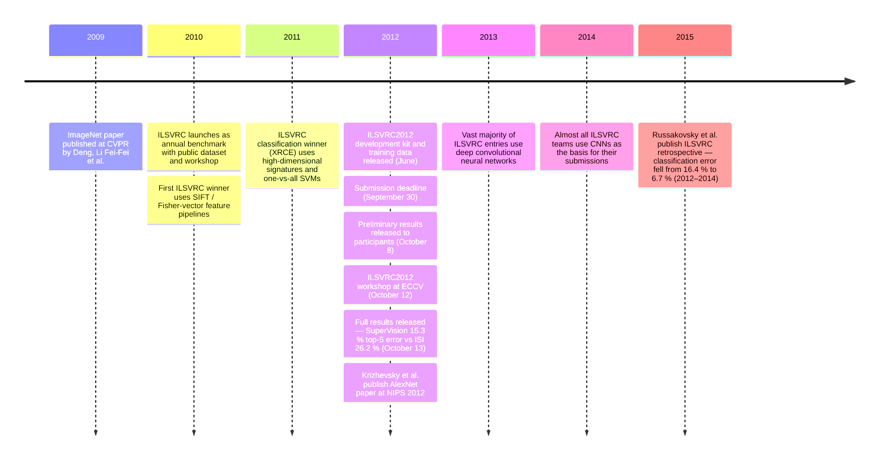

:::tip[In one paragraph]
In 2012, Alex Krizhevsky, Ilya Sutskever, and Geoffrey Hinton entered the ImageNet Large Scale Visual Recognition Challenge under the name SuperVision and posted 15.3% top-5 error against the runner-up's 26.2% — a gap too large to explain away. The result did not invent neural networks or GPU computing; it turned scale into public, benchmarked proof that learned visual features could beat hand-built feature-engineering pipelines on their own contest.
:::

Cast of characters

| Name | Lifespan | Role |
|------|----------|------|
| Alex Krizhevsky | — | University of Toronto researcher, first author of the AlexNet paper, SuperVision team member |
| Ilya Sutskever | — | University of Toronto co-author and SuperVision team member |
| Geoffrey E. Hinton | 1947 – | University of Toronto co-author; long-running neural-network advocate; ACM Turing Award laureate |
| Li Fei-Fei (Fei-Fei Li) | — | Co-creator of ImageNet; ILSVRC organizer; benchmark infrastructure actor in this chapter |
| Jia Deng | — | First author of the 2009 ImageNet paper; co-author of the ILSVRC retrospective |
| Olga Russakovsky | — | Lead author of the 2015 ILSVRC retrospective; primary benchmark historian for 2012–2014 adoption |

Timeline

Plain-words glossary

**ILSVRC (ImageNet Large Scale Visual Recognition Challenge):** An annual public benchmark started in 2010. Teams receive labeled training images, tune against validation images, and submit predictions for hidden test images scored by a central evaluation server. The shared rules make results comparable across groups.

**Top-5 error:** The fraction of test images for which the correct label is absent from the model's five highest-scoring guesses. A model may return up to five candidate labels; the prediction is wrong only if none of them match. Used by ILSVRC because many natural photographs are genuinely ambiguous.

**Convolutional neural network (CNN):** A network that applies learned filters sliding across local image regions rather than connecting every pixel to every unit independently. Early layers detect local patterns; deeper layers combine those into more abstract features. AlexNet used five convolutional layers followed by three fully connected layers.

**ReLU (Rectified Linear Unit):** A nonlinearity that returns zero for negative inputs and grows linearly for positive ones. Avoids the slow learning seen in earlier saturating units; the AlexNet paper reported ReLU networks trained several times faster, which mattered when training already took five to six days.

**Dropout:** A regularization method that randomly sets each neuron's output to zero with some probability during training. Prevents the network from relying on fragile patterns among particular units, helping a large model generalize rather than memorize the training set.

**Fisher vector:** A compact encoding that summarizes how a collection of local image descriptors deviates from a statistical model. Together with SIFT and LBP descriptors, Fisher vectors defined the competitive feature-engineering regime that AlexNet defeated in ILSVRC2012.

The story of the 2012 breakthrough in computer vision does not begin with the sudden invention of a new algorithmic trick, nor does it begin in a vacuum of solitary genius. It begins with the deliberate construction of a public arena. Before any deep convolutional neural network could make a decisive case for itself, the ImageNet Large Scale Visual Recognition Challenge, widely known as ILSVRC, had to turn the sprawling ImageNet database into an unforgiving yearly contest. Initiated in 2010, ILSVRC was a piece of shared scientific infrastructure: a standard dataset, hidden test labels, a central evaluation procedure, and an annual workshop where progress could be compared in public. This structure mattered. The 2012 Toronto result became persuasive not because its authors declared a revolution, but because the scoreboard had already been built, maintained, and accepted by a field that was not organized around neural networks.

That was the first hidden condition of the ImageNet smash. A model could no longer be evaluated only on a small private collection of images, a hand-selected demo, or a narrow set of categories. Teams received training data, tuned their systems against validation images, and submitted predictions for test images whose labels were withheld. The evaluation server then turned those submissions into comparable numbers. ILSVRC also made the calendar part of the experiment. There was a release of development materials, a submission deadline, preliminary results, final results, and a workshop held with the PASCAL VOC workshop at ECCV 2012. By the time the Toronto team entered, the challenge already had the shape of a public ritual. It could absorb a surprising result because the result appeared inside a procedure others had agreed to use.

The 2012 schedule shows how procedural that ritual had become. The organizers announced preparation for the challenge in May, released the development kit, training data, and validation data in June, extended the submission deadline to the end of September, released preliminary results to participants on October 8, held the workshop on October 12, and released full results on October 13. None of this resembles a private bake-off or a retrospective comparison assembled after the fact. It was a dated, shared contest, and the hidden labels meant that teams could not tune directly to the answers that would decide the public table.

The scale of the 2012 arena was itself part of the argument. ILSVRC2012 standardized evaluation across 1,000 object categories and 1,431,167 annotated images. The comparison made by the later ILSVRC organizers was stark: PASCAL VOC 2012, still a major vision benchmark, had 20 classes and 21,738 images. In the AlexNet paper's own description of the challenge subset, the authors worked with roughly 1.2 million training images, 50,000 validation images, and 150,000 testing images across 1,000 categories. This was not simply "more data" in the abstract. It meant that a system had to spread its competence over hundreds of animal, vehicle, instrument, household, and natural-object categories, many of them visually close enough that a brittle shortcut would not carry the day.

The metric also deserves more attention than the shorthand usually gives it. ILSVRC classification was scored by top-5 error. A system could return up to five candidate labels for each image, and the prediction counted as correct if the true label appeared anywhere in that set. In plain terms, if there were \(N\) test images, top-5 error was the fraction for which the correct class was absent from the model's five highest-scoring guesses. The metric was generous enough to acknowledge the messiness of real photographs, where several objects might appear or where the framing might make one label less obvious than another. But it was not loose. Across 1,000 classes and 150,000 test images, a low top-5 error required breadth, ranking precision, and robustness against visual ambiguity.

The validation and test split also mattered. Validation images gave teams a public way to tune choices such as preprocessing, feature combinations, architecture, and training schedules. Test images, by contrast, produced the public score without exposing their labels. That separation made ILSVRC more than a leaderboard of self-reported claims. It forced systems to generalize from the training and validation regime to a held-out test distribution large enough that a single lucky category, clever cherry-picking, or a small evaluation set could not dominate the outcome. The benchmark therefore made scale and discipline reinforce each other: the dataset was large enough to make learned representations plausible, and the hidden-test protocol was strict enough to make the eventual gap credible.

Before 2012, the competitive baseline in this public arena was defined by sophisticated feature engineering. The leading systems from the 2010 and 2011 competitions were not naive foils waiting to be swept away. They were the result of years of serious work on how mathematical descriptors could capture image structure. Olga Russakovsky and her fellow ILSVRC organizers later described the early leaders as systems built from carefully designed feature pipelines. Scale-Invariant Feature Transform descriptors, Local Binary Patterns, Fisher vectors, coding methods, compression, and SVM or linear classifiers all belonged to this competitive regime. The 2011 winner, for example, used high-dimensional signatures, compression, and one-vs-all linear SVMs. These were not casual recipes. They represented a mature style of computer vision in which human insight selected the features and the classifier learned how to combine them.

That older regime had a clear division of labor. The early stages of the pipeline translated pixels into descriptors that researchers believed would be stable under changes of viewpoint, lighting, texture, and local geometry. SIFT summarized local gradient structure. LBP-style features captured texture patterns. Fisher-vector systems encoded how collections of local descriptors deviated from a statistical model. The final classifier then operated on those engineered summaries rather than on raw image values. The method could be powerful, and in many settings it was. But the burden of representation rested heavily on human design. The question ILSVRC2012 exposed was whether a network trained directly from pixels could learn representations that outperformed those designed by experts.

The 2012 results page makes that older style visible not only through the runner-up. Other competitive entries described mixtures of dense features, GIST descriptors, color statistics, local binary patterns, and support-vector classifiers. The Oxford VGG entry, for instance, still belonged to a landscape in which combinations of descriptors and classifiers were the normal language of competition. This matters because AlexNet did not beat an empty field. It entered a benchmark whose best teams already knew how to scale hand-engineered representations to large image collections.

Into this feature-engineering landscape came the University of Toronto team: Alex Krizhevsky, Ilya Sutskever, and Geoffrey E. Hinton. Operating under the name SuperVision, they submitted a large deep convolutional neural network trained on raw RGB pixel values. Their entry did not claim that convolutional networks had just been invented. The older history of convolutional nets, including the LeNet tradition, belonged to earlier decades. What made the Toronto submission different was the combination of a large supervised dataset, a large model, modern regularization, and commodity GPU computation. The system was a scale argument made executable.

The human context matters, but the strongest available account is spare. Hinton was one of the researchers who had kept working on neural networks through years when the approach was often treated skeptically. The Association for Computing Machinery later described Hinton, Yann LeCun, and Yoshua Bengio as part of a small group that remained committed to neural networks during the early 2000s, when much of the field favored other methods. That retrospective framing is useful because it explains why the SuperVision result landed as more than an incremental model improvement. It was a public test of a research program that had not occupied the center of mainstream computer vision.

The SuperVision paper stated the technical wager in compact form. Krizhevsky, Sutskever, and Hinton wrote that they had trained one of the largest convolutional neural networks to date on the ILSVRC-2010 and ILSVRC-2012 subsets and had achieved the best results then reported on those datasets. The architecture contained about 60 million parameters and 650,000 neurons, arranged as five convolutional layers followed by three fully connected layers and a 1,000-way softmax. Those numbers were large by the standards of the time, but their importance was not only size. They marked a shift in where the representation work happened. Instead of feeding a classifier with SIFT, LBP, GIST, or Fisher-vector summaries, the model learned successive internal representations from the image data itself.

Convolutional layers made that possible in a particular way. A convolutional network does not connect every input pixel independently to every unit in the next layer. It uses learned kernels that slide across local regions of the image, producing feature maps whose weights are shared across spatial locations. In the early layers, such filters can respond to local patterns; in deeper layers, combinations of earlier responses can support more abstract visual distinctions. This does not mean the network "understood" objects in a human sense. It means the model had a mechanism for building layered visual features from data rather than receiving those features as handcrafted input. On ImageNet-scale recognition, that distinction became decisive.

The model's size also created a risk. A network with 60 million parameters could memorize idiosyncrasies of the training set if it were simply allowed to fit the data without restraint. The promise of learned features only mattered if the system generalized to the hidden test images. That is why the Toronto entry has to be understood as a whole recipe rather than as one magical component. The model architecture, the input preprocessing, the nonlinearity, the data augmentation, the dropout regularization, the optimization procedure, and the two-GPU implementation all interacted. Removing the benchmark would make the result private. Removing the GPUs would make the training run impractical. Removing the regularization would leave a large model exposed to overfitting. The force of the result came from the combination.

The physical architecture of the Toronto network was shaped by commodity hardware as much as by abstract model design. The authors identified two limiting factors: GPU memory and tolerable training time. They used two NVIDIA GTX 580 GPUs, each with 3 gigabytes of memory. A single GTX 580 could not comfortably hold the full network, the intermediate activations, and the training batches. The solution was to spread the network across two consumer graphics cards and make the split part of the architecture.

That split was more subtle than simply running the same computation twice. The paper explains that the GPUs communicated only in certain layers. In some parts of the model, each GPU processed its own stream of feature maps. In other parts, information crossed the partition. The third convolutional layer, for example, took input from all kernel maps in the second layer, bridging the two sides. Later layers could be restricted again. This pattern kept communication costs under control while still allowing the two halves of the network to share information at key points. The engineering problem was not merely "use GPUs." It was to shape the computation so that the cost of moving data between devices did not wipe out the benefit of parallel arithmetic.

The GTX 580 constraint also gives the system a more concrete historical texture. AlexNet belongs to a moment when GPU computing was powerful enough to make a large supervised CNN feasible but still tight enough that memory layout, layer partitioning, and communication patterns were central design decisions. The network was not an infinitely elastic cloud job. It had to fit into specific 3GB devices, train in a number of days the researchers could tolerate, and preserve enough capacity to learn features across 1,000 categories. That pressure is visible in the paper's architecture diagram, which draws the model as two stacked paths corresponding to the two GPUs. The hardware was not a background accessory. It helped determine the shape of the model that made the public result.

The training recipe added another layer of engineering discipline. The images were downsampled, and the system trained on 224-by-224 crops drawn from 256-by-256 images, with horizontal reflections used as additional variants. This mattered because a 60-million-parameter model trained on 1.2 million images still had enough capacity to overfit. Cropping and reflection did not create new semantic categories, but they made the model less dependent on one exact framing of a training photograph. During testing, the same crop logic allowed the network's predictions to be averaged across multiple views of an image. The input pipeline turned each stored photograph into a small family of related training cases.

The activation function was another nontrivial choice. Krizhevsky, Sutskever, and Hinton used Rectified Linear Units, or ReLUs, rather than the saturating nonlinearities common in earlier neural-network work. A ReLU returns zero for negative inputs and grows linearly for positive inputs. That simple shape helped avoid the slow learning associated with units that saturate at their extremes. The AlexNet paper reported that ReLU networks trained several times faster than equivalent networks with hyperbolic tangent units, and in one CIFAR-10 comparison reached a 25% training error rate six times faster. In the context of a model that already required days on two GPUs, speed was not cosmetic. Faster learning made a larger experimental loop possible.

Regularization was equally important. The team used dropout in the first two fully connected layers, randomly setting a neuron's output to zero with probability 0.5 during training. The practical effect was to prevent the network from relying too heavily on fragile co-adaptations among particular units. A feature could not assume that every neighboring feature would always be present, so the network had to learn more distributed representations. Alongside dropout, the model used data augmentation, local response normalization, overlapping pooling, stochastic gradient descent, momentum, and weight decay. The point is not that any one of these pieces was wholly new. It is that they made a very large supervised CNN trainable and testable at ImageNet scale.

Even the ordinary language of the optimizer points back to the size of the undertaking. Stochastic gradient descent with momentum and weight decay had to update tens of millions of weights while repeatedly sampling from more than a million images. Local response normalization and overlapping pooling were not the later end of CNN design, but in this system they formed part of the practical recipe that let the network train, regularize, and reduce spatial information without collapsing the representation too early. The architecture was therefore not a clean theorem about deep learning. It was an engineered machine for turning a huge labeled image collection into a ranked list of 1,000 class scores.

The training run itself was an infrastructure fact. The model trained for roughly 90 cycles through the 1.2 million training images. On the two NVIDIA GTX 580 3GB GPUs, that took between five and six days. Those numbers define the experiment's physical tempo: not an interactive proof-of-concept, not a months-long supercomputing campaign, but a multi-day run on a two-GPU machine whose limits were visible in the design. The resulting system could be submitted to ILSVRC not as a promise about the future, but as a file of predictions to be scored against hidden labels.

When the ILSVRC2012 results arrived in October, the impact of the Toronto approach became numerical. The official Task 1 classification table listed SuperVision at 0.15315 top-5 error, or 15.3%, for the entry that used extra training data from the ImageNet Fall 2011 release. The same official results also listed a SuperVision run restricted to the supplied 2012 challenge data at 0.16422, or 16.4%. That distinction matters. The 15.3% number became the famous headline, but it belonged to the extra-data condition. The supplied-data result was still far ahead of the field.

The comparison was stark. The second-best Task 1 entry, from the ISI team, reported 0.26172 top-5 error, or 26.2%. This was not a weak baseline. The official results described ISI's method as a feature-fusion system using SIFT/FV, LBP/FV, GIST/FV, and CSIFT/FV, followed by linear classification. In other words, the runner-up embodied the strong feature-engineering tradition at scale. It combined multiple descriptors, multiple views of visual structure, and the Fisher-vector machinery that had been central to high-performing recognition systems. The point of the result is therefore sharper than "neural networks beat old methods." SuperVision beat a serious, contemporary, carefully engineered vision pipeline under the benchmark's own rules.

The decimals on the scoreboard can make the difference look abstract, so it helps to translate the metric back into images. On 150,000 test examples, a 26.2% top-5 error corresponds to roughly 39,000 images for which the true label failed to appear in the top five guesses. A 15.3% error corresponds to roughly 23,000 such misses. The exact official comparison depends on the data condition, but the scale of the gap was not a marginal fluctuation. It represented a large number of test photographs on which the learned representation ranked the correct category where the feature-engineered runner-up did not.

The size of the gap made the result hard to dismiss. Between 15.3% and 26.2% lay nearly 11 percentage points of top-5 error. Even the 16.4% supplied-data SuperVision result stood almost 10 points ahead of ISI's 26.2%. On a 150,000-image hidden test set, that difference represented many thousands of images for which the correct class appeared in the Toronto model's top five guesses but not in the runner-up's. The official analysis later reported that SuperVision consistently outperformed ISI in the classification challenge, and the broader ILSVRC retrospective gave confidence intervals showing that the winning and runner-up methods were separated even at a 99.9% significance level. The result did not need rumors of surprise or disbelief to carry drama. The table supplied enough.

The AlexNet paper's own result table aligned with the official scoreboard while adding the model-combination detail. The 15.3% top-5 test error came from averaging five convolutional neural networks and adding two further networks that had been pre-trained on the Fall 2011 ImageNet release. That phrasing is important because the extra-data model was not simply seven identical networks all trained under the same condition. The ensemble result belonged to a particular setup, and the paper also reported strong results without that extra pretraining. Careful handling of this distinction does not weaken the achievement. It makes the comparison cleaner.

The name "smash" can sound emotional, but the historical event was a measurement. A hidden-test benchmark, a public results page, and a later organizer analysis all pointed in the same direction. A large CNN trained from RGB pixels on GPUs had defeated the leading feature-engineering systems by a margin too large to explain away as a statistical fluctuation. The same team was also identified by the ILSVRC organizers as the winner of both the classification and localization tasks. For classification, the evidence was especially clear because the top-5 metric, the data conditions, and the runner-up comparison were all visible on the official scoreboard.

The aftermath should be kept bounded, because the strongest evidence is about the benchmark field. Russakovsky and her co-authors later called ILSVRC2012 a turning point for large-scale object recognition, the moment when large-scale deep neural networks entered the scene. That does not mean every part of visual recognition changed at once, or that hand-engineered features vanished from every application. It means that in the ILSVRC arena, the incentives shifted quickly and visibly. The next teams did not have to accept a manifesto. They had to respond to a score.

:::note
> "On the plus side, of course, the major breakthroughs in object recognition accuracy (Section 5) and the analysis of the strength and weaknesses of current algorithms as a function of object class properties (Section 6.3) would never have been possible on a smaller scale."
>
> — Russakovsky et al. 2015, p.32

The organizers' own retrospective conclusion: scale was required, not merely rewarded.
:::

The response showed up in the following competitions. The ILSVRC organizers reported that the vast majority of 2013 entries used deep convolutional neural networks, and that almost all 2014 teams used CNNs as the basis for their submissions. This was the measured methodological pivot the 2012 result earned. Feature engineering did not disappear from history, and later systems would add their own architectural changes, training tricks, and infrastructure improvements. But the benchmark's center of gravity had moved. A team entering ILSVRC after SuperVision had to explain why it was not using the kind of learned representation that had just opened such a large gap.

The named winners in the next two years make the movement concrete without turning this chapter into a later architecture history. In 2013, the classification winner was Clarifai, associated with Matthew Zeiler, and it belonged to the wave of deep CNN systems that followed SuperVision. In 2014, the winning entries would introduce still other architecture choices. Those later systems are separate stories, but their appearance inside the same benchmark shows how quickly the SuperVision result changed the competitive question. The issue was no longer whether a large CNN could survive ImageNet-scale evaluation. It was how to build a better one.

The measured progress from 2012 to 2014 reinforced the point. With the dataset unchanged after 2012, ILSVRC classification error fell from 16.4% to 6.7%. That drop should not be credited to AlexNet alone. It came from a field rapidly exploring deep CNNs under the same evaluation structure. But the continuity of the dataset made the comparison meaningful. ILSVRC had created a stable surface on which model families could be compared, and after 2012 the dominant family changed.

Years later, the ACM's Turing Award retrospective would describe Hinton's 2012 work with Krizhevsky and Sutskever as improving convolutional neural networks with ReLUs and dropout regularization and almost halving the object-recognition error rate in ImageNet. That retrospective recognition captures the broader meaning of the result, but the narrower lesson is more exact. AlexNet did not make deep learning real by magic, by rhetoric, or by one clever trick. It made scale into public evidence. The dataset was large enough to reward learned representations, the contest was disciplined enough to make the comparison credible, the GPUs were capable enough to train the model in days, and the architecture was large enough to absorb the data.

The University of Toronto entry did not invent convolutional neural networks, and it did not erase the decades of computer vision research that preceded it. It showed that, under ILSVRC's public rules, a large deep CNN trained on massive labeled data with commodity GPU parallelism could decisively beat the strongest submitted feature-engineering pipelines. That was enough. The benchmark did what a good benchmark is supposed to do: it turned a research bet into a number other researchers had to answer.

:::note[Why this still matters today]
The 2012 ILSVRC result established a template that shapes how scale arguments are still made: combine a large labeled dataset, a benchmark with hidden test labels, and sufficient compute — then let the numbers answer the dispute. Practitioners building or evaluating perception systems today inherit this logic every time they track performance on held-out evaluation sets rather than self-reported demos. The two-GPU hardware constraint and the five-to-six-day training run are also a reminder that architectural decisions and infrastructure limits are not separate concerns: what fits in memory and trains in tolerable time determines what gets tested.
:::
