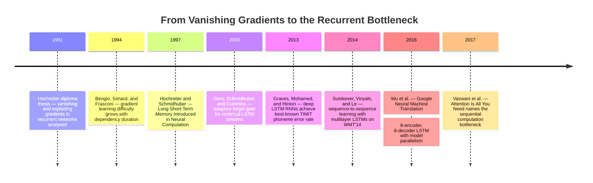

:::tip[In one paragraph]
Recurrent neural networks promised to learn from sequences of any length, but gradient descent failed across long gaps: error signals vanished or exploded during backpropagation through time. In 1997, Hochreiter and Schmidhuber introduced Long Short-Term Memory, a gated architecture whose constant error carousel kept gradients stable across thousands of steps. LSTM powered speech recognition and machine translation at scale, yet its inherently sequential computation prevented parallelisation within a single sequence — the bottleneck Vaswani et al. named explicitly in 2017.
:::

<strong>Cast of characters</strong>

| Name | Lifespan | Role |
|---|---|---|
| Sepp Hochreiter | — | Co-author of the 1997 LSTM paper; his 1991 diploma thesis is the origin of the vanishing/exploding-gradient analysis. |
| Jurgen Schmidhuber | — | Co-author of the 1997 LSTM paper and the 2000 forget-gate paper; IDSIA affiliation in the primary source. |
| Yoshua Bengio | — | Co-author of the 1994 paper that independently formalized the difficulty of learning long-term dependencies with gradient descent. |
| Ilya Sutskever, Oriol Vinyals, and Quoc V. Le | — | Authors of the 2014 sequence-to-sequence LSTM paper; provide the chapter's infrastructure detail: deep LSTMs, 8 GPUs, ten-day training. |
| Felix A. Gers and Fred Cummins | — | Co-authors with Schmidhuber on the 2000 paper that introduced the adaptive forget gate for continual LSTM streams. |
| Ashish Vaswani et al. | — | Authors of "Attention Is All You Need" (2017); named the sequential parallelisation constraint of recurrent models that concludes this chapter's arc. |

<strong>Timeline (1991–2017)</strong>

<strong>Plain-words glossary</strong>

- **Backpropagation through time (BPTT)** — The standard method for training recurrent networks: the network is conceptually unrolled across every time step, then ordinary backpropagation is applied to the resulting deep structure. Error signals must travel backward through every step, which creates the vanishing- and exploding-gradient problem at long distances.
- **Vanishing gradient** — When error signals shrink toward zero as they travel backward through many time steps, the network can no longer assign credit to inputs far in the past. Training may appear stable while the model silently ignores distant dependencies.
- **Constant error carousel (CEC)** — The self-connected, linear memory-cell path at the centre of an LSTM unit. Its self-connection weight is fixed at 1.0, so the gradient passing through it is multiplied by 1 at each step, neither shrinking nor exploding over long sequences.
- **Gate (LSTM)** — A multiplicative mechanism that controls whether information can enter a memory cell, leave it, or be discarded. The input gate controls writing, the output gate controls reading, and the forget gate (added in 2000) controls selective erasure of stored content.
- **Sequence-to-sequence learning** — A framework in which one recurrent network encodes a variable-length input into a fixed-size vector, and a second recurrent network decodes that vector into a variable-length output. Used in the 2014 Sutskever et al. paper for English-French machine translation.
- **Model parallelism** — Splitting a single neural network across multiple hardware devices (e.g. one LSTM layer per GPU) so the model fits and runs, as opposed to data parallelism, which runs copies of the same model on different batches. The 2014 seq2seq paper and 2016 GNMT system both relied on model parallelism to handle deep recurrent stacks.
- **Sequential operations** — Computations that must be performed in order because each depends on the previous result. Vaswani et al. 2017 quantified recurrent layers as requiring O(n) sequential operations for a sequence of length n, versus O(1) for self-attention — the architectural signature of the recurrent bottleneck.

The promise of the recurrent neural network was one of natural, intuitive alignment with the shape of time. Unlike a standard feedforward model, which required the engineer to chop the continuous world into rigid, fixed-width windows, a recurrent architecture was designed to simply observe a sequence as it unfolded. By maintaining a hidden state that updated with each successive input, the network could theoretically carry information forward across an input of changing length. It promised to map streams such as audio waveforms or strings of text into continuous internal representations, carrying the context of earlier observations into later predictions.

This theoretical elegance, however, almost immediately collided with a profound physical and mathematical obstacle during the training phase. When a neural network learns, it relies on gradient descent to assign credit or blame to its internal parameters for the final output. The network must determine how a slight change in any given weight would affect the overall error. In a recurrent architecture, the standard method for calculating these gradients is backpropagation through time, a process that effectively unfolds the network across the sequence's positions. 

Because a recurrent network reuses the same recurrent weights at every time step, unfolding it creates what is mathematically equivalent to an exceptionally deep feedforward network—one where the number of layers is equal to the length of the input sequence. The error signal generated at the end of the sequence must travel backward through this deep, unfolded structure, passing through the repeated recurrent transformations at every step to reach the beginning. Real-time recurrent learning approached the credit-assignment problem from a different computational direction, but it faced the same underlying difficulty: a long-range dependency required the learning signal to survive many repeated transformations before it could affect the weights responsible for an early event.

The unfolding was not merely a diagrammatic convenience. To train through time, the learner had to keep track of the intermediate states that connected the early input to the later loss, then traverse those states in reverse. A dependency separated by ten steps created a short chain. A dependency separated by hundreds of steps created a very deep chain. The longer the chain became, the more the training procedure depended on the stability of repeated multiplication through the same recurrent dynamics.

As the temporal distance between a relevant input and its eventual target output grows, the mathematics of this backward journey become increasingly hostile to learning. In the simplest recurrent equation, the new hidden state is a function of the previous hidden state and the current input. When the gradient moves backward across many steps, it contains a chain of derivatives linking one hidden state to the next. This chain is the technical heart of the problem. A useful signal does not merely travel through time; it is multiplied through time.

If the repeated factors in that product behave as though they are slightly greater than one, the gradients explode exponentially. The learning process becomes unstable, with weight updates oscillating wildly and destroying useful representations. Conversely, if the repeated factors behave as though they are slightly less than one, the gradients vanish exponentially as they travel backward. The signal shrinks into nothingness before it can assign credit to early inputs, leaving the network capable of learning only from recent, short-range clues. The same recurrence that gave the model its memory also created the repeated multiplication that made distant memories hard to train.

Exploding and vanishing gradients were not symmetrical inconveniences. An exploding gradient was dramatic: the update could become too large, making training unstable unless the update was constrained. A vanishing gradient was quieter and in some ways more damaging for long memory: training could appear numerically well behaved while the model simply failed to learn the distant dependency. The recent input would still have a usable gradient, so the network could become good at local correlations while remaining blind to the older fact that actually mattered.

In 1994, Yoshua Bengio, Patrice Simard, and Paolo Frasconi independently formalized this obstacle, stating clearly that learning long-term dependencies with gradient descent becomes increasingly difficult as the duration of the dependencies increases. Their analysis exposed a fundamental, structural trade-off inherent to conventional recurrent designs: there was a tension between the ability to efficiently learn from gradient signals and the capacity for robust long-term storage. A representation that changed quickly could follow the present but forget the distant past. A representation that resisted change could preserve information but become difficult to adjust with ordinary gradient descent. Doing both stably across long stretches of time was the contradiction.

By 1997, Sepp Hochreiter and Jurgen Schmidhuber summarized the resulting phenomenon in blunt terms: with conventional training methods like backpropagation through time or real-time recurrent learning, error signals flowing backward in time tend either to blow up or vanish. The problem was not that recurrent networks lacked expressive power in principle. It was that the training signal was too easily distorted before it reached the part of the sequence where the relevant cause had occurred. The recurrent network, built to capture the flow of time, was constrained by the mathematical realities of traversing it backward.

The solution to this vanishing error flow did not arrive through gathering larger datasets or waiting for faster hardware. It required a fundamental architectural intervention. In their 1997 paper, Hochreiter and Schmidhuber introduced Long Short-Term Memory, a specialized recurrent architecture designed specifically to address the problem of insufficient, decaying error backflow. Rather than attempting to force conventional recurrent units to behave well over long gaps through careful initialization or constrained learning rates, they built a specialized memory cell that altered the core dynamics of the network's internal state.

The central feature of this new architecture was an elegant structural innovation that the authors called the constant error carousel. Inside the LSTM unit, they established a self-connected, linear memory cell path with a fixed self-connection weight of exactly 1.0. This design choice was mathematically profound. Because the connection was linear and its weight was precisely one, the derivative of the signal passing through it was also one. This meant that once an error signal entered the memory cell, it could flow backward across time steps without being repeatedly amplified or attenuated. The constant error carousel acted as a protected structural bridge, allowing gradients to traverse vast temporal distances without vanishing or exploding.

The word "constant" mattered. Hochreiter and Schmidhuber were not merely adding another hidden unit to a recurrent network. They were carving out a path inside the recurrence whose derivative was designed to remain stable across time. In a conventional recurrent unit, the same weights that transformed the current input also shaped the future hidden state, so the memory path was entangled with every new calculation. In the LSTM cell, the memory content had a linear route through time. That route did not guarantee that the model would store the right information, but it changed the optimization problem from trying to preserve a signal through an arbitrary nonlinear recurrence into learning when to admit a signal onto a stable track.

However, a memory cell with a permanent, unaltering connection to itself would quickly become a liability if left exposed to every passing signal. If the network was forced to store every input it encountered, the carousel would become overwhelmed by irrelevant information, drowning out the critical signals it was meant to preserve. To make the constant error carousel practically useful, the LSTM unit needed dynamic mechanisms to control what entered the memory and what was allowed to influence the rest of the network.

Hochreiter and Schmidhuber surrounded the central carousel with multiplicative gate units. The input gate was designed to learn when to open and close, protecting the memory contents from being overwritten by irrelevant incoming signals. It acted as a filter, allowing the network to selectively decide which inputs were important enough to store in the constant error carousel. This addressed a conflict that ordinary recurrent weights could not easily resolve: the network needed to be sensitive enough to write a useful signal, but insensitive enough not to overwrite it on the next irrelevant step.

The output gate served a complementary purpose: it learned when to expose the internal state to the downstream network. This prevented the stored memory from disturbing the network's current computations when that historical context was not needed for the immediate output. Here too the gate separated jobs that had previously been fused together. A cell could preserve information internally without forcing that information to shape every intermediate prediction. The memory could be present without always being visible.

The gates were multiplicative because they did not simply add another source of information. They scaled access. A nearly closed gate could keep an input from entering the cell or keep a stored value from affecting the output; an open gate could let the same path participate strongly. That made the cell a controlled memory device rather than a passive accumulator. The central carousel supplied stable persistence, while the gates learned the moments when persistence should matter.

By separating the act of long-term storage from the act of immediate processing, the LSTM architecture achieved remarkable empirical results. The original 1997 paper reported that the architecture could bridge artificial minimal time lags in excess of 1000 discrete steps, a feat that conventional recurrent networks could not approach. Those were artificial long-lag tasks, not a claim that every natural sequence problem had been solved. But the result was still decisive for the argument at hand: a recurrent model could be designed so that a learning signal remained usable across a much longer delay than standard recurrent training allowed.

The authors also emphasized computational discipline. The architecture maintained O(1) complexity per time step and per weight, so the price of the protected memory path did not grow with the length of the lag being bridged. That detail is easy to miss because the constant error carousel is the more memorable image, but it mattered historically. LSTM was not an offline trick that stored an entire past sequence and replayed it at escalating cost. It was a recurrent architecture that still advanced one input at a time, adding a specialized local mechanism for keeping error flow intact. It solved the long-dependency learning problem from inside recurrence rather than abandoning recurrence.

This distinction also limits the claim. LSTM made long dependencies trainable by protecting error flow through memory cells, but it did not make recurrence disappear. Every input still had to be read in order. Every hidden state still belonged to a temporal chain. The architecture had changed what could be learned across that chain, not the fact that the chain existed.

Yet, the original 1997 formulation of the LSTM possessed a subtle structural vulnerability that became important for unsegmented, continuous streams of data. The initial design included robust input and output access protection, but it lacked a learned mechanism for the memory cell to actively clear its own contents. In artificial tasks with clearly defined beginnings and ends, the network's state could simply be wiped clean between trials. But if a sequence ended and a new, unrelated sequence began without an explicit external reset, the internal state of the constant error carousel could accumulate information indefinitely until the unit saturated and broke down.

In 2000, Felix Gers, Schmidhuber, and Fred Cummins addressed this specific weakness in a paper focused on continual prediction. They observed that for continual input streams, the unreset internal state of an LSTM could grow without bound and eventually make the system fail. Their remedy was the addition of an adaptive forget gate.

The forget gate provided the memory cell with a learned mechanism to reset itself. It allowed the network to evaluate its current context and proactively decide to release internal resources, scaling down the contents of the constant error carousel when the stored information was no longer relevant to the ongoing sequence. This completed the practical logic of the cell. The input gate controlled writing. The output gate controlled reading. The forget gate controlled persistence. Memory was no longer treated as a protected store that had to be externally reset between episodes; it became a state whose time scale could be learned.

This is the point where later shorthand can become historically misleading. The familiar textbook LSTM, with input, output, and forget gates, is not identical to the original 1997 architecture. The forget gate was a follow-up repair to a specific failure mode: perfect retention was useful for long lags, but harmful when a continual stream demanded selective release. Subsequent treatments of gated recurrent networks often describe LSTMs as creating paths through time where derivatives neither vanish nor explode, while allowing the effective time scale of integration to change. That mature description is accurate for the LSTM family, but the family reached that form through revision, not all at once.

The correction matters because it clarifies what kind of invention LSTM was. The original paper introduced a protected route for carrying error across long spans and gates for controlling access to that route. The later forget gate turned protected memory into adaptive memory. It did not negate the earlier design; it made explicit a control problem that became unavoidable once LSTMs were expected to operate without externally supplied resets. The architecture's history is therefore not a single frozen diagram, but a sequence of fixes aimed at making memory useful under increasingly realistic conditions.

With the architecture stabilized and capable of handling continual streams, the focus of the field shifted from solving artificial long-lag tasks to deploying deep LSTMs in demanding sequence systems. The theoretical capacity to bridge long temporal gaps translated into strong results on complex, real-world sequences. In 2013, Alex Graves, Abdel-rahman Mohamed, and Geoffrey Hinton demonstrated the practical power of deep LSTM recurrent neural networks in speech recognition. Applying the architecture to the standard TIMIT phoneme recognition benchmark, they achieved a test error rate of 17.7 percent, a result they described as the best recorded score to their knowledge. The LSTM had proven itself not just mathematically sound, but empirically powerful in the messy domain of audio processing.

That speech-recognition result matters here because it resists the tidy hindsight story in which recurrent networks were merely waiting to be displaced. LSTMs were not a mistaken branch. They were among the architectures that made deep learning useful for sequential data. They gave researchers a way to train models whose relevant evidence could be separated from the target by many steps, and they did so before the field had the later habit of treating large-scale parallel attention as the obvious default.

The following year, the architecture was pushed even further, moving into the highly complex domain of natural language translation. This required significant infrastructural engineering to support the mathematical depth of the recurrent operations. Ilya Sutskever, Oriol Vinyals, and Quoc V. Le introduced a sequence-to-sequence learning framework that relied on multilayer LSTMs. Their conceptual approach was audacious in its simplicity: they used one deep LSTM to read the input sentence one time step at a time, compressing the entire variable-length sequence into a single fixed-dimensional vector representation. A second deep LSTM then took that vector and decoded it, step by step, into the target language.

This design made the old long-dependency problem visible in a new form. The encoder had to preserve enough of the source sentence in its final representation for the decoder to generate a useful translation. The decoder then had to unfold a second sequence from that representation, producing one target token after another. Sequence-to-sequence learning showed the power of LSTMs precisely because it asked them to perform such a severe compression and reconstruction task. But the design also made optimization sensitive to the distance between corresponding source and target words.

To make the optimization of this massive architecture easier, the authors employed a clever, counterintuitive trick: reversing the order of the source sentences. By feeding the input sentence backward, they reduced the minimal time lag between the beginning of the input sequence and the beginning of the output sequence. This did not change the recurrence itself. It rearranged the task so that some of the most important correspondences were closer together in the unfolded computation. The trick is revealing because it shows that even after LSTM had made long lags trainable, practical systems still cared intensely about the length and shape of the gradient path. The resulting system achieved a score of 34.8 BLEU on the WMT'14 English-French translation task.

However, the 2014 sequence-to-sequence paper also laid bare the computational friction involved in training such large recurrent models. A single-GPU implementation ran too slowly for their purposes. To achieve their results, the researchers distributed the model across an 8-GPU machine. The network was composed of four deep LSTM layers, and the workload was partitioned such that each layer executed on a different GPU. The remaining four GPUs were dedicated to calculating the massive softmax output over the large vocabulary. Even with this parallelization, and aided by necessary optimization techniques like gradient norm clipping to prevent occasional gradient explosions, the system processed roughly 6,300 words per second. The model required about ten days of continuous training to reach its benchmark results.

The details are important because they show what kind of parallelism was available. The researchers could place different layers on different GPUs. They could split the expensive vocabulary softmax across other GPUs. They could train with minibatches. But the sentence still had to be read as a sentence, one recurrent step after another, and the target still had to be decoded one recurrent step after another. Hardware could be arranged around the recurrence, but it could not remove the dependency from one time step to the next.

By 2016, this pattern of aggressive engineering to support recurrent computation had become central to Google's Neural Machine Translation system. A large team of engineers and researchers described an architecture designed to narrow the quality gap between human and machine translation. The GNMT system used exceptionally deep recurrent stacks, employing 8 encoder LSTM layers and 8 decoder LSTM layers.

Because even LSTM networks could struggle with gradient flow when stacked so deeply vertically, the engineers introduced residual connections between the layers to help the system train effectively. The system also incorporated attention mechanisms, wordpieces to handle rare vocabulary more gracefully, and low-precision inference to make serving less expensive. None of these additions made the system less recurrent. They were signs of a mature engineering stack built around recurrence: attention helped the decoder use source-side information, residual connections helped gradients move through depth, wordpieces changed the vocabulary problem, and lower-precision arithmetic attacked inference cost.

The engineering strategy combined data parallelism and model parallelism. Multiple replicas could process different batches, while an individual model replica was itself partitioned across GPUs. That distinction is central to the bottleneck. Data parallelism can increase throughput across many examples, and model parallelism can make an oversized stack fit across devices. But neither one changes the internal order of a recurrent computation. Within a sentence, the hidden state at position five still depends on the hidden state at position four, and the state at position four still depends on position three.

The GNMT paper explicitly acknowledged the infrastructural strain of this approach, noting that neural machine translation systems were computationally expensive in both training and inference, sometimes prohibitively so for very large datasets and models. To handle the computational load of the 16-layer architecture, the model replicas were heavily partitioned across multiple GPUs. This model parallelism dictated strict compromises in the architectural design. The authors noted that they could not afford to use bi-directional LSTM layers for all the encoder layers. While bi-directional layers often yielded better representations, implementing them across the entire stack would reduce the parallelism among subsequent layers, slowing training. The physical reality of the GPU cluster and the necessity for throughput were now shaping the mathematical boundaries of the network.

GNMT therefore sits at the hinge of this chapter. It was not a proof that LSTMs had failed. It was evidence that LSTMs could be built into a serious translation system if enough architectural and infrastructure work surrounded them. But the workarounds are visible in the design: residual paths to train depth, partitioned replicas to fit and run the model, careful limits on bidirectionality to preserve parallelism, wordpieces and low-precision inference to control cost. The recurrent core remained powerful, but increasingly expensive to organize.

The recurrent bottleneck had fundamentally shifted form. LSTMs had addressed the problem of vanishing gradients over long sequences, providing neural networks with a reliable structural mechanism to learn dependencies across time. Later systems still needed gradient clipping, residual connections, batching, partitioning, and careful engineering, so the old optimization problem had not vanished in every practical sense. But the center of gravity had moved. The mechanism that made recurrent models natural for sequences—their step-by-step traversal of the input—had become the primary barrier to further scaling. They had solved one bottleneck well enough to expose another.

In 2017, Ashish Vaswani and his colleagues explicitly named this physical constraint. In their paper "Attention Is All You Need," they acknowledged that recurrent models, particularly LSTMs and gated recurrent units, had become firmly established as state-of-the-art approaches in sequence modeling and transduction problems such as language modeling and machine translation. However, they pointed directly to the inherent physical limitation of the recurrent design: these models factor computation along symbol positions.

Because the hidden state at any given position in a recurrent network depends on the hidden state computed at the previous position and the current input, the computation inside a single training example is sequential along the time axis. It is impossible to calculate the final state without first calculating the intermediate states in order. This inherently sequential nature precludes parallelization within training examples. Engineers could parallelize across different layers, as GNMT did, or batch multiple examples together to keep hardware busy, but they could not parallelize the computation of a single sequence across its own time axis. As sequence lengths grew longer, and as researchers sought to train on ever-larger datasets, this sequential wall became the restriction that mattered most.

This was a different kind of bottleneck from the one Hochreiter and Schmidhuber had attacked. The 1990s problem asked whether a useful learning signal could cross a long gap at all. The 2017 problem asked how much wall-clock time and hardware coordination it took to process long sequences when the computation was forced to advance position by position. A recurrent layer with sequence length n required O(n) sequential operations not because its designers had failed to optimize an implementation, but because the dependency structure itself imposed the order.

Vaswani and his colleagues quantified this constraint structurally. In their comparison of layer types, recurrent layers require a number of sequential operations proportional to the length of the sequence: O(n). Self-attention, by contrast, requires O(1) sequential operations, allowing positions in a sequence to be evaluated in parallel. The comparison did not say that self-attention was cheaper in every dimension; the same table also compared computational complexity and path length. But for the bottleneck that recurrent systems had reached, the sequential-operations column was decisive.

The hardware contrast made the point concrete on its own. The Transformer paper reported a base model trained for 100,000 steps, or about 12 hours, on one machine with eight NVIDIA P100 GPUs. Its larger model trained for 300,000 steps, or about 3.5 days, on the same kind of machine. Those numbers belong mainly to the Transformer architecture story. Here they serve a narrower purpose: they show why escaping the recurrent time axis changed what an 8-GPU machine could do.

The Transformer architecture would go on to replace commonly used recurrent encoder-decoder layers with multi-headed self-attention, training significantly faster for translation tasks and altering the trajectory of deep learning. But this transition was not a rejection of the LSTM's achievements. The Long Short-Term Memory network was a precise architectural solution to a severe mathematical crisis. It gave recurrent networks a protected memory path, made long-range credit assignment practical enough to power major speech and translation systems, and forced the field to confront the next constraint. The recurrent bottleneck was not a failure of the LSTM. It was the final physical limit of computing time one step at a time.

:::note[Why this still matters today]
The tension between memory capacity and training signal that LSTM resolved is not historical curiosity. Modern sequence models still use gating logic — the forget and input gates appear in GRU variants embedded in audio pipelines, on-device speech recognisers, and time-series anomaly detectors where Transformer attention is too expensive. The bottleneck LSTM exposed — sequential computation preventing intra-sequence parallelism — drove the hardware and architecture decisions that produced the Transformer, large language models, and today's GPU cluster economics. Every choice about context length, batching strategy, and inference latency in a production language system is a downstream consequence of the parallelisation constraint named in this chapter.
:::
