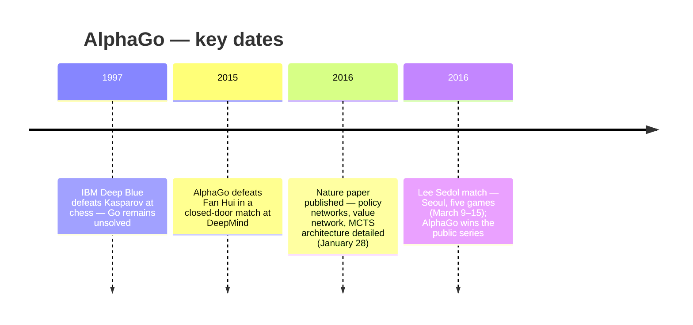

:::tip[In one paragraph]
In March 2016, Google DeepMind's AlphaGo defeated Lee Sedol — the best Go player of the prior decade — in Seoul, arriving roughly a decade before experts had predicted. The system won not by brute force but by combining learned judgment with Monte Carlo tree search. The result corrected a persistent myth: crossing a hard AI threshold required learning to guide search, not a choice between them.
:::

<strong>Cast of characters</strong>

| Name | Lifespan | Role |
|---|---|---|
| David Silver | — | Lead AlphaGo researcher and co-corresponding author of the *Nature* paper |
| Demis Hassabis | — | DeepMind CEO and co-founder; co-corresponding author; wrote the official Google announcements |
| Aja Huang | — | AlphaGo co-author; placed AlphaGo's moves on the physical board during the Lee Sedol match |
| Lee Sedol | — | Korean 9-dan professional; Google's designated opponent in the public Seoul match |
| Fan Hui | — | Reigning three-time European Go champion; AlphaGo's closed-door professional full-board threshold opponent |
| Michael Redmond | — | 9-dan professional commentator for the English-language match broadcast |

<strong>Timeline (1997–2016)</strong>

<strong>Plain-words glossary</strong>

**Monte Carlo tree search (MCTS)** — A search method that samples possible futures and spends more attention on lines that look promising.

**Policy network** — A neural network trained to estimate which moves are worth considering from a given board position.

**Value network** — A neural network trained to estimate which player is more likely to win from a given board position.

**Self-play reinforcement learning** — Training in which a system plays games against itself, updating its parameters based on wins and losses rather than imitation of human examples.

**Komi** — A fixed points bonus given to the second player in Go to compensate for the first-move advantage; the Lee Sedol match used 7.5-point komi under Chinese rules.

**Elo rating** — A numerical measure of relative playing strength, used here to compare AlphaGo configurations against each other and against human players.

**Byoyomi** — A Japanese overtime system used in Go tournaments; once a player's main time expires, each remaining move must be completed within a fixed period (60 seconds in the Lee Sedol match).

# The Board That Broke Brute Force

The game of Go presents an apparent simplicity that belies one of the most formidable computational challenges in the history of artificial intelligence. Played on a board of nineteen intersecting horizontal and vertical lines, the game requires two players to take turns placing black and white stones to surround and capture territory. That premise is so elementary that the rules can be learned in minutes. Yet for decades, the 19-by-19 grid remained a frontier where the methods that had conquered other classic games consistently broke down. 

When IBM's Deep Blue defeated Garry Kasparov in 1997, the triumph relied heavily on exhaustive search and specialized hardware. In games like chess, checkers, and Othello, a computer could successfully evaluate positions by applying move pruning and relying on material advantages, looking ahead through a game tree with a manageable branching factor. However, the mathematics of Go shattered that approach. According to the foundational *Nature* paper published by Google DeepMind researchers in early 2016, a game of chess presents a branching factor—or breadth—of approximately 35 legal moves per turn, with a typical game depth of about 80 moves. In Go, the breadth expands to approximately 250 legal moves per turn, with a game depth of roughly 150 moves. 

The rough shape of the problem can be written as a search tree of about `b^d`, where `b` is the number of plausible branches at each turn and `d` is the depth of the game. That compact expression hides an explosion. A chess program could not enumerate every possible game either, but good search procedures and evaluation rules could cut away enough of the tree to make a machine formidable. Go left far less room for that kind of compression. Each stone might be locally quiet and strategically loud, changing the value of a group or a territorial boundary only after a sequence elsewhere on the board had matured. A move that seemed slack at move 37 could become a lever at move 150.

Exhaustive search at that scale is computationally infeasible. In its public launch announcements, Google framed the complexity by noting that the game possesses more legal board positions than there are atoms in the observable universe. Go was widely considered to be a game played by intuition and feel, and DeepMind stated plainly that traditional search-tree methods simply did not have a chance. 

The strategies that yielded prior game-playing AI successes generally operated by reducing the search depth through position evaluation or reducing the search breadth through specific move policies. That recipe had worked effectively in other domain spaces, but it was widely believed to be intractable in Go. The challenge lay in the fact that evaluating a Go board programmatically was notoriously difficult; a single stone's placement might subtly influence a battle on the opposite side of the board dozens of turns later. In chess, even a crude material count gives a machine something stable to begin with. In Go, counting stones tells little by itself. Shape, influence, liberties, unsettled groups, and territorial potential matter, and many of those quantities change meaning as the game evolves.

Before AlphaGo, the strongest computer Go programs had achieved only strong amateur play. These preceding systems relied primarily on Monte Carlo tree search (MCTS), a technique that evaluates positions by simulating random games, or rollouts, to their conclusion, enhanced by policies trained on human expert moves. MCTS was already an important break from older brute-force expectations: rather than trying to evaluate every continuation, it repeatedly sampled possible futures and concentrated search where earlier samples looked promising. But without a strong way to judge which Go moves deserved attention and which positions were truly favorable, the sampling still wandered too broadly. It could make computer Go respectable, but it did not make it elite. Reaching the level of a professional on a full-sized board seemed, by many estimates, at least a decade away.

That was the state of the problem AlphaGo inherited. The old opposition between "search" and "intuition" was misleading, but it captured a real technical gap. Human experts could prune the board almost without noticing, ignoring hundreds of legal moves because years of practice had taught them which shapes were urgent and which were empty. Machines could search tirelessly, but their tirelessness was wasted if they searched the wrong parts of the board or misread the value of what they found. AlphaGo's central move was to give search learned judgment.

# Policy, Value, Search

AlphaGo changed the paradigm not by abandoning search, but by redefining how the search was guided. Rather than treating the board as a collection of isolated pieces with intrinsic values, the system treated the Go board as a 19-by-19 image, passing the position through deep convolutional neural networks. This architectural shift mattered because a convolutional network could learn spatial patterns across the board: local formations, liberties, tactical pressure, and wider structures could all become features in a learned representation. AlphaGo did not need a programmer to specify every strategic category by hand before the search began.

The architecture relied on two primary types of neural networks. The policy network was designed to reduce the breadth of the search by selecting the most promising moves, while the value network was designed to reduce the depth by evaluating the strength of board positions without needing to play them out to the end. Together they attacked the two points at which Go had defeated earlier systems. The policy network answered, in effect, "Where should the search look first?" The value network answered, "If the search reaches this position, how good does it appear without finishing the whole game?" Search still mattered, but it was no longer blind.

To build this foundation, the DeepMind team first created a supervised learning policy network, training it to imitate human play. They fed a 13-layer policy network approximately 30 million board positions drawn from the KGS Go Server; specifically, the methods relied on 29.4 million positions extracted from 160,000 games played by high-level 6- to 9-dan human players. The supervised policy network achieved an expert-move prediction accuracy of 57.0 percent using all its input features. That number was not a claim of perfect Go understanding. It meant that, when shown positions from expert games, the network could often place substantial probability on the move a strong human had actually chosen. For a search system, that was enough to be useful: even imperfect move probabilities could suppress the vast majority of legal but unpromising branches.

However, mere imitation could only elevate the system toward the level of the humans it was copying. To push beyond that limit, AlphaGo utilized reinforcement learning. The system played games against itself, applying policy-gradient reinforcement learning to improve its move selections. Through this self-play, the reinforcement learning policy was optimized not to match human examples, but to win. That distinction changed the role of the expert data. Human games gave AlphaGo a strong initial map of Go practice; self-play then let the system revise that map under the pressure of victory and defeat.

The results were stark: the new self-play policy won more than 80 percent of its games against the original supervised policy, and it won 85 percent of its games against the strongest open-source MCTS program, Pachi, even when AlphaGo used no search at all. That last condition is important. It showed that self-play had not merely helped the tree search choose between familiar options. The policy itself, stripped of the full search machinery, had become a stronger Go player than a leading open-source MCTS system. AlphaGo's later match strength came from recombining that learned policy with search, not from choosing between learning and search as rival explanations.

The final piece of the neural architecture was the value network. Trained on 30 million distinct positions generated during self-play, the value network learned to estimate the eventual winner from any given board state. This training set was distinct for a practical reason: if many nearly identical positions from the same game flooded the data, the network could overfit to a narrow cluster of examples rather than learning a broad position evaluator. The value network proved incredibly efficient: a single evaluation approached the accuracy of lengthy Monte Carlo rollouts, while using 15,000 times less computation.

The value network also changed the rhythm of search. A rollout asks, "What happens if we play this out to the end under a fast policy?" That can be useful, but it spends computation on complete imaginary games whose later moves may be noisy. A value estimate asks a sharper question: from this position, which player is more likely to win? It gave AlphaGo a way to stop before the end of the game tree and still carry back a learned estimate. In a domain where a full game could run to around 150 moves and each turn opened hundreds of legal choices, that shortcut was not cosmetic. It was one of the reasons the search could reach deeper into meaningful lines.

Ultimately, AlphaGo wrapped these learned judgments into a sophisticated Monte Carlo tree search. During the search, AlphaGo stored action values, visit counts, and prior probabilities for possible moves. The prior probability came from the policy network and biased the search toward moves the network considered promising. The visit count recorded how often a move had been explored. The action value summarized what the search had learned about the move's expected outcome. Leaf nodes in the game tree were evaluated by both the value network and by fast rollouts, and the final root move was selected based on the highest visit count generated during the search.

The procedure created a useful tension. The policy network could suggest where expert-like or self-play-hardened experience pointed. The value network could quickly judge positions without waiting for thousands of random endings. Rollouts added another estimate from simulated continuations. MCTS then adjudicated among these signals by spending more computation on lines that looked promising under search. AlphaGo was therefore not purely a deep learning system, nor was it purely a search engine; its breakthrough lay in the combination of advanced tree search and deep neural networks.

Developing this hybrid architecture required a massive team effort that extended far beyond a single inventor. As the *Nature* paper's author contributions detailed, the work was carefully divided. Researchers including Thore Graepel, Arthur Guez, Chris Maddison, Laurent Sifre, George van den Driessche, Julian Schrittwieser, Ioannis Antonoglou, Veda Panneershelvam, Marc Lanctot, Sander Dieleman, Dominik Grewe, John Nham, Nal Kalchbrenner, Ilya Sutskever, Timothy Lillicrap, Madeleine Leach, and Koray Kavukcuoglu worked alongside lead researcher David Silver, DeepMind CEO Demis Hassabis, and Aja Huang. Their responsibilities spanned search implementation, neural-network training, the evaluation framework, project management, and paper writing.

That division of labor is part of the technical story. AlphaGo was not a sudden trick discovered in a single program. It required people who could make search efficient, people who could train deep networks at scale, people who could design evaluation matches that exposed regressions, and people who could turn a research system into a tournament player. The system's public simplicity depended on a private accumulation of engineering decisions.

# The Hidden Machine

Behind the algorithmic pipeline lay a vast infrastructure of data and compute. The public demonstration would eventually look sparse: a Go board, two bowls of stones, Lee Sedol at the table, and Aja Huang serving as AlphaGo's physical interface. The system behind that scene had been built from millions of expert positions, millions more self-play positions, repeated evaluation matches, and large-scale compute. DeepMind's public launch account stated that the team made extensive use of Google Cloud Platform during training and experimentation, a reminder that AlphaGo's strength was not just a model architecture but an industrial research process.

The infrastructure also helps explain why AlphaGo should not be mistaken for a single neural network making instantaneous guesses. Training the policy and value networks required large stores of positions and repeated self-play. Testing required many games against earlier versions and against other programs. The search procedure itself could be scaled across hardware, because different parts of the tree and different simulations could be evaluated in parallel. The Go board remained fixed at 19 by 19, but the machine wrapped around it was elastic.

To test the scalability of their architecture, the researchers evaluated various hardware setups. According to the extended data tables published in *Nature*, a distributed version of AlphaGo operating in a tournament setting, allotted five seconds per move, utilized 1,202 CPUs and 176 GPUs to reach an Elo rating of 3140. The largest tested distributed configuration utilized 64 search threads, 1,920 CPUs, and 280 GPUs, reaching an Elo rating of 3168 when operating at two seconds per move. These figures confirm the immense computational scale that AlphaGo could leverage, but they do not establish the exact server deployment used in the later Seoul match. The careful phrasing matters because the hardware tables are evidence of AlphaGo's tested scale, not a published inventory of the live match machine.

The tables also show how AlphaGo's strength was measured operationally. The researchers varied time per move, search threads, CPUs, and GPUs, then reported ratings rather than simply listing hardware. That framing keeps the emphasis on performance under tournament-like constraints. More processors mattered only insofar as they let the search evaluate more useful parts of the tree within the time a real game allowed.

Before confronting the world's elite, the hidden machine needed a private rehearsal. In October 2015, AlphaGo faced Fan Hui, the reigning three-time European Go champion, in a closed-door match at DeepMind. Over five formal games in October 2015, AlphaGo defeated Fan Hui 5-0. It was a monumental achievement: the first time a computer program had defeated a professional Go player on the full-sized game under tournament conditions. The result did not make Fan Hui the same kind of public opponent Lee Sedol would become, and it did not settle Go as a whole. It did, however, move computer Go out of the realm of strong amateur systems and into professional match play.

Against other top computer Go programs of the era, AlphaGo's dominance was nearly absolute, winning 499 out of 500 games. That record made the Fan Hui match more than an isolated surprise. It suggested that the combination of supervised learning, self-play, value estimation, and MCTS was consistently stronger than the previous computer-Go field. With the Fan Hui milestone secured, Google announced the results in January 2016, immediately setting the stage for a globally visible public test.

The January announcement also shaped how the public would understand the next match. Google could present Fan Hui as the first professional full-board threshold and Lee Sedol as the far more demanding public test. That distinction prevented the story from collapsing into a single "human versus machine" headline. Fan Hui showed that AlphaGo had entered professional territory. Lee would show whether it could survive sustained scrutiny against an elite player whose reputation made every move in the series visible far beyond the computer-Go community.

# Seoul And Move 37

The ultimate challenge was scheduled in Seoul, South Korea, across five games on March 9, 10, 12, 13, and 15, 2016. The opponent was Lee Sedol, a 9-dan professional whom Google described as the best Go player of the prior decade. The match operated under Chinese rules with a 7.5-point komi (a scoring compensation for the second player). Each player was allotted two hours of main time, followed by three 60-second byoyomi overtime periods. A $1 million prize awaited the winner. 

Those rules were not incidental. Even games meant AlphaGo was not receiving a handicap. Komi meant White received 7.5 points to compensate for Black's first move. The two-hour main time gave both sides room for long strategic reading, while byoyomi created the familiar tournament pressure of making each overtime move inside a narrow window. The match was designed as a serious professional contest, not as a demonstration with softened conditions.

To ground the digital system in the physical space of the tournament room, DeepMind researcher Aja Huang sat across from Lee, transferring AlphaGo's moves to the physical board and inputting Lee's responses. The English-language broadcast featured commentary by 9-dan professional Michael Redmond and Chris Garlock, while Korean professionals including Yoo Changhyuk, Kim Seongryong, Song Taegon, and Lee Hyunwook provided local coverage.

The staging made the encounter legible to humans. Viewers did not watch a command line or a server rack. They watched Lee place stones against a human operator who was not choosing the moves. That separation gave the match a strange clarity. Huang's hand made AlphaGo present on the board, but the decisions came from a remote computational process whose internal evaluations were available only through the stones it selected and the clock time it consumed.

That arrangement also protected the rules of the encounter. Lee faced a board and an opponent's moves, not a shifting interface. AlphaGo's output had to become legal stones, one by one, under the same visible time pressure that governed the human player.

The series immediately upended expectations. In Game 1 on March 9, the players entered a complex fighting game. AlphaGo navigated the board's intricacies to claim the first victory, using almost all of its allocated time, while Lee finished the game with nearly 30 minutes left on his clock. The time usage mattered. It undercut the idea of an effortless machine sweep and showed AlphaGo behaving like a search system under pressure, spending its allotted resources to evaluate difficult positions.

Game 2, played on March 10, vaulted the match from a technical milestone into a broader cultural event. The official Google summary noted that the machine's creative moves surprised expert commentators, and both sides eventually entered byoyomi overtime. In Game 2, AlphaGo executed its 37th move, a play that flummoxed commentators and Lee Sedol alike. It was not an obvious tactical strike, and it did not fit the human sense of where a move of that stage should profitably be placed. To professional eyes, it initially looked inefficient, perhaps even mistaken. Lee Sedol left the room for a spell and took nearly fifteen minutes to formulate his response.

The episode is easy to overstate, so the mechanics matter. Move 37 was not evidence that AlphaGo wanted to astonish its opponent, nor that it possessed a human psychological faculty hidden inside the search tree. David Silver later explained the anomaly in narrower terms. AlphaGo's human-move model gave that move a probability of roughly one in ten thousand; a human expert, judged by the supervised policy trained on human games, was exceedingly unlikely to choose it. But AlphaGo was no longer only imitating human games. Its value network and MCTS search evaluated the position differently, assigning promise to a move that the human imitation layer treated as remote.

Yet as the game progressed, the move projected influence across the board and became central to AlphaGo's eventual 2-0 lead. What looked inefficient at first became legible afterward. That reversal is why Move 37 became the symbolic play of the match. It compressed the technical story into one stone: supervised learning knew that humans almost never played there, self-play had helped move AlphaGo beyond imitation, and search made room for the system to spend attention outside the habits of professional practice. The result was not mystical. It was stranger and more historically important than that: a statistical system had produced a move that experts initially found alien and later had to take seriously.

Game 2 also changed the emotional geometry of the series. After Game 1, AlphaGo could still be understood as a formidable surprise in a single complex fight. After Game 2, the question became whether Lee could find positions that exposed the system's limits. The match was no longer only testing whether AlphaGo could defeat a professional. Fan Hui had already supplied that milestone in private. Seoul was testing whether AlphaGo could withstand a public series against a player Google had presented as the strongest of the previous decade, under formal time controls, while expert commentators around the world tried to interpret each deviation from human expectation.

The pressure on interpretation was part of the spectacle. Human commentators could explain ordinary strong moves through established Go language: territory, influence, thickness, aji, attack, defense. Move 37 resisted that immediate translation. It was not that the move was beyond analysis forever; the point is that it first appeared to fall outside the professional pattern library that made live commentary possible. Only after the surrounding board developed did the move's force become easier to describe. In that delay between seeing and understanding, AlphaGo's technical difference became visible.

# The Human Reply And The Aftermath

AlphaGo pressed its advantage in Game 3 on March 12, winning its third straight game after 176 moves and officially securing the overall match victory. The remaining two games would still be played, but the competitive result was already decided. For observers, the sweep through the first three games threatened to frame the machine as an invincible entity, a story too simple for what the system actually was.

Game 4, played on March 13, provided the necessary human reply and kept the historical narrative honest. Lee Sedol found himself in a difficult position, but on his 78th turn he played a move that became the match's turning point. The play immediately disrupted AlphaGo's reading of the game. Google's own post-game account singled out Lee's Move 78 and AlphaGo's following Move 79 as the turning point: Lee found the resource, AlphaGo answered incorrectly, and its play deteriorated over the subsequent sequence. Lee Sedol won by resignation after 180 moves.

The Game 4 victory proved that AlphaGo was fallible. It underscored that the system had not "solved" the game of Go in the mathematical sense of exhaustive perfection. It remained a statistical engine that could be driven into regions of the search space where its approximations failed. The point was not that Lee had restored the old hierarchy between human and machine. The final match result would say otherwise. The point was that AlphaGo's strength and AlphaGo's limits came from the same architecture. It was powerful because learned policies, value estimates, rollouts, and tree search could focus attention through a vast space. It was vulnerable when those approximations misread a rare position deeply enough that search compounded the error.

That is why Game 4 belongs at the center of the chapter rather than in a footnote. Without it, AlphaGo's first three wins could be flattened into a story of machine inevitability. With it, the match becomes more exact. Lee did not refute AlphaGo's achievement, but he did reveal that the system's judgment could break under the right pressure. His Move 78 stands beside AlphaGo's Move 37 as the match's other defining stone: one move showed the machine finding value where human habit did not look; the other showed a human finding a resource the machine failed to handle.

The match concluded on March 15 with Game 5, a marathon 280-move contest that AlphaGo won, establishing the final score at 4-1. True to its pre-match pledge, Google announced that the $1 million prize would be donated to UNICEF, STEM charities, and Go organizations. The result left two facts side by side. AlphaGo had defeated Lee Sedol decisively across the match, winning the first three games and the fifth. Lee had also shown, in the fourth, that human resistance could still locate a crack in the machine's reading.

AlphaGo's victory stood as a towering public milestone, arriving roughly a decade earlier than many had predicted. Its historical meaning was precise. It demonstrated that the combination of deep neural networks, self-play reinforcement learning, value estimation, and tree search could cross a boundary that had long resisted computation. It did not show that Go had been solved. It did not show that a neural system had acquired humanlike intuition. It did not establish a direct causal chain from one Seoul match to every later development in artificial intelligence. The more durable lesson was narrower and stronger: when learning changed the evaluation function and search changed where computation was spent, a machine could uncover strategies in a domain that had seemed to require human feel.

That narrower lesson pointed directly to the next research question. AlphaGo had begun with expert human games from KGS, then improved through self-play. If expert data could seed the system, could a later system remove that seed and still become stronger through self-play alone? That question belongs to the next stage of the story. For AlphaGo itself, the decisive achievement was already clear by March 15, 2016: a hybrid of learned policy, learned value, large-scale computation, and Monte Carlo tree search had crossed the professional Go threshold in public, one stone at a time. (See Chapter 49).

:::note[Why this still matters today]
The AlphaGo architecture established that combining learned evaluation with classical search outperforms either technique alone — a pattern that recurs across modern systems. Policy networks that rank candidates before a search runs underpin today's game-playing, planning, and code-generation agents. Value networks that short-circuit full rollouts appear in contemporary model-based reinforcement learning. Self-play, used to push AlphaGo beyond human imitation, drives training regimes in robotics and strategic reasoning today. The 2016 result demonstrated that crossing a domain threshold requires not a single breakthrough but an engineered combination of representation, learning, and search.
:::
