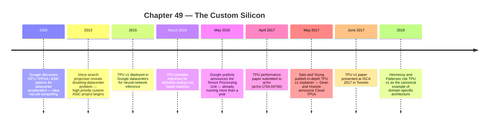
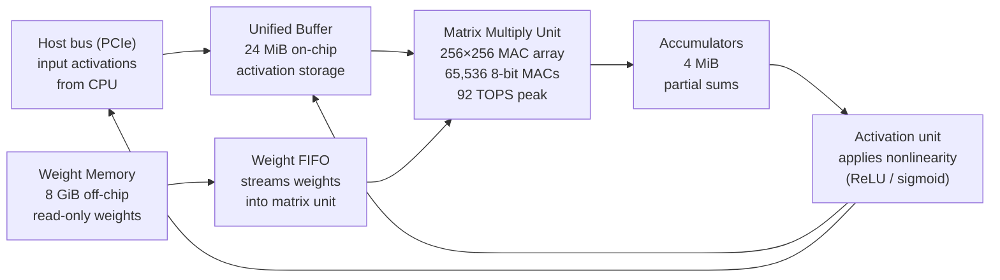

:::tip[In one paragraph]
In 2013 a single projection forced Google's hardware decision: three minutes of daily voice search per user would require doubling the company's entire datacenter capacity under conventional CPUs. The answer was the Tensor Processing Unit — a custom ASIC for 8-bit matrix arithmetic, built and deployed in fifteen months, running in production a year before its 2016 announcement. TPU v1 delivered 15–30x the speed and 30–80x the performance-per-watt of contemporary CPUs and GPUs across Google's six dominant inference workloads.
:::

<strong>Cast of characters</strong>

| Name | Lifespan | Role |
|---|---|---|
| Norman P. Jouppi | — | Google Fellow; TPU project technical lead; MIPS-era computer architect; first author of the 2017 ISCA paper |
| Cliff Young | — | Google Brain software engineer; co-author of the 2017 TPU paper and the 2017 public explainer |
| David Patterson | 1947– | Computer architect; UC Berkeley / Google; co-author of the TPU paper and the 2019 CACM domain-specific-architecture argument |
| Jeff Dean | — | Google research leader; TPU paper co-author; co-author of the 2017 Cloud TPU announcement |
| Urs Hoelzle | — | Google Cloud infrastructure leader; co-author of the 2017 Cloud TPU announcement |
| John Hennessy | 1952– | Computer scientist; co-authored the 2019 CACM framing of TPU v1 as a prime example of domain-specific architecture |

<strong>Timeline (2006–2019)</strong>

<strong>Plain-words glossary</strong>

**ASIC (Application-Specific Integrated Circuit)** — A chip designed to do one specific job rather than general computation. TPU v1 is an ASIC for neural-network inference; unlike a CPU or GPU it cannot easily be repurposed for unrelated work.

**Systolic array** — A grid of arithmetic units where data flows through in coordinated waves, each cell performing a multiply-add as values pass through, rather than each cell fetching its own data from a central store. The name comes from the rhythmic pumping motion, like a heartbeat.

**Quantization** — Compressing a trained model's weights from 32-bit floating-point numbers down to narrower integers (often 8-bit). Inference tolerates this loss of precision; the payoff is that 8-bit arithmetic units are far smaller and cheaper in power than 32-bit ones.

**Inference** — Using an already-trained neural network to answer a question (classify an image, translate a sentence, rank a search result). Contrasts with training, which adjusts the weights. TPU v1 was built solely for inference.

**Performance-per-watt** — A datacenter's practical measure of efficiency: how much useful computation fits within a fixed power and cooling budget. TPU v1's 30–80x advantage over contemporaries meant the same inference load required far less electricity and heat.

**PCIe coprocessor** — A chip that plugs into a server's PCI Express slot, augmenting but not replacing the host CPU. TPU v1 used this form factor so it could enter Google's existing rack infrastructure without rebuilding it.

**Domain-specific architecture (DSA)** — A processor tailored to one application domain (neural networks, signal processing, genomics) rather than general code. Hennessy and Patterson argued in 2019 that DSAs are the primary path to performance gains now that Moore's Law scaling has slowed.

<strong>Architecture sketch</strong>

Weights and activations enter the matrix unit from opposite sides and meet inside the 256×256 systolic grid; the accumulators catch results as each diagonal wave completes. The host bus serves as both input source and output sink, keeping the TPU's role narrow: receive a tensor, multiply it by stored weights, return the result.

By 2013, deep neural networks were no longer just academic experiments or isolated research projects inside Google; they were producing measurable, significant gains in the company's core services. The technology had already yielded a reported thirty percent reduction in word-error rates for speech recognition and was driving sharp improvements in image recognition. But embedding these models into products used by billions of people fundamentally changed the hardware question. The computationally intensive work of deep learning was splitting into two distinct phases: training, the computationally massive but intermittent process of teaching a model; and inference, the continuous, millisecond-by-millisecond work of using that trained model to serve user requests in production.

That split mattered because the two jobs stressed machines differently. Training could be scheduled as a large internal computation. It consumed floating-point arithmetic, moved through large batches, and could tolerate the rhythms of an offline job. Inference had to answer people. It was a service obligation: a voice query, a translation request, an image classification, or a search ranking operation entered the datacenter and had to come back quickly enough to feel interactive. Once neural networks became part of the request path, every improvement in model quality carried a shadow bill in server cycles, power, cooling, and latency.

Google had been discussing the potential need for special hardware acceleration—whether through graphics processing units (GPUs), field-programmable gate arrays (FPGAs), or custom application-specific integrated circuits (ASICs)—as early as 2006. Initially, however, the company found too few specialized applications to justify the immense cost and complexity of deploying dedicated hardware across its massive server fleet. 

The earlier hesitation is important. Specialized chips are not free speed. They bring their own design risk, software burden, procurement problem, and operational complexity. A large cloud operator can lose the benefit of a faster device if it is difficult to program, awkward to deploy, or useful to only one narrow service. In 2006, the balance did not yet favor special-purpose hardware at Google scale. Conventional servers still looked broad enough, and the set of accelerated applications was too thin to justify turning the datacenter into a collection of custom islands.

The turning point was an economic and physical projection, not just a desire for speed. In 2013, engineers modeled a scenario in which users spoke to Google's voice search for just three minutes per day, supported by the new deep neural network speech-recognition models. If Google attempted to serve that seemingly modest daily workload using the conventional central processing units (CPUs) that populated its server racks, the computational demands would require the company to double its entire datacenter capacity. Doubling the physical footprint, the power draw, and the cooling infrastructure of one of the world's largest computer networks would be prohibitively expensive.

The number was stark because the usage assumption was not extravagant. Three minutes of speech per user per day was an ordinary consumer behavior, not a laboratory stress test. The issue was multiplication across scale. A speech recognizer that was reasonable for a research demonstration could become punishing when placed behind an always-available product. The datacenter did not care that a single inference looked small. It cared that the same matrix-heavy computation would have to be repeated across enormous numbers of requests, with little room to hide behind long queues or overnight scheduling.

This projection made the problem urgent. While off-the-shelf GPUs remained highly effective for the floating-point-heavy work of training models, the economics of inference demanded something radically different. In response, Google initiated a high-priority project to design a custom ASIC specifically for neural-network inference. They set an aggressive target: a tenfold improvement in cost-performance over contemporary GPUs. The mandate was clear—narrow the machine around the exact mathematical operations required for inference, and do it fast. 

The decision did not make GPUs irrelevant. It clarified their role. During the first TPU project, Google still bought off-the-shelf GPUs for training, where flexible floating-point throughput remained useful. TPU v1 attacked a different bottleneck: the repetitive execution of already-trained networks inside production services. In that setting, arithmetic precision, memory movement, and response-time guarantees could be traded against general-purpose flexibility. The question was no longer whether a chip could run many kinds of code. It was whether a chip could run one family of computations so efficiently that a service could absorb neural networks without absorbing a second datacenter footprint.

The result of this effort was the Tensor Processing Unit (TPU). Rather than a theoretical blueprint, the TPU was a physical artifact built for immediate deployment. From the beginning of the project to the moment the first tested silicon was running applications at speed in Google datacenters, the engineering sprint took only fifteen months.

The project was not a tidy lone-inventor story. The 2017 performance paper listed seventy-five authors, a sign of the scale required to move from model arithmetic to production hardware. Norman Jouppi, later identified by Google as the TPU project's technical lead, brought a computer-architecture background that reached back to the MIPS era. Cliff Young, David Patterson, Jeff Dean, and many others appear through the paper, the software stack, and the later public explanations. The human scale is therefore less a private drama than a coordinated engineering act: architecture, compiler/runtime work, datacenter integration, and application teams converging around a single inference bottleneck.

By 2015, the TPU v1 was actively deployed within Google datacenters, quietly accelerating neural-network inference behind the scenes. When Google publicly announced the chip in May 2016, the company revealed that the custom ASIC had already been running in its production datacenters for more than a year. 

Crucially, the TPU was not designed as a standalone supercomputer or a massive, tightly integrated mainframe. It was built as infrastructure that could slip seamlessly into Google's existing server environment. The hardware was packaged as a coprocessor on a PCIe bus, allowing it to plug into standard servers. The board itself was remarkably compact, designed to slide directly into an existing SATA hard-disk-drive slot in standard datacenter racks. This form factor meant that Google could upgrade its inference capacity without tearing out and replacing the racks, networking, and cooling systems it already had. 

That packaging choice tells much of the story. A custom chip that required new buildings or a wholly new server architecture would have solved one problem by creating another. TPU v1 instead entered the datacenter as an accelerator card. The host machine remained responsible for the rest of the application; the TPU handled the dense neural-network operation sent to it. This let Google insert a new arithmetic engine into an existing operational world of servers, racks, power distribution, disks, and network links. The machine was radical in what it computed, but conservative in how it was installed.

The first-silicon milestone reinforced that infrastructure discipline. Google's public account said that once the team received tested silicon, it had applications running at speed in datacenters within twenty-two days. This was narrower than a polished commercial rollout or a disclosure of deployed board counts, but still revealing: the chip, board, host interface, and software stack had been designed so the first working parts could be placed into real service quickly. The value of the ASIC depended on that kind of fit. A theoretical accelerator sitting outside the production system would not have answered the 2013 capacity problem.

The hardware was tightly coupled with software. The TPU was explicitly tailored for TensorFlow, Google's machine learning framework. Software compatibility had to be maintained with existing CPU and GPU stacks; consequently, portions of the TensorFlow framework were compiled into application programming interfaces that could dynamically run on either GPUs or TPUs.

This compatibility layer was as important as the silicon. A narrow accelerator becomes useful only if programmers can reach it without hand-translating every model into chip-specific commands. TPU v1 therefore sat under a software path that could preserve the existing CPU and GPU environment while dispatching suitable work to the new device. The host sent instructions across the I/O bus; kernel and user-space components mediated the interaction; TensorFlow exposed the accelerator as part of the machine-learning stack rather than as a separate machine with its own culture. The TPU was custom hardware, but it had to behave like production infrastructure.

By the time of its 2016 public unveiling, machine learning was being used by more than a hundred teams internally at Google. The TPU was actively powering some of the company's highest-profile and most demanding services. It accelerated RankBrain, the machine learning system helping to process search results. It handled the massive image processing required by Street View. And in March 2016, it provided the inference horsepower for AlphaGo during its historic matches against Lee Sedol. The TPU was not a generic computing platform; it was an industrial tool designed to absorb the specific computational shocks of Google's transition to deep learning.

Those examples should not be read as a map of every chip in every rack. They show the variety of inference pressure that was arriving at once. Search ranking, street-level imagery, speech and language applications, and a public Go demonstration differed in product purpose, but they shared a dependence on large numbers of multiply-add operations. The TPU made sense because these services were not isolated curiosities. They were signs that neural networks were becoming a common production substrate inside Google.

To understand why the TPU was so efficient, one must look at the mathematical reality of neural-network inference. Inference largely consists of repeated, predictable matrix multiplications. Furthermore, researchers had discovered that while training required the high precision of 32-bit floating-point numbers to calculate tiny gradients, inference did not. Through a process called quantization, floating-point values could be converted into narrow integers—often 8-bit—while remaining accurate enough for production predictions. These 8-bit operations are vastly cheaper in terms of silicon area and energy consumption.

The simplification is easy to understate. A neural network stores learned weights. At inference time, incoming data is transformed layer by layer, with each layer applying those weights and passing the result onward. If the trained model can tolerate 8-bit integer arithmetic for that forward pass, the hardware can devote far less area to each arithmetic unit than a general floating-point processor would require. Smaller arithmetic units mean more of them can fit on the chip, and each operation can consume less energy. The gain is not magic; it comes from refusing to carry precision and flexibility that the deployed workload does not need.

The heart of the TPU v1 was built around this insight. Its primary calculation engine was the Matrix Multiply Unit, a massive structure containing a 256-by-256 array of multiply-accumulate (MAC) units. This grid could perform 65,536 8-bit multiply-and-add operations on signed or unsigned integers every single clock cycle. It was a machine relentlessly narrowed to perform one specific mathematical chore at extraordinary scale.

Each multiply-accumulate unit performed the basic operation at the center of a matrix product: multiply an input value by a weight, add the result to a running sum, and pass the partial result onward. Replicated 65,536 times, that modest operation became a wall of arithmetic. The matrix unit produced a peak figure of 92 trillion operations per second, but the more important point was the match between the operation and the workload. Instead of taking a general processor and asking it to imitate a matrix engine through layers of instruction scheduling and cache behavior, TPU v1 made the matrix engine the dominant physical structure of the chip.

Feeding a calculation engine of this size presented a severe memory-bandwidth challenge. If the chip had to reach out to memory for every single number it calculated, the communication delay would instantly negate the speed of the matrix unit. The TPU solved this through systolic execution. In a systolic array, data and weights do not sit static while processors reach out to them. Instead, they flow through the 256-cell dimension in coordinated, diagonal wavefronts. Weights are loaded from the top, data activations arrive from the left, and the computational results move in a steady wave through the array. This systolic dataflow drastically reduces the need to repeatedly read and write to the chip's internal buffers. 

The name "systolic" evokes a pulse because the array works by rhythm. Values move from one cell to the next, and each cell performs its multiply-add at the right moment as the wave passes through. The design does not eliminate memory traffic; weights and activations still have to be loaded, and results still have to be stored. What it reduces is wasteful repetition. Once data has entered the array, many neighboring compute cells can use it as it travels, rather than forcing each cell to fetch its own copy from a central buffer. For a chip whose arithmetic engine is much larger than the control machinery around it, that reduction in data movement is central to the power story.

The rhythm also explains why the chip's peak arithmetic rate was not simply a matter of clock speed. The Matrix Multiply Unit advanced a large block of related work in a disciplined pattern. When the inputs matched the array well, the chip could keep many thousands of MAC units active at once and emit a new vector of accumulated results as the wave moved through. When the inputs did not match as neatly, or when weights arrived too slowly, the same rigid structure became less fully used. TPU v1 gained power from regularity, and regularity always came with a question: can the model and software present work in the shape the machine expects?

The memory architecture surrounding this matrix unit was highly specialized. The chip featured 24 megabytes of on-chip Unified Buffer to hold intermediate activations, 4 megabytes of accumulators positioned directly below the matrix unit to catch the results, and 8 gigabytes of off-chip Weight Memory dedicated exclusively to holding read-only inference weights. 

This split reflected the asymmetry of inference. The learned weights were large and comparatively stable: once a trained model was loaded, those weights could be treated as read-only values used again and again. Intermediate activations were smaller, more transient, and needed to remain close to the matrix unit while the layers of the model executed. The accumulators sat directly under the arithmetic array because partial sums are the immediate product of matrix multiplication. Taken together, the 24 megabytes of Unified Buffer and 4 megabytes of accumulators explain the often-cited 28-megabyte on-chip memory figure, but the internal division matters because each region served a different dataflow role.

Because the TPU was designed solely to execute these dense matrix operations, its instruction set could be stripped down to the bare essentials. The TPU utilized about a dozen Complex Instruction Set Computer (CISC) style instructions. The key operations were limited to reading and writing to host memory, reading weights, initiating matrix multiplications or convolutions, and applying activation functions.

This made the TPU programmable in a narrow sense. It was not a fixed-function chip that could run only one model, but neither was it a general-purpose processor waiting for arbitrary software. Its instructions described the recurring movements of neural-network inference: bring data from the host, bring weights into place, run a matrix multiplication or convolution, apply the nonlinearity that keeps a neural network from collapsing into one linear transform, and write the results back. The instruction set was a vocabulary for a small family of verbs, chosen because those verbs covered the production workloads Google cared about.

This intense specialization came at the cost of generality. Modern CPUs and GPUs devote vast amounts of silicon real estate to features designed to handle unpredictable code: caches, branch prediction, out-of-order execution, speculative prefetching, address coalescing, multithreading, and context switching. The single-threaded TPU deliberately omitted all of these sophisticated microarchitectural features. It traded the flexibility of a general-purpose processor for the dense, deterministic execution of matrix math.

The omissions were not merely about saving transistors. They also made timing easier to reason about. Caches and speculative execution can improve average performance, but they can also create long-tail surprises when a prediction fails or a memory access misses. A service that promises interactive response time cares about those tails. TPU v1's simplicity made it less adaptable, but it also made its behavior more regular. That regularity joined low-precision arithmetic and systolic dataflow as part of the same design philosophy: remove what the workload does not need, then use the freed area and power budget for what it does.

The ultimate validation of the TPU's design was not peak theoretical speed, but its economic performance on real-world datacenter workloads. In 2017, the TPU engineering team published a comprehensive performance analysis. The benchmark suite they chose was a direct reflection of Google's business reality: six production neural-network inference applications—including multi-layer perceptrons (MLPs), long short-term memory networks (LSTMs), and convolutional neural networks (CNNs)—that together represented 95 percent of Google's TPU inference demand in datacenters at the time.

That workload mix matters because it kept the paper from being a synthetic victory lap. Multi-layer perceptrons, recurrent networks such as LSTMs, and convolutional networks stress an accelerator in different ways. Some are dominated by dense matrix products. Some have sequence behavior or convolutional structure. The table of applications also included public examples such as RankBrain, a subset of Google Neural Machine Translation, Inception, and AlphaGo, while leaving several workload identities anonymized. The benchmark was therefore both concrete and bounded: concrete because it came from production inference, bounded because the reported numbers belonged to this suite rather than to every possible neural network.

The anonymization is itself a useful reminder. Google was willing to publish the architecture, broad workload classes, latency constraints, and comparative results, but not every product mapping. That leaves the benchmark as an infrastructure portrait rather than a service-by-service disclosure. The reader can see the shape of the demand without being handed a complete inventory of Google's production systems. The essential fact is that the workloads were varied, large enough to dominate TPU inference demand, and bound to response-time rules rather than isolated laboratory throughput tests.

The paper compared the TPU against server-class Intel Haswell CPUs and Nvidia K80 GPUs, which were the contemporary chips deployed alongside the TPU in Google's datacenters. Across this suite of six production workloads, the TPU was, on average, 15 to 30 times faster than the contemporary CPU and GPU baselines. More importantly for datacenter economics, its performance per watt—a critical metric for power-constrained server farms—was roughly 30 to 80 times higher. 

Performance per watt is a blunt phrase for a physical constraint. In a datacenter, chips are not judged only by how many operations they can perform at peak. They are judged by how much work they can do within power delivery, cooling, floor space, and latency limits. A faster chip that burns too much power or sits idle because requests cannot be batched efficiently may be a poor infrastructure choice. The TPU result was therefore a business argument expressed as a computer-architecture result: if the same inference demand could be served with far better throughput per watt, neural networks could spread through products without proportional growth in conventional server capacity.

The comparison revealed a fundamental truth about production inference: user-facing applications emphasize strict response times over raw, peak throughput. A GPU might possess immense peak computational power, but if it requires batching thousands of requests together to reach that peak, the resulting delay is unacceptable for a user waiting for a voice-search result or a translated web page. 

The TPU's deterministic, minimalist architecture was designed to guarantee tight tail latencies. For one of the multi-layer perceptron benchmarks (anonymized as MLP0), the strict operational limit dictated that the 99th-percentile response time could not exceed 7 milliseconds. Operating right against that 7.0-millisecond latency ceiling, the TPU delivered 225,000 inferences per second. The chip's lack of complex caching and out-of-order execution meant its performance was predictable; it did not suffer from the sudden latency spikes that plague general-purpose processors when they mispredict a branch of code.

The MLP0 row shows why the TPU story is not captured by peak tera-operations alone. A production service is often designed around the slowest acceptable requests, not the average request under ideal conditions. The 99th percentile means that almost every request must fit under the response-time ceiling. Hardware that looks impressive only when it accumulates a very large batch can fail that test. TPU v1's advantage came from keeping the arithmetic units busy while preserving a small, predictable service time. It was designed less like a race car for benchmark headlines than like a component in a strict service-level system.

However, the architecture was not without its limitations. The engineering analysis candidly noted that four of the six benchmark applications were actually bottlenecked by memory bandwidth rather than compute power. The 8 gigabytes of off-chip Weight Memory could not always feed the massive matrix unit fast enough. The researchers calculated that a hypothetical TPU equipped with the faster GDDR5 memory found in the contemporary Nvidia K80 GPU would have substantially improved results for those memory-bound workloads, demonstrating that even a highly optimized ASIC faced physical tradeoffs.

That caveat keeps the machine in proportion. The TPU was not a perfect neural-network processor, and the paper did not present it as one. Its giant matrix unit could outrun the memory system on several workloads; in those cases, the chip's arithmetic capacity waited for weights rather than doing useful work. A different memory technology would have changed the balance. This is the lesson of specialization at close range: narrowing a design can produce enormous gains, but it also exposes whichever part of the system was narrowed less aggressively. Compute, memory, software, and service latency had to be considered together.

The same analysis also made the FPGA comparison less simple than a generic "custom beats programmable" slogan. Field-programmable gate arrays offered flexibility and could be attractive when workloads changed or volumes were smaller, but the TPU paper emphasized the efficiency that came from committing the neural-network inference pattern to ASIC silicon. Google's decision in 2013 was therefore a bet on workload regularity and scale. The company had enough inference demand, and enough confidence in the recurrence of matrix-heavy models, to justify sacrificing reconfigurability for area and power efficiency.

The internal success of the TPU v1 proved that deep learning workloads had reached a scale where designing silicon from the bottom up—from the model math down through the compiler and into the datacenter racks—was a viable economic strategy. But the first-generation chip remained a specialized, internal tool focused exclusively on inference.

In May 2017, Google turned this internal infrastructure outward, announcing the second generation of Cloud TPUs. This marked a significant strategic hinge. The new devices were no longer limited to inference; they were engineered to accelerate both the training and the execution of machine learning models. Each second-generation device was capable of up to 180 teraflops of performance. Furthermore, Google designed them to be clustered. A single TPU pod contained 64 second-generation TPUs, delivering up to 11.5 petaflops of computational power.

The shift from TPU v1 to Cloud TPU should be read carefully. Google was not simply selling access to the first inference card. It was announcing a broader accelerator platform, now aimed at both phases of machine learning. Training returned to the center of the hardware story, and clustering became part of the public design language. The numbers in the announcement pointed toward larger shared systems rather than individual coprocessors hidden inside internal services.

Google did not position these new chips as a replacement for existing hardware. Through Google Compute Engine, Cloud TPUs were offered as a distinct primitive alongside standard Skylake CPUs and Nvidia GPUs, allowing cloud customers to mix and match the hardware best suited for their specific pipelines. To prime the research ecosystem, Google also announced the TensorFlow Research Cloud, promising to make 1,000 Cloud TPUs available at no cost to qualified machine-learning researchers.

That coexistence is the honest ending to the TPU v1 story. CPUs still ran the general application logic. GPUs still mattered, especially where training and flexible parallel computation were valuable. TPUs made a different claim: for an increasingly important class of neural-network computation, a cloud provider could design downward from the workload instead of upward from a general-purpose processor. The public cloud offering turned an internal inference lesson into a service primitive that outside researchers and customers could evaluate directly.

The creation of the TPU represented a broader shift in the technology industry. As computer architects John Hennessy and David Patterson later observed, the TPU v1 served as a prime example of a "domain-specific architecture." With the historical performance gains of general-purpose processors slowing down due to the physical limits of Moore's Law and Dennard scaling, the most promising path forward for massive computational leaps was specialization. The TPU demonstrated that by aggressively tailoring a chip to the specific domain of neural networks, a cloud provider could achieve order-of-magnitude improvements in cost and power efficiency. It established custom AI silicon not just as an internal optimization, but as a foundational strategy for the era of deep learning.

The deeper shift was conceptual. For decades, much of computing had benefited from broad processors becoming faster on a predictable curve. By the middle of the 2010s, that bargain had weakened. Neural networks were moving into production just as general-purpose scaling was becoming less generous. TPU v1 did not end the age of CPUs or GPUs, and it did not settle the future of AI hardware. It showed something narrower and more consequential for the next stage of the story: once models became infrastructure, the infrastructure itself had to learn the shape of the models.

:::note[Why this still matters today]
Every major cloud provider now offers custom AI silicon: Google's TPU line continues through v5, Amazon has Trainium and Inferentia, and Apple ships Neural Engines in its consumer chips. The TPU established the template — identify the bottleneck operation (matrix multiply), shrink arithmetic precision to what inference actually needs (8-bit integers), and design memory hierarchy around that single workload. The systolic-array principle is now embedded in edge devices, data-center accelerators, and open hardware research. The economics argument TPU v1 made in 2013 — that general-purpose processors could not absorb neural networks without proportional capacity growth — remains the primary driver of the custom-silicon industry today.
:::
