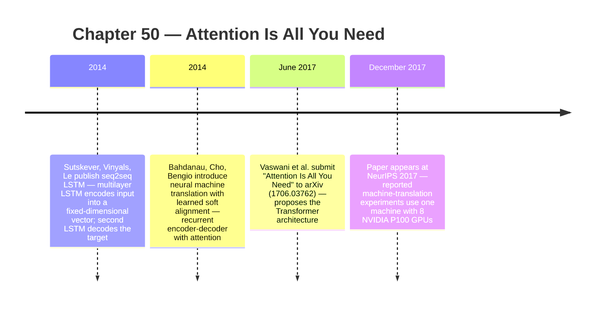
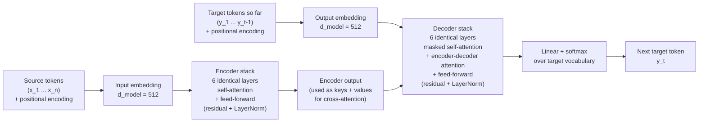

:::tip[In one paragraph]
In June 2017, Vaswani and seven Google co-authors proposed the Transformer: an encoder-decoder architecture that replaced the recurrent time-step dependency of LSTMs with stacked self-attention, feed-forward layers, residual paths, layer normalization, and positional encodings. Trained on one machine with 8 P100 GPUs, it reached 28.4 BLEU on WMT 2014 English-German translation. Attention was not new — Bahdanau et al. had introduced it in 2014 — but the Transformer made it the layer operation, freeing sequence models to scale on matrix-friendly hardware.
:::

<strong>Cast of characters</strong>

| Name | Lifespan | Role |
|---|---|---|
| Ashish Vaswani | — | Transformer co-author; the equal-contribution footnote credits him with co-designing and implementing the first Transformer models with Illia Polosukhin |
| Noam Shazeer | — | Transformer co-author; the footnote credits him with scaled dot-product attention, multi-head attention, and the parameter-free positional representation |
| Jakob Uszkoreit | — | Transformer co-author; the footnote credits him with proposing the replacement of RNNs with self-attention and starting the evaluation effort |
| Niki Parmar | — | Transformer co-author; the footnote credits her with designing, implementing, tuning, and evaluating model variants in the original codebase and Tensor2Tensor |
| Ilya Sutskever | 1986– | Co-author of the 2014 sequence-to-sequence LSTM paper that supplied the immediate recurrent encoder-decoder baseline |
| Dzmitry Bahdanau | — | Lead author of the 2014/2015 attention-with-alignment paper that supplied the pre-Transformer attention bridge |

<strong>Timeline (2014–2017)</strong>

<strong>Plain-words glossary</strong>

**Sequence transduction** — A learning task where an input sequence (a sentence, a phoneme stream) maps to an output sequence (a translation, a transcription). Translation is the canonical example. The Transformer paper places itself inside this older problem class rather than claiming a wholly new task.

**Recurrent neural network (RNN) / LSTM** — A model that processes a sequence one position at a time, carrying a hidden state forward across positions. The Long Short-Term Memory variant added gates that helped the state survive across longer sequences. The chapter's core complaint is not that LSTMs failed but that their per-position dependency limited how much of a layer's work could run in parallel.

**Attention (Bahdanau-style)** — A mechanism that lets a decoder consult the encoder's per-position annotations as it produces each output token, retrieving relevant source-side information instead of relying on one compressed vector. Predates the Transformer and runs inside a recurrent encoder-decoder.

**Self-attention** — Attention applied within a single sequence: every position attends to every other position in the same layer. The Transformer's distinctive substitution — self-attention replaces the recurrent step as the way representations flow across positions.

**Multi-head attention** — Running several scaled dot-product attention operations in parallel with different learned projections, then concatenating the outputs. Lets the model attend to information from different representation subspaces in the same layer.

**Positional encoding** — A signal added to the input embeddings to mark each token's position in the sequence. Because the Transformer removed recurrence and convolution, it needed an explicit order signal. The 2017 paper used sinusoidal encodings and reported similar results from learned positional embeddings.

**Autoregressive decoding (with masking)** — At generation time the decoder still produces one token at a time, conditioning on earlier outputs. During training, masking blocks each position from attending to later target positions so many positions can be processed in parallel without leaking the future.

<strong>The math, on demand</strong>

- **Scaled dot-product attention.** $\text{Attention}(Q, K, V) = \text{softmax}\!\left(\dfrac{Q K^{\top}}{\sqrt{d_k}}\right) V$ — queries $Q$, keys $K$, and values $V$ are matrices of projected token representations. The dot products score every query against every key, the softmax turns the scores into weights, and the weighted sum over values is the layer output. The $\sqrt{d_k}$ scaling keeps softmax gradients trainable as the key dimension grows. Source: Vaswani et al. 2017 §3.2.1.

- **Multi-head attention.** $\text{MultiHead}(Q, K, V) = \text{Concat}(\text{head}_1, \dots, \text{head}_h)\, W^{O}$, with each $\text{head}_i = \text{Attention}(Q W_i^{Q}, K W_i^{K}, V W_i^{V})$ — the model learns $h$ sets of projections, runs $h$ attention operations in parallel, and recombines them. The paper uses $h = 8$ in the base model so each head sees a slice of dimension $d_k = d_v = d_{model} / h = 64$. Source: Vaswani et al. 2017 §3.2.2.

- **Sinusoidal positional encoding.** $PE_{(pos, 2i)} = \sin\!\left(pos / 10000^{2i / d_{model}}\right)$ and $PE_{(pos, 2i+1)} = \cos\!\left(pos / 10000^{2i / d_{model}}\right)$ — each dimension is a sinusoid of geometrically growing wavelength. The motivation given in the paper is that the relative offset between two positions can be expressed as a linear function of the encodings, which the model may exploit to learn relative-position behaviour. Source: Vaswani et al. 2017 §3.5.

- **Per-layer complexity comparison (Table 1).** Self-attention runs in $O(n^2 \cdot d)$ per layer with $O(1)$ sequential operations and a maximum path length of $O(1)$ between any two positions; recurrent layers are $O(n \cdot d^2)$ per layer with $O(n)$ sequential operations and $O(n)$ path length; convolutional layers are $O(k \cdot n \cdot d^2)$ with $O(1)$ sequential operations but $O(\log_k n)$ or $O(n / k)$ path length depending on dilation. The Transformer trades quadratic sequence cost for short paths and short critical compute chains. Source: Vaswani et al. 2017 §4 / Table 1.

- **The trade, in one inequality.** For sequence length $n$ and representation dimension $d$, self-attention is cheaper than a recurrent layer when $n < d$ — i.e. the regime of typical 2017 translation. As $n$ grows, the $n^2$ term dominates and the trade flips, which is why long-context attention later became its own engineering subfield. Source: Vaswani et al. 2017 §4 (sentence-length caveat and "restricted self-attention" remark).

<strong>Architecture sketch</strong>

The encoder and decoder stacks each contain six identical layers; the decoder additionally takes the encoder output as the source of keys and values for one of its attention sub-layers. The mask on decoder self-attention prevents a target position from attending to later target positions, which is what keeps generation autoregressive even though many positions are processed in parallel during training.

The previous chapter ended with custom silicon. Google had learned that neural networks were no longer just models; they were workloads large enough to bend datacenter design. The Tensor Processing Unit narrowed hardware around the arithmetic of inference. But the next turn in artificial intelligence did not begin with a new chip. It began with a different way to arrange the computation inside the model itself.

By 2017, machine translation was one of the clearest places to see the pressure. Translation had a concrete input and output: a sentence in one language enters, a sentence in another language emerges. It also had a history of measurable benchmarks, public datasets, and high commercial value. If a model could translate better and train faster, the result was not an abstract gain. It touched search, mobile products, international communication, and the broader question of whether neural networks could handle language as more than a collection of short classification tasks.

Translation was also unforgiving in a way that made architecture visible. The system had to preserve meaning while changing word order, grammar, morphology, and idiom. A short source phrase could map to a longer target phrase. A word early in one language could determine a word much later in another. The model therefore had to carry information across distance, but it also had to produce output one token at a time. That combination made machine translation a natural stress test for the old sequential designs.

The dominant neural pattern for this work had been sequence-to-sequence learning. In the 2014 model by Ilya Sutskever, Oriol Vinyals, and Quoc Le, a multilayer LSTM read an input sequence and compressed it into a fixed-dimensional vector; a second LSTM decoded that representation into the target sentence. The model was powerful enough to compete on WMT 2014 translation, and the paper showed how much the field had already moved away from hand-built phrase tables and toward learned representations. But the shape of the computation still followed time. The recurrent network advanced through the source sentence one step at a time, carrying its hidden state forward.

That time-step dependency was not just a mathematical detail. It was an infrastructure constraint. A recurrent model can use accelerators, and the Sutskever paper itself describes parallelizing work across an 8-GPU machine because a single GPU was too slow. But inside a sequence, the hidden state at one position depends on the state before it. The model cannot compute every position in a layer independently in the same way it can compute a large matrix product. The sentence becomes a chain, and the chain limits how much training computation can be exposed to parallel hardware.

The chain had practical consequences. If a model has to process position 17 before it can fully process position 18, the hardware cannot simply spread all positions of that layer across a large accelerator and finish them at once. It can parallelize across examples in a batch, across layers, or across pieces of the computation, but the recurrent dependency remains in the core loop. As datasets and models grew, that dependency became more expensive. More data did not automatically mean proportionally better hardware utilization. A larger training run could still be throttled by the order in which the model had to move through each sequence.

The problem was especially awkward because translation needed both local detail and long-range structure. A word near the end of a sentence might depend on a phrase near the beginning. A verb might be resolved only after the model has seen its object. A fixed vector representation asked the encoder to pack the entire source sentence into one state for the decoder to use. That was a remarkable trick when it worked, but it also created a narrow channel through which all the source-side information had to pass.

Sutskever's team found an empirical trick that helped: reversing the order of the source sentence. In the paper's explanation, reversing the source did not change the average distance between corresponding words, but it greatly reduced the minimal time lag because the first few source and target words ended up close together. That made optimization easier. The result is worth treating respectfully. It was not a hack in the dismissive sense. It was a sign that the geometry of paths through the model mattered. If changing the order of the input improved learning, then the model's route through a sentence was part of the engineering problem, not a neutral implementation detail.

The first major loosening of that bottleneck was attention. Dzmitry Bahdanau, Kyunghyun Cho, and Yoshua Bengio framed the problem directly: conventional encoder-decoder models encoded a whole source sentence into a fixed-length vector, and that could become difficult for long sentences. Their model learned to align and translate jointly. Instead of relying only on one compressed vector, the decoder could look back over source-side annotations and retrieve relevant information as it produced each output word.

This matters for the history because attention was not invented by the Transformer. It was already part of neural machine translation before 2017. Bahdanau attention changed the decoder's relationship to the source sentence. It made translation less like passing one sealed message from encoder to decoder and more like giving the decoder a way to consult the source as needed. The model learned soft alignments: not a hard dictionary lookup, but a weighted focus over source positions.

That was a deep conceptual move. It let the model treat source positions as an accessible memory, and it made the model's behavior easier to inspect than a single hidden vector. But it still lived inside a recurrent encoder-decoder system. The decoder still advanced through the target sentence step by step. The encoder still came from a family of models whose computation was aligned with sequence positions. Attention weakened the fixed-vector bottleneck, but it did not remove recurrence as the central organizing structure.

This is the distinction the later mythology often blurs. Bahdanau attention gave the decoder a way to ask, at each step, which source positions mattered for the current target word. The Transformer took the more radical step of asking whether attention could become the main mechanism for representing the sequence itself. It was no longer merely a lookup aid attached to a recurrent decoder. It became the layer operation through which positions related to other positions.

The Transformer paper, "Attention Is All You Need," begins from exactly that tension. It does not present the world as if neural translation had been primitive before 2017. It names the established recurrent approaches, including LSTMs and gated recurrent units, and then identifies their cost: recurrent models factor computation along the positions of the input and output sequences. That inherently sequential computation precludes parallelization within training examples. The word "precludes" is important. The problem was not that recurrent networks could never run on GPUs. The problem was that the dependency structure inside a layer forced the model to march along the sentence.

There was also a convolutional detour before the attention-only answer. The Transformer paper names Extended Neural GPU, ByteNet, and ConvS2S as attempts to reduce sequential computation through convolutional architectures. This middle path matters because it prevents the false story that the field had only two choices: old recurrent models or sudden attention. Convolutions could compute hidden representations in parallel across positions. They had already shown that sequence modeling could be made less sequential.

But convolutions brought their own cost. A convolution sees local neighborhoods directly. To connect distant positions, the model needs multiple layers or wider kernels. The path between two far-apart positions can become longer than in an attention layer, where any position can attend directly to any other position in the same layer. The Transformer paper's Table 1 turns this into a compact engineering comparison: self-attention, recurrent layers, and convolutional layers differ in computational complexity, sequential operations, and maximum path length.

The convolutional scene also prevents another false story: that the Transformer was simply a rejection of all prior structure. In truth, the paper reads like a careful accounting of alternatives. Recurrent layers had a strong tradition and useful inductive bias for sequences, but a sequential bottleneck. Convolutional sequence models offered parallel computation, but distant dependencies had to travel through multiple layers. Attention offered direct paths between positions, but at the price of all-pairs comparison. The historical importance of the Transformer lies in choosing that third bargain and showing that it worked.

That table is one of the cleanest receipts in the history of modern AI. It shows why the Transformer was not merely an intuition about "looking at all words." The model traded one computational geometry for another. Recurrent layers had a sequential operation count that grew with sequence length. Self-attention had a constant number of sequential operations per layer. In exchange, self-attention paid a per-layer complexity cost that grew quadratically with sequence length. The architecture bought parallelism and short paths by accepting a different scaling problem.

The 2017 proposal kept the broad encoder-decoder frame. It did not abandon sequence transduction. It replaced the machinery inside the frame. The encoder became a stack of identical layers. Each layer contained multi-head self-attention and a position-wise feed-forward network, wrapped with residual connections and layer normalization. The decoder used a similar stack, but added a second attention block that attended over the encoder output. It also used masking so that a target position could not attend to later target positions.

That mask is a load-bearing detail. It blocks a common simplification: the Transformer did not generate a whole sentence in one unconstrained simultaneous step. During training, the model could process many positions in parallel under a mask, but the decoder remained autoregressive. It predicted the next token using earlier target positions, not future ones. At generation time, output still proceeded token by token. The architectural break was not "all language at once." It was the removal of recurrence inside the layer computation, combined with masking to preserve the causal structure of decoding.

The encoder side and decoder side therefore did different jobs. Encoder self-attention could let every source position interact with every other source position. Decoder self-attention had to respect the left-to-right target history. Encoder-decoder attention then let the decoder consult the source representation as it generated the target. This kept the translation frame recognizable while changing the internal mechanics. The model still had an encoder, a decoder, and a target sequence. What changed was the route by which information moved inside those components.

The central operation was scaled dot-product attention. In ordinary language, each token representation is projected into queries, keys, and values. A query asks what it is looking for. Keys describe what positions offer. Values carry the information to be mixed into the output. The model compares queries to keys, turns those comparisons into weights, and uses the weights to combine values. The paper expresses this as matrix operations, which is exactly why the idea fit the accelerator era so well.

The query-key-value language is useful because it avoids two bad explanations at once. Attention is not a hand-coded dictionary lookup. The model learns the projections that create queries, keys, and values. But attention is also not inscrutable magic. At each layer, a position computes relationships to other positions and forms a weighted mixture of their value vectors. That mixture becomes part of the next representation. Repeating this through layers lets information move through the sequence without forcing it through a recurrent hidden state.

The matrix form is the historical hinge. A recurrent cell carries state through time. Attention, as implemented in the Transformer, packs many query-key comparisons into matrix multiplication. The paper says dot-product attention is faster and more space-efficient in practice than additive attention because it can use highly optimized matrix multiplication code. That does not mean the architecture "perfectly" matched every piece of hardware. It means the dominant computation could be written in a shape that modern accelerators were already good at executing.

This is the right level of the hardware claim. The Transformer paper did not publish a GPU-kernel study, and it did not prove a universal law about all accelerators. What it did show was that the model's core operation could be arranged as dense linear algebra and that the reported system trained effectively on a concrete 8-P100 machine. For a history of AI, that is enough. The architecture made the workload more parallelizable in the specific sense the paper defined, and the experiments showed that this was not merely a theoretical convenience.

Scaling the dot products was a small but important engineering correction. When the dimensionality of the keys grows, dot products can become large in magnitude, pushing the softmax into regions with tiny gradients. The Transformer divides the dot products by the square root of the key dimension. The point is not mystical. It is a stabilization device that keeps the attention weights trainable as the representation size grows.

Multi-head attention made the mechanism richer. Instead of performing one attention operation over the full representation, the model learned multiple sets of projections and ran several attention operations in parallel. A single attention head averages over values, which can inhibit attention to information from different representation subspaces at once. Multiple heads gave the model several learned routes through the same sequence. One head might capture one relation, another head another relation. The paper's claim is careful: multi-head attention lets the model jointly attend to information from different representation subspaces at different positions. It is not a guarantee that every head will map cleanly to a human-labeled grammar rule. It is an architectural way to give attention several views of the same sequence.

The feed-forward layers matter too. The Transformer was not only attention stacked on attention. After attention mixed information across positions, a position-wise feed-forward network transformed each position's representation through two linear transformations with a ReLU activation between them. Residual connections helped the model carry information across layers, and layer normalization stabilized the stack. These details are less famous than the title, but they kept the model trainable. The architecture was a system of cooperating parts: attention for communication across positions, feed-forward networks for local transformation, residual paths for signal flow, normalization for optimization, and positional encodings for order.

Because the model removed recurrence and convolution, it needed another way to know order. A bag of tokens is not a sentence. The Transformer added positional encodings to the input embeddings at the bottoms of the encoder and decoder stacks. The paper used sinusoidal positional encodings and also experimented with learned positional embeddings, reporting similar results. Its motivation for the sinusoidal version was that relative positions could be represented as linear functions of one another, potentially making it easier for the model to learn to attend by relative offset. The historical point is simple: the Transformer did not ignore word order. It supplied order as an input signal rather than carrying it through recurrent state.

This is why the architecture is best understood as a trade rather than a miracle. It made every position directly reachable through attention. It reduced the minimum number of sequential operations per layer. It moved the heavy computation toward matrix-friendly operations. But it also created the quadratic sequence-length cost that later long-context research would have to fight. The same table that celebrates self-attention's short path length also records its O(n^2 * d) per-layer complexity. A model that compares every position with every other position pays for those comparisons.

The trade was reasonable in the paper's setting. Translation sequences were long enough for recurrent path length to hurt, but not so long that all-pairs attention dominated the entire story. The paper even notes a possible response for very long sequences: restricted self-attention could consider only a neighborhood around each output position. That caveat shows the authors were not blind to the cost. They were choosing a point in the design space where global self-attention made sense for the tasks and sequence lengths they tested.

For machine translation in 2017, the trade was powerful. The sequences were not yet the hundred-thousand-token contexts of later systems. The bottleneck that mattered most was training speed and quality on competitive translation tasks. The Transformer offered a way to train a strong sequence model without the recurrent chain that had constrained earlier encoder-decoder systems. It could let the accelerator do more of the work at once, and that mattered before the field had even learned how far language-model scaling would go.

The paper's hardware details anchor that claim. The base Transformer models were trained on one machine with 8 NVIDIA P100 GPUs for 12 hours. The big models trained for 3.5 days. Those numbers are small compared with later frontier-model training runs, but historically they are striking. The model was not just a theoretical architecture. It was presented with a concrete training setup, a training schedule, and measured results on established translation benchmarks.

The reported setup also ties the chapter back to Part 7. Earlier chapters followed the path from GPUs as graphics devices to GPUs as neural-network accelerators and then to custom chips for inference. The Transformer shows a different side of that same hardware story. Instead of designing new silicon, the researchers designed a model whose main work could be expressed in operations the available accelerators could run efficiently. Architecture and hardware were moving toward each other from opposite directions.

The training receipt is also a guardrail against overstating the break. These training durations on the 8-GPU setup were fast in context, but they were not cheap in the everyday sense. They required specialized accelerator hardware and a carefully engineered model. The result did not democratize frontier translation by itself. It showed that, given the right architecture and hardware, the cost-quality frontier could move sharply. Later chapters will show how that movement became a platform, a model hub, a scaling program, and a cloud-infrastructure race.

On WMT 2014 English-to-German translation, the big Transformer reached 28.4 BLEU, which the paper reported as a new state of the art. On English-to-French, it also reported strong results at a fraction of the training cost of previous competitive models. The training-cost comparison is part of the contribution. The paper was not only saying that attention-only models could match recurrent systems. It was saying that the architecture could improve quality while changing the economics of training.

BLEU is not the same as human understanding, and the chapter should not treat it that way. It was a translation benchmark metric, useful for comparing systems on shared tasks. The historical role of the score is narrower: it showed that the architecture did not merely train faster by sacrificing quality. The paper paired the architectural argument with a benchmark receipt. That pairing is what made the result hard to ignore. The model was simpler in one important sense, more parallelizable in another, and competitive or better on the standard translation tests.

The paper's reported training-cost comparison also gave researchers a reason to care even if they were not emotionally attached to machine translation. A model that improves benchmark quality but costs far more to train is a mixed result. A model that improves quality while reducing the amount of sequential work inside training changes the experimental rhythm of a field. More ideas can be tested, larger variants can be attempted, and implementation work becomes a central part of progress. The Transformer did not eliminate experimentation cost, but it made the cost scale along a different path.

That economic framing is easy to miss if the Transformer is treated only as a diagram. The diagram mattered: encoder stack, decoder stack, self-attention, encoder-decoder attention, feed-forward blocks. But the historical force came from the way the diagram aligned with the next five years of scaling. A model whose layers could expose large matrix operations to GPUs was a better candidate for large-batch training, distributed training, and later industrial scaling than a model whose core dependency marched through sequence positions.

The author list also matters, but only within the evidence. The paper names Ashish Vaswani, Noam Shazeer, Niki Parmar, Jakob Uszkoreit, Llion Jones, Aidan Gomez, Lukasz Kaiser, and Illia Polosukhin, with a contribution footnote on the title page. That is enough to resist lone-inventor mythology. It is not enough to invent a private scene inside Google. The chapter should not imagine a whiteboard argument or a dramatic meeting. The public paper gives us the architecture, the motivation, the experiments, and a limited team-contribution note. The honest history stays there.

The phrase "Attention Is All You Need" was rhetorically brilliant because it sounded like a manifesto. But the paper's actual claim was narrower. To the authors' knowledge, it was the first transduction model relying entirely on self-attention to compute representations of input and output without using sequence-aligned recurrent networks or convolution. That is a precise architectural claim, not a universal theory of intelligence. It did not say attention would solve all reasoning, memory, grounding, or alignment problems. It did not yet contain BERT, GPT-2, model hubs, scaling laws, RLHF, or diffusion.

:::note
> We propose a new simple network architecture, the Transformer, based solely on attention mechanisms, dispensing with recurrence and convolutions entirely.

This abstract sentence is the paper's own mission statement before the later tables and experiments make the engineering case: remove recurrence and convolution, then prove the attention-only stack can compete on translation. — *Vaswani et al. 2017, abstract, p. 1.*
:::

The title also hid how much scaffolding remained. The model still needed embeddings, residual paths, normalization, feed-forward blocks, masking, training schedules, regularization, and benchmark discipline. "Attention" became the symbol because it was the distinctive substitution, but the working system was a complete architecture. That matters because later imitators did not scale an isolated formula. They scaled a recipe: blocks, dimensions, heads, depth, data, optimization, and hardware.

Still, the title captured the break. Attention had moved from an auxiliary mechanism inside recurrent translation systems to the organizing principle of the model. Once that happened, every later system in this part could build on a different computational substrate. BERT would use the architecture to pretrain bidirectional representations. GPT-style models would use the decoder side for next-token prediction and few-shot behavior. Open-source frameworks and model hubs would distribute implementations and checkpoints. Scaling-law work would treat model size, data, and compute as variables to be optimized around architectures that could absorb huge training runs.

The Transformer also changed the kind of explanation AI required. Earlier neural-network stories often centered on a model's biological inspiration, a training trick, or a benchmark victory. The Transformer demanded an infrastructure explanation. Why did sequence order matter? Why did recurrence limit parallelism? Why did matrix multiplication change the cost structure? Why was direct path length between positions valuable? Why was quadratic attention both acceptable in 2017 translation and dangerous for later long-context ambitions?

The answer is that modern AI was becoming a negotiation among architecture, hardware, data, and measurement. The Transformer sat exactly at that intersection. It was mathematical enough to be elegant, simple enough to implement, and hardware-shaped enough to scale. Its success did not come from making language easy. It came from making a hard language problem fit the machines of the period better than the dominant recurrent designs did.

That negotiation is why the Transformer belongs at the beginning of Part 8 rather than as an isolated technical chapter. The open-source distribution layer that follows depends on architectures that many teams can implement and compare. Bidirectional pretraining depends on a representation stack that can absorb unlabeled text at scale. Few-shot learning depends on decoder-style models that can turn context into behavior. Scaling laws depend on architectures whose performance changes predictably enough to make compute, data, and parameter counts worth modeling. Even diffusion, though it belongs to images rather than translation, arrives in a world where large neural systems are increasingly understood as combinations of architecture, data, and hardware throughput.

The honest ending is therefore neither modest nor mythic. The Transformer did not invent attention. It did not generate sentences all at once. It did not remove every bottleneck; it introduced the quadratic attention problem that later engineers would spend years trying to manage. But it did remove the recurrent time-step dependency from the center of sequence transduction, and it replaced that dependency with stacked attention blocks that could train efficiently on modern accelerators.

That was enough. In 2017, "Attention Is All You Need" turned attention from a helpful component into the backbone of a new era. The next chapters are the story of what happened when that backbone was pretrained, open-sourced, scaled, served, aligned, and eventually pushed into images, agents, products, datacenters, and geopolitics. The paper did not contain that whole future. It made the future easier to compute.

:::note[Why this still matters today]
Almost every modern large language model — GPT, Claude, Llama, Gemini, Mistral — descends from the 2017 Transformer. The query-key-value pattern, multi-head attention, residual connections wrapped around feed-forward blocks, layer normalization, and positional signals are the shared substrate underneath every chat assistant, coding assistant, and embedding API a practitioner touches. The quadratic per-layer cost of self-attention is also still the engineering frontier: long-context, sparse, sliding-window, and linear-attention variants are all answers to the same Table 1 trade. Reading a Transformer paper today is reading current production-system design, not history.
:::
