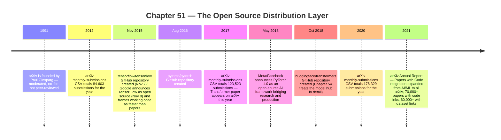

:::tip[In one paragraph]
Modern AI did not spread through papers alone. By the late 2010s a distribution layer had formed: arXiv (1991, Paul Ginsparg) for preprints, GitHub for public repositories (TensorFlow 2015, PyTorch 2016, Hugging Face Transformers 2018), TensorFlow and PyTorch as open-source frameworks, and Papers with Code as a paper-to-code-to-dataset index. None of these levelled the field; they compressed the cycle from idea to inspectable implementation, making the Transformer easy to reimplement, teach, and adapt.
:::

<strong>Cast of characters</strong>

| Name | Lifespan | Role |
|---|---|---|
| Paul Ginsparg | — | Cornell physicist; founded arXiv in 1991 as a curated, no-fee, moderated preprint server |
| Google TensorFlow team | — | Institutional actor; 2015-11-09 open-source announcement framed working code as a faster medium for exchanging ML ideas than papers alone |
| PyTorch maintainers (Meta/Facebook AI) | — | Institutional actor; 2018-05-02 PyTorch 1.0 announcement positioned the framework as a research-to-production bridge |
| Hugging Face | — | Institutional actor; created the `huggingface/transformers` GitHub repository on 2018-10-29 (detailed model-hub treatment belongs to Chapter 54) |
| Papers with Code team | — | Partner with arXiv; the 2021 Annual Report described a code/dataset integration that expanded from AI/ML categories to all arXiv |
| Open-source ML maintainers and users | — | Collective infrastructure community: contributors, package maintainers, tutorial authors, and reproducibility auditors who kept the layer running |

<strong>Timeline (1991–2021)</strong>

<strong>Plain-words glossary</strong>

**Preprint** — A draft research paper made publicly available before formal peer review and journal/conference acceptance. Preprints accelerate circulation but do not certify validity; the same artifact may be revised, corrected, or superseded.

**arXiv** — The 1991 preprint server founded by Paul Ginsparg. Curated and *moderated* (submissions are filtered for relevance and basic legitimacy) but explicitly **not** peer-reviewed. Its category taxonomy includes `cs.LG` (Machine Learning) and `stat.ML` (Machine Learning from the statistics side).

**Repository (GitHub)** — A public Git project hosting source code, tests, issue tracker, pull requests, releases, and commit history. A research artifact's repository often supplies implementation choices the paper compresses (tensor shapes, training loops, masking conventions, dependency versions).

**Open-source framework** — A publicly licensed software toolkit through which models can be expressed, trained, and deployed. TensorFlow (2015) and PyTorch (2016/2018) are the dominant ML examples; their framings ("exchange ideas through code", "research-to-production") differ even though the licenses overlap.

**Paper-to-code index** — A discovery layer that links a paper to its implementations and datasets so a reader does not have to search project pages manually. Papers with Code is the canonical example; arXiv's 2021 Annual Report describes the integration expanding from AI/ML to all arXiv.

**Reproducibility** — The ability of an independent reader to obtain the paper's reported results from the published artifacts. *Code availability is not the same as reproducibility*: a 2019 study of 1,700+ AI-paper repositories documented abandonment, inactivity, and missing dependency or data information.

**Distribution layer (vs. library)** — A library helps an individual write code; a distribution layer changes what the field expects to exist around an idea. The chapter's narrow claim is that arXiv + GitHub + frameworks + paper-to-code indexes together form a distribution layer, not just a collection of tools.

The Transformer did not spread through architecture alone. A paper can describe an idea, but an ecosystem needs routes: places to read the paper, places to inspect code, places to compare implementations, and places to find the artifacts that make replication possible. By the late 2010s, artificial intelligence had acquired a distribution layer. It was not a single platform and it was not owned by one lab. It was a mesh of research servers, repositories, frameworks, and indexes that changed the rhythm of machine-learning work.

This layer did not make the field equal. It did not erase the advantage of large companies with private data, accelerator budgets, full-time researchers, and production infrastructure. It did not make every result reproducible. It did something narrower and still consequential: it lowered the friction between an idea appearing and other people being able to inspect, clone, teach, modify, and extend it. The default tempo shifted from waiting for polished publication to reading preprints, opening repositories, and testing code.

The oldest piece of this layer was arXiv. Founded by Paul Ginsparg in 1991, arXiv became a research-sharing platform for fields including computer science and statistics. Its boundary matters: arXiv is moderated, but it is not peer reviewed. That made it faster than conventional journal circulation without making it a replacement for evaluation. In machine learning, that distinction became central. A preprint could spread quickly, shape discussion, and invite implementation before the slower machinery of conferences and journals had fully run.

The moderation boundary gave arXiv its particular power. It was not an unfiltered message board, and it was not a journal. It sat between private draft and formal publication. That middle position was exactly what fast-moving machine learning needed. A researcher could put a method into circulation, other teams could read it, and the field could begin reacting before the official publication record had finished forming. The price was uncertainty. A preprint might later be revised, rejected, superseded, or criticized. But the research conversation no longer had to wait for every institutional gate to close.

The speed changed the social shape of research. A result could be public enough to discuss and build on, while still provisional enough to require caution. Readers had to learn a new stance: fast access did not mean final authority. The same infrastructure that made research visible also made weak claims visible. This is why arXiv belongs in the story as both an accelerator and a guardrail. It accelerated circulation, but it did not settle truth.

Machine learning also gained explicit shelves. The arXiv taxonomy includes cs.LG for machine learning and stat.ML for machine learning from the statistics side. Those categories gave readers a way to scan, sort, and return. A field that produces a flood of work needs routes through the flood. Category labels are mundane infrastructure, but they matter because they turn a giant preprint server into a navigable research environment.

The category structure also reflected machine learning's hybrid identity. It was computer science, but it was also statistics. It was algorithms and systems, but also estimation, uncertainty, optimization, and inference. The existence of both cs.LG and stat.ML let different communities enter the same broad territory through different doors. That mattered in the Transformer era because the field was no longer one discipline speaking to itself. It was a meeting point for NLP researchers, deep-learning engineers, statisticians, systems builders, and product teams.

arXiv also changed the reader's workday. Instead of learning about a result only through a conference session, a printed proceeding, or a journal issue, a researcher could scan new submissions as part of a routine. The infrastructure itself implies the change: a categorized, no-fee, moderated preprint server made fresh research part of the daily information environment. That habit of continuous scanning would become essential once deep-learning papers began arriving faster than any individual could read them fully.

The overall growth of arXiv makes the scale visible. Official monthly-submission data gives 84,603 submissions in 2012, 123,523 in 2017, 178,329 in 2020, 185,692 in 2022, and 284,486 in 2025. Those are total arXiv submissions, not machine-learning-only counts. The honest claim is broad: during the deep-learning era, the preprint server itself became much larger, and machine learning had explicit category homes inside it. The available source is the all-arXiv submission count, not a category-specific machine-learning curve, so this chapter does not claim one.

It would be easy to write that "ML exploded on arXiv" and leave the number vague. The available source is stronger for total arXiv growth than for category-specific machine-learning growth. The point does not require exaggeration. By 2017, a new architecture such as the Transformer could circulate through a research world already trained to read preprints quickly.

But papers alone were not enough. A modern neural architecture is not fully communicated by equations and tables. Readers need implementation choices: tensor shapes, training loops, initialization, preprocessing, optimizer schedules, batching, masking, checkpoint formats, and the small decisions that live between the paper and a working experiment. Code became part of the argument.

This was especially true for deep learning because the gap between concept and result could be wide. A paper might say that a model used attention, residual connections, dropout, a certain optimizer, or a particular data preprocessing pipeline. But the difference between a working reproduction and a failed run often lived in details that the paper compressed. The code layer gave readers access to some of those details. It did not guarantee success, but it made the tacit engineering less invisible.

Google's 2015 TensorFlow announcement made that argument explicitly. The company open-sourced TensorFlow and framed working code as a faster way for the machine-learning community to exchange ideas than research papers alone. That phrase is historically important because it captures a shift in medium. A framework was not just a tool for internal engineering. It was a public channel through which ideas could move.

:::note
> We hope this will let the machine learning community—everyone from academic researchers, to engineers, to hobbyists—exchange ideas much more quickly, through working code rather than just research papers.

Google framed TensorFlow as public infrastructure by naming researchers, engineers, and hobbyists as the audience for code-mediated exchange. — *Google Blog, "TensorFlow: smarter machine learning, for everyone," 2015-11-09.*
:::

TensorFlow's framing reflected Google's position. The announcement presented TensorFlow as a machine-learning system used inside Google and made available so others could build with it. That did not turn Google's private data or production infrastructure into public goods. It did, however, release a general framework around which tutorials, examples, experiments, and production paths could gather. It made the code layer part of the field's shared vocabulary.

The "for everyone" framing should be read with care. TensorFlow did not give everyone Google's data, products, or TPU roadmap. It gave the community an open-source system and a set of abstractions. That was still a major act of distribution. It meant that a model could be described not only as a diagram or equation, but as a computational graph, an API call, an example script, or a reproducible notebook. The form in which an idea circulated changed the kinds of people who could engage with it.

This is the difference between a library and a layer. A library helps someone write code. A layer changes what the field expects to exist around an idea. TensorFlow helped normalize the idea that serious machine-learning systems could have public frameworks, public examples, and public communities of users. The announcement did not create open-source machine learning by itself, but it gave the distribution layer a corporate-scale anchor at the same moment deep learning was becoming strategically important.

GitHub supplied the visible repository layer. The TensorFlow repository was created in November 2015. The PyTorch repository followed in August 2016. The Hugging Face Transformers repository would appear in October 2018, though the model-hub story belongs later in Chapter 54. These creation dates are not adoption statistics. They are infrastructure markers. They show that major machine-learning frameworks and libraries were not only described in papers or hidden in internal source trees; they existed as public repositories that could be cloned, inspected, forked, and discussed.

That changed how a researcher encountered an idea. A paper might give the mathematical form. The repository gave the build system, examples, issues, commits, tests, and sometimes the rough edges. GitHub also exposed a different kind of collaboration record. Even when a user did not contribute code, they could watch issues, inspect pull requests, compare releases, and learn from the implementation choices. The repository became a working supplement to the paper.

The repository also made failure more visible. If installation broke, users opened issues. If examples were unclear, documentation could be patched. If a new accelerator, operating system, or dependency created trouble, the public record could show the strain. This did not make maintenance easy. It made maintenance legible. A research artifact was no longer just the PDF and the benchmark table; it could include the mundane record of people trying to make the system work.

The mundane record mattered because machine-learning progress often depended on details outside the headline result. Which version of CUDA? Which Python environment? Which data preprocessing step? Which batch size? Which mask convention? Which checkpoint loader? A repository could still fail to answer these questions, but it created a place where the answers could live. GitHub made implementation detail part of the public research surface, even when that surface remained incomplete.

The distribution layer did not have one philosophy. TensorFlow and PyTorch are useful because their public framings were different. TensorFlow's announcement emphasized a scalable system and Google's desire to let the community exchange ideas through code. PyTorch 1.0, announced by Facebook in 2018, emphasized rapid research prototyping and a path to production. It described PyTorch as an open-source AI framework and framed the release around moving from research experimentation toward production deployment.

Those were not merely marketing differences. They reflected two pressures in the field. Researchers wanted systems that felt flexible enough for experiments. Organizations wanted systems that could move trained models into real products. The framework layer had to serve both. A model that was easy to sketch but hard to deploy could stall at the lab boundary. A system that was production-minded but painful for experimentation could slow research. PyTorch's public framing made that research-to-production bridge explicit.

The contrast also explains why frameworks became historical actors. A framework is not neutral plumbing. It makes some model shapes easier to express, some debugging workflows easier to perform, and some deployment routes easier to imagine. It defines what beginners learn first. It influences what examples circulate. It determines whether a researcher thinks in static graphs, eager execution, modules, tensors, scripts, checkpoints, or pipelines. By changing the default tools, frameworks helped change the field's habits.

The framework layer was therefore a kind of standardization without a standards committee. Nobody had to decree that the field should speak in tensors, modules, automatic differentiation, optimizers, checkpoints, and datasets. The dominant tools made that vocabulary practical. Once enough examples, tutorials, repositories, and research code used the same abstractions, those abstractions became part of how new ideas were expressed. The Transformer itself could travel more easily because it could be implemented inside shared frameworks rather than re-created from scratch in every lab.

The open-source framework layer also changed pedagogy. A student or engineer learning neural networks could install a framework, read examples, and run models. That did not mean the learner had the compute to reproduce a frontier result. It meant the concepts were no longer locked behind closed implementations. The distance between reading about a tensor operation and executing it locally shrank. That mattered for the spread of the Transformer because attention layers, masks, embeddings, and training loops could be taught and reimplemented in public.

Teaching is not a side story here. The Transformer became a general architecture partly because it could be explained, drawn, coded, and reused. A framework tutorial could turn multi-head attention from a paper section into a module. A repository could make masking behavior concrete. A small implementation could teach the shape of the computation even if it did not reproduce the WMT result. Public code created a ladder between the paper and the production-scale model.

At the same time, public code should not be romanticized. Code availability is not the same as reproducibility. A repository can be incomplete, undocumented, stale, tied to old dependencies, or missing the data and compute assumptions that made the result work. A 2019 study of GitHub repositories associated with AI papers examined more than 1,700 repositories and found problems including abandonment, inactivity, and documentation or reproducibility gaps. That caveat is not a reason to dismiss the code layer. It is the reason to describe it honestly.

Working code lowered friction; it did not remove the whole hill. A paper implementation might run only under a particular library version. It might omit preprocessing steps. It might assume a dataset path, a GPU type, or a training budget unavailable to most readers. It might reproduce the architecture but not the result. It might be a snapshot from graduate-student research rather than maintained software. The existence of a repository changed the starting point, but it did not guarantee a finish line.

This is where "open" became a layered word. A paper could be open but the data closed. Code could be open but the compute unavailable. A framework could be open but the expertise concentrated. A model architecture could be public while the trained weights remained private. The distribution layer expanded access, but each artifact had its own boundary. Treating all of those boundaries as one simple open/closed switch would erase the actual mechanics of the era.

The practical reader learned to ask a more granular set of questions. Is there a preprint? Is there official code? Is the code maintained? Are the weights available? Is the dataset public? Are the evaluation scripts included? Does the repository name the dependency versions? Can the experiment run on ordinary hardware, or does it assume a cluster? These questions became part of the craft. The distribution layer did not answer them automatically, but it made them visible enough to ask.

The same caution applies to arXiv. Preprints made claims visible early, but visibility is not validation. GitHub made implementations visible, but visibility is not maintenance. Frameworks made experiments easier, but ease is not equality. The distribution layer expanded access to artifacts and accelerated feedback, but compute, data, expertise, and organizational support remained unevenly distributed.

This is why the claim should be about friction, not liberation. Open distribution lowered the cost of inspection. It let more people read the same preprint, browse the same repository, and attempt the same implementation. It created a shared surface where ideas could be compared. But large labs still held advantages in training budget, engineering staff, private datasets, deployment channels, and the ability to absorb failed experiments. The corporate lab monopoly was not broken. It was made more porous at the level of papers and code.

By 2021, the paper-to-code layer had matured further. arXiv's annual report described an integration with Papers with Code that expanded from AI and machine-learning categories to all of arXiv. The report said the integration was well received, added dataset links in May 2021, and had more than 70,000 arXiv papers with at least one code link and more than 60,000 with at least one dataset link. This was not the cause of the Transformer-era spread. It was a later sign that the field had learned to treat papers, code, and datasets as linked artifacts.

That index layer solved a different problem from arXiv and GitHub individually. arXiv could host a preprint. GitHub could host code. Papers with Code could connect them and make the connection discoverable. A reader did not have to guess whether an implementation existed or search manually through project pages. The research artifact became more like a bundle: paper, repository, dataset, benchmark. Again, not perfect, not complete, and not always reproducible, but more navigable than a paper standing alone.

The dataset-link part matters because many machine-learning claims are claims about a relationship among model, data, and evaluation. A code link helps a reader inspect the implementation. A dataset link helps a reader understand what the implementation was trained or tested against. Neither link guarantees that the experiment can be reproduced exactly. But the presence of both links changes the expected shape of the evidence. A paper increasingly looked incomplete if readers could not find the surrounding artifacts.

This shifted the meaning of a result. In older scientific communication, a paper could stand as the primary artifact and supporting material might be secondary. In deep learning, the surrounding artifacts became harder to treat as optional. The code showed how the model was actually assembled. The dataset defined the empirical world in which the claim was tested. The benchmark supplied the comparison. The repository history could reveal whether a project was alive or abandoned. The paper remained central, but it increasingly traveled with companions.

The timing matters. The Transformer paper appeared in 2017, before the 2021 arXiv annual-report numbers. The initial spread of Transformer ideas depended on preprints, frameworks, repositories, and community implementation work more than on a mature universal index. Papers with Code is therefore best treated as the maturation of the layer, not its origin. It shows where the field was heading: toward research artifacts that could be tracked across paper, code, data, and leaderboard.

This infrastructure also changed competition. When strong ideas appeared in public quickly, other teams could build follow-up work quickly. The field's clock sped up. The reward for a good idea was no longer only citation over years; it could be forks, implementations, tutorials, replications, variants, and benchmark comparisons within months. That speed raised the value of execution. Knowing an architecture existed was one thing. Training it well, adapting it, scaling it, and packaging it remained hard.

For companies, open code was not pure charity. It could attract users, contributors, researchers, and ecosystem mindshare. A framework that became the default teaching and research tool shaped how future models were written. Public releases could also pull external innovation toward a company's stack. TensorFlow and PyTorch were open-source infrastructure, but they were also strategic distribution channels. They made certain abstractions familiar and made certain workflows easier to repeat.

That strategic dimension keeps the history from becoming naive. Open-source release can be generous and self-interested at the same time. A company may want a healthier research ecosystem, more external contributors, better recruiting visibility, and broader adoption of its abstractions. Those motives do not cancel the public value of the code. They explain why large labs could participate in openness while retaining major advantages elsewhere. The open layer and the corporate layer were intertwined.

For independent researchers and smaller teams, the same layer was valuable even when it did not level the entire field. A person could read the paper on arXiv, inspect a framework implementation, find related repositories, and understand enough to teach, adapt, or experiment. They might not be able to reproduce a large training run, but they could participate in the conceptual layer. That participation mattered. It widened the population of people who could understand and extend the ideas, even when frontier-scale training remained concentrated.

The distinction between conceptual participation and frontier reproduction became one of the defining tensions of modern AI. Many people could learn the architecture. Fewer could train the largest variants. Many could adapt an open implementation. Fewer could run the full benchmark suite at scale. Many could debate a preprint. Fewer could verify every result from scratch. The distribution layer widened the base of participation while leaving the summit expensive.

That tension shaped the culture of the Transformer era. A new result could be "open" enough for thousands of people to discuss it and still closed in the practical sense that only a few groups could reproduce it fully. A framework could be free to download while the needed accelerator cluster remained out of reach. A repository could reveal the model code while the training data remained unavailable or too large to handle. The distribution layer made participation more continuous, but not uniformly deep.

The best way to describe the change is not democratization, but compression. The time between paper, implementation, tutorial, derivative experiment, and benchmark comparison compressed. People still entered the process with unequal resources, but they entered earlier and with more shared artifacts. That compressed cycle made the field feel faster because it was faster. Ideas did not have to wait for a textbook, a commercial product, or a conference tutorial before they began moving through practice.

Compression also made weak work travel faster. A poorly documented repository, an overclaimed preprint, or a benchmark result without enough reproduction detail could circulate through the same channels as stronger work. The distribution layer therefore increased the importance of review habits. Readers needed to separate paper availability from evidence quality, repository existence from reproducibility, and public code from maintained infrastructure. The field gained speed, but it also inherited a larger verification burden.

Chapter 50 described an architecture that fit the accelerator era. Chapter 51 explains why that architecture could become an ecosystem. The Transformer was compact enough to reimplement, general enough to adapt, and important enough to attract public code. The surrounding distribution layer made that process faster. Papers moved through arXiv. Implementations moved through GitHub. Frameworks gave researchers common tools. Indexes later tied papers to repositories and datasets. None of those layers alone made the modern AI boom. Together, they changed its tempo.

The sequence is important. First, an idea had to become visible. Then it had to become inspectable. Then it had to become runnable, teachable, comparable, and modifiable. arXiv helped with visibility. GitHub helped with inspection and modification. TensorFlow and PyTorch helped with runnable abstractions. Papers with Code helped with comparison and discovery. Each layer answered a different question a reader might ask after encountering a new result: What is the claim? How is it implemented? Can I run something like it? What data or benchmark is attached? Who else has built on it?

The next stage moves from distribution of code to distribution of representations. BERT would take the Transformer architecture and turn bidirectional pretraining into a reusable language-understanding substrate. Later, Hugging Face would make models and weights themselves easier to distribute. But before model hubs could matter, the field needed habits of rapid paper circulation, public implementation, and framework-centered experimentation. The open-source distribution layer supplied those habits. It gave later model releases an audience already trained to read the paper, find the repository, install the framework, and ask what artifacts were missing.

This is also why Chapter 51 sits before BERT rather than after it. BERT's release mattered not only because of its architecture and pretraining task, but because readers could encounter it in a world already prepared for preprints, repositories, framework examples, and fast follow-up. The distribution layer made a strong model more than a paper result. It made it something other people could integrate into their own work rhythm.

The honest conclusion is not that open source won against closed labs. It is that modern AI became harder to understand without the open surfaces around it. The decisive models were still often trained by well-funded organizations. But the ideas, code patterns, framework abstractions, and reproduction attempts increasingly traveled in public. That public layer let the Transformer era compound. It let a paper become a repository, a repository become a tutorial, a tutorial become a baseline, and a baseline become the starting point for the next chapter.

That is the chapter's narrow claim. The distribution layer did not create equal power. It created shared handles on unequal power, and those handles were enough to make the next wave move faster, more visibly, and with many more people watching the machinery turn in public, learning from it, teaching it, auditing it, and sometimes bending it into new tools, baselines, and shared habits.

:::note[Why this still matters today]
Every modern AI practitioner still moves through this layer daily. A new method appears as an arXiv preprint; the reference implementation lands in a GitHub repository; PyTorch (or JAX, or TensorFlow) supplies the abstractions; and Papers with Code, Hugging Face, and dataset indexes make the artifacts navigable. The same caveats apply: code availability is not reproducibility, framework popularity is not technical superiority, and openness layers vary across paper, code, weights, data, and compute. Reading a 2026 model release means reading the same surfaces — preprint, repo, framework integration, dataset card — that the late-2010s ecosystem invented around the Transformer.
:::
