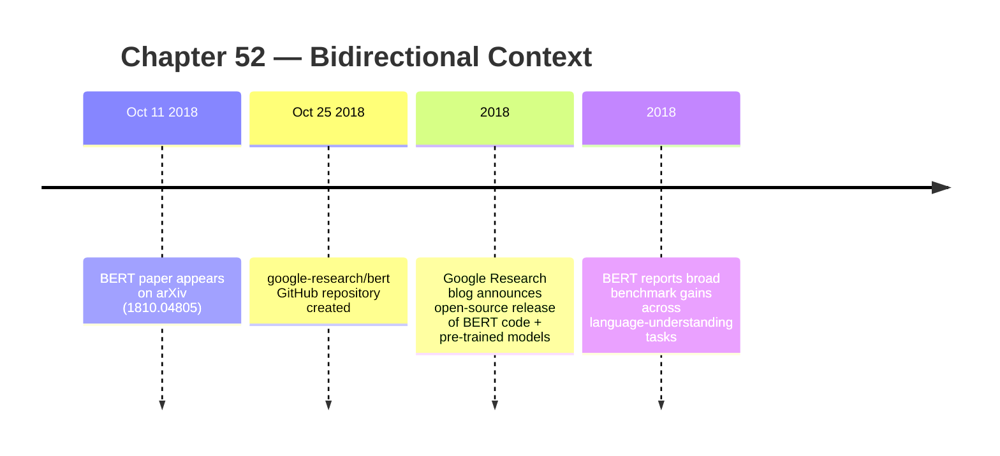
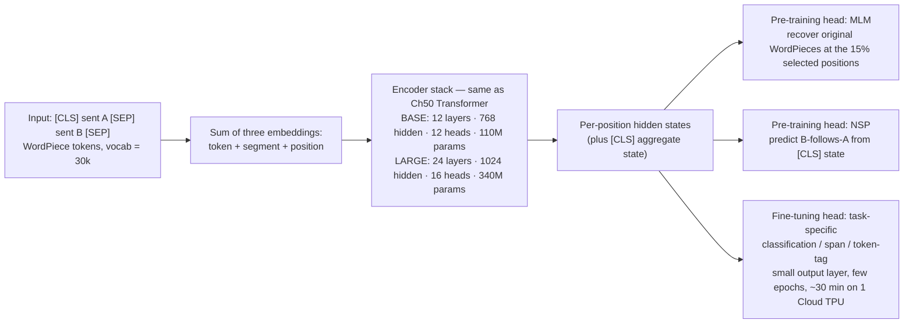

:::tip[In one paragraph]
BERT, published in October 2018 by Devlin, Chang, Lee, and Toutanova at Google AI Language, turned the Transformer encoder into a reusable bidirectional checkpoint. It used masked-token pre-training and sentence-pair training on large unlabeled text, then released weights that could be fine-tuned across many NLP tasks. The reusable artifact stopped being an algorithm and became a set of trained parameters.
:::

<strong>Cast of characters</strong>

| Name | Lifespan | Role |
|---|---|---|
| Jacob Devlin | — | BERT co-author; co-author of the Google Research open-source announcement |
| Ming-Wei Chang | — | BERT co-author; co-author of the Google Research open-source announcement |
| Kenton Lee | — | BERT co-author |
| Kristina Toutanova | — | BERT co-author |
| Matthew Peters / ELMo team | — | Prior contextual-representation line named in the BERT paper context; combined independently trained left-to-right and right-to-left LMs |
| Howard & Ruder / ULMFiT | — | Fine-tuning precedent named in the BERT paper and Google blog context |

<strong>Timeline (October 2018)</strong>

<strong>Plain-words glossary</strong>

**Pre-training / fine-tuning** — A two-stage workflow. *Pre-training* runs an expensive learning pass on a large unlabeled corpus to produce a general-purpose representation (the *checkpoint*). *Fine-tuning* takes that checkpoint, attaches a small task-specific output head, and updates parameters on supervised data for the target task. BERT's practical claim was that pre-training cost amortizes across many fine-tuning tasks.

**Checkpoint** — A serialized snapshot of all model parameters at a point in training. Once released, downstream users can load it, attach task heads, and continue training without redoing pre-training. The BERT release made checkpoints first-class research artifacts alongside papers and code.

**Bidirectional context** — The condition where every layer of the model can condition on both left- and right-side tokens when computing each position's representation. Distinct from ELMo's late concatenation of two independently trained directions: BERT fuses both directions through every layer of the encoder.

**Masked language modeling (MLM)** — BERT's pre-training objective: hide or perturb selected WordPiece positions, then ask the model to predict the original tokens from both left and right context. It turns ordinary text into a self-supervised training signal for the encoder.

**Next sentence prediction (NSP)** — BERT's second pre-training objective for teaching the model to reason over paired text spans. Later work questioned NSP's necessity, but BERT's 2018 ablations treat it as a useful component.

**WordPiece tokenization** — A subword tokenization scheme; BERT uses a 30,000-token WordPiece vocabulary. Subword units handle rare and morphologically complex words by composition, avoiding both character-level shortness and word-level vocabulary explosions.

**`[CLS]` / `[SEP]` tokens** — Special input markers. `[CLS]` opens every input; its final hidden state acts as an aggregate sentence/sequence representation for classification heads. `[SEP]` separates sentence A from sentence B in pair inputs and signals end-of-input. Combined with segment embeddings, they let one encoder serve many task formats.

<strong>Architecture sketch</strong>

The expensive pre-training run produces the encoder weights once; downstream users replace only the right-most head and run cheap fine-tuning. The mask on MLM (selecting 15% of WordPiece positions, with the 80/10/10 substitution schedule) is what lets every encoder layer condition on both left- and right-side tokens without leaking the target into the input.

The previous chapter ended with code becoming an instrument of distribution. TensorFlow, PyTorch, GitHub repositories, papers, notebooks, and benchmark implementations made deep learning easier to copy, inspect, and extend. But code alone was not yet the most valuable artifact. A framework can describe how to build a model; a trained checkpoint already contains the costly work of learning from data. In natural language processing, BERT made that distinction unavoidable.

BERT did not arrive as a claim that machines had achieved human comprehension. Its title used the phrase "language understanding," but the historical claim is narrower and more important. BERT showed that a Transformer encoder could be pre-trained on large unlabeled text as a deep bidirectional representation, then fine-tuned across many language tasks with only small task-specific changes. The reusable object was no longer just an algorithm. It was a set of learned weights.

That changed the economics of NLP. Before a checkpoint can be fine-tuned, someone has to pay for pre-training: data preparation, hardware time, implementation, debugging, and the long run that turns text into model parameters. After that run succeeds, many downstream tasks can start from the same representation. The expensive phase and the task-specific phase separate. A research group, product team, or student no longer has to reproduce the whole pre-training process merely to experiment with sentiment, entailment, question answering, or sentence-pair classification.

This is why BERT belongs immediately after the open-source distribution chapter. TensorFlow and PyTorch made model code portable. BERT made a particular kind of trained model portable. It was not the first pre-trained language model, and it was not the final form of large language modeling. But it made the checkpoint economy visible in a way that changed the working rhythm of NLP. Read the paper, download the code, load the weights, add a modest output layer, fine-tune, compare.

The setup begins with a problem that sounds almost trivial until it is made precise. Words do not mean the same thing in every sentence. A static word representation can give the word "bank" a vector, but the bank in "bank account" and the bank in "river bank" are not doing the same semantic work. Google's public BERT explanation used exactly this kind of contrast. The value of a contextual representation is that the representation of a word can change depending on surrounding words.

That point had been building for years. Word embeddings had already given NLP dense numerical representations of tokens. Recurrent neural networks, LSTMs, and sequence models had already made context part of language processing. ELMo had shown the power of deep contextualized word representations by combining left-to-right and right-to-left language models. ULMFiT had shown that pre-training and fine-tuning could work effectively in NLP. OpenAI's first GPT had applied a Transformer decoder-style model to generative pre-training. BERT was not a bolt from a clear sky. It was a recombination of representation learning, pre-training, Transformers, and fine-tuning around one architectural constraint.

The field also had a workflow split that BERT made explicit. One approach was feature-based: train a representation elsewhere, then feed those features into a task-specific architecture. Another was fine-tuning: start with a pre-trained model and update it for the target task. The BERT paper names both approaches and places itself firmly in the fine-tuning line. That matters because a feature extractor and a fine-tuned checkpoint imply different kinds of reuse. A fixed feature pipeline says, in effect, "use this representation as an input." A fine-tuning pipeline says, "start from these weights and adapt the model itself."

The difference sounds small, but it changes how research compounds. A feature-based system can still require substantial task-specific engineering around the representation. Fine-tuning makes the pre-trained model more like a common base layer. The task does not disappear, but the initial conditions are better. BERT's practical promise was that a broad range of NLP systems could begin from the same learned encoder rather than from a blank architecture and random initialization.

The constraint was direction. A conventional left-to-right language model predicts each token from the tokens before it. That objective is natural for generation: when producing text, the model should not see the future token it is about to predict. But if the goal is to learn a representation of a sentence for many downstream tasks, left-only context is limiting. The word at position 10 may be clarified by position 3 and position 18. A model that only reads leftward during pre-training cannot condition that token's representation on both sides in every layer.

ELMo weakened the problem but did not remove it in the BERT paper's framing. It used a concatenation of independently trained left-to-right and right-to-left representations. That meant each direction could bring context, but the two directions were not deeply fused through all layers during pre-training. BERT's central claim was that the representation should be deeply bidirectional: every layer could condition on both left and right context.

The Transformer made that idea practical. The previous chapter described the original Transformer as an encoder-decoder architecture for sequence transduction. BERT used the encoder side. An encoder stack does not have the same causal masking requirement as an autoregressive decoder. In principle, every token position can attend to every other token position. That gives the architecture a natural path toward bidirectional representations.

But there is a trap. If a model is asked to predict a token while also being allowed to attend to that exact token, the task collapses. It can see the answer. A naive bidirectional language model would leak the target into the input. BERT's answer was masked language modeling. Instead of predicting every token from the previous tokens, the training process selects a portion of the input and asks the model to recover the original tokens from the surrounding context.

The paper's mechanics matter because they show how much of the result was engineering rather than slogan. BERT uses WordPiece tokenization with a 30,000-token vocabulary. Its input representation is the sum of token embeddings, segment embeddings, and position embeddings. The segment embeddings let the model distinguish sentence A from sentence B when the input contains a pair. The position embeddings tell the model where each token sits in the sequence. The token embeddings carry the WordPiece identities themselves.

The model then selects 15 percent of WordPiece positions for possible prediction. Among those selected positions, 80 percent are replaced with the special `[MASK]` token, 10 percent are replaced with a random token, and 10 percent are left unchanged. The model is still trained to predict the original token at the selected positions. This 80/10/10 schedule is not decorative. It reduces the mismatch between pre-training and fine-tuning. During fine-tuning, real inputs do not usually contain `[MASK]`; if pre-training always replaced targets with `[MASK]`, the model would learn around an artificial marker that disappears later.

Masked language modeling is easy to explain badly. It is not simply "fill in the blank" as a party trick. It is a way to let the encoder use both sides of a token without giving the token itself away too directly. The model sees enough context to learn relationships across the sentence, but the selected target positions still require prediction. That objective turns unlabeled text into a supervised signal: the text supplies its own hidden labels.

The 15 percent selection also kept the objective from becoming the entire input. Most tokens remain visible, so the model learns to use ordinary context rather than only a sequence full of holes. The random-token and unchanged-token cases further complicate the shortcut. A selected position might display `[MASK]`, might display the wrong token, or might display the right token even though it is still a prediction target. The model cannot treat a single surface cue as a perfect instruction. It has to learn representations robust enough to recover the original identity under a mixture of conditions.

That training design explains the phrase "deep bidirectional" without turning it into mysticism. The model is not literally reading like a person, glancing forward and backward with intention. It is running self-attention in an encoder stack while optimizing a masked-token objective. Because the target token is partly hidden or perturbed, the representation at that position can draw evidence from both earlier and later tokens. Because the architecture is stacked, that bidirectional conditioning can occur through multiple layers rather than as a late concatenation of two separately trained directions.

This self-supervised structure is one reason BERT fit the infrastructure arc of the book. Earlier AI systems often depended on manually encoded knowledge or carefully labeled examples. BERT still depended on human-produced text, data pipelines, tokenization, compute, and evaluation, but it did not need every pre-training example to be separately annotated by task. Books and Wikipedia articles became training material because the objective could be generated from the text itself.

BERT's second pre-training objective was next sentence prediction. The model receives pairs of sentences. In half the examples, the second sentence is the actual sentence that follows the first; in the other half, it is a random sentence from the corpus. The model must predict whether the second sentence is the true next sentence. The paper tied this objective to tasks that involve relationships between sentence pairs, such as question answering and natural language inference.

Later work would debate or remove next sentence prediction, but that later judgment does not need to be imported into the 2018 result as a retroactive verdict. In the BERT paper, NSP was part of the training recipe, and the paper's ablations treated it as a component worth testing. Historically, its significance is that BERT was not only learning token identity from local blanks. It was also being shaped for inputs where two spans of text had to be considered together.

The input format supported that ambition. BERT uses `[CLS]` at the beginning of an input sequence and `[SEP]` to separate sentences. The final hidden state corresponding to `[CLS]` can serve as an aggregate representation for classification tasks. Sentence A and sentence B segment embeddings help the model keep the two portions apart. These are small pieces of notation on the page, but they are infrastructure in miniature. They make it possible to present many task formats to one underlying model.

Consider how much work is hidden inside that formatting choice. A single-sentence classification problem can be placed after `[CLS]` and before `[SEP]`. A sentence-pair problem can place one span before the separator and one after it, with segment embeddings marking the distinction. A question-answering problem can be framed as a question plus a passage, with the model predicting answer spans from the passage representation. The output heads differ, but the body of the model remains the same pre-trained encoder. That is the practical meaning of minimal task-specific architecture change.

This was a change in the unit of experimentation. In an older workflow, each task might invite a new architecture: one design for sentence classification, another for entailment, another for question answering. BERT did not make all task engineering vanish, but it collapsed much of the common language-representation work into one reusable stack. The researcher could spend more attention on how to frame the task and less on whether the base model could represent language at all.

That is where the fine-tuning story becomes concrete. BERT was designed for a two-stage workflow: pre-training on unlabeled text, then fine-tuning on supervised downstream data. The downstream stage did not require building a fresh model architecture for every task. The same pre-trained encoder could be adapted by adding a task-specific output layer and updating the parameters through fine-tuning. The paper emphasizes that this fine-tuning step is relatively inexpensive compared with pre-training.

The phrase "relatively inexpensive" has to be handled carefully. It does not mean anyone could cheaply train BERT from scratch. The pre-training run used substantial infrastructure. It means that once the pre-trained model exists, adapting it to the paper's downstream tasks is much cheaper than reproducing the whole pre-training phase. The distinction matters because BERT's practical impact came from shifting work from repeated task-specific training to shared pre-training.

The pre-training data was large by the standards of the paper and specific enough to anchor the claim. BERT used BooksCorpus, about 800 million words, and English Wikipedia, about 2.5 billion words. The paper notes the importance of using a document-level corpus because the training procedure needed long contiguous sequences, not merely shuffled sentences. The total scale, about 3.3 billion words, was not a vague invocation of "the internet." It was a named data mixture.

The model sizes were also explicit. BERTBASE used 12 layers, hidden size 768, 12 attention heads, and 110 million parameters. BERTLARGE used 24 layers, hidden size 1024, 16 attention heads, and 340 million parameters. Those numbers place BERT between earlier neural NLP systems and the later frontier scale covered in the next chapters. It was large enough to make pre-training a serious infrastructure event, but small enough that the released checkpoints could become common tools across labs and companies.

The hardware receipt is even more important. The paper reports that BERTBASE was trained on 4 Cloud TPUs in a Pod configuration, 16 TPU chips total, and BERTLARGE on 16 Cloud TPUs, 64 TPU chips total. Each pre-training run took four days. These numbers block two opposite myths. BERT was not a desktop weekend project from scratch. It was also not yet the thousand-accelerator frontier run of later large language models. It sat at an intermediate scale where a major industrial lab could turn expensive pre-training into a reusable public artifact.

Google's release post made the fine-tuning side vivid. It said the release included TensorFlow source code and pre-trained language representation models, and that users could train a state-of-the-art question-answering system in about 30 minutes on a single Cloud TPU or a few hours on a single GPU. The BERT paper gives a similar fine-tuning economics claim: starting from the same pre-trained model, the paper's results could be replicated in at most one hour on a single Cloud TPU or a few hours on a GPU.

That asymmetry was the hinge. Four days on multiple Cloud TPUs to create the checkpoint; minutes to hours to adapt it for a task. The history is not that compute stopped mattering. It is that compute could be amortized. Once a powerful representation existed, downstream users could spend a smaller amount of compute to borrow the representational work already embedded in the weights. The checkpoint became a compressed form of prior training.

The benchmark results supplied the proof of usefulness. The BERT paper reported state-of-the-art results on 11 natural language processing tasks, including GLUE, SQuAD, and SWAG. Those task names matter because they were not all the same kind of problem. GLUE aggregated several language understanding benchmarks. SQuAD tested question answering over passages. SWAG involved commonsense-style sentence continuation. BERT's claim was not that one bespoke architecture won one narrow contest. It was that one pre-trained model could be adapted across a range of task formats.

The breadth of the task list gave the paper its force. A narrow improvement on one benchmark can be explained by a clever local fit. A result spread across sentence classification, sentence-pair reasoning, question answering, and other language tasks is harder to dismiss as a one-off. The paper's tables are therefore not just scoreboards. They are an argument that the representation learned during pre-training was portable enough to matter across task boundaries.

The results should be described as reported results, not eternal leaderboard possession. Benchmarks move. Later systems would improve on BERT, challenge some of its assumptions, and change the center of gravity toward generative modeling. But in 2018, the pattern was clear enough: a shared encoder checkpoint plus fine-tuning could reset expectations across NLP. The strongest historical claim is not that BERT won forever. It is that BERT made pre-trained representations feel like the default starting point.

This changed the role of the benchmark itself. A benchmark was no longer only a final exam for a task-specific model. It became a place to demonstrate transfer from a general pre-training phase into many specialized evaluations. The same underlying weights appeared again and again, wearing different output layers. That made the model's generality legible to the field. It also made the checkpoint easier to justify as infrastructure. If one expensive run helps many tasks, the run is easier to treat as a platform investment.

There is a subtle institutional consequence here. Benchmarks made the value of the checkpoint visible to people who did not inspect the training run. A reader did not have to own Cloud TPUs, recreate the corpus, or watch pre-training proceed for four days. The paper could show downstream results, the release could provide weights, and the community could test adaptation. In that sense, evaluation and distribution reinforced each other. The benchmark demonstrated transfer; the checkpoint let others try it.

The release artifact completed the loop. Google open-sourced BERT's code and pre-trained models. The public repository for `google-research/bert` was created in October 2018. The paper and blog together positioned BERT as something other researchers could use, not merely admire. That matters because a pre-trained model locked inside a single company changes product behavior; a pre-trained model released with code changes research behavior across the field.

This is also where BERT connects back to the chapter on frameworks. TensorFlow was not just a neutral container. The BERT release included TensorFlow source code, and users could fine-tune the released models through that implementation. Framework maturity lowered the friction of moving from paper to experiment. The trained weights carried the expensive representation; the code supplied the loading, input formatting, task heads, and training loop needed to put the representation to work.

The open release also made the checkpoint legible as an object with a public life. A paper can be cited. A repository can be cloned. A model can be downloaded, loaded into memory, fine-tuned, wrapped in a service, or modified into a derivative. Those actions are not identical, and BERT did not make them effortless, but it helped move NLP toward a world where the trained artifact itself circulated. The artifact had a name, a URL, a framework implementation, and a set of expected tasks attached to it.

But the release did not eliminate every barrier. Fine-tuning still required task data, hardware, programming skill, and enough judgment to avoid fooling oneself on benchmarks. The pre-trained model did not turn natural language processing into a solved problem. It made a powerful baseline widely available. That difference is historically important. BERT raised the floor for many NLP projects, but it did not remove the ceiling imposed by data, evaluation, deployment, domain shift, and the limits of the pre-training objective.

It also did not settle the generative path. BERT's encoder-style bidirectionality was well suited to representation learning, classification, span prediction, and sentence-pair tasks. It was not the same thing as a left-to-right model trained to continue text. GPT-style systems remained important because generation requires causal prediction: the model has to produce the next token from previous context. The next chapter belongs to that path. BERT and GPT share the Transformer inheritance, but they use it with different masks, objectives, and product futures.

That distinction prevents a common historical flattening. It is tempting to say "Transformers won" and then collapse BERT, GPT, translation models, model hubs, and chatbots into one line. The details matter. BERT made the encoder checkpoint central. GPT-style models made next-token generation central. Hugging Face and related distribution systems made sharing and loading models easier. Scaling-law work made compute, data, and parameter counts into variables to plan around. Each step changed the infrastructure in a different way.

BERT's language of "understanding" also needs discipline. The paper's title and benchmark categories used that term, but the model did not prove human-like comprehension. It learned representations that worked well on measured tasks. It could use left and right context to predict masked tokens and adapt to supervised benchmarks. That is impressive enough without pretending the system had a human grasp of meaning, intention, or the world behind the text.

The bank example is useful precisely because it is modest. A contextual model can represent "bank" differently when nearby words point toward finance or geography. That does not mean it understands money, rivers, law, sediment, or social trust the way a person does. It means the statistical representation is sensitive to surrounding text. Modern AI history becomes clearer when that kind of distinction is preserved. The measurable capability is real; the anthropomorphic shortcut is unnecessary.

The same care applies to the word "open." BERT was open in the sense that Google released code and pre-trained models. That did not mean the whole research stack was equally accessible. The pre-training hardware belonged to a major industrial lab. The datasets, implementation choices, and institutional resources mattered. Open release distributed the artifact; it did not erase the asymmetry in who could afford to create such artifacts in the first place.

That asymmetry would become one of the central tensions of the next era. When checkpoints matter, the organizations that can pre-train them gain leverage. When releases matter, the community can build around artifacts produced elsewhere. When benchmarks reward adaptation, downstream teams can appear competitive without owning the whole training pipeline. BERT sat at the beginning of that arrangement: industrial pre-training, public release, broad fine-tuning.

The model's technical details therefore deserve to stay connected to the institutional story. Masked language modeling was not only a clever objective. It made unlabeled text usable at scale for encoder pre-training. Segment embeddings and sentence-pair formatting were not only implementation details. They let one checkpoint serve many task layouts. Cloud TPU pre-training was not only a hardware footnote. It marked the cost of producing the artifact. Fine-tuning time was not only a convenience. It explained why the artifact spread.

This is the deeper continuity from the Transformer chapter. The Transformer changed the architecture of sequence modeling by making attention the central operation. BERT used that architecture to change the workflow of NLP. Instead of designing a model from scratch for every benchmark, researchers could begin with a pre-trained encoder whose weights already encoded a large amount of statistical structure from text. The question shifted from "What architecture should this task use?" toward "How should this checkpoint be adapted?"

That shift reshaped expectations quickly because it affected daily practice. A benchmark paper could compare fine-tuning recipes. A product prototype could start from a pre-trained model. A classroom demonstration could show transfer from general pre-training to a specific task. The same checkpoint could appear in many contexts, making BERT less like a single result and more like a common dependency.

The dependency was still bounded. BERT did not contain retrieval systems, tool use, instruction following, reinforcement learning from human feedback, or chat interfaces. It did not answer the later question of how a model should behave in an open-ended conversation. It did not solve long-context memory or factual grounding. Those later systems would inherit the checkpoint habit but move the center of gravity toward generation, scale, alignment, and product integration.

The honest significance of BERT is that it made pre-trained language representations operational. The paper gave the field a concrete recipe: Transformer encoder, masked language modeling, next sentence prediction, large unlabeled corpora, expensive pre-training, comparatively cheap fine-tuning, and strong reported results across many NLP tasks. The release gave that recipe an artifact: code and weights that others could run.

In 2018, that was enough to change the default. NLP no longer looked like a collection of separate task architectures waiting to be hand-built one at a time. It increasingly looked like a stack: a costly general pre-training phase underneath, a light adaptation phase above, and benchmarks arranged to measure how well the shared representation transferred. BERT did not end the story of language models. It made the next chapter possible by proving that a trained Transformer checkpoint could become infrastructure.

:::note[Why this still matters today]
The pre-training/fine-tuning split BERT made operational still organizes most of modern NLP. Encoder-only descendants (RoBERTa, DeBERTa, ModernBERT, sentence transformers) power semantic search, retrieval-augmented generation, embeddings APIs, content moderation, and classification at every cloud provider. Generative chat moved to decoder-only models, but the *checkpoint-as-infrastructure* idea — pay once for pre-training, amortize across many downstream uses — is now the universal default. Reading a 2026 model card is reading the BERT framing: corpus, parameter count, hardware, downstream-evaluation table, released weights, fine-tuning recipe.
:::
