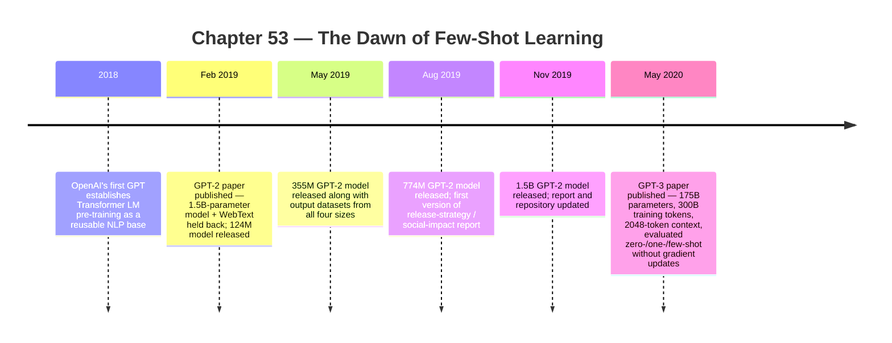

:::tip[In one paragraph]
In February 2019 OpenAI's GPT-2 paper showed that a 1.5-billion-parameter Transformer language model trained on WebText could perform NLP tasks zero-shot — without per-task gradient updates. In May 2020 GPT-3 (175 billion parameters, 300 billion training tokens) made the prompt itself the task specification: examples sat inside a 2048-token context, weights stayed frozen. The reusable artifact stopped being a fine-tuned checkpoint and became a frozen model conditioned by text. Few-shot learning was the new interface.
:::

<strong>Cast of characters</strong>

| Name | Lifespan | Role |
|---|---|---|
| Alec Radford | — | Lead author of the GPT-2 paper "Language Models are Unsupervised Multitask Learners"; co-author of GPT-3 |
| Tom B. Brown | — | Lead author of the GPT-3 paper "Language Models are Few-Shot Learners" |
| Ilya Sutskever | 1986– | OpenAI co-founder; co-author of both GPT-2 and GPT-3 |
| Dario Amodei | — | OpenAI research; co-author of both GPT-2 and GPT-3; later co-founder of Anthropic |
| Miles Brundage | — | Co-author of OpenAI's GPT-2 staged-release and social-impact report |
| Irene Solaiman | — | Co-author of OpenAI's GPT-2 staged-release and social-impact report |

<strong>Timeline (2018–May 2020)</strong>

<strong>Plain-words glossary</strong>

**Autoregressive language model** — A model that generates a sequence one token at a time, each token conditioned on all previous tokens. GPT-style models use the Transformer's decoder side with causal masking; the next-token-prediction objective is what links GPT-2's web-scale pre-training to GPT-3's prompt interface.

**Zero-shot / one-shot / few-shot evaluation** — Three levels of in-context conditioning. *Zero-shot:* the model receives only a task description in natural language, no demonstrations. *One-shot:* one example. *Few-shot:* several examples up to what fits in the context window. None involve gradient updates.

**In-context learning** — The behavioural pattern where task performance is conditioned by examples placed inside the input prompt rather than by parameter updates. GPT-3 popularised the term while remaining careful: the paper does not claim the model learns a *new* task during the forward pass; it may be recognising patterns from pre-training.

**Prompt** — The text prefix supplied to a language model to elicit a particular continuation. Holds instructions, demonstrations, and the query that the model is meant to answer. Once the prompt becomes the control surface, prompt design replaces architecture choice as the per-task work.

**Context window** — The maximum number of tokens the model can attend over at once. GPT-2: 1024 tokens. GPT-3: 2048 tokens. Both small by 2026 standards, but already large enough to hold instructions, several demonstrations, and a query for many benchmark tasks.

**WebText** — The corpus OpenAI assembled for GPT-2 from outbound Reddit links with ≥3 karma, deduplicated and cleaned to about 8M documents (~40 GB). Wikipedia was deliberately excluded to reduce evaluation overlap. The dataset shows how upstream platform behaviour (Reddit upvoting) became part of the AI training pipeline.

**Staged release** — OpenAI's GPT-2 release pattern: paper + smallest model first (Feb 2019), then 355M (May), 774M (Aug), 1.5B (Nov), each accompanied by misuse-risk analysis. Made model-weight release a public-governance question, not just a research artifact decision.

BERT made the pre-trained checkpoint feel like infrastructure. A team could begin with a representation already shaped by billions of words, add a task-specific output layer, and fine-tune for question answering, entailment, classification, or another supervised benchmark. That was a major break from building every language system from scratch. But it still left a familiar bottleneck in place: for each new task, the system usually needed labeled examples, a training run, and a task-specific adaptation step.

The next turn asked whether even that adaptation step could move into text. Instead of changing the model weights for a new task, what if the task could be described inside the input? What if examples could sit in the prompt rather than in a separate fine-tuning dataset? What if a model trained only to predict the next token could use the surrounding context as a temporary specification of what to do?

This was not yet the chatbot moment. It was not a solved-agent interface, a reliable reasoning engine, or a product anyone could trust with open-ended work. It was a change in the surface of language modeling. The model was still predicting text. But the text could now include instructions, demonstrations, labels, questions, answers, formats, and patterns. The prompt started to behave like a tiny task environment.

That made the shift feel different from the earlier pre-training story. A pre-trained encoder gives downstream systems a stronger internal representation. A prompt-conditioned generator makes the interaction itself visible. A user can see the task description and examples because they are ordinary text. The model's hidden activations remain opaque, but the control surface becomes legible enough for non-specialists to experiment with. This is why prompting would later become a cultural phenomenon. The roots were already present before chat products: the task was moving into the context window.

GPT-2 and GPT-3 made that shift visible in two stages. GPT-2 argued that a large autoregressive Transformer trained on broad web text could perform a range of tasks in a zero-shot setting, without task-specific parameter or architecture modification. GPT-3 made the claim harder to ignore by scaling the model dramatically and evaluating tasks where the only task information came from text in the context window. The historical result was not that the models understood tasks the way people do. It was that the interface to the model began to look less like a training script and more like a piece of writing.

That distinction matters because it changed the economics of experimentation. In the BERT workflow, a user starts from a checkpoint and fine-tunes. In the GPT-3 workflow studied in the paper, the user supplies a prompt and the weights do not move. The work shifts from gradient updates to context design. That did not eliminate supervised learning or fine-tuning; the GPT-3 paper explicitly treats fine-tuning as possible future work, and many fine-tuned systems still outperformed GPT-3 on specific tasks. But it made a new question central: how much task behavior can be elicited at inference time?

GPT-2 set up the question by attacking the narrowness of task-specific NLP systems. The paper, "Language Models are Unsupervised Multitask Learners," begins from the observation that many machine-learning systems were trained for one task using one dataset. That approach could produce strong benchmark results, but it required manually creating or labeling data for each task. OpenAI's bet was that language itself already contains many demonstrations of tasks. Web pages contain translations, summaries, question-answer pairs, lists, definitions, code snippets, reviews, and formatted examples. A model trained to predict text across enough of that distribution might learn to continue those patterns without a separate supervised dataset.

The word "might" is important. GPT-2 did not prove that language modeling had solved generalization. Its own paper is careful about limits. It reported promising zero-shot transfer while saying performance remained far from practical on many tasks. The model was not a general worker waiting behind a clean instruction interface. It was a next-token predictor whose behavior became more flexible as scale and data grew.

The data source was WebText. It was not a magical archive of all knowledge and not a neutral sample of the web. The GPT-2 paper constructed it from outbound links posted on Reddit that had received at least 3 karma. The authors used this as a heuristic for human-filtered quality: links that at least a few users had found worth upvoting. From 45 million links, the process produced slightly over 8 million documents after cleaning and deduplication, about 40 gigabytes of text. Wikipedia was removed to reduce overlap complications with evaluation datasets.

That construction says a great deal about the period. The web was no longer merely a place where AI systems might be deployed; it had become a training substrate. Human attention, recommendation systems, moderation, linking behavior, and platform culture were all upstream of the dataset. GPT-2 did not train on "the web" in the abstract. It trained on a filtered corpus created through a social signal from a particular platform, then cleaned into a text dataset suitable for language modeling.

The objective remained simple: predict the next token. The claim was that, at enough scale, that objective could absorb task structure from naturally occurring text. If a document contains a question followed by an answer, the model sees a pattern. If another contains a French sentence followed by an English translation, it sees another pattern. If a page lists examples under a label, the model sees format and association. No one has to convert every instance into a hand-labeled supervised benchmark for the model to receive some training signal. The signal is embedded in the sequence.

The model's interface followed from that objective. A left-to-right Transformer sees previous tokens and predicts what comes next. That makes it a natural generator. It also makes prompts possible. If the prefix says, in effect, "Translate English to French" and then gives examples, the continuation can be evaluated as a translation. If the prefix gives review text and labels, the continuation can be evaluated as classification. The weights are not updated for that task; the input conditions the prediction.

This is where the difference from BERT becomes more than architecture. BERT's masked-token objective hides parts of an input and learns a bidirectional representation. GPT-style modeling keeps the causal direction and asks for the next token. For generation, that left-to-right constraint is not a handicap; it is the form of the task. Every output becomes a continuation. The same mechanism that writes the next word in a paragraph can be made to write the answer after a question, the label after an example, or the translation after a source sentence.

The fragility is already visible in that description. If the task is represented only by text before the answer, then task specification is informal. The model is not executing a typed function. It is not guaranteed to infer the intended label set, output format, or evaluation rule. A prompt can be underspecified, misleading, or contradicted by examples. GPT-2 made this possibility exciting, but also exposed why zero-shot transfer was not yet a stable product interface.

GPT-2's tokenization and scale made the setup concrete. It used byte-level byte-pair encoding, a vocabulary of 50,257 tokens, and a 1024-token context. The byte-level design gave broad coverage over strings while retaining many of the efficiency advantages of subword tokenization. It did not solve language, but it reduced the number of brittle unknown-token problems that appear when a model encounters unusual spelling, punctuation, names, or symbols.

Tokenization deserves its place in the history because prompts are made of strings before they are made of vectors. If a model handles rare names, code fragments, punctuation, or unusual spellings poorly, the prompt interface inherits that brittleness. Byte-level BPE was not glamorous compared with a 1.5B-parameter model, but it widened the surface of text the model could process. A prompt-based system lives or dies partly on whether the text you type can be represented without collapsing into unknown symbols.

The model sizes also marked a step change. The paper evaluated four sizes: about 117 million, 345 million, 762 million, and 1.542 billion parameters. The smallest was roughly the scale of the original GPT line; the largest became the public symbol of GPT-2. In the paper's reported results, the largest model achieved state-of-the-art zero-shot results on 7 of 8 tested language-modeling datasets, while still underfitting WebText. That combination is historically interesting. The model was larger and more capable than earlier versions, yet the training signal still had room to be exploited. Scale was improving behavior without exhausting the data.

The "underfitting WebText" caveat matters because it helped make the next move feel rational. If the biggest GPT-2 model was still not fully fitting the training distribution, then making the model larger was not obviously wasteful. The paper did not by itself prove the later scaling-law program, but it contributed to the intuition that model capacity remained a bottleneck. In the background, the field was learning to think of language modeling as an infrastructure problem: more parameters, more data, more compute, and better training could move measurable behavior.

But the caveat is not optional. GPT-2's Section 7 says zero-shot performance was still far from usable for practical applications and that many tasks were likely no better than random. This is the chapter's ballast against hindsight. In 2019, the paper suggested a direction. It did not deliver a reliable general-purpose assistant. The model could surprise researchers by doing something like a task, but "something like" is not the same as dependable performance under product conditions.

The public drama around GPT-2 came from release strategy. OpenAI did not initially release the largest model. In February 2019, it released the paper and a 124M-parameter model. In May, it released the 355M model, along with output datasets from all four model sizes and detection-related material. In August, it released the 774M model and a first version of the release-strategy and social-impact report. In November, it released the 1.5B model and updated the report and repository documentation.

The timeline is worth stating plainly because the story is often flattened into mythology. OpenAI did not permanently refuse to release GPT-2. It staged the release. The verified claim is that the organization said it was concerned about misuse and wanted time for risk and benefit analysis. The social-impact report named possible misuse categories such as fake news generation, impersonating others in email, and abusive social-media automation. It also discussed synthetic-text detection and the fact that existing research had not achieved perfect accuracy, especially under strong adversarial assumptions.

This made GPT-2 a publication-norms event as much as a model event. Earlier AI papers had raised misuse concerns, but GPT-2 turned the release of model weights into a public governance question. If a model can generate fluent text at scale, what exactly should be released, when, and to whom? Is a paper enough? Are small checkpoints acceptable but large ones risky? Should a lab release outputs for detector research? How should uncertainty itself be handled?

The staged release also revealed how hard it was to separate science from deployment. A smaller model could help researchers reproduce some findings and study behavior. A larger model could help evaluate risks more realistically, but might also be easier to misuse. Outputs from unreleased models could support detector work, but detectors themselves were imperfect and could become part of an arms race. Every choice had tradeoffs. The release strategy was not merely a public-relations posture; it was an attempt to manage a research artifact whose downstream uses were difficult to predict.

The answers were not settled by GPT-2. The staged release produced a precedent, not a law. But it showed that language-model capability had crossed into a zone where release mechanics mattered. A checkpoint was not just a research artifact. It was a potential tool for others, including users the originating lab could not supervise. That concern would return again with open weights, closed APIs, model cards, safety evaluations, and the later split between fully open and tightly controlled frontier systems.

It also foreshadowed a split inside the meaning of "open." A paper could be open while the largest weights were delayed. Outputs could be shared while training data remained unavailable. A repository could exist while the full system was not immediately released. These distinctions became central in the next era. The public would often talk about whether a model was open or closed, but the practical reality had many layers: code, weights, training data, evaluation data, serving interface, and permission to use the model commercially.

GPT-3 moved the technical center from zero-shot transfer to in-context learning. The paper, "Language Models are Few-Shot Learners," described a 175B-parameter autoregressive language model evaluated without gradient updates or fine-tuning. Tasks and demonstrations were specified as text. The model received a prompt, processed it in a forward pass, and produced a continuation. The weights stayed fixed.

:::note
> Here we show that scaling up language models greatly improves task-agnostic, few-shot performance, sometimes even reaching competitiveness with prior state-of-the-art fine-tuning approaches.

The qualifier "sometimes" matters: the abstract presents scale as the engine of few-shot gains while preserving the paper's mixed-results caveat. — *Brown et al. 2020, "Language Models are Few-Shot Learners," abstract, p. 1.*
:::

That is the key interface change. In an ordinary supervised setup, examples live in a dataset and learning happens through parameter updates. In GPT-3's few-shot setting, examples live in the context window and influence the output through attention during inference. The paper calls this in-context learning, while remaining careful about what is being learned. It does not prove that the model learns a new task from scratch inside the prompt. It may recognize patterns related to tasks it saw during training. The safe historical claim is that task performance could be conditioned by text examples without a weight update.

The definitions are simple but easy to blur. In zero-shot evaluation, the model receives a natural-language description or prompt but no demonstrations. In one-shot evaluation, it receives one example. In few-shot evaluation, it receives several examples, up to what fits in the context. The examples are not a training set in the gradient-descent sense. They are part of the input. A sentiment prompt might show a few reviews and labels, then present a new review and ask for the label. A translation prompt might show a few sentence pairs, then a new source sentence. The model continues the pattern.

The context window made that possible at a larger surface than GPT-2. GPT-3 used a 2048-token context. That is still tiny compared with later long-context systems, but it was enough to hold instructions, demonstrations, and a query for many benchmark tasks. The prompt became a temporary workspace. The model could not permanently store the task from that prompt; once the context changed, the conditioning changed. But during that forward pass, the prompt shaped behavior.

This is why the phrase "few-shot" was so important. In older machine learning, a few examples usually meant a tiny dataset used for training or adaptation. In GPT-3, the few examples were written directly into the context. They were visible to the model in the same way the question was visible. That made the prompt both data and instruction, both input and control surface. A handful of examples could specify the label vocabulary, the format of the answer, the style of reasoning expected by the benchmark, or the transformation from one kind of text to another.

The paper's caution about in-context learning should stay attached to the idea. It remains agnostic about whether the model is learning a task from scratch during the forward pass or recognizing patterns from pre-training. That distinction matters. If the model has seen many similar formats in its training data, a prompt may trigger a familiar behavior rather than teach a genuinely new one. The measured result is still important, but the interpretation has to stay modest: prompts can condition behavior; they do not prove human-like learning.

The scale was the public shock. GPT-3's largest model had 175 billion parameters. The paper trained eight model sizes from 125 million to 175 billion parameters for 300 billion tokens. Its training mixture included filtered Common Crawl, WebText2, Books1, Books2, and English-language Wikipedia, with data weighted by perceived quality rather than raw size. The model family used the same broad autoregressive Transformer direction as GPT-2, with the paper noting alternating dense and locally banded sparse attention patterns.

The training mixture also shows how far the field had moved from small curated corpora. Filtered Common Crawl supplied the largest raw source, but the paper did not weight data only by size. WebText2, books, and Wikipedia received their own roles. The goal was not merely to pour the biggest scrape into the model. It was to assemble a mixture whose quality and diversity could support broad prediction. That mixture would later become a central controversy for copyright, consent, data labor, and benchmark contamination, but in this chapter the anchored claim is narrower: GPT-3 trained on a large, mixed text corpus with quality weighting.

The infrastructure details should not be stretched beyond the sources. The current contract does not anchor GPT-3's exact GPU count, full cluster topology, wall-clock training time, energy use, or dollar cost. What it does anchor is enough: 175B parameters, 300B training tokens, 2048-token context, model partitioning across GPUs by depth and width, and a large mixed training corpus. GPT-3 was not a small lab curiosity. It was an industrial-scale training project whose output was evaluated as a prompt-conditioned model.

That restraint is important because GPT-3 quickly became a symbol of scale. Symbols invite invented numbers. A history should resist that. The model was enormous relative to the public language models that preceded it, but the exact bill and cluster story are not needed to explain the interface shift. The verifiable facts already show the point: scale had become large enough that a model trained for next-token prediction could display useful task conditioning without fine-tuning in the evaluated setup.

The results were deliberately broad. GPT-3 was evaluated across language modeling, question answering, translation, cloze and completion tasks, Winograd-style tasks, common-sense benchmarks, reading comprehension, arithmetic, news generation, and other categories. Few-shot performance often improved with scale. In closed-book question answering, the paper reported strong results on some datasets such as TriviaQA while showing weaker results on others such as WebQuestions and Natural Questions. The pattern was not universal victory; it was uneven capability rising with scale.

That breadth changed how people read the model. A narrow benchmark win can be filed as another specialized result. A single model producing nontrivial results across many benchmark families suggests a different kind of artifact. It does not mean the model is generally intelligent. It means the pre-training distribution and the prompt interface are broad enough that many tasks can be recast as text continuation. The benchmark suite becomes a map of where that recasting works, where it breaks, and how much scale helps.

The recasting itself was historically important. A reading-comprehension benchmark becomes a passage followed by a question and an answer slot. A translation benchmark becomes examples of source and target text followed by a new source. A classification benchmark becomes text followed by a label. This does not make all tasks identical in substance, but it makes them presentable through one interface. The model no longer has to expose a separate formal API for each task. The text sequence becomes the common adapter.

That common adapter made evaluation both easier and more treacherous. It was easier because many tasks could be phrased in one language-model interface. It was more treacherous because prompt wording, example order, and formatting could influence results. A benchmark number was no longer only a property of weights and data; it could also reflect a choice of prompt and small demonstration set. GPT-3 therefore helped create a new measurement problem that later chapters will follow: when a model can be steered by language, evaluation becomes partly a contest over how the task is presented.

That unevenness is the honest center of GPT-3. The paper made the prompt era plausible, but it also documented limits. It reported that GPT-3 could struggle with repetition and long-passage coherence, that it had weaknesses involving common-sense physics, that it performed poorly on some comparison and reading-comprehension tasks, and that it lacked grounding. It discussed bias and misuse risks. It did not present the model as a trustworthy reasoner or a grounded agent. It presented a surprisingly strong language model with serious limitations.

The grounding limit is especially important. A model trained to predict text can learn many regularities about how people write about the world. That is not the same as direct access to the world. It can produce plausible statements without checking them against reality. It can imitate explanations without stable causal understanding. It can continue a format even when the content is wrong. GPT-3's fluency therefore sharpened the evaluation problem: when a system sounds competent, mistakes can become harder for users to notice.

This is where few-shot learning became a social problem as well as a technical one. A weak classifier often looks weak. A fluent generator can look stronger than it is. If it answers in the right format, uses confident prose, and follows the local pattern of the prompt, a user may infer more reliability than the model deserves. GPT-3's paper did not hide these risks, but the interface itself made them more salient. Text is the medium humans use for explanation, instruction, and authority. A model that can produce text can be read as inheriting some of that authority whether or not it has earned it.

The synthetic-news experiment captured the ambiguity. In the GPT-3 paper's selected experimental setup, human ability to distinguish model-generated news articles from human-written ones approached chance for outputs from the 175B model. That is a striking result, but it has to be kept inside the experiment. It does not prove that all generated text is indistinguishable from human writing. It shows that, under the paper's conditions and selected samples, the largest model could produce news-like text that was difficult for human evaluators to identify reliably.

This result connects back to GPT-2's staged release. In 2019, OpenAI framed synthetic text as a misuse concern under uncertainty. In 2020, GPT-3 gave more evidence that generated text could be persuasive in controlled settings. The risk discussion was no longer separate from the technical result. Fluency, scale, release strategy, detection, and misuse were becoming one combined topic.

The deeper technical shift was that prompting changed what it meant to "program" a language model. A prompt is not code in the strict sense. It has no formal semantics, no compiler, and no guarantee of stable behavior. But it can specify a task informally enough for the model to continue the pattern. That made natural language itself part of the control surface. The same model could be asked to classify, answer, translate, summarize, or imitate a format by changing the prefix.

This was powerful and fragile for the same reason. Because the interface was text, it was accessible. A user did not need to define a neural architecture to try a new task. But because the interface was text, it was also ambiguous. Small changes in wording, ordering, examples, or formatting could change behavior. The model was not following instructions in the robust human sense. It was conditioning on a sequence and predicting a continuation. Prompting opened a door before the field knew how to make the doorway stable.

The economics changed again. BERT amortized pre-training across many fine-tuned tasks. GPT-3 suggested that a single large model could amortize even more work by serving many tasks through inference-time conditioning. The cost moved to training and serving the giant model, plus the human work of designing prompts and evaluating outputs. That did not make the system cheap. It changed where the bill appeared. Instead of paying for a fine-tuning run for every task, a user might pay for tokens through a model interface.

That is why GPT-3 points forward to product systems even though this chapter stops before ChatGPT. A prompt interface is easier to wrap in an API than a fine-tuning pipeline. A user can send text and receive text. The system can be demonstrated in a browser, integrated into a tool, or hidden behind a product feature. But GPT-3 itself, as presented in the paper, was still a research system under evaluation, not the full assistant stack of later chapters. Instruction tuning, reinforcement learning from human feedback, retrieval, tools, memory, safety layers, and chat product design all remain ahead.

It also points sideways to model distribution. GPT-2's staged release made weights and release timing part of the story. GPT-3's scale made full replication harder for outsiders and pushed access toward controlled interfaces. The next chapter will follow the hub and weights side of that tension. Open-source communities would not simply wait for closed labs to define the future. They would build distribution layers where models, tokenizers, datasets, and evaluation scripts could circulate.

The scaling-law chapter also waits nearby. GPT-3 did not appear in a vacuum. It belonged to a period when researchers were increasingly treating model size, data, and compute as variables in a predictable performance curve. GPT-3's few-shot results made scale feel not only like a way to lower loss, but like a way to change the interface. Bigger models did not merely predict text better in the abstract; they made prompt-conditioned task behavior more visible.

That is the bridge from research result to industrial strategy. If scale improves the usefulness of the prompt interface, then training a much larger model can be justified not only by benchmark loss but by the possibility of serving many tasks from one system. The economic object changes from a model per task to a shared model behind many task descriptions. That creates a new kind of platform pressure. The owner of the large model can expose a general text interface; downstream users can build workflows on top of it; evaluation teams can test it across task families; competitors can decide whether to replicate, release, or rent access.

The honest ending is neither dismissal nor triumph. GPT-2 showed that web-scale next-token prediction could produce surprising zero-shot behavior while remaining unreliable and risky to release without thought. GPT-3 showed that, at much larger scale, task demonstrations could live inside the prompt and influence behavior without gradient updates. Together they moved language models toward a new interface: not a classifier trained for one task, not only a fine-tuned encoder checkpoint, but a general text continuation engine that could be steered by examples.

That engine was still unstable, ungrounded, biased, and easy to overread. It did not prove human reasoning. It did not make fine-tuning obsolete. It did not solve factuality or long-form coherence. But it made one fact hard to ignore: a large enough language model could treat the context window as a temporary task specification. Once that became visible, the path to prompt engineering, model APIs, instruction tuning, agents, benchmark politics, and product shock was open. The model had not learned to understand the world. It had learned enough from text that text itself became the interface.

:::note[Why this still matters today]
Every modern chat assistant — ChatGPT, Claude, Gemini, Llama — inherits GPT-3's interface. The model is a frozen text-continuation engine; the user steers it through prompts, demonstrations, system messages, and tool definitions placed in the context window. *Prompt engineering* as a skill exists because the GPT-3 paper made the prompt the control surface. Zero-shot/few-shot evaluation is the standard benchmark protocol. The staged-release vs. full-release debate the GPT-2 report opened still divides the field — open-weights releases (Llama, Mistral, DeepSeek) on one side, API-only frontier models on the other.
:::
