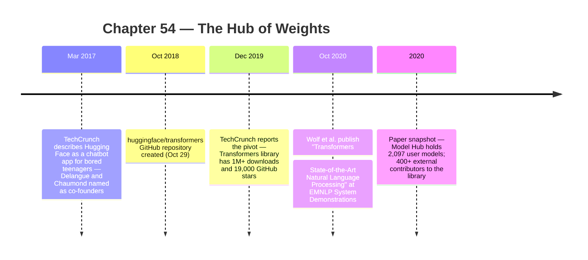

:::tip[In one paragraph]
Hugging Face began as a 2017 chatbot app for bored teenagers, then pivoted. The October 2018 `huggingface/transformers` repository grew into a library that turned BERT, GPT-2, and dozens of other Transformer architectures into shared infrastructure: tokenizer + base model + task head, loaded from a canonical name through Auto classes. By the 2020 EMNLP paper, the Model Hub held 2,097 user models with 400+ external contributors. The trained checkpoint became a software-package-like artifact.
:::

<strong>Cast of characters</strong>

| Name | Lifespan | Role |
|---|---|---|
| Clement Delangue | — | Hugging Face co-founder and CEO; named in the 2017 TechCrunch chatbot-app coverage and the 2020 Transformers paper coauthor list |
| Julien Chaumond | — | Hugging Face co-founder; named in the 2017 chatbot coverage; coauthor of the 2020 Transformers paper |
| Thomas Wolf | — | First author of the 2020 EMNLP "Transformers: State-of-the-Art Natural Language Processing" paper; central technical protagonist for the library and Model Hub |
| Lysandre Debut | — | 2020 Transformers paper coauthor; library implementation team |
| Victor Sanh | — | 2020 Transformers paper coauthor; led DistilBERT, an example of model compression on the Hub |
| Alexander M. Rush | — | 2020 Transformers paper coauthor; "Annotated Transformer" (Ch51 reference) brings the academic-pedagogy continuity |

<strong>Timeline (2017–2020)</strong>

<strong>Plain-words glossary</strong>

**Model checkpoint** — A serialized snapshot of all trained parameters of a model. Distinct from source code: the *weights file* carries the expensive learning result; without it, the architecture is empty. The checkpoint plus its tokenizer plus its config plus its task head is the runnable artifact.

**Tokenizer (model-specific)** — The pipeline that converts raw text into the integer IDs the model expects. BERT's WordPiece, GPT-2's byte-level BPE, and SentencePiece variants are not interchangeable: a model trained against one tokenizer breaks if loaded with another. The tokenizer is a *companion artifact* to the weights, not a preprocessing footnote.

**Task head** — A small output layer that adapts a base model to a specific task: classification, token labeling, span prediction, generation. The Transformers library kept the *base model + head* relationship explicit so one pre-trained encoder could serve many task layouts.

**Auto classes** — `AutoTokenizer`, `AutoModel`, `AutoModelForSequenceClassification`, etc. — convenience classes that read a model's config file and instantiate the right architecture-specific class for that name. Make `from_pretrained("bert-base-uncased")` work the same way `from_pretrained("gpt2")` does.

**Model Hub** — Hugging Face's web platform where models live as named, versioned repositories with metadata, downloads, and (later) live inference widgets. The 2020 paper's snapshot of 2,097 user models is historical; the Hub now holds millions.

**Model card** — A documentation file accompanying a model, describing what it was trained on, what tasks it is intended for, known limitations, biases, license, and citation. Origin: Mitchell et al. 2019 "Model Cards for Model Reporting." Distribution proximity (the card sits on the model page) is what makes the convention practical.

**Live inference widget** — An interactive box on a Hub model page that lets a visitor send input and receive output without writing code. Blurs the boundary between "this model exists" and "I just used it"; foreshadows the Spaces / hosted-demo layer that follows.

GPT-3 made the prompt feel like a new interface to intelligence, but the model itself remained a hard object to reproduce. A paper can describe an architecture. A blog post can show examples. A checkpoint can carry the expensive result of training. None of those artifacts automatically become easy to find, load, compare, fine-tune, cache, deploy, or trust. After BERT, GPT-2, and the first wave of Transformer systems, the next bottleneck was not only invention. It was circulation.

The field needed a way to treat trained weights less like isolated research debris and more like software packages. A user who wanted to try a model needed the right architecture, tokenizer, vocabulary, configuration, task head, framework, and weight file. If any one of those pieces mismatched, the model might fail to load or produce meaningless output. The paper result was not the same as a runnable system. The checkpoint was not the same as an ecosystem.

This was especially true for Transformer models because they were similar enough to invite comparison and different enough to punish carelessness. A BERT checkpoint expected one kind of tokenizer and input representation. A GPT-style model expected another. A multilingual model could have still different vocabulary and preprocessing assumptions. A sequence-classification model needed an output head that a base encoder did not provide. A generation model needed decoding behavior that a classifier did not need. Reuse required matching all of these parts.

Hugging Face became important because it attacked that practical layer. It did not invent BERT, GPT-2, pre-training, or the Transformer. It did not make training frontier models cheap. It did not guarantee that every shared model was safe, well documented, licensed cleanly, or production-ready. Its contribution was more infrastructural: it lowered the friction of reusing models that already existed and made model weights easier to distribute as shared artifacts.

That is a different kind of historical importance from a benchmark breakthrough. A benchmark paper changes what researchers believe is possible. A hub changes what people can do on Monday morning. It gives names to models, conventions to files, code paths to loading, metadata to model pages, and social surfaces for reuse. It turns a trained checkpoint from something you hear about into something you can attempt to run.

The company did not begin as the obvious infrastructure layer for modern NLP. Contemporary coverage in 2017 described Hugging Face as a consumer chatbot app, an artificial friend aimed at casual conversation and entertainment. The public story at that point was not "the definitive natural language processing library." It was a digital companion, a playful chat product, a company facing users rather than researchers.

By late 2019, the public framing had changed. TechCrunch described Hugging Face as having moved from an artificial-BFF chatbot app toward building an open-source NLP library, and reported that the Transformers library had over a million downloads and 19,000 GitHub stars at the time. Those numbers should stay as a 2019 reported snapshot, not be updated into current adoption mythology. The important point is the documented pivot: a company once covered as a chatbot app was now being covered as infrastructure for natural language processing.

The documented story is enough. The company had a consumer chatbot origin. The `huggingface/transformers` repository was created in October 2018. By 2019, contemporary reporting framed the open-source NLP library as the center of the company story. By 2020, the Transformers paper presented a broad software system for distributing, fine-tuning, deploying, and compressing pretrained Transformer models.

Many infrastructure shifts look obvious only after they work. The public record shows a company associated with a chatbot app becoming associated with a library that researchers and engineers were downloading at scale, and that library then maturing into a paper-worthy system around model reuse.

That shift fits the broader AI history because model reuse was becoming a systems problem. BERT showed how valuable a released checkpoint could be. GPT-2 made model release itself a governance question. GPT-3 showed that scale could turn a single model into a broad prompt interface, but also made full replication harder. Between those poles sat the practical question: for the models that can be shared, how do people actually share them?

The Transformers library answered with an adapter layer. The 2020 EMNLP system paper describes an open-source library that provided state-of-the-art Transformer architectures under a unified API, backed by pretrained models available to the community. The goal was not just to list models. It was to make different model families usable through common abstractions.

The core abstraction is simple enough to explain: tokenizer, base Transformer model, and task head. The tokenizer turns text into the IDs the model expects. The base model computes representations or next-token predictions depending on the architecture. The task head adapts the base model to a task such as classification, token labeling, question answering, or generation. This separation matters because many model families share a broad workflow while differing in details. A user should not have to rewrite the entire pipeline every time the model name changes.

The library's Auto classes made that idea concrete. Instead of manually selecting every architecture-specific class, a user could load an appropriate tokenizer or model from a pretrained name. The model's configuration and files told the library what to instantiate. That is a package-like behavior. The name of the artifact becomes a route to the right code and weights.

This does not erase model differences. A unified API is not a claim that every architecture is the same. It is a claim that common actions can be made predictable: load a tokenizer, load a model, prepare inputs, attach a head, fine-tune, run inference, save, reload. The individual model still has its own limits and assumptions. The abstraction reduces boilerplate around the shared workflow.

This is easy to underestimate because a successful abstraction disappears when it works. A two-line load is not intellectually impressive in the same way as a new attention mechanism. But that is exactly why it matters. If a model can be loaded with a stable convention, it becomes easier to test, compare, teach, fine-tune, and integrate. The field moves faster not only because the models are better, but because the distance from model announcement to local experiment gets shorter.

That shortened distance changed the audience for new models. A paper could be read by specialists, but a library example could be run by a much wider group: graduate students, platform engineers, startup teams, educators, and researchers outside the originating lab. Lowering the cost of first contact broadens the set of people who can inspect a model.

The adapter layer also bridged frameworks. The Transformers paper emphasizes PyTorch and TensorFlow availability and interoperability. The legacy v4.0.1 documentation describes deep interoperability between TensorFlow 2.0 and PyTorch and presents the library as a way for researchers to share trained models rather than always retraining. This mattered because framework choice had become a real fault line. A model implemented only in one stack could be awkward for teams invested in another. A shared library could reduce that friction.

Interoperability also helped keep the model, rather than the framework, at the center of the story. If a trained checkpoint could travel across common research stacks, then the artifact had a more durable identity. It was no longer only "the PyTorch implementation" or "the TensorFlow implementation." It could be a named model with multiple loading paths. That is exactly the kind of shift that makes weights feel like infrastructure.

The paper also situates Transformers among other tools rather than pretending Hugging Face acted alone. It compares the library to Torch Hub, TensorFlow Hub, AllenNLP, Fairseq, OpenNMT, Texar, Megatron-LM, Marian NMT, spaCy, Stanza, and others. That context is important. Hugging Face did not create the idea of machine-learning tooling from nothing. Its specific role was to combine domain-specific NLP support, unified model APIs, pretrained weights, task heads, model sharing, and deployment pathways around the rapidly growing Transformer ecosystem.

Tokenization was part of the same infrastructure story. Models are not interchangeable if their tokenizers are mismatched. A BERT-style model, a GPT-style model, and a multilingual model may each expect different preprocessing, vocabularies, special tokens, and segment conventions. The library's tokenizer layer made this less ad hoc. The model name could pull along the tokenizer that belonged with the weights.

This point connects directly back to the previous chapters. BERT's WordPiece vocabulary was part of the model's input format. GPT-2's byte-level BPE was part of its ability to process broad strings. A hub that distributes weights without the matching tokenizer is distributing an incomplete artifact. The model's learned parameters were trained against a particular text-to-token pipeline. If that pipeline changes, the numbers flowing into the model no longer mean the same thing.

The tokenizer therefore became part of the package. It was not a preprocessing footnote that each user could improvise. It was a companion artifact to the model. This is one of the quiet ways model sharing differs from sharing ordinary source code. The code may be readable, but the trained weights only make sense when their surrounding files and conventions are preserved.

Task heads gave reuse another layer. A base language model might be useful for many downstream tasks, but a classification problem, a token-classification problem, and a question-answering problem have different output shapes. The Transformers abstraction kept the base model and head relationship visible. That made fine-tuning feel more like choosing a variant in a system than hand-building a new architecture for every benchmark.

The head abstraction also helped explain why pretrained models were not finished applications. A base encoder can represent text, but a user still has to decide what task is being solved and how outputs should be interpreted. The library could provide common heads and examples, but the downstream problem remained real. That distinction kept the infrastructure honest: reuse reduces friction; it does not remove the need for task design.

The Model Hub extended the pattern from code to distribution. In the 2020 paper's snapshot, the Model Hub held 2,097 user models. That number should be treated as historical, not current. Its importance is that the hub already existed as a community distribution mechanism by the time the paper was written. Models could have canonical names, model pages, metadata, model cards, citations, datasets, caveats, live inference widgets, benchmark links, and visualizations.

The canonical name is a small but powerful device. A model with a stable name can be referenced in code, documentation, examples, and discussions. A user can load it, cache it, and share instructions that others can repeat. The paper's example using FlauBERT shows the shape: one call loads the tokenizer, another loads the model. The point is not a marketing claim about "three lines of code"; it is that the hub and library together made download, cache, and run behavior part of a common workflow.

Names also make comparison possible. If two papers, tutorials, or bug reports refer to the same canonical model name, they can coordinate around the same artifact rather than around vague descriptions. A phrase like "a BERT model" is not enough. Which BERT? Which tokenizer? Which checkpoint? Which fine-tuning head? The hub's naming conventions did not eliminate ambiguity, but they reduced it. They gave the ecosystem handles.

Those handles mattered as model variants multiplied. The Transformer era did not produce one universal checkpoint. It produced base models, large models, distilled models, multilingual models, domain-specific models, fine-tuned models, and experimental derivatives. Without a distribution layer, that variety becomes noise. With a hub, variety can become a searchable space of artifacts, each with its own files and page. The problem shifts from finding whether a model exists at all to deciding which model is appropriate.

The model page then became a new kind of research surface. A paper might tell you the method. A repository might give you code. A model page could gather the trained artifact with metadata and documentation. Model cards were especially important because weights alone do not explain what a model was trained on, what it is intended for, where it may fail, or what caveats users should consider. The hub could not force perfect documentation, but it created a place where documentation could live next to the artifact.

That proximity matters. If documentation lives far away from the weights, users can miss it or treat the model as a generic black box. If the model card is attached to the page that distributes the checkpoint, caveats become part of the expected workflow. A user still has to read and respect them. The hub cannot make that happen automatically. But it can make the absence of documentation more visible and the presence of documentation easier to find.

Model cards also changed the moral shape of distribution. Releasing a model is not only a technical act. It invites other people to use the artifact in contexts the original authors may not control. Metadata, citations, datasets, caveats, and intended-use notes are part of the social obligation around that invitation. They do not solve misuse, but they acknowledge that a model is more than a file.

Live inference widgets added another layer of immediacy. A model could be tried from a page, not only through a local script. That did not make the result authoritative or production-safe. It did make model behavior more inspectable and demo-friendly. The path from "this model exists" to "I can send it an input" became shorter.

The widget also blurred the boundary between repository and application. A repository traditionally stores artifacts. An inference widget lets the artifact perform. That is a small preview of the later AI platform stack, where models, demos, datasets, spaces, leaderboards, and deployment services begin to cluster around the same ecosystem. In 2020, live inference widgets existed on model pages. Model distribution was becoming interactive.

Caching mattered for the same reason. If model files are large, repeated downloads are wasteful and brittle. A library that knows where to fetch a model and how to cache it turns a remote artifact into a local dependency. This is infrastructure work, not headline science. But without it, open weights remain difficult to use at scale. A hub of weights requires a logistics layer.

:::note
> The concept of providing easy caching for pretrained models stemmed from AllenNLP (Gardner et al., 2018).

This lineage matters: Hugging Face's packaging layer borrowed caching practice from AllenNLP while extending it into a hub-and-library distribution workflow. — *Wolf et al. 2020, "Transformers: State-of-the-Art Natural Language Processing," §2 Related Work, p. 39.*
:::

Fine-tuning fit naturally into that logistics layer. A user could start from a shared checkpoint, attach or select the appropriate head, and adapt it to a downstream task. The important change was not that fine-tuning became trivial. It was that fine-tuning could begin from a standardized loading path rather than a custom reconstruction of a paper's artifacts. The system made the first steps repeatable.

Deployment pathways pushed the system beyond notebooks. The Transformers paper mentions TorchScript, TensorFlow serving options, ONNX, JAX/XLA, TVM, and CoreML as routes toward production or intermediate formats. That list should not be overread as a guarantee that every model could be deployed easily everywhere. It shows that the library's ambition extended from research use to the transition toward production environments.

The production bridge is crucial because model reuse does not end at an experiment. A team that proves a model works in a notebook still has to serve it, compress it, monitor it, and fit it into existing systems. The Transformers paper explicitly includes deployment and compression in the broader support story. That does not mean Hugging Face solved all of production ML. It means the library acknowledged that pretrained models had to travel from research code toward operational settings.

Compression belongs in that same sentence because model size affects who can run a system. A checkpoint that loads in a research environment may be too large, slow, or costly for a particular application. The Transformers paper treats compression as part of the practical support surface, not as a separate theoretical achievement. That framing is important: a hub of weights is useful only if weights can move toward real constraints.

This is where Hugging Face's importance becomes clearer. The company and community were not merely collecting files. They were standardizing the path from named model to loaded object to task-specific use to possible deployment. Each step had its own complications, but the path existed. The ecosystem made reuse a normal expectation.

The hub also changed the social life of models. A trained model could be uploaded by a user, discovered by another user, fine-tuned into a derivative, compared with alternatives, and discussed through documentation and examples. That did not mean all models were equal. It meant the artifact had a place in a shared system. The model became a participant in a repository culture.

Repository culture also changes incentives. If a model can be named, linked, and reused, releasing it becomes a way to participate in the field. A research group can make its work easier to evaluate. A practitioner can publish a fine-tuned checkpoint. A company can distribute a model with documentation. The hub supplies a common surface where those acts can be seen. Not every community member used it, and not every release was high quality. The infrastructure made this form of participation easier.

The 2020 paper's case studies point in that direction. It describes external users and integrations as part of the system's evidence. The Model Hub contained thousands of user models. That is not just a popularity metric; it shows that the system was already operating as a shared layer rather than a private internal tool.

Current Hugging Face Hub documentation describes models, datasets, and spaces as Git repositories, with version control and collaboration as core elements. That present-day framing should not be projected backward into every 2020 detail, but it clarifies the direction. Model sharing was borrowing practices from software sharing: names, repositories, revisions, metadata, downloads, and community contributions.

Version control matters differently for models than for ordinary code. A change in weights can alter behavior even when the interface looks the same. A change in tokenizer files can break compatibility. A change in configuration can alter how a model loads. Treating model artifacts as repository objects gives the ecosystem a way to reason about revisions, not only names.

This is why "GitHub for AI" is tempting as a metaphor, but it should not be taken as a literal description or a complete explanation. GitHub hosts code; a model hub hosts large artifacts, configurations, tokenizers, datasets, metadata, and sometimes interactive demos. The analogy captures the repository culture, but the technical object is different. A model repository must preserve the relationship among architecture, tokenizer, weights, license, task, and documentation.

Hugging Face lowered friction, but it did not erase power. Large pre-training still required money, data, hardware, and expertise. A model on the hub could still be biased, brittle, poorly documented, wrongly licensed, unsafe for a use case, or unsuitable for production. Loading a model is not the same as understanding it. A live widget is not the same as validation. A model card is only useful if it is accurate and read.

Licensing is a good example of the remaining burden. The hub can place license metadata near the artifact, but it cannot make a user understand whether a model is appropriate for a commercial product, a classroom demo, a research benchmark, or a sensitive domain. Data provenance creates a similar burden. A model card may describe datasets and caveats, but the underlying training data can still contain bias, private information, copyrighted material, or domain gaps. Distribution infrastructure can surface those questions. It cannot answer all of them automatically.

Quality is another remaining burden. A model with many downloads is not necessarily the right model. A model that performs well on one benchmark may fail under domain shift. A model that runs in a widget may be too slow, expensive, unstable, or risky for production. The hub makes comparison easier, but comparison still requires judgment. The Model Hub did not solve access to AI. It made access more operational; it did not make evaluation optional.

The open ecosystem also did not end corporate advantage. Companies with more compute could still train larger models. Labs with better data pipelines could still create stronger checkpoints. Cloud providers and large AI labs could still control serving infrastructure. What changed was the floor for reuse. A researcher, student, or engineer could start from shared models more easily than before. The hub made participation broader without making the playing field flat.

The same duality appears in deployment. The library could point toward TorchScript, TensorFlow serving, ONNX, CoreML, and other paths, but a production system still had to handle latency, memory, batching, hardware utilization, monitoring, fallback behavior, and user-facing failure modes. A standard loading API is the beginning of operationalization, not the end. The difference is that teams no longer had to solve every packaging problem before discovering whether a model was useful.

That saved attention for higher-level questions. Is this model appropriate for the domain? Does the tokenizer handle the relevant language or symbols? Is the license compatible with the planned use? Are the caveats acceptable? Does the model fit the hardware envelope? Distribution infrastructure cannot answer these questions automatically, but it can move the user past file archaeology and into evaluation sooner.

That shift is easy to miss because it is not a single capability jump. It is a reduction in wasted motion. Less time reconstructing artifacts means more time testing behavior, comparing alternatives, and deciding whether a model should be used at all.

That distinction matters for the next chapter. Once models could be shared, loaded, and compared more easily, the incentive to train bigger and better models became more visible. If a stronger checkpoint could circulate through a hub, its impact could extend beyond the team that trained it. At the same time, if the strongest models became too expensive to train openly, distribution would split between open hubs and closed APIs.

That split became one of the defining tensions of the foundation-model period. Hubs made open and shared checkpoints more useful. Closed labs made very large models available through controlled interfaces. Both approaches relied on infrastructure. One emphasized repositories, downloads, and community reuse. The other emphasized hosted access, centralized serving, and product control. Chapter 54 sits before that divide fully hardens, but it shows why the divide mattered: model distribution had become a strategic layer.

The history of modern AI is therefore not only the history of algorithms or scale. It is also the history of packaging. BERT's weights mattered because they could be reused. GPT-2's release mattered because weights could be withheld or staged. GPT-3 mattered because a giant model could expose many tasks through prompts. Hugging Face mattered because it made the practical circulation of models into an ecosystem.

This packaging layer also affected education. A student learning modern NLP could load a real pretrained model instead of reading only a diagram. A teacher could demonstrate the difference between tokenization, base models, and task heads. A small team could test whether a model family fit a problem before committing to a larger training or deployment effort. The documented loading, caching, and model-page workflow changed who could get hands-on experience with the artifacts.

The same lower friction increased responsibility. If more people can load powerful models, more people can misuse them, misunderstand them, or deploy them carelessly. The solution is not to pretend friction is safety. It is to pair reuse infrastructure with documentation, evaluation, licenses, and norms. The Model Hub was part of that pairing, not a final answer. It made the artifact easier to reach and made some context easier to attach, while leaving hard governance questions open.

The honest ending is modest but consequential. Hugging Face did not solve access to artificial intelligence. It did not guarantee quality, safety, legality, or fairness. It did not remove the cost of training frontier systems. But it helped make Transformer weights behave more like shared infrastructure for researchers, educators, and builders working across many different institutions. A model could have a name, a page, a card, a tokenizer, a loading path, a cache, a task head, and a community around it. That was enough to change the everyday practice of AI.

:::note[Why this still matters today]
Hugging Face is still THE central distribution layer for open-weights models — Llama, Mistral, DeepSeek, Qwen, Gemma, and most fine-tuned derivatives flow through it. The model-card convention is now industry-standard; almost every model release includes one. The packaging discipline (canonical name → tokenizer + config + weights + card) is now followed by Ollama, llama.cpp, GGUF tooling, and modern model registries. The hub-vs-API divide the chapter foreshadows is the central tension of 2026: open-weights communities on the Hub vs. closed frontier models accessible only through serving endpoints.
:::
