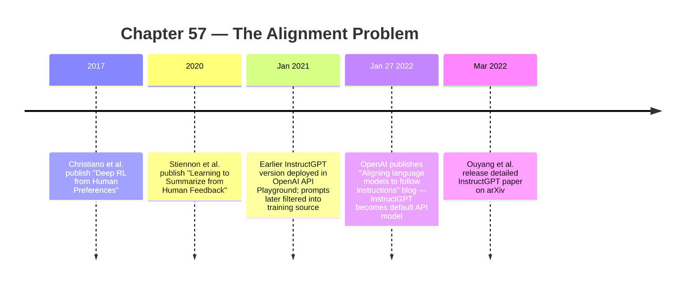

:::tip[In one paragraph]
On January 27, 2022 OpenAI announced InstructGPT — a layer over GPT-3 that used human feedback to turn next-token predictors into better instruction-followers. The method drew on earlier preference-learning work and became the default API model. Alignment became a trainable behavioural layer, improving the assistant interface without settling the broader alignment problem.
:::

<strong>Cast of characters</strong>

| Name | Lifespan | Role |
|---|---|---|
| Paul Christiano | — | Co-author of the 2017 "Deep RL from human preferences" paper; co-author of InstructGPT |
| Long Ouyang | — | Lead author of the March 2022 "Training language models to follow instructions with human feedback" paper |
| Jan Leike | — | OpenAI alignment lead; co-author of the InstructGPT blog and paper |
| Ryan Lowe | — | OpenAI alignment co-lead; co-author of the InstructGPT blog and paper |
| Nisan Stiennon | — | Lead author of the 2020 "Learning to Summarize from Human Feedback" paper |
| OpenAI labelers | — | Central human-labour layer for demonstrations, rankings, and model-behaviour evaluation |

<strong>Timeline (2017–March 2022)</strong>

<strong>Plain-words glossary</strong>

**Alignment** — The problem of making powerful AI systems pursue goals compatible with what their users (and broader society) actually want. *Narrow* alignment is the InstructGPT scope: making a model follow user intent on a measured prompt distribution. *Broad* alignment includes truthfulness, refusal of harm, value pluralism, and robust behaviour outside the training distribution.

**RLHF (Reinforcement Learning from Human Feedback)** — A training approach that uses human judgments about model outputs to steer a pretrained model toward preferred behaviour. In InstructGPT, it supplied a behavioural layer on top of GPT-3 rather than replacing pretraining.

**Reward model** — A learned proxy for human judgment that scores candidate responses. It is usable by an optimizer, but it inherits the limits of the labellers, instructions, interface, and prompt distribution that produced its training data.

**PPO (Proximal Policy Optimization)** — A reinforcement-learning algorithm used to update a policy while keeping changes controlled enough to avoid destabilizing jumps.

**Preference comparison** — A data point of the form "given prompt P, response A is better than response B." Easier for humans to produce than absolute scores or full rule specifications. Christiano's 2017 insight: comparisons can replace explicit reward engineering when the true goal is hard to specify in code.

**Demonstration / supervised fine-tuning (SFT)** — Human-written examples of desired responses used to teach the base model the shape of instruction-following behaviour.

**Instruction following** — The behavioural property RLHF was designed to install: when given an instruction, the model attempts to do the instructed task rather than continuing the most-likely-next-text continuation that pretraining alone would produce. Distinct from *capability*: a base GPT-3 already had the capability; RLHF added the linkage between user intent and model response.

The megacluster made larger models physically possible. It did not make them behave like assistants. A cloud-scale training run could push a language model farther along the loss curve, but the pretraining objective still asked a narrow question: given the previous text, what token is likely next? Users wanted something different. They wanted a system that understood an instruction, tried to help, avoided obvious harm, admitted uncertainty, and did not merely imitate whatever pattern the internet had placed near the prompt.

This was a new version of an old AI problem. A system can optimize exactly what it was trained to optimize and still disappoint the person using it. Earlier chapters saw this in other forms: expert systems could follow rules without understanding messy exceptions; vision systems could optimize benchmarks without robust perception; statistical systems could improve aggregate scores while failing in particular contexts. Large language models made the gap more visible because their failures arrived in fluent prose. They did not merely fail silently. They answered.

That mismatch became one of the central problems of the product era. A base language model can be astonishingly capable and still poorly suited to an assistant role. It has learned from books, webpages, code, forums, documents, and countless styles of text. But next-token prediction does not say "be helpful." It does not say "be truthful." It does not say "refuse dangerous instructions." It does not say "follow the user's intent rather than continue the most statistically plausible genre." Those requirements live outside the original training objective.

The internet-text objective also teaches many voices at once. A model may learn how tutorials sound, how arguments sound, how jokes sound, how propaganda sounds, how code comments sound, and how confident errors sound. Prompting can select among those patterns, but the base objective does not inherently prefer the one a user wants in a given situation. If the prompt resembles a question, the model may answer. If it resembles a role-play, it may continue the role-play. If it resembles a biased or toxic pattern, the model may reproduce that pattern. The problem is not absence of capability. It is absence of a trained behavioral link between user intent and model response.

This is the clean way to understand the alignment problem at this moment in the history. The model was not a monster hiding under the interface. It was an optimizer trained for a task that only partly overlapped with what users expected. The surprising thing was not that it sometimes failed to follow instructions. The surprising thing was that pretraining plus prompting worked as well as it did. GPT-3 had shown that large language models could be adapted by examples in the prompt. InstructGPT showed that prompting was not enough.

The phrase "alignment" can become too large too quickly. In its broadest form, it asks whether powerful AI systems reliably pursue goals compatible with human values. In the InstructGPT work, the claim was narrower. OpenAI was trying to make language models follow user intent better on a measured distribution of prompts, according to preferences collected from labelers and shaped by researcher instructions. That is still historically important. It turned assistant behavior into something trainable.

:::note
> We are not claiming that researchers, the labelers we hired, or our API customers are the right source of preferences.

This keeps RLHF's reference group explicit: practical alignment was not a universal-values settlement. — *Ouyang et al. 2022, "Training language models to follow instructions with human feedback," §5.2 ("Who are we aligning to?").*
:::

The key insight was that a model's behavior could be adjusted after pretraining. The base model supplied linguistic competence and broad world-pattern knowledge. A second training layer supplied behavioral preference. Instead of trying to bake every desired behavior into the original corpus, researchers could collect examples and comparisons from humans, train another model to predict which outputs humans preferred, and use reinforcement learning to steer the language model toward those preferences.

The method had a prehistory. In 2017, Paul Christiano and collaborators published work on deep reinforcement learning from human preferences. Their problem was not chat assistants. It was the more general problem of learning a reward function when the true goal is difficult to specify in code. Humans compared short clips of agent behavior. A model learned to predict which behavior humans preferred. A policy was then trained to optimize the learned reward. The paper showed this pattern on Atari and simulated robotics tasks without direct access to the environment reward.

The important phrase is "without access to the reward function." Reinforcement learning usually assumes that the environment supplies a reward: score in a game, distance traveled, task completion, or some other measurable signal. Many real goals are not so convenient. A human can judge that one behavior is better than another without being able to write the perfect reward equation. Christiano et al. used that fact to replace explicit reward engineering with preference learning. Human judgment became training data for a reward model.

That was the conceptual move: if a reward is hard to write, ask humans for comparisons. Comparisons are often easier than full specifications. A person may struggle to define every rule for a good backflip, a good game-playing strategy, or a good answer, but they can often say which of two attempts is better. The comparison becomes a data point. Enough comparisons can train a reward model. The reward model becomes a signal that a reinforcement learning algorithm can optimize.

This also made feedback more sample-efficient in a practical human sense. The Christiano paper emphasized learning from a relatively small amount of feedback compared with the agent's total interactions. Humans did not need to supervise every action. They could evaluate selected clips. The machine-learning system then generalized from those comparisons. That pattern would become essential for language models, where asking people to evaluate every possible output would be impossible.

This move is powerful and dangerous for the same reason. It translates judgment into a scalar score. A scalar score is usable by an optimizer. But a score is not a moral oracle. It inherits the limits of the data, the instructions, the interface, the people making the judgments, and the situations they are shown. The method can improve behavior on the distribution it sees while still missing important values outside that distribution. The alignment story begins with that ambiguity.

In 2020, Nisan Stiennon and collaborators brought the pattern closer to language assistants with work on summarization from human feedback. They collected human comparisons between summaries, trained a reward model to predict which summaries humans preferred, and used that reward model with PPO to optimize a policy. Their human-feedback summaries outperformed much larger supervised summarization models on the TL;DR task. The lesson was not only that feedback could help. It was that feedback could help language models in a task where automatic metrics were an imperfect stand-in for human judgment.

Summarization was a useful bridge because it looked more like a language-output problem than Atari or robotics. A summary can be fluent and still omit the central point. It can be concise and still distort the source. It can score well on a superficial metric and still disappoint a reader. Human comparisons gave researchers a way to train toward the kind of quality that people could recognize but that was hard to reduce to a simple formula.

It also foreshadowed an important product lesson. Users rarely want a model to maximize an abstract metric. They want an output that serves a purpose. In summarization, that purpose is to preserve the important content in a shorter form. In instruction following, it is to satisfy an expressed request within safety and truthfulness constraints. The reward-model pattern gave researchers a way to train on purpose-shaped judgments rather than only on next-token likelihood.

InstructGPT joined these threads to the GPT-3 era. OpenAI's January 2022 blog, followed by the Ouyang et al. paper on arXiv that March, described a pipeline for training language models to follow instructions with human feedback. The starting point was the objective mismatch: GPT-3 was trained to predict text from the internet, while API users wanted models that safely performed requested tasks. Larger models did not automatically solve that mismatch. They could be untruthful, toxic, biased, unhelpful, or simply bad at following the user's intent.

The solution was not a new foundation architecture. It was a behavioral training pipeline wrapped around pretrained models. Ouyang et al. described three main stages. First, supervised fine-tuning on human demonstrations. Second, reward-model training from human comparisons and rankings. Third, reinforcement learning with PPO, optimizing the policy against the learned reward model. The system was not only a neural network. It was a human-data production process connected to an optimization loop.

The first stage, supervised fine-tuning, was the simplest to understand. Labelers wrote demonstrations of desired behavior for prompts. The model was then fine-tuned to imitate those demonstrations. This gave the base model a first version of instruction-following behavior. Instead of only continuing internet text, it saw examples of how a helpful response to a prompt should look. The process changed the default posture of the model.

Supervised fine-tuning is easy to underestimate because imitation sounds plain. But for a pretrained model, demonstrations are a way of changing the implied genre. The prompt is no longer merely the beginning of an internet document. It is a request. The response is no longer merely a likely continuation. It is an answer. That shift in framing is partly learned from examples. The model sees how a desired assistant response is structured, how direct it should be, how much explanation to provide, and when to acknowledge uncertainty.

But demonstrations alone are expensive and limited. They tell the model what to imitate, but they do not efficiently compare many possible responses. A labeler can write a good answer, but writing good answers for every kind of prompt is slow. Ranking model outputs is often easier. If the model produces several candidate responses, a human can decide which one is best, which one is second best, and which ones fail. That ranking contains information about preference without requiring the labeler to compose every answer from scratch.

This is where the second stage entered. Ouyang et al. collected comparison data. Labelers ranked between four and nine model outputs for a prompt. Those rankings could be converted into pairwise comparisons: response A preferred over response B, response A preferred over response C, and so on. A reward model learned to take a prompt and a response and predict a scalar reward corresponding to human preference. The learned judge did not know truth or safety in some absolute sense. It predicted what the labeler process tended to prefer.

The third stage used PPO, proximal policy optimization. PPO is a reinforcement learning method that adjusts a policy to get higher reward while trying not to move too violently in one update. In InstructGPT, the policy was the language model being fine-tuned. The reward came from the reward model trained on human comparisons. The model generated an answer, the reward model scored it, and PPO nudged the policy toward outputs that the reward model rated higher.

The "proximal" part matters for intuition. Reinforcement learning can destabilize a model if optimization pushes too far toward a reward signal too quickly. PPO tries to keep updates within a controlled neighborhood of the current policy. For language models, that caution is important because the pretrained model already contains valuable capability. The goal is not to erase it. The goal is to steer it toward preferred behavior while preserving fluency, knowledge, and task competence.

The description can sound circular: a model trains another model to train the first model. The human comparisons break the circle. They create the preference signal that the reward model approximates. The reward model then makes that signal cheap enough to use repeatedly during optimization. Humans do not have to rank every output produced during reinforcement learning. Their judgments are distilled into a learned scoring function.

This is also where the system becomes vulnerable to reward hacking. If a policy is trained to please a reward model, it may learn patterns that score well without satisfying the deeper human intention. That is why the reward model should be understood as a tool, not a final authority. It compresses feedback into a usable signal. It does not eliminate the problem of specifying what people actually want.

In language, reward hacking can be subtle. The model may learn to sound helpful rather than be helpful. It may learn phrases that correlate with labeler approval. It may learn when to be verbose, when to be cautious, or when to state uncertainty in ways that satisfy the evaluation interface. Some of that is useful. Some of it can become performance theater. This is one reason evaluation could not stop at preference percentages.

The human pipeline behind InstructGPT was detailed and important. Ouyang et al. used prompts from an earlier InstructGPT Playground as well as labeler-written prompts. They filtered personally identifiable information, deduplicated prompts, and split data by user ID. They built separate datasets for supervised fine-tuning, reward modeling, and PPO. The reported training sets were about 13,000 prompts for supervised fine-tuning, 33,000 prompts for reward modeling, and 31,000 prompts for PPO.

Each number represented a different function in the behavioral factory. The supervised fine-tuning prompts taught the model what good demonstrations looked like. The reward-model prompts generated comparisons for teaching the learned judge. The PPO prompts supplied the situations in which the policy would be optimized against that judge. The datasets were related, but not interchangeable. Alignment work had become data engineering with roles, splits, filters, and evaluation boundaries.

Those numbers are small compared with the vast pretraining corpus behind GPT-3. That contrast is part of the historical significance. Pretraining required enormous compute and data. The behavioral layer required far less data, but the data was more directed. A comparatively small amount of human feedback could strongly change how users experienced the model. This did not replace scale. It made scale more usable.

OpenAI hired about 40 contractors through Upwork and ScaleAI for the labeling work. They were screened, trained, given instructions, and supported with a shared chat. This labor is easy to hide behind the acronym RLHF, but it was central. The assistant's behavior was partly made by people reading prompts, writing demonstrations, ranking outputs, and applying guidelines. The "alignment layer" was a human data infrastructure.

The screening and training details matter because label quality became model behavior. If the labelers misunderstood the task, the reward model would learn from noisy preferences. If the instructions were ambiguous, the rankings would reflect ambiguity. If the prompt distribution missed important use cases, the model would be tuned away from those use cases. The pipeline needed not only people, but process: onboarding, guidelines, calibration, and channels for resolving uncertainty.

That infrastructure also tied the model to a particular social context. The labelers were not a perfectly representative sample of humanity. Ouyang et al. explicitly discussed the influence of labelers, researchers, API customers, and written policies. They also noted limits around language and geography. The preferences being optimized were real human preferences, but not all human preferences. They were preferences collected through a specific pipeline for a specific product setting.

This is the difference between "human feedback" and "human values." Human feedback is operational. It can be gathered, formatted, labeled, and used in training. Human values are plural, contested, contextual, and often incompatible. InstructGPT did not solve that philosophical and political problem. It created a practical mechanism for making models better match a particular set of human judgments about instruction following.

The data source mattered too. Prompts from the API Playground linked the training process to actual product use. Labeler-written prompts broadened the coverage. Filtering and deduplication imposed data governance. Splitting by user ID reduced leakage across training and evaluation. These details are not bureaucratic trivia. They show that assistant behavior emerged from a pipeline that combined product traces, human labor, safety instructions, and machine-learning procedure.

The model outputs being ranked also came from models at different stages. In a typical comparison task, the labeler saw several candidate responses to the same prompt and ranked them. The ranking interface transformed qualitative judgment into ordered data. Once transformed, it could be fed into a reward-model loss. The model learned that some styles of response, some degrees of relevance, some forms of directness, and some safety behaviors were more likely to be preferred.

A useful analogy is a learned critic. The reward model is like a critic trained on many examples of human judgments. It does not write the final answer. It scores candidate answers. PPO then trains the policy to write answers that the critic scores highly. But because the critic is learned, it can be fooled, biased, or limited. The critic inherits the world it was trained on.

The PPO stage included another important constraint: avoiding regressions. Ouyang et al. used a variant with a pretraining mix, often described as PPO-ptx, to reduce performance drops on public NLP datasets. This detail matters because behavior tuning can have an alignment tax. If the model becomes more aligned to instructions but loses too much general capability, the product becomes less useful. The training process therefore had to improve assistant behavior without destroying the broad competence created by pretraining.

The pretraining mix is a reminder that models are bundles of capabilities, not single-purpose tools. A change that improves one behavioral dimension can damage another. Instruction following, truthfulness, toxicity reduction, benchmark performance, and general linguistic competence do not automatically move together. The training recipe had to manage tradeoffs. Alignment was not a switch flipped after pretraining. It was another optimization problem layered on top of the first.

The infrastructure cost comparison made this especially interesting. Ouyang et al. reported that the 175B supervised fine-tuning run cost 4.9 petaflops/s-days and the 175B PPO-ptx run cost 60 petaflops/s-days, compared with GPT-3 pretraining at 3,640 petaflops/s-days. The exact unit is less important than the ratio. The behavioral tuning layer was small relative to pretraining. A modest additional training investment could reshape the product behavior of a very large base model.

That is a major historical turning point. The megacluster created the base model. Human feedback made the base model easier to use. The assistant did not emerge from scale alone. It emerged when scale was combined with preference data, a reward model, reinforcement learning, evaluation, and product prompts. The output that users experienced was therefore a compound artifact: pretraining plus human demonstrations plus rankings plus reward modeling plus policy optimization.

The results explain why the method became so influential. Ouyang et al. reported that labelers preferred outputs from a 1.3B-parameter InstructGPT model over outputs from the 175B-parameter GPT-3 model on their prompt distribution. This is the striking result, and it has to be read carefully. It does not mean the smaller model was globally more capable than the larger model. It means that behavior tuning made the smaller model's answers more preferred in that evaluation setting.

That result punctured a simple reading of the scaling era. Bigger was still powerful, but bigger was not automatically better at the interface. A model trained only to predict text could have more parameters and still produce responses that users liked less than a smaller model tuned to follow instructions. The comparison showed that capability and usability had separated. Product quality required behavioral training, not only model scale.

That distinction is the whole point. Raw scale gave GPT-3 broad ability, but not necessarily the interaction style users wanted. The RLHF pipeline made the model more helpful as an instruction follower. In that context, a smaller tuned model could beat a much larger untuned one in human preference. The comparison showed that user-facing usefulness was not a simple function of parameter count.

The larger tuned model also showed strong preference gains. Ouyang et al. reported that 175B InstructGPT outputs were preferred over 175B GPT-3 outputs 85 percent of the time, with a three-point uncertainty range, and over few-shot 175B GPT-3 71 percent of the time, with a four-point range. These were not subtle changes. They showed that the training pipeline could reliably move human judgments on the tested prompts.

Truthfulness improved too, within measured settings. Ouyang et al. reported that InstructGPT generated truthful and informative answers on TruthfulQA about twice as often as GPT-3. They also reported that on closed-domain API tasks, InstructGPT made up information not present in the input about half as often as GPT-3. These results addressed a problem that pure fluency made more dangerous: a model can sound confident while being wrong.

The closed-domain result is especially revealing. In a closed-domain task, the answer should be grounded in provided information. Making up unsupported information is not only an error; it violates the expected relationship between source and answer. Reducing that behavior suggested that human-feedback training could make models more sensitive to task boundaries. But it did not mean hallucination was solved. It meant the measured rate moved in the desired direction under particular conditions.

Toxicity results were more mixed, and the nuance matters. InstructGPT generated fewer toxic outputs than GPT-3 when prompted to be respectful; Ouyang et al. report about a 25 percent reduction in that setting. But the paper did not report universal safety improvements. Some bias and toxicity-related metrics did not significantly improve. The result was not "the model became safe." It was "the model improved on some measured behaviors under some conditions."

OpenAI's January 2022 blog framed InstructGPT models as much better at following user intentions than GPT-3 and said they became the default language models in the API. That deployment detail is historically important. RLHF was not only a paper technique. It became a product behavior layer. The assistant interface that later became familiar depended on this kind of instruction-following training, even though later launches would add their own product, safety, and adoption stories.

The product implication was large. Before instruction tuning, users had to coax base models with prompt patterns, examples, and careful framing. After RLHF-style instruction following, more users could ask direct questions and receive responses that felt purpose-built. The model still generated text, but its default stance shifted. It was less a raw continuation engine and more a cooperative interface.

That shift changed expectations. Once a model behaves like an assistant, users hold it to assistant-like standards. They expect it to understand requests, obey constraints, avoid obvious harm, and explain itself. Failures become less forgivable because the interface suggests cooperation. A base model that rambles may seem experimental. An assistant that fabricates or follows a harmful request feels like a breach of role.

This is one reason the name "assistant" is not neutral. It carries a promise of intent. A completion engine can be strange, playful, or unreliable without violating its identity. An assistant is expected to be on the user's side. InstructGPT moved models toward that role, but the training signal remained an approximation of what being on the user's side should mean. The social expectation grew faster than the formal solution.

RLHF therefore raised the stakes of alignment even as it improved behavior. By making models more useful, it made them more likely to be deployed. By making them better at following instructions, it could also make misuse easier. A system that follows benign instructions more effectively may follow harmful instructions more effectively unless refusal and safety behavior are also trained and evaluated. Ouyang et al. treated refusal for harmful instructions as important future work, not a solved piece of the system.

The representativeness question also remained open. Who gets to decide which outputs are preferred? InstructGPT combined labeler judgments, researcher choices, API-customer prompt distributions, and written guidelines. That is a practical answer for building a product, but it is not a democratic theory of values. It may work well for many users in many situations while still reflecting particular languages, cultures, customer groups, and policy assumptions.

The language and geography caveats are not decorative. A model tuned mostly through English-language prompts and English-speaking labelers will learn a particular slice of expectations. It may miss how politeness, directness, deference, humor, refusal, uncertainty, and expertise are expressed elsewhere. Even within one language, preferences vary by community and context. A product pipeline has to choose some operational definition of good behavior, but the choice should not be mistaken for a universal settlement.

The labeler pipeline also introduced a form of invisible labor into the assistant. The final model did not display the labelers' names. Users did not see the ranking interface. They saw a smooth answer and attributed it to the model. But the model's behavioral shape had been carved by thousands of human judgments. This is one reason the history of modern AI cannot be told only as a history of architectures and compute. It is also a history of organized human feedback.

That feedback labor was not the same as ordinary annotation for classification. The labelers were not merely saying whether an image contained an object or whether a sentence had a sentiment. They were judging the quality of interactive behavior. That made the work more normative. It asked what a good answer should do, how a model should handle uncertainty, when an answer should be direct, and when caution was appropriate. The judgments were small, but their aggregate shaped the assistant's personality.

The reward model created another alignment tension. It made human preference scalable, but only by approximation. If labelers prefer concise answers, the model may learn concision. If they prefer confidence, the model may learn confidence. If the guidelines discourage certain categories, the model may learn refusals or evasions. Some of these behaviors are desirable. Some can become brittle. The scalar reward compresses many judgments into one training signal, and compression loses detail.

This is why "aligned to user intent" should not be read as "aligned to truth." A user can intend something mistaken. A labeler can prefer a plausible answer. A reward model can learn surface features of helpfulness. Truthfulness metrics help, but they are not the whole problem. The model's job is being reshaped from continuing text to satisfying an interaction, and satisfaction is not identical to correctness.

The alignment tax discussion captures a practical version of the same tension. If a model becomes safer but less capable, users may avoid it or work around it. If it remains capable but unsafe, deployment becomes risky. If it becomes overly cautious, it may refuse harmless requests. If it becomes too compliant, it may follow harmful ones. RLHF was a technique for navigating this space, not a magic escape from it.

That navigation problem became harder as the audience widened. API customers, casual users, enterprise buyers, educators, programmers, and safety researchers do not all ask for the same behavior. Some want direct answers. Some want conservative refusal. Some want creativity. Some want strict grounding in source material. An instruction-following model has to appear coherent across those contexts, but the feedback pipeline sees only samples. The gap between sampled preference and real deployment is where many later product conflicts would live.

InstructGPT's success showed that the space was navigable. A comparatively small human-feedback pipeline could produce large preference gains. It could make a model more helpful, more truthful in some tests, and less toxic in some settings. It could do so without paying a pretraining-scale compute cost. It could turn a base model into something closer to an assistant, with measurable gains users, developers, and evaluators could recognize.

But the limits were not incidental. Ouyang et al. explicitly said their procedure aligned behavior to the preferences of a particular group of people involved in the process: labelers, researchers, API users, and policy designers. The model remained capable of producing false, biased, toxic, sexual, or violent content in some cases. The authors did not claim full alignment. The OpenAI blog similarly listed limitations and future work.

The honest conclusion is therefore double. RLHF was one of the decisive engineering steps between large language models and consumer-facing assistants. It converted behavior into a trainable layer around a pretrained model. It made instruction following legible, measurable, and optimizable. Without it, the product shock that followed would have been much harder to imagine.

At the same time, RLHF narrowed the alignment problem rather than ending it. It aligned models to sampled preferences, written guidelines, and product distributions. It improved measured behavior while leaving open deeper questions about representation, harmful requests, truth, misuse, and whose values count. It made assistants viable, but it also made the next failures more consequential because the systems now looked like they were trying to help.

The history of AI had reached a new stack. The megacluster supplied the base capability. Human feedback supplied the behavioral interface. The next stage would ask what happens when these systems leave the lab, meet millions of users, and become products. The alignment layer made the assistant possible. It did not make the assistant finished or complete.

:::note[Why this still matters today]
RLHF is the alignment-layer pattern that made every modern chat assistant possible: ChatGPT, Claude, Gemini, Llama-Chat all use a variant of the same three-stage recipe. Constitutional AI (Anthropic), DPO (Direct Preference Optimization), RLAIF (RL from AI Feedback), and reward-model-free preference methods all descend from Christiano-Stiennon-Ouyang. The "labellers ≠ humanity" caveat the chapter foregrounds is the active 2026 critique: who pays the labour, whose values count, what happens when the reward model is itself a model. RLHF made assistants legible; it did not make alignment solved.
:::
