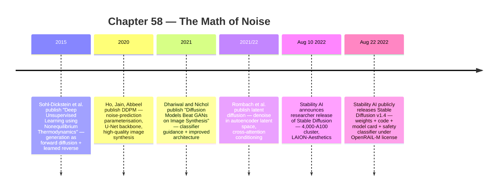
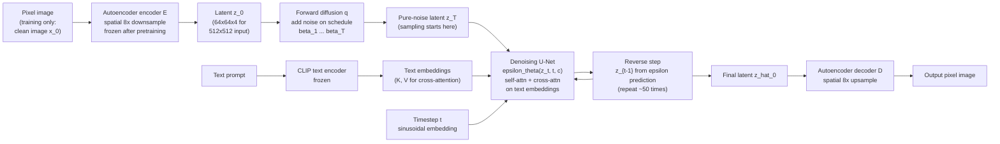

:::tip[In one paragraph]
Image generation crossed a different threshold than text. In 2015, Sohl-Dickstein et al. framed generation as forward diffusion (data → noise) plus a learned reverse diffusion (noise → data). Ho et al. (2020) made the recipe practical with DDPMs and noise-prediction training. Dhariwal and Nichol (2021) beat GANs on benchmarks. Rombach et al. (2021/22) moved denoising from pixel space into a compressed autoencoder *latent* with cross-attention conditioning. On August 22, 2022 Stability AI released Stable Diffusion publicly. Noise had become a medium.
:::

<strong>Cast of characters</strong>

| Name | Lifespan | Role |
|---|---|---|
| Jascha Sohl-Dickstein | — | Lead author of the 2015 nonequilibrium-thermodynamics diffusion paper; physics/Markov-chain origin story |
| Jonathan Ho | — | Lead author of DDPM (2020) and co-author of classifier-free guidance; noise-prediction parameterization |
| Pieter Abbeel | — | DDPM co-author (Berkeley); broader RL/robotics lab context for the diffusion line |
| Prafulla Dhariwal & Alex Nichol | — | OpenAI authors of "Diffusion Models Beat GANs on Image Synthesis" (2021); benchmark-break + classifier guidance |
| Robin Rombach & Patrick Esser | — | Latent-diffusion authors (CompVis/LMU + Runway); compressed-latent shift that feeds Stable Diffusion |
| Stability AI / CompVis / Runway | — | Institutional actors: CompVis built latent diffusion; Stability AI funded the 4,000-A100 training run and published Stable Diffusion v1 |

<strong>Timeline (2015–August 2022)</strong>

<strong>Plain-words glossary</strong>

**Forward diffusion / reverse diffusion** — Two coupled Markov chains. *Forward* gradually corrupts a data sample by adding small amounts of Gaussian noise across many timesteps until the sample is indistinguishable from pure noise. *Reverse* is the learned chain that walks back: given a noisy state and a timestep, produce a slightly less-noisy state. Generation is sampling random noise and running the reverse chain to completion.

**DDPM (Denoising Diffusion Probabilistic Model)** — Ho, Jain, and Abbeel 2020. Specifies the forward chain as fixed-variance Gaussian noise on a schedule, the reverse chain as learned Gaussian transitions, and reparameterizes the training target to *predict the noise* added at each step rather than the clean image directly. This noise-prediction simplification is what made diffusion practical.

**Noise-prediction objective ($\epsilon$-prediction)** — During training, sample a clean image $x_0$, sample noise $\epsilon$, and a timestep $t$; produce the noisy state $x_t$ from a known formula; train the network to predict $\epsilon$. Loss is mean-squared error between predicted and actual noise. At sampling time, the same network's prediction is used to step $x_t \to x_{t-1}$.

**U-Net backbone** — The convolutional encoder-decoder architecture (originally for biomedical segmentation) DDPM used as its denoiser. Combines broad-context downsampling with skip connections that preserve spatial detail; well-suited to image-shape outputs that diffusion needs at every step.

**Classifier guidance / classifier-free guidance** — Two ways to make conditional samples follow a target class or text. *Classifier guidance* uses a separate classifier to push samples toward the desired class. *Classifier-free guidance* (Ho & Salimans) trains conditional and unconditional models jointly and mixes their score estimates at sampling time — the underlying mechanism behind "prompt strength" in modern image generators.

**Latent diffusion** — Rombach et al. 2021/22. Train an autoencoder that compresses an image (e.g., 512×512) into a much smaller latent (e.g., 64×64), then run the diffusion process *in the latent space* rather than in pixels. Cuts compute cost by roughly the spatial-compression factor while preserving perceptual quality. This is what made Stable Diffusion runnable on consumer GPUs.

**Cross-attention conditioning** — The mechanism by which latent diffusion accepts text prompts: text is encoded (CLIP text encoder, in Stable Diffusion v1), then the diffusion U-Net's intermediate layers attend over the text embeddings via cross-attention. Conditioning is mixed in at every layer, not just at the start.

<strong>The math, on demand</strong>

- **Forward diffusion (one step).** $q(x_t \mid x_{t-1}) = \mathcal{N}(x_t;\, \sqrt{1-\beta_t}\, x_{t-1},\, \beta_t \mathbf{I})$ — at timestep $t$, add Gaussian noise with variance $\beta_t$ from a chosen schedule $\{\beta_1, \dots, \beta_T\}$. The mean is shrunk by $\sqrt{1-\beta_t}$ to keep variance bounded as the chain progresses. Source: Sohl-Dickstein et al. 2015 / Ho et al. 2020 §2.

- **Forward closed form (jump to step $t$).** $q(x_t \mid x_0) = \mathcal{N}(x_t;\, \sqrt{\bar{\alpha}_t}\, x_0,\, (1-\bar{\alpha}_t) \mathbf{I})$ with $\alpha_t = 1 - \beta_t$ and $\bar{\alpha}_t = \prod_{s=1}^{t} \alpha_s$. So $x_t = \sqrt{\bar{\alpha}_t}\, x_0 + \sqrt{1-\bar{\alpha}_t}\, \epsilon$ for $\epsilon \sim \mathcal{N}(0, \mathbf{I})$ — the entire forward chain can be sampled in one shot, which is what makes the noise-prediction loss cheap to compute. Source: Ho et al. 2020 §2.

- **Noise-prediction training objective ($L_{\text{simple}}$).** $L_{\text{simple}} = \mathbb{E}_{t, x_0, \epsilon}\!\left[\,\lVert \epsilon - \epsilon_\theta(x_t, t) \rVert^2\,\right]$ — sample a timestep, a clean image, and Gaussian noise; ask the network $\epsilon_\theta$ to predict the noise that was added; minimize squared error. This MSE form is what made DDPMs trainable with standard supervised-learning machinery. Source: Ho et al. 2020 Eq. 14.

- **Reverse step (DDPM ancestral sampling).** $x_{t-1} = \dfrac{1}{\sqrt{\alpha_t}}\!\left(x_t - \dfrac{\beta_t}{\sqrt{1-\bar{\alpha}_t}}\, \epsilon_\theta(x_t, t)\right) + \sigma_t z$, with $z \sim \mathcal{N}(0, \mathbf{I})$ for $t > 1$ and $z = 0$ at $t = 1$. The network's noise prediction sets the mean of the reverse step; $\sigma_t$ is a fixed schedule choice (DDPM uses $\beta_t$ or $\tilde{\beta}_t$). Source: Ho et al. 2020 Algorithm 2.

- **Classifier-free guidance (sampling-time score mixing).** $\tilde{\epsilon}_\theta(x_t, t, c) = (1+w)\, \epsilon_\theta(x_t, t, c) - w\, \epsilon_\theta(x_t, t, \emptyset)$ — at each step, predict noise both *with* the condition $c$ (e.g., text embedding) and *without* (using a learned null token $\emptyset$), then extrapolate by guidance scale $w$. $w = 0$ recovers ordinary conditional sampling; larger $w$ extrapolates away from the unconditional estimate, pushing harder toward the condition at the cost of diversity. Source: Ho & Salimans 2022.

- **Latent diffusion (where the chain runs).** Encode $x_0 \to z_0 = \mathcal{E}(x_0)$ with a frozen autoencoder; run the entire DDPM forward/reverse chain on $z_t$ instead of $x_t$; decode the final $\hat{z}_0 \to \hat{x}_0 = \mathcal{D}(\hat{z}_0)$. With an 8× spatial compression (512×512 → 64×64), per-step compute drops dramatically, which is what made Stable Diffusion runnable on a single consumer GPU. Source: Rombach et al. 2021/22 §3.

<strong>Architecture sketch</strong>

The frozen autoencoder is what makes latent diffusion cheap; the U-Net with cross-attention is where text conditioning enters at every layer; the schedule $\{\beta_t\}$ is fixed at training time and reused at sampling. Stable Diffusion v1 ran ~50 sampling steps to produce a 512×512 image on a single consumer GPU — a constant the public shock would build on.

While Transformers were remaking text, a different mathematical line was remaking images. It did not begin with chat, prompts, or product demos. It began with a strange idea: to generate data, first learn how to destroy it. Take an image, add a little noise, then a little more, then a little more, until the original structure is gone. If the corruption process is controlled, perhaps a model can learn the path backward.

That idea sounds like a physics metaphor, and it partly was. Sohl-Dickstein, Weiss, Maheswaranathan, and Ganguli framed their 2015 method as inspired by non-equilibrium statistical physics. But the important word is "inspired." The model was not literally reversing entropy in the physical world. It was defining a mathematical process: a Markov chain that gradually transforms data into a tractable noise distribution, and a learned reverse process that tries to restore structure step by step.

This mattered because image generation had a problem of shape. A natural image is not a random grid of pixels. It has edges, colors, textures, objects, lighting, perspective, and composition. Earlier generative models tried to learn that structure directly. GANs, in particular, had become the glamorous image-generation machinery of the late 2010s. They could produce striking samples, but they were also famous for difficult training, mode coverage problems, and a contest between generator and discriminator that could be hard to stabilize.

The GAN setup had a dramatic appeal. One network generated images, another network judged whether they looked real, and the two improved through competition. That adversarial frame fit the public imagination and often produced sharp samples. But adversarial training could also be delicate. The generator might learn to satisfy the discriminator without covering the full diversity of the data. Training could collapse, oscillate, or require careful tuning. Diffusion did not win by being more theatrical. It won by making generation a sequence of small probabilistic repairs.

Diffusion offered a different temperament. Instead of asking a generator to leap from a simple random vector to a finished image in one shot, it spread the problem across many small steps. The forward process made the data less structured in a known way. The reverse process learned how to undo each small corruption. The generated image was not thrown onto the canvas all at once. It emerged through iteration.

The easiest way to picture the forward process is a familiar photograph becoming static. Imagine a dog image. At the first step, it is still clearly a dog, but a faint grain has appeared. At later steps, the body blurs, the background dissolves, and the edges lose their certainty. Eventually the image looks like Gaussian noise. The source image has not been hidden inside a secret code. It has been gradually overwhelmed by randomness according to a schedule the model can describe mathematically.

The teaching example can be a dog, a face, a bedroom, or a landscape. The source papers used standard image datasets, but the intuition is the same. The forward process does not need to know what the object means. It only needs to specify how noise is added at each step. Meaning reenters on the reverse side, when the network learns statistical regularities that let it infer what cleaner image structures are plausible from a noisy state.

That schedule is what makes the trick trainable. If each noising step is small and well defined, the reverse step is easier to approximate. The model does not have to solve the whole problem at once. It can learn local denoising moves: given a noisy image and a timestep, predict how to move toward a slightly cleaner version. Repeat enough of those moves, and a sample can travel from random noise toward image structure.

This was the deep intuition behind diffusion. Generation became a path rather than a jump. A Markov chain meant that each state depended on the previous one. The model could work through time steps, not because it understood time like a video, but because the noising process had an order. The forward path was known. The learned reverse path became the generative model.

Sohl-Dickstein et al. made that path explicit. Their paper described slowly destroying structure through an iterative forward diffusion process, then learning a reverse process that restored structure. The paper's Figure 1 showed the conceptual trajectory: data moves toward noise, then the learned process tries to walk backward. This let the authors train very deep chains, with many layers or time steps, because each transition only had to handle a small change.

The original 2015 formulation was not yet the public image-generator explosion. It was a foundation. Its importance lies in the framing: generative modeling as a controlled corruption process with a learnable reverse. The method borrowed mathematical language from physics, but used it as machine-learning machinery. That distinction matters. The model was not discovering a cosmic law of creativity. It was taking advantage of a tractable path between data and noise.

In 2020, Ho, Jain, and Abbeel made the approach more practical and teachable with denoising diffusion probabilistic models, or DDPMs. Their paper defined a forward Gaussian diffusion process and a reverse Markov chain with learned Gaussian transitions. It also gave the field a simpler training target: predict the noise added at a timestep. Instead of asking the neural network to reconstruct the entire clean image directly, train it to estimate the noise component that should be removed.

The noise-prediction idea is powerful because it turns generation into supervised-looking practice. During training, the clean image is known. The noise added to it is known. The timestep is known. The network can be shown the noisy version and asked to predict the noise. Over many examples and timesteps, it learns how noise looks when it is mixed with image structure. At sampling time, the process is reversed: start from random noise, repeatedly ask the network what noise to remove, and walk toward an image.

This is a surprisingly humane mathematical idea. A model does not need to name every object in the image or reason symbolically about a scene. It needs to learn how image structure and noise combine at different levels of corruption. At early noising levels, edges and textures remain visible. At late levels, only faint statistical traces remain. Training across timesteps teaches the network a family of denoising problems, from mild cleanup to near-total reconstruction from noise.

The timestep is essential. The same noisy-looking patch can mean different things depending on how much noise the process expects at that stage. A network told the timestep knows whether it is making a coarse early correction or a late detailed one. Without that conditioning, the denoising task would blur together different regimes. DDPMs made the time index part of the model's input, turning the chain into a structured sequence rather than a pile of unrelated denoising examples.

The neural network architecture mattered too. DDPM used a U-Net-style backbone, a design already familiar in image-to-image work because it combines broad context with local detail. The model needs both. It must understand large-scale layout well enough to make a coherent scene, while also handling local textures and edges. Diffusion did not eliminate architecture. It gave architecture a repeated denoising role.

This is why diffusion images feel like they appear from static. The model is not searching a database for a hidden picture. It is applying a learned denoising operation again and again. Early steps tend to establish coarse structure. Later steps refine details. Ho et al. connected this to progressive lossy compression: large-scale features can appear before fine details, so generation has the feeling of a rough image becoming legible.

That progressive quality changed how people understood image synthesis. GAN outputs often felt like a sudden reveal: a generator produced an image in a forward pass. Diffusion sampling looked more like development in a darkroom. The analogy is imperfect, but useful. Structure arrives gradually. The procedure is slow compared with one-shot generation, but the slowness buys controllability and stability. Each step gives the model another opportunity to correct the sample.

The lossy-compression interpretation also explains why diffusion could feel both mathematical and visual. The model is not just removing random speckles. It is reconstructing information at different scales. A low-detail global arrangement can survive or emerge before high-frequency details. This makes the sampling process teachable: first the scene, then the object boundaries, then textures, then small features. The exact order is not a conscious plan, but the effect is visible enough that users later experienced sampling as an image slowly deciding what it was.

DDPMs also changed the relationship between probability and perception. Ho et al. reported high-quality image synthesis, including strong CIFAR10 and LSUN sample metrics, while also noting that likelihood was not necessarily the best story. This tension would recur throughout generative AI. A model can score well in one statistical sense while users care about visual quality, diversity, coherence, and controllability. Diffusion made sample quality the visible prize.

The sample-quality emphasis helped diffusion travel beyond density-estimation debates. Researchers could look at generated images, compare benchmarks, and see that the old assumption about diffusion being too slow or too blurry was weakening. The method's strength was no longer only theoretical elegance. It was visual. Once samples improved, the iterative cost started to look like an engineering problem rather than a fatal flaw.

The next historical layer was validation against GANs. In 2021, Dhariwal and Nichol published "Diffusion Models Beat GANs on Image Synthesis." The title was intentionally bold, but the careful version of the claim matters. They showed that diffusion models, with architecture improvements and classifier guidance, could surpass strong GAN baselines on several image benchmarks and metrics. They did not prove that every diffusion model was better than every GAN for every purpose.

The benchmark layer was important because GANs had been the reference point for high-quality image generation. To displace that expectation, diffusion needed more than elegance. It needed measured quality. Dhariwal and Nichol reported strong FID results on ImageNet at multiple resolutions and compared against BigGAN-deep. They also discussed the context honestly: GANs had achieved state-of-the-art sample quality, diffusion had advantages in coverage and training behavior, and diffusion remained slower at sampling time.

FID and Inception Score should be handled carefully. They are useful benchmark instruments, not neutral measures of artistic value. A lower FID can indicate that generated samples match a dataset distribution more closely under a particular feature representation. It cannot settle whether images are meaningful, beautiful, original, socially acceptable, or useful. The benchmark break mattered because it changed expert expectations, not because it solved the public meaning of image quality.

Classifier guidance was one of the quality levers. In class-conditional generation, a classifier can push samples toward images that look more like a desired class. The guidance can improve fidelity, but it changes the diversity-fidelity tradeoff. Push too hard toward the condition and samples can become less varied. Use less guidance and diversity may improve while fidelity weakens. Guidance made diffusion more controllable, but it was not free quality.

The tradeoff exposed an important property of generation. Users and benchmark designers often ask for sharper, more on-target images, but diversity is also valuable. A model that produces only a narrow set of high-confidence samples may look good in selected cases while failing to represent the richness of the data. Guidance gave researchers a dial. It did not remove the need to decide what the dial should optimize.

Classifier-free guidance later gave a related control mechanism without requiring a separate classifier. Ho and Salimans described training conditional and unconditional behavior together and mixing their score estimates. In the public text-to-image era, this idea became one of the knobs behind prompt strength. It helped users steer outputs toward text conditions while still balancing diversity and fidelity. Again, the lesson was not magic. It was a controllable tradeoff built into the sampling process.

This guidance story connects diffusion to prompt culture. A prompt is not a command that the model obeys in a symbolic way. It is conditioning information that shapes the denoising trajectory. Guidance changes how strongly that conditioning pulls. Too weak, and the result may drift away from the prompt. Too strong, and the image may become brittle, repetitive, or less diverse. The user's text becomes an input to a probabilistic image-construction process.

That is why prompt control in image diffusion felt both powerful and unreliable. The prompt could shape the trajectory, but it did not specify a scene with the precision of a renderer or a human illustrator's plan. Words had to pass through a text encoder, cross-attention, guidance, and a denoising process trained on image-text pairs. The output could be astonishingly responsive and still miss composition, text, counting, or spatial relations.

The cost problem remained. Diffusion could produce excellent samples, but pixel-space diffusion was expensive. Rombach, Blattmann, Lorenz, Esser, and Ommer made the central complaint clear in the latent diffusion work: powerful pixel-space diffusion could consume hundreds of GPU days, and inference repeated denoising steps in full RGB image space. If every step operates over all pixels, high-resolution generation is expensive. The method was powerful, but the machine was doing too much work in the wrong space.

The sampling cost had two layers. Training required many examples, many timesteps, and large neural networks. Inference also required repeated denoising passes after the model was trained. A GAN could generate in a single forward pass; diffusion often needed dozens or hundreds of steps, although later work reduced that burden. This made diffusion a quality breakthrough with an engineering debt attached. The images were strong, but the sampling loop had to be made practical.

Latent diffusion changed the workspace. Instead of denoising directly in pixel space, first train an autoencoder that compresses images into a lower-dimensional latent representation. Then run diffusion in that latent space. The image can later be decoded back into pixels. The core idea is simple: do the expensive iterative generative work where the data is smaller but still perceptually meaningful. Do not ask the denoising model to push every pixel around at every step if a compressed representation can preserve the important structure.

This was the infrastructure hinge. Latent diffusion did not discard the diffusion idea. It moved it to a cheaper coordinate system. Rombach et al. argued that this reduced computational complexity while retaining quality. They also added cross-attention conditioning, which let the model incorporate text or layout-style conditioning into the denoising process. The path from noise to image could now be steered by a prompt.

The autoencoder split also clarifies the name "latent." The model does not work directly on the visible image at every stage. It works on a compressed internal representation learned by another neural network. The decoder later turns that representation back into pixels. This introduces a tradeoff: compression saves compute, but it can lose information. Stable Diffusion's own model card would later list lossy autoencoding as a limitation. The shortcut was powerful, not perfect.

That tradeoff was exactly why latent diffusion belonged to infrastructure history. The model's mathematical behavior changed because the representation changed. Pixels are expensive because they preserve every local value. Latents are cheaper because the autoencoder has already learned a compressed image space. The denoising model can spend its capacity on semantic and perceptual structure rather than every raw pixel. This is a systems decision expressed as a modeling decision.

Cross-attention is the bridge between image diffusion and the prompt culture that followed. A text encoder converts the prompt into representations. The U-Net denoising model uses cross-attention to let image latents attend to that conditioning information. The model is still denoising. But the denoising is no longer unconditional. It is guided by text. The prompt becomes a handle on the noise trajectory.

Stable Diffusion v1 made that stack visible to a broad public. The model card described Stable Diffusion as a latent text-to-image diffusion model. It combined an autoencoder, latent-space diffusion, CLIP text conditioning, cross-attention, and noise-reconstruction training. Stable Diffusion v1-4 used a latent representation with a downsampling factor of 8, meaning the diffusion model operated in a compressed space rather than directly over full-resolution pixels.

The model-card details are useful because they turn a cultural event back into engineering. Stable Diffusion was not a single monolithic trick. Images were encoded into latents. Text was encoded separately. A U-Net denoiser operated in latent space. Cross-attention injected the text condition. Training asked the network to reconstruct noise. Sampling used iterative denoising. The final decoder returned pixels. The apparent prompt-to-image leap was a pipeline.

The release mattered because the model was not only a research result. Stability AI's August 2022 announcements placed Stable Diffusion into public circulation. The August 10 researcher-release post tied the system to CompVis and Runway's latent diffusion work, LAION-Aesthetics and LAION-5B data, and claimed consumer-GPU feasibility under 10 GB VRAM for 512-by-512 images. The August 22 public release pointed to weights, code, model card, license, safety classifier, and a v1.4 memory footprint around 6.9 GB VRAM.

The memory numbers explain part of the shock. A model that requires datacenter-scale infrastructure to use remains mostly a remote service. A model that can run on a high-end consumer GPU becomes something developers, artists, researchers, and hobbyists can experiment with locally. Stability's release still recommended NVIDIA hardware at the time, and not every user had the right machine. But the claim that the model could run in single-digit gigabytes of VRAM changed the perceived boundary between laboratory model and personal tool.

The model card kept the training side visible. Stable Diffusion v1-4 reported training hardware in terms of 32 machines with 8 A100 GPUs each, along with a large number of A100 hours and associated emissions estimates. This was not a small model born on a laptop. The accessibility came after a large training effort. The public could run the artifact because a much larger infrastructure had already produced it.

Those were first-party claims and should be read as such. But even with that caution, the shape of the inflection is clear. Image generation had moved from research demos and hosted products toward a model that could run on comparatively accessible hardware. The training still required large resources. Stability's launch post described a 4,000 A100 training cluster, and the model card recorded substantial A100 training hours. But inference had become reachable enough to change public experimentation.

This separation between training economics and inference economics is crucial. A model may be expensive to train and comparatively cheap to run. Stable Diffusion did not make frontier training democratic. It made generated-image experimentation far more accessible once the trained weights were available. That distinction would later feed the open-weights politics of the field, but the technical root sits here: latent diffusion lowered the practical barrier to using the model.

The release also made safety a distribution problem. The August 22 post pointed to a default safety classifier and a license. Those mechanisms did not settle the social consequences of image generation. They showed that public release required more than model weights. Once a generative image model can circulate, questions of filtering, acceptable use, downstream modification, and responsibility follow. The full politics belongs later, but the seed is already visible in the release package.

This package also changed who could build around the model. A hosted image generator gives users an interface. Public weights and code give developers an object they can inspect, modify, fine-tune, wrap, optimize, or run in new contexts. That difference would become central to later open-model debates. Here, it reinforces the technical point: lowering inference requirements and releasing the artifact turned diffusion from a paper lineage into a platform substrate.

The model card also preserved limits that the public excitement could blur. Stable Diffusion could struggle with photorealism, text rendering, compositionality, and fine details. The autoencoder was lossy. The training data came with LAION-related biases and risks. The model could memorize, reproduce biases, and reflect the English-captioned internet it learned from. These limits are not footnotes to the story. They show that diffusion made image generation powerful before it made image generation settled.

Text rendering is a good example of the gap between visual plausibility and semantic control. A generated image can contain something that looks like writing without producing correct words. Compositionality creates a similar problem: the model may understand individual visual concepts while struggling to arrange them with the exact relations requested. These failures do not negate the breakthrough. They show that denoising guided by text is not the same as symbolic scene construction.

The LAION connection should be kept in scope only as a technical and limitation fact here. The model card and release posts make the data lineage relevant. But the deeper conflicts over artist consent, copyright, labor, and dataset governance need their own treatment. Pulling all of that into this chapter would bury the mathematical history under later politics. The cleaner history is: the technique made broad image generation possible; the release made the consequences unavoidable.

The word "noise" therefore became an interface. In earlier computing, noise often meant error, interference, or corruption. Diffusion made controlled noise productive. Add noise to understand the path out. Learn the reverse path. Start from noise and steer the denoising process with text, class labels, or guidance. A random field became the raw material of image synthesis.

That inversion is the chapter's central mathematical drama. The useless-looking state at the beginning of sampling is exactly where the model starts. The final image is not retrieved from that noise; it is constructed by following learned gradients of denoising behavior. The model has learned how images are likely to become cleaner under a chosen condition. Generation is the repeated application of that learned local knowledge.

This also changed the feel of creativity with machines. A user typed a phrase and watched a model produce an image that seemed to have been carved out of static. The experience felt immediate, but the mechanism was layered: thermodynamic inspiration, Markov noising, neural denoising, U-Net architectures, guidance, latent autoencoding, text encoders, cross-attention, model cards, safety filters, and GPU memory budgets. The apparent simplicity sat on a deep technical stack.

That stack also explains why image generation felt different from earlier creative software. The user was not selecting a brush, filter, or procedural preset. The user was steering a learned distribution. The prompt, seed, sampler, guidance strength, and number of denoising steps became controls over a probabilistic process. This made image creation feel exploratory: small wording changes or parameter changes could send the sample down a different path through noise.

The cultural conflicts around this stack would become enormous: open weights, artist consent, data labor, copyright, platform moderation, and benchmark politics. Those belong later in the book. This chapter's claim is narrower and more mathematical. Image generation crossed a threshold when researchers learned to make noise reversible enough for neural networks to use. The public shock of Stable Diffusion depended on that threshold, but did not exhaust it.

The result was a second generative revolution running beside the language-model revolution. Transformers made text prediction scalable and promptable. Diffusion made image synthesis iterative and controllable. Latent diffusion made it practical enough to spread. By the end of Part 8, modern AI had acquired two public faces: the assistant that answered in language and the image model that drew from noise. Part 9 begins when those faces become products, markets, political conflicts, and physical limits.

The pairing matters. Text models made machines conversational. Diffusion models made them visually generative. Together they changed what the public thought AI could do, and they did it through different mathematics, different infrastructure, and different failure modes, setting up the product shock, creative disruption, and governance fights that follow in the next era of modern AI.

Noise had become a medium, not merely a defect, and that changed image generation permanently for everyone watching closely.

:::note[Why this still matters today]
Every modern image-generation model — Stable Diffusion 3, FLUX, DALL·E 3, Midjourney, Imagen, video models like Sora — descends from this stack: latent diffusion + classifier-free guidance + cross-attention on a text encoder. The DDPM noise-prediction loss is still the dominant training objective; latent autoencoders make the cost tractable; CFG is the prompt-strength knob users adjust without knowing it. The 2022 Stable Diffusion open release also opened the unresolved fights of the next part: artist consent, training-data copyright, deepfake misuse, and the open-weights vs API divide that Ch65–Ch68 trace.
:::
