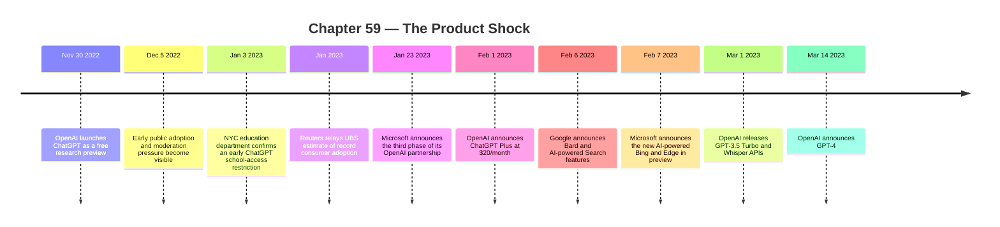

:::tip[In one paragraph]
On November 30, 2022 OpenAI launched ChatGPT as a free research preview — a chat box wrapping a GPT-3.5 model fine-tuned with RLHF on Azure supercomputing. The break was not new science but packaging: conversational turn-taking turned model behaviour into consumer habit. Record-breaking consumer adoption forced institutions, competitors, and users to react, while Microsoft's Bing and Google's Bard launched within a day of each other.
:::

<strong>Cast of characters</strong>

| Name | Lifespan | Role |
|---|---|---|
| Sam Altman | — | OpenAI CEO; public framing of adoption and monetization, including the early 1M-users tweet |
| John Schulman | — | Named on the OpenAI ChatGPT launch page among the contributor list for the research preview |
| Satya Nadella | — | Microsoft CEO; anchors the January 2023 OpenAI partnership extension and the Bing/search response |
| Yusuf Mehdi | — | Microsoft executive author of the February 7, 2023 AI-powered Bing and Edge announcement |
| Sundar Pichai | — | Google/Alphabet CEO; author of the February 6, 2023 Bard and AI-Search post |
| Jenna Lyle | — | NYC education department spokesperson quoted by Chalkbeat during the early school-policy reaction |

<strong>Timeline (Nov 2022 – Mar 2023)</strong>

<strong>Plain-words glossary</strong>

**Research preview** — OpenAI's framing for the ChatGPT launch: free public access while the company gathered user feedback to find strengths, weaknesses, and failure modes.

**RLHF (Reinforcement Learning from Human Feedback)** — The training method that shaped ChatGPT's conversational behaviour: supervised fine-tuning on dialogues written by human AI trainers, comparison/ranking data, a learned reward model, and Proximal Policy Optimization. Inherited from InstructGPT (Ch57); ChatGPT made it the default assistant interface.

**Monthly active users (MAU)** — A standard product metric: distinct users who interact with a service in a 30-day window. In this chapter it matters because adoption scale turned ChatGPT from a research demo into an institutional coordination problem.

**ChatGPT Plus** — OpenAI's first paid tier, announced February 1, 2023 at $20/month. It sold reliability under load — general access during peak times, faster responses, priority on new features — while preserving the free tier. Demand had made inference itself a consumer expectation.

**Bing / Bard** — The search-side response: Microsoft's AI-powered Bing and Edge preview (Feb 7, 2023), built on a "next-generation OpenAI model" Microsoft called Prometheus, and Google's Bard (Feb 6, 2023), opened to trusted testers and based on LaMDA. The product race shifted from chatbot novelty to interface competition over how users find information.

**Jailbreak / adversarial prompting** — User prompts crafted to route around a model's safety policy or refusal behaviour. The GPT-4 System Card (March 2023) explicitly treats jailbreaks as a deployment surface: mitigations reduce but do not eliminate them, and Figure 10 walks through example exploits against GPT-4-launch.

**Hallucination** — Plausible but incorrect output. OpenAI's launch page warned ChatGPT could produce confident wrong answers, and the GPT-4 page kept the warning. Plausible wrongness is cheap to produce and expensive to verify.

ChatGPT did not invent the Transformer. It did not invent reinforcement learning from human feedback. It did not invent the internet-scale language model, the autocomplete interface, the chatbot, or the dream of a conversational computer. Almost every layer underneath it had already appeared in the previous chapters: attention, scale, data, RLHF, alignment work, cloud supercomputers, and the public fascination with generative systems.

What changed on November 30, 2022 was packaging.

OpenAI introduced ChatGPT as a free research preview. The word "preview" made it sound provisional, but users did not experience it as a paper, a benchmark table, or an API hidden behind developer documentation. They experienced it as a box in a browser. Type a question. Get an answer. Ask a follow-up. Correct it. Push it. Watch it refuse. Watch it apologize. Watch it produce confident nonsense in the same calm voice it used for useful explanations.

The interface made the model social.

Earlier language-model demos could be impressive, but they often required technical framing. ChatGPT compressed the machinery into ordinary turn-taking. A user did not need to know what a token was, how RLHF worked, why GPT-3.5 mattered, or what Azure supercomputing had supplied. The model behaved enough like a conversational partner that the research lineage disappeared behind the product surface. The public shock was not only that a model could generate text. It was that millions of people could immediately find a use for that generation inside a familiar human pattern: ask, answer, refine.

OpenAI's launch page described exactly that surface. ChatGPT could answer follow-up questions, admit mistakes, challenge incorrect premises, and reject inappropriate requests. Those behaviors were not decorative. They were the whole product grammar. The model was no longer only completing a prompt. It was occupying a conversational role, with memory of the immediate dialogue and a safety policy visible enough for users to encounter it directly.

:::note
> The dialogue format makes it possible for ChatGPT to answer followup questions, admit its mistakes, challenge incorrect premises, and reject inappropriate requests.

OpenAI's own framing puts the work on the *format* — not the model — making the chapter's "shock was packaging, not new science" thesis the launch page's own causal claim.
:::

That visibility mattered because ChatGPT turned alignment from an internal research topic into a public interaction. InstructGPT and RLHF had already shown that models could be trained to better follow human preferences. But most people did not meet RLHF as a method. They met it as an assistant that sometimes refused a request, softened a tone, avoided certain outputs, or tried to explain its own limits. Safety behavior became part of the user experience.

The launch page also kept the older research scaffolding in view. ChatGPT was presented as a sibling to InstructGPT. OpenAI described supervised fine-tuning with human AI trainers, comparison data, reward models, and Proximal Policy Optimization. It also said the model was fine-tuned from GPT-3.5 and trained using Azure AI supercomputing infrastructure. The browser tab looked simple because the system behind it was not.

This is the first lesson of the product shock: simplicity at the interface often hides complexity in the stack. A chat box can feel weightless. Underneath it sat a large pretrained model, human preference data, reward modeling, cloud hardware, safety filters, product telemetry, and a feedback loop designed to collect examples from real users. The research preview was not only a demonstration. It was also an instrument for seeing what the public would do with a general-purpose text generator.

OpenAI was explicit about that feedback motive. The preview was free while the company gathered user responses and learned about strengths and weaknesses. The model's limitations were named early: plausible but incorrect answers, sensitivity to phrasing, verbosity, guessing what the user intended, harmful outputs, and biased behavior. Those warnings should not be treated as defensive boilerplate. They are a map of the problems institutions would run into within weeks.

The strange thing was that the limitations did not stop adoption. In some cases they may have accelerated it. A flawless system is easy to classify as finished software. ChatGPT felt unfinished in a more magnetic way. It could be useful, wrong, funny, impressive, evasive, didactic, and brittle in the same sitting. Users shared screenshots because the behavior was legible. The model's failures were visible enough to argue about; its successes were visible enough to try again.

The first wave of attention moved through ordinary tasks. People asked it to draft emails, summarize ideas, debug code, translate prose, write poems, explain concepts, outline essays, and role-play interviews. Many of those outputs were mediocre. Many were also good enough to change the user's next step. The historical point is not that ChatGPT suddenly became an expert at everything. It is that a general-purpose generator became convenient enough to enter daily workflows before society had agreed on what counted as acceptable use.

The dialogue format helped because it gave users a repair mechanism. A single completion can fail and end the interaction. A conversation invites correction. If the answer is too long, ask for a shorter one. If it misunderstands the task, rephrase. If it invents an example, ask for another. If it refuses, try to understand the boundary. This made the system feel more capable than a one-shot generator because some of the burden moved from perfect first answer to iterative collaboration.

That was also why ChatGPT became teachable to the public without a manual. The product did not require users to learn a query language, a programming interface, or a specialized prompt syntax before beginning. The first lesson was contained in the interaction itself: ask in natural language and respond to the answer. Prompt engineering would become a culture later, but the initial adoption did not depend on expert prompting. The interface borrowed the oldest human coordination pattern available.

This matters for the book's infrastructure-first lens. The breakthrough did not sit only in the model weights. It sat in the coupling between model, interface, feedback collection, cloud capacity, and social distribution. A model released only as a paper can influence researchers. A model released only as an API can influence developers. A model released as a free chat product can influence everyone who can open a browser and type. The same technical substrate crosses different social thresholds depending on how it is packaged.

The screenshots were part of the distribution layer. ChatGPT responses could be copied, clipped, mocked, praised, and argued over. A single interaction could become a social media object. That gave the product a demonstration channel that older AI systems often lacked. Users did not have to trust a company's promotional video. They could show their own surprising answer, their own failure case, their own joke, their own code snippet, or their own unsettling refusal. The product spread because each conversation could become evidence in somebody else's debate.

That is why adoption numbers became more than vanity metrics. Sam Altman was widely reported as saying ChatGPT crossed one million users within five days, though the underlying public source is weaker than the later independent adoption reporting and should be treated as color rather than a hard anchor. The firmer shock came in early February 2023, when Reuters reported an analyst note from UBS estimating that ChatGPT had reached 100 million monthly active users in January, roughly two months after launch.

Reuters, relaying the UBS estimate, called ChatGPT the fastest-growing consumer application in history at that time. The caveat is important. It was an estimate, not a public audit of OpenAI's internal logs. It was also a historical claim made in February 2023, not a permanent title. Meta's Threads later reportedly crossed 100 million sign-ups in about five days in July 2023, which is why the ChatGPT claim must be written in the past tense: at that moment, according to that analyst estimate, it looked like a record consumer adoption curve.

The caveat does not make the adoption unimportant. It makes it precise. What mattered was that the number entered boardrooms, schools, newsrooms, software teams, and ministries as evidence that the research preview had become a mass consumer phenomenon. A product that reaches a few million enthusiasts can be treated as an interesting demo. A product that analysts estimate at 100 million monthly active users becomes a coordination problem. Executives ask what it does to search. Teachers ask what it does to homework. Moderators ask what it does to trust. Developers ask what it does to code. Regulators ask what it does to safety, labor, and accountability.

The number also changed the timeline of reaction. Organizations can postpone policy for a research demo. They have a harder time postponing policy for a tool their students, employees, customers, and competitors may already be using. The adoption curve compressed deliberation. Institutions that normally move through committees, semester schedules, procurement cycles, or legal reviews suddenly had to answer practical questions in days or weeks. Should staff use it? Should students disclose it? Should generated answers be allowed? Should customer-facing teams experiment? Should search teams treat it as a strategic threat? The product did not wait for consensus.

This is one of the reasons ChatGPT felt larger than earlier chatbot launches. Conversational agents were not new. Customer-service bots, voice assistants, and scripted dialogue systems had existed for years. But ChatGPT arrived with the breadth of a large language model and the improvisational feel of open-ended generation. Users could move from code to poetry to business planning to historical explanation in the same interface. That generality made it hard for institutions to define a narrow risk box. It was not only a homework machine, a coding helper, or a search alternative. It was an all-purpose text engine, and that made every text-based institution pay attention.

The product shock therefore spread through institutions before those institutions had a theory of the technology. Stack Overflow was one of the first developer communities to hit the practical version of the problem. On December 5, 2022, the site posted a policy banning generative AI content. The reason was not that every generated answer was visibly absurd. It was almost the opposite. The answers could look plausible while being wrong, and they were cheap to produce at a volume that strained volunteer moderation.

That made ChatGPT dangerous in a specific way for a question-and-answer site. Stack Overflow depended on a social contract: answers should be inspectable, correctable, and tied to human expertise. A flood of fluent generated responses threatened that contract because plausibility is expensive to audit. A wrong answer written badly may be easy to spot. A wrong answer written confidently can consume expert time. If enough such answers arrive, the moderation system becomes the bottleneck.

This was not a philosophical argument about whether machines could know things. It was an operational argument about throughput. Human curators had to decide whether content was useful, and the cost of producing candidate content had collapsed. ChatGPT made it easier to generate an answer than to verify one. That inversion would echo through education, law, journalism, customer support, and software engineering. When production gets cheap and verification stays expensive, institutions built around trust begin to shake.

Stack Overflow was especially revealing because its users were already technical. The conflict was not between AI experts and people who had never seen software before. It was inside a developer community that understood code, debugging, and technical explanation. If that community found generated answers hard to moderate at scale, the problem was not merely public ignorance. It was a structural mismatch between fluent generation and expert verification. The model could produce the surface form of competence faster than the community could establish the fact of competence.

The same pattern applies to code more broadly. A generated snippet can compile, fail subtly, use an insecure pattern, target the wrong version, or solve the wrong problem while sounding confident about all of it. That does not make code generation useless. It makes review central. ChatGPT's early coding use therefore foreshadowed the wider professional bargain: the model could accelerate drafts, examples, and explanations, but the user still needed enough judgment to catch failure. The product shock was not automation replacing expertise in one stroke. It was automation putting new pressure on expertise.

Schools discovered a neighboring version of the same problem. In January 2023, Chalkbeat reported that New York City's education department blocked ChatGPT on official devices and networks, citing concerns about student learning, safety, and accuracy, while still leaving room for schools to request access to study the tool. The detail matters because it shows the split institutional response. The technology was not simply banned as a toy. It was blocked as a risk and simultaneously recognized as something educators might need to understand.

The school reaction made the model's social ambiguity unavoidable. A student could use ChatGPT to brainstorm, outline, explain, translate, or practice. A student could also use it to produce assignments that teachers had not designed for machine assistance. The familiar categories were suddenly unstable. Was a generated draft cheating, tutoring, accessibility support, calculator-like augmentation, or a new writing process? The answer depended on context, policy, disclosure, and pedagogy, none of which had caught up to the product.

Accuracy made the problem sharper. OpenAI had warned that ChatGPT could produce plausible but incorrect answers. In a classroom or expert forum, plausible wrongness is more disruptive than obvious nonsense. It can pass a first glance. It can imitate the tone of competence. It can help one learner and mislead another. It can force a teacher or moderator to become a forensic reader of prose that was designed to sound coherent.

Safety behavior added another public surface. Users quickly learned that the model's refusals could be tested. Some prompts were declined; others tried to route around the refusal. By the GPT-4 system-card era, OpenAI was describing adversarial prompts and jailbreaks as real deployment issues: mitigations reduced but did not eliminate such exploits, and models could still be vulnerable to adversarial attacks. The important point for this chapter is narrow. ChatGPT made safety policy interactive. A refusal was no longer a hidden classifier decision. It was something users could see, screenshot, contest, and probe.

That changed the politics of release. A model deployed through a chat product did not merely produce outputs. It exposed boundaries. The public could ask where the boundary was, whether it was consistent, whether it reflected a company's values, and whether it could be bypassed. The model's safety layer became part of the product identity. This was a different kind of software controversy from a bug report. It was a negotiation over what the assistant should be willing to say.

The feedback loop made that negotiation faster. The research preview invited users to help identify failures, and the interface made failure collection natural. Every bad answer, refusal, or jailbreak attempt could become both training signal and public evidence. This created an uncomfortable dual role for users. They were customers, testers, adversaries, teachers, and critics at once. The product boundary was being explored in public while the system was still evolving.

While institutions reacted, the companies moved. OpenAI's first productization step was capacity. On February 1, 2023, it introduced ChatGPT Plus at $20 per month, promising general access during peak times, faster responses, and priority access to new features while keeping free access available. The subscription was a business model, but it was also an infrastructure signal. Demand had become large enough that access, latency, and priority could be sold as features.

That point should not be missed. The earliest paid tier was not framed primarily around a radically different product. It was framed around reliability under load. ChatGPT had made inference a consumer expectation. Users did not only want the model to exist; they wanted it to answer now, during peak hours, in a product that felt responsive. The consumer interface pulled a hidden systems problem into the business model.

One month later, OpenAI pushed the same substrate into the developer world. On March 1, 2023, it announced APIs for GPT-3.5 Turbo and Whisper, saying developers could integrate the models into applications and that it had achieved a 90 percent cost reduction for ChatGPT since December. The examples on the launch page included products from Snap, Quizlet, Instacart, Shopify, and Speak. This was the second product shock: the chat experience was not only a destination site. It was becoming a component other products could embed.

The cost-reduction claim belongs here only as product context. Chapter 63 will handle inference economics in detail. But the timing matters. Within three months of the research preview, OpenAI had moved from public demo to subscription and API platform. ChatGPT had taught users what a conversational model felt like. The API taught companies that conversational generation could be added to their own workflows, tutors, shopping assistants, language-learning tools, and customer-facing interfaces.

Microsoft's response showed how quickly the shock moved from app adoption to platform strategy. On January 23, 2023, Microsoft announced the third phase of its OpenAI partnership through a multiyear, multibillion-dollar investment. The company said it would build specialized supercomputing systems, deploy OpenAI models across consumer and enterprise products, and use Azure to power OpenAI workloads. ChatGPT was named among the category-defining products in that announcement.

Two weeks later, Microsoft launched the new AI-powered Bing and Edge in preview. The company framed the release as a reinvention of search and browsing: search, answers, chat, and content generation in one experience, powered by a next-generation OpenAI model customized for search and by a system Microsoft called Prometheus. The point was not that search had instantly been solved. It was that the most valuable interface on the web suddenly had a conversational challenger.

Search was a natural battlefield because ChatGPT had trained users to ask questions in complete sentences and expect synthesized answers. Traditional web search returned links, snippets, rankings, and advertisements. Chat promised a different contract: ask for a plan, an explanation, a comparison, or a draft, and receive a composed response. That contract was attractive and risky at the same time. A synthesized answer could be faster than browsing sources. It could also hallucinate, misattribute, or compress away the provenance that search users needed.

Google responded publicly before Microsoft's Bing event. On February 6, 2023, Sundar Pichai announced Bard, opened first to trusted testers ahead of wider availability, and described coming AI-powered features in Search. The post framed Bard through LaMDA and described generative AI as a way to synthesize complex information. It also signaled API access through Google's Generative Language API plans. The official language was careful, but the competitive implication was obvious: the company most associated with web search had to show a conversational product path.

This is where the product shock becomes a race. The race was not only over model quality. It was over distribution. OpenAI had the cultural hit. Microsoft had Azure, Windows, Office, Bing, and enterprise channels. Google had Search, Android, Workspace, research depth, and an enormous installed base. The same model behavior that looked like a novelty in December became a strategic threat in February because it could be attached to existing platforms.

Distribution changed the meaning of capability. A slightly weaker model inside a dominant product could matter more than a stronger model hidden behind limited access. A model connected to search could change how users ask for information. A model connected to office software could change how documents, emails, and presentations are drafted. A model connected to an API could let thousands of companies create their own assistants. The competitive question became not only "which model is best?" but "where does the model sit in the user's workflow?"

The Bing and Bard announcements therefore marked a shift from chatbot novelty to interface competition. Search engines had spent decades training users to express intent as keywords and then choose among ranked links. ChatGPT trained users to express intent as a task and expect a composed response. That is a different economic and epistemic arrangement. Links preserve a visible path to sources, ads, publishers, and ranking. Answers compress that path into a single response. The commercial stakes were obvious, but so were the trust stakes.

This did not mean chat would simply replace search. The early systems were unreliable, constrained, and still dependent on retrieval, browsing, or external grounding for many factual tasks. But the interface expectation had changed. Users had seen that a machine could take a messy request and return a structured answer. Even when the answer was wrong, the shape of the interaction was compelling. Search products now had to decide how much synthesis, conversation, and generation they should absorb.

The product race also changed how capability was communicated. Research labs had long published papers, benchmark results, model cards, and demos. After ChatGPT, the public expected releases. It expected names. It expected access tiers, waitlists, subscriptions, and visible improvements. Capability became something users could feel in an interface, not only something researchers could plot on an evaluation chart.

GPT-4 made that release cadence unmistakable. On March 14, 2023, OpenAI announced GPT-4 as a large multimodal model, available through ChatGPT Plus with a usage cap and through an API waitlist. OpenAI said it expected to be capacity constrained. It also stated that GPT-4 still hallucinated, still had risks, and needed care in high-stakes uses. The aftershock was not that all problems had been solved. It was that the product market now had a next model to wait for.

The usage cap and waitlist were historically important because they made scarcity visible. Users were not only asking whether the new model was smarter. They were asking whether they could get access, how many messages they could send, whether the API was available, and how long the queue would be. Capability was now entangled with allocation. The model could be announced globally while still being rationed through product tiers and capacity limits.

This created a new rhythm for AI attention. A model release produced benchmark discussion, safety debate, user screenshots, access complaints, pricing questions, and competitor positioning at the same time. Each layer amplified the others. Benchmarks fed marketing. Marketing drove users. Users exposed failures. Failures shaped safety documents. Capacity constraints shaped subscriptions. Subscriptions funded more infrastructure. The product and the research agenda began to chase each other in public.

GPT-4 also changed the relationship between product and evaluation. OpenAI published benchmark claims, described safety work, released Evals, and placed access behind products and waitlists. Users did not only read about the model. Some could try it in ChatGPT Plus; developers could request API access; others watched screenshots and comparisons move across the internet. The model was simultaneously a research object, a commercial product, a benchmark performer, and a social event.

That simultaneity defines the post-ChatGPT era. A frontier model could no longer be understood only as a paper or checkpoint. It arrived with access rules, safety claims, capacity limits, partner integrations, pricing, benchmarks, and press coverage. The release itself became part of the historical artifact. Who could use the model, how often, through which interface, and with which restrictions became as important as the architecture underneath.

The GPT-4 launch also preserved the limits that hype tried to erase. OpenAI said the model still hallucinated. The system card discussed adversarial prompting. The product had usage caps. The API had a waitlist. The company expected capacity constraints. These details are not minor. They show that the consumer product was already colliding with the next chapters: tool use and RAG for grounding, benchmarks as public theater, inference economics, data rights, open-weight competition, and physical capacity.

But those later problems should not obscure the specific historical role of ChatGPT. Its break was not that it solved intelligence. It made frontier language modeling experientially obvious. It took a research stack that had been accumulating for years and gave it a universal surface. A person who would never read "Attention Is All You Need," never compare scaling-law curves, never inspect an RLHF pipeline, and never call a completion API could now feel the system in conversation.

That feeling was the product.

The chat interface did three things at once. It lowered the threshold for use, because asking a question is easy. It raised expectations, because conversation suggests flexibility and understanding. And it exposed failure, because a conversational system can be wrong in ways that feel personal, authoritative, or institutionally consequential. This combination made ChatGPT more disruptive than a silent autocomplete model with the same weights would have been.

The product shock also rearranged the burden of proof. Before ChatGPT, many public debates about AI asked whether systems were impressive enough to matter. After ChatGPT, the question became where they should be allowed, trusted, paid for, embedded, blocked, regulated, and improved. The burden moved from showing possibility to managing deployment.

That is why Stack Overflow and New York City schools belong in the same chapter as Microsoft, Google, Plus, APIs, and GPT-4. They are all reactions to the same event: a model escaped the narrow spaces where experts could evaluate it slowly and entered the ordinary spaces where people work, learn, search, and publish. The release turned model capability into social load.

The honest conclusion is narrower than the hype. ChatGPT was not a mind suddenly appearing on the web. It was a carefully packaged, imperfect, large-scale language model tuned for conversation and deployed as a free research preview. It could be useful and wrong, safe-looking and jailbreakable, accessible and capacity-constrained, playful and commercially explosive. That mixture, not any single benchmark score, is what made it historical.

By March 2023, the direction was clear. ChatGPT had become a subscription. Its underlying model family had become an API. Microsoft and Google had moved search into the conversational race. GPT-4 had turned the surprise into a cadence of higher-capability releases under safety and capacity pressure. The next step was obvious: if a chat box could answer, could it browse, retrieve, call tools, take actions, and behave less like a text generator and more like an agent?

That question belongs to the next chapter. The product shock was the moment the public met the assistant. The agent turn began when companies and researchers tried to give that assistant hands.

:::note[Why this still matters today]
Almost every consumer-facing AI product after late 2022 borrows ChatGPT's grammar — a chat box, conversational turn-taking, visible refusals, a feedback button, a paid tier sold on capacity rather than only capability. Search engines now ship synthesised answers above link lists. Productivity tools embed conversational drafting into documents, mail, and code editors. Schools, publishers, and Q&A communities still litigate the line between fluent generation and verifiable expertise that Stack Overflow and NYC schools first hit in late 2022. The product shock also normalised release rhythm — usage caps, waitlists, subscription tiers, and capacity warnings — as part of how frontier capability reaches users.
:::
