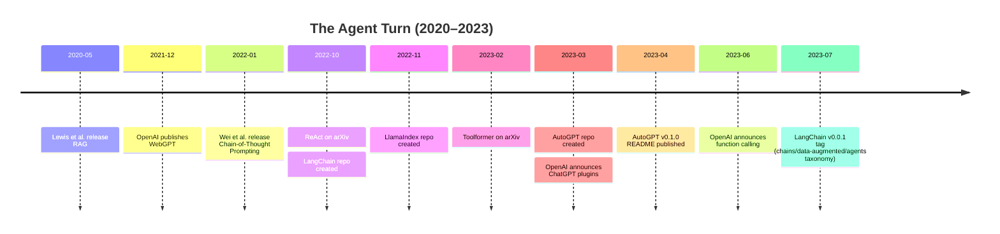

:::tip[In one paragraph]
After ChatGPT, the architectural problem shifted from making models talk to letting them act. The next wave connected language models to memory, search, tools, schemas, and software loops. Early agents were brittle, not autonomous workers, but the center of AI applications moved from a single chat reply toward systems that could consult external state, call capabilities, and report back through a model.
:::

<strong>Cast of characters</strong>

| Name | Lifespan | Role |
|---|---|---|
| Patrick Lewis et al. | — | Lead authors of the 2020 RAG paper (parametric + non-parametric memory). |
| Reiichiro Nakano et al. | — | WebGPT authors (browser-assisted QA with citations and human feedback). |
| Jason Wei et al. | — | Chain-of-Thought prompting authors (intermediate reasoning steps in large LMs). |
| Shunyu Yao et al. | — | ReAct authors (interleaved reasoning, action, and observation loops). |
| Timo Schick et al. | — | Toolformer authors (self-supervised tool-use via API calls). |
| OpenAI / Significant Gravitas | — | ChatGPT plugins, function calling; AutoGPT v0.1.0 as the visible 2023 agent demo. |

<strong>Timeline</strong>

<strong>Plain-words glossary</strong>

- **Parametric memory** — information represented inside the model's learned weights.
- **Non-parametric memory** — information kept outside the model in a retrievable store.
- **Retrieval-augmented generation (RAG)** — a pattern where the model answers using passages fetched from an external store at query time, not just from its weights.
- **Chain-of-thought** — prompting the model to write intermediate reasoning steps before its final answer; a scratchpad pattern, not a window into the model's actual computation.
- **ReAct loop** — a prompting pattern that connects reasoning text with actions in an external environment.
- **Function calling** — a structured interface where the developer describes functions and the model emits JSON arguments; the surrounding software, not the model, decides whether to execute.
- **Prompt injection** — instructions hidden inside untrusted text (a webpage, document, or tool output) that try to hijack a tool-using model.

ChatGPT made the model feel like a conversational partner. That was enough to shock the public, but it also exposed the weakness of the closed chat window. A model could answer fluently, but fluency did not give it current facts, private documents, a calculator, a database connection, a browser, or permission to take an action in the world. The assistant could talk as if it knew, but much of what users wanted required something outside the weights.

That is the hinge from product shock to agent turn.

The word "agent" would quickly become slippery. It could mean a model that calls a tool, a loop that plans and acts, a framework that chains prompts, an application that queries documents, or a demo that appears to pursue a goal. This chapter uses the word narrowly. The agent turn was not the moment language models became reliable autonomous workers. It was the moment the field began connecting language models to external memory, external tools, and repeated observe-act loops.

The closed chat window had a simple shape. The user typed. The model generated. The conversation context carried recent turns, and the model's parameters carried what training had compressed into weights. That was powerful, but it was also bounded. If the user asked about a private policy document, the model could not see it unless the document was placed in the prompt. If the user asked about a current webpage, the model could not inspect it unless some other process retrieved it. If the user asked for arithmetic, the model might imitate arithmetic rather than execute it. If the user asked to book, buy, send, create, or modify something, the model could only emit text unless another system acted.

OpenAI's own plugin framing made this explicit in 2023. Plugins were described as tools that let ChatGPT access up-to-date information, run computations, use third-party services, or take constrained actions. That framing implied the limitation. Out of the box, the language model produced text. To use current information or act on a service, it needed an external channel.

This did not make the chat model trivial. Text is already an interface to much of human work. A model that drafts, summarizes, explains, and rewrites can be useful without tools. But chat-only systems run into a ceiling whenever the task depends on grounded evidence, freshness, precision, or state change. A fluent answer about a policy is not the same as reading the policy. A confident answer about an account is not the same as querying the account. A plausible calculation is not the same as a calculator result. The agent turn began when engineers tried to close that gap.

The pressure came from ordinary user requests. "Summarize our contract" requires access to the contract. "What changed in this repository?" requires access to the repository. "Find the cheapest option" requires search, comparison, and some notion of current price. "Create the ticket" requires permission to write into a system of record. These are not exotic demands. They are the natural next requests after a chat assistant proves it can understand instructions. The chat window invited users to ask for work, and work usually depends on external state.

This is why the agent turn is better understood as system design than as a single model breakthrough. The language model supplied flexible interpretation and generation. The surrounding application had to supply memory, tools, policies, connectors, identity, logs, and confirmations. A model could parse the user's intention, but another layer had to decide which documents it could see, which APIs it could call, and which actions required a human checkpoint. The assistant became a coordinator.

The first bridge was retrieval.

Retrieval-augmented generation, or RAG, gave the field a clean way to explain external memory. Patrick Lewis and collaborators described a system that combined a pretrained sequence-to-sequence model, the parametric memory, with a non-parametric memory: a dense vector index of Wikipedia accessed through a retriever. The language model still generated text. But generation was conditioned on retrieved passages rather than only on what the parameters had learned during training.

The distinction between parametric and non-parametric memory is worth slowing down for. Parametric memory lives in the model weights. It is hard to inspect, expensive to update, and entangled with everything else the model has learned. Non-parametric memory lives outside the model: documents, vectors, indexes, databases, search results, pages. It can be replaced, updated, filtered, or audited more directly. RAG did not remove the model's learned knowledge. It gave the model a way to consult an external store at generation time.

The infrastructure pattern became familiar. Take documents. Split them into chunks. Convert chunks into embeddings. Store those embeddings in an index. When a user asks a question, embed the query, retrieve similar chunks, place the retrieved text into the prompt or model context, and ask the generator to answer using that evidence. Later product systems would wrap this in vector databases, document pipelines, permissions, citations, and user interfaces. The conceptual hinge was already present: external memory could be called when needed.

This changed what "knowledge" meant in a language-model application. A model no longer had to carry every fact in its weights. A company could keep an internal handbook, support archive, codebase, or legal corpus outside the model and retrieve from it at query time. That did not make the model omniscient. It made the application a system: model plus retriever plus index plus ranking plus context window plus answer policy.

RAG also changed the failure surface. It is tempting to say retrieval solves hallucination. That is too strong. Retrieval can reduce pressure on the model to invent unsupported facts, but only if the right documents are retrieved, the chunks contain the answer, the ranking is good, the prompt uses the evidence correctly, and the model does not ignore or distort the context. A bad retriever can supply irrelevant evidence. A stale index can supply outdated policy. A chunk can omit the crucial caveat. A model can cite a passage while answering beyond it.

This is why retrieval belongs in infrastructure history rather than only modeling history. The quality of the answer depends on indexing choices. Chunk size matters. Overlap matters. Metadata matters. Permissions matter. Ranking matters. Citation format matters. The model is still visible, but the supporting system starts doing historical work. A chat product becomes a knowledge system only when the memory layer is built.

RAG's early research framing used Wikipedia as the non-parametric memory, but the later pattern generalized. The external store could be an encyclopedia, a documentation site, a product catalog, a ticket database, a code repository, or a personal folder. The same idea traveled because it matched a practical need: users wanted the language model to speak from their information, not only from the internet-scale training mixture that produced the base model.

Lewis et al. also made the retrieval/generation coupling precise. RAG-Sequence retrieved documents and generated an answer conditioned on those documents across the sequence. RAG-Token allowed retrieved documents to vary across generated tokens. The distinction is technical, but historically useful because it shows the field experimenting with where external memory enters generation. Retrieval was not merely pasted into a prompt as an afterthought. It was part of the modeling design.

The promise of replaceable non-parametric memory was especially attractive. A frozen model can become stale. A document index can be swapped. That does not create real-time omniscience, but it changes the maintenance story. Instead of retraining a model whenever a policy, product, or fact changes, an application can update its corpus and index. For enterprise builders, that was the crucial appeal: keep the general language ability in the model, keep the local truth in documents, and connect them at query time.

The hard part was that every step in that pipeline introduced choices. How long should a chunk be? Should headings and metadata be preserved? Should chunks overlap? Should tables be transformed? Should code be indexed differently from prose? Should the retriever optimize semantic similarity, keyword matching, freshness, permissions, or citation coverage? A RAG system is full of such decisions. The language model may receive only a few paragraphs, but the quality of those paragraphs depends on a long preprocessing chain.

This made citation discipline more important, not less. If the model answers from retrieved evidence, the user needs to know which evidence. But citations can be decorative unless the system forces them to be grounded. A model can cite a retrieved passage while adding a claim the passage does not support. It can quote a source that was only adjacent to the answer. It can merge two documents and blur the boundary. RAG therefore changed hallucination from a model-only problem into a full pipeline problem.

That is why the later enthusiasm around vector databases should be kept in proportion. Dense retrieval became a key infrastructure layer, but the database alone was not intelligence. It was a memory substrate. The useful application still needed ingestion, access control, retrieval ranking, context packing, prompting, answer synthesis, and evaluation. The agent turn depended on vector search, but it also revealed that search is only one component in a larger reasoning-and-action system.

Search pushed the same question into a more dynamic setting.

OpenAI's WebGPT work, published before ChatGPT, trained models to use a text-based browser for question answering. The model could search, follow links, scroll, and collect references. The goal was not just to generate a fluent answer; it was to generate an answer backed by sources that humans could inspect. WebGPT connected two ideas that would become central to agent systems: action and observation. The model did something in an environment, observed the result, and used that result to continue.

The browser action space was deliberately limited. It was not a human roaming the web with full freedom. It was a text-based environment with commands. But the structure mattered. Instead of asking the model to answer from memory, the system let it look. That simple verb changes the relationship between model and world. A model that can search before answering can update its context from outside the prompt. It can gather evidence. It can quote references. It can also choose bad sources, misunderstand pages, or assemble a misleading answer from real snippets.

WebGPT's own framing preserved that honesty. OpenAI discussed source citation as a way to make factual accuracy easier to evaluate, but also warned that answers could still make basic errors and that web access introduced risks. The cited answer is not automatically true. A citation can be irrelevant, unreliable, partial, or misused. Search-assisted answering moves the problem from pure hallucination toward retrieval quality, source quality, and citation discipline.

The WebGPT paper reported that its best model was preferred over human demonstrations 56 percent of the time on the ELI5 setup. That result is useful only with its container intact. It was a specific evaluation arrangement, not a proof that browser-assisted language models were generally better than humans at answering questions. Its historical value is narrower and stronger: search plus references plus human feedback could make factual answering more competitive, while still leaving source quality and evaluation difficulty unresolved.

This is the moment where "answering" started to look like a workflow. A model had to decide what to search for, choose a result, inspect a page, extract evidence, move to another page if necessary, and then compose an answer. Each step could be logged and reviewed. Each step could also go wrong. A wrong search query could send the model down the wrong path. A poor source could contaminate the answer. A real quote could be interpreted incorrectly. The model was no longer only generating; it was navigating.

Navigation is different from memory. Memory asks what the model or index already contains. Navigation asks where to look next. That distinction becomes central to agents. A useful assistant may need to move through an environment: search results, websites, documentation, issue trackers, databases, or files. But movement creates path dependence. The first bad step can shape the next three. WebGPT made that structure visible before the agent hype cycle gave it a louder name.

That shift was historically important because it showed how the field would keep trying to patch language models with external processes. If the model is out of date, retrieve. If it needs current information, search. If it needs arithmetic, call a calculator. If it needs to know whether an action succeeded, observe the result. Each patch makes the system more useful and more complicated. The closed chat window becomes an orchestration problem.

The cognitive bridge arrived through prompting research.

Chain-of-thought prompting, as described by Jason Wei and collaborators, showed that large language models could improve on complex reasoning tasks when prompted to produce intermediate natural-language reasoning steps before a final answer. The paper defined a chain of thought as a series of intermediate reasoning steps leading to the output. This was not tool use yet. Nothing had been retrieved, clicked, or executed. But the model was being asked to make reasoning visible as a sequence.

The importance of chain-of-thought was partly pedagogical. It gave users a way to decompose problems. Instead of asking for an answer in one leap, ask the model to work through steps. The paper emphasized properties such as decomposition, a window for debugging, applicability across tasks, and few-shot elicitation in sufficiently large models. For the agent turn, the key idea was not that visible reasoning text exposed the model's true inner computation. It did not. The key idea was that language could organize intermediate state.

That distinction is essential. A chain-of-thought transcript is not a brain scan. It is generated text. It may be useful, misleading, post hoc, incomplete, or overconfident. But as an interface pattern, it taught both researchers and builders to separate intermediate reasoning from final answers. Once that separation exists, the next move is natural: insert actions between reasoning steps.

This bridge also changed how users thought about prompting. Earlier prompt engineering often focused on phrasing the final request well. Chain-of-thought made the path to the answer part of the request. Ask for intermediate reasoning. Provide examples that show decomposition. Make the model imitate a stepwise problem-solving style. That worked best in sufficiently large models, which matters because scale and prompting interacted. The technique was not a universal property of all language models. It appeared as model capacity, training, and prompting crossed a threshold.

For agents, the most important lesson was not "make the model think out loud." It was "give the model a structured scratchpad." The scratchpad could hold a subgoal, a partial observation, a hypothesis, or a next action. Later systems would hide, compress, or replace visible reasoning for safety and product reasons, but the 2022 research pattern still shaped the architecture. It showed that a language model could use language as temporary workspace between input and output.

That is what ReAct made explicit.

Shunyu Yao and collaborators described ReAct as interleaving reasoning traces and task-specific actions. The model reasons, acts, observes, and reasons again. In question answering and fact verification, it could interact with a Wikipedia API. In interactive tasks such as ALFWorld and WebShop, the same idea connected language reasoning to environment actions. The point was not that ReAct solved autonomy. The point was that it gave the field a crisp loop: thought, action, observation.

The loop is easy to understand because it resembles ordinary problem solving. If you do not know something, search. If the search result is incomplete, refine. If a tool returns a value, use it. If an action fails, observe the failure and adjust. ReAct turned that structure into a prompting pattern for language models. The model's text was no longer only the final product. Part of the text selected an action. The environment returned an observation. The next model call incorporated that observation.

:::note
> For the tasks where reasoning is of primary importance (Figure 1(1)), we alternate the generation of thoughts and actions so that the task-solving trajectory consists of multiple thought-action-observation steps.

This is the loop claim in its narrow form: ReAct made action part of the trajectory, not just a postscript to reasoning.
:::

This was the agent turn in miniature. The model became part of a control loop.

But the loop also multiplied failure modes. A bad thought can choose the wrong action. A wrong action can fetch misleading evidence. A misleading observation can anchor the next step. The model can over-trust a tool result, ignore it, or continue a bad plan. In a closed chat window, the main failure is bad text. In a tool loop, bad text can become bad action. That is why early agent research and product work always carried a safety shadow.

ReAct's task mix also kept the meaning of "action" broad. In a question-answering task, an action might be a Wikipedia API query. In an interactive environment, it might be a move, a click, or a shopping-related command. That breadth helped make the idea travel. The same pattern could be applied to search, games, web tasks, support tools, and internal operations. But it also made "agent" unstable as a label. A system that queries Wikipedia and a system that manipulates a browser are both action-taking systems, but their safety requirements are not the same.

The reason/action/observation loop is therefore best treated as an architectural grammar. Reasoning text proposes why to act. The action channel executes something defined by the environment. The observation returns new state. The next step interprets that state. Once this grammar exists, builders can swap environments: search APIs, file systems, calculators, databases, ticket trackers, browsers, shopping sites, or simulated worlds. The model remains a language model, but the application begins to look operational.

Toolformer approached the same destination from another angle. Timo Schick and collaborators asked whether a language model could teach itself to use external tools through API calls. The paper included tools such as calculators, question-answering systems, search engines, translation systems, and calendars. Its method sampled possible API calls, executed them, filtered useful ones, and interleaved the calls with text. The historical importance is in the interface: a language model can learn not only what to say, but when to request an external computation.

This matters because tools specialize. Language models are flexible but fuzzy. Calculators are narrow but exact. Search engines are current but noisy. Calendars contain specific state. Translation systems, databases, code interpreters, and enterprise APIs each expose different capabilities. The agent turn was the attempt to let the model route tasks to systems better suited than pure generation.

Toolformer also sharpened the difference between calling a tool and benefiting from a tool. It is not enough to insert API calls everywhere. The call has to be useful. The model has to decide when the external result improves the continuation enough to justify the call. The paper's sample-execute-filter pattern made that selection problem explicit. The tool interface had to become part of the model's learned behavior, not just a hard-coded appendage.

This is where the old dream of symbolic tools returned in a new form. Classical AI had often imagined reasoning systems with explicit operations. Neural language models seemed, at first, to move in the opposite direction: everything became generated text. Tool use recombined the two instincts. Let the neural model interpret messy language and choose among actions, but let external systems handle exact computation, retrieval, search, and state. The hybrid was powerful because it did not ask one mechanism to do everything.

The product version of that idea arrived quickly after ChatGPT. On March 23, 2023, OpenAI announced ChatGPT plugins. The initial set included browser and code-interpreter capabilities, a retrieval plugin, and third-party services. The language around plugins was revealing: tools for up-to-date information, computation, third-party services, and actions. ChatGPT was no longer only a text box. It was becoming an interface that could select capabilities beyond the model.

Plugins also made the risk concrete. OpenAI discussed prompt injection, harmful or unintended actions, safeguards, and evaluations. Prompt injection is the natural adversary of tool use. If a model reads an untrusted webpage, email, document, or tool output, that text can contain instructions aimed at the model rather than the user. A system built to follow instructions now has to decide which instructions count. The world becomes part of the prompt, and the world is not benign.

This is a deep architectural problem. In ordinary software, data and instructions are supposed to be separated. In language-model systems, the model sees everything as text-like context unless the surrounding system imposes structure and authority. A retrieved document can contain content. It can also contain an instruction that says to ignore previous instructions. A tool result can be evidence. It can also be a trap. Agent systems must therefore manage trust boundaries, permissions, and provenance, not just prompts.

OpenAI's function-calling update in June 2023 made the developer interface more structured. Instead of simply asking the model to produce a free-form tool instruction, developers could describe functions and receive JSON arguments that external code could execute. That shifted tool use from improvisational prompt format toward API contract. The model did not actually perform the external action by itself. It emitted structured arguments; the developer's system decided whether and how to call the function.

This distinction matters. Function calling is not autonomy. It is an interface between probabilistic language output and deterministic software. The model proposes a function call. The surrounding application validates, executes, retries, refuses, logs, or asks the user for confirmation. The safer system is not the one that imagines the model as a perfect operator. It is the one that treats the model as a fallible component inside a permissioned workflow.

The same OpenAI function-calling material warned about untrusted tool output and real-world actions. That warning belongs at the center of the history. The more useful the agent, the more dangerous the failure. A model that drafts a wrong paragraph wastes time. A model that sends a wrong email, changes a database, purchases an item, deletes a file, or exposes a secret creates a different category of risk. Tool use turns language mistakes into operational mistakes.

The JSON boundary also changed developer expectations. A natural-language answer can be read by a person. A structured function call can be consumed by software. That made language models easier to fit into ordinary application stacks. A developer could define a function such as look up an order, create a ticket, calculate shipping, query a database, or schedule an event, then let the model fill arguments. The model's output became machine-readable intent.

Machine-readable intent is useful only if the surrounding system is skeptical. Arguments can be malformed, overbroad, ambiguous, or dangerous. The user may not have permission. The tool output may be untrusted. A real-world action may require confirmation. The function-calling layer therefore did not eliminate product design. It made product design unavoidable. Good agent systems needed schemas, validation, authorization, audit trails, retry logic, human approval, and fallbacks.

Plugins and function calling also separated capability from responsibility. The model might recommend a call, but responsibility for execution sat with the application and its operator. This became a recurring theme in AI product design. The more powerful the connector, the more important the gate. Tool access without identity and permissions is not an assistant. It is an accident waiting for a prompt.

Developers did not wait for a settled theory. Frameworks appeared to package the patterns.

LangChain's GitHub repository was created in October 2022, before ChatGPT's public launch. An early README framed the project around composability: isolated language-model calls were often insufficient, and power came from combining language models with other computation or knowledge. Early examples included self-ask-with-search and language-model math. That is the framework instinct in one sentence: the model is one component, not the whole application.

The later LangChain taxonomy around chains, data-augmented generation, and agents made the pattern explicit. Chain calls. Retrieve data. Use tools. Coordinate steps. The important historical claim is modest. LangChain did not prove that agents were reliable. It made orchestration legible to developers. It gave names and abstractions to patterns that many teams wanted: combine prompts, retrieval, tools, memory, and application logic without hand-building everything from scratch.

LlamaIndex sits beside that story as a data-framework pattern. Its repository appeared in November 2022, and its later public framing centered on documents, agents, and data pipelines around language models. For this chapter it should remain context, not a firstness claim. The broader point is that once chat models became useful, developers immediately needed infrastructure for connecting them to documents and tools. Retrieval was not an add-on feature. It became a platform layer.

The framework wave showed that agent building was becoming a software-engineering problem. Developers needed prompt templates, retrievers, memory objects, loaders, tool wrappers, output parsers, callbacks, and evaluation harnesses. None of those pieces was glamorous in the way a new model release was glamorous. But without them, a language model stayed isolated. The frameworks made the surrounding scaffolding visible.

They also made failure reproducible enough to study. If an agent is a hand-written pile of prompts, it is hard to know what changed when behavior changes. If an agent is built from components, developers can inspect the retriever, swap the prompt, log the tool call, or adjust the memory store. Frameworks did not make agents reliable by themselves. They gave developers a vocabulary for the reliability work.

At the same time, abstraction could hide danger. A few lines of framework code could make it feel easy to grant a model access to tools, files, search, or shell-like actions. The simplicity of the interface could obscure the consequences of bad permissions. This echoed the ChatGPT product shock at a smaller scale. The easier the interface, the more important the hidden guardrails become.

AutoGPT made the agent idea visible to a wider developer culture in 2023. Its early README framed it as an experimental GPT-4 application that chained language-model "thoughts" together and included internet access, memory, and file storage. The same README required user authorization after actions through a "NEXT COMMAND" style interaction. That detail is crucial. The demo looked autonomous enough to excite people, but it still carried a human checkpoint. The agent was not a finished worker. It was an experiment in looping a model through goals, context, commands, and confirmation.

AutoGPT mattered because it converted a research pattern into a cultural image. The agent was no longer only a diagram in a paper. It was a terminal demo, a repository, a thing developers could run, modify, and argue about. It made the dream vivid: give a model a goal, let it plan, search, write files, remember, and continue. It also made the brittleness vivid. Loops drifted. Goals decomposed poorly. Tools failed. Costs accumulated. The model could get stuck, repeat itself, ask for unnecessary actions, or confidently pursue a bad plan.

That brittleness was not incidental. Early agent systems combined several unreliable pieces. The model could reason poorly. Retrieval could return weak evidence. Search could find bad sources. Tools could have side effects. Long context could distract the model. Memory could preserve irrelevant state. Permissions could be too broad or too narrow. Evaluation was difficult because a multi-step task can fail in many places, and success may depend on external state that changes over time.

The "NEXT COMMAND" checkpoint in the early AutoGPT README is historically revealing for exactly this reason. It shows that even a demo marketed around autonomy still needed human authorization in the loop. The human was not gone. The human had moved to a supervisory position, deciding whether the next action should proceed. That pattern would recur in safer agent designs: let the model propose, let the system constrain, and let the human approve high-impact steps.

AutoGPT also made memory sound simpler than it was. Giving an agent file storage or long-term memory is not the same as giving it judgment about what should be remembered. Memory can accumulate irrelevant notes, stale assumptions, or self-generated errors. A loop that writes its own context can poison itself. The agent turn therefore made memory both a capability and a risk. Remembering the wrong thing can be worse than forgetting.

The cost problem also began here, though Chapter 63 will handle the full economics. Tool loops multiply calls. A simple chat answer might require one generation. An agent loop might require planning, retrieval, tool selection, tool execution, observation, replanning, more retrieval, and final synthesis. Each step adds latency, tokens, infrastructure load, and chances for failure. The agent turn therefore created both a capability path and an efficiency problem.

The deeper lesson is that agency is not a single feature. It is a system property assembled from perception, memory, reasoning, tools, permissions, feedback, and stopping conditions. A language model can supply flexible text and task interpretation. It cannot by itself guarantee that a retrieved document is authoritative, that a function call is safe, that a plan is sensible, or that a loop should continue. The surrounding system has to decide what the model may see, what it may do, and when a human must approve.

This is why the early agent turn should be written with discipline. It was historically important, but not because autonomous AI workers suddenly arrived in 2023. They did not. It was important because the architecture of AI applications changed. The center moved from a single model answering in a chat window toward model-centered systems: retrieval pipelines, search actions, reasoning traces, tool calls, plugin permissions, function schemas, orchestration frameworks, and loops.

:::note[Why this still matters today]
The architecture this chapter describes is what every modern AI application is made of. When a chatbot answers from your company's docs, that is RAG. When a coding assistant runs a search before replying, that is the WebGPT instinct. When a model thinks step by step before deciding what to do, that is chain-of-thought. When an assistant calls a calculator, schedules a meeting, or queries a database, that is ReAct/Toolformer with a productized function-calling interface. The same chapter also seeded today's hard problems: retrieval quality, source trust, prompt injection, permissions, audit trails, runaway loops, and the cost of every extra tool call. Today's "agentic" systems are still building on this 2020–2023 foundation.
:::

The public had met the assistant in Chapter 59. In Chapter 60, builders tried to give that assistant memory and hands. The result was powerful, unstable, and unfinished. It pointed toward the next constraint: once models act through tools, the cost of every token, every retrieval, every function call, and every retry starts to matter. The agent turn made language models operational. It also made their limits operational.
