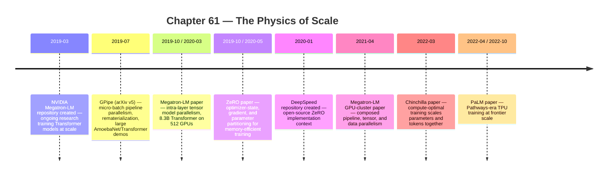

:::tip[In one paragraph]
The post-GPT era scaled because engineers learned to split one training run across many accelerators. Pipeline parallelism, tensor parallelism, optimizer-state sharding, and data parallelism each paid a different tax in memory, communication, or idle time. Megatron-LM and PaLM made thousand-chip training concrete; Chinchilla corrected the slogan: parameter count alone is the wrong axis of scale.
:::

<strong>Cast of characters</strong>

| Name | Lifespan | Role |
|---|---|---|
| Yanping Huang et al. | — | GPipe authors (Google); micro-batch pipeline parallelism, rematerialization, ~6B-parameter Transformer demo |
| Mohammad Shoeybi et al. | — | Megatron-LM 2019 authors (NVIDIA); intra-layer tensor model parallelism, 8.3B Transformer on 512 GPUs |
| Samyam Rajbhandari, Jeff Rasley, Olatunji Ruwase, Yuxiong He | — | ZeRO authors (Microsoft); optimizer-state, gradient, and parameter partitioning |
| Narayanan et al. | — | Megatron-LM 2021 authors (NVIDIA + collaborators); composed pipeline, tensor, and data parallelism at cluster scale |
| Aakanksha Chowdhery et al. | — | PaLM/Pathways authors (Google); TPU-side frontier-scale dense Transformer training |
| Jordan Hoffmann et al. | — | Chinchilla authors (DeepMind); compute-optimal training argument — scale parameters and tokens together |

<strong>Timeline (2019–2022)</strong>

<strong>Plain-words glossary</strong>

**Data parallelism** — Each worker holds a full copy of the model and processes a different slice of the batch; gradients are synchronized across workers. Compute-efficient but memory-wasteful at frontier scale because every worker replicates parameters, gradients, and optimizer states.

**Pipeline parallelism** — Different consecutive groups of layers live on different accelerators; activations flow forward through partitions and gradients flow back. GPipe's contribution was micro-batching: slice the mini-batch into micro-batches so multiple stages can work simultaneously, like an assembly line.

**Tensor (intra-layer) parallelism** — Multiple GPUs cooperate inside the same layer; each owns a slice of a matrix multiplication, and partial results are stitched together with all-reduce communication. Megatron-LM 2019 placed those all-reduces around MLP and self-attention matrix products so each GPU stayed compute-bound.

**Pipeline bubble** — Idle time at the start (later stages waiting for work) and end (earlier stages done while later stages drain) of a pipeline schedule. GPipe amortized the bubble by increasing the micro-batch count, but the tax never fully disappears.

**ZeRO (Zero Redundancy Optimizer)** — Microsoft's scheme for reducing redundant model-state memory across data-parallel workers.

**PTD-P** — Megatron-LM 2021 shorthand for composing **P**ipeline, **T**ensor, and **D**ata parallelism in one training system.

**Model FLOPs utilization (MFU)** — the fraction of a cluster's theoretical peak FLOPs actually spent on useful model computation.

The agent turn made language models operational. Retrieval, search, tools, and loops turned the chat window into a system that could look, call, observe, and try again. But before those systems could be served to millions of users, the frontier models had to be trained. That training problem was not solved by wanting bigger models. It was solved by forcing a single optimization run to live across many accelerators without collapsing under memory, communication, idle time, and synchronization.

Scale sounds abstract until the model does not fit.

A training step carries more than parameters. The parameters are only the visible part of the machine. During training, the system also has gradients, optimizer states, activations, residual buffers, temporary workspaces, fragmented memory, and communication buffers. If the optimizer is Adam-like, it may keep extra state for each parameter. If the model is deep, activations from many layers may need to be preserved for backpropagation. If the batch is large, intermediate tensors grow. The accelerator's memory limit is not a suggestion. Once the working set exceeds it, the run stops.

The simplest solution is replication. In data parallelism, each worker holds a full copy of the model, processes a slice of the batch, computes gradients, and synchronizes updates. This is efficient when the model fits and the batch can be divided. But giant language models broke the assumption. Replicating the same parameters, gradients, and optimizer states across every worker wasted memory exactly when memory became precious. "Buy more GPUs" did not help if each GPU still needed to hold a complete copy of something too large.

The physics of scale is therefore a story of splitting. Split the layers. Split the matrix multiplications. Split the batch. Split the optimizer state. Split the model replicas. Split the work in a way that keeps devices busy, keeps memory within bounds, and keeps communication from eating the gain. Every method pays somewhere. Parallelism is not free scaling. It is a negotiation with the hardware.

The negotiation starts with a cruel fact: the memory needed for training grows faster than the intuitive parameter count people talk about in public. A 10 billion parameter model is not merely 10 billion numbers sitting calmly in memory. Training may need the weights, gradients for those weights, optimizer moments, activations saved for the backward pass, and temporary buffers created by kernels. Precision choices change the byte count, but the structure remains. The training system carries the model and the traces needed to change the model.

Activations are especially easy to forget because they are not part of the final checkpoint. During the forward pass, each layer produces intermediate values. The backward pass needs many of those values to compute gradients. A deeper model, longer sequence, larger batch, or wider hidden dimension can turn activation memory into a major part of the problem. This is why techniques such as rematerialization mattered. They did not change the model's mathematical target. They changed which intermediate values had to live in memory at once.

Communication is the second physical constraint. Once tensors are split across accelerators, the pieces have to talk. Gradients must be reduced. Partial matrix products must be combined. Pipeline stages must hand activations forward and gradients backward. Some communication happens inside a server. Some crosses slower links. A parallel training method that looks elegant on paper can fail in practice if it asks the cluster to move too much data too often.

Idle time is the third constraint. A chip waiting for another chip is expensive silence. In a perfectly balanced fantasy, every accelerator would perform useful work all the time. Real distributed training has fill and drain phases, synchronization barriers, stragglers, input stalls, checkpoint overhead, and failures. The physics of scale is not just "can the model be divided?" It is "can the divided work keep the machine busy enough to be worth the division?"

GPipe made one of those negotiations easy to picture. A deep network has layers. If the layers do not fit comfortably on one accelerator, place different consecutive groups of layers on different accelerators. The input flows through the first partition, then the second, then the third, and so on. During backpropagation, gradients flow back through the same partitions in reverse. The model has become a pipeline.

The problem with a naive pipeline is waiting. If one giant mini-batch enters the first stage, the later stages sit idle until the first stage has produced its output. When the backward pass begins, other stages may again sit idle while the pipeline drains. GPipe's answer was micro-batching. Split a mini-batch into smaller micro-batches and feed them through the partitions so multiple devices can work on different micro-batches at the same time. One stage processes micro-batch one while another stage processes micro-batch two. The machine fills like an assembly line.

The assembly-line image is useful as long as the idle time remains visible. Pipelines have bubbles. At the start, later stages wait for work to arrive. At the end, earlier stages may finish while later stages drain. That idle time is the pipeline bubble, an efficiency tax. GPipe amortized it by increasing the number of micro-batches, but more micro-batches do not make the tax disappear. They spread it over more work.

GPipe also used synchronous gradient application at the end of a mini-batch. That detail matters because it kept the update semantics controlled across different partition counts. The model was not simply letting each stage run with stale updates whenever it could. The pipeline was engineered so the training step still behaved like a coherent mini-batch update. The price was coordination.

Another price was memory for activations. Backpropagation needs intermediate values from the forward pass. A deep pipeline can store many activations unless it trades compute for memory. GPipe used rematerialization, also called recomputation: discard some activations during the forward pass and recompute them later when needed for the backward pass. This is a recurring theme in scaling systems. If memory is scarce, spend extra compute. If compute is scarce, spend memory. The system does not escape the constraint; it chooses which constraint to pay.

Micro-batching made the pipeline legible because it turned a huge mini-batch into a schedule. Imagine four pipeline stages. With one unsplit batch, stage one works while stages two through four wait. Then stage two works while stage one may be idle. With micro-batches, stage one can begin the next slice while stage two handles the previous slice. The pipeline fills. Eventually every stage is working on a different micro-batch. Then the pipeline drains. The bubble is the empty space at the beginning and end of that schedule.

The number of micro-batches therefore becomes a systems knob. Too few, and the bubble is large relative to useful work. More micro-batches can reduce the fraction of idle time, but they also affect memory, scheduling, and overhead. The training run becomes a timing problem. The paper's "easy scaling" title should not be read as "effortless scaling." It was easy compared with hand-building every distributed schedule, but the underlying machine still had to be filled, drained, and synchronized.

Layer partitioning also creates load-balancing questions. Not every layer has identical cost. Embedding layers, attention blocks, feed-forward blocks, and output heads can have different compute and memory profiles. A poor partition can leave one accelerator overloaded while another waits. The point of a pipeline is not just to cut the model into equal-looking pieces. It is to cut the model into pieces that run at compatible speeds.

GPipe's experiments made the method concrete, including a large Transformer example around 6 billion parameters. The exact number is less important than the historical lesson. Training scale was becoming an engineering topology problem. The question was no longer only "what architecture should we train?" It was "where do the layers live, how do micro-batches move, when are gradients applied, and how much idle time can we afford?"

The pipeline also made the model feel less like a monolith. A neural network could now be understood as a sequence of computational territories. One accelerator owned the early territory, another owned the middle, another owned the end. The boundary between territories mattered because tensors had to cross it. If a boundary cut through a convenient place, communication was manageable. If it cut poorly, the partition created more trouble than it solved. This was infrastructure reasoning expressed as model layout.

That layout thinking would carry forward. Later systems would mix pipeline parallelism with tensor and data parallelism, but the GPipe intuition remained: when the model is too large to live in one place, the training run becomes a schedule across places. The schedule is as real as the architecture. A paper can describe the model with equations, but the hardware experiences it as a sequence of sends, receives, matrix multiplies, recomputations, and waits.

Pipeline parallelism splits the model by depth. Megatron-LM's 2019 work attacked a different dimension: the tensor operations inside a Transformer layer.

Transformers spend enormous time in matrix multiplications. The feed-forward network projects hidden states through large weight matrices. The attention block computes query, key, value projections and output projections. Instead of assigning whole layers to different devices, Megatron-LM split the matrix operations themselves across GPUs. This is tensor parallelism, or intra-layer model parallelism.

The distinction matters. In pipeline parallelism, GPU one might own layers 1 through 10 and GPU two might own layers 11 through 20. In tensor parallelism, multiple GPUs cooperate inside the same layer. Each owns a slice of a matrix operation. The partial results then have to be combined. That combination requires communication, often through all-reduce operations that stitch distributed partial results into the values needed by the next computation.

Megatron-LM's claim was not that communication vanished. It was that the Transformer could be split with only a few well-placed communication operations. The paper described how to split MLP and self-attention matrix products so that GPUs remained compute-bound rather than drowning in synchronization. That is a subtle but decisive systems idea. The split must follow the algebra of the layer. A careless partition can create communication after every small operation and erase the benefit. A careful partition lets each device do large local matrix multiplies before synchronizing.

The MLP split is a good teaching example. A Transformer feed-forward block expands the hidden dimension and then projects it back down. If the first matrix is split by columns, each GPU can compute a slice of the expanded representation. The nonlinearity can be applied locally. The second matrix can be split in the complementary direction, producing partial outputs that need to be reduced. Communication is placed at a point where each GPU has done substantial work. The model is split, but the math still reconstructs the same layer behavior.

Attention has a similar shape. Query, key, and value projections can be divided across attention heads or hidden dimensions so multiple devices work on parts of the same attention block. Again, the challenge is to preserve the semantics while minimizing communication. The distributed layer should not become a chatty layer. The GPUs should spend most of their time multiplying matrices, not waiting to exchange tiny fragments.

This is why tensor parallelism was so closely tied to Transformer architecture. The large dense matrix operations inside the block offered natural places to divide work. The split was not arbitrary. It used the structure of the computation. That made the method easier to combine with existing Transformer code than more radical model redesigns, while still requiring careful implementation.

The 2019 Megatron-LM paper reported training an 8.3 billion parameter Transformer language model with 8-way model parallelism on 512 GPUs. That was not a universal recipe for every cluster. It was a well-anchored demonstration that intra-layer tensor parallelism could push Transformer training beyond the size that a simpler setup could comfortably handle.

Tensor parallelism also made the physical shape of the cluster matter. If multiple GPUs cooperate inside a layer, they need high-bandwidth, low-latency communication. Put those GPUs on a weak interconnect and the all-reduces dominate. Put them inside a server or tightly connected group and the matrix multiplies can stay efficient. The model architecture and hardware topology begin to fuse. A Transformer block is no longer only a mathematical object; it is a communication plan.

This is where "physics" becomes more than a metaphor. The same tensor split can behave differently depending on link bandwidth, latency, kernel efficiency, and server layout. A model-parallel group inside one high-bandwidth node may work well. Spread that group across slower links and the method may spend too much time waiting. The algorithm has a physical address. The parallelism dimension has to be mapped onto the machine.

Megatron's importance was partly that it gave the Transformer a scaling recipe that respected those addresses. The model did not need every GPU to talk to every other GPU after every tiny operation. It could keep large matrix multiplies local and communicate at selected seams. That is why the method could be described as simple and still be technically consequential. Simplicity here meant the split fit the Transformer well enough to be usable.

That fusion changed how people designed large training jobs. The question became not simply how many GPUs were available, but which GPUs should be grouped together for tensor parallelism, which should form pipeline stages, and which should belong to data-parallel replicas. A large cluster is not a bag of identical chips. It is a network. Some links are faster than others. Some groups are closer than others. Parallelism choices that ignore that topology can waste the hardware they were supposed to exploit.

The next trap was optimizer memory.

ZeRO, the Zero Redundancy Optimizer work from Rajbhandari and collaborators, began from a blunt observation: data parallel training is attractive because it is simple and compute efficient, but it is memory inefficient because it replicates model states across every worker. Those model states include optimizer states, gradients, and parameters. In large models, optimizer states can dominate memory. If every data-parallel worker keeps the same full copies, the cluster wastes the resource that is already limiting scale.

ZeRO's move was to partition those states. In the first stage, partition optimizer states. In the second, partition gradients as well. In the third, partition parameters too. The basic promise was not mysterious: if N workers do not all need to store the same state at the same time, distribute the state across them and gather what is needed when it is needed. Memory redundancy becomes a target for elimination.

This changed the meaning of data parallelism. Classic data parallelism said: every worker has the whole model, each sees different data, and the workers synchronize. ZeRO asked how much of that full copy each worker truly needed to hold. The model could still be trained in a data-parallel style, but the memory burden could be spread across workers instead of repeated on every one.

The three stages are historically useful because they show a ladder of trade-offs. Partitioning optimizer states saves substantial memory while leaving parameters and gradients replicated. Partitioning gradients saves more. Partitioning parameters goes further but requires more careful gathering and communication when computation needs a parameter shard. Again, scale is a bargain. Memory improves; communication and complexity increase.

ZeRO also made the inventory of memory explicit. The problem was not one giant tensor called "the model." It was a set of states with different lifetimes and uses. Parameters are used in forward and backward computation. Gradients are produced during backward pass. Optimizer states are used to update parameters. Activations are needed for backpropagation. Residual memory and temporary buffers appear as the computation runs. Once the inventory is visible, engineers can decide which objects to partition, recompute, offload, or synchronize.

This inventory was valuable because it turned memory pressure from a vague complaint into a set of engineering targets. Optimizer states are different from gradients. Gradients are different from parameters. Parameters are different from activations. A technique that helps one category may not help another. ZeRO focused on model-state redundancy in data parallelism, while activation checkpointing attacks a different part of the footprint. A real training stack usually needs several such techniques layered together.

ZeRO's first stage is easy to motivate. If every worker is keeping the same optimizer states, partition those states. Each worker owns a shard. The second stage extends the same logic to gradients. The third extends it to parameters. As the stages advance, each worker holds less redundant state, but the system has to gather or communicate more at the right moments. The savings are purchased with coordination.

The democratization language around memory optimization should be handled carefully. Making larger models trainable on a given cluster is real. Making all giant-model training easy is not. ZeRO could allow models that previously required model parallelism to fit in more data-parallel settings, but the frontier kept moving. As parameter counts, sequence lengths, and batch sizes grew, the industry still needed tensor, pipeline, activation, checkpointing, and topology-aware strategies. No single trick became the end of the story.

The ZeRO paper's trillion-parameter framing should be read carefully. It was a memory-optimization argument, not a claim that every future model could be trained easily or that model parallelism became unnecessary in all cases. ZeRO reduced a major redundancy and widened the design space. It did not repeal communication costs, activation memory, hardware failures, scheduling issues, or the need for pipeline and tensor strategies at extreme scale.

That is why the mature training stack became multi-dimensional.

The 2021 Megatron-LM large-scale training work composed pipeline, tensor, and data parallelism. The shorthand PTD-P captures the idea: pipeline parallelism splits layers across stages, tensor parallelism splits operations inside layers, and data parallelism replicates the model or model shards across data slices. The system chooses where each dimension belongs, and the hardware topology helps decide the answer.

This is the chapter's physics in its clearest form. Tensor parallelism wants high-bandwidth communication because cooperating GPUs synchronize inside a layer. Pipeline parallelism can stretch across groups of GPUs but pays in bubbles and activation movement. Data parallelism synchronizes gradients across replicas and can be efficient at larger granularity, but it can waste memory unless paired with partitioning schemes. The best split is not only mathematical. It is geographical inside the cluster.

The 2021 paper reported scaling to thousands of GPUs and described a 1 trillion parameter training iteration at 502 petaFLOP/s on 3072 GPUs. Those numbers matter because they show the scale of the engineering target. But the number should not be turned into mythology. It was a reported result in a specific system configuration. The important historical point is that training a trillion-parameter model was now framed as a composition of parallelism dimensions and network constraints.

Pipeline bubbles did not disappear in the larger system. Tensor communication did not disappear. Data-parallel synchronization did not disappear. The system worked by arranging these costs so none dominated too much. That is what large-scale training engineering became: a balancing act among compute, memory, communication, and idle time.

The composition is easier to see from the cluster outward. Inside a tightly connected group, tensor parallelism can split each layer's heavy matrix operations. Across a sequence of such groups, pipeline parallelism can assign different layer ranges. Across multiple copies of that pipeline-and-tensor structure, data parallelism can process different data shards and synchronize. The model is not simply distributed; it is distributed differently along different axes.

This also explains why scaling work often sounds like plumbing. Which tensors cross which links? How often? At what size? Which communication overlaps with computation? Which stage is the slowest? Which dimension is replicated and which is sharded? These questions may sound lower-status than inventing a new architecture, but they decide whether the architecture can be trained at frontier size.

The PTD-P picture also helps explain why the same parameter count can be easy or hard depending on shape. A model with more layers may stress pipeline depth. A model with wider layers may stress tensor parallelism. A longer sequence may stress activation memory and attention compute. A larger batch may make data parallelism more attractive but also changes optimization behavior. The "size" of a model is therefore multi-dimensional. Parameter count is only one projection.

At this scale, failures become part of the physics too. A run across thousands of accelerators can last long enough that hardware faults, network hiccups, and software failures are not rare edge cases. Checkpointing and restart strategy become part of training. Saving too often costs time and bandwidth. Saving too rarely risks losing expensive progress. The published papers emphasize parallelism, but the operational reality includes keeping a massive distributed job alive long enough to finish.

Input pipelines also matter. Accelerators waiting for data are just as idle as accelerators waiting for communication. Tokenized training data has to be read, shuffled, batched, and delivered at the pace the cluster consumes it. The data system is not the intellectual center of this chapter, but it is another reminder that giant-model training is a whole-machine event. Compute alone is never alone.

The topology lesson becomes clearer when comparing GPU and TPU-side examples. Google's PaLM paper reported training a 540 billion parameter dense Transformer on 6144 TPU v4 chips using Pathways. Section 4 described two TPU v4 Pods, 12-way model parallelism, and 256-way fully sharded data parallelism. PaLM also reported model FLOPs utilization for the 540B model, a way of asking how much of the theoretical compute was turned into useful model work.

Model FLOPs utilization is an efficiency confession. The marketing number is the size of the cluster. The systems number asks how much of that cluster was actually doing useful training computation. A giant machine can still waste time in communication, input stalls, synchronization, pipeline bubbles, or inefficient kernels. When a paper reports utilization, it is acknowledging that the limit is not only the number of chips. It is the fraction of the machine that can be kept productively busy.

PaLM and Pathways also show that scaling was not only a GPU story. Different hardware, interconnects, software stacks, and compiler/runtime choices could pursue the same broad goal: train very large dense Transformers across thousands of accelerators. The details differ, but the forces rhyme. Split the model. Split the data. Shard the states. Move tensors across high-bandwidth links. Keep the chips fed. Minimize idle time. Recover when the run fails. Treat the cluster as part of the model.

The Pathways framing is also useful because it points to orchestration. Training on thousands of chips is not only a collection of local kernels. It requires a runtime that can coordinate work across pods, place computation, move gradients, and manage parallelism choices. At this scale, software architecture becomes hardware utilization. A better runtime can turn the same physical chips into more useful training work.

The fully sharded data-parallel detail in PaLM echoes the ZeRO story from another stack. Replicating everything is expensive. Shard what can be sharded. Gather what must be gathered. Keep enough locality to avoid drowning in communication. Whether the implementation is in a GPU ecosystem or TPU ecosystem, the same pressure appears: the model state is too large to treat naive replication as the default.

By the early 2020s, "the model" was no longer separable from the training system. A 540B or trillion-parameter training run implied a schedule, a partitioning plan, a network topology, an optimizer-state strategy, a checkpointing strategy, and a failure-recovery plan. The checkpoint on disk may look like the artifact. The real historical object is the run that produced it.

PaLM's 46.2 percent model FLOPs utilization is useful for readers because it makes inefficiency measurable without pretending inefficiency is failure. A large training run will not reach theoretical peak. The question is how close it can get while doing real model work. Nearly every systems technique in this chapter can be read as an attempt to raise that fraction: reduce bubbles, place communication carefully, shard states, keep input flowing, and make the hardware spend more time on useful operations.

The utilization number also protects against a common misconception. If a company says it trained on thousands of chips, that does not mean every chip delivered its peak advertised compute to the model at every moment. The gap between theoretical peak and actual model work is where distributed-systems engineering lives. That gap is one of the hidden costs of scale.

Then Chinchilla complicated the slogan "bigger is better."

Hoffmann and collaborators argued that many large language models were undertrained for their compute budget. Their compute-optimal analysis suggested that model size and training tokens should scale together. Chinchilla used the same compute budget as Gopher but with 70 billion parameters and about 1.4 trillion training tokens. The point was not that smaller is always better. It was that parameter count alone is a bad definition of scale.

:::note
> We find that current large language models are significantly undertrained, a consequence of the recent focus on scaling language models whilst keeping the amount of training data constant.

Chinchilla shifted the scale question from parameter count alone to compute allocation: how many parameters, how many tokens, and under what fixed training budget. (Hoffmann et al. 2022, arXiv:2203.15556, abstract.)
:::

This was a correction to the culture of giant numbers. A 500B parameter model sounds larger than a 70B parameter model. But if the 500B model is trained on too few tokens for the available compute, it may be a poor allocation. Scale has a budget. Spend too much of it on parameters and too little on data, and the model is undertrained. Spend it differently, and a smaller model can be stronger for the same compute.

Chinchilla also made "training compute" feel less like an infinite ladder and more like a budget allocation problem. Given a fixed amount of compute, how should it be spent? More parameters require more computation per token. More tokens require more passes through data. The optimum is not obvious from parameter count alone. The paper's central historical effect was to discipline the field's intuition: do not worship size without asking how much data and compute the model received.

This correction did not end large models. It made large models more strategic. If the scaling law says the model is undertrained, the next system design may favor more data for the same model size or a smaller model trained longer. That feeds back into infrastructure. More tokens mean longer training runs, more data pipeline pressure, more checkpointing, and more opportunities for failure. Compute-optimal training is still physical training.

Chinchilla belongs here only as the compute/data allocation correction. The deeper question of where enough high-quality data comes from belongs to Chapter 69. The serving question belongs to Chapter 63. The chip supply question belongs to Chapter 71. The energy and datacenter questions belong to Chapters 70 and 72. For Ch61, Chinchilla's role is to close the training-systems story with a reminder: scale is not one dial.

The post-GPT era therefore scaled through layers of constraint. GPipe showed how to pipeline layers with micro-batches while paying bubble overhead. Megatron-LM showed how to split Transformer tensor operations while paying communication. ZeRO showed how to partition optimizer states, gradients, and parameters while paying coordination complexity. Later Megatron-LM composed pipeline, tensor, and data parallelism across thousands of GPUs. PaLM showed a TPU-side version of thousand-chip training. Chinchilla showed that even when the machine can train bigger models, compute has to be allocated wisely between parameters and data.

The physics of scale was not glamorous from the outside. Users saw a smarter model. Researchers saw a benchmark table. Product teams saw a release. Underneath, the run survived because engineers found a way to fit, split, synchronize, and keep the accelerators busy. That is why training scale is infrastructure history. The intelligence people experienced at the surface depended on a long list of physical compromises below it.

:::note[Why this still matters today]
Every modern frontier-model release is the visible tip of a parallelism plan beneath it. When practitioners see a "100B-parameter" or "trillion-parameter" announcement, the engineering work behind that number is still the four moves this chapter named: split the layers (pipeline), split the matrix multiplications inside a layer (tensor), shard the optimizer state and gradients (ZeRO/FSDP), and replicate across data slices. PyTorch's FSDP, DeepSpeed's ZeRO stages, and Megatron-style tensor parallelism are direct descendants. Chinchilla's compute-optimal correction also still bites: token budgets are now part of every serious training plan, not an afterthought.
:::

The next bottlenecks would move again. Once giant models could be trained, they had to be served cheaply and quickly. Tool-using agents would multiply calls. Long context would grow memory pressure. Millions of users would turn training miracles into inference bills. But that is the next chapter's economics. This chapter's lesson is simpler: modern AI did not scale by ignoring physics. It scaled by learning where to cut the model so physics would let the run continue.
