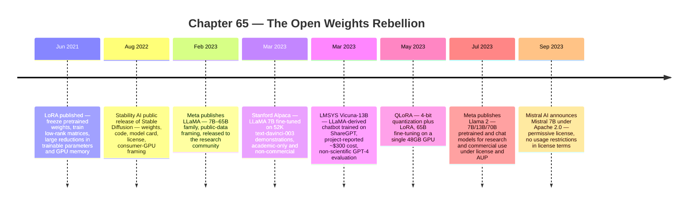

:::tip[In one paragraph]
Open weights changed deployment power without resolving open source, open data, or open governance. Stable Diffusion (August 2022) was the public precedent. LLaMA (February 2023) made a 7B–65B family portable for research; LoRA and QLoRA cut adaptation cost so Alpaca and Vicuna could wrap LLaMA in instruction behavior under non-commercial limits. Llama 2 (July 2023) opened commercial use; Mistral 7B (September 2023) shipped under Apache 2.0. The rebellion was a license-and-access ladder, not a single category.
:::

<strong>Cast of characters</strong>

| Name | Lifespan | Role |
|---|---|---|
| Robin Rombach / CompVis / Stability AI / RunwayML | — | Carried the Stable Diffusion public-release precedent (Aug 2022) into the language-model era; in this chapter the access layer, not the diffusion math (Ch58 owns that) |
| Hugo Touvron and Meta AI LLaMA teams | — | Lead authors on LLaMA (research-community release) and Llama 2 (general-public research/commercial release); the chapter's central institutional actor |
| Edward J. Hu et al. | — | LoRA authors (June 2021); freezing pretrained weights and training low-rank adapters made fine-tuning modular and cheap |
| Tim Dettmers and QLoRA collaborators | — | QLoRA authors (May 2023); 4-bit quantization plus LoRA pushed 65B fine-tuning onto a single 48GB GPU |
| Stanford CRFM Alpaca team / LMSYS Vicuna team | — | Early academic and community instruction-tuned descendants of LLaMA (March 2023) under explicit non-commercial and evaluation caveats |
| Mistral AI team | — | Permissive-release counterpoint via Mistral 7B (Sept 2023) under Apache 2.0 |

<strong>Timeline (2021–2023)</strong>

<strong>Plain-words glossary</strong>

**Open weights** — The trained numerical parameters of a model are made available to download. Execution freedom: another party can run, fine-tune, quantize, host, inspect, or fork the model. Distinct from open source, open data, and open governance, which the chapter treats as separate layers a release can be strong or weak on.

**Open source** — Code is released under a license that allows inspection, modification, and redistribution. A model can be open-weight without being open-source if its training code, pipeline, or data preparation are not also released under such a license.

**LoRA (Low-Rank Adaptation)** — A fine-tuning method (Hu et al., 2021) that freezes the original pretrained weights and trains small low-rank matrices alongside them. The base model stays fixed; the adaptation lives in a small module. The paper reports up to 10,000x fewer trainable parameters and 3x less GPU memory than full fine-tuning for a cited GPT-3 configuration.

**QLoRA** — A 2023 extension by Dettmers et al. that backpropagates through a frozen 4-bit quantized model into LoRA adapters. Uses NF4 quantization, double quantization, and paged optimizers to fine-tune a 65B model on a single 48GB GPU, where naive fine-tuning would require more than 780GB.

**Adapter** — A small set of additional trainable parameters layered onto a frozen base model (LoRA matrices are one example). Adapters become portable behavioral modifications: a few-MB file rather than a many-GB model copy, which is why the open-weight ecosystem began trading in adapters as distribution objects.

**Instruction tuning** — Fine-tuning a base language model on prompt/response pairs so it follows instructions in a chat-assistant style. Alpaca generated those pairs from text-davinci-003 outputs; Vicuna used user-shared ShareGPT conversations. Non-commercial restrictions on both sets of inputs constrained the resulting models' allowable downstream uses.

**Permissive license** — A software license such as Apache 2.0 or MIT that allows commercial use, modification, and redistribution with minimal conditions (typically attribution and patent-grant terms). Mistral 7B's Apache 2.0 release contrasts sharply with LLaMA 1's research-only access and Llama 2's commercial-with-AUP license.

"Open" became one of the most important and most confusing words in the AI product era.

It could mean open weights: the trained numerical parameters are available to download. It could mean open source: code is released under a license that allows inspection, modification, and redistribution. It could mean open data: the training set is available or at least specified enough to reproduce. It could mean open governance: decisions about releases, safety, and development are made in public or through a community process. These are not the same thing.

The open-weights rebellion began because weights are the operational prize. If the weights can be downloaded, the model can leave the API. It can be fine-tuned, quantized, hosted, inspected, benchmarked, forked, embedded into products, and run locally. That does not make it legally simple or ethically settled. It does change who can participate.

Weights are not the whole model supply chain, but they are the piece that changes deployment power. Without weights, a user interacts through a service. With weights, another actor can run the model on their own hardware, place it behind their own interface, or adapt it to their own domain. That shifts leverage. The original lab may still own the best pretraining process, the strongest future models, or the most trusted safety stack. But it no longer owns every execution path for that generation of capability.

This is why the vocabulary became politically charged. A company could release weights while withholding training data. A community project could call itself open source while depending on a restricted base model. A permissive license could coexist with opaque data. A research release could ignite commercial derivatives even when the license tried to prevent them. The rebellion lived in those gaps.

The gaps mattered because each layer gives a different kind of freedom. Open weights give execution freedom. Open code gives implementation freedom. Open data gives reproducibility freedom. Open governance gives decision freedom. A release can be strong on one layer and weak on another. The public debate often collapsed all of this into a single argument over whether a model was "open." The technical reality was more granular and more useful.

Execution freedom is the most disruptive layer because it changes who can run the system. Reproducibility may remain incomplete, and governance may remain closed, but the model can still become part of other people's infrastructure. That is why open weights had effects even when releases fell short of a purist definition of open source.

They were operationally open enough to change deployment, adaptation, and competition, even when the surrounding data, governance, and safety processes remained contested by researchers, companies, regulators, and users.

That granularity also explains why companies could disagree while using the same word. One lab might argue that broad weight release accelerates safety research and democratizes access. Another might argue that unrestricted release makes misuse harder to control. A startup might care less about the philosophy and more about whether the license permits commercial deployment. A hobbyist might care whether the model runs on local hardware. "Open" became a battlefield because different actors wanted different freedoms.

Chapter 64 explained why local and edge deployment made smaller, compressed, specialized models strategically important. Ch65 explains why downloadable weights made that strategy political. If a model can run outside a closed lab's infrastructure, the lab's control changes. The moat shifts from "only we can run it" to a messier fight over base models, licenses, data, adapters, leaderboards, hosting, hardware, and ecosystems.

The first public shock was visual.

Stable Diffusion showed that a capable generative model could leave the API and enter public hands. Its August 22, 2022 public release placed model weights, code, a model card, license terms, consumer-GPU feasibility claims, training-data notes, and limitations into view. Chapter 58 owns the diffusion mathematics and image-generation story. Here, Stable Diffusion matters as a precedent: a powerful generative model became something people could download, run, modify, and wrap into tools.

That public usability is what made it a precedent rather than only a release note. People could test the model directly, not just read a paper or call a hosted endpoint. The model entered workshops, laptops, Discord servers, notebooks, and prototype products.

The visible artifacts mattered as much as the generated images. A model card gave users a way to read limitations and intended uses. A license framed what the release allowed and restricted. Code and weights made reproduction and modification possible. Training-data notes connected the model to LAION and the broader web-data question. The public could argue with the release because the release was legible enough to argue about.

That changed the social shape of AI. An API centralizes control. The provider can rate-limit, monitor, update, refuse, and price the model. A released-weight model moves many of those decisions outward. A user can run it locally. A developer can build a new interface. A community can publish a fork. A platform can host a derivative. Safety controls become more distributed and harder to enforce uniformly.

The creative explosion after Stable Diffusion was therefore also an infrastructure lesson. People did not only produce images. They built front ends, model forks, prompt-sharing cultures, local workflows, and specialized variants. The release turned a model into a platform for downstream experimentation. That same platform logic would soon shape language models through instruction tuning, adapters, quantization, and hosting.

The safety problem changed shape too. With an API, a provider can update a central model, change a moderation layer, or block a user. With released weights, downstream copies may persist. Safety work has to move into licenses, model cards, community norms, platform policies, and derivative tooling. None of those controls are as simple as a central switch. Stable Diffusion made that trade-off visible before language models made it unavoidable.

Stable Diffusion also exposed the unresolved parts of "open." The model could be public enough to ignite a creative ecosystem while still carrying licensing limits, dataset provenance questions, and safety caveats. LAION became part of the story. OpenRAIL-M became part of the story. Model cards and limitations became part of the story. Open weights did not end governance. They made governance harder to ignore.

That is the pattern that repeats through this chapter. Every release expands access and creates new questions. Who can use the model commercially? What data trained it? Can the outputs be trusted? Can harmful uses be contained after download? Who is responsible for derivatives? Stable Diffusion did not answer these questions. It proved they would follow every major open-weight release.

The image model had another effect: it made local generative AI feel real. People could run a model outside a lab interface and see outputs. That public experience mattered when language models followed. The question was no longer whether released weights could produce an ecosystem. Stable Diffusion had already answered yes. The question became whether language models would do the same.

Meta's LLaMA made that portability concrete for text.

The LLaMA paper introduced models from 7B to 65B parameters. It framed the work around training on publicly available data and releasing models to the research community. Its headline performance claims were strategically important: LLaMA-13B was reported to outperform GPT-3 on most benchmarks, and LLaMA-65B was reported as competitive with Chinchilla-70B and PaLM-540B. Those are paper claims, not a neutral final verdict. But the signal was clear: smaller downloadable models could be serious.

The public-data framing was also strategic. Meta's paper argued that strong models could be trained without relying on proprietary datasets. That does not prove that every data question was solved. It does make a claim about reproducibility and openness: the model family was presented as compatible with a more open research ecosystem. In a field increasingly dominated by closed training recipes and undisclosed data mixtures, that claim mattered.

The smaller-model point was politically explosive. If a 13B model could approach or beat older giant models on many tests, then capability no longer looked inseparable from the largest closed systems. A university lab, startup, hobbyist group, or corporate platform could imagine building around a portable base model. The frontier might still require huge training runs, but the downstream ecosystem no longer had to wait politely behind one API.

LLaMA also changed the meaning of efficiency. A smaller model that is good enough to adapt may be more disruptive than a larger model that only one company can operate. The paper's title, "Open and Efficient Foundation Language Models," captured that dual claim. Efficiency was not only a training metric. It was a distribution strategy. Smaller models are easier to move, host, fine-tune, and run on constrained hardware.

The 7B-to-65B ladder mattered for the same reason. It gave the ecosystem different sizes to work with. A 65B model was more demanding but symbolically close to frontier comparisons. A 13B model could be easier to experiment with. A 7B model could become the base for fast community instruction-tuning projects. The family structure let people ask which size was good enough for which task instead of treating capability as a single monolithic endpoint.

LLaMA was not a fully open public artifact in the strongest sense. It was released to the research community, not as an unrestricted commercial product. The paper's public-data and open-sourcing language mattered, but it did not erase the license and access boundaries. That distinction is essential. The historical event was not "Meta made everything open." The event was that a high-quality family of language-model weights made the closed-lab moat look more porous.

That porousness is why LLaMA became a base layer in the public imagination. The official release terms were narrower than the ecosystem that formed around it. This chapter does not need to rely on unverified leak mechanics to make the point. The verified point is already enough: a serious language-model family was released for research, and community derivatives quickly made model portability the central story.

The community reaction was fast because the technical pathway was already waiting: adapters.

LoRA had shown how to make fine-tuning less like retraining an entire giant model. Hu and collaborators described freezing pretrained weights and injecting trainable low-rank matrices. The base model stays mostly fixed. The adaptation lives in small modules. The paper reported up to a 10,000x reduction in trainable parameters and a 3x reduction in GPU memory, and even a GPT-3 175B example where a cited configuration reduced VRAM and checkpoint size substantially.

The key idea is simple enough: do not modify every weight if the task can be learned through a low-rank update. Train a small set of adapter parameters instead. That makes adaptation cheaper, faster, easier to distribute, and easier to combine with a shared base model. A base model can become a platform. Adapters become portable behavior.

:::note
> A pre-trained model can be shared and used to build many small LoRA modules for different tasks.

This is the platform turn: one shared base, many distributable behaviors.
:::

Adapters also changed collaboration. If every fine-tune required distributing a full copy of the model, derivatives would be heavy and expensive. If the useful change can be packaged as a small adapter, communities can share behavior more easily. A medical vocabulary adapter, a programming assistant adapter, a stylistic adapter, or a tool-use adapter becomes a modular artifact. The base model remains common; the adaptations proliferate.

This changed what access meant. Released weights without an adaptation method are useful, but still heavy. Released weights plus LoRA become a community substrate. A team can fine-tune for a domain, language, style, instruction format, or tool behavior without storing and distributing a full new model. The derivative can be much smaller than the base. The base remains common infrastructure; the adapter becomes the community's contribution.

LoRA also weakened a common defensive claim from closed systems: that adaptation required deep internal access and expensive retraining. It still required skill and hardware, but the barrier had moved. A capable base model plus a lightweight adaptation method gave smaller teams a path to useful specialization. The lab that trained the base still mattered. But it was no longer the only actor that could shape behavior.

This is the moment when "model" became less singular. A product might consist of a base model, one or more adapters, a quantization recipe, a prompt format, retrieval components, and a serving wrapper. Users might refer to it by a single name, but the artifact was layered. Open weights made the base visible. LoRA made the adaptation layer visible. The ecosystem learned to trade in pieces.

QLoRA pushed the access frontier further. Dettmers and collaborators described backpropagating through a frozen 4-bit quantized model into LoRA adapters, enabling fine-tuning of a 65B model on a single 48GB GPU. The paper framed the memory reduction starkly, from more than 780GB to under 48GB in its setup, using techniques such as NF4, double quantization, and paged optimizers.

The political meaning of QLoRA was that hardware barriers fell again. If a large model can be fine-tuned without a multi-node training cluster, more actors can participate. That does not mean everyone can train a frontier model from scratch. It means more people can shape an existing model. The axis of competition moves from pretraining alone to adaptation, data curation, evaluation, quantization, and distribution.

The single-48GB-GPU claim became a symbol because it mapped onto accessible professional hardware rather than a hyperscale cluster. It made the phrase "fine-tune a large model" feel less like a privilege of giant labs. The resulting ecosystem still depended on the base model and on engineering expertise. But the threshold for experimentation had moved toward universities, startups, independent researchers, and determined hobbyists.

QLoRA's benchmark claims need the same caution as every other leaderboard claim in this era. The important Ch65 fact is not that one fine-tuned model won every comparison. It is that quantized fine-tuning made large-model adaptation practical in a much smaller hardware envelope. The rebellion was technical before it was rhetorical.

Then came the weekend clone moment.

Stanford's Alpaca project fine-tuned LLaMA 7B on 52,000 instruction-following demonstrations generated with text-davinci-003. The project released the training recipe and data and reported a surprisingly low cost for the data-generation and fine-tuning process. It also made the limits clear: Alpaca was academic-only and non-commercial because of upstream LLaMA and OpenAI terms, and its evaluations were preliminary.

Alpaca mattered because it made instruction-following feel reproducible. The closed chat product no longer looked like an indivisible secret. A base model, generated instruction data, and a fine-tuning recipe could produce a rough assistant-like model quickly. The result was not a finished replacement for a commercial system. It was a proof of cultural speed.

The generated-demonstration method is central to the story. Alpaca used outputs from text-davinci-003 to create instruction-following examples, then trained a smaller released-weight base model on them. That turned a closed model into a teacher for an open-weight descendant, within a research setting and with serious license limits. It showed how closed and open ecosystems could become entangled rather than separate.

The caveats are not footnotes. The data came from a closed model's outputs. The release was non-commercial. The cost accounting was project-reported, not a universal budget. The evaluation was limited. Alpaca's importance is historical, not triumphalist: it showed how fast a research community could wrap a released-weight base model in instruction-following behavior.

That speed was itself destabilizing. Labs that had spent years building products suddenly faced public examples of assistant-like behavior assembled with a small team, a base model, and a recipe. The quality gap still mattered. Safety still mattered. But the timeline compressed. A research blog post could trigger a wave of replications, variants, and debates within days.

Alpaca also changed expectations about documentation. The project did not merely announce a model; it described a recipe. That recipe culture was crucial for open weights. Builders wanted to know which base model was used, how instructions were generated, how fine-tuning was done, what it cost, and what limits applied. A reproducible story could be almost as influential as the model itself.

Vicuna amplified the pattern. LMSYS described Vicuna-13B as fine-tuned from LLaMA on about 70,000 user-shared ShareGPT conversations, with a reported training cost around $300. The blog also made the evaluation culture visible. Its famous "90% ChatGPT quality" line was explicitly framed with a caveat as fun and non-scientific. That caveat matters as much as the headline.

Vicuna showed both the power and the disorder of the open-weight ecosystem. Shared conversations became training material. Project-reported costs became part of the mythos. GPT-4-as-judge style evaluation began to shape perception. Non-commercial terms remained a boundary. The community could move incredibly quickly, but it also imported unresolved questions about data provenance, consent, evaluation, and licensing.

The ShareGPT connection is especially important because it foreshadows the data fight without resolving it here. User-shared conversations are not the same as a carefully consented dataset. They are also not the same as scraped books or images. They sit in a messy middle: public enough to circulate, personal enough to raise questions, useful enough to train on, and ambiguous enough to become governance pressure.

Vicuna also showed the pull of comparison. Once many models exist, people want a ranking. If no rigorous evaluation is available, informal judgments fill the vacuum. The "90%" claim became memorable precisely because it gave the community a simple story. The source's own caveat tells the more important history: open weights created demand for evaluation faster than the evaluation culture could mature.

Those questions belong mostly to later chapters. Ch66 owns benchmark politics. Ch68 owns data labor and copyright. Ch65 only needs to show why those problems became unavoidable. Once weights circulate and derivatives multiply, the ecosystem needs ways to decide which models are good, which data is legitimate, which uses are allowed, and which licenses matter.

The community also needed distribution channels. A released-weight ecosystem requires places to upload models, scripts to convert formats, tools to quantize weights, instructions for running locally, and benchmarks or demos that make quality legible. The rebellion was therefore not only a sequence of model releases. It was a supply chain forming in public around model artifacts.

The next turn was commercial.

Llama 2 moved the release frame beyond research access. Meta's Llama 2 paper described pretrained and fine-tuned chat models at 7B, 13B, and 70B parameters, released to the general public for research and commercial use. The paper also tied openness to safety research, reproducibility, licensing, acceptable-use policy, code examples, and a Responsible Use Guide.

That combination is important. Llama 2 was not "anything goes." It was a commercially usable open-weight release with terms, acceptable-use restrictions, and safety framing. It tried to capture the upside of broad access without giving up all governance claims. Whether that balance was enough is a political question. Historically, it marked a shift: open weights became a mainstream commercial strategy, not only a research-community leak or hobbyist phenomenon.

The commercial-use permission changed the audience. Companies that could not build on a research-only or non-commercial derivative now had a release they could evaluate for products. Enterprises could consider private deployments. Cloud providers and tooling companies could support it. Startups could pitch custom deployments without placing every request behind a closed-lab API. Llama 2 made open weights legible to business buyers.

For closed labs, this changed the competitive pressure. An API-only model could still be more capable, easier to update, and easier to supervise centrally. But an open-weight model could be cheaper to host in some contexts, easier to customize, available for private deployments, and attractive to developers who did not want to depend entirely on a remote provider. The battle was no longer only raw capability. It became capability under terms.

Those terms became part of product architecture. A license can determine whether a model can be embedded into an app, used in a regulated environment, modified for a customer, hosted by a cloud partner, or shipped to an edge device. The model's technical quality matters, but so does the permission structure around it. Open weights turned legal and operational questions into engineering inputs.

The release package also became a trust signal. Llama 2's license, acceptable-use policy, code examples, and responsible-use guidance were not incidental paperwork. They were part of the argument that wider access could be managed. The model was not just a file. It was a release program. That became one of the ways large companies tried to distinguish their open-weight strategy from uncontrolled circulation.

Mistral 7B sharpened the point by moving from commercially usable access toward a simpler permissive-license story. Mistral announced a 7.3B model released under Apache 2.0 and framed as usable without restrictions. Its paper reported that Mistral 7B outperformed the best open 13B model, used grouped-query attention and sliding-window attention, and released models under Apache 2.0. The performance claims should remain source-bound to Mistral's evaluation. The license shift is the historical center.

Apache 2.0 made Mistral feel different from gated or limited releases. It was not merely "available." It was permissively licensed. Developers could build commercial products without navigating the same restrictions as research-only or non-commercial descendants. The announcement culture, including direct downloads and a more hacker-friendly release style, made the model part of an infrastructure movement as much as a paper result.

The architecture claims also connected back to the edge and inference chapters. Grouped-query attention and sliding-window attention were not only benchmark details; they were part of making a smaller model efficient and deployable. Mistral's significance was therefore twofold: a permissive release and a compact model designed to compete above its size class. It fit the new ecosystem's appetite for models that could be downloaded, hosted, and adapted without frontier-lab permission.

Mistral also showed that the open-weight strategy was not only defensive or academic. A new company could use a permissive release to gain developer mindshare, attract infrastructure support, and become part of the default shortlist for builders. Releasing weights became a go-to-market move. It created adoption, discussion, benchmarks, forks, and trust among developers who preferred to inspect and run the model themselves.

This is where the word "open" must stay precise. Llama 2 and Mistral 7B both matter to the open-weight story, but they are not identical. Llama 2 broadened commercial access under Meta's license and acceptable-use structure. Mistral 7B emphasized a permissive Apache 2.0 release. Stable Diffusion had a different license and a different data controversy. Alpaca and Vicuna had non-commercial boundaries. LLaMA 1 was research-community access. The rebellion was a ladder, not a category.

The ladder changed the industry. Base models became ecosystem objects. Adapters became distribution objects. Quantized versions became deployment objects. Leaderboards became reputation objects. Hosting services, local inference tools, model hubs, and fine-tuning recipes became infrastructure. Closed labs had to explain why their control was worth the trade-off. Cloud vendors had to support open-weight hosting. Regulators had to think about downloadable capability rather than only centralized APIs.

The new infrastructure also made failure more distributed. A weak fine-tune could damage a model's reputation. A poor quantization could make a good model look bad. A leaderboard could reward the wrong behavior. A license misunderstanding could turn a prototype into a legal problem. The ecosystem gained freedom and also gained many new ways to be sloppy.

It also changed developer identity. A builder could be a model user, fine-tuner, quantizer, evaluator, packager, host, or app developer without being a frontier pretraining lab. That division of labor made the ecosystem larger and harder to govern. It let specialized communities form around small improvements. It also made quality uneven, because many derivatives came with thin documentation, weak evaluation, or unclear data lineage.

Open weights did not make AI democratic in any simple way. Training a frontier base model still required money, data, engineering, and hardware. Released weights could still carry restrictive licenses, opaque data, safety risks, and commercial power. Communities could still overclaim benchmarks or ignore data provenance. A model can be downloadable and still not be open in the deeper senses of data, process, or governance.

That honesty is necessary because the rebellion had real limits. Open weights can broaden access while leaving data centralized, compute expensive, and downstream platforms concentrated. A model hub can become a gatekeeper. A cloud provider can capture deployment. A permissive license can coexist with unknown training data. A community benchmark can become a marketing weapon. The open-weight movement expanded the field of actors; it did not abolish power.

The limits are why the rebellion did not end closed AI. Closed systems retained advantages: stronger frontier models, integrated products, centralized safety updates, proprietary data pipelines, enterprise support, and massive serving infrastructure. Many users preferred the convenience of an API. Many businesses preferred a managed service. Open weights created an alternative center of gravity, not a total replacement.

But open weights did make AI less containable. They turned models into artifacts that could circulate. They let small teams adapt large systems. They let local deployment and edge constraints become commercially relevant. They gave startups and hobbyists something to build on. They made the question of openness operational rather than philosophical.

By the end of 2023, the closed-lab API was no longer the only imagined future. There was another path: base weights released under varying terms, adapters trained cheaply, models quantized for smaller hardware, communities evaluating and arguing in public, and companies building products on top. The open-weights rebellion did not settle who should control AI. It made the fight impossible to avoid.

That is why "rebellion" is the right word even though the story includes large companies. The rebellion was not only hobbyists against labs. It was a shift in the default assumption about where model capability could live. Once capable weights circulated, control became negotiated through licenses, tooling, hosting, regulation, norms, and downstream ecosystems. The model was no longer only a service. It was a thing people could possess.

:::note[Why this still matters today]
Every "is this model open?" argument a practitioner walks into runs on the four-layer ladder this chapter installs: open weights, open source, open data, open governance. A release can be strong on one and weak on another, and the layer that matters most depends on what is being built. A regulated deployment may need permissive licensing and AUP clarity above all else. A reproducibility audit needs data and training code, not just downloadable weights. A safety review cares about governance and update channels. Every model card, license argument, fine-tune disclosure, and "open-source AI" definition fight from the OSI's OSAID process onward is contesting the same gaps Stable Diffusion, LLaMA, Alpaca, Vicuna, Llama 2, and Mistral 7B made unavoidable in 2022–2023.
:::

