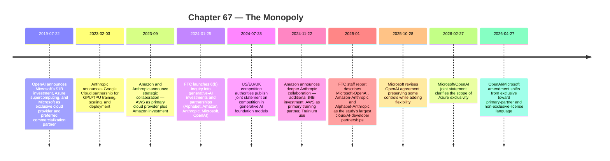

:::tip[In one paragraph]
AI's late-era "monopoly" was not one firm but a stack of bottlenecks: accelerators, hyperscaler clouds, frontier-lab partnerships, IP licenses, enterprise distribution, and compliance. The Microsoft/OpenAI template was followed by other hyperscaler-lab partnerships, regulators began naming key-input concentration, and later contract revisions showed exclusivity mutating rather than disappearing. Platform power changed shape, not substance.
:::

<strong>Cast of characters</strong>

| Name | Lifespan | Role |
|---|---|---|
| NVIDIA | — | Accelerator supplier whose chips became the upstream bottleneck for frontier training and inference. |
| Microsoft / OpenAI | — | Original cloud-partnership template linking frontier research, Azure capacity, IP rights, and enterprise commercialization. |
| Amazon / Anthropic | — | September 2023 strategic collaboration with AWS as primary cloud provider and Amazon investment; November 22, 2024 deepening with an additional $4B investment, AWS as primary training partner, and Trainium use. Replication of the hyperscaler-frontier-lab template with custom silicon. |
| Google Cloud / Anthropic | — | February 3, 2023 partnership: Anthropic selected Google Cloud as cloud provider, used GPU and TPU clusters to train, scale, and deploy systems. Third instance of the template. |
| FTC | — | Regulator that used a 6(b) inquiry and staff report to study hyperscaler/frontier-lab partnerships. |
| US/EU/UK competition authorities | — | July 23, 2024 joint statement on competition in generative AI: warned about restriction of key inputs, existing market power extending into AI, and partnerships/investments that could steer market outcomes. |

<strong>Timeline (2019–April 2026)</strong>

<strong>Plain-words glossary</strong>

**Stack concentration / platform power** — Market influence that arises not from owning a single product, but from controlling several layers a competitor must use: chips, cloud capacity, model APIs, IP licenses, distribution channels, and compliance posture. The chapter uses "concentration," "bottleneck," and "platform power" rather than "monopoly" because the latter is a legal verdict the cited sources do not deliver.

**6(b) inquiry** — A non-enforcement information-gathering study under Section 6(b) of the FTC Act. The FTC issues orders compelling firms to provide information for an industry-wide market study. The January 2024 6(b) inquiry into Alphabet, Amazon, Anthropic, Microsoft, and OpenAI sought information about key inputs and competitive impact of cloud/AI-developer partnerships, not a finding of wrongdoing.

**Exclusive cloud provider** — a cloud-partnership term whose scope changed across the Microsoft/OpenAI relationship; the chapter dates each phrasing rather than treating "exclusive" as timeless.

**AWS Trainium** — Amazon's custom AI training accelerator. Per Amazon's November 22, 2024 announcement, Anthropic named AWS its primary training partner and would use Trainium to train and deploy its largest foundation models. Custom-silicon usage matters because it deepens technical lock-in beyond renting generic compute.

**Stateless API** — API calls that do not retain server-side context across requests; in this chapter, the term matters because it narrowed a cloud-exclusivity claim.

**Vertical control / horizontal rivalry** — Horizontal competition is firms competing at the same layer (model labs vs. model labs). Vertical control is one firm shaping outcomes at the layers above and below it (e.g., a cloud provider influencing which model labs can scale because it controls compute and distribution). The July 2024 joint statement warned about both, with vertical/incumbent-extension risk being the chapter's central concern.

The monopoly was not one company.

That is the first thing to get right. Late-era AI did not organize itself around a single cartoon gatekeeper with one switch. It organized itself around a stack of gates. One firm might control the most desirable accelerators. Another might control the cloud where the models run. Another might own enterprise distribution. Another might hold the model weights, the API, the safety layer, the customer relationship, the developer platform, or the contract that decides where a product ships first.

This is why the word "monopoly" in this chapter is pressure, not a legal verdict. The sources here do not establish that a court or regulator found an illegal monopoly. They show concentration, bottlenecks, partnerships, and competition concerns. The more precise language is platform power: the ability to shape what others can build because key inputs and routes to market run through a small number of firms.

Chapter 66 showed how benchmarks turned model quality into reputation. But reputation only becomes market power when it can be converted into products. A model that tops a leaderboard still needs chips, datacenters, inference capacity, distribution, safety infrastructure, compliance, enterprise trust, and a way to reach users. In the frontier-model era, those needs pulled AI back toward the largest technology platforms.

Open weights challenged that pull, but they did not dissolve it. Chapter 65 described the rebellion: downloadable weights, community fine-tunes, adapters, quantization, and local deployment. Those tools widened participation. They changed who could experiment. They gave startups, researchers, and users alternatives to closed APIs. But the frontier was still expensive. Training the largest systems, serving them at scale, selling them to enterprises, and integrating them into everyday software required infrastructure that only a few companies could provide.

The stack had more than one tollbooth.

The July 2024 joint statement from competition authorities in the United States, European Union, and United Kingdom named the shape of the problem. It warned about key inputs, existing market power extending into AI, feedback effects, and partnerships or investments that could influence market outcomes. The statement identified chips, compute, data, technical expertise, platforms, distribution channels, and partnerships as places where concentration could matter.

That list is the map of Ch67.

If a model needs specialized chips, chip supply matters. If those chips sit inside hyperscale clouds, cloud contracts matter. If enterprise buyers prefer established vendors, distribution matters. If safety, security, and compliance become requirements for procurement, platform trust matters. If frontier labs need billions of dollars in capital and reserved compute, their partnerships matter. If a cloud provider receives preferred access to model IP, API routes, or first-product launches, market structure changes even without a simple acquisition.

The result was not old-style monopoly in a single box. It was stacked dependency.

Stacked dependency is harder to see than a single locked gate. A developer might experience the stack as a convenient API. A startup might experience it as a cloud bill. A frontier lab might experience it as a compute reservation and an investor relationship. An enterprise buyer might experience it as a security review, a procurement contract, and a familiar vendor portal. Each layer looks like a normal business need. Together they decide who can compete.

The deeper issue is substitution. If one layer fails, can a rival realistically replace it? A lab can change a software library more easily than it can replace a training cluster. A company can switch a prompt format more easily than it can rebuild enterprise distribution. A model provider can change a product name more easily than it can obtain enough accelerators, compliance coverage, and cloud capacity to serve millions of users. Bottlenecks become powerful when alternatives exist in theory but are slow, expensive, or risky in practice.

This is why AI concentration should not be measured only by model quality. A slightly weaker model with privileged distribution may beat a stronger model that is hard to buy. A closed model inside an enterprise platform may reach more users than an open model that requires local deployment expertise. A cloud-hosted model with compliance paperwork may win regulated customers before a technically elegant competitor finishes procurement review. The stack converts infrastructure into advantage.

Every layer could be defended as practical. Frontier labs needed money. Hyperscalers needed products that made their clouds more valuable. Enterprises wanted trusted vendors. Regulators wanted visibility into safety and competition. Chipmakers responded to demand. Customers wanted working systems, not philosophical purity. Yet the practical choices lined up in a way that made the new AI economy look less decentralized than the open-weights moment suggested.

The same deal could therefore look different from each seat at the table. To a lab, it was survival infrastructure. To a cloud provider, it was product strategy. To a customer, it was a safer route to adoption. To a regulator, it was a possible way for old platform power to shape a new market before the market had fully formed.

The first gate was compute.

NVIDIA's fiscal 2024 10-K made the bottleneck visible in financial language. Data Center revenue reached $47.5 billion, up 217 percent. NVIDIA reported surging demand for data-center systems and products and increased supply and capacity purchases. It also said large cloud providers represented more than half of Q4 fiscal 2024 Data Center revenue, and estimated that about 40 percent of fiscal 2024 Data Center revenue was for AI inference.

Those numbers are not merely a company success story. They show where the scarce input was moving. AI had become a datacenter business. The bottleneck was no longer only a clever architecture or a clever training objective. It was the ability to buy, allocate, power, cool, network, schedule, and use accelerators at scale.

This changed the psychology of the field. A research group could publish an idea. An open community could improve a model. But frontier competition increasingly began with a procurement problem: who can get enough chips, soon enough, at the right price, with the right networking and cloud support, to train or serve the next system?

Compute scarcity also changed time. A model team with a cluster can run experiments, fail, adjust, evaluate, and run again. A team waiting for capacity loses iteration speed. In machine learning, iteration speed is not administrative overhead. It is part of research. The lab that can afford more failed runs can search a larger design space. The company that can reserve more inference capacity can accept more users, gather more product feedback, and justify more investment.

The bottleneck therefore had two faces. Training compute determined who could attempt the largest new models. Inference compute determined who could turn a model into a reliable product. The contract with users begins after the paper: latency, uptime, throughput, cost, abuse handling, and regional availability. A model that is brilliant but too expensive or scarce to serve can lose to a model that is slightly weaker but available everywhere.

That is why NVIDIA's fiscal 2024 inference estimate matters. The public conversation often focused on training runs, but NVIDIA estimated about 40 percent of fiscal 2024 Data Center revenue was for AI inference. Inference was not a footnote after training. It was already a large part of the business. Once millions of people and companies began calling models repeatedly, serving the model became its own industrial workload.

The GPU became a tollbooth because it sat upstream from almost everything else. Training needs accelerators. Inference at large scale needs accelerators. Fine-tuning, evaluation, synthetic data generation, multimodal processing, and safety testing all consume compute. A model can be intellectually open and still economically constrained if running it well requires hardware that is scarce or expensive.

This is why chip supply translated into cloud power. A small firm might not buy and operate the necessary cluster directly. It might rent from a hyperscaler. A frontier lab might need a long-term cloud partner to guarantee capacity. An enterprise customer might prefer to consume the model through a cloud platform that already handles identity, security, billing, logging, governance, and support.

The accelerator bottleneck did not automatically make NVIDIA a legal monopolist, and this chapter does not claim that. The supported claim is narrower and stronger: demand for AI compute surged, NVIDIA's data-center business became one of the central financial signals of that surge, and large cloud providers were deeply tied to the demand side. That made chips a key input in the competition authorities' sense.

The model race became a cloud race.

Microsoft and OpenAI made the template visible early. On July 22, 2019, OpenAI announced Microsoft's $1 billion investment and partnership. The announcement said the companies would build Azure AI supercomputing technologies, and that Microsoft would become OpenAI's exclusive cloud provider. It also said OpenAI intended to license some pre-AGI technologies, with Microsoft as preferred commercialization partner.

This was not just funding. It tied research ambition to infrastructure and distribution.

For OpenAI, the deal offered capital, compute, and a path into enterprise products. For Microsoft, it offered proximity to frontier models and a way to make Azure the platform on which those models were developed and sold. The partnership connected the laboratory, the cloud, and the commercial channel in one structure.

The commercial channel is easy to underestimate. A frontier model can impress researchers and early adopters without being easy for a bank, hospital, manufacturer, government agency, or large software company to buy. Enterprise AI requires identity management, audit logs, data controls, billing, support agreements, security reviews, compliance language, and vendor accountability. Those requirements favor platforms that already sell into large organizations.

That advantage does not require a platform to block competitors outright. Default access can be enough. If a model is already available through the cloud account a company uses, the procurement path is shorter. If it plugs into developer tools and office suites the company already governs, internal adoption is easier. If the vendor already has a legal and compliance relationship with the customer, the model inherits trust from the platform.

This is why the Microsoft/OpenAI template mattered beyond the headline investment. Azure supercomputing supported model development. Azure API exclusivity shaped how model access could be sold. Microsoft's preferred commercialization role connected frontier models to existing enterprise software gravity. The partnership made model capability legible as a cloud product.

That structure mattered because model capability alone did not create a business. A model needed to be hosted. It needed APIs, reliability, security, developer tools, billing, support, and integration into workplace software. Microsoft already had the enterprise surface area. Azure could provide compute. OpenAI could provide frontier-model research. The partnership made the pieces reinforce each other.

It also showed how exclusivity could become an infrastructure fact. In 2019, OpenAI described Microsoft as the exclusive cloud provider. That does not mean every later term was identical. The guardrail is date discipline. But the original arrangement made the pattern clear: a frontier lab's future could be linked to a hyperscaler's cloud.

By October 2025, the terms had evolved. Microsoft said the revised agreement preserved key elements: Microsoft continued to have exclusive IP rights and Azure API exclusivity until AGI. At the same time, Microsoft said OpenAI could jointly develop some products with third parties, Microsoft no longer had a right of first refusal to be OpenAI's compute provider, and OpenAI could release certain open-weight models.

That is what platform power looks like when it mutates. The wall did not simply stand or fall. Some doors opened. Others remained controlled. Azure API exclusivity and IP rights persisted in the company's October 2025 framing, while compute and product flexibility expanded in defined ways.

In February 2026, a Microsoft/OpenAI joint statement clarified that Azure remained the exclusive cloud provider for stateless OpenAI APIs and that first-party products would continue to be hosted on Azure. It also said third-party collaborations were contemplated under the existing agreements, and that stateless API calls to OpenAI models from such collaborations would be hosted on Azure.

Then, on April 27, 2026, OpenAI announced another amendment. In that latest official statement, Microsoft remained OpenAI's primary cloud partner, and OpenAI products would ship first on Azure unless Microsoft could not or chose not to support the necessary capabilities. OpenAI said it could now serve all its products to customers across any cloud provider. Microsoft's license to OpenAI IP continued through 2032, but became non-exclusive. Revenue share payments from OpenAI to Microsoft continued through 2030, and Microsoft remained a major shareholder.

The lesson is not that exclusivity vanished. The lesson is that exclusivity became more granular.

Primary cloud is not the same as exclusive cloud. A non-exclusive IP license is not the same as no IP advantage. First-ship on Azure is not the same as all-cloud neutrality. Revenue-share obligations and shareholder status are not the same as ownership, but they are not nothing. The relationship became less simple while remaining strategically important.

This is why the Microsoft/OpenAI partnership is the central case for Ch67. It shows how the AI stack can be organized through investment, cloud capacity, IP licensing, API distribution, product timing, and enterprise channels without needing a conventional acquisition.

It also shows why partnership terms must be treated as history, not slogans. "Exclusive" meant one thing in the 2019 announcement, another in the October 2025 Microsoft statement, another in the February 2026 clarification, and another after the April 27, 2026 amendment. A stale sentence can become false quickly. The durable fact is not a single frozen exclusivity claim. The durable fact is that the relationship remained strategically consequential while its legal and commercial shape changed.

That mutability matters for competition analysis. If market power can move through cloud status, API routes, IP rights, revenue sharing, product timing, and investment exposure, then looking only for simple ownership can miss the structure. A partnership can loosen one control while preserving another. It can open multi-cloud serving while retaining first-ship priority. It can make a license non-exclusive while preserving long-term access and distribution advantages.

The template then replicated.

Anthropic's Google Cloud partnership was announced on February 3, 2023. Anthropic said it had selected Google Cloud as a cloud provider and would use GPU and TPU clusters to train, scale, and deploy AI systems. Google's company-side release described Google Cloud as Anthropic's preferred cloud provider and said Google Cloud intended to build TPU and GPU clusters for Anthropic.

The details differ from Microsoft/OpenAI, and the chapter should not flatten them into one identical pattern. But the structure rhymes. A frontier lab needs training and deployment infrastructure. A cloud provider offers GPUs, custom chips, managed systems, and market reach. The relationship is described in terms of reliable and responsible AI, infrastructure scale, and model development. The lab gets capacity. The cloud gets proximity to frontier capability.

Amazon and Anthropic showed another version. In September 2023, the companies announced a strategic collaboration that included AWS as Anthropic's primary cloud provider and Amazon investment. In November 2024, Amazon announced an additional $4 billion investment and said Anthropic had named AWS its primary training partner. Amazon's announcement said Anthropic would use AWS Trainium to train and deploy its largest foundation models.

Trainium matters because it shows that the hyperscaler partnership was not only about renting generic compute. Custom accelerators became part of the competition. AWS did not merely want to host model inference. It wanted its own chips to become part of the frontier training and deployment stack. Google had TPUs. Microsoft had Azure infrastructure and its own silicon ambitions. NVIDIA remained central, but hyperscalers also wanted differentiated hardware underneath the cloud service.

Custom accelerators changed the partnership logic. If a frontier lab trains or serves important workloads on a cloud provider's chips, the relationship deepens. The lab helps validate the hardware. The cloud provider gains a demanding customer and a flagship proof point. The model developer may gain capacity or price advantages. The dependency is technical, not only financial.

That dependency can produce real engineering benefits. A model team and cloud team can optimize infrastructure together. They can make a system run faster or cheaper than it would through a more arm's-length relationship. But the same optimization can make exit harder. Workloads tuned for one cloud's chips or managed services may not move cleanly to another provider.

This is why the Google/Anthropic and Amazon/Anthropic examples belong next to Microsoft/OpenAI even though their terms differ. The shared pattern is not identical ownership. It is the repeated pairing of frontier labs with hyperscaler infrastructure: GPUs and TPUs, Trainium, managed deployment, cloud marketplaces, enterprise channels, and safety narratives. The frontier lab becomes more capable because of the platform. The platform becomes more valuable because of the frontier lab.

The pattern is therefore broader than "labs need money." It is labs need compute, clouds need models, and both sides need a story about safety, enterprise trust, and long-term capacity. The partnerships join capital to infrastructure and infrastructure to distribution.

Company statements emphasize benefits: better systems, reliable infrastructure, responsible development, broader access, and faster innovation. Those claims should be treated as company framing, not neutral market analysis. The companies may be right that the partnerships enable useful products. They may also be creating dependencies that make it harder for independent rivals to compete. The sources here support the fact of the partnerships and the terms companies announced, not a hidden motive.

Regulators began naming the pattern.

On January 25, 2024, the FTC announced a 6(b) inquiry into generative AI investments and partnerships. The orders went to Alphabet, Amazon, Anthropic, Microsoft, and OpenAI. The FTC named the Microsoft/OpenAI, Amazon/Anthropic, and Google/Anthropic relationships and sought information about competitive impact and key inputs and resources for generative AI.

This was important because the regulator was not only looking at completed mergers. It was looking at partnerships, investments, and commercial relationships. That fits the AI stack. A frontier lab might remain legally independent while being deeply tied to a cloud provider through compute, capital, licenses, distribution, and revenue arrangements.

The FTC's January 2025 staff report made the study more concrete. It examined the largest cloud service provider and AI developer partnerships: Microsoft-OpenAI, Amazon-Anthropic, and Alphabet-Anthropic. The report summarized public reporting and public partnership values, including Microsoft-OpenAI, Amazon-Anthropic, and Google-Anthropic amounts. It also described information gaps that made it hard to understand market-level effects from public information alone.

The public-dollar table was striking, but it needs a caveat. The values in the FTC staff report were based on public reporting and company announcements: $13.75 billion for Microsoft-OpenAI, $8 billion for Amazon-Anthropic, and $2.55 billion for Google-Anthropic. They are not a complete inside view of the contracts. Even so, the scale made the question unavoidable. The regulator was not examining small reseller relationships. It was examining multi-billion-dollar arrangements between the largest cloud providers and the most visible frontier AI developers.

The report's importance was not only the numbers. It was the categories of questions. Who gets access to compute? Who has rights to model output, model IP, or future products? Can a cloud provider influence a model developer's path to market? Can an incumbent platform use its existing customer base, infrastructure, and capital to shape a new market before independent competition matures? Those are stack questions, not just investment questions.

That last point matters. Platform power is often contractual and infrastructural before it is visible to users. A consumer sees a chatbot. A developer sees an API. An enterprise buyer sees a procurement-approved product. But beneath that interface are contracts about compute, IP, revenue share, model access, exclusivity, first launch, and cloud routing. Public announcements reveal only part of the structure.

The joint US/EU/UK competition statement in July 2024 gave the concern a broader vocabulary. It warned that firms might restrict access to key inputs, extend existing market power into AI markets, or use partnerships and investments in ways that could coopt competitive threats or steer market outcomes. It identified specialized chips, compute, data, and technical expertise as critical ingredients. It also pointed to distribution channels and incumbent platforms.

:::note
> For example, platforms may have substantial market power at multiple levels related to the AI stack.

That sentence matters because it makes "platform power" vertical and layered, not a finding that one firm is a legal monopoly. — *FTC/DOJ/European Commission/CMA, "Joint Statement on Competition in Generative AI Foundation Models and AI Products," July 23, 2024.*
:::

That language was careful. It did not declare a final violation. It described risks, incentives, and areas of attention. The caution is part of the point. Regulators were mapping a market that was forming faster than traditional antitrust categories could comfortably explain.

The statement also made clear that the concern was not only horizontal rivalry among model labs. It was vertical control over inputs and routes. A firm with cloud infrastructure might not need to own every model if it controls enough of the capacity those models require. A firm with a dominant consumer or enterprise surface might not need the best model if it can distribute a good model more efficiently. A firm with specialized chips might not decide product features, but it can shape who gets to build at all.

That vertical structure made AI competition feel different from a simple leaderboard. Benchmarks compare outputs. Markets compare stacks. A model with a better score may still depend on a rival's cloud. A lab with strong research may still need a platform partner to reach enterprises. A startup with a novel interface may still pay the cloud, the model API, and the accelerator supplier. Power accumulates where dependencies converge.

The old digital-platform story was about search, social graphs, app stores, operating systems, advertising markets, and cloud dominance. The new AI story added foundation models, accelerator scarcity, training data, model APIs, safety systems, and datacenter scale. The danger was not only that a new AI firm might become powerful. It was that existing digital-market power might extend into the AI layer before competitors had room to grow.

Distribution made that risk tangible.

An AI model inside a cloud marketplace is not just a model. It is attached to identity systems, billing accounts, compliance certifications, procurement workflows, logging, storage, network controls, and existing vendor relationships. A model inside office software is not just an API. It arrives where workers already spend their day. A model available through a developer platform inherits documentation, support, and trust from the platform.

That does not make integration bad. Integration is why products become usable. But integration also makes competition unequal. A startup may have a strong model and still struggle to match the enterprise channel, compliance posture, and infrastructure reliability of a hyperscaler. An open-weight model may be technically strong and still lose to a model that ships inside the tools customers already buy.

Procurement turns this into a moat without needing a dramatic act of exclusion. A large customer rarely wants a raw model alone. It wants service commitments, data-handling terms, auditability, incident response, indemnity language, access controls, and a vendor that its finance and security teams already know how to manage. Those requirements are rational. They also favor companies that have spent decades building enterprise relationships. The result is that distribution is not only a marketing advantage. It is an institutional pathway through which capability becomes adoption.

This is why a market can look open at the model layer and still feel closed at the purchasing layer. The customer is not only choosing tokens. It is choosing risk ownership, support burden, institutional accountability, and the operational surface its own staff can safely govern after the purchase.

This is the tension at the heart of Ch67. The same infrastructure that makes frontier AI deployable also concentrates power.

Cloud capacity is useful. Enterprise distribution is useful. Safety and compliance infrastructure are useful. Custom chips can lower costs or increase performance. Deep partnerships can accelerate development. But when the necessary layers cluster around a few firms, the market becomes path-dependent. Users do not choose among pure models. They choose among stacks.

A stack can be sticky without being formally closed. A company may allow third-party products while still making its own cloud the default. It may support open-weight releases while keeping the best enterprise integration for its preferred models. It may permit multi-cloud serving while shipping first on one platform. It may provide APIs broadly while retaining IP rights, revenue participation, or privileged product access.

This is why the 2025-2026 Microsoft/OpenAI sequence is such a useful ending. It resists the simple story.

If the story were "closed monopoly," the April 2026 amendment would not fit. OpenAI said it could serve all products across any cloud, and Microsoft's license became non-exclusive. That is real flexibility. If the story were "partnership power disappeared," the amendment also would not fit. Microsoft remained primary cloud partner. Products shipped first on Azure under specified conditions. The license continued through 2032. Revenue share from OpenAI to Microsoft continued through 2030. Microsoft remained a major shareholder.

Platform power did not vanish. It changed shape.

That is the broader lesson. AI concentration was not only about who had the best model. It was about who could assemble and control the stack around the model. The stack included chips, datacenters, clouds, custom accelerators, APIs, IP licenses, enterprise distribution, safety reviews, procurement channels, and regulatory posture. Each layer could be justified on operational grounds. Together they made the industry hard to enter at frontier scale.

This does not mean open alternatives were irrelevant. They mattered precisely because they attacked parts of the stack. Open weights weakened API dependence. Quantization weakened hardware dependence for smaller deployments. Community fine-tuning weakened centralized product control. Local inference weakened cloud dependence for some uses. But none of those fully solved frontier training, hyperscale serving, enterprise distribution, or compliance.

So the monopoly was not one gate. It was the alignment of many gates.

That alignment sets up the next fights. Ch68 turns to data labor, copyright, and provenance: who supplied the examples and who has the right to use them. Ch70 and Ch72 turn to energy and datacenters: what it physically costs to run the stack. Ch71 turns to chip geopolitics and export controls: who can obtain the accelerators in the first place.

Benchmarks made capability visible. Platforms turned capability into markets. The next question was who paid the hidden costs of the data and infrastructure underneath.

:::note[Why this still matters today]
Today's AI procurement still routes through the stack this chapter names. When you choose a model, you also choose an accelerator family (often NVIDIA), a cloud (Azure, AWS, or Google), a billing/identity/compliance posture, and a partnership channel into enterprise software. The Microsoft/OpenAI, Amazon/Anthropic, and Google/Anthropic relationships continue to shape which model ships first inside which cloud marketplace. Open-weight models partially route around API exclusivity, but frontier training and hyperscale serving still concentrate around a handful of firms. Reading any current "AI strategy" announcement — cloud expansion, exclusive distribution, custom-silicon investment — is reading another revision of the stack this chapter mapped.
:::
