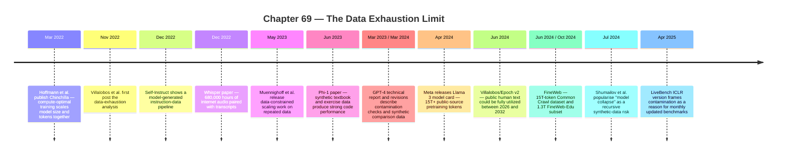

:::tip[In one paragraph]
In March 2022, DeepMind's Chinchilla showed compute-optimal training must scale model size and tokens together. Two years later, Llama 3's 15T-token model card and FineWeb made the public web feel countable. Villalobos and Epoch AI then estimated public human text could be fully utilized between 2026 and 2032 if trends continued. Engineers answered with a portfolio — filter, deduplicate, repeat, transcribe audio, synthesize textbooks — and each workaround changed the signal. Benchmark contamination spread the exhaustion problem into evaluation.
:::

<strong>Cast of characters</strong>

| Name | Lifespan | Role |
|---|---|---|
| Jordan Hoffmann | — | Lead author of the 2022 Chinchilla paper; argued compute-optimal training scales parameters and tokens together |
| Pablo Villalobos | — | Lead author of the Epoch AI "Will we run out of data?" analysis; put a 2026–2032 date range on public-text exhaustion |
| Niklas Muennighoff | — | Lead author of "Scaling Data-Constrained Language Models"; characterised repetition, filtering, and code augmentation under finite data |
| Alec Radford | — | Lead author of Whisper; demonstrated 680,000 hours of internet audio paired with transcripts as a multilingual supervision corpus |
| Sebastien Bubeck | — | Senior author of phi-1 / "Textbooks Are All You Need"; argued curated synthetic textbook data could alter scaling in code |
| Ilia Shumailov | — | Lead author of "The Curse of Recursion"; defined model collapse as recursive training on generated data erasing distribution tails |

<strong>Timeline (2022–2025)</strong>

<strong>Plain-words glossary</strong>

**Chinchilla-optimal scaling** — Hoffmann et al.'s 2022 finding that, for a fixed compute budget, language-model training should scale parameters and training tokens together rather than pour compute into ever-larger models on fixed datasets. The headline comparison: a 70B-parameter model trained on 1.4T tokens beat a much larger model trained less optimally with the same compute.

**Token** — The unit a language model trains on, roughly a sub-word fragment. "15T tokens" describes the volume of text a model has seen; it is not the same as 15T unique words, since a token vocabulary mixes whole words, word pieces, punctuation, and code symbols.

**Common Crawl** — The repeated public-web snapshot archive that sits between web abundance and dataset scarcity. FineWeb derives 15T tokens from 96 Common Crawl snapshots; the snapshots are dated, bounded, and filtered by crawl coverage, not the web itself.

**Multi-epoch training** — Training a model for more than one pass over the same dataset. Muennighoff et al. found up to about four epochs of repeated data could have negligible loss change; beyond that, repetition decays in value and overtraining consumes effective stock faster.

**Synthetic data** — Training examples generated by a model rather than written by humans. Self-Instruct generated and filtered instruction examples; phi-1 used GPT-3.5 to write textbook-style code exercises. The value depends on filtering, grounding, and task shape — not on raw volume.

**Model collapse** — Shumailov et al.'s warning that training recursively or indiscriminately on model-produced data can make models forget the true distribution, especially the tails: rare expertise, dialects, edge cases, and minority patterns disappear as generated data flattens the corpus.

**Benchmark contamination** — A leak of test questions, paraphrases, solutions, or commentary into training data, making evaluation results harder to interpret. GPT-4's technical report ran substring-based cross-contamination checks; LiveBench used recent, monthly updated questions as a contamination-limited response.

The web looked infinite until scaling laws started counting it.

Chapter 68 followed the legal and labor reckoning around data: people labeling outputs, writers and artists objecting to training use, publishers negotiating licenses, platforms selling access, and crawler controls separating search from model training. Ch69 turns from permission to supply. Even if a lab could legally use a corpus, how much useful human text remained? How many times could it be reused? What counted as a fresh example? What happened when model outputs began flowing back into the web?

This is the data exhaustion limit.

The phrase can mislead. Humanity did not run out of language. People kept writing emails, books, source code, messages, papers, subtitles, comments, and documents. The physical world kept producing images, audio, video, sensor readings, and transactions. The problem was narrower and more technical: the easy frontier of public, high-quality, human-generated text stopped scaling smoothly with the appetite of frontier model training.

That distinction matters. A model developer does not merely need "data" in the abstract. It needs data in the right form, at the right quality, in sufficient quantity, with manageable duplication, usable licensing posture, tolerable contamination risk, and enough novelty to improve the model. A trillion low-quality tokens are not the same as a trillion clean, diverse, human-written tokens. A dataset seen once is not the same as the same dataset repeated ten times. A benchmark answer leaked into training is not the same as an unseen test. A synthetic textbook is not the same as a human world.

By the mid-2020s, the industry had learned to treat data as infrastructure. It could be crawled, filtered, deduplicated, tokenized, licensed, synthesized, audited, and refreshed. But infrastructure can saturate. A road can carry more traffic until congestion changes its economics. A mine can produce more ore until grades decline. A corpus can feed larger models until the marginal token becomes harder to find, lower quality, legally riskier, repeated, synthetic, or already part of the evaluation set.

The first warning did not arrive as a lawsuit or a manifesto. It arrived as a scaling result.

In March 2022, DeepMind's Chinchilla paper changed what counted as fuel. Earlier public attention had focused on parameter count. Bigger models looked like the obvious direction. Gopher fit that story: a frontier system could look more impressive because it carried more weights, even before anyone asked whether the training-data allocation was compute-optimal. Scale meant more weights.

Hoffmann and collaborators complicated that story. They argued that compute-optimal language-model training should scale model size and training tokens together. The headline comparison was striking: Chinchilla used the same compute budget as Gopher but had far fewer parameters, 70 billion, and much more training data, about 1.4 trillion tokens. It outperformed larger models trained less optimally.

Historically, that was not only a technical correction. It changed the planning problem. If the right use of compute required more tokens, then data was no longer a passive ingredient poured into a model until the GPUs were busy. Data became a co-equal scaling variable. A lab trying to spend more compute efficiently had to ask not only how many accelerators it could buy, but whether it had enough high-quality tokens to make those accelerators worthwhile.

The phrase "compute optimal" sounds like it belongs to engineers and training runs. In practice, it reached into the data supply chain. The Chinchilla result implied that some impressive large models had been undertrained relative to their size. The remedy was not simply "make the next model bigger." The remedy was often "train a different-sized model on more data." That made the dataset budget visible.

It also changed the meaning of waste. If a lab trained too large a model on too little data, it could spend enormous compute without getting the best performance for that compute. If it trained a smaller model on more tokens, it might produce better results with the same budget. The bottleneck moved. Parameters were still important, but tokens became a form of compute allocation.

This was a quiet inversion of prestige. Parameter count was easy to market because it was a single number attached to the model. Data quality was harder to display. A trillion-token corpus is not impressive by itself if the tokens are repetitive, noisy, contaminated, or badly matched to the task. Chinchilla made the invisible part harder to ignore. A lab could no longer brag only about the size of the neural network. It had to worry about whether the network had been given enough high-quality experience to justify its size.

The result also made smaller models strategically interesting. If a smaller model trained longer can beat a larger model trained less optimally, then scaling is not a straight line from "more parameters" to "better intelligence." It is a balancing act among parameters, tokens, compute, and later inference cost. A model that is expensive to train but cheaper to serve may be valuable. A model that is smaller but better trained may be easier to deploy. The data budget therefore shaped not only research curves but product economics.

The Chinchilla authors also pointed toward the next constraint. They treated high-quality datasets as key to further scaling and warned about train-test overlap. That warning is easy to miss because the famous result is the 70B model. But the deeper shift was methodological: the field now needed larger, cleaner datasets, and it needed to know when evaluation examples had been absorbed into training.

The web had become an input budget.

Two years later, trillion-token numbers became public infrastructure language. Meta's Llama 3 model card said the models were pretrained on more than 15 trillion tokens from publicly available sources and that post-training used more than 10 million human-annotated examples. The exact composition was not public, and the model card should not be made to say more than it says. But the scale was public. A major open model family could describe pretraining in fifteen-trillion-token terms.

FineWeb made the same scale visible from the dataset side. The FineWeb paper introduced a 15 trillion token dataset built from 96 Common Crawl snapshots, along with FineWeb-Edu, a 1.3 trillion token educational subset. The point was not merely that the web was large. The point was that turning the web into useful model data had become an industrial process.

FineWeb reads less like a bucket and more like a refinery. The authors discuss extraction, filtering, deduplication, dataset ablations, and benchmark measurement. They describe experiments that consumed tens of thousands of H100 GPU-hours to evaluate curation choices. The data work is itself a compute-consuming engineering loop: process the crawl, train ablation models, measure downstream behavior, adjust the filters, and repeat.

That is a different picture from the folk phrase "trained on the internet." The internet is not a dataset. It is a messy substrate: spam, boilerplate, duplicates, templates, comments, product pages, code, scientific text, scams, fiction, documentation, jokes, adult material, dead pages, near-copies, machine translations, and now model-generated text. A model does not simply drink the web. Engineers decide what to extract, what to discard, what to repeat, what to deduplicate, what to score as educational, and what to treat as dangerous or low quality.

Common Crawl is central because it sits between public web abundance and dataset scarcity. It offers repeated snapshots of a vast web, but the snapshots are not the web itself. They are bounded, dated, and filtered by crawl coverage. Some pages are missing. Some pages are duplicated. Some pages are boilerplate wrapped around tiny useful fragments. Some are generated to manipulate search. Some are valuable only if the extraction pipeline keeps the right text and discards the navigation, cookie banners, advertisements, and machine-readable clutter.

That made dataset curation an empirical discipline. FineWeb's ablation work matters because it treated filtering choices as hypotheses, not taste. A team could change a rule, train a smaller model, run benchmarks, and observe whether the curation recipe helped. This loop consumed compute before the final model even existed. Data quality was no longer a prelude to training. It was a training-adjacent research program with its own measurements, infrastructure, and opportunity costs.

Those choices are not neutral. Filter too little and the model absorbs junk. Filter too aggressively and the model loses variety, minority domains, dialects, messy practical knowledge, or rare tails. Deduplicate too little and the model wastes capacity repeating near-identical examples. Deduplicate too much and it may remove legitimately common formulations. Build an educational subset and the model may improve on some tasks while narrowing the texture of its world.

The dataset becomes a product.

It has versions, recipes, evaluation metrics, release notes, hidden tradeoffs, and target users. The people building it are not only collecting raw material. They are deciding which parts of the public web deserve to be converted into training signal. That is why the public 15T-token number mattered. It made the web feel finite enough to manage, but also finite enough to exhaust.

Epoch AI and Villalobos and collaborators put a clock on that feeling. Their analysis asked whether large language models would run out of human-generated public text under then-current scaling trends. The answer was carefully framed: if data use continued scaling along observed trends, public human text could be fully utilized between 2026 and 2032.

:::note
> The median exhaustion year is 2028, and by 2032 exhaustion becomes very likely.

From §2.5 of Villalobos et al., accompanying Figure 5's projection-curve intersection — the 2028 median is the modal estimate, and 2026–2032 is the surrounding uncertainty interval, not a uniform range.
:::

That is not prophecy. It is a model.

It depends on definitions and assumptions: what counts as public text, what quality threshold matters, how much repetition is useful, how fast training data budgets grow, how much non-public data becomes accessible, whether multimodal transfer helps, and whether synthetic data improves efficiency. The safe historical claim is not "AI ran out of data in 2026." The safe claim is that serious researchers could plausibly model public human text as a near-term scaling constraint.

The definitions are crucial. The Epoch blog described an effective stock around 300 trillion quality-and-repetition-adjusted tokens. The paper also discussed an indexed-web estimate around 4e14 tokens. Those numbers are related, but they are not interchangeable slogans. One is an effective stock estimate adjusted for quality and repetition assumptions; the other is closer to an indexed-web token-stock estimate. The important lesson is that the web can be counted in different ways, and the count changes when quality and reuse enter the calculation.

That is why the word "stock" is more useful than the word "pile." A pile sounds like raw quantity. A stock is quantity under a use model. If low-quality pages are filtered out, they do not contribute equally. If a page is repeated across mirrors or snapshots, it may not add fresh signal. If a document is technically public but legally risky, commercially inaccessible, or too expensive to clean, its practical value changes. The stock of useful data is not identical to the number of bytes someone could scrape.

The paper also distinguished dataset size from tokens seen during training. A model can see more training tokens than a dataset contains if the dataset is repeated over multiple epochs. That means "used 15 trillion tokens" and "had 15 trillion unique useful tokens" are different claims. It also means data exhaustion is not a simple pantry story. Engineers can reuse data. The question is how much value remains when they do.

This distinction made Llama 3 and other overtraining examples historically important. A model can be trained for many more tokens than a simple Chinchilla-optimal estimate would suggest, especially if the goal includes inference efficiency, downstream behavior, and practical deployment constraints. But overtraining consumes the effective data stock faster. If the same public text is seen again and again, the model may still improve for a while, yet the frontier of fresh human text does not expand.

Epoch's proposed responses are also part of the story. The analysis did not say that progress must stop. It named synthetic data, transfer learning, non-public data, and data efficiency as possible ways around the constraint. Each answer shifts the problem. Synthetic data raises recursion and quality questions. Transfer learning asks whether signal from one domain improves another. Non-public data turns toward licensing, platform access, enterprise archives, and privacy. Data efficiency asks whether algorithms can learn more from each example. The limit therefore became a portfolio-management problem, not a cliff.

That portfolio language is important because it explains why the public debate often sounded confused. One person could say "there is plenty of data" and mean audio, video, private archives, user interactions, enterprise documents, scientific databases, or future human production. Another could say "we are running out" and mean public, high-quality, deduplicated, human-written text suitable for Chinchilla-style scaling. Both sentences can be partly true under different definitions. The engineering problem is hidden inside the definition.

The data stock clock therefore changed the mood of scaling. The old mood was expansive: the web is vast, crawl more, train bigger. The new mood was operational: count the stock, estimate the quality, model repetition, add domains, synthesize examples, protect tests, and watch contamination.

Engineers did not respond by stopping. They responded by squeezing the corpus.

The data-constrained scaling work by Muennighoff and collaborators asked what happens when text is limited. Their answer was practical rather than apocalyptic. Repeating data for a few epochs could have negligible loss changes; too much repetition eventually decayed in value. In constrained regimes, it could be better to train smaller models for more epochs than to keep adding parameters under a naive scaling extrapolation. Code augmentation, filtering, deduplication, and repetition all became levers.

This is the shop-floor version of the data exhaustion limit. Nobody in that scene is announcing the end of AI. They are adjusting training recipes. If fresh high-quality text is limited, use existing text more carefully. Train for another epoch, but not indefinitely. Add code if the task benefits from code-like structure. Filter more sharply, but measure the tradeoff. Deduplicate, but do not assume every duplicate is equally useless. Treat the dataset as an object to be optimized.

Repetition is the most intuitive lever and the easiest to overstate. It works because one pass through a dataset does not extract every useful statistical regularity. A model can benefit from seeing the same distribution again, especially if the alternative is making the model larger without enough data. But repetition is not magic. Repeated examples eventually become less informative. The model sees the same patterns again while rare missing patterns remain missing.

That is why the data-constrained result has a practical flavor. In a constrained regime, adding parameters can make the model hungrier without giving it enough new examples to learn from. Training for more epochs can be the better use of compute up to a point. The choice is not ideological. It is resource allocation. Given a fixed corpus and a fixed compute budget, how much should go into model size and how much into extracting more signal from the available examples?

Filtering is similarly double-edged. Better filtering can raise average quality, remove spam, reduce noise, and make a fixed token budget more useful. But filtering is also a worldview embedded in code. If the filter rewards textbook-like prose, the model may improve on educational benchmarks while losing messy everyday language. If the filter rewards high-confidence English, it may underrepresent low-resource languages, dialects, or informal communities. Data quality is real, but the definition of quality is never purely mechanical.

Deduplication has its own tension. Near-duplicate removal can prevent memorization, reduce wasted compute, and improve evaluation cleanliness. Yet repetition in human culture is not always garbage. Legal phrases, documentation patterns, recipes, warnings, idioms, and code snippets repeat because people reuse stable forms. A dataset pipeline has to distinguish unhelpful duplication from meaningful commonality.

Code offered another path. Code is structured, checkable, abundant in public repositories, and unusually useful for teaching models procedural reasoning. But code is not a universal substitute for human prose. It can improve some abilities while leaving other domains untouched. A model trained heavily on code may learn syntax, abstraction, and stepwise transformations; it still needs language, world knowledge, dialogue, and judgment from other sources.

These tactics also created a measurement problem. If a curation recipe improves one benchmark, did it improve the model broadly or train toward that benchmark's style? If code augmentation improves reasoning-like tasks, is the model learning transferable structure or benefiting from test overlap with code-heavy examples? If a filter removes low-quality text, who defines low quality? Data-constrained training did not eliminate judgment. It moved judgment into dataset operations.

The pattern is clear. Once public human text becomes constrained, every data operation becomes a way to stretch signal: repeat, filter, deduplicate, augment, rebalance, translate, transcribe, or specialize. The frontier does not vanish. It becomes more expensive to move.

One response was to look beyond plain text.

Epoch's analysis explicitly modeled images and video as data stocks, not only written text. That made sense. The world contains much more information than web pages. Images carry objects, scenes, diagrams, art, screenshots, handwriting, charts, faces, places, and visual context. Video adds motion, time, procedures, speech, demonstrations, and social interaction. Audio carries language, accents, music, emotion, meetings, lectures, and ambient situations.

But a language model cannot use those sources as simple text unless the information is converted, paired, captioned, or learned through a multimodal architecture. Ch62 covered the broader history of multimodal convergence. Ch69 needs a narrower point: when text gets tight, other modalities look like reservoirs because parts of them can be transformed into language-like supervision.

Whisper is the anchored example. The Whisper paper described a system trained on 680,000 hours of multilingual and multitask supervision from internet audio paired with transcripts. It handled transcription, translation, language identification, and related tasks through a text-token interface. That shows a concrete conversion path: audio on the internet can become supervised examples for models that produce text.

The chapter should not turn that into unsupported claims about specific private platforms or secret training runs. The supported point is enough. Audio and video are data-rich domains, and speech recognition makes some of that information legible to text-based systems. A lecture, interview, meeting, or tutorial can become transcript tokens. A video can become captions, descriptions, speech segments, and aligned tasks. The model world starts looking sideways because the text frontier no longer feels effortless.

This sideways search also reframed old media. An audio archive is not only sound; it is potential text plus speaker variation plus acoustic context. A video archive is not only frames; it is procedures, demonstrations, timing, narration, and visual grounding. A scanned document is not only an image; it is possible OCR text plus layout information. Each conversion gives the model a different slice of the world, and each conversion loses something. A transcript captures words but not all tone, gesture, or visual context. A caption describes a scene but may omit what a viewer would notice.

This sideways move changes the meaning of "data." It is no longer only documents. It is conversion infrastructure: transcribers, captioners, OCR, vision-language models, alignment between frames and words, timestamped supervision, and quality filters for noisy transcripts. A system that can turn audio into text has not solved data scarcity, but it has expanded the range of raw material that can enter the training pipeline.

The same move creates new constraints. Transcripts are lossy. Captions simplify. OCR fails. Speech data has consent and privacy questions. Video is expensive to process. Multimodal data requires different compute, storage, and filtering. The answer to finite public text is not simply "use video." It is a new industrial pipeline with its own bottlenecks.

Another response was to make machines write lessons for machines.

Synthetic data entered this story as an escape hatch. The idea was simple enough to sound dangerous: if human-created examples are scarce, use models to generate more examples. But the actual history is more specific and more useful than the slogan. Synthetic data worked best when it was structured, filtered, targeted, and anchored to a task.

Self-Instruct is a clear early example. Wang and collaborators described a pipeline that bootstrapped instruction, input, and output samples from a language model, filtered invalid or too-similar examples, and used the result to improve instruction following. The paper reported large gains on Super-NaturalInstructions with an almost annotation-free method. The important feature is not that the model hallucinated infinite truth. It generated candidate tasks, and the pipeline filtered them.

That distinction is the heart of productive synthetic data. A model can help create exercises, variations, instructions, explanations, and comparisons. But the value comes from curation. The generated examples must be checked for duplication, invalidity, triviality, leakage, domain mismatch, or false content. Synthetic data is a factory only if quality control exists.

Phi-1 showed another version of the same idea in code. The "Textbooks Are All You Need" paper described a 1.3 billion parameter model trained on 6 billion web textbook-quality tokens plus 1 billion GPT-3.5-generated textbook and exercise tokens. The result was surprisingly strong on coding benchmarks relative to its size. The paper argued that high-quality data could alter apparent scaling behavior and reduce dataset or compute needs in that domain.

The textbook framing is important because it makes synthetic data feel less like counterfeit knowledge and more like curriculum design. A teacher does not create a practice problem because the problem happened in nature. The teacher creates it to expose a concept, vary a pattern, or test a skill. Synthetic coding exercises can play a similar role if the domain is narrow enough and the checks are strong enough. The generated example is useful because it is pedagogically shaped, not because it is an independent report from the world.

The domain boundary matters. Phi-1 is not proof that synthetic data solves everything. It is a code-focused result using textbook-like data and generated exercises. Coding has useful properties: programs can be tested, exercises can be structured, and correctness often has clearer signals than open-ended world knowledge. The lesson is not "synthetic data replaces the web." The lesson is that carefully generated, high-quality, task-shaped data can buy efficiency.

This was optimistic because it changed the data problem from finding more examples to designing better curricula. A lab could ask a model to generate edge cases, step-by-step exercises, alternative phrasings, weak spots, comparison data, or closed-domain examples. OpenAI's GPT-4 technical report, for example, described using GPT-4 to generate synthetic comparison data for closed-domain hallucination mitigation. Synthetic data was becoming part of model training and safety work, not just a research trick.

The same idea affected alignment and evaluation work. Synthetic comparisons can help a model practice distinctions that are rare in raw data: when to refuse, how to cite uncertainty, how to compare two candidate answers, how to stay inside a closed domain. That does not make the labels self-validating. Someone still chooses the task, writes the policy, checks the generated examples, and decides which behaviors count as improvement. Synthetic data reduces some annotation burden while creating a new supervision burden.

But the optimism had a shadow.

If models generate data, and that generated data later becomes training data for future models, the corpus can become recursive. The web can fill with machine-written answers, summaries, product pages, comments, spam, tutorials, reviews, and articles. Future crawls may then collect not only human culture but model output about human culture. If the system cannot distinguish them, it may begin learning from its own descendants.

Shumailov and collaborators called attention to this danger through model collapse. Their supported claim is specific: training recursively or indiscriminately on model-produced data can make models forget the true distribution, especially the tails. Rare events, minority patterns, unusual phrasings, and low-probability details can disappear as generated data pushes the corpus toward a flattened approximation of what previous models already found likely.

The tails matter because intelligence is not only the average. Real language contains rare expertise, dialects, mistakes, jokes, new events, obscure facts, unpopular opinions, unusual code, edge-case procedures, and lived experience outside the center of the distribution. If recursive synthetic data smooths those tails away, the model may become more confident and less grounded at the same time.

This is not an argument that all synthetic data is poison. That would contradict the useful synthetic-data examples. It is an argument about recursive replacement. Curated synthetic examples can target gaps. Indiscriminate generated sludge can contaminate the source distribution. The difference is provenance, filtering, and grounding.

The danger is especially subtle because generated text can look cleaner than human text. It may be grammatical, confident, polite, and well structured. Those surface qualities can fool filters that equate cleanliness with quality. A future dataset builder might remove messy human fragments and keep fluent generated summaries, thereby raising apparent quality while narrowing the distribution. The model collapse warning is not that bad data is obviously bad. It is that the wrong kind of good-looking data can quietly replace the rare signals that make the corpus alive.

Model collapse also makes genuine human data more valuable. Human-generated data is not valuable only because it is human in a romantic sense. It is valuable because it anchors the model to a distribution that was not produced by the model family itself. It contains fresh errors, fresh discoveries, fresh events, fresh language, fresh social context, and rare tails that synthetic averages may miss.

This is where Ch68 and Ch69 meet. Ch68 showed that high-quality human data became legally and commercially contested. Ch69 shows why that contested data remained technically valuable. The more models depend on synthetic or repeated data, the more original human signals become scarce infrastructure.

The last version of the data exhaustion problem appeared in evaluation.

Benchmarks are data too. They are collections of questions, answers, tasks, prompts, grading rules, and examples. Once public, they can enter training corpora. Once widely discussed, their answers can appear in tutorials, blog posts, leaderboards, issue threads, model cards, and synthetic training sets. A benchmark that was once a clean test can become part of the training environment.

The GPT-4 technical report treated contamination as a serious measurement issue. It described contamination checks, excluded portions of BIG-bench that had mixed into training data, and handled GSM-8K with specific caution. The point is not to criticize GPT-4. The point is that frontier evaluation had to treat public tests as potentially spoiled.

That is the evaluation version of data scarcity. It is not enough to have training data; the field also needs fresh test data. If every public benchmark becomes training material, then performance numbers become harder to interpret. The model may be better, or it may have seen the test, or it may have seen near neighbors, explanations, or generated variants. Measurement itself needs a data pipeline.

Contamination can happen at several distances. The exact question can appear in training. A paraphrase can appear. A worked solution can appear. A blog post explaining the benchmark can appear. A synthetic dataset can imitate the benchmark style. A user can paste benchmark questions into a product and the interaction can later become training or evaluation material. The clean boundary between train and test becomes harder to maintain when the internet is both the source of training data and the place where evaluation culture discusses itself.

LiveBench was one response. It framed test-set contamination as a known problem and used recent questions, objective scoring, and monthly updates to limit contamination. The design treated freshness as part of evaluation infrastructure. A benchmark was no longer a static monument. It had to move faster than the training corpus.

Monthly updating is not just an administrative detail. It changes evaluation into an ongoing operation. Someone must source new questions, check answers, prevent leakage, score objectively, retire old items, and track model progress over time. The benchmark becomes less like a textbook exam and more like a perishable supply chain. Freshness has to be manufactured.

This connects back to Ch66's benchmark politics but serves a different point. Ch66 showed how benchmarks became political and product weapons. Ch69 shows that benchmarks became part of the data supply problem. Public tests are useful because they are shared; public tests are vulnerable because they are shared. The more the web becomes training material, the more evaluation must defend itself against the web.

This makes evaluation a mirror of training. Training needs fresh, grounded, non-duplicated signal. Evaluation needs fresh, unseen, non-leaked questions. Both require provenance. Both require maintenance. Both become less reliable when the public internet is treated as one undifferentiated reservoir. The benchmark problem is therefore not a side issue. It is the same data exhaustion limit appearing at the point where the field tries to measure progress. That made freshness a first-class technical resource, not a luxury.

By the end of this turn, "data" had stopped being a background noun. It had become a resource with multiple failure modes. Public text could saturate. Repetition could decay. Filtering could narrow the world. Synthetic data could help or recursively flatten the distribution. Audio and video could expand the substrate while creating new conversion costs. Benchmarks could spoil. Licensing could enclose. Provenance could decide business value.

That did not end scaling. It made scaling more industrial.

The next frontier model was not simply a bigger neural network waiting for more GPUs. It was a logistical system: crawlers, filters, deduplicators, tokenizers, transcription pipelines, synthetic-data generators, human annotators, legal review, benchmark hygiene, contamination checks, and contracts. The model was the visible artifact. The data machine behind it was becoming as important as the architecture.

The data exhaustion limit therefore belongs beside compute, energy, and chips. It is a physical and social constraint expressed in tokens. It says that useful human signal is not infinitely elastic just because it can be copied. It can be repeated, transformed, synthesized, and mined, but each workaround changes the nature of the signal.

Ch70 turns to the next material boundary: the energy grid and the facilities needed to run the training and inference systems that this data machine feeds. The old story said intelligence would scale with algorithms. The new story was heavier. It needed text, people, tests, licenses, transcripts, GPUs, power, cooling, land, and time.

The web had not ended.

But it had stopped being free infinity.

:::note[Why this still matters today]
Every modern AI training run is now a logistical operation built on the lessons of this turn. Public model cards routinely cite trillion-token budgets, and dataset teams treat filtering, deduplication, and contamination checks as engineering disciplines with their own ablations and benchmarks. Synthetic data is part of mainstream pipelines for instruction tuning, code generation, and safety work — paired with filtering rather than trusted on its own. Model-collapse arguments shape how labs think about recursive training and provenance. Evaluation has shifted toward fresh, contamination-limited benchmarks that update faster than crawls. The data machine — crawlers, transcribers, synthesizers, annotators, legal review — has become as load-bearing as the architecture it feeds.
:::

