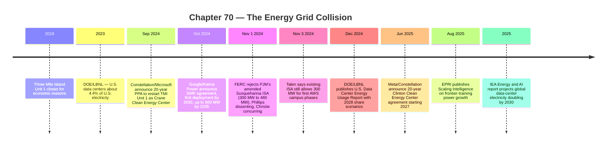

:::tip[In one paragraph]
AI data centers stopped looking like background internet infrastructure and became visible grid actors. Global demand projections stayed modest as a share of electricity, but the collision was local: concentrated AI loads arrived faster than interconnection studies, transmission upgrades, and firm generation usually move. FERC's Susquehanna order made the tariff questions concrete, while Microsoft, Google, and Meta turned firm clean power into AI infrastructure strategy.
:::

<strong>Cast of characters</strong>

| Name | Lifespan | Role |
|---|---|---|
| IEA Energy and AI analysts | — | Institutional source for global demand/supply framing in the 2025 Energy and AI report |
| EPRI / Epoch AI forecasters | — | Authors of *Scaling Intelligence* (Aug 2025), translating training scale into grid quantities |
| Joe Dominguez (Constellation) | — | Company voice on the Microsoft / Three Mile Island / Crane Clean Energy Center 20-year PPA |
| Michael Terrell (Google Energy and Climate) | — | Announcement voice for the Google / Kairos Power SMR agreement (Oct 2024) |
| Urvi Parekh (Meta Global Energy) | — | Announcement voice for the Meta / Constellation Clinton Clean Energy Center deal (Jun 2025) |
| Mark Christie & Willie Phillips (FERC) | — | Concurring and dissenting commissioners on the Nov 1, 2024 Susquehanna ISA rejection |

<strong>Timeline (2019–2025)</strong>

<strong>Plain-words glossary</strong>

**Interconnection service agreement (ISA)** — The contract that governs how a generator or load connects to a regional transmission system, including the technical and tariff terms for that connection.

**Co-located load** — A large customer sited next to a generator and electrically arranged so that some or all of its supply comes from that nearby plant rather than through an ordinary grid-delivery path.

**Power purchase agreement (PPA)** — A long-term contract under which a buyer agrees to take electricity (or its clean-energy attributes) from a specific generator. Microsoft/Constellation, Meta/Constellation, and Google/Kairos all signed PPAs; a PPA can finance a plant's operation without electrons physically flowing from that plant to the buyer's data center.

**Behind the meter** — A load located on the generator's side of the utility billing meter rather than the public grid's side.

**Firm clean power** — Low-carbon electricity available continuously, including overnight, during heat waves, and during low-wind periods. Hourly matching is a stricter claim than annual matching. Nuclear, hydro with reservoirs, geothermal, and storage-paired renewables qualify in different degrees; intermittent solar and wind alone do not.

**Small modular reactor (SMR)** — A class of advanced nuclear reactor designed to be built in factory modules and deployed at smaller unit sizes than conventional plants.

**Interconnection queue** — The ordered list of generation and large-load projects awaiting study and approval to connect to a transmission system. Data centers can be operational in two to three years; queue studies, transmission upgrades, and generator builds typically move on longer clocks. The mismatch is the chapter's structural tension.

The cloud was never weightless.

It only looked that way from the browser.

Chapter 69 ended with data becoming a managed resource: crawled, filtered, repeated, synthesized, transcribed, licensed, and protected from contamination. Ch70 turns to the next material boundary. Training and serving models did not happen inside a metaphor. They happened in buildings full of servers, storage, networking equipment, cooling systems, uninterruptible power supplies, backup generators, transformers, substations, and grid connections.

The word "cloud" hid a physical load.

That load had always existed. Search, social media, streaming, enterprise software, and mobile apps all depended on data centers. But AI changed the shape of demand. It pushed large numbers of accelerated servers into clusters that wanted enormous power at specific places and specific times. It made training runs look less like ordinary IT growth and more like industrial load planning. It made inference a product-scale electricity problem. It made utility planners, regulators, nuclear operators, gas developers, and hyperscale procurement teams part of the AI story.

The important claim is not that AI would consume all electricity. That would be lazy and wrong. The global share remained limited even under aggressive growth assumptions. The stronger claim is narrower: AI data-center loads were large, fast-moving, concentrated, reliability-sensitive, and often seeking power faster than grids, transmission, interconnection studies, and generation projects usually move.

That is the energy grid collision.

It begins by turning the cloud back into equipment. A data center is not only a room of computers. The International Energy Agency describes facilities with servers for computation, storage systems, network equipment, cooling systems, power supply systems, uninterruptible power supply equipment, backup generators, and the connection to external power. Each layer exists because electricity is not optional. A server that loses power does not merely slow down. It stops.

AI made this physicality harder to ignore because accelerators are dense loads. A rack of ordinary servers is one kind of utility customer. A hall of GPU or AI accelerator racks is another. The chips draw power. The power becomes heat. The heat must be removed. The building must carry peak load and maintain reliability. Backup systems must exist. Grid interconnection has to be studied. The data center becomes a participant in the local electric system.

The dependency is continuous. A steel mill can sometimes schedule around energy prices. A warehouse can dim lights. A data center serving real-time digital products has less tolerance for interruption. Some workloads can move, but the building's electrical infrastructure is sized for the load it may need to carry. UPS batteries cover short disturbances. Backup generators cover longer outages. Cooling systems have to continue removing heat because thermal failure can damage equipment even after compute slows down.

This is why a data center is both a customer and a reliability problem. It buys electricity, but it also changes the shape of demand on the grid. Its load may be large, steady, and concentrated. Its outages can affect customers far outside the local community. Its backup systems can affect air permits and local resilience planning. Its interconnection can require new substations or transmission upgrades. Once AI clusters arrived, the old software metaphor became actively misleading.

The physical chain is unforgiving. A model team can plan an experiment in software, but the cluster needs transformers, switchgear, power distribution units, cooling loops, and contracted electricity. A procurement team can order accelerators, but the site must be able to energize them. A company can announce a campus, but a utility must connect it. Electricity is not an abstract operating expense; it is a prerequisite delivered through local infrastructure.

This is why global averages calm the argument but do not end it.

The IEA estimated that data centers consumed about 415 terawatt-hours of electricity in 2024, around 1.5% of global electricity demand. In its 2030 base case, data-center electricity consumption rose to about 945 terawatt-hours, still under 3% of global electricity. Those are large numbers, but they do not support the claim that AI data centers dominate global electricity.

They support a different claim: a modest global share can still create severe local stress.

This is the recurring pattern in the electricity story. The denominator is global, but the fight is local. A worldwide grid statistic averages together places with surplus hydro, coal-heavy provinces, nuclear-heavy regions, congested urban grids, rural substations, renewable buildout zones, and industrial corridors. A data center does not connect to the average of all those systems. It connects to one of them. The electric system experiences AI growth as a sequence of particular interconnection requests.

The IEA emphasized regional concentration. The United States, China, and Europe were the central growth regions, with the United States and China accounting for a large share of projected growth. Data centers do not spread evenly across every grid on Earth. They concentrate in particular regions and local systems, which matters not because the world lacks electrons in aggregate, but because specific grids must serve specific loads at specific connection points. That is where global AI growth becomes local power-system work. The mismatch was no longer theoretical or safely abstract.

That local nature changes the politics. A national statistic can say data centers are under 3% of electricity. A county, utility territory, or transmission zone can still face a line of load requests that looks transformative. A substation has a capacity limit. A transmission corridor has a thermal limit. A queue study has a timeline. A generator retirement has a local effect. Electricity is delivered at nodes, not averages.

The local politics are intensified by competition among regions. A state may want the tax base, jobs, and technology prestige that come with hyperscale investment. A utility may want a large customer but worry about serving it without overbuilding at everyone else's expense. Local residents may hear promises of economic development while seeing transmission projects, substations, backup generators, and land-use changes. A global AI race becomes a zoning meeting, a rate case, and an interconnection study.

The same load can mean different things in different places. In a region with surplus generation, available transmission, cool climate, and clear permitting, a large campus may be manageable. In a constrained grid with rising electrification demand, retiring plants, or weak transmission, the same campus can become the marginal problem that forces costly upgrades. That is why aggregate electricity share is the wrong scale for the hardest questions.

The mismatch is easiest to see by comparing annual energy to power capacity. Terawatt-hours measure energy over time. Megawatts and gigawatts measure instantaneous power. A data center may consume a certain number of terawatt-hours per year, but what the grid planner must serve is also the size of the load when it turns on. Frontier AI made the power number startling.

EPRI's 2025 Scaling Intelligence report framed current frontier training runs at roughly 100 to 150 megawatts, with scenarios reaching 1 to 2 gigawatts by 2028 and more than 4 gigawatts by 2030 in some cases. The report also described U.S. AI capacity around 5 gigawatts at the time and potentially above 50 gigawatts by 2030. Those are forecasts and scenarios, not settled facts. But they show why utilities started treating AI like a planning category.

A hundred megawatts is not a laptop problem. It is a large industrial customer. A gigawatt is power-plant scale. More than 4 gigawatts for a single frontier-training facility in high scenarios is not just a bigger data center. It is a regional infrastructure question.

The uncertainty matters. EPRI's numbers should not be recited as destiny. Training techniques can change. Distributed training can spread load. Inference may become more important than training. Chips can become more efficient. Model architecture can shift. But the planning problem exists precisely because the range is wide and the lead times are long. A utility cannot wait until a model team has a final architecture before deciding whether a transmission upgrade is needed.

Power capacity also changes how people experience growth. A slow rise in annual terawatt-hours can be absorbed through many small decisions. A single request for hundreds of megawatts creates a discrete planning event. It asks whether the local system can handle the load under normal conditions, under contingencies, during maintenance, during heat waves, and when a nearby generator trips. It asks whether the load needs firm service or can be interrupted. It asks who pays if the answer requires network upgrades.

Training clusters sharpened this problem because they are dense by design. The point of a frontier training cluster is to place large numbers of accelerators close enough to communicate at high speed. That physical closeness creates an electrical closeness. The compute fabric wants concentration; the grid often prefers diversified, flexible load. AI pulled those preferences against each other.

The U.S. share numbers made the local pressure more concrete. The DOE and Lawrence Berkeley National Laboratory reported that U.S. data centers consumed about 4.4% of U.S. electricity in 2023 and could reach roughly 6.7% to 12% by 2028. EPRI cited similar pressure and prior forecasts reaching up to 9.1% by 2030. Again, the lesson is not one magic percentage. The lesson is trajectory plus concentration. In a large country, even a single-digit share can create serious regional load growth when it appears in clusters.

The share also changes who must pay attention. At 1% of a system, data centers can look like a specialized industrial category. At 5%, 10%, or more in a region, they become part of mainstream load forecasting. Utilities have to explain them to regulators. Regulators have to think about rate design. Politicians have to answer whether new generation is serving residents, industry, or hyperscale platforms. The percentage becomes governance, not just arithmetic.

This is where AI met two clocks.

The first clock was the model race. A company could decide to build a new cluster quickly. Data centers can be planned, financed, and brought online in two to three years in favorable conditions. Hardware generations moved fast. Frontier labs competed under product pressure. Cloud providers sold capacity to customers who wanted it now. The model race rewarded speed.

The second clock was the grid. Transmission lines, substations, interconnection studies, generation projects, permitting, local opposition, supply chains, and regulatory approvals often move more slowly. A new line can take many years. A generator project can be delayed by equipment queues, siting fights, fuel arrangements, or financing. Even upgrades that look simple from the outside can require studies about reliability, protection systems, market effects, cost allocation, and contingencies.

A project manager and a utility planner were using different calendars.

The project manager thinks in product windows. A model needs to train before a competitor ships. A cloud region needs capacity before customers sign elsewhere. A hardware generation arrives with a depreciation clock already running. Idle accelerators are expensive. Delayed capacity can mean lost market share. Speed is not vanity; it is business logic.

The utility planner thinks in contingencies and ratepayer exposure. A load forecast has to survive public review. A transmission upgrade must be justified. A substation transformer may have a long procurement lead time. A new generator has permitting and financing risk. A large customer's plans can change, leaving other customers with stranded costs if infrastructure was built around a speculative load. The planner's caution is not bureaucracy for its own sake. It is how a shared system avoids making everyone pay for one customer's race.

That tension changed the meaning of a data-center announcement. A site was no longer only a real-estate or cloud-capacity decision. It was a claim on the local grid. If a company wanted hundreds of megawatts quickly, someone had to ask where the power would come from, what upgrades were needed, who paid for them, whether existing customers faced costs, whether the load could be curtailed, and whether backup service was being fairly priced.

The fuel mix made the argument harder to simplify.

The IEA projected that renewables would meet nearly half of the increase in data-center electricity demand to 2030. That is an important fact. Solar, wind, batteries, and grid-scale clean-energy procurement were central to hyperscale strategies. But the same IEA supply analysis also projected gas and coal together meeting more than 40% of additional data-center demand to 2030, with nuclear becoming more important later, especially after 2030 and in advanced reactor scenarios.

That means clean-energy claims and physical electricity mix have to be kept separate. A company can sign a power purchase agreement or buy clean-energy attributes. That may finance or preserve clean generation. It may match annual consumption on paper. It may be meaningful climate action. But it does not automatically mean that electrons from a named plant physically flow to a named data center every hour. The grid is a shared system. Physical supply, contractual claims, and time-matched clean power are different things.

This distinction is not pedantry. It is the difference between public relations and grid history. A data center can buy clean-energy credits while the local grid still needs gas generation during peak load. A nuclear PPA can preserve a plant while power continues to flow into the regional grid. A solar contract can match annual consumption while evening inference demand is met by a different marginal generator. The AI energy story requires both ledgers: the contract ledger and the physical grid ledger.

The fuel mix also prevents a simple anti-AI story. Renewables can and did grow with data-center procurement. Hyperscalers helped create demand for clean energy projects. At the same time, fast load growth can keep fossil generation online longer or motivate new gas capacity where firm clean supply is not available quickly enough. The grid does not care about slogans. It balances demand and supply in real time, under local constraints, with the resources actually connected.

Nuclear enters this mix because the problem is not only clean energy. It is firm clean energy. Wind and solar are variable. Batteries help but have duration limits. Gas is dispatchable but emits. Coal emits more. Nuclear is large, steady, and low-carbon once operating, but slow and politically difficult to build or restart. AI data centers made that combination newly attractive: not because nuclear is simple, but because constant large loads value constant large supply.

The phrase "24/7 carbon-free power" belongs here. It is a procurement ambition as much as an engineering description. Annual clean-energy matching can make one claim; hourly matching makes a harder claim. A data center that runs through the night, through heat waves, and through low-wind periods needs either firm clean supply, storage, demand flexibility, or fossil backup. AI did not create that problem, but it made the load growth large enough that the distinction became impossible to ignore.

The most concrete collision came at Susquehanna.

In 2024, PJM filed an amended interconnection service agreement involving PJM, Susquehanna Nuclear, and PPL. The amendment concerned co-located load associated with a data-center campus served near the Susquehanna nuclear plant. The key number was an increase from 300 megawatts to 480 megawatts of co-located load. The case was not only about one site. It forced regulators to ask what happens when a large data-center load sits close to a generator and claims a different relationship to the transmission grid than ordinary load.

Co-location sounds physically intuitive. Put the load next to the plant. Reduce transmission stress. Give the data center a source of firm power. Let the generator sell to a large customer. But the grid is not only a wire between two buildings. A generator connected to a regional transmission system participates in markets, reliability rules, dispatch, reserves, and contingency planning. A load near that generator may still need backup from the grid when the plant is offline. It may affect flows. It may affect who pays for network services.

FERC rejected the amended ISA on November 1, 2024. The legal boundary matters. FERC did not issue a broad ban on data centers or nuclear co-location. It rejected the amended agreement because PJM had not met the high burden required for non-conforming interconnection provisions on the record before the Commission. The order said important questions remained unresolved and that PJM had not shown the provisions were necessary due to specific reliability concerns, novel legal issues, or other unique factors.

That procedural framing is important because the political slogans were tempting. One side could say regulators blocked AI infrastructure. Another could say regulators protected consumers from a sweetheart deal. The actual order was narrower and more technical: a specific amended ISA, a high burden for non-conforming terms, unresolved questions, and a rejected filing.

Commissioner Mark Christie's concurrence showed why the issue mattered. He focused on reliability, consumer costs, precedent, backup service, and whether a large behind-the-meter or co-located load could benefit from the grid while avoiding costs that other customers pay. The concern was not just whether a data center could buy power from a nearby generator. It was whether that arrangement changed who pays for transmission, ancillary services, reliability support, and backup supply when the generator is unavailable or the load still depends on the grid.

:::note
> "Establishing this precedent would undermine PJM reliability and PJM competitive markets."

Christie's concurrence cites the PJM Independent Market Monitor's warning to install the precedent stake: one AI-load contract, copied across PJM's nuclear fleet, becomes a tariff problem rather than a single procurement.
:::

That concern goes to the social contract of the power system. If a large load uses the grid only in emergencies but does not pay enough for the grid to be there, other customers may carry the insurance cost. If a co-located load reduces power available to the wider market, prices or reliability may change. If regulators approve one structure, other generators and data centers may copy it. A single AI campus can become precedent.

Chairman Willie Phillips dissented. His dissent framed the arrangement as first-of-its-kind and argued that the Commission should have accepted it or handled the issues through subsequent stakeholder processes. He emphasized reliability and the national-security and economic importance of building AI infrastructure. In his view, rejecting the agreement risked slowing the development of power arrangements needed for large AI loads.

Phillips' dissent also matters because it captured the other side of institutional risk. If regulators move too slowly, the infrastructure may not arrive when national and commercial strategy demands it. If every novel load arrangement waits for perfect market design, companies may build elsewhere, delay projects, or turn to less coordinated solutions. A shared grid needs caution, but a fast-moving technology race punishes delay.

That split captured the chapter's whole conflict. AI infrastructure wanted speed, scale, and dedicated power. The grid regime wanted reliability, cost allocation, precedent control, and procedural proof. Both concerns were real. A hyperscaler cannot build frontier infrastructure without power. A regulator cannot ignore the fact that the power system is shared.

Talen's response added another necessary caveat. Talen said the existing arrangement still allowed 300 megawatts for the first AWS campus phases while it pursued approval of the increase to 480 megawatts. It argued that direct-connect, co-location, and front-of-meter arrangements could be commercial solutions for large loads. That is Talen's position, not a neutral court finding. But it prevents a false headline: the order did not simply stop the entire project. It rejected the proposed expansion.

Susquehanna matters because it made the abstract grid collision docketed and specific. Megawatts, meters, interconnection agreements, backup service, transmission benefits, and customer costs became AI infrastructure issues. The model race had reached the utility tariff.

It also made the language of "behind the meter" politically loaded. A load behind a generator meter can sound private, as if the public grid is not involved. But if that load needs backup, affects market dispatch, or changes how much generation reaches other customers, the public system still has an interest. The FERC dispute was therefore not just about one wire path. It was about the boundary between private contracting and shared reliability.

It also showed why electricity is not merely another commodity input. A company can buy chips and put them in a warehouse if it has money and export permission. It cannot buy a private regional grid overnight. Large loads enter a regulated system with inherited rules, public obligations, and decades of infrastructure planning. The more AI sought dedicated power arrangements, the more it had to negotiate with that history.

Nuclear became the cleanest symbol of that turn.

In September 2024, Constellation announced a 20-year power purchase agreement with Microsoft intended to restart Three Mile Island Unit 1 as the Crane Clean Energy Center. The release described roughly 835 megawatts of carbon-free energy and said the restart required federal, state, and local approvals, with an expected online date in 2028. The historical resonance was obvious: a closed nuclear unit associated with one of America's most famous nuclear sites was being reimagined as part of the AI and data-center power stack.

The Three Mile Island scene was powerful because it reversed a long cultural association. For decades, the name stood for nuclear risk and public distrust. The AI era made the same site legible as firm carbon-free capacity. That does not erase the old politics. It shows how load growth can change the economic meaning of existing infrastructure. A plant that closed for economic reasons can look different when a hyperscaler wants large firm clean power for decades.

The caveats are as important as the symbolism. An announcement is not completed generation. A restart requires regulatory approval, capital work, workforce planning, grid coordination, and public trust. The deal showed hyperscalers seeking firm, carbon-free supply. It did not prove that nuclear restarts were easy.

Google's October 2024 agreement with Kairos Power showed a different version of the nuclear turn. Google described the first corporate agreement to purchase nuclear energy from multiple small modular reactors, with a first Kairos deployment intended by 2030 and additional deployments through 2035, totaling up to 500 megawatts of 24/7 carbon-free power. This was not a restarted existing plant. It was a future advanced-reactor pipeline.

The Google/Kairos deal also showed why AI procurement could become a demand signal for technologies that were not yet mature at hyperscale. Advanced reactors need customers, financeability, regulatory progress, supply chains, and repeated deployment. A hyperscaler agreement cannot solve all of that, but it can make the market more credible. For an AI company, the attraction is future firm clean capacity. For the reactor developer, the attraction is a customer with enough demand to justify a fleet concept.

That difference matters. Existing nuclear plants can provide large firm output if they stay open or restart. Advanced reactors promise modular firm clean power, but they face technology, licensing, construction, cost, fuel, and timing uncertainty. For AI companies, the appeal was obvious: a credible path to firm clean power that could be scaled with data-center growth. For the grid historian, the point is that AI demand helped turn advanced nuclear procurement into corporate infrastructure strategy.

Meta's 2025 deal with Constellation around the Clinton Clean Energy Center added a third shape. Meta and Constellation announced a 20-year agreement beginning in 2027, connected to continued operation of the Clinton plant, 1,121 megawatts of emissions-free nuclear energy, and 30 megawatts of incremental capacity. Constellation's release also made the physical-grid caveat explicit: the plant would continue flowing power to the local grid while Meta purchased clean-energy attributes.

The Clinton structure is historically quieter than a restart or a new reactor order, but it may be more representative of how data-center demand affects existing grids. Keeping an existing plant economic can matter as much as building a new one. If a firm low-carbon plant retires, the replacement mix may include fossil generation or create new reliability pressure. A long corporate agreement can therefore act as preservation finance.

That line is historically useful. It says the quiet part clearly. A hyperscaler can support the economics of a plant and claim clean-energy attributes without the plant becoming a private wire to a single data center. The grid remains shared. The contract changes finances and claims; the physics still flows through the grid.

Taken together, Microsoft/Three Mile Island, Google/Kairos, and Meta/Clinton show that energy procurement had become AI infrastructure strategy. Hyperscalers were not only buying renewable certificates after the fact. They were trying to shape the generation stack: preserve existing firm clean power, restart retired capacity, and pull future nuclear technologies toward deployment.

The sequence also shows different time horizons. A 2027 preservation deal, a 2028 restart target, and a 2030-to-2035 advanced-reactor deployment path are not interchangeable. They map onto different utility-planning calendars. AI companies wanted capacity fast, but the clean firm resources they wanted often arrived slowly. That gap kept gas, renewables, batteries, transmission, and curtailment strategies in the story.

That does not make the chapter a nuclear booster story. Nuclear carried its own constraints: permitting, construction risk, cost, public trust, waste, fuel supply, safety review, and long lead times. It appeared in the AI story because data centers wanted reliable 24/7 power with low carbon claims. The need was firm power. Nuclear was one answer, not the answer.

It also does not make every nuclear announcement equivalent. Preserving Clinton, restarting Crane, and ordering future Kairos units involved different risks. The first protects an operating asset. The second tries to bring back an asset that stopped operating. The third depends on a future reactor class. All three can be rational responses to AI load growth, but they should not be counted as the same kind of near-term supply.

Gas and renewables remained part of the physical story. Renewables could grow quickly and cheaply in many regions, especially when paired with storage and transmission. Gas could provide dispatchable capacity and near-term reliability but increased emissions and fuel dependence. Coal still appeared in some near-term supply projections. Batteries helped shift energy but did not create multi-day firm supply. The grid mix was a portfolio under stress, not a morality play with one technology winning immediately.

Flexibility offered a partial escape.

EPRI noted that inference may be more geographically and temporally flexible than training. Some inference workloads can be routed to regions with available capacity, lower congestion, or cleaner energy, especially when latency requirements permit. Batch jobs can be scheduled. Non-urgent work can move. A model-serving system can sometimes behave like flexible demand rather than a fixed industrial process.

Inference flexibility became more important as AI moved from training race to product infrastructure. A single training run may be dramatic, but millions or billions of user interactions make inference persistent. If some of that work can be shifted away from peak hours or routed to lower-carbon regions, AI load becomes less rigid. If every user-facing request has strict latency requirements, the flexibility shrinks. The operational details decide the grid value.

Training is harder. A large training run wants a tightly connected cluster, synchronized accelerators, high-bandwidth networking, stable power, and predictable schedules. It is less easy to pause, move, or split without performance and engineering costs. Distributed training can help, but it is not magic. The more tightly coupled the computation, the more location-specific the power problem becomes.

This distinction matters because "data centers should be flexible" can become another slogan. Flexibility has technical and business limits. A search response, coding assistant completion, video generation job, batch embedding run, safety evaluation, and frontier pretraining run have different latency, reliability, and locality needs. Some can move. Some cannot. Some can delay. Some are customer-facing in real time.

The software layer can help only when the product layer permits it. A background embedding job may wait for cheap power. A live coding assistant cannot wait long before the user notices. A batch evaluation can move regions. A tightly scheduled product launch may demand capacity in a particular cloud region. The flexibility question is therefore not just technical. It is a question about user expectations, contracts, latency, and revenue.

The grid collision therefore did not produce a single solution. It produced a menu of mitigations: better site selection, demand response, geographic routing, energy storage, renewable procurement, firm clean power contracts, gas backup, transmission upgrades, nuclear preservation, advanced reactor bets, improved chip efficiency, and more careful interconnection rules. Each mitigation solved one part and exposed another.

That is why the energy story resists clean villainy. The load was real. The climate pressure was real. The reliability duty was real. The economic opportunity was real. The customer-cost risk was real. Every actor could point to a legitimate constraint. The hyperscaler needed power to build AI capacity. The utility needed credible forecasts. The regulator needed defensible cost allocation. The generator needed a customer. The public needed a grid that stayed affordable and reliable. AI turned all of those claims into the same planning conversation. That convergence was new enough to feel unstable because the institutions had not yet learned how quickly frontier compute demand could move. The collision was practical before it became openly ideological.

That menu is why the energy chapter belongs in an AI history rather than a separate utility appendix. The model stack had expanded. Capability was no longer only data, algorithm, and chips. It included the ability to secure a site, get connected, buy or build power, navigate regulation, and make public claims about clean energy without losing access to firm supply. Energy procurement became part of competitive advantage.

The deeper historical shift was that AI capability had become entangled with utility planning. A frontier lab's roadmap depended not only on model architecture, data availability, and chip supply, but on whether enough electricity could be delivered to the right place on the right schedule. A hyperscaler negotiating power contracts was doing AI strategy. A FERC docket was part of the model stack. A nuclear plant's economics could become relevant to inference capacity.

That is why Ch70 sits between data exhaustion and chip geopolitics. Ch69 showed that useful human signal was not infinitely elastic. Ch70 shows that compute is not only a number of accelerators; it is a load on a grid. Ch71 will turn to the geopolitical control of the chips themselves. Ch72 will return to the full body of the datacenter: land, water, cooling, campuses, and the industrial footprint of scale.

:::note[Why this still matters today]
Every cloud region a developer chooses sits inside a regulated power system with finite interconnection capacity. The grid timing mismatch the chapter describes — data centers in two to three years, transmission and generation on much longer clocks — is the lived reality of any platform team siting AI capacity today. The split between contractual clean-energy claims and the physical grid mix matters whenever a sustainability report is read alongside an interconnection queue. The Susquehanna order changed how co-located load arrangements are filed and contested at FERC. And nuclear procurement deals announced for 2027–2035 mean that the model stack now includes power plants on multi-year delivery clocks.
:::

The cloud had become infrastructure in the old sense.

Steel, wires, fuel, permits, regulators, and clocks.
