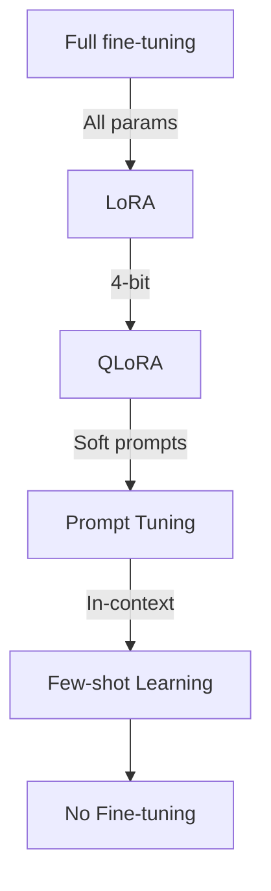
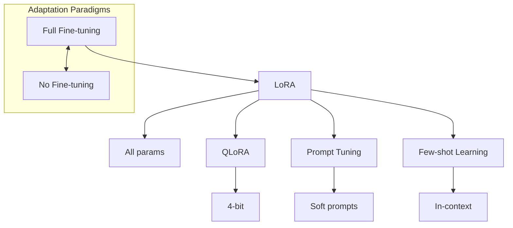
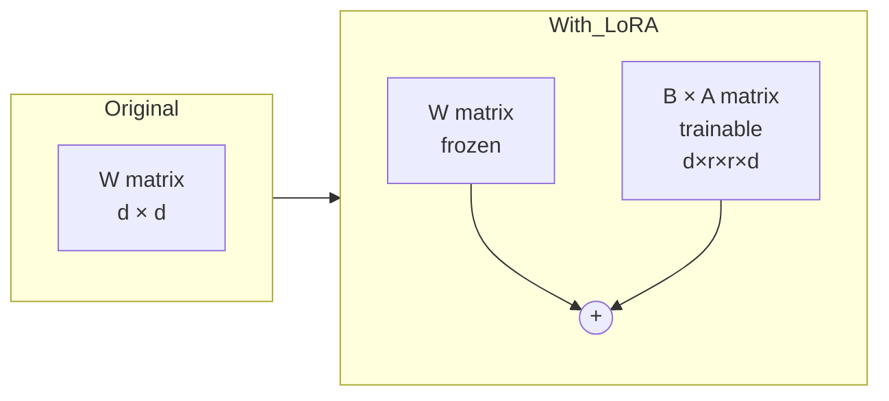
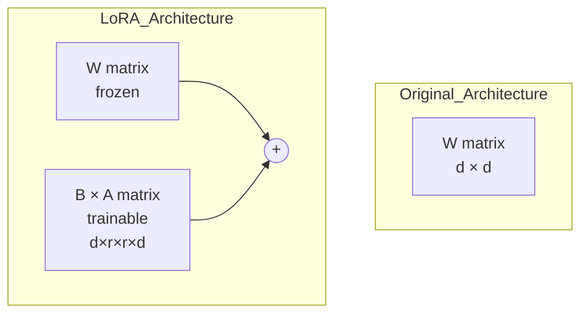

# Fine-tuning LLMs

## Why This Module Matters

In 2014, Amazon initiated a secretive engineering project to build an artificial intelligence recruiting tool. The primary objective was to review job applicants' resumes and rate them mechanically from one to five stars, aiming to automate the initial screening process. To achieve this, engineers fine-tuned their natural language processing models on a massive dataset of resumes submitted to the company over the previous ten years. By 2015, the company realized their system was fundamentally flawed. Because the historical data reflected a male-dominated technology industry, the fine-tuned model explicitly taught itself that male candidates were mathematically preferable. It actively penalized resumes that included the word "women's" (such as "women's chess club captain") and structurally downgraded graduates of two specific all-women's colleges.

Despite frantic efforts to artificially edit the software to make it neutral to these particular terms, the engineering teams could not guarantee the model would not find other subtle proxy metrics for gender. The project was ultimately scrapped in 2018. It resulted in an estimated write-off of over ten million dollars in specialized compute time, countless engineering hours, and severe public relations damage. This incident powerfully illustrates a core, immutable truth about model fine-tuning: it permanently and irrevocably alters the fundamental behavior and decision-making pathways of a neural network. When you update the weights via backpropagation, you are structurally changing the model's identity.

Unlike Retrieval-Augmented Generation (RAG), which provides external, mutable facts for a model to reference temporarily at runtime, fine-tuning ingrains patterns directly into the neural network's fixed weights. When you fine-tune a large language model, you are not merely teaching it a new vocabulary set; you are encoding institutional biases, stylistic preferences, and specific, unyielding logical pathways. Understanding how to execute this process correctly, how to navigate the complex constraints of proprietary platforms, and how to rigorously evaluate the resulting behavioral changes is one of the most critical skills for an AI/ML engineer managing production systems. It requires a profound respect for dataset curation, an advanced mathematical understanding of low-rank adaptations, and the operational maturity to orchestrate these heavy workloads efficiently on modern Kubernetes v1.35 clusters.

## Learning Outcomes

By the end of this module, you will be able to:

- **Diagnose** model performance and contextual limits to determine whether parameter-efficient fine-tuning, retrieval-augmented generation, or advanced prompt engineering is the optimal strategy for a given enterprise requirement.
- **Design** a parameter-efficient fine-tuning architecture utilizing the Hugging Face PEFT library and QLoRA quantization to minimize memory overhead while perfectly preserving base model capabilities.
- **Implement** a supervised fine-tuning pipeline for causal language models utilizing programmatic data curation, chat templates, and deterministic artifact generation.
- **Evaluate** the quality of customized neural networks using quantitative validation metrics such as perplexity calculations alongside task-specific qualitative evaluation frameworks.
- **Compare** varied hyperparameter configurations including low-rank dimensions and alpha scaling factors to optimize adapter performance for proprietary datasets and varied computational budgets.
- **Deploy** state-of-the-art training jobs on Kubernetes v1.35 environments using modern GPU scheduling paradigms and fault-tolerant containerized machine learning workloads.

## The Big Picture: Why Fine-tune?

Imagine you have just hired a brilliant new software engineer. They graduated at the top of their class, speak eloquently, and have read millions of technical books. However, they know absolutely nothing about your specific company. They do not know your internal products, your proprietary jargon, or how you prefer your documentation formatted. They entirely lack the institutional context that makes an employee truly productive in a corporate environment.

You generally have three architectural options to solve this systemic knowledge gap. The first option is to provide a massive reference manual for them to consult on every single query, which mirrors Retrieval-Augmented Generation (RAG). They look things up as needed from an external database. This is phenomenal for ever-changing facts, but reading the manual for every single task drastically slows down their execution speed and raises context token costs exponentially across millions of requests.

The second option is to continuously coach them with verbose examples immediately before every task, which represents few-shot prompt engineering. You show them exactly what you want each time you issue a task. This consumes valuable context window space and significantly increases per-token inference costs across thousands of repeated invocations, while limiting the depth of complex structural formatting you can reliably enforce.

The third and most permanent option is to train them extensively on the job, which is fine-tuning. They internalize your company's way of thinking. The knowledge, formatting, and stylistic preferences become inherent to their daily operation, requiring no extra instructions. Fine-tuning represents this third option. It mathematically modifies the model's weights so the knowledge and behavioral syntax become an inseparable part of the model itself.

| Use Case | Best Approach |
|----------|---------------|
| Custom knowledge (docs, FAQs) | RAG |
| New tasks with few examples | Few-shot prompting |
| Consistent style/format | Fine-tuning |
| Domain-specific language | Fine-tuning |
| New behaviors/capabilities | Fine-tuning |
| Cost optimization (repeated tasks) | Fine-tuning |
| Speed optimization | Fine-tuning |

> **Did You Know?** On March 14, 2023, Stanford released the Alpaca model, which was fine-tuned on 52,000 instruction-following demonstrations generated by OpenAI's text-davinci-003. The entire fine-tuning process cost under $600 and proved that small open-source models could match proprietary models when given high-quality instruction data.

When you should not fine-tune is equally important. If your goal is simply to teach the model a new, highly volatile fact, fine-tuning is a disastrously inefficient choice. The static weights of a neural network constitute a terrible database for mutable facts. RAG is the architecture of choice for volatile knowledge. Fine-tuning is the architecture of choice for behavioral adaptation, formatting consistency, and structural reasoning pathways.

## The Fine-tuning Spectrum

Not all fine-tuning is created equal. There is a vast, mathematically complex spectrum ranging from full parameter fine-tuning, where every single isolated weight inside a massive neural network is directly updated via backpropagation, to minimal contextual adaptation where only the input prompt sequences are creatively modified.



Full fine-tuning of a modern 70-billion parameter network intrinsically requires massive hardware clusters composed of interconnected A100 GPUs. It necessitates highly complex distributed training orchestrations, utilizing libraries like DeepSpeed or Fully Sharded Data Parallel (FSDP) to partition the optimizer states across multiple nodes. It is incredibly brittle, excessively expensive, and highly prone to an issue known as catastrophic forgetting, where the model rapidly overwrites its foundational generalized knowledge to master the new narrow dataset. This is exactly where Parameter-Efficient Fine-Tuning steps into the architecture.



## LoRA: The Game-Changer

Before the breakthrough of parameter-efficient training architectures, fine-tuning a frontier neural network was an exercise in extreme financial expenditure. In early 2021, software engineers faced an insurmountable hardware barrier when attempting to customize models. Because full fine-tuning fundamentally requires updating every single parameter across the entire network architecture, the optimizer state alone demanded terabytes of Video RAM. A single training run required dedicated server clusters containing hundreds of premium GPUs, making independent research and localized domain adaptation virtually impossible for standard enterprise teams.

> **Did You Know?** In June 2021, Edward Hu and his team at Microsoft Research published the LoRA paper, demonstrating that an immense 175-billion parameter model could be adapted using only 1.2 million trainable parameters, representing a ten-thousand-fold reduction in checkpoint size.

Instead of computing and applying a massive update matrix directly to the original weights:

```text
W_new = W + ΔW
```

LoRA mathematically decomposes the massive theoretical update matrix into two significantly smaller matrices. This relies entirely on the proven mathematical hypothesis that the intrinsic dimensionality of the fine-tuning adaptation is actually very small. We do not need an enormous parameter matrix to securely represent the newly acquired behavior; we simply need a low-rank approximation to guide the specific output tokens.

```text
W_new = W + B × A

Where:
- W is frozen (original weights): d × d
- A is trainable: r × d  (r << d)
- B is trainable: d × r
- ΔW = B × A: d × d (reconstructed)
```

Visually, this elegant hardware-aware architecture forces the training gradients into a narrow mathematical bottleneck controlled by the rank `r`. This radically reduces the optimizer state size required in Video RAM during the backward pass:



Or mapped logically within the exact computational graph structure:



> **Pause and predict**: Given the mathematical formulation of LoRA where `ΔW = B × A`, if the rank `r` is set to equal the original hidden dimension `d`, what happens to the number of trainable parameters? Will it be more, less, or the same as full fine-tuning?

## QLoRA: Fine-tuning for Everyone

QLoRA (Quantized LoRA) effectively combines the established standard of LoRA with extreme numeric quantization compression algorithms to make complex fine-tuning entirely accessible on standard consumer-grade hardware. By forcefully loading the massive, computationally frozen base model entirely in 4-bit precision, QLoRA decimates the baseline VRAM requirement while remarkably preserving total model accuracy through highly specialized memory paging mechanisms.

```text
FP32: 3.14159265... (full precision)
FP16: 3.1416      (half precision)
INT8: 3           (8-bit integer + scale)
INT4: ~3          (4-bit, extreme compression)
```

By compressing the baseline weights, previously unimaginable tasks become financially and logistically feasible. Consider the hardware requirements mapped to expected cloud expenditures.

| GPU | VRAM | Cost/hour | Can Train |
|-----|------|-----------|-----------|
| T4 | 16GB | $0.50 | 7B with QLoRA |
| A10G | 24GB | $1 | 7B with QLoRA |
| A100 40GB | 40GB | $4 | 13B with QLoRA |
| A100 80GB | 80GB | $8 | 70B with QLoRA |

Different hardware topologies provide drastically different time-to-completion metrics.

| Setup | Time | Cost |
|-------|------|------|
| 1x A10G | ~4 hours | $4 |
| 1x A100 | ~90 minutes | $6 |
| 4x A100 | ~25 min | $13 |

### Hugging Face Integration

When orchestrating these pipelines within the Python Hugging Face ecosystem, the PEFT (Parameter-Efficient Fine-Tuning) library handles these complex low-rank math adaptations completely seamlessly. Transformers PEFT integration supports non-prompt-learning methods LoRA, IA3, and AdaLoRA, and requires `peft >= 0.18.0`. It is fundamentally vital to securely maintain this minimum version constraint within your dependency files to actively prevent unexpected matrix broadcasting errors during distributed training runs.

Furthermore, Hugging Face PEFT training updates adapter weights only because the base model is frozen, and trainer checkpoints contain adapter-only artifacts (e.g., `adapter_model.safetensors` and `adapter_config.json`). This precise isolation guarantees that your CI/CD pipeline outputs are just tens of megabytes in size rather than unwieldy gigabytes, heavily optimizing storage transmission overhead.

```python
# QLoRA configuration
from peft import LoraConfig
from transformers import BitsAndBytesConfig

# 4-bit quantization config
bnb_config = BitsAndBytesConfig(
    load_in_4bit=True,
    bnb_4bit_quant_type="nf4",           # NormalFloat4
    bnb_4bit_compute_dtype=torch.bfloat16,
    bnb_4bit_use_double_quant=True,       # Double quantization
)

# LoRA config
lora_config = LoraConfig(
    r=16,                    # Rank
    lora_alpha=32,           # Scaling factor
    lora_dropout=0.1,
    target_modules=["q_proj", "v_proj", "k_proj", "o_proj"],
    bias="none",
    task_type="CAUSAL_LM",
)
```

Adjusting these configuration variables directly controls the expressive capacity of your new adapters.

| Config | Rank (r) | Alpha | Target Modules | Expected Effect |
|--------|----------|-------|----------------|-----------------|
| A | 4 | 8 | q_proj, v_proj | Fast, limited capacity |
| B | 16 | 32 | q_proj, k_proj, v_proj, o_proj | Balanced |
| C | 64 | 128 | All linear layers | Slow, high capacity |

## Proprietary Fine-Tuning: The OpenAI Ecosystem

While open-source architectures offer absolute control, managing custom infrastructure is complex. It is crucial to thoroughly understand managed fine-tuning environments before deploying localized Kubernetes v1.35 training manifests. OpenAI currently documents four supported fine-tuning methods: supervised, vision, direct preference optimization (DPO), and reinforcement fine-tuning (RFT). Each of these distinct methods serves a highly specialized structural purpose within the modern AI lifecycle.

Supervised fine-tuning is documented as suitable for standard conversational adaptations. This method relies on explicit input-output pairs to rigorously alter the stylistic output and formatting constraints of the model. Similarly, Direct Preference Optimization allows engineers to utilize contrastive pairs, definitively showing the model which outputs are preferred and which are rejected, thereby aligning the model without requiring a separate reward model architecture.

Reinforcement Fine-Tuning represents an advanced frontier, utilizing specialized logical validation chains rather than simple stylistic formatting to force the network to construct mathematically sound deductions. For multimodal workflows requiring optical analysis, Vision fine-tuning allows the injection of domain-specific image datasets into the processing pipeline for complex diagram interpretation.

### API Constraints and Data Formatting

To automate these pipelines, fine-tuning jobs are created programmatically and require both a model identifier and a training file identifier. To ensure your expensive experiments can be evaluated objectively against historical baselines, utilizing a deterministic seed parameter is intended to improve reproducibility: using the same seed and identical job parameters is expected to yield the same results in most cases.

When preparing your ingestion pipelines, remember that fine-tuning input data must be uploaded as JSONL. Supervised training data must be JSONL with complete JSON per line, use chat completions format, and have at least 10 lines. However, while 10 is the absolute technical floor, it is recommended to start with 50 well-crafted examples to see meaningful behavioral shifts across the network. Furthermore, checkpoints from supervised fine-tuning are often available temporarily, meaning you must rapidly download and rigorously validate your evaluation artifacts.

For multimodal integration workflows, Vision fine-tuning input constraints include: up to 50,000 image examples, up to 10 images per example, and max 10 MB per image. Ensure your preprocessing layer respects these limitations. Vision fine-tuning permits JPEG/PNG/WEBP images in RGB or RGBA mode, and image messages from assistant-role outputs are disallowed. Additionally, datasets containing people, faces, children, or CAPTCHAs may be rejected.

> **Did You Know?** In August 2024, the release of GPT-4o-2024-08-06 introduced Vision fine-tuning, allowing developers to upload up to 50,000 image examples (max 10MB per image) to natively train models on domain-specific visual tasks like medical imaging anomalies or autonomous driving analysis.

**Critical Storage Warning**: Official vendor documentation currently contains conflicting information regarding file storage limits. One part of the reference states there is an organization-wide limit of 1 TB, while another variant explicitly claims there is a 2.5 TB limit per project with absolutely no organization-wide cap. You should explicitly hedge your capacity planning and monitor usage closely until this discrepancy is definitively resolved by upstream engineering support.

## Practical Fine-tuning: Step by Step

### Step 1: Choose Your Base Model

Selecting the exact correct baseline foundation model is the absolute most critical decision of your entire pipeline. A massive parameter model is not inherently superior if your final deployment target environment is highly constrained, or if token inference speed is a non-negotiable requirement for your specific service level agreements. Always match the model size to the strict mathematical complexity of your designated task.

| Model | Size | Good For |
|-------|------|----------|
| **Llama 4.1 8B** | 8B | General tasks, instruction following |
| **Mistral 7B** | 7B | Fast inference, general tasks |
| **Phi-3** | 3.8B | Limited resources, mobile |
| **Qwen 2** | 7B | Multilingual, coding |
| **Gemma 2** | 9B | Google ecosystem |

### Step 2: Prepare Your Dataset

Raw data quality is exponentially more critical than bulk data quantity in modern LLM fine-tuning loops. A rigorously specialized dataset of 1,000 highly curated, grammatically flawless examples will massively and consistently outperform 50,000 haphazardly scraped, noisy internet examples. Quality dictates the ultimate artificial intelligence output.

Most supervised fine-tuning initially utilizes a strict standard instruction JSON format:

```json
{
  "instruction": "Summarize the following article",
  "input": "The article text here...",
  "output": "The summary here..."
}
```

Alternatively, and often preferably for modern conversational interfaces, you can utilize the explicit conversation message format, which maps perfectly to the standard chat completions APIs downstream:

```json
{
  "messages": [
    {"role": "system", "content": "You are a helpful assistant."},
    {"role": "user", "content": "What is machine learning?"},
    {"role": "assistant", "content": "Machine learning is..."}
  ]
}
```

Understanding how many examples you need requires identifying your specific goal.

| Task Type | Minimum Samples | Recommended |
|-----------|-----------------|-------------|
| Style transfer | 100-500 | 1,000+ |
| Domain adaptation | 1,000 | 5,000+ |
| New task learning | 5,000 | 10,000+ |
| Behavior modification | 500-2,000 | 5,000+ |

### Dataset Preparation Pipelines

Production-grade machine learning datasets are rarely pristine upon initial acquisition. You must proactively construct highly deterministic programmatic preprocessing pipelines to aggressively sanitize textual inputs, systematically normalize irregular structural whitespace, and strictly enforce the base model's specific token chat templates. An improperly implemented chat template syntax will completely and irreparably ruin a massive fine-tuning run.

```python
import json
from typing import List, Dict

def clean_dataset(examples: List[Dict]) -> List[Dict]:
    """Clean and validate training examples."""
    cleaned = []

    for ex in examples:
        # Skip empty examples
        if not ex.get("instruction") or not ex.get("output"):
            continue

        # Skip very short outputs (likely low quality)
        if len(ex["output"]) < 50:
            continue

        # Skip duplicates (check instruction similarity)
        if is_duplicate(ex, cleaned):
            continue

        # Normalize whitespace
        ex["instruction"] = " ".join(ex["instruction"].split())
        ex["output"] = " ".join(ex["output"].split())

        cleaned.append(ex)

    return cleaned


def format_for_training(example: Dict) -> str:
    """Format example as chat template."""
    return f"""<|im_start|>system
You are a helpful assistant.<|im_end|>
<|im_start|>user
{example['instruction']}<|im_end|>
<|im_start|>assistant
{example['output']}<|im_end|>"""
```

> **Stop and think**: If you use DPO (Direct Preference Optimization) to align a model, you must provide a chosen response and a rejected response for each prompt. Why might an organization struggle to curate a dataset of 10,000 "rejected" responses compared to just gathering 10,000 "good" responses for standard supervised fine-tuning?

### Step 3: Configure Training

The `TrainingArguments` object programmatically dictates the entire optimization logic and intricate memory offloading strategy. Notice meticulously below that we purposefully configure `paged_adamw_8bit`—a uniquely quantized, memory-aware optimizer that aggressively pages hidden memory states directly to the host CPU if the GPU VRAM runs critically low. This feature effectively saves the entire active process from catastrophic Out Of Memory failures during peak attention processing.

```python
from transformers import TrainingArguments

training_args = TrainingArguments(
    output_dir="./results",

    # Core training settings
    num_train_epochs=3,               # 3-5 epochs typically
    per_device_train_batch_size=4,    # Depends on GPU memory
    gradient_accumulation_steps=4,    # Effective batch = 4 * 4 = 16

    # Learning rate
    learning_rate=2e-4,               # LoRA can use higher LR
    lr_scheduler_type="cosine",       # Gradual decay
    warmup_ratio=0.03,                # Warm up for 3% of steps

    # Optimization
    optim="paged_adamw_8bit",         # Memory-efficient optimizer
    max_grad_norm=0.3,                # Gradient clipping

    # Logging
    logging_steps=10,
    save_strategy="epoch",
    evaluation_strategy="epoch",

    # Memory optimization
    fp16=True,                        # Mixed precision
    gradient_checkpointing=True,       # Trade compute for memory
)
```

> **Version note**: The examples in this module use the canonical `TrainingArguments.evaluation_strategy` field name. If you pin older or heavily patched training stacks, verify the exact argument names across `transformers`, `trl`, and `peft` before copying snippets into production code.

### The Psychology of Learning Rate Selection

The learning rate is widely considered the most challenging hyperparameter in the entire machine learning stack. If an engineer sets the learning rate too low, such as `1e-6`, the model simply will not learn. It will slowly crawl across the loss landscape, burning thousands of dollars of GPU time while practically remaining identical to its baseline state. Conversely, if an engineer sets the learning rate aggressively high, such as `5e-3`, the optimizer gradients will violently explode, returning infinite `NaN` values and instantly destroying the fine-tuning run.

When utilizing full fine-tuning, learning rates must be kept infinitesimally small because the original model weights are highly fragile; you are actively altering the fundamental fabric of a network trained on trillions of tokens. However, the psychology shifts dramatically when deploying parameter-efficient methods. Because LoRA adapter matrices are purposefully initialized either with zeros or highly specific gaussian noise, they require significantly more aggressive momentum to learn their designated tasks. Engineers routinely deploy learning rates of `2e-4` for LoRA adapters—a magnitude that would instantly shatter a full fine-tuning architecture.

To securely manage this momentum, professional practitioners utilize cosine decay scheduling coupled with an introductory warmup ratio. A warmup ratio of 0.03 strictly forces the learning rate to incrementally ramp up from zero during the initial 3 percent of the training steps. This structural grace period prevents the freshly initialized LoRA matrices from dispatching massive, destabilizing gradient shocks through the computational graph. Once the warmup completes, the cosine decay scheduler smoothly and continuously decelerates the learning rate, allowing the optimizer to securely settle into the optimal local minima without bouncing violently around the loss landscape.

### Step 4: Fine-tune

We must systematically and programmatically instantiate our designated target model, rigorously apply the specific quantization hardware configuration, carefully prepare the frozen weights for K-bit distributed training, and surgically inject the low-rank LoRA adapters into the computational graph. The profoundly powerful `SFTTrainer` (Supervised Fine-Tuning Trainer) from the highly specialized `trl` library elegantly abstracts away the overwhelmingly complex internal matrix formatting loops.

```python
from transformers import AutoModelForCausalLM, AutoTokenizer
from peft import get_peft_model, prepare_model_for_kbit_training
from trl import SFTTrainer

# Load tokenizer
tokenizer = AutoTokenizer.from_pretrained("meta-llama/Llama-3.1-8B")
tokenizer.pad_token = tokenizer.eos_token

# Load model with quantization
model = AutoModelForCausalLM.from_pretrained(
    "meta-llama/Llama-3.1-8B",
    quantization_config=bnb_config,
    device_map="auto",
)

# Prepare for k-bit training
model = prepare_model_for_kbit_training(model)

# Apply LoRA
model = get_peft_model(model, lora_config)

# Print trainable parameters
def print_trainable_parameters(model):
    trainable = sum(p.numel() for p in model.parameters() if p.requires_grad)
    total = sum(p.numel() for p in model.parameters())
    print(f"Trainable: {trainable:,} ({100 * trainable / total:.2f}%)")

print_trainable_parameters(model)
# Trainable: 6,553,600 (0.08%) <- Only 0.08% of parameters!

# Train
trainer = SFTTrainer(
    model=model,
    train_dataset=train_dataset,
    eval_dataset=eval_dataset,
    tokenizer=tokenizer,
    args=training_args,
    max_seq_length=512,
)

trainer.train()
```

### Step 5: Save and Merge

After the extensive training loops sequentially complete with success, you logically have two distinct operational deployment options. You can explicitly save just the tiny, lightweight adapter weights to local disk. This powerfully allows you to dynamically hot-swap them at runtime inference for massive multi-tenant architectures, efficiently serving hundreds of customers from a single GPU memory allocation. Alternatively, you can irreversibly merge those adapter weights permanently into the base model weights to completely avoid the minor computational latency overhead of dynamically computing the matrix addition during every single token generation.

```python
# Save just the LoRA adapters (small, ~50MB)
model.save_pretrained("./lora-adapters")
```

```python
# Merge LoRA weights into base model
merged_model = model.merge_and_unload()
merged_model.save_pretrained("./merged-model")
```

## Evaluation and Production Realities

Evaluation inherently forms the most scientifically rigorous, unforgiving, and operationally demanding phase of the foundational model lifecycle. You must precisely measure the model's internal statistical confidence quantitatively, while simultaneously measuring its actual behavioral, real-world outputs qualitatively against strict, adversarial human rubrics.

### Quantitative Metrics

Perplexity quantitatively and rigidly measures exactly how "surprised" a specific model framework is by the holdout evaluation validation dataset. Lower perplexity technically indicates that the model is highly confident in its subsequent token predictions and that its internal mathematical weights have successfully aligned with the target distribution syntax. However, it does not guarantee factual correctness.

```python
import math

def compute_perplexity(model, eval_dataset, tokenizer):
    model.eval()
    total_loss = 0
    total_tokens = 0

    for batch in eval_dataset:
        with torch.no_grad():
            outputs = model(**batch)
            total_loss += outputs.loss.item() * batch["input_ids"].numel()
            total_tokens += batch["input_ids"].numel()

    perplexity = math.exp(total_loss / total_tokens)
    return perplexity
```

### Qualitative Evaluation

Raw mathematical quantitative metrics can be deeply deceiving in enterprise practice. A neural network with stunningly low validation perplexity might merely be blindly regurgitating the training data verbatim while failing completely at advanced generalized intelligence tasks. Qualitative evaluation relentlessly enforces a grounded reality check on the underlying conversational tone, formatting adherence, and actual operational utility of the model against adversarial human-in-the-loop prompts.

```python
test_prompts = [
    "Explain quantum computing to a 5-year-old",
    "Write a formal email declining a meeting",
    "Debug this Python code: [code here]",
    # Add domain-specific prompts
]

for prompt in test_prompts:
    response = generate(model, prompt)
    print(f"Prompt: {prompt}")
    print(f"Response: {response}")
    print("-" * 50)
```

### Production War Stories

Theoretical knowledge frequently collides violently with messy production realities. Engineering teams across the industry have documented catastrophic failures when improperly deploying specialized fine-tuning workflows into high-stakes environments.

**Medical Hallucination at Scale**
A highly funded healthcare artificial intelligence startup attempted to heavily fine-tune a massive clinical classification model. To quickly expand their dataset volume, the engineers carelessly combined rigorously peer-reviewed pharmaceutical dosage papers with entirely unregulated, anecdotal health forum web scrapes. Because the core neural network inherently lacked the ability to differentiate the structural authority and scientific provenance of its diverse sources, the resulting fine-tuned system adopted a horrific, confident hybrid tone. During isolated clinical trials, the model confidently hallucinated a highly dangerous, unsubstantiated pediatric dosage recommendation derived entirely from a random internet post. The engineering team was forced to immediately execute a total production rollback, terminating the initiative and rewriting their entire ingestion pipeline.

**Bloomberg's Custom GPT Architecture**
In contrast to catastrophic dataset failures, the engineering division at Bloomberg executed a masterful display of specialized domain adaptation. Recognizing that open-source models fundamentally struggled to parse the extremely dense, numerical syntax of professional financial tickers and proprietary market indicators, they committed to an immense undertaking. They initially trained a massive financial language model architecture practically from scratch, and then aggressively fine-tuned it explicitly on decades of their internal proprietary terminal data. This staggering operational achievement unequivocally proved that highly specialized domain fine-tuning serves as an impenetrable competitive moat, yielding a model capable of parsing complex financial sentiment with an accuracy that generic frontier models simply could not mathematically replicate.

## Common Mistakes

Engineering teams consistently and repeatedly encounter severe, project-ending regressions when aggressively attempting their first massive model fine-tuning runs. Study this specific troubleshooting diagnostic table deeply to actively avoid burning thousands of corporate dollars in utterly wasted computational overhead.

| Mistake | Why | Fix |
|---------|-----|-----|
| Catastrophic Forgetting | The model over-specialized on the new task and completely lost its general knowledge representation. | Use LoRA instead of full fine-tuning; mix in 10-20% general instruction data to retain broader capabilities. |
| Overfitting | The training data is too uniform or the training loops ran for too many epochs without early stopping. | Add dropout (0.15), implement strict early stopping, and significantly increase dataset diversity. |
| OOM (Out of Memory) | The batch size is too large for the GPU VRAM, preventing backpropagation from storing activations. | Enable gradient checkpointing and drastically reduce `per_device_train_batch_size`. |
| Wrong Chat Template | Model inputs do not match the tokenizer's expected prompt structure, causing hallucinated outputs. | Verify `tokenizer.chat_template` and strictly use `apply_chat_template` during data preparation. |
| Conflicting PEFT versions | Using an outdated PEFT library lacking modern adapter support or updated scaling logic. | Ensure `peft >= 0.18.0` for full AdaLoRA, IA3, and stable LoRA support. |
| Exceeding OpenAI Limits | Vision training data exceeds the strict API payload boundaries, leading to instant 400 rejection errors. | Compress all training images to <10MB and limit inputs to a maximum of 10 images per example. |
| Missing Checkpoints | The base model was accidentally unfrozen, creating massive multi-gigabyte checkpoints instead of adapters. | Verify PEFT configuration; expect your artifact to only be an `adapter_model.safetensors` file. |

**Example of Fixing the Critical Chat Template:**

```python
# Check the model's expected format
print(tokenizer.chat_template)

# Apply it correctly
formatted = tokenizer.apply_chat_template(
    messages,
    tokenize=False,
    add_generation_prompt=True
)
```

## Cost Analysis and Kubernetes Orchestration

Deeply understanding the financial implications and underlying operational mechanics of your distributed training jobs is arguably just as critical as understanding the foundational calculus. Without a crystal-clear operational view of hourly infrastructure costs, an engineering team can inadvertently bankrupt a project within a single chaotic week of experimentation.

| Approach | Setup Cost | Per-Query Cost | Monthly Cost |
|----------|------------|----------------|--------------|
| **Fine-tuned local** | $5-50 | ~$0 | ~$20 (hosting) |
| **RAG with API** | $0 | $0.01-0.05 | $100-500 |
| **API few-shot** | $0 | $0.02-0.10 | $200-1000 |

### Deploying Training Jobs on Kubernetes

When systematically executing these incredibly intense algorithmic workloads in stable production environments, you must rely exclusively on Kubernetes `Job` specifications to strictly guarantee fault-tolerant execution and proper resource scheduling. As of Kubernetes v1.35, actively scheduling high-density distributed GPU workloads is a deeply integrated, highly standardized practice utilizing modern NVIDIA device scheduling plugins. Never, under any specific circumstances, run a long multi-hour training job directly on a naked virtual machine shell session where a minor transient network disconnect could fatally terminate the entire background process.

```yaml
apiVersion: batch/v1
kind: Job
metadata:
  name: qlora-finetune-job
  namespace: ml-workloads
spec:
  backoffLimit: 0
  template:
    spec:
      containers:
      - name: sft-trainer
        image: huggingface/transformers-pytorch-gpu:latest
        command: ["python", "/app/train.py"]
        resources:
          limits:
            nvidia.com/gpu: "1"
      restartPolicy: Never
```

The `backoffLimit: 0` and `restartPolicy: Never` settings are deliberate production choices, not copy-paste defaults. GPU training jobs fail for environmental reasons: node preemption, a single outlier batch that causes Out of Memory errors, or a transient network mount error. Setting `backoffLimit: 0` means Kubernetes will not automatically re-queue the job after a failure. Combined with `restartPolicy: Never`, the pod remains in an Error state rather than restarting in place. This forces the human operator to inspect logs, diagnose the root cause, and re-submit intentionally. On a job that costs substantial hourly fees per run, a blind automatic retry that hits the same root-cause failure doubles the cloud bill with zero diagnostic value. Reserve `backoffLimit > 0` only for jobs that implement idempotent checkpointing.

> **Did You Know?** Training the original GPT-3 model in 2020 required an estimated 3.14E23 FLOPS of compute, taking weeks on thousands of GPUs and costing over $4.6 million. Today, applying LoRA to a similarly sized open-source model requires less than 0.1% of the trainable parameters, taking just hours on a $5-per-hour cloud instance.

## Deployment Options

Once your massive parameter model is robustly trained, successfully evaluated, and permanently merged, the final architectural step is efficiently exposing it for real-time customer inference via robust networking endpoints.

### Option 1: Hugging Face Inference Endpoints

The fastest route to production for prototype workloads is fully managed hub execution.

```python
# Push to Hub
model.push_to_hub("your-username/my-finetuned-model")

# Deploy as endpoint (click in HF UI or use API)
```

### Option 2: Self-hosted with vLLM

For extreme high-concurrency environments, vLLM provides truly exceptional inference throughput via specialized PagedAttention memory management, radically optimizing key-value cache memory allocation directly on the GPU during heavy concurrent token decoding phases.

```bash
# Install vLLM
pip install vllm

# Run server
python -m vllm.entrypoints.openai.api_server \
    --model your-model-path \
    --tensor-parallel-size 1
```

### Option 3: Ollama for Local Deployment

For rapid edge application development, isolated deployments, and immediate localized architectural testing, quickly compiling the neural model into an Ollama Modelfile is highly effective, entirely secure, and operationally simple.

```bash
# Create Modelfile
cat > Modelfile << 'EOF'
FROM ./merged-model
PARAMETER temperature 0.7
SYSTEM "You are a helpful assistant fine-tuned for..."
EOF

# Create and run
ollama create my-model -f Modelfile
ollama run my-model "Translate Hello to French"
```

## Hands-On Exercise: Your First PEFT Pipeline

### Objective

Flawlessly bridge localized scripting with cloud-native orchestration by creating a complete parameter-efficient fine-tuning pipeline, containerizing the workload, verifying all adapter artifacts, and deploying the execution Job within a secure Kubernetes v1.35 ecosystem.

### Task 1: Environment Setup & Base Model Initialization

Start by carefully creating your primary training script file locally. Name this file exactly `train.py`. This strictly sets the foundation, actively quantizes the base architecture, and establishes the critical initial LoRA hyperparameters.

```python
# Step 1: Install dependencies (Run this in your terminal, not in the script!)
# pip install transformers peft datasets accelerate bitsandbytes trl

# Step 2: Load a small model (TinyLlama 1.1B)
import torch
from transformers import AutoModelForCausalLM, AutoTokenizer
from peft import LoraConfig, get_peft_model

model_name = "TinyLlama/TinyLlama-1.1B-Chat"
tokenizer = AutoTokenizer.from_pretrained(model_name)
tokenizer.pad_token = tokenizer.eos_token
model = AutoModelForCausalLM.from_pretrained(
    model_name,
    torch_dtype=torch.float16,
    device_map="auto"
)

# Step 3: Apply LoRA
lora_config = LoraConfig(
    r=8,  # Start small
    lora_alpha=16,
    target_modules=["q_proj", "v_proj"],
    lora_dropout=0.1,
    task_type="CAUSAL_LM"
)
model = get_peft_model(model, lora_config)

# Step 4: Create a tiny dataset (just 10 examples to start)
train_data = [
    {"instruction": "Translate to French", "input": "Hello", "output": "Bonjour"},
    {"instruction": "Translate to French", "input": "Goodbye", "output": "Au revoir"},
    # Add 8 more examples...
]

# Step 5: Train for just 100 steps (proof of concept)
# ... (full training code in deliverable)
```

### Task 2: Define the complete SFTTrainer Script

<details>
<summary>View Solution</summary>

Append the following code to complete the training loop inside your local `train.py` script:

```python
from datasets import Dataset
from trl import SFTTrainer
from transformers import TrainingArguments

# Convert dict to Hugging Face Dataset
dataset = Dataset.from_list(train_data)

training_args = TrainingArguments(
    output_dir="./lora-results",
    max_steps=100,
    per_device_train_batch_size=2,
    learning_rate=2e-4,
    save_steps=50,
)

trainer = SFTTrainer(
    model=model,
    train_dataset=dataset,
    tokenizer=tokenizer,
    dataset_text_field="instruction",
    max_seq_length=128,
    args=training_args,
)

trainer.train()
trainer.model.save_pretrained("./final-adapters")
```

</details>

### Task 3: Containerize the Training Script

To effectively transition from a localized environment to scalable infrastructure, you must natively package your execution script into a Docker container image. This securely bridges the gap between your local workstation and the isolated cloud cluster.

Create a `Dockerfile` in the exact same directory as your `train.py`:

```dockerfile
FROM huggingface/transformers-pytorch-gpu:latest
WORKDIR /app
COPY train.py .
RUN pip install peft datasets bitsandbytes trl
```

Execute the build and seamlessly push it to your private registry:

```bash
# We use ttl.sh for an ephemeral, anonymous container registry
export REGISTRY="ttl.sh/sft-trainer-${RANDOM}:1h"
docker build -t $REGISTRY .
docker push $REGISTRY
echo "Update your job.yaml image field to: $REGISTRY"
```

### Task 4: Execute Training via Kubernetes (v1.35+)

<details>
<summary>View Solution</summary>

Draft a `job.yaml` manifest. Notice how the specification below structurally matches the template we analyzed earlier, but you must replace the default `image` field with your newly packaged `your-registry.local/sft-trainer:v1` container URL.

```yaml
apiVersion: batch/v1
kind: Job
metadata:
  name: qlora-finetune-job
  namespace: ml-workloads
spec:
  backoffLimit: 0
  template:
    spec:
      containers:
      - name: sft-trainer
        image: your-registry.local/sft-trainer:v1 # Replace with the ttl.sh image URL echoed above
        command: ["/bin/sh", "-c", "python /app/train.py && ls -lh ./final-adapters/"]
        resources:
          limits:
            nvidia.com/gpu: "1"
      restartPolicy: Never
```

Deploy the workload using the standard Kubernetes Job manifest. Monitor the logs interactively using `kubectl`:

```bash
kubectl create namespace ml-workloads --dry-run=client -o yaml | kubectl apply -f -
kubectl apply -f job.yaml
kubectl get pods -n ml-workloads
sleep 5
kubectl logs -f job/qlora-finetune-job -n ml-workloads
```

</details>

### Task 5: Verify Checkpoint Artifacts

<details>
<summary>View Solution</summary>

Once the job completes successfully, inspect the bottom of the pod logs to verify that the PEFT library successfully generated adapter-only artifacts instead of wildly dumping the full, massive model weights. Our updated job command automatically lists this directory for you.

```bash
kubectl logs job/qlora-finetune-job -n ml-workloads | tail -n 10
```

**Success Checklist**:

- [ ] You see `adapter_config.json`
- [ ] You see `adapter_model.safetensors`
- [ ] The safetensors file size is < 50MB.

</details>

### Task 6: Hyperparameter Matrix Comparison

<details>
<summary>View Solution</summary>

Compare different rank configurations to evaluate performance impacts systematically across architectural scales:

| Config | Rank (r) | Alpha | Target Modules | Expected Effect |
|--------|----------|-------|----------------|-----------------|
| A | 4 | 8 | q_proj, v_proj | Fast, limited capacity |
| B | 16 | 32 | q_proj, k_proj, v_proj, o_proj | Balanced |
| C | 64 | 128 | All linear layers | Slow, high capacity |

Modify `r` and `lora_alpha` directly in your script to mathematically test Config B, re-containerize the workload, and intensely observe the `trainable_parameters` printout during the ensuing execution run.

</details>

## Quiz: Test Your Understanding

**Question 1:** Scenario: You are the lead architect for a hospital's patient portal. The stakeholders ask: "When should you use fine-tuning instead of RAG?" How do you justify the architectural choice based on their specific needs?

<details>
<summary>Answer</summary>

Use fine-tuning when you need to change the model's **behavior** or **style**, not its knowledge:

- Consistent output format
- Domain-specific language/jargon
- New task types
- Speed optimization (no retrieval latency)
- Cost optimization at high volume

Use RAG when you need to add **knowledge** that changes frequently or is very large.

</details>

**Question 2:** Scenario: Your CFO is auditing cloud spend and aggressively questions your use of LoRA adapters instead of retraining from scratch. They ask: "Why does LoRA work with such low rank (r=8 or r=16)?" How do you mathematically justify this approach?

<details>
<summary>Answer</summary>

The weight updates during fine-tuning lie in a low-dimensional subspace. The model doesn't need to learn entirely new representations — it just needs to **adapt** existing ones. This adaptation is intrinsically low-rank because:

1. The base model already has rich representations
2. Fine-tuning tasks share structure with pretraining
3. The manifold of "useful adaptations" is low-dimensional

Empirically, r=8-16 captures 99%+ of the fine-tuning benefit for most tasks.

</details>

**Question 3:** Scenario: You are provisioning hardware for a new data science team. They complain that their 7B model won't fit on their assigned 8GB consumer GPUs. A 7B model has parameters stored in FP16. You apply QLoRA with 4-bit quantization. How much memory is realistically saved, and can they proceed?

<details>
<summary>Answer</summary>

**Original (FP16)**: 7B × 2 bytes = 14 GB

**QLoRA (4-bit)**: 7B × 0.5 bytes = 3.5 GB (for base model)
Plus LoRA adapters in FP16: ~50-100 MB

**Total**: ~3.6 GB vs 14 GB

**Savings**: 14 - 3.6 = **10.4 GB (~75% reduction)**

This is what makes QLoRA trainable on consumer GPUs!

</details>

**Question 4:** Scenario: After deploying an updated legal compliance bot, you notice your fine-tuned model achieves incredibly low training loss, but it outputs training examples verbatim during inference. What architectural phenomenon is occurring and how do you fix it?

<details>
<summary>Answer</summary>

This is **overfitting** — the model memorized training data instead of learning the underlying patterns.

Fixes:

1. **More diverse training data**: Add variations, paraphrases
2. **Fewer epochs**: Stop earlier (use validation loss)
3. **Higher dropout**: Increase `lora_dropout` to 0.15-0.2
4. **Weight decay**: Add `weight_decay=0.01` to training args
5. **Early stopping**: Stop when eval loss starts increasing
6. **Regularization**: Consider adding KL divergence from base model

</details>

**Question 5:** Scenario: You are fine-tuning a base Llama model for a specialized customer service chatbot. Two weeks after deployment, engineers note that the model keeps forgetting general knowledge (like basic math). What went wrong during the training process?

<details>
<summary>Answer</summary>

This is **catastrophic forgetting** — the model lost general capabilities while learning the new task.

Solutions:

1. **Use LoRA instead of full fine-tuning**: Keeps base weights frozen
2. **Mix in general data**: Add 10-20% general instruction data to your training set
3. **Lower learning rate**: Reduces how much weights change
4. **Fewer epochs**: Less time to forget
5. **Larger model**: Bigger models are more resistant to forgetting

LoRA naturally prevents most forgetting since only the small adapter weights are modified.

</details>

**Question 6:** Scenario: You are building an automated quality assurance pipeline for a manufacturing plant and want to fine-tune an OpenAI model on photos of defective parts. You have 60,000 images, some up to 15MB in size. Based on OpenAI's official vision fine-tuning constraints for GPT-4o-2024-08-06, what specific modifications must you make to your dataset before uploading?

<details>
<summary>Answer</summary>

You must reduce your dataset to a maximum of 50,000 image examples, and compress or resize the images so that no single image exceeds the strict 10 MB limit. Additionally, you must ensure the images are in JPEG, PNG, or WEBP format (RGB or RGBA mode) and are accessible via public URLs, while ensuring no assistant-role outputs contain image messages.

</details>

**Question 7:** Scenario: Your enterprise architecture team wants to train a model to output highly structured internal YAML configurations. They plan to use Direct Preference Optimization (DPO) because it's newer, but they only have a database of "correct" YAML files generated by senior engineers. Why will DPO fail for this specific dataset, and what method should they use instead?

<details>
<summary>Answer</summary>

DPO fundamentally requires contrastive pairs (a chosen/preferred response and a rejected response) for every prompt to teach the model what *not* to do. Since the team only has a database of "correct" examples, they lack the rejected examples needed for DPO. They should use Supervised Fine-Tuning (SFT) instead, which only requires the positive input-output pairs.

</details>

**Question 8:** Scenario: You are tasked with implementing AdaLoRA for a highly specialized domain adaptation task. After a successful training run, your CI/CD pipeline fails because the artifact upload step times out attempting to push a 15GB file to the model registry. Based on how PEFT functions, what structural configuration error likely occurred during your pipeline setup?

<details>
<summary>Answer</summary>

The base model was likely unfrozen during training. When configured correctly, PEFT keeps the base model weights frozen and only trains the low-rank adapters, resulting in checkpoints that are typically under 100MB (containing only `adapter_model.safetensors` and `adapter_config.json`). Producing a 15GB artifact implies the script performed a full fine-tuning or saved the entire merged model instead of just the adapter artifacts.

</details>

**Question 9:** Scenario: Your enterprise architecture team is setting up a centralized OpenAI project for fine-tuning across 10 different business units. They ask you to calculate the absolute maximum file storage capacity for training data to provision internal chargebacks. Based on the current API documentation, why must you hedge your capacity planning instead of providing a single definitive terabyte limit?

<details>
<summary>Answer</summary>

OpenAI's official documentation currently contains conflicting information regarding file storage limits. One part of the API reference states there is an organization-wide limit of 1 TB, while another variant explicitly claims there is a 2.5 TB limit per project with absolutely no organization-wide cap. You should explicitly hedge your capacity planning and monitor usage closely until this discrepancy is definitively resolved.

</details>

**Question 10:** Scenario: You are tasked with implementing AdaLoRA for a highly specialized domain adaptation task using Hugging Face Transformers. During the initialization of the `SFTTrainer`, your pipeline immediately throws an `ImportError`. A junior developer suggests the base model is incompatible. Why is the error actually a framework versioning issue, and what artifacts confirm the correct library integration upon success?

<details>
<summary>Answer</summary>

The integration of non-prompt-learning methods like LoRA, IA3, and AdaLoRA in Hugging Face rigidly requires `peft >= 0.18.0`. You must upgrade your PEFT library dependency rather than change the model. Once training succeeds, the trainer will only update the adapter weights (since the base model is frozen) and the checkpoint directory will contain adapter-only artifacts, specifically `adapter_model.safetensors` and `adapter_config.json`.

</details>

## Summary

Modifying the internal intelligence parameters of a massive language model is arguably the most powerful mechanism currently available to machine learning engineers. Parameter-Efficient Fine-Tuning frameworks, specifically the robust combination of QLoRA paired directly with the Hugging Face PEFT architecture, have fundamentally reshaped exactly how modern enterprise organizations aggressively deploy localized AI capabilities. By elegantly bridging highly advanced mathematical matrix decomposition theories with accessible, containerized Kubernetes operational paradigms, organizations can securely build incredibly robust, highly custom generative models utilizing merely a fraction of the historical financial overhead previously demanded by foundational pre-training operations.

Throughout this comprehensive module, we explored the deeply intricate mechanics separating full parameter backpropagation from low-rank adapter updates. We demystified the stringent, highly specific platform constraints required by modern proprietary endpoints, explored nuanced optimization scheduling techniques like cosine decay coupled with warmup mechanisms, and established resilient data preparation pipelines capable of generating impeccably structured datasets. Finally, we elevated our architectural operations from isolated scripts to scalable Kubernetes v1.35 deployments utilizing fault-tolerant containerized execution environments.

## Next Steps

Move on to **Module 1.2: Advanced Alignment Architectures** where you will deeply explore and master:

- How Direct Preference Optimization dynamically works under the hood
- Core mathematical scheduling architectures for reinforcement learning frameworks
- Applying alignment models directly and efficiently for massive compliance rulesets
- End-to-end alignment pipeline construction and orchestration from scratch
