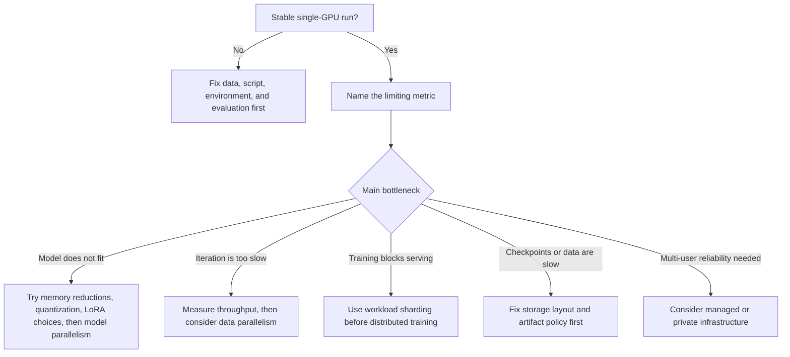
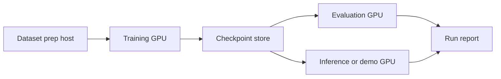
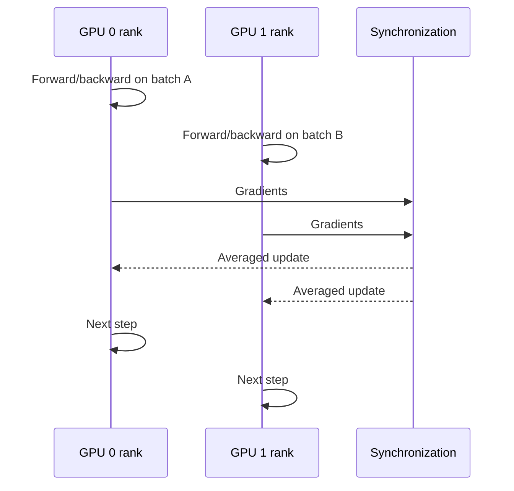
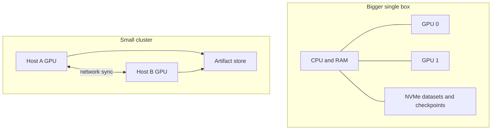

> **AI/ML Engineering Track** | Complexity: `[COMPLEX]` | Time: 3-4 hours
>
> **Prerequisites**: Single-GPU Local Fine-Tuning, Reproducible Python, CUDA, and ROCm Environments, Distributed Training Infrastructure

## Learning Outcomes

By the end of this module, you will be able to:

- **Diagnose** whether a fine-tuning workload is blocked by memory capacity, training throughput, storage I/O, network synchronization, thermal limits, or workflow instability before buying hardware.
- **Compare** data parallelism, model parallelism, pipeline parallelism, tensor parallelism, and workload sharding against realistic home-lab constraints.
- **Design** a small multi-GPU or multi-host fine-tuning lab that accounts for PCIe topology, power, cooling, storage, checkpoints, and reproducible environments.
- **Evaluate** a hardware expansion plan using measured baselines, scaling efficiency, failure recovery cost, and the operational burden of maintaining the lab.
- **Debug** common multi-GPU launch failures by separating training-code issues from driver, runtime, topology, network, and artifact-management problems.

## Why This Module Matters

Mira has a stable single-GPU fine-tuning workflow and a problem that feels urgent. Her team can run LoRA experiments overnight, but each run consumes the whole evening, and the next morning they still do not know whether the model improved because evaluation is slow and checkpoint handling is messy. A friend offers a second GPU. Another teammate suggests buying a used workstation. A social post shows someone training across three machines in a spare room, and suddenly the answer seems obvious: add more GPUs.

The failure starts three weeks later. The second GPU fits physically but runs through a narrow PCIe slot. The power supply survives short tests but sags under sustained load. Training launches, then stalls during synchronization. Checkpoints fill the fastest disk. One host has a different CUDA stack than the other, so a run that starts on Monday fails on Tuesday after a driver update. The team has not improved the model; they have built a small distributed-systems problem in the room where they used to keep a reliable workstation.

This module teaches the decision discipline behind home-lab multi-GPU fine-tuning. The goal is not to scare you away from multiple GPUs. The goal is to help you know when the extra hardware removes a real bottleneck, when it merely moves the bottleneck somewhere more expensive, and when a simpler design such as workload sharding gives most of the benefit with much less operational risk.

## Core Content

### 1. Start With the Bottleneck, Not the Shopping List

The first engineering question is not whether another GPU can be added. The first question is which constraint is limiting the learning loop right now. Multi-GPU fine-tuning is useful when it removes a named, repeated constraint, but it is wasteful when the existing workflow is still unclear, unstable, or poorly measured. A learner who cannot name the bottleneck will usually buy complexity instead of capacity.

A fine-tuning workflow has several different bottlenecks that feel similar from the outside. A run may be slow because the model is too large for the chosen batch size, because preprocessing cannot feed the GPU quickly enough, because checkpoints are written to a slow disk, because evaluation is serialized after training, or because the team waits too long between experiments. Adding GPUs helps only some of those problems. It does not repair weak data, informal evaluation, unreproducible environments, or a training script that fails under ordinary single-GPU use.

Use this decision ladder before changing hardware. The ladder keeps the conversation grounded in the observable system rather than in GPU count or memory totals alone.



A good bottleneck statement has a metric, a threshold, and a reason it matters. “Training is slow” is not enough, because it does not tell you whether to improve data loading, batch size, checkpointing, evaluation, or parallelism. “One LoRA run takes nine hours, and we need three comparable runs per evening to evaluate prompt-template changes” is much better. It identifies wall-clock iteration time as the constraint and implies that throughput or concurrency may be useful.

A bad bottleneck statement hides uncertainty behind hardware language. “We need two GPUs” sounds concrete, but it skips the analysis. Two GPUs might help if the model already fits and the script can use data parallelism efficiently. Two GPUs might not help if the training loop spends most of its time loading data from a slow disk. Two GPUs might make the situation worse if checkpoints become larger, thermals become unstable, and nobody has measured the baseline.

**Stop and think:** Your single-GPU run takes six hours. The GPU utilization alternates between high and low, checkpoints take several minutes, and evaluation is done manually the next day. Which bottleneck would you measure first, and why would buying another GPU be a weak first move?

The practical answer is to measure before expanding. Capture GPU utilization, samples per second, tokens per second, data-loader wait time if your framework exposes it, checkpoint duration, disk growth, and evaluation latency. You do not need a perfect observability platform for a home lab, but you do need enough evidence to know whether the next change is hardware, code, storage, or workflow.

```bash
mkdir -p runs/baseline

nvidia-smi --query-gpu=name,memory.used,memory.total,utilization.gpu,temperature.gpu,power.draw \
  --format=csv -l 5 | tee runs/baseline/gpu-watch.csv
```

```bash
df -h | tee runs/baseline/filesystems.txt
du -sh data runs 2>/dev/null | tee runs/baseline/artifact-sizes.txt
```

```bash
.venv/bin/python - <<'PY'
import torch

print("torch:", torch.__version__)
print("cuda_available:", torch.cuda.is_available())
print("cuda_device_count:", torch.cuda.device_count())
for index in range(torch.cuda.device_count()):
    print(index, torch.cuda.get_device_name(index))
PY
```

These commands do not solve scaling by themselves. They establish the habit that every expansion decision starts with evidence. Once you can say what is limiting the run, you can choose between a bigger single box, a small cluster, or functional sharding with much less guessing.

### 2. Understand the Three Home-Lab Expansion Shapes

Most home labs grow into one of three shapes: a bigger single workstation, a small cluster of machines, or workload sharding across separate roles. The shapes are not merely physical layouts. They imply different failure modes, operational habits, and scaling ceilings. Choosing the shape is an architecture decision, not a shopping preference.

A bigger single box is usually the cleanest first step beyond one GPU. It keeps storage local, avoids multi-host networking problems, and reduces the number of operating-system and driver combinations that can drift. The tradeoff is concentration. Power, heat, PCIe lane allocation, case airflow, and physical serviceability all become more serious because one machine carries the whole training job.

```ascii
+---------------------------------------------------------------+
| Single multi-GPU workstation                                  |
|                                                               |
|  +-------------------+        +-----------------------------+ |
|  | CPU + RAM         |<------>| NVMe dataset + checkpoints  | |
|  +---------+---------+        +-----------------------------+ |
|            |                                                  |
|       PCIe root complex                                       |
|            |                                                  |
|   +--------+--------+       +--------+--------+               |
|   | GPU 0 x16 slot  |       | GPU 1 x8/x16 slot|              |
|   | training rank 0 |       | training rank 1 |               |
|   +-----------------+       +-----------------+               |
|                                                               |
|  Main risks: PSU headroom, sustained heat, PCIe lane sharing  |
+---------------------------------------------------------------+
```

A small cluster gives you incremental growth and hardware reuse, but it makes the lab behave like distributed infrastructure. Every participating host now needs compatible drivers, runtimes, Python dependencies, clocks, network reachability, data access, and failure handling. The network becomes part of the training system. A run may fail because of a training bug, but it may also fail because one host cannot resolve another, an SSH key changed, or a slow link makes synchronization unproductive.

```ascii
+-------------------------+          10 GbE or faster          +-------------------------+
| Host A                  |<----------------------------------->| Host B                  |
|                         |                                     |                         |
| GPU 0                   |                                     | GPU 1                   |
| rank 0                  |                                     | rank 1                  |
| local cache             |                                     | local cache             |
| .venv + CUDA/ROCm stack |                                     | .venv + CUDA/ROCm stack |
+------------+------------+                                     +------------+------------+
             |                                                               |
             +-------------------- shared artifact policy -------------------+
                                  checkpoints, logs, metrics
```

Functional workload sharding is often the most practical form of “multi-GPU” for a home lab even though it is not true distributed training. Instead of splitting one training job across devices, you split the work of the lab: one GPU trains, one evaluates, one serves an inference endpoint, and another machine handles embeddings or data preparation. This avoids tight synchronization while still improving the learning loop. It is especially valuable when the team’s real bottleneck is not raw training throughput but the fact that training, evaluation, and serving block each other.



The simplest architecture that solves the bottleneck is usually the best home-lab architecture. If the model fits on one GPU but the team needs to evaluate more often, sharding evaluation onto another device may outperform a fragile distributed training launch in practical terms. If the model does not fit even with careful memory reduction, model parallelism may be justified. If the job is throughput-bound and the training stack is stable, data parallelism may be the right next step.

**Active check:** For each of these three shapes, name one problem it solves and one problem it introduces. If your list contains only benefits, you are still thinking like a buyer rather than an operator.

The operating model should match the architecture. A single workstation can rely on local scripts and disciplined directories for many learning scenarios. A small cluster needs host inventory, environment parity checks, network tests, and a restart plan. Workload sharding needs clear ownership of artifacts so evaluation, serving, and training do not overwrite each other or compare the wrong checkpoint.

### 3. Choose the Right Parallelism Model

Parallelism terms are often used loosely, which causes poor design decisions. The useful distinction is what gets split and how tightly the parts must coordinate. Home-lab learners should understand the mechanisms well enough to avoid choosing data parallelism for a memory-fit problem or model parallelism for a workflow-concurrency problem.

| Approach | What gets split | Best fit | Coordination cost | Home-lab warning |
|---|---|---|---|---|
| Data parallelism | Batches of training data | Model fits on each GPU, but throughput is too low | Gradient synchronization every step | Scaling may disappoint on slow interconnects or small batch sizes |
| Model parallelism | Layers or model components | Model or context cannot fit on one GPU | Activation movement between devices | Debugging and memory planning become harder quickly |
| Tensor parallelism | Large tensor operations inside layers | Very large models with framework support | Frequent high-bandwidth communication | Usually wants fast interconnects beyond casual home networks |
| Pipeline parallelism | Stages of the model pipeline | Deep models split into sequential stages | Bubbles and scheduling complexity | Poor balance can leave devices idle |
| Workload sharding | Different jobs or roles | Training, eval, serving, and indexing block each other | Loose coordination through artifacts and APIs | Needs naming discipline to avoid stale or mixed outputs |

Data parallelism is the first true multi-GPU pattern many learners try. Each GPU receives a different batch or micro-batch, computes gradients, and participates in synchronization so the model updates consistently. This works best when the model already fits on each GPU and the main problem is throughput. It does not make a too-large model magically fit unless combined with other memory-saving techniques.



Model parallelism is used when a single GPU cannot hold the model, optimizer state, activations, or desired context length. The key tradeoff is that memory pressure decreases on each device, but communication and placement complexity increase. A home lab with weak interconnects may be able to fit the workload but still train slowly because data moves across devices at the wrong time or too often.

Workload sharding is different because it does not split a single training step. It splits the lab workflow. For many learners this is the right step because their true bottleneck is waiting: waiting for evaluation after training, waiting for inference demos while the training GPU is busy, or waiting for data preparation to finish. Sharding can turn one long serial workflow into a more useful pipeline without requiring distributed training internals.

The right question is not “which parallelism is most advanced?” The right question is “which mechanism attacks the measured bottleneck with the least new failure surface?” Advanced techniques are impressive only when the lab can operate them reliably. A two-GPU workstation that runs boring, repeatable data-parallel experiments may teach more than a cluster that spends every evening failing at launch time.

```bash
accelerate config
accelerate env
```

```bash
CUDA_VISIBLE_DEVICES=0,1 accelerate launch --num_processes 2 train.py \
  --max_steps 100 \
  --output_dir runs/two-gpu-smoke
```

Use short smoke runs before long fine-tuning runs. A smoke run should prove that both devices are visible, the launcher works, logs are written, checkpoints land where expected, and failure messages are understandable. Do not use a full overnight job as the first test of a new topology. When a long run fails, the blast radius includes time, heat, power, disk writes, and trust in the setup.

### 4. Worked Example: Decide Whether to Add a Second GPU

Consider a learner with a single workstation, one 24 GB GPU, 64 GB system RAM, a 2 TB NVMe drive, and a stable LoRA fine-tuning script. The model fits at the chosen sequence length, but each 3,000-step experiment takes eight hours. The learner wants to know whether adding a second 24 GB GPU is worthwhile or whether the money should go into storage, evaluation automation, or a separate inference box.

Step one is to state the bottleneck as a measurable claim. The learner writes: “The model fits on one GPU, but the experiment loop is too slow. A useful expansion must reduce the 3,000-step run from eight hours to five hours or less without making checkpoints unreliable.” This statement matters because it rules out model parallelism as the first choice. The memory problem is not the primary constraint; throughput and workflow time are.

Step two is to inspect the physical host before assuming that the second GPU will run well. The motherboard has one x16 slot connected directly to the CPU and a second physical x16 slot wired as x4 through the chipset. The case has enough physical space, but the second card would sit close to the first and restrict airflow. The power supply has enough rated wattage on paper, but the learner has not measured sustained draw during training. These details do not automatically reject the upgrade, but they reduce confidence in near-linear scaling.

```ascii
+---------------- hardware decision notes ----------------+
| Current GPU: 24 GB, PCIe x16, stable thermals            |
| Candidate GPU: 24 GB, would use physical x16 / wired x4  |
| Model fit: yes, single GPU can complete the run          |
| Bottleneck: wall-clock iteration time                    |
| Risk 1: second slot bandwidth may limit synchronization  |
| Risk 2: adjacent cards may throttle under sustained load |
| Risk 3: checkpoints may grow faster than cleanup policy  |
+---------------------------------------------------------+
```

Step three is to compare options rather than treating the second GPU as the only solution. The learner considers four choices: buy the second GPU for data parallelism, buy faster or larger NVMe storage, automate evaluation on a cheaper separate GPU host, or reduce the run time by improving dataset packing and batch configuration. Because the model already fits, a second GPU could help. Because evaluation is also manual, workload sharding might improve the practical loop even if raw training speed changes less.

| Option | Expected benefit | Main risk | Evidence needed before buying |
|---|---|---|---|
| Add second GPU in same box | Higher training throughput with data parallelism | PCIe, heat, and PSU constraints reduce scaling | Two-GPU smoke test on borrowed hardware or comparable topology |
| Add NVMe capacity | Safer checkpoints and datasets | Does not reduce compute time directly | Current checkpoint duration and disk growth measurements |
| Separate evaluation/inference GPU | Training no longer blocks evaluation or demos | More host management | Proof that evaluation delay is a major loop constraint |
| Tune data pipeline | Faster single-GPU baseline | May require code work | GPU utilization and data-loader timing show stalls |

Step four is to estimate success criteria before the experiment. The learner decides that the second GPU is justified only if a short comparable run shows at least a meaningful wall-clock improvement, stable thermals, predictable checkpoint writes, and no unexplained launch failures. The learner also decides that if training improves but evaluation still delays decisions until the next day, a sharded evaluation box may be the next better investment.

Step five is to run the smallest fair test. The learner uses the same dataset slice, same maximum steps, same logging fields, and same checkpoint policy for single-GPU and two-GPU runs. They avoid comparing an old baseline against a new run with different preprocessing, because that would confuse hardware scaling with workflow changes.

```bash
mkdir -p runs/decision-example

CUDA_VISIBLE_DEVICES=0 .venv/bin/python train.py \
  --max_steps 200 \
  --output_dir runs/decision-example/single \
  | tee runs/decision-example/single.log
```

```bash
CUDA_VISIBLE_DEVICES=0,1 accelerate launch --num_processes 2 train.py \
  --max_steps 200 \
  --output_dir runs/decision-example/two-gpu \
  | tee runs/decision-example/two-gpu.log
```

```bash
grep -E "steps_per_second|samples_per_second|loss|checkpoint" \
  runs/decision-example/single.log \
  runs/decision-example/two-gpu.log
```

Step six is to interpret the result as an engineering decision. Suppose the two-GPU run is only modestly faster, the second GPU runs hotter than expected, and checkpoint writing now creates noticeable stalls. The correct conclusion is not “multi-GPU failed forever.” The correct conclusion is that this specific host layout is a weak expansion for this workload. A better next step may be improving cooling, using a board with better PCIe layout, sharding evaluation, or postponing the GPU purchase until the single-GPU data path is cleaner.

Suppose instead the two-GPU run is substantially faster, temperatures remain stable, checkpoint writes are manageable, and rerunning the smoke test produces consistent results. Then the learner has a defensible reason to expand. The decision is grounded in the original bottleneck and in measured behavior rather than in hope.

**Stop and think:** In the worked example, why is “the model fits on one GPU” such an important observation? What wrong purchase or wrong parallelism choice does it help prevent?

This example is deliberately ordinary. Most good home-lab decisions are ordinary decisions made with disciplined evidence. The senior skill is not knowing the flashiest distributed-training term. The senior skill is refusing to add a moving part until you know what work that part is supposed to do.

### 5. Design the Lab Like a Small Production System

A home lab does not need datacenter bureaucracy, but multi-GPU fine-tuning does need operational discipline. Once multiple devices or hosts participate in a run, the lab has shared state, dependencies, failure modes, and recovery costs. Treating those as “just home stuff” is how useful experiments turn into unreliable infrastructure.

Start with topology. In a single box, identify which slots are connected to the CPU, which share lanes with NVMe devices, and whether the case can exhaust sustained heat. PCIe bandwidth is not the only factor in training speed, but a surprising slot layout can explain disappointing scaling. Thermal behavior matters because fine-tuning is sustained load, not a short benchmark. A machine that survives a quick test can still throttle or become unstable after hours.

In a multi-host lab, network topology becomes part of the training design. A one-gigabit link may be acceptable for loose workload sharding, artifact copying, or occasional checkpoint movement. It is usually a poor foundation for tightly synchronized distributed training. Ten-gigabit Ethernet is more realistic for serious home-lab coordination, but even then, software overhead, storage placement, and launch reliability can dominate the learner’s experience.



Environment consistency is the next design requirement. Every participating host should report the same intended Python version, compatible PyTorch build, expected CUDA or ROCm runtime, and visible device count. “It worked on the other machine” is not useful during a distributed launch failure. Record the environment in a repeatable command so drift is visible before a long run begins.

```bash
.venv/bin/python - <<'PY'
import platform
import torch

print("python:", platform.python_version())
print("torch:", torch.__version__)
print("cuda_available:", torch.cuda.is_available())
print("cuda_version:", torch.version.cuda)
print("hip_version:", torch.version.hip)
print("device_count:", torch.cuda.device_count())
for index in range(torch.cuda.device_count()):
    print("device", index, torch.cuda.get_device_name(index))
PY
```

Storage needs more planning than learners expect. Checkpoints, optimizer states, logs, evaluation outputs, dataset caches, and failed partial runs can fill disks quickly. More GPUs can create more output faster, which turns a previously tolerable cleanup habit into a reliability problem. A clear artifact policy should answer where runs are stored, how checkpoints are named, which ones are kept, and how failed runs are cleaned without deleting evidence needed for debugging.

Power and cooling should be treated as sustained-run constraints. It is not enough that the system boots, detects both GPUs, and completes a two-minute smoke test. Fine-tuning creates hours of heat, fan noise, and power draw. If the machine is in a room where heat affects people, or if the circuit is shared with other equipment, those are engineering inputs. Ignoring them does not make them less real.

Failure recovery is the final design layer. A multi-GPU job should have a known restart path, a checkpoint interval chosen intentionally, and logs that identify which rank or host failed. If a failed run leaves behind confusing partial artifacts, the next run may load the wrong checkpoint or compare against the wrong output. A home lab becomes trustworthy when failed experiments are explainable rather than mysterious.

**Active check:** Imagine a two-host run fails after two hours. What evidence would you want in the run directory so you can tell whether the cause was network, environment drift, out-of-memory behavior, or checkpoint storage? Write that evidence list before reading on.

A strong run directory usually contains the launch command, environment snapshot, selected configuration, training log, hardware watch output, checkpoint timestamps, and final decision notes. This is not excessive ceremony. It is the minimum context needed to learn from a failed distributed run instead of merely repeating it.

```bash
RUN_DIR="runs/$(date +%Y%m%d-%H%M%S)-two-gpu"
mkdir -p "$RUN_DIR"

printf "Command: %s\n" "accelerate launch --num_processes 2 train.py" > "$RUN_DIR/notes.txt"
.venv/bin/python -V > "$RUN_DIR/python-version.txt"
.venv/bin/python -c "import torch; print(torch.__version__, torch.cuda.device_count(), torch.version.cuda, torch.version.hip)" \
  > "$RUN_DIR/torch-env.txt"
nvidia-smi > "$RUN_DIR/nvidia-smi-start.txt"
```

### 6. Measure, Debug, and Decide When to Stop

Multi-GPU home-lab work should end each experiment with a decision, not just another log directory. The decision may be to keep the design, simplify it, fix a specific bottleneck, or stop scaling at home. Without a decision habit, the lab becomes a collection of interesting failures that do not improve the model or the learner.

Scaling efficiency is a useful but imperfect metric. If one GPU processes a certain number of samples per second and two GPUs process only slightly more, something is limiting the system. The cause might be small batch size, synchronization overhead, data loading, checkpoint stalls, thermal throttling, or interconnect limits. The answer is not always to abandon multi-GPU, but the disappointing result should trigger diagnosis before longer runs.

A practical home-lab comparison needs the same workload, same stopping point, same dataset slice, and same output policy. Changing several variables at once makes the result impossible to interpret. If the two-GPU run uses a different batch policy, different preprocessing, and a different checkpoint interval, you do not know whether hardware helped. You only know that a different experiment produced a different number.

```bash
grep -E "steps_per_second|samples_per_second|tokens_per_second" runs/*/*.log
du -sh runs/* 2>/dev/null
```

```bash
iostat -xz 1 5
```

```bash
ping -c 5 peer-gpu-host
iperf3 -c peer-gpu-host -t 10
```

Debugging should separate layers. First confirm devices are visible. Then confirm the framework sees them. Then confirm the launcher can start a tiny job. Then confirm the real training script can run for a short fixed number of steps. Then run the longer experiment. This sequence prevents you from debugging application behavior while the underlying runtime or topology is still uncertain.

When a run fails, resist the urge to immediately change three things. Read the first meaningful error, identify the layer, and make one corrective change. Driver mismatch, missing dependency, out-of-memory failure, network timeout, file permission problem, and checkpoint corruption are different problems. Treating them all as “multi-GPU is flaky” hides the actual fix.

There is also a point where home-lab scaling should stop. If the lab needs datacenter-style cooling, if several people depend on it, if backup and storage policy consume more attention than model quality, or if failed jobs are too expensive to repeat casually, the architecture has outgrown the learning environment. Moving to managed infrastructure or a more serious private training setup may be the mature decision.

Stopping is not failure. A home lab is valuable because it creates fast, low-friction learning. When the lab becomes slow, fragile, noisy, expensive, and socially dependent, it may no longer be serving that purpose. Senior engineers notice when the system’s operating cost has overtaken its educational value.

## Did You Know?

1. Many multi-GPU slowdowns are caused by synchronization and input-pipeline limits rather than raw GPU compute. A second GPU can sit underused if the training process cannot feed data, exchange gradients, or write checkpoints quickly enough.

2. A physical x16 slot is not always electrically wired as x16. Motherboard manuals often show which slots share lanes with NVMe devices, chipsets, or other expansion cards, and that wiring can affect expansion plans.

3. Functional workload sharding can improve the practical experiment loop even when it does not reduce the training time of a single run. Separating training, evaluation, serving, and embedding work can remove waiting time without tight distributed coordination.

4. Reproducible environments become more valuable as the lab grows. A minor PyTorch, CUDA, ROCm, driver, or library difference that is merely annoying on one host can become a launch blocker when several ranks must cooperate.

## Common Mistakes

| Mistake | Why it hurts | Better move |
|---|---|---|
| Buying another GPU before naming the bottleneck | The new device may not address the actual limit, such as storage stalls, evaluation delay, or weak data quality | Write a metric-based bottleneck statement before changing hardware |
| Treating model fit and training throughput as the same problem | Data parallelism helps throughput when the model fits, but it does not solve every memory-layout issue | Choose parallelism based on whether the constraint is memory, throughput, or workflow concurrency |
| Ignoring PCIe lane layout and airflow | A second card may run through a narrow link or throttle under sustained heat | Read the motherboard layout, inspect slot wiring, and test thermals under load |
| Comparing unfair experiments | Different datasets, batch policies, checkpoint intervals, or logging settings make scaling results meaningless | Keep the single-GPU and multi-GPU tests comparable and short at first |
| Letting environments drift across hosts | Small runtime differences can cause distributed launches to fail unpredictably | Capture Python, PyTorch, CUDA or ROCm, driver, and device-count evidence on every host |
| Saving checkpoints without an artifact policy | Disk growth can stop runs, hide useful logs, or cause learners to load the wrong checkpoint | Define run directories, checkpoint retention, cleanup rules, and naming conventions |
| Using a full overnight job as the first topology test | Long failures waste time, power, and confidence while producing too much evidence to inspect cleanly | Start with device checks, launcher checks, and short fixed-step smoke runs |
| Scaling the home lab after reliability becomes the main requirement | A casual lab can become an under-managed production system when multiple users depend on it | Move toward private or managed infrastructure when uptime, backup, and cooling dominate the work |

## Quiz

**Q1.** Your team has a stable single-GPU LoRA workflow. The model fits in memory, but each run takes so long that only one experiment can finish per evening. GPU utilization is high during most of the run, and checkpoint writes are short. Which expansion path should you evaluate first, and what evidence should decide whether it worked?

<details>
<summary>Answer</summary>

Evaluate data parallelism first because the model already fits and the main bottleneck is throughput. The decision should be based on comparable single-GPU and two-GPU runs with the same dataset slice, stopping point, batch policy, and checkpoint behavior. If samples per second or wall-clock time improves enough to meet the stated threshold without unstable thermals or artifact problems, the expansion is justified.

</details>

**Q2.** A learner wants to split a model across two GPUs because training is slow. During review, you notice the model already fits on one GPU, but evaluation and inference demos wait until training finishes. What design would you recommend before true distributed training?

<details>
<summary>Answer</summary>

Recommend workload sharding. The bottleneck is workflow concurrency, not model memory. Keeping training on one GPU while using another device or host for evaluation, inference, or embeddings can shorten the practical learning loop without adding tight gradient synchronization or model-placement complexity.

</details>

**Q3.** A two-host training job fails after launch with inconsistent runtime errors. Host A reports a different PyTorch build and CUDA runtime than Host B, and the team did not capture environment snapshots before the run. What layer should you debug first, and why?

<details>
<summary>Answer</summary>

Debug environment consistency first. Distributed training requires participating ranks to cooperate under compatible runtimes, so version drift can cause failures that look like training-code bugs. The team should capture Python, PyTorch, CUDA or ROCm, driver, and visible-device information on every host before changing the model code.

</details>

**Q4.** A second GPU is installed in a workstation and the two-GPU run starts successfully, but scaling is disappointing. The second card is in a physical x16 slot that is electrically wired as x4, temperatures rise over time, and checkpoint writes are slower than before. How should you interpret the result?

<details>
<summary>Answer</summary>

The result shows that the specific host topology is limiting the expansion. The launch succeeded, but PCIe layout, sustained thermals, and storage behavior are reducing practical gains. The next step is to diagnose those constraints or choose a different design, not to assume that multi-GPU training is universally ineffective.

</details>

**Q5.** Your team wants to buy more GPUs because the model cannot run at the desired context length on one device. Before buying, you find that quantization, LoRA configuration, sequence length policy, and gradient checkpointing have not been evaluated. What should the team do first?

<details>
<summary>Answer</summary>

The team should evaluate memory-reduction techniques before assuming hardware expansion is required. If those techniques let the workload fit while preserving acceptable quality and speed, they may avoid model-parallel complexity. If the model still cannot fit, then model parallelism or larger-memory hardware becomes a better-supported decision.

</details>

**Q6.** A learner compares a single-GPU baseline from last week with a new two-GPU run, but the new run uses a different dataset sample, different checkpoint interval, and different batch configuration. The two-GPU run appears faster. Why is the conclusion weak?

<details>
<summary>Answer</summary>

The comparison changes too many variables. The observed improvement could come from hardware, dataset differences, batch changes, checkpoint policy, or other workflow changes. A fair scaling test needs the same workload, stopping point, logging fields, and artifact policy so the learner can attribute the difference to the expansion.

</details>

**Q7.** A home lab has grown to three GPU machines. Several people depend on it, backup planning is taking significant time, failures are expensive, and cooling changes are being discussed more often than model quality. What architectural decision should be on the table?

<details>
<summary>Answer</summary>

The team should consider stopping casual home-lab scaling and moving toward managed infrastructure or a more serious private training setup. The lab has crossed from learning environment into reliability-sensitive infrastructure. At that point, uptime, backup, cooling, and operational ownership need more discipline than a casual home lab usually provides.

</details>

## Hands-On Exercise

Goal: produce a defensible home-lab expansion decision for a fine-tuning workload. You may complete this with one GPU by writing the measurement plan and running the single-GPU baseline, or with multiple GPUs by running the comparison. The important result is a decision backed by evidence rather than hardware optimism.

- [ ] Create a run notebook that names the bottleneck, the success threshold, and the expansion option being evaluated. Use one primary constraint such as model fit, wall-clock training time, tokens per second, checkpoint cost, evaluation delay, or separation between training and serving.

```bash
mkdir -p runs/home-lab-decision
cat > runs/home-lab-decision/decision.md <<'EOF'
Bottleneck:
Success threshold:
Expansion option:
Reason this option targets the bottleneck:
Stop condition:
EOF

cat runs/home-lab-decision/decision.md
```

- [ ] Capture the current hardware and storage state before changing the training launch. This creates a baseline for later debugging and prevents you from treating GPU memory as the only system constraint.

```bash
nvidia-smi --query-gpu=name,memory.total,memory.used,temperature.gpu,power.draw,pcie.link.gen.current,pcie.link.width.current \
  --format=csv | tee runs/home-lab-decision/gpu-inventory.csv

lsblk -o NAME,SIZE,TYPE,MOUNTPOINT | tee runs/home-lab-decision/block-devices.txt
df -h | tee runs/home-lab-decision/filesystems.txt
```

```bash
rocm-smi --showproductname --showtemp --showuse 2>/dev/null | tee runs/home-lab-decision/rocm-inventory.txt
```

- [ ] Capture the Python and training runtime environment. Repeat this step on every participating host if you are testing a multi-host lab.

```bash
.venv/bin/python -V | tee runs/home-lab-decision/python-version.txt

.venv/bin/python - <<'PY' | tee runs/home-lab-decision/torch-environment.txt
import platform
import torch

print("python", platform.python_version())
print("torch", torch.__version__)
print("cuda_available", torch.cuda.is_available())
print("device_count", torch.cuda.device_count())
print("cuda_version", torch.version.cuda)
print("hip_version", torch.version.hip)
for index in range(torch.cuda.device_count()):
    print(index, torch.cuda.get_device_name(index))
PY
```

- [ ] Run a short single-GPU baseline using the same dataset slice, output directory pattern, and stopping point that you will use for the comparison. If your training script has different arguments, adapt the command while preserving the measurement idea.

```bash
mkdir -p runs/home-lab-decision/single

CUDA_VISIBLE_DEVICES=0 .venv/bin/python train.py \
  --max_steps 100 \
  --output_dir runs/home-lab-decision/single \
  | tee runs/home-lab-decision/single.log
```

- [ ] Extract the baseline evidence that will matter for the decision. At minimum, capture throughput or wall-clock timing, final loss trend, checkpoint size, and any visible stalls or warnings.

```bash
grep -E "loss|steps_per_second|samples_per_second|tokens_per_second|checkpoint|warning|error" \
  runs/home-lab-decision/single.log \
  | tail -n 30 \
  | tee runs/home-lab-decision/single-summary.txt

du -sh runs/home-lab-decision/single | tee runs/home-lab-decision/single-size.txt
```

- [ ] If you have two GPUs in one host, run the smallest comparable data-parallel test only if the model already fits on one GPU. Keep the same maximum steps and artifact policy so the comparison is meaningful.

```bash
mkdir -p runs/home-lab-decision/two-gpu

CUDA_VISIBLE_DEVICES=0,1 accelerate launch --num_processes 2 train.py \
  --max_steps 100 \
  --output_dir runs/home-lab-decision/two-gpu \
  | tee runs/home-lab-decision/two-gpu.log
```

- [ ] If you have multiple hosts, test the network path before blaming the training framework. Use your actual peer hostname or address, and record both latency and bandwidth evidence.

```bash
ping -c 5 <peer-host> | tee runs/home-lab-decision/ping-peer.txt
iperf3 -c <peer-host> -t 10 | tee runs/home-lab-decision/iperf-peer.txt
```

- [ ] If the model does not fit on one GPU, evaluate at least one memory-reduction option before choosing model parallelism. Record whether the option changes quality, speed, or stability enough to avoid a more complex topology.

```bash
grep -E "out of memory|CUDA out of memory|OOM|memory" \
  runs/home-lab-decision/single.log \
  | tail -n 20 \
  | tee runs/home-lab-decision/memory-failure-summary.txt
```

- [ ] Test a workload-sharding alternative if the real bottleneck is workflow concurrency. For example, keep training on one device and run evaluation or inference on another device so the learning loop is not blocked by a single serialized workstation role.

```bash
CUDA_VISIBLE_DEVICES=0 .venv/bin/python train.py \
  --max_steps 50 \
  --output_dir runs/home-lab-decision/sharded-train

CUDA_VISIBLE_DEVICES=1 .venv/bin/python eval.py \
  --checkpoint runs/home-lab-decision/sharded-train \
  | tee runs/home-lab-decision/sharded-eval.log
```

- [ ] Observe operational side effects while the test runs. Record heat, power, disk growth, and any warnings so the decision accounts for sustained operation rather than startup success alone.

```bash
nvidia-smi --query-gpu=timestamp,name,utilization.gpu,temperature.gpu,power.draw,memory.used \
  --format=csv -l 5 \
  | tee runs/home-lab-decision/gpu-watch.csv
```

```bash
iostat -xz 1 5 | tee runs/home-lab-decision/iostat.txt
du -sh runs/home-lab-decision/* 2>/dev/null | tee runs/home-lab-decision/run-sizes.txt
```

- [ ] Write the final decision using the evidence you captured. The decision must say whether to keep the multi-GPU plan, simplify to workload sharding, fix a non-GPU bottleneck first, or stop scaling the home lab for now.

```bash
cat >> runs/home-lab-decision/decision.md <<'EOF'

Evidence summary:
Single-GPU result:
Multi-GPU or sharded result:
Operational side effects:
Decision:
Next action:
EOF

cat runs/home-lab-decision/decision.md
```

Success criteria:

- [ ] The bottleneck was named before the expansion test, and the success threshold was measurable.
- [ ] Hardware, storage, and runtime environment evidence was captured before the comparison.
- [ ] The single-GPU baseline and multi-GPU or sharded test used comparable settings where applicable.
- [ ] The decision considered throughput, memory fit, checkpoint behavior, thermals, power, storage, and operational complexity.
- [ ] The final decision clearly chooses keep, simplify, fix another bottleneck first, or stop scaling for now.

## Next Modules

- [Home AI Operations and Cost Model](../ai-infrastructure/module-1.5-home-ai-operations-cost-model/)
- [Private AI Training Infrastructure](../../on-premises/ai-ml-infrastructure/module-9.2-private-ai-training/)
- [Distributed Training Infrastructure](../../platform/disciplines/data-ai/ai-infrastructure/module-1.3-distributed-training/)

## Sources

- [Accelerate Quicktour](https://huggingface.co/docs/accelerate/v1.9.0/en/quicktour) — Grounds the practical mechanics of moving from single-device training to multi-GPU or multi-node launches.
- [Schedule GPUs in Kubernetes](https://kubernetes.io/docs/tasks/manage-gpus/scheduling-gpus/) — Useful next reading for learners who want to understand how GPU resources are requested and scheduled once workloads move beyond a single box.
