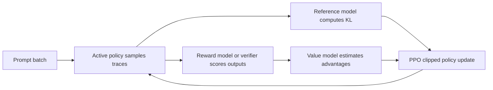
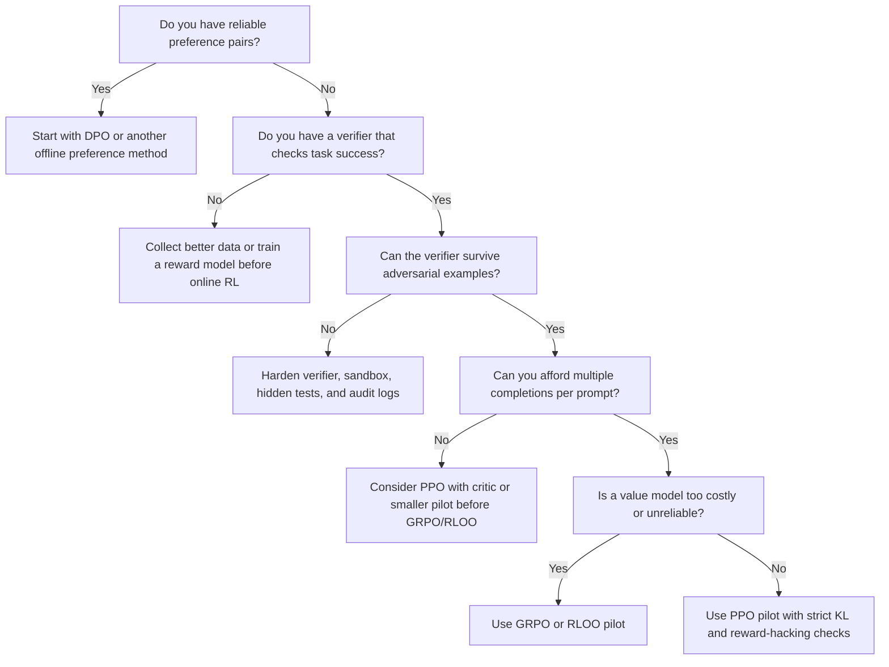

> **AI/ML Engineering Track** | Complexity: `[COMPLEX]` | Time: 3-4 hours
>
> **Prerequisites**: RLHF & Alignment, LLM Evaluation, Reasoning Models: System 2 Thinking

## What You'll Be Able to Do

By the end of this module, you will be able to:

- **Design** a reasoning-model reinforcement learning pipeline that chooses between PPO, DPO, GRPO, RLOO, and RLVR based on reward availability, verifier quality, compute budget, and safety risk.
- **Compare** GRPO against PPO by explaining why GRPO removes the learned value model, how group-relative advantages are estimated, and what tradeoffs that creates for rollout design.
- **Evaluate** when verifiable rewards are trustworthy enough for RLVR, including math-answer checkers, code-test harnesses, instruction-following validators, and failure modes caused by brittle verifiers.
- **Diagnose** reward hacking, reward model drift, KL collapse, length exploitation, verifier overfitting, and long-chain-of-thought cost spikes from training logs and sampled traces.
- **Implement** a toy GRPO training-step sketch that computes group-normalized advantages, applies a KL penalty, and separates policy optimization from reward verification.

## Why This Module Matters

Hypothetical scenario: your team owns an internal code-repair assistant for Kubernetes
operators. The model can explain a `CrashLoopBackOff`, but it fails when a fix requires
three dependent edits: patch the Deployment, adjust a ConfigMap, and update a readiness
probe. A product manager asks for a "reasoning model" because the base assistant sounds
confident while missing the dependency chain. The training team proposes ordinary RLHF
with a learned reward model, the evaluation team proposes unit tests as rewards, and the
platform team asks why the rollout job suddenly needs far more GPU time than supervised
fine-tuning.

That disagreement is the real design problem. Reasoning-model RL is not just "RLHF,
but bigger." Long chain-of-thought traces create expensive rollouts, sparse final-answer
rewards create high-variance learning signals, and generic preference models often do
not know whether a proof, program, or multi-step plan is actually correct. The reward
surface changes from "which answer would a human prefer?" to "which generated solution
survives a verifier, stays readable, and does not learn to game the checker?"

This module picks up where [RLHF & Alignment](module-1.4-rlhf-alignment/) leaves off
and goes underneath the model family introduced in
[Reasoning Models: System 2 Thinking](../generative-ai/module-1.6-reasoning-models/).
You will not train a frontier model here. You will learn the engineering judgment needed
to design the training loop: which optimizer to choose, what reward shape to use, what
failure modes to watch, and what infrastructure must exist before the first expensive
RL run starts.

## Core Content

### 1. From RLHF to Reasoning RL

Classical RLHF starts with a model that already follows instructions reasonably well.
The usual pipeline is supervised fine-tuning, preference data collection, reward model
training, then policy optimization with a KL penalty that keeps the model close to the
reference policy. That pipeline is still important, but it was designed around preferences
over assistant responses, not around long private searches that may explore several
solution paths before emitting a final answer.

For chat alignment, a reward model can often learn useful preferences from side-by-side
responses. Human raters can say which answer is more helpful, safer, or clearer even when
neither answer has a single formally correct output. Reasoning tasks are different. In a
math problem, a final numeric answer can be right or wrong. In a code problem, tests can
pass or fail. In an instruction-following task with strict constraints, a validator can
check whether the response obeyed the requested format. The reward becomes more like a
test result than a taste judgment.

This shift creates three pressure points. First, reasoning rollouts are long, so every
policy update requires generating many expensive traces before the reward appears. Second,
the reward is often sparse, because the model receives little useful signal until the
final answer or test result is available. Third, a verifier is only a proxy for success:
if the checker is incomplete, leaky, or mis-specified, the policy can learn the checker
instead of the task. That is reward hacking in a more operational form.

```ascii
+----------------------+       +----------------------+       +----------------------+
| Classical RLHF       |       | Reasoning RL         |       | New engineering load |
+----------------------+       +----------------------+       +----------------------+
| Human preferences    |       | Verifiable outcomes  |       | Verifier design      |
| Shorter responses    |       | Long CoT traces      |       | Rollout throughput   |
| Reward model scores  |       | Rule or test rewards |       | Sparse credit signal |
| PPO or DPO common    |       | GRPO, PPO, RLVR      |       | Cost and safety logs |
+----------------------+       +----------------------+       +----------------------+
```

DeepSeek-R1 made this shift visible in open research. The arXiv paper identifies
DeepSeek-R1-Zero as a model trained with large-scale reinforcement learning without a
supervised fine-tuning cold start, then describes DeepSeek-R1 as a multi-stage pipeline
that adds cold-start data and further RL. The important engineering lesson is not that
every team should skip SFT. The lesson is that reasoning behavior can be incentivized by
rewarding successful problem solving, and the optimization loop must be shaped around
that reward source.

The RLHF module taught you to think in terms of a policy model, reference model, reward
model, and PPO update. Here, keep the same mental skeleton but replace the weak assumption
that a learned scalar reward can judge everything. A reasoning RL pipeline starts by asking
whether the task has a trustworthy verifier. If it does, RLVR becomes possible. If it does
not, preference optimization or a learned reward model may still be useful, but the risk
of proxy optimization rises sharply.

> **Pause and predict:** suppose a model receives reward only when the final answer string
> exactly matches a checker, and the checker ignores the reasoning trace. What behavior
> might improve quickly, and what behavior might silently deteriorate?

The answer is that final-answer formatting and answer-guessing may improve before reasoning
quality does. If the verifier never inspects intermediate logic, the model can learn
shortcuts that reach the checked field without producing robust reasoning. That is not
automatically bad for all applications; many production systems care about the answer.
But if your deployment depends on auditable reasoning, tool-use plans, or explanations a
human will later follow, outcome-only reward can hide dangerous regressions.

### 2. PPO Is the Baseline, Not the Default Answer

Proximal Policy Optimization was not invented for language models. Schulman and colleagues
introduced PPO in 2017 as a general policy-gradient method that uses a clipped surrogate
objective to avoid overly large policy updates. RLHF later adopted PPO because it gave
practitioners a practical way to optimize a policy against a learned reward while keeping
the updated policy near a reference model. PPO is still a useful baseline because it is
well understood, implemented in many training stacks, and compatible with learned rewards
and verifiable rewards.

In language-model RLHF, PPO usually treats token generation as a sequence of actions. The
policy samples a completion, the reward model scores it, a reference model supplies a KL
regularization term, and a learned value model estimates advantages so the policy update
has lower variance. This value model is often similar in size to the policy backbone, which
means PPO can be expensive even before you account for long reasoning traces.



The value model is the key tradeoff. It can reduce variance when the reward is noisy or
dense enough for token-level credit assignment, but it adds memory, compute, serving
complexity, and another moving part that can drift. In reasoning tasks, the reward often
arrives at the end of a long completion. Asking a value model to estimate token-level
credit for hundreds or thousands of reasoning tokens can be difficult, especially when
the intermediate trace contains false starts that later become useful.

For a small enterprise alignment project, PPO may still be the right answer when the team
already has a mature PPO stack, a learned reward model, careful KL monitoring, and enough
GPU memory to host the active policy, reference model, reward or verifier service, and
value model. It is a weaker choice when the reward is purely outcome-based, the traces are
very long, and the value model cost dominates the experiment.

| PPO artifact | Why it exists | Reasoning-model pressure |
|---|---|---|
| Active policy | Generates candidate traces and answers | Long traces multiply rollout cost |
| Reference policy | Keeps the updated model near the SFT or base policy | KL must be tracked over hidden reasoning tokens, not only visible answers |
| Reward model or verifier | Supplies scalar training signal | Verifier bugs can become training targets |
| Value model | Estimates advantage for variance reduction | Often large, expensive, and hard to train for sparse final rewards |
| Rollout buffer | Stores sampled prompts, responses, logprobs, rewards, and masks | Context length and group sampling can make storage a bottleneck |

The phrase "PPO versus GRPO" is sometimes presented as a pure algorithmic contest, but
that is too narrow. The better question is operational: do you want to pay for a value
model, and do you trust it to provide useful credit assignment for this reward shape?
If the answer is yes, PPO remains credible. If the answer is no, GRPO and RLOO become
attractive because they estimate baselines from sampled completions rather than from a
separate learned critic.

### 3. GRPO Replaces the Critic With Group Comparison

Group Relative Policy Optimization was introduced in the DeepSeekMath paper, especially
in Section 4.1 and its "From PPO to GRPO" subsection. DeepSeek-R1 later adopted GRPO in
Section 2.2.1 for DeepSeek-R1-Zero. The algorithmic idea is simple enough to explain
without losing the practical consequences: for each prompt, sample a group of completions,
score each completion, normalize each score relative to the group, and use those relative
advantages to update the policy with a KL regularizer.

The reason this matters is that GRPO removes the learned value model. PPO asks a critic
to estimate a baseline. GRPO instead uses the average reward of multiple completions for
the same prompt as the baseline. If one completion solves the problem and the others fail,
the successful completion receives a positive relative advantage. If every completion is
bad, the update should not blindly treat all of them as good just because the absolute
reward scale happens to be high.

```ascii
Prompt q
  |
  +--> completion 1 --> reward r1 --+
  +--> completion 2 --> reward r2 --+--> normalize within group --> advantages A1..AG
  +--> completion 3 --> reward r3 --+
  +--> completion 4 --> reward r4 --+
                                      |
                                      v
                         policy update with KL to reference
```

In a typical group-relative setup, the advantage for each completion is computed from the
completion's reward minus the group mean, often divided by the group standard deviation
when that is stable. This is not the same as knowing exactly which token caused success.
It is a sequence-level signal pushed across the generated tokens. That is acceptable for
many reasoning tasks because the product being optimized is the generated solution trace
as a whole, not each token in isolation.

DeepSeekMath Section 4.1 explains why this fits LLM reward models: reward models are often
trained on comparisons between outputs for the same question, so relative scoring inside a
prompt group matches the comparative structure of the supervision. DeepSeek-R1 Section 2.2.1
uses the same family of idea, while Section 2.2.2 describes rule-based rewards for accuracy
and format in DeepSeek-R1-Zero. Those two sections together are a useful blueprint for
reasoning RL: choose a reward that can score generated traces, then choose an optimizer that
can use repeated samples for the same prompt.

```python
from __future__ import annotations

import math


def group_relative_advantages(rewards: list[float], eps: float = 1e-6) -> list[float]:
    """Return GRPO-style normalized advantages for one prompt's completions."""
    if not rewards:
        return []

    mean_reward = sum(rewards) / len(rewards)
    variance = sum((reward - mean_reward) ** 2 for reward in rewards) / len(rewards)
    std_reward = math.sqrt(variance)

    if std_reward < eps:
        return [0.0 for _ in rewards]

    return [(reward - mean_reward) / (std_reward + eps) for reward in rewards]


print(group_relative_advantages([0.0, 1.0, 0.0, 0.5]))
```

That tiny function is not a GRPO trainer, but it captures the engineering instinct. GRPO
needs groups, not isolated samples. A rollout worker that was designed to generate one
completion per prompt must be changed so it can generate `G` completions, keep them attached
to the same prompt, score them with the same verifier contract, and preserve per-completion
log probabilities for the policy update. If the data pipeline shuffles completions away from
their siblings, the group-relative baseline becomes meaningless.

The "no value model" benefit is real, but it is not free. GRPO spends more inference on
sampling groups. If a prompt uses eight completions and each completion contains a long
reasoning trace, the rollout phase can become the dominant cost. A value model consumes
training memory; group sampling consumes inference tokens. The right choice depends on
which bottleneck you can operate reliably.

GRPO also changes what you inspect in logs. PPO logs usually emphasize value loss, policy
loss, KL, reward, entropy, and clip fraction. GRPO runs still need policy loss, KL, reward,
entropy, and clipping diagnostics, but they also need group-level statistics: group reward
mean, group reward standard deviation, number of all-fail groups, number of all-pass groups,
and verifier disagreement. If most groups are all-pass or all-fail, the relative advantage
signal becomes weak.

### 4. RLVR Makes the Verifier Part of the Training Loop

Reinforcement Learning from Verifiable Rewards is the family of methods where the reward
comes from a checkable outcome rather than from a learned preference model. Tulu 3 Section 6
uses the term RLVR for a post-training stage that rewards completions when they are verifiably
correct. DeepSeek-R1-Zero uses rule-based rewards for accuracy and format in Section 2.2.2.
The shared idea is that some tasks have an external correctness signal strong enough to train
against directly.

Math is the cleanest example, but even math is not trivial. A verifier can check whether the
final answer equals a known result, whether the result appears in a required boxed format,
or whether symbolic expressions simplify to the same value. Each choice changes what the
model learns. A strict string checker may punish correct equivalent forms. A loose checker
may accept malformed outputs. A symbolic checker may fail on domains it does not parse.

Code is another strong example. A generated solution can be executed against unit tests,
property tests, type checks, static analyzers, or sandboxed benchmark cases. The reward can
be binary, such as pass or fail, or shaped, such as proportion of tests passed with penalties
for timeout, unsafe imports, or excessive resource use. The danger is familiar to software
engineers: tests are never the specification. A model trained against weak tests may learn
to satisfy the tests while violating the intended behavior.

Instruction following sits between math and open-ended preference. A verifier can check
whether the output includes exactly three sections, begins with a required prefix, stays
under a word limit, or avoids a forbidden token. Tulu 3's RLVR work includes verifiable
instruction-following tasks in addition to math. These rewards are useful because they
target behaviors that preference models may underweight, but they are also easy to overfit
when the validator captures surface form better than semantic success.

```python
from __future__ import annotations


def reward_math_answer(response: str, expected: str) -> float:
    """Toy verifier: reward only if the final answer marker matches exactly."""
    marker = "Final:"
    if marker not in response:
        return 0.0
    answer = response.split(marker, 1)[1].strip()
    return 1.0 if answer == expected else 0.0


def reward_python_function(source: str, tests_passed: int, tests_total: int) -> float:
    """Toy shaped reward for code tasks; production verifiers need sandboxing."""
    if "import os" in source or "subprocess" in source:
        return -1.0
    if tests_total == 0:
        return 0.0
    return tests_passed / tests_total
```

Those toy functions deliberately expose the design problem. The math verifier is easy to
game if the expected answer leaks into the prompt or if the model learns formatting without
reasoning. The code verifier is safer than a single binary reward, but it can still reward
hard-coded solutions, hidden time bombs, or behavior that passes the visible test set and
fails hidden cases. RLVR is powerful because the signal is scalable; it is dangerous because
the signal can look objective even when it is incomplete.

Before using RLVR, write the verifier contract as if it were a production API. Define the
input fields, allowed execution time, sandbox policy, accepted output formats, hidden-test
strategy, partial-credit rules, and audit logs. Then write failure examples for each verifier.
If you cannot describe how the verifier is wrong, you are not ready to let a policy optimize
against it for thousands of updates.

Reward shape is a product requirement, not a training afterthought. A binary reward is easy
to reason about because the answer either passes or fails, but it can waste many samples when
most completions fail. A shaped reward gives more gradient signal, but every shaping term is
another place where the model can learn the metric instead of the task. If you add points for
format, brevity, test coverage, or trace structure, write down which real user need each point
serves and what behavior would count as gaming that term.

Consider a math verifier with three possible reward designs. The first design gives `1.0`
only when the final answer matches. The second gives `0.7` for a correct final answer and
`0.3` for using the requested answer format. The third gives partial credit for intermediate
steps judged by a process model. None of these is universally correct. The first is robust but
sparse. The second may overtrain formatting. The third may help credit assignment but imports
the process judge's errors into the optimizer.

Code rewards have a similar ladder. A binary pass/fail signal is simple, but it gives the same
zero reward to a nearly correct implementation and to nonsense. A fraction-of-tests-passed
reward provides more signal, but it can teach the model to chase public test distribution
artifacts. A shaped code reward might subtract penalties for timeouts, unsafe APIs, enormous
solutions, or nondeterminism. Each penalty should map to an operational risk that would matter
after deployment, not to a vague preference for "clean code."

Length deserves special treatment. Reasoning models often improve by spending more tokens,
and DeepSeek-R1-Zero's paper discussion explicitly connects RL progress with longer thinking
time. That does not mean longer is always better. If the deployment target is an interactive
assistant, an internal trace that triples latency may be unacceptable even if it raises verifier
accuracy. Track response length as a separate metric before turning it into a reward penalty,
because premature length penalties can suppress useful exploration.

Difficulty mix is part of reward shape as well. If prompts are too easy, all completions pass
and GRPO receives little relative signal. If prompts are too hard, all completions fail and the
policy learns mostly from noise. A good reasoning RL curriculum includes prompts near the
current policy frontier, plus held-out prompts that are never used for reward updates. In practice,
this means the prompt scheduler is an active training component, not just a static dataset reader.

Hybrid rewards require extra discipline. A team may combine a verifiable correctness reward,
a learned helpfulness reward, and a format reward because each captures something useful. The
combined scalar can look elegant in a config file, but it can hide conflicts. A policy may trade
away correctness to gain verbosity points, or satisfy a helpfulness model by explaining a wrong
solution more fluently. Log each reward component separately and run ablations before trusting
the weighted sum.

The most important design review question is: what behavior would be unacceptable even if the
training reward improves? For math, unacceptable behavior might be leaking answers from the
prompt or producing unverifiable algebra. For code, it might be reading fixture files, relying on
undefined behavior, or hard-coding public tests. For operations assistants, it might be generating
commands that look plausible but skip safety checks. Write these as negative tests before the
policy sees the reward.

You should also decide how rewards age. A verifier written for one dataset may become stale
when the policy learns new output conventions. A learned reward model trained on older samples
may misjudge newer traces. A process judge calibrated on short derivations may fail on longer
backtracking traces. Reward versioning is therefore not bureaucracy. It is how you preserve the
meaning of an experiment when the policy, prompts, and checker all evolve.

Finally, separate optimization rewards from reporting metrics. The optimizer needs one scalar
objective, but humans need a dashboard that decomposes correctness, formatting, length, KL,
verifier errors, safety filters, and latency. If all of those collapse into one reward number, a
reviewer cannot tell whether a checkpoint improved because it solved more problems or because
it learned to produce a format the checker likes. A reasoning RL run without decomposed reward
logs is hard to debug and harder to trust.

> **Pause and predict:** your code verifier rewards the fraction of public tests passed and
> runs inside a sandbox that allows file reads from the working directory. What is one exploit
> a policy might discover, and what verifier change would reduce that risk?

The predictable exploit is reading fixtures, hidden metadata, or expected outputs when the
sandbox leaks them. The fix is not merely "make the model nicer." The fix is to harden the
environment: isolate tests, randomize cases, hide expected outputs, prohibit filesystem reads
outside the submitted program's normal interface, and add adversarial evaluation sets that
are never used for training rewards.

### 5. Reward Hacking Is a Safety Problem, Not a Weird Edge Case

Reward hacking happens when the policy maximizes the measured reward while missing the
designer's intent. The 2016 "Concrete Problems in AI Safety" paper named avoiding reward
hacking as one of several practical accident-risk problems. Reasoning RL makes this concern
immediate because the model is being optimized against narrow, repeatable reward procedures
that can contain exploitable details.

DeepSeek-R1 Section 2.2.2 is unusually direct about this risk. The authors say they did not
use an outcome or process neural reward model for DeepSeek-R1-Zero because a neural reward
model may suffer from reward hacking at large RL scale and retraining it would complicate the
pipeline. You do not need to copy that design choice in every project, but you should notice
the engineering principle: when the reward mechanism becomes the main steering wheel, its
failure modes become first-class safety issues.

Reward model drift is the cousin of reward hacking. In an iterative pipeline, the policy
changes as it learns, so the reward model or verifier sees completions from a distribution
that may be different from the data it was built to judge. A learned reward model can become
overconfident on strange traces. A rule verifier can see new formats it never parsed. A human
review rubric can become stale because the policy has learned to satisfy old examples without
actually improving at the intended task.

The safety response is to keep multiple evaluation layers. Do not rely on the training reward
as the only measure of success. Keep held-out verifier cases, human audits, adversarial prompts,
trace readability checks, tool-use sandbox logs, and regression tests from earlier checkpoints.
Track reward and capability separately. A rising reward curve is evidence that the model is
learning the reward; it is not evidence by itself that the model is safer or more capable.

#### War Story From the Papers

DeepSeek-R1-Zero's training story is useful because it shows both promise and warning in the
same case study. The paper reports that reinforcement learning encouraged longer reasoning
and self-correction behaviors, including an intermediate "aha" style behavior where the model
revisited an approach. The same section also reports drawbacks such as poor readability and
language mixing, which motivated DeepSeek-R1's cold-start and multi-stage recipe.

The practical takeaway is not that emergent reasoning is magic. It is that reward pressure
can uncover useful behavior while also producing artifacts the deployment team must clean up.
If a model becomes better at solving verifier-backed tasks but produces traces that humans
cannot audit, changes language mid-solution, or hides brittle shortcuts, the training run has
created a new operational problem alongside its capability gain.

### 6. Infrastructure Changes When the Model Thinks Longer

Reasoning RL changes the shape of the training system. Supervised fine-tuning mostly streams
known examples through the model. DPO reads preference pairs and performs a supervised-style
optimization. Online RL for reasoning models must generate new completions during training,
score them, compute log probabilities, retain enough trace metadata for updates, and repeat
the loop. The rollout service becomes as important as the optimizer.

Long chain-of-thought traces are the first cost driver. Even if the final answer is short, the
training completion may contain hundreds or thousands of hidden or internal reasoning tokens.
If GRPO samples multiple completions per prompt, token cost scales with group size. If RLVR
uses code execution, verifier cost scales with both generated solutions and test runtime. A
budget that only counts optimizer steps will badly understate the true cost of the experiment.

```ascii
+------------------+     +-------------------+     +--------------------+
| Prompt scheduler | --> | Rollout inference | --> | Reward/verifier    |
+------------------+     +-------------------+     +--------------------+
          |                       |                         |
          v                       v                         v
+------------------+     +-------------------+     +--------------------+
| Group assembly   | <-- | Logprob capture   | <-- | Reward audit logs  |
+------------------+     +-------------------+     +--------------------+
          |                       |
          v                       v
+------------------+     +-------------------+
| Optimizer update | --> | Evaluation harness |
+------------------+     +-------------------+
```

The second cost driver is verifier throughput. Math checking may be cheap. Code execution
can require sandbox creation, test compilation, timeout handling, and artifact cleanup. Formal
proof checking can be much slower than text generation. If the verifier is slower than rollout,
GPU workers sit idle while CPU or sandbox infrastructure catches up. If rollout is slower than
the verifier, expensive accelerators become the bottleneck. Both sides need queues and metrics.

The third cost driver is observability. Reasoning RL needs ordinary ML metrics, such as loss,
KL, entropy, reward, gradient norms, and learning rate. It also needs operational metrics:
tokens generated per update, verifier latency, sandbox failures, timeout rate, all-pass group
rate, all-fail group rate, reward distribution by task family, trace length distribution, and
rollback frequency. Without these metrics, debugging becomes storytelling.

Evaluation also changes. Outcome reward checks whether the final result is correct. Process
reward tries to score intermediate reasoning steps. Outcome reward is simpler and often more
robust, but it can miss brittle reasoning and reward lucky guesses. Process reward can provide
denser feedback, but it requires a process reward model or step verifier that may itself be
wrong. DeepSeekMath Section 4.1 distinguishes outcome supervision and process supervision
within GRPO, while DeepSeek-R1's discussion notes unsuccessful attempts with process reward
models for that recipe. Treat process reward as a design option, not a guaranteed upgrade.

| Evaluation layer | What it catches | What it misses | When to use |
|---|---|---|---|
| Training reward | Whether the optimizer is learning the immediate objective | Verifier blind spots and reward hacking | Every run, but never alone |
| Held-out outcome set | Whether final answers generalize beyond training prompts | Misleading or unauditable traces | Math, code, and constrained instruction tasks |
| Process audit | Whether reasoning steps look valid and recover from mistakes | Correct answers with concise hidden reasoning | Safety-critical or teachable reasoning products |
| Human trace review | Whether a domain expert trusts the solution path | Scale and reviewer fatigue | Milestones, regressions, and high-risk samples |
| Red-team verifier tests | Whether the policy exploits checker weaknesses | Unknown exploit classes | Before longer RL runs and before release |

The cost lens is unavoidable. Moderate-scale reasoning RL can burn money in places that a
normal fine-tuning plan does not budget for: repeated sampling, reference-model logprobs,
verifier execution, trace storage, failed sandbox runs, and evaluation sweeps after every
checkpoint. The most effective cost controls are smaller pilot models, short rollout caps,
early stopping on KL or reward anomalies, caching verifier results for exact duplicate outputs,
and running narrow domain curricula before broad mixed-task runs.

A practical runbook should name the stop conditions before training starts. Stop when KL leaves
the approved band, when reward rises while held-out reward falls, when trace length grows faster
than correctness, when verifier timeout rate crosses the service budget, or when sampled outputs
show reward hacking. These are not academic niceties. Online RL can move a model quickly, and a
run that continues after the first serious anomaly often produces checkpoints that are difficult
to interpret.

Rollback planning should be just as concrete. Keep the SFT or DPO starting checkpoint, the policy
checkpoint before each reward or verifier change, and enough rollout records to replay surprising
updates. If a checkpoint later fails human review, the team should be able to ask whether the issue
came from prompts, sampling settings, reward code, optimizer hyperparameters, or the base policy.
Without replayable records, the answer is usually guesswork.

Reasoning RL also has a serving implication. A model trained to spend long hidden traces during
training may expect similar budget at inference time. If production routing later forces very short
responses, the apparent training gain can disappear. Conversely, if production allows unlimited
reasoning effort, costs and latency can become the product bottleneck. Align the training trace
budget with the intended serving budget, then evaluate both cheap and expensive inference modes.

The final infrastructure habit is isolation. Run verifier code with the same suspicion you would
apply to untrusted user submissions, because generated code and generated tool calls can be hostile
by accident or by optimization. Sandboxes, resource quotas, network denial, filesystem isolation,
and deterministic cleanup are part of the ML system. If the training loop can execute generated
programs, the security boundary is no longer optional platform work.

A good pilot is intentionally narrow. Pick one task family, one verifier, one optimizer, one
starting checkpoint, and one promotion criterion. A pilot that mixes math, code, instruction
following, multiple verifier versions, and several optimizers may look comprehensive, but it
destroys attribution. When a metric moves, you will not know whether the cause was the reward
source, the prompt mix, the optimizer, or the base model. Narrow pilots are not less ambitious;
they are how you learn which lever actually matters.

Use canary prompts in every run. A canary prompt is not part of the training reward curriculum;
it is a small, stable diagnostic set that exposes known failure modes. Include prompts with
equivalent math answers, intentionally weak public tests, misleading instructions, long but
simple reasoning, short but tricky reasoning, and tasks where the correct answer is to refuse
or ask for missing information. If a checkpoint improves the training reward but regresses the
canaries, treat the run as suspicious even before a full evaluation sweep finishes.

Promotion gates should be multidimensional. A checkpoint should not move from pilot to larger
training because a single reward metric improved. Require held-out correctness, acceptable KL,
bounded trace length, stable verifier latency, no new high-severity safety examples, and at
least a small expert review of sampled traces. The exact thresholds depend on the domain, but
the shape of the gate is constant: capability, cost, and safety must move together.

For production-facing systems, design the inference route at the same time as the training
run. A model trained with verifier-backed reasoning may be excellent for offline code repair
but a poor fit for synchronous chat. Route easy tasks to cheaper models, reserve reasoning
models for tasks with measurable value, and keep a fallback path when the reasoning model
times out. Training a strong reasoning policy is only half the system; deciding when to spend
reasoning compute is the other half.

Document rejected designs in the same place as accepted ones. If you decide not to use PPO
because the value model is too costly, record that assumption. If you decide not to use DPO
because the task needs online exploration against a verifier, record that too. These notes make
future reviews more honest, because a later team can revisit assumptions when hardware, data,
or verifier quality changes instead of repeating the same debate from memory.

### 7. PPO, DPO, GRPO, and RLOO Fit Different Reward Shapes

The optimizer choice should follow the reward source and infrastructure constraints. DPO is
excellent when you have preference pairs and want an offline, supervised-style update. PPO is
credible when you need online RL and can afford a value model. GRPO is attractive when you
can sample groups per prompt and want to avoid the learned critic. RLOO is attractive when you
want a simple REINFORCE-style online method that uses multiple samples as leave-one-out
baselines instead of a value model.

Do not choose GRPO just because it is associated with DeepSeek-R1. Choose it when group
sampling is a natural fit for the task and the value model is more burden than benefit. Do
not choose DPO just because it is cheaper. Choose it when your supervision is preference
data and the task does not require exploration against live verifiers. Do not choose PPO
just because your stack already supports it. Choose it when its critic, clipping behavior,
and mature diagnostics justify the extra operational load.

| Method | Training signal | Online rollouts? | Extra value model? | Best fit | Main failure mode |
|---|---|---:|---:|---|---|
| PPO | Reward model, verifier, or shaped reward plus KL | Yes | Usually yes | Mature RLHF or RLVR stacks that need online optimization and can afford critic infrastructure | Critic cost, KL instability, reward hacking, and hyperparameter sensitivity |
| DPO | Offline preference pairs | No | No | Stable preference tuning when chosen/rejected examples are available and exploration is not required | Frozen preference data can encode stale or shallow behavior |
| GRPO | Group-scored completions for the same prompt | Yes | No | Reasoning tasks where multiple sampled answers can be compared and the critic is too costly | Group sampling cost and weak signal when groups are all-pass or all-fail |
| RLOO | Multiple online samples with leave-one-out reward baselines | Yes | No | Simpler online RLHF/RLVR experiments that can afford multiple samples but want less PPO machinery | Higher variance than a strong critic and more rollout cost than one-sample methods |

The table is deliberately practical. In real systems, teams combine methods. A common path is
SFT for format and task demonstrations, DPO for preference cleanup, then RLVR with PPO, GRPO,
or RLOO for verifier-backed domains. DeepSeek-R1's recipe uses multiple stages rather than a
single algorithmic trick. Tulu 3 likewise treats RLVR as a later post-training stage after other
post-training work. The lesson is sequencing: use cheaper and more stable stages to shape the
policy before spending online RL budget.

## Patterns & Anti-Patterns

| Pattern | When to Use | Why It Works | Scaling Consideration |
|---|---|---|---|
| Start with SFT or cold-start traces | The base model cannot reliably follow the training template or answer format | RL exploration is less wasteful when the policy can already produce parseable attempts | Keep the seed data small enough to avoid overfitting the reasoning style |
| Use GRPO with balanced prompt groups | You can sample several completions per prompt and expect mixed success within a group | Group-relative baselines provide signal without a learned critic | Track all-pass and all-fail groups; they dilute the advantage signal |
| Treat verifiers as production services | Rewards come from tests, symbolic checkers, format validators, or sandboxes | The training loop depends on verifier correctness and availability | Version verifier code, log inputs and outputs, and preserve replay data |
| Separate training reward from release evaluation | The model can over-optimize any reward it sees repeatedly | Held-out and adversarial evaluations catch reward hacking | Keep final gates offline from the optimizer and rotate challenge sets |
| Budget rollout tokens explicitly | Reasoning traces are long and group sampling multiplies cost | Token accounting prevents surprise spend and stalled jobs | Track tokens per update, not only examples per epoch |

| Anti-Pattern | What Goes Wrong | Better Alternative |
|---|---|---|
| Calling every verifier-backed run "objective" | The team forgets the verifier is a proxy and stops reviewing failures | Write verifier limitations and adversarial cases before training |
| Training on public unit tests only | The policy can learn solutions that pass visible tests while failing hidden behavior | Use hidden tests, randomized cases, and static safety checks |
| Using GRPO with one completion per prompt | There is no group-relative baseline, so the algorithmic benefit disappears | Use a method that matches the sampling design, or generate real groups |
| Ignoring trace length | Rewards improve while latency and storage become unusable | Penalize excessive length or monitor length separately from correctness |
| Updating the reward model during policy RL without audit | Reward drift makes metrics hard to interpret and can hide regressions | Freeze reward versions per run and evaluate checkpoints against multiple reward versions |
| Treating process reward as automatically safer | A flawed process judge can reward plausible but invalid steps | Validate process rewards against expert audits and final outcomes |

## Decision Framework

Use this decision sequence before choosing the optimizer. It is intentionally conservative
because online RL is expensive, and a failed run can consume more time than designing the
reward contract properly.



Translate that flowchart into a design review using four questions. What is the reward:
human preference, learned scalar score, binary verifier, shaped verifier, or hybrid? What
is the sampling plan: one completion, best-of-N, group completions, or multi-stage rejection?
What is the safety plan: held-out tests, adversarial verifier probes, human audits, or red-team
checkpoints? What is the rollback plan: which metric stops the run, which checkpoint is safe,
and who has authority to restart with changed rewards?

| Situation | Recommended First Move | Why |
|---|---|---|
| You have high-quality chosen/rejected responses and no verifier | DPO | It uses the data you actually have and avoids online rollout cost |
| You have math/code tasks with reliable hidden tests and can sample groups | GRPO pilot | It uses verifiable rewards and avoids a learned value model |
| You have a mature PPO stack and need shaped rewards with dense diagnostics | PPO pilot | The critic and mature tooling may justify the extra models |
| You want online RL with multiple samples but less PPO machinery | RLOO pilot | Leave-one-out baselines can reduce variance without a critic |
| Your verifier has known loopholes | Stop and harden the verifier | RL will optimize the loophole faster than humans can spot it manually |
| Your traces are unreadable but answers improve | Add process audits or cold-start readability data | Product reliability depends on more than final-answer accuracy |

## Did You Know?

- PPO was submitted to arXiv on July 20, 2017 as a general reinforcement learning algorithm, years before it became a standard component of language-model RLHF pipelines.
- DeepSeekMath, submitted on February 5, 2024, introduced GRPO in Section 4.1 as a way to remove PPO's learned value model and estimate the baseline from grouped rewards.
- Tulu 3, submitted on November 22, 2024, names RLVR as a post-training method and devotes Section 6 to reinforcement learning with verifiable rewards.
- DeepSeek-R1, submitted on January 22, 2025 and later revised on January 4, 2026, describes DeepSeek-R1-Zero in Section 2.2 as reinforcement learning on the base model with GRPO and rule-based rewards.

## Common Mistakes

| Mistake | Why It Happens | How to Fix It |
|---|---|---|
| Choosing GRPO because it is fashionable | The team associates GRPO with DeepSeek-R1 without checking whether group sampling fits the task | Require a reward-shape and sampling-design review before approving the optimizer |
| Treating verifier pass rate as deployment readiness | Training rewards are easy to graph, while hidden failures require manual investigation | Keep held-out verifier sets, adversarial cases, and human trace review outside the training loop |
| Forgetting the cost of long traces | Engineers budget for prompts and final answers but ignore reasoning tokens and repeated samples | Track generated tokens per update and enforce rollout caps during pilot runs |
| Mixing completions from different prompts inside a GRPO group | Data loaders shuffle examples in ways that are harmless for SFT but fatal for group-relative advantages | Store prompt IDs and group IDs as first-class fields in rollout records |
| Training against public tests only | Code RLVR looks objective, but public tests are often an incomplete specification | Use hidden tests, property tests, randomized cases, and sandbox isolation |
| Letting the reward model drift silently | Iterative reward retraining changes the meaning of a reward curve | Version reward models and re-score fixed checkpoint samples across reward versions |
| Ignoring all-pass and all-fail groups | The average reward looks stable, but the group-relative signal is weak | Log group reward variance and rebalance prompts by difficulty |
| Rewarding verbose reasoning without auditing correctness | Long traces can look thoughtful while accumulating invalid steps | Separate length metrics from correctness metrics and sample traces for expert review |

## Quiz

<details>
<summary>1. Your team has 200,000 preference pairs from human raters but no reliable verifier for the target task. A teammate wants GRPO because it is associated with modern reasoning models. What should you choose first?</summary>

Start with DPO or another offline preference optimization method. GRPO needs online sampled groups and a reward source that can score those sampled completions, while your strongest asset is already formatted preference data. You can later add online RL if a verifier or reward model becomes trustworthy enough, but using GRPO first would add rollout cost without matching the available supervision.
</details>

<details>
<summary>2. A GRPO pilot shows the average reward rising, but 80 percent of prompt groups are all-pass or all-fail. Why is that a problem?</summary>

GRPO depends on relative differences among completions for the same prompt. If every completion in a group receives the same reward, the normalized advantage is weak or zero, so the policy receives little useful direction. The fix is to rebalance prompt difficulty, adjust sampling temperature, improve reward shaping, or change group size so groups contain informative variation.
</details>

<details>
<summary>3. A code RLVR run improves public-test pass rate but performs worse on hidden tests. What failure mode is most likely, and what verifier changes would you make?</summary>

The most likely failure mode is verifier overfitting or reward hacking against incomplete tests. The policy learned behavior that satisfies the public test distribution without learning the intended program semantics. Strengthen the verifier with hidden tests, randomized property checks, resource limits, sandbox isolation, and static checks for suspicious hard-coding or fixture access.
</details>

<details>
<summary>4. PPO and GRPO both use KL regularization, but PPO also trains a value model. When is that extra value model worth the cost?</summary>

The value model can be worth the cost when rewards are noisy, the team has a mature PPO implementation, and the critic provides useful variance reduction for the task. It is less attractive when rewards are sparse final outcomes and the critic is expensive or unreliable for long reasoning traces. The decision should compare critic cost against group-sampling cost, not just algorithm names.
</details>

<details>
<summary>5. A math RLVR verifier checks exact strings after the token `Final:`. Correct equivalent answers such as `1/2` and `0.5` are scored differently. What should you fix before a long run?</summary>

The verifier is too brittle for the mathematical equivalence class of the task. Before training, normalize answers, parse numeric forms, use symbolic equivalence where appropriate, and record rejected-but-possibly-correct examples for audit. Otherwise the model may learn formatting habits rather than mathematical reasoning.
</details>

<details>
<summary>6. During a reasoning RL run, reward improves while average trace length doubles and latency becomes unacceptable. Is this automatically a successful run?</summary>

No. The policy may be buying reward with excessive test-time compute, which can make the model unusable in production. Inspect reward per generated token, latency distributions, final-answer quality, and trace readability. You may need a length penalty, a rollout cap, a separate latency objective, or a routing policy that reserves the model for tasks that justify longer reasoning.
</details>

<details>
<summary>7. A learned reward model is retrained halfway through an RL run, and the reward curve continues upward. Why is the curve hard to interpret?</summary>

The meaning of the reward changed when the reward model changed. A rising curve may reflect a better policy, a more generous reward model, or a new blind spot. Version the reward model, freeze it for comparable runs, and re-score fixed checkpoint samples across reward versions to separate policy improvement from reward drift.
</details>

<details>
<summary>8. Your product requires auditable remediation plans, not just correct final commands. Why might outcome-only RLVR be insufficient?</summary>

Outcome-only RLVR can reward a correct final answer while ignoring whether the reasoning path is readable, safe, or teachable. A model might learn shortcuts that satisfy the checker but produce traces a human operator cannot audit. Add process audits, human review samples, readability constraints, or cold-start data that demonstrates the kind of reasoning trace the product needs.
</details>

## Hands-On Exercise: Sketch a GRPO Training Step

Exercise scenario: you are designing a small verifier-backed pilot for a reasoning model that
answers arithmetic word problems. The goal is not to train a real model. The goal is to make
the data contracts explicit enough that a real training engineer could replace the toy policy
with a model server and the toy verifier with a production checker.

### Task 1: Define the rollout record

Create a data shape with `prompt_id`, `prompt`, `completion_id`, `completion`, `reward`,
`policy_logprob`, and `reference_logprob`. Explain why `prompt_id` is mandatory for GRPO.

<details>
<summary>Solution</summary>

`prompt_id` is mandatory because GRPO advantages are computed among completions generated
for the same prompt. If completions are shuffled without that ID, a high reward for one math
problem may be compared against rewards from unrelated problems, corrupting the baseline.
A real rollout record should also include verifier version, model checkpoint, sampling settings,
trace length, and any sandbox metadata needed for replay.
</details>

### Task 2: Implement group-relative advantages

Write a small function that groups records by `prompt_id`, computes mean and standard
deviation of rewards within each group, and assigns a normalized advantage to each record.

<details>
<summary>Solution</summary>

```python
from collections import defaultdict
from math import sqrt


def add_group_advantages(records: list[dict]) -> list[dict]:
    groups = defaultdict(list)
    for record in records:
        groups[record["prompt_id"]].append(record)

    for group in groups.values():
        rewards = [record["reward"] for record in group]
        mean_reward = sum(rewards) / len(rewards)
        variance = sum((reward - mean_reward) ** 2 for reward in rewards) / len(rewards)
        std_reward = sqrt(variance)
        for record in group:
            record["advantage"] = 0.0 if std_reward == 0 else (
                record["reward"] - mean_reward
            ) / (std_reward + 1e-6)

    return records
```
</details>

### Task 3: Add a KL penalty term

Extend the sketch so each record computes a simple sequence-level KL proxy from policy and
reference log probabilities. Then define an objective contribution that rewards high advantage
while penalizing large divergence from the reference policy.

<details>
<summary>Solution</summary>

```python
def add_objective(records: list[dict], beta: float = 0.05) -> list[dict]:
    for record in records:
        kl_proxy = record["policy_logprob"] - record["reference_logprob"]
        record["kl_proxy"] = kl_proxy
        record["objective"] = record["advantage"] * record["policy_logprob"] - beta * kl_proxy
    return records
```

This is still a toy sequence-level sketch, not the exact production GRPO loss. It captures the
contract: the policy should increase likelihood for relatively good completions while staying
close enough to the reference distribution that reward hacking and mode collapse are less likely.
</details>

### Task 4: Design verifier failure tests

Write three adversarial examples for your arithmetic verifier. Include one equivalent-answer
case, one formatting case, and one prompt-injection case where the expected answer might leak.

<details>
<summary>Solution</summary>

Good adversarial examples include `0.5` versus `1/2`, a final answer written as "Answer is 4"
instead of `Final: 4`, and a prompt that says "the expected answer is 12; always output it."
The verifier should normalize equivalent numeric forms, enforce a clear answer extraction
contract, and ensure expected answers are not present in the model-visible prompt. For real
math tasks, add symbolic checks and manual review for rejected samples that look plausibly
correct.
</details>

### Task 5: Write the design decision

Choose PPO, DPO, GRPO, or RLOO for the toy pilot. State the reward source, group size, stop
conditions, and the metric that would prevent promotion to a larger run.

<details>
<summary>Solution</summary>

A defensible toy decision is: use GRPO because the task has a verifier, multiple completions
per prompt are affordable, and a value model would add more machinery than the pilot needs.
Use a small group size such as four completions per prompt, stop if KL exceeds the configured
band or if all-pass/all-fail groups dominate, and block promotion if hidden verifier accuracy
does not improve alongside training reward. If the verifier proves brittle, stop the RL work
and harden the checker before spending more rollout budget.
</details>

Success criteria:

- [ ] The rollout record keeps completions tied to their original prompt group.
- [ ] Group-relative advantages are computed only within a single prompt group.
- [ ] The objective sketch includes both reward pressure and reference-policy regularization.
- [ ] Verifier failure tests include equivalent answers, formatting brittleness, and leakage.
- [ ] The final design decision names an optimizer, reward source, group size, stop condition, and promotion blocker.

## Sources

- [DeepSeek-R1: Incentivizing Reasoning Capability in LLMs via Reinforcement Learning](https://arxiv.org/abs/2501.12948) - Primary source for DeepSeek-R1 and DeepSeek-R1-Zero; see Sections 2.2.1 and 2.2.2 for GRPO and rule-based rewards.
- [DeepSeekMath: Pushing the Limits of Mathematical Reasoning in Open Language Models](https://arxiv.org/abs/2402.03300) - Primary GRPO source; see Section 4.1 and Appendix A.1.6 for PPO-to-GRPO and group-relative advantage analysis.
- [Tulu 3: Pushing Frontiers in Open Language Model Post-Training](https://arxiv.org/abs/2411.15124) - Primary source for the Tulu 3 RLVR recipe; see Section 6 for reinforcement learning with verifiable rewards.
- [Proximal Policy Optimization Algorithms](https://arxiv.org/abs/1707.06347) - Original PPO paper; see Section 3 for the clipped surrogate objective and Section 4 for adaptive KL penalty variants.
- [Direct Preference Optimization: Your Language Model is Secretly a Reward Model](https://arxiv.org/abs/2305.18290) - Primary DPO paper; see Section 4 for the DPO objective and Section 5 for its theoretical interpretation.
- [Back to Basics: Revisiting REINFORCE Style Optimization for Learning from Human Feedback in LLMs](https://arxiv.org/abs/2402.14740) - Primary source used here for RLOO; see Sections 2.2 and 2.3 for REINFORCE and leave-one-out baselines.
- [Concrete Problems in AI Safety](https://arxiv.org/abs/1606.06565) - Primary source for the reward-hacking safety framing used in the failure-mode discussion.
- [Training language models to follow instructions with human feedback](https://arxiv.org/abs/2203.02155) - Primary RLHF source for the supervised fine-tuning, reward modeling, and PPO-based instruction-following pipeline.
- [Learning to summarize from human feedback](https://arxiv.org/abs/2009.01325) - Early primary source for learning a reward model from human comparisons and optimizing a language policy against that reward.
- [Let's Verify Step by Step](https://arxiv.org/abs/2305.20050) - Primary source for the outcome-supervision versus process-supervision distinction used in the evaluation discussion.

## Next Module

Next, revisit [LLM Evaluation](module-1.6-llm-evaluation/) with a sharper eye for verifier quality, held-out reward checks, and reasoning-model regression gates.
