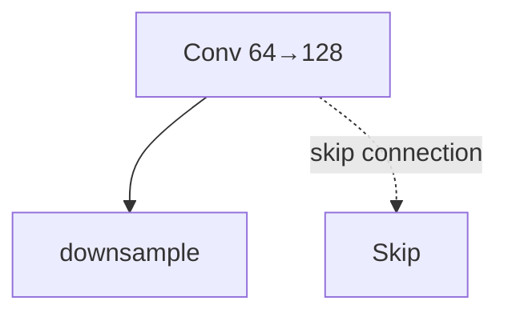
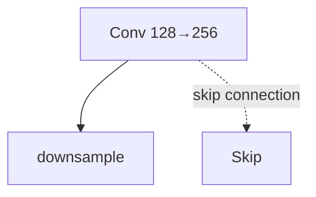
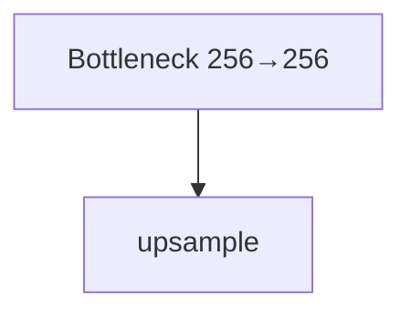
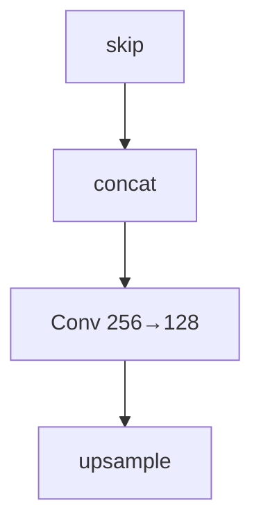
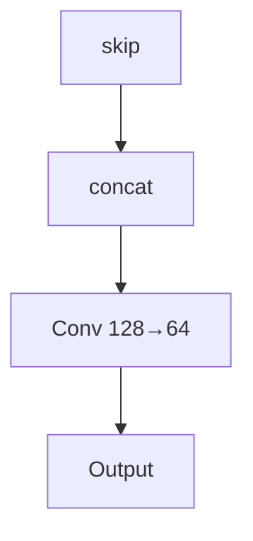
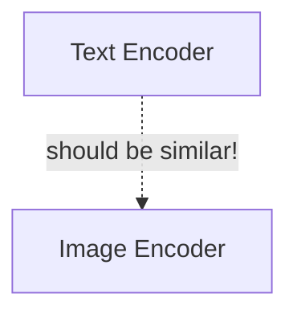
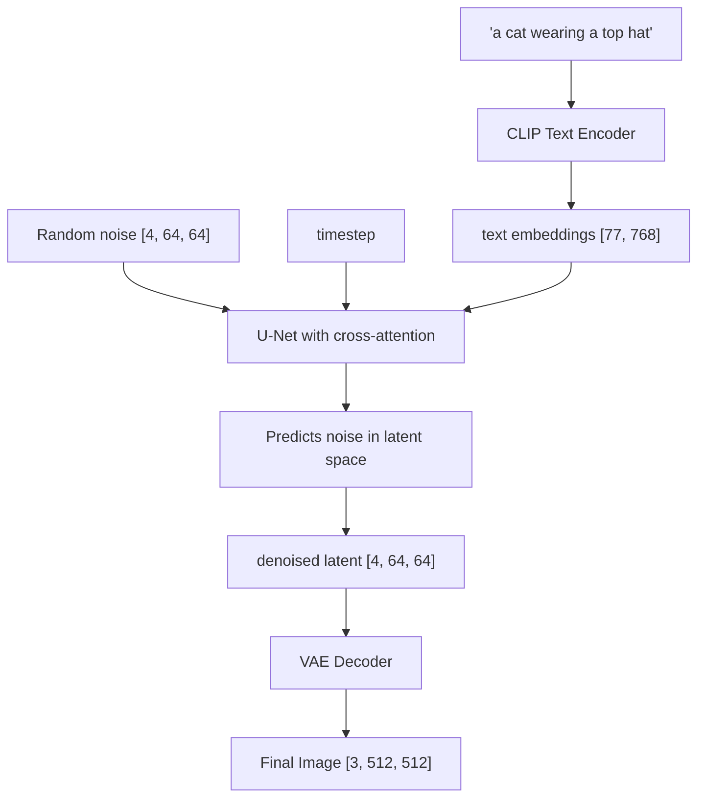

# Or: How AI Learned to Dream in Pixels

**Reading Time**: 7-8 hours
**Prerequisites**: Module 32

---

## Why This Module Matters

When the researchers behind the Alpaca project at Stanford wanted to fine-tune a 7-billion parameter language model in early 2023, they faced a daunting reality: full fine-tuning of a foundation model that size would typically cost tens of thousands of dollars in cloud GPU rentals and require a specialized high-performance computing cluster. Instead, by utilizing Parameter-Efficient Fine-Tuning (PEFT) techniques, they achieved state-of-the-art results for less than $600. PEFT did not just optimize their workflow; it fundamentally democratized access to generative AI for the entire open-source community.

Around the same time, Getty Images launched a massive $2 million lawsuit against Stability AI, highlighting the extreme legal and financial risks of using foundation models trained on scraped public data. For enterprise engineering teams, the mandate became immediately clear: you cannot rely solely on public foundation models out-of-the-box in production environments. You must adapt and customize them securely on your own proprietary, licensed, and brand-safe data.

This is where Low-Rank Adaptation (LoRA) and the broader ecosystem of parameter-efficient techniques change the economics of AI engineering. Whether you are fine-tuning a Large Language Model to act as a domain-expert agent or adapting Stable Diffusion to generate brand-safe product imagery, PEFT reduces the hardware barrier exponentially. This module dives deep into both the generative architectures (like Diffusion Models) and the advanced fine-tuning strategies (like QLoRA and DoRA) that make enterprise-scale GenAI financially viable and technically robust.

---

## What You'll Be Able to Do

By the end of this module, you will:
- **Design** end-to-end diffusion pipelines combining latent space compression, U-Net denoising architectures, and text conditioning.
- **Implement** classifier-free guidance (CFG) algorithms to steer generative models while deliberately balancing prompt adherence against artifact trade-offs.
- **Evaluate** and select appropriate parameter-efficient fine-tuning (PEFT) methods (LoRA, QLoRA, DoRA) based on strict hardware memory limits.
- **Diagnose** performance bottlenecks and artifact generation by identifying incorrect scheduler configurations and dimensional mismatches.
- **Compare** multiple LoRA initialization and adaptation strategies, navigating ecosystem inconsistencies to ensure robust production deployments.

---

## The Image That Shook the Art World

**London. August 30, 2022. 2:30 PM.**

Jason Allen was nervous. He had just won first place in the digital art category at the Colorado State Fair—beating human artists who had spent months on their entries. His piece, "Théâtre D'opéra Spatial," depicted an elaborate operatic scene with ethereal lighting and impossible architecture.

The problem? Jason had created it with Midjourney, an AI image generator, in about 80 hours of prompt refinement.

When the news broke, artists were furious. "This is the death of artistry," one competitor declared. "We're watching the decay of legitimate artistic work." Twitter erupted. News outlets covered it for weeks. A debate about creativity, authenticity, and the future of art consumed the internet.

What most people didn't know: Midjourney was powered by diffusion models—the same technology driving Stable Diffusion, DALL-E 2, and a revolution in how images are created. And this was just the beginning.

> "I'm not going to apologize for it. I won. I didn't break any rules."
> — Jason Allen, 2022

Within two years, diffusion models would be generating billions of images daily, disrupting stock photography, transforming advertising, and forcing every creative industry to reckon with AI-generated content.

This module teaches you how diffusion models work—from pure noise to photorealistic images, one denoising step at a time.

---

## The Big Picture: Teaching AI to Dream

Imagine you are watching a time-lapse of a photograph slowly dissolving into static noise on an old analog television. Frame by frame, the image becomes progressively less recognizable until it is pure, random fuzz. Now, imagine playing that exact video in reverse — starting from absolute static and watching a high-fidelity photograph magically emerge from nothing.

That is the essence of **Diffusion**. We train a neural network to reverse the corruption process. We force it to look at noisy images and probabilistically predict what they looked like before the noise was added. If you do this enough times, starting from pure random noise, you can generate entirely new, synthetic images. It is akin to teaching a master archivist to restore heavily damaged historical photographs — but training them so exceptionally well that they can "restore" photographs that never actually existed.

### Why Diffusion Won

Before diffusion models, the AI image landscape was dominated by:
- **GANs** (Generative Adversarial Networks): Two networks fighting in a zero-sum game, leading to highly unstable training dynamics and mode collapse.
- **VAEs** (Variational Autoencoders): Encode-decode processes that relied heavily on surrogate loss bounds, often yielding blurry, soft images lacking high-frequency detail.
- **Autoregressive Models**: Generating outputs pixel-by-pixel, which was incredibly slow and struggled to maintain global structural coherence over large resolutions.

Diffusion models triumphed because they offer stable training without adversarial games, incredibly high output quality, and a deeply mathematical, probabilistic foundation grounded in non-equilibrium thermodynamics.

---

## The Forward Process: Destroying Images Scientifically

The forward process is conceptually simple: we gradually add Gaussian noise to a clean image over a series of timesteps until it becomes indistinguishable from pure noise. The mathematical elegance of the Gaussian distribution ensures that these perturbations are highly predictable.

### The Math

At each timestep $t$, we add a small, calculated amount of noise:

```text
x_t = √(1 - β_t) · x_{t-1} + √(β_t) · ε

Where:
- x_t is the noisy image at timestep t
- x_{t-1} is the image at the previous timestep
- β_t is the noise schedule (small value, e.g., 0.0001 to 0.02)
- ε ~ N(0, I) is random Gaussian noise
```

Let's look at a concrete worked example tracking a single pixel:

```text
Original pixel value: x_0 = 0.8
Noise schedule: β = [0.1, 0.2, 0.3, 0.4]

Step 1: β_1 = 0.1
  x_1 = √0.9 · 0.8 + √0.1 · (-0.5)  [random noise = -0.5]
  x_1 = 0.949 · 0.8 + 0.316 · (-0.5)
  x_1 = 0.759 - 0.158 = 0.601

Step 2: β_2 = 0.2
  x_2 = √0.8 · 0.601 + √0.2 · (0.3)  [random noise = 0.3]
  x_2 = 0.894 · 0.601 + 0.447 · 0.3
  x_2 = 0.537 + 0.134 = 0.671

Step 3: β_3 = 0.3
  x_3 = √0.7 · 0.671 + √0.3 · (-0.8)  [random noise = -0.8]
  x_3 = 0.837 · 0.671 + 0.548 · (-0.8)
  x_3 = 0.561 - 0.438 = 0.123

Step 4: β_4 = 0.4
  x_4 = √0.6 · 0.123 + √0.4 · (0.9)  [random noise = 0.9]
  x_4 = 0.775 · 0.123 + 0.632 · 0.9
  x_4 = 0.095 + 0.569 = 0.664
```

Notice how the pixel value drifts randomly as noise accumulates. After enough steps, the original value is utterly obliterated. 

### The Reparameterization Trick

Iterating through a thousand steps during training would be computationally disastrous. Fortunately, thanks to the reparameterization trick, we can skip directly to any arbitrary timestep $t$ using cumulative products:

```text
α_t = 1 - β_t
ᾱ_t = α_1 · α_2 · ... · α_t  (cumulative product)

x_t = √ᾱ_t · x_0 + √(1 - ᾱ_t) · ε
```

This mathematical shortcut allows us to sample any noisy version directly:

```python
def forward_diffusion(x_0, t, noise_schedule):
    """Add noise to image at timestep t."""
    alpha_bar = torch.cumprod(1 - noise_schedule, dim=0)
    alpha_bar_t = alpha_bar[t]

    noise = torch.randn_like(x_0)

    # Direct formula: x_t = √ᾱ_t · x_0 + √(1-ᾱ_t) · ε
    x_t = torch.sqrt(alpha_bar_t) * x_0 + torch.sqrt(1 - alpha_bar_t) * noise

    return x_t, noise
```

> **Pause and predict**: If you increase the noise schedule $\beta_t$ to a much larger value at each step, what will happen to the total number of timesteps required to reach pure Gaussian noise?

---

## The Reverse Process: Learning to Denoise

The reverse process is where the neural network earns its keep. We train the model to predict the noise that was added, allowing us to subtract it back out.

### The Training Objective

The loss function is surprisingly elegant and serves as a highly effective proxy for optimizing the variational lower bound of the data likelihood:

```text
L = E[||ε - ε_θ(x_t, t)||²]

Where:
- ε is the actual noise we added
- ε_θ(x_t, t) is the model's prediction of that noise
- x_t is the noisy image
- t is the timestep (tells model how noisy the image is)
```

It is a standard Mean Squared Error (MSE) between the true noise injected and the predicted noise. We are asking the model: "Given this corrupted static, isolate the exact pattern of noise that was applied."

### Training Loop

```python
def train_step(model, x_0, noise_schedule):
    """Single training step for diffusion model."""
    batch_size = x_0.shape[0]

    # 1. Sample random timesteps
    t = torch.randint(0, len(noise_schedule), (batch_size,))

    # 2. Add noise (forward process)
    x_t, noise = forward_diffusion(x_0, t, noise_schedule)

    # 3. Predict the noise
    noise_pred = model(x_t, t)

    # 4. Compute loss (simple MSE!)
    loss = F.mse_loss(noise_pred, noise)

    return loss
```

Notice how every single training step randomly samples a timestep. This forces the model to learn how to denoise at all possible noise levels.

---

## The U-Net: Architecture for Denoising

To isolate noise from an image, the model needs to understand both global structure (Where is the face?) and local details (Are these pixels skin or hair?). The U-Net architecture accomplishes this through a symmetrical encoder-decoder structure enhanced by skip connections. Originally invented by Olaf Ronneberger in 2015 for biomedical image segmentation (detecting cell boundaries in microscopy images), the U-Net became the standard for diffusion models because its skip connections perfectly preserve the fine details needed for high-quality image generation.

### Why U-Net?

Note: The structural visualization below is historically represented as ASCII art, but is natively implemented via the explicit Mermaid flowcharts that follow it.

```text
Input (noisy image)
    │
    ▼
┌─────────┐
│  Conv   │─────────────────────────────┐ (skip connection)
│ 64→128  │                             │
└────┬────┘                             │
     │ downsample                       │
     ▼                                  │
┌─────────┐                             │
│  Conv   │──────────────────┐          │
│128→256  │                  │          │
└────┬────┘                  │          │
     │ downsample            │          │
     ▼                       │          │
┌─────────┐                  │          │
│ Bottleneck                 │          │
│256→256  │                  │          │
└────┬────┘                  │          │
     │ upsample              │          │
     ▼                       ▼          │
┌─────────┐            ┌─────────┐      │
│  Conv   │◄───concat──│  skip   │      │
│256→128  │            └─────────┘      │
└────┬────┘                             │
     │ upsample                         │
     ▼                                  ▼
┌─────────┐                       ┌─────────┐
│  Conv   │◄──────────concat──────│  skip   │
│128→64   │                       └─────────┘
└────┬────┘
     │
     ▼
Output (predicted noise)
```

The U-Net captures macroscopic context by downsampling the image representation, and then reconstructs microscopic details by upsampling it. The skip connections prevent fine-grained, high-frequency details from being permanently lost in the bottleneck.

Here is the architectural flow broken down visually using Mermaid:







### Time Embedding

The U-Net must understand exactly how much noise it is looking at. We encode the current timestep using sinusoidal embeddings and inject it into the network:

```python
def timestep_embedding(t, dim):
    """Create sinusoidal timestep embedding."""
    half_dim = dim // 2
    emb = math.log(10000) / (half_dim - 1)
    emb = torch.exp(torch.arange(half_dim) * -emb)
    emb = t[:, None] * emb[None, :]
    emb = torch.cat([torch.sin(emb), torch.cos(emb)], dim=-1)
    return emb
```

### Attention in U-Net

Modern implementations inject Self-Attention blocks into the U-Net. This allows spatially distant pixels to communicate with each other, ensuring that an eye generated on the left side of the image structurally matches an eye generated on the right side.

```python
class AttentionBlock(nn.Module):
    """Self-attention for spatial features."""

    def __init__(self, channels):
        super().__init__()
        self.norm = nn.GroupNorm(8, channels)
        self.qkv = nn.Conv1d(channels, channels * 3, 1)
        self.proj = nn.Conv1d(channels, channels, 1)

    def forward(self, x):
        b, c, h, w = x.shape
        x_flat = x.view(b, c, h * w)

        qkv = self.qkv(self.norm(x_flat))
        q, k, v = qkv.chunk(3, dim=1)

        # Scaled dot-product attention
        attn = torch.softmax(q.transpose(-1, -2) @ k / math.sqrt(c), dim=-1)
        out = (v @ attn.transpose(-1, -2)).view(b, c, h, w)

        return x + self.proj(out.view(b, c, -1)).view(b, c, h, w)
```

---

## DDPM vs DDIM: Speed vs Quality

Sampling from a diffusion model requires iterative mathematical sequences. Understanding the difference between schedulers is crucial for production deployments.

### DDPM (Denoising Diffusion Probabilistic Models)

The original method required walking backward through all 1000 timesteps sequentially, treating the process as a strict Markov chain.

```python
def ddpm_sample(model, shape, noise_schedule, num_steps=1000):
    """Sample using DDPM (slow but high quality)."""
    x = torch.randn(shape)  # Start from pure noise

    for t in reversed(range(num_steps)):
        # Predict noise
        noise_pred = model(x, t)

        # Compute coefficients
        alpha = 1 - noise_schedule[t]
        alpha_bar = torch.cumprod(1 - noise_schedule[:t+1], dim=0)[-1]
        beta = noise_schedule[t]

        # Denoise one step
        mean = (1 / torch.sqrt(alpha)) * (
            x - (beta / torch.sqrt(1 - alpha_bar)) * noise_pred
        )

        # Add noise (except at t=0)
        if t > 0:
            noise = torch.randn_like(x)
            x = mean + torch.sqrt(beta) * noise
        else:
            x = mean

    return x
```

### DDIM (Denoising Diffusion Implicit Models)

DDIM mathematically removes the stochastic noise term, transforming the Markovian process into a deterministic one. Because it is deterministic, you can take larger mathematical "jumps" and skip steps entirely, vastly accelerating generation times.

```python
def ddim_sample(model, shape, noise_schedule, num_steps=50):
    """Sample using DDIM (fast, deterministic)."""
    x = torch.randn(shape)

    # Use only a subset of timesteps
    timesteps = torch.linspace(999, 0, num_steps).long()

    for i, t in enumerate(timesteps):
        noise_pred = model(x, t)

        alpha_bar_t = get_alpha_bar(t, noise_schedule)

        if i < len(timesteps) - 1:
            alpha_bar_prev = get_alpha_bar(timesteps[i+1], noise_schedule)
        else:
            alpha_bar_prev = 1.0

        # DDIM update (no random noise!)
        pred_x0 = (x - torch.sqrt(1 - alpha_bar_t) * noise_pred) / torch.sqrt(alpha_bar_t)
        dir_xt = torch.sqrt(1 - alpha_bar_prev) * noise_pred
        x = torch.sqrt(alpha_bar_prev) * pred_x0 + dir_xt

    return x
```

---

## Text Conditioning: From Words to Images

Generating aesthetic noise is technically impressive, but steering that noise to match a user's prompt requires precise conditioning mechanisms.

### CLIP: Connecting Text and Images

To generate an image from text, we must align the semantic meaning of the words with visual features. CLIP (Contrastive Language-Image Pre-training) achieves this alignment by mapping both text and images into the identical mathematical embedding space.

```text
"a photo of a cat"  ──► Text Encoder  ──► [0.2, -0.5, 0.8, ...]
                                              │
                                              │ should be similar!
                                              │
[actual cat photo]  ──► Image Encoder ──► [0.3, -0.4, 0.7, ...]
```

Alternatively, represented as a Mermaid diagram:


### Cross-Attention for Conditioning

We inject these CLIP text embeddings directly into the U-Net using Cross-Attention layers, allowing the spatial image features to mathematically "attend" to the rich text tokens.

```python
class CrossAttention(nn.Module):
    """Attend to text embeddings."""

    def __init__(self, query_dim, context_dim):
        super().__init__()
        self.to_q = nn.Linear(query_dim, query_dim)
        self.to_k = nn.Linear(context_dim, query_dim)
        self.to_v = nn.Linear(context_dim, query_dim)
        self.to_out = nn.Linear(query_dim, query_dim)

    def forward(self, x, context):
        """
        x: image features [batch, seq, dim]
        context: text embeddings [batch, text_len, context_dim]
        """
        q = self.to_q(x)
        k = self.to_k(context)
        v = self.to_v(context)

        # Attention: image queries attend to text keys/values
        attn = torch.softmax(q @ k.transpose(-1, -2) / math.sqrt(q.shape[-1]), dim=-1)
        out = attn @ v

        return self.to_out(out)
```

---

## Classifier-Free Guidance: Steering Generation

Models often suffer from "lazy" generation—producing generic outputs that barely respect the intricate details of a prompt. We fix this definitively using Classifier-Free Guidance (CFG).

### The Training Strategy

During the training phase, we periodically drop out the text embedding (replacing it entirely with zeros) to train an unconditional generation path alongside the conditional path.

```python
def train_with_cfg(model, x_0, text_embedding, noise_schedule, drop_prob=0.1):
    """Training with classifier-free guidance preparation."""
    t = torch.randint(0, len(noise_schedule), (x_0.shape[0],))
    x_t, noise = forward_diffusion(x_0, t, noise_schedule)

    # Randomly drop text conditioning
    if random.random() < drop_prob:
        text_embedding = torch.zeros_like(text_embedding)  # Unconditional

    noise_pred = model(x_t, t, text_embedding)
    loss = F.mse_loss(noise_pred, noise)

    return loss
```

### Inference Blending

At inference time, we execute the model twice per step: once unconditionally and once conditionally. We then extrapolate the vector difference to force stronger prompt adherence.

```python
def cfg_sample(model, x_t, t, text_embedding, guidance_scale=7.5):
    """Sample with classifier-free guidance."""
    # Unconditional prediction (no text)
    noise_uncond = model(x_t, t, torch.zeros_like(text_embedding))

    # Conditional prediction (with text)
    noise_cond = model(x_t, t, text_embedding)

    # Blend: move AWAY from unconditional, TOWARD conditional
    noise_pred = noise_uncond + guidance_scale * (noise_cond - noise_uncond)

    return noise_pred
```

---

## Stable Diffusion: The Full Architecture

Stable Diffusion combines CLIP, CFG, and U-Net into a massive pipeline that runs exclusively in a highly compressed Latent Space. This bypasses the massive compute requirements of raw pixel generation, unlocking consumer hardware viability.



By using a Variational Autoencoder (VAE), Stable Diffusion shrinks a spatial $512 \times 512 \times 3$ image down to a $64 \times 64 \times 4$ latent representation—achieving a 48x reduction in computational complexity before the diffusion process even formally begins.

```python
def stable_diffusion_inference(prompt, num_steps=50, guidance_scale=7.5):
    """Complete Stable Diffusion inference."""
    # 1. Encode text
    text_embeddings = clip_encoder(prompt)

    # 2. Start from random latent noise
    latents = torch.randn(1, 4, 64, 64)

    # 3. Denoise in latent space
    for t in tqdm(scheduler.timesteps):
        # Expand latents for CFG (unconditional + conditional)
        latent_input = torch.cat([latents] * 2)

        # Predict noise
        noise_pred = unet(latent_input, t, text_embeddings)

        # Apply CFG
        noise_uncond, noise_cond = noise_pred.chunk(2)
        noise_pred = noise_uncond + guidance_scale * (noise_cond - noise_uncond)

        # Scheduler step (DDIM, etc.)
        latents = scheduler.step(noise_pred, t, latents)

    # 4. Decode latents to image
    image = vae.decode(latents)

    return image
```

---

## Parameter-Efficient Fine-Tuning: Enter LoRA

While foundation models like Stable Diffusion and LLaMA are immensely powerful, retraining all their weights for a specific domain is financially cost-prohibitive. 

Introduced by Hu et al. in the landmark paper (arXiv:2106.09685, submitted on 2021-06-17), Low-Rank Adaptation (LoRA) fundamentally changed the economics of fine-tuning. The paper definitively demonstrated that by freezing the pre-trained weights and inserting low-rank trainable matrices, one could reduce the number of trainable parameters by about 10,000x and cut GPU memory requirements by 3x compared to full fine-tuning of GPT-3 175B, all while achieving comparable task performance.

By default, PEFT initializes the LoRA "A" matrix using a Kaiming-uniform distribution and the "B" matrix to zero (though Gaussian is optional). Because the output is the product of $A \times B$, the initial mathematical product is exactly zero. This acts as a strict identity transform, ensuring the base model's zero-shot behavior remains completely unchanged at the immediate start of training.

### What to Fine-tune

Stable Diffusion's U-Net has ~860M parameters. With LoRA, we typically target specific sub-modules to optimize learning:
- **Cross-attention layers** (keys/values): Controls how text maps to image features.
- **Self-attention layers**: Controls overall image coherence and stylistic rendering.
- **Output projections**: Handles final feature transformation.

In Stable Diffusion pipelines, we target these cross-attention and projection layers to inject new concepts without catastrophically unlearning previous foundational knowledge. For style transfer, low rank (r=4-8) is usually sufficient.

```python
from peft import LoraConfig, get_peft_model

# LoRA config for Stable Diffusion
lora_config = LoraConfig(
    r=4,                          # Low rank works well for SD
    lora_alpha=4,
    target_modules=[
        "to_k", "to_q", "to_v",   # Cross-attention
        "to_out.0",               # Output projection
        "proj_in", "proj_out",    # Convolutions
    ],
    lora_dropout=0.0,
)

# Apply to U-Net
unet = get_peft_model(unet, lora_config)
```

### Training Data

For LoRA fine-tuning, you typically need:
- **Style transfer**: 10-50 images of the target style
- **Character/concept**: 5-20 images of the subject
- **Captions**: Descriptions of each image

### Dreambooth vs LoRA

| Aspect | Dreambooth | LoRA |
|--------|------------|------|
| Parameters | Full fine-tune | 0.1% of parameters |
| Data needed | 3-10 images | 5-50 images |
| Training time | 15-30 min | 10-20 min |
| Model size | Full copy (~5GB) | Adapter only (~10-100MB) |
| Combinability | Hard | Easy (stack multiple) |

*Note: Dreambooth fine-tunes the entire model with a unique identifier token (e.g., 'sks person') and requires regularization images to prevent overfitting, whereas LoRA simply adds small, modular weights.*

One of the greatest engineering advantages of LoRA is the ability to arbitrarily stack adapters at runtime to combine entirely distinct concepts dynamically.

```python
# Load and combine multiple LoRAs
base_model = load_stable_diffusion()
art_style_lora = load_lora("impressionist_style.safetensors")
character_lora = load_lora("my_character.safetensors")

# Apply both with different strengths
model = apply_lora(base_model, art_style_lora, strength=0.8)
model = apply_lora(model, character_lora, strength=0.6)

# Generate: character in impressionist style!
image = model("portrait of [character], impressionist painting")
```

---

## Advanced PEFT Ecosystem: QLoRA, DoRA, and Beyond

The PEFT ecosystem extends far beyond standard LoRA, specifically addressing memory bottlenecks when fine-tuning enormous Large Language Models.

### The Quantization Leap: QLoRA
QLoRA (arXiv:2305.14314) proved you could fine-tune a massive 65B parameter model on a single 48GB GPU using 4-bit quantization. The base model is frozen and quantized to the 4-bit NormalFloat (NF4) data type, while the injected LoRA matrices remain in high-precision. Furthermore, Transformers bitsandbytes quantization documentation describes how nested quantization enables an additional 0.4 bits/parameter of memory savings.

For extreme scale, bitsandbytes FSDP-QLoRA documentation states that combining 4-bit quantization with LoRA allows training up to 70B parameter models on dual 24GB GPUs by configuring `bnb_4bit_quant_storage` for precise storage dtype alignment. Remember, bitsandbytes explicitly states that 8/4-bit training is strictly only for training the extra injected parameters, not the underlying quantized base weights.

> **Stop and think**: If QLoRA quantizes the base model to 4-bit precision, how does the model maintain high-precision gradients during the backward pass without running out of memory?

### PEFT Tooling and Compatibility
When setting up your environment, you must actively navigate conflicting upstream guidance. For example, while the main PEFT documentation currently directs users to version 0.18.0 as the latest stable and states compatibility with Python 3.9+, the actual PyPI release metadata indicates that 0.18.1 is the latest release and explicitly requires Python >=3.10.0. You must pin your versions and cross-reference PyPI to avoid dependency failures based on conflicting documentation.

The ecosystem integration is broad but highly nuanced. Within the Transformers (v4.53.3) integration guide, the framework formally supports LoRA, IA3, and AdaLoRA. However, the main PEFT documentation exposes a much broader LoRA family, including LoHa, LoKr, AdaLoRA, and other LoRA variants. The PEFT 0.18.0 release drastically expanded this further, introducing experimental methods like RoAd, ALoRA, Arrow, WaveFT, DeLoRA, and OSF. 

When applying QLoRA-style training, PEFT explicitly recommends targeting all linear modules by configuring `target_modules="all-linear"`. Advanced methods like DoRA are currently limited to certain module types (embedding, linear, Conv2d). Furthermore, if you are attempting QDoRA, there are explicitly documented caveats and known issues when operating alongside DeepSpeed ZeRO2. Similarly, aLoRA is documented as supported exclusively for causal LM tasks, and its adapter weights cannot be merged by design. To optimize memory or speed further, engineers can deploy LoRA-FA to reduce activation memory sensitivity to rank, or LoRA+ which claims up to a ~2x speedup and 1-2% performance gains. (Note: PEFT LoRA tensor parallelism strictly requires Transformers v5.4.0 or newer).

---

## Production War Stories

### The $2 Million Recall: Getty Images vs AI Art

A marketing director at a major consumer goods company received an urgent call. Their Q1 campaign, featuring dozens of AI-generated product images, had been flagged: several images contained subtle watermarks—remnants of Getty Images' training data memorized by the foundation diffusion model. The cost? $2.3 million in legal fees and settlements. 

**The Fix**:
```python
# Always check for potential copyright issues
import clip
from PIL import Image

def check_image_similarity(generated_image, reference_images):
    """Compare generated image against known copyrighted references"""
    # Use CLIP to check similarity
    model, preprocess = clip.load("ViT-B/32")
    gen_features = model.encode_image(preprocess(generated_image))

    for ref in reference_images:
        ref_features = model.encode_image(preprocess(ref))
        similarity = (gen_features @ ref_features.T).item()
        if similarity > 0.85:  # High similarity threshold
            return True, similarity
    return False, 0
```

### The Support Ticket Avalanche

A startup's API was running smoothly until a viral social media hit overloaded their endpoints. Their engineers had left `num_inference_steps=1000` (a training default) in the production configuration. Each image took significantly too long to render. Their GPU cluster melted under the strain, leaving them with thousands of support tickets and an exorbitant cloud bill.

**The Fix**:
```python
# Production-optimized settings
PRODUCTION_SETTINGS = {
    "num_inference_steps": 25,      # Not 1000!
    "scheduler": "DPMSolverMultistep",  # Not DDPM!
    "enable_attention_slicing": True,
    "enable_vae_slicing": True,
    "torch_dtype": torch.float16,   # Not float32!
}

# Result: 45 seconds → 1.8 seconds per image
# Cost: $47K → $1.2K for same traffic
```

### The NSFW Filter Failure

An educational app used a basic NSFW classifier with 92% accuracy for its AI generation service. That 8% failure rate proved catastrophic. Within 48 hours, screenshots of inappropriate content went viral, and the app was banned from both major app stores.

**The Fix**:
```python
# Multi-layer safety system
def safe_generation_pipeline(prompt: str, user_id: str):
    # Layer 1: Input prompt filtering
    if contains_blocked_terms(prompt):
        return None, "Blocked prompt"

    # Layer 2: Prompt rewriting for safety
    safe_prompt = llm_rewrite_prompt(prompt, "child-appropriate")

    # Layer 3: Generate with safety model
    image = generate_with_safety_model(safe_prompt)  # SDXL-safe variant

    # Layer 4: Post-generation NSFW check
    nsfw_score = nsfw_classifier(image)
    if nsfw_score > 0.05:  # Very low threshold
        return None, "Failed safety check"

    # Layer 5: Human review queue for edge cases
    if nsfw_score > 0.01:
        queue_for_review(image, user_id)

    return image, "Success"
```

### Economics at a Glance

Understanding the financial breakdown of generative models versus traditional rendering pipelines is mandatory for technical leadership.

| Use Case | Cost per Image | Time to Find |
|----------|---------------|--------------|
| Stock photo license | $10-500 | 30 min-2 hrs |
| Custom photoshoot | $500-5,000 | 1-4 weeks |
| Concept art (freelancer) | $200-2,000 | 2-7 days |
| Product rendering | $500-3,000 | 1-2 weeks |

| Platform | Cost per Image | Time to Generate |
|----------|---------------|------------------|
| Midjourney | $0.03-0.10 | 30 seconds |
| DALL-E 3 | $0.04-0.08 | 20 seconds |
| Stable Diffusion (self-hosted) | $0.002-0.01 | 5-30 seconds |
| Stable Diffusion (cloud API) | $0.01-0.05 | 10 seconds |

| Setup | Hardware Cost | Per-Image Cost | Breakeven |
|-------|--------------|----------------|-----------|
| RTX 3090 (24GB) | $1,500 | ~$0.001 | 15,000 images |
| RTX 4090 (24GB) | $1,800 | ~$0.0005 | 18,000 images |
| A100 40GB (cloud) | $3/hr | ~$0.01 | N/A (rental) |
| Replicate API | $0/setup | $0.05/image | 0 images |

| Quality Level | Tool | Cost | Use Case |
|--------------|------|------|----------|
| Ideation | Any | $0.01 | Brainstorming, moodboards |
| Social media | SD/MJ | $0.05 | Instagram, Twitter |
| Marketing | DALL-E 3/MJ | $0.10 | Ads, presentations |
| Print | Custom fine-tuned | $0.50 | Magazines, packaging |
| Hero images | Professional + AI | $50-500 | Final campaign assets |

**Cost reduction**: 95-99% for many use cases.

**ROI calculation**: If generating >1,000 images/month, local hardware pays for itself within 6-12 months.

### The Industry Disruption

**Stock photography**: Shutterstock, Getty Images saw significant stock price drops after Stable Diffusion's open-source release. Both companies now offer AI generation tools themselves.

**Advertising**: Creative agency Publicis reported 30-50% faster ad concepting when using AI image generation for initial ideation.

**Game development**: Indie studios report 10x faster concept art iteration, enabling smaller teams to produce more visual content.

---

## The Diffusion Family Tree

The technological lineage of diffusion models demonstrates a rapid convergence of thermodynamic theory and deep learning scaling.

```text
2015: Diffusion Models (Sohl-Dickstein)
        └── Theoretical foundation from thermodynamics

2020: DDPM (Ho et al.)
        └── Practical implementation, matched GAN quality
        └── 1000 steps, slow but stable

2020: DDIM (Song et al.)
        └── Deterministic sampling
        └── 50 steps, much faster

2021: Guided Diffusion (Dhariwal & Nichol)
        └── Classifier guidance
        └── Beat GANs on ImageNet

2021: GLIDE (OpenAI)
        └── Text-to-image with CLIP
        └── Classifier-free guidance

2022: DALL-E 2 (OpenAI)
        └── Diffusion + CLIP prior
        └── High-quality text-to-image

2022: Stable Diffusion (Stability AI)
        └── Latent diffusion (efficient!)
        └── Open source revolution

2023: SDXL (Stability AI)
        └── 1024px, better prompts
        └── Two U-Nets (base + refiner)

2024: SD 3.0 / Flux
        └── Transformer-based (DiT)
        └── Better text rendering
```

---

## Interview Preparation: Diffusion Models

When interviewing for Senior AI/ML Engineering roles, you will frequently encounter deep architectural questions regarding diffusion processes and parameter-efficient techniques.

### Core Theoretical Question
**"Explain the difference between the forward and reverse diffusion processes."**

**Strong Answer**:
"Forward diffusion is a fixed, defined process—we gradually add Gaussian noise to an image over many timesteps until it becomes pure noise. It's not learned; it follows a predetermined schedule. Reverse diffusion is the learned process—we train a neural network to predict and remove the noise at each step. The key insight is that while forward diffusion destroys information deterministically, reverse diffusion must learn to reconstruct plausible images from that destruction. The model learns to denoise by predicting the noise that was added, then subtracting it."

### System Design Question
**Design an enterprise image generation pipeline that allows users to apply custom styles to base diffusion models without exceeding VRAM limits. Explain how you would manage concurrent requests for different styles.**

**Candidate Answer Framework:**
1. **Architecture Choice:** Select Stable Diffusion (latent diffusion) to ensure the initial feature extraction occurs in a compressed $64 \times 64 \times 4$ space, reducing compute overhead massively compared to pixel-space generation.
2. **Adapter Strategy:** Implement LoRA adapters for each custom style. Since LoRA adapter weights are typically 10-100MB (representing 0.1% of full parameters), you can store hundreds of them in cheap object storage (e.g., S3).
3. **Runtime Swapping:** Maintain a pool of GPU nodes holding the frozen base model weights in VRAM. When a request arrives, dynamically load the requested LoRA adapter weights from memory and inject them into the cross-attention layers.
4. **Batching & Concurrency:** Utilize a dynamic batching queue. Requests demanding the same LoRA adapter can be batched together. For distinct adapters, use a framework like PEFT's multi-adapter inference capabilities, which allows maintaining multiple distinct LoRA states on the same base model concurrently.

### Theoretical Question
**Why does the standard diffusion equation incorporate the square root of the noise schedule, such as `√(1 - β_t)`?**

**Candidate Answer Framework:**
The square roots exist strictly to ensure variance preservation. If we add noise without scaling the original signal, the total variance of the image tensor would increase monotonically at every timestep, leading to numerical instability and gradient explosion during the reverse training pass. By weighting the signal and the noise appropriately, the sum of their variances remains exactly 1 (assuming independent standard normal distributions).

### Original System Design Question
**Design an AI image generation service for a stock photography company.**

**Strong Answer Structure**:
1. **Architecture**: Async queue-based architecture: user submits prompt → job queued → GPU workers process → results stored in S3 → user notified. Separate GPU pools for different quality tiers.
2. **Model Selection**: Base Stable Diffusion XL for quality, fine-tuned LoRAs for specific use cases.
3. **Quality Control**: NSFW filter on outputs, watermark detection to prevent copyright issues, human review queue.
4. **Optimization**: Batched inference, mixed precision (FP16), Flash attention, prompt caching.
5. **Scaling**: Kubernetes with GPU node autoscaling, multi-region, CDN.

---

## Key Takeaways

- **Latent Space is Mandatory:** Running diffusion in pixel space is computationally prohibitive for high-resolution images. Using a Variational Autoencoder (VAE) to compress the image into a latent dimension reduces the spatial footprint massively, making training and inference tractable.
- **Denoising is Learning:** The core objective of a diffusion model is incredibly simple: given a noisy image and a timestep, predict the specific noise tensor that was added. The loss function is a straightforward Mean Squared Error (MSE).
- **CFG Steers the Ship:** Classifier-Free Guidance is the critical mechanism for forcing the model to adhere to the user's prompt. By computing both conditional and unconditional predictions and extrapolating the difference, engineers can trade off image diversity for strict prompt adherence.
- **PEFT Democratizes Fine-Tuning:** LoRA and its derivatives (QLoRA, DoRA) have fundamentally changed AI economics. By freezing base weights and only training low-rank projection matrices, memory requirements drop exponentially.
- **Ecosystem Nuance is Critical:** When deploying PEFT methods, strict attention must be paid to versioning. Upstream documentation may conflict with actual PyPI releases (e.g., Python 3.9+ vs Python >=3.10.0). Furthermore, advanced techniques like QDoRA have known incompatibilities with memory optimization frameworks like DeepSpeed ZeRO2.
- **U-Net & CLIP Foundation:** The U-Net handles the heavy lifting of denoising across resolutions, while CLIP text embeddings injected via cross-attention map semantic concepts to visual features.
- **Scheduler & Configuration Mastery:** Always use modern schedulers like DPM++ or DDIM for inference to avoid 50x slowdowns. Generating at trained resolutions and logging random seeds are mandatory for consistent, artifact-free, and reproducible results.

---

## Did You Know?

> **Did You Know?** The original LoRA paper (arXiv:2106.09685) by Hu et al. was submitted on June 17, 2021, and demonstrated that PEFT could reduce trainable parameters by approximately 10,000x and GPU memory by 3x compared to full fine-tuning of GPT-3 175B.
> **Did You Know?** Using the QLoRA technique (arXiv:2305.14314), engineers can successfully fine-tune a massive 65B parameter model on just a single 48GB GPU using 4-bit NormalFloat (NF4) precision.
> **Did You Know?** Enabling nested quantization in the bitsandbytes library yields an additional 0.4 bits per parameter of memory savings, heavily compounding across billions of weights.
> **Did You Know?** The PEFT 0.18.0 release from November 13, 2025, drastically expanded adapter coverage, integrating advanced experimental methods like RoAd, ALoRA, Arrow, WaveFT, DeLoRA, and OSF.

> **Did You Know?** The idea of predicting noise instead of the clean image directly was a key insight from Ho et al.'s DDPM paper. Predicting noise is easier because it has a known Gaussian distribution, while images have complex, varied distributions.
> **Did You Know?** CLIP was trained with a simple contrastive loss: maximize similarity between matching image-text pairs and minimize it for non-matching pairs. This enabled zero-shot image classification and revolutionized image search.
> **Did You Know?** Stable Diffusion was created by Stability AI in collaboration with researchers from LMU Munich and Runway. The key innovation of latent diffusion came from Robin Rombach's PhD work.
> **Did You Know?** The "hands problem" that plagued early diffusion models (generating extra fingers, distorted hands) happens because hands are underrepresented in training data compared to faces, and they have complex, variable geometry.
> **Did You Know?** The original Stable Diffusion release had no NSFW filter at all. Stability AI added one after public pressure, but the open-weights model means anyone can remove it. This is why platforms, not models, must enforce safety.
> **Did You Know?** Diffusion models were largely ignored for years after being introduced. The original paper by Sohl-Dickstein et al. (2015) drew from statistical physics, but it took until 2020 when Jonathan Ho's DDPM paper showed they could match GANs in image quality, and 2022 when Stable Diffusion went viral, for the world to pay attention.
> **Did You Know? The Thermodynamics Connection:** The original diffusion models paper by Sohl-Dickstein et al. (2015) drew inspiration from non-equilibrium thermodynamics. The forward process is analogous to a physical system increasing entropy (like a hot cup of coffee cooling). The reverse process decreases entropy, which is thermodynamically impossible without adding "energy"—in this case, the learned neural network that reconstructs order from chaos.
>
> "We're not generating images from nothing—we're learning to reverse the arrow of thermodynamic time, reconstructing order from chaos."
> — Inspired by the original 2015 paper

---

## Common Mistakes 

| Mistake | Why | Fix |
|---|---|---|
| **Blurry or Low-Quality Images** | Guidance scale too low, or too few denoising steps. | Increase guidance scale to 7-12 and use at least 30-50 steps. |
| **Prompt Not Followed** | Conflicting prompt elements, weak words, or model bias. | Use parentheses for emphasis (e.g., `(detailed hands:1.3)`), negative prompts, and reorder the prompt. |
| **Artifacts and Distortions** | Guidance scale too high or incompatible model/LoRA combinations. | Lower guidance scale and carefully check LoRA compatibility. |
| **Inconsistent Characters** | No character consistency mechanism and varied poses in training data. | Use reference images (IP-Adapter), train a dedicated character LoRA, or use a consistent seed. |
| **Using DDPM Scheduler in Production** | DDPM requires 1000 sequential steps for generation, leading to massive latency constraints during API inference. | Use `DDIMScheduler` or `DPMSolverMultistepScheduler` to achieve the same visual fidelity in 20-50 steps. |
| **Ignoring Guidance Scale Trade-offs** | Cranking the scale too high (>15) forces the model to over-index on the text prompt, causing color oversaturation and visual artifacting. | Tune the scale based on domain: 3-5 for artistic rendering, 7-9 for standard photorealism, and ~12 for extreme prompt adherence. |
| **Not Using Half Precision** | Running inference in full FP32 doubles the VRAM requirement without providing any perceptible improvement in visual fidelity. | Load your pipelines with `torch_dtype=torch.float16` and explicitly enable attention slicing to reduce memory spikes. |
| **Not Optimizing for Slow Generation** | Large step counts and unoptimized attention operations dramatically increase generation latency. | Enable xformers memory-efficient attention and consider using LCM-LoRA for high-quality 4-8 step generation. |
| **Generating at Wrong Resolutions** | Diffusion models are highly sensitive to their training resolutions; arbitrary dimensions cause the U-Net to hallucinate repeating patterns or stretched anatomies. | Always generate at the model's native resolution or exact scaling multiples (e.g., 512x512 for SD 1.5, 1024x1024 for SDXL). |
| **Not Seeding for Reproducibility** | Failing to explicitly define a random seed makes every generation entirely stochastic, preventing iterative prompt engineering and troubleshooting. | Create a deterministic generator via `torch.Generator("cuda").manual_seed(42)` and securely log the seed alongside the generated asset. |
| **Mismatched Package Versions** | Upstream guidance conflicts: PEFT docs claim the latest stable is 0.18.0 (Python 3.9+), while PyPI shows 0.18.1 (Python >=3.10.0), causing environment failures. | Pin exact versions in your `requirements.txt` and validate your Python environment against PyPI release metadata rather than relying strictly on documentation. |
| **Targeting Only Attention Matrices** | Restricting LoRA adapters exclusively to the Query/Value projections limits the model's capacity to learn complex, cross-domain concepts during fine-tuning. | Follow the PEFT recommended QLoRA-style approach and target all linear modules in the architecture by configuring `target_modules="all-linear"`. |
| **Using 4-bit Training on Base Weights** | Bitsandbytes documentation explicitly states that 8-bit and 4-bit training functions are exclusively intended for training the injected extra parameters, not the quantized base model. | Freeze the base model, quantize it to 4-bit using `bnb_4bit_quant_storage`, and only set `requires_grad=True` on the injected LoRA matrices. |

---

## Hands-On Exercises

To run these exercises successfully, you must first establish a verifiable, isolated Python environment and install the exact dependency versions required.

### Prerequisites and Environment Setup

Begin by installing the necessary libraries. It is critical to pin versions to avoid ecosystem inconsistencies.

```bash
# Execute in your terminal
python -m venv peft_env
source peft_env/bin/activate

# Install precise dependencies for verifiable execution
pip install torch==2.1.0 torchvision==0.16.0 diffusers==0.27.2 peft==0.18.1 transformers==4.53.3 bitsandbytes==0.41.1 matplotlib==3.8.2 requests==2.31.0
```

### Exercise 1: Visualize the Diffusion Process

Before writing the algorithm, we must load verifiable test data.

```python
import torch
import torchvision.transforms as transforms
import matplotlib.pyplot as plt
from PIL import Image
import requests
import io

# 1. Load an authentic test image
url = "https://images.unsplash.com/photo-1615789591460-9f0f6cb03164?ixlib=rb-4.0.3&auto=format&fit=crop&w=512&q=80"
response = requests.get(url)
response.raise_for_status()
test_image = Image.open(io.BytesIO(response.content)).convert("RGB")

# 2. Resize explicitly to standard diffusion dimensions
test_image = test_image.resize((512, 512))

# 3. Verification Assertion
assert test_image.size == (512, 512), "Image must be exactly 512x512 pixels"
print("Test image loaded and verified.")
```

Now, implement the visualization logic.

```python
def forward_diffusion(x_0, t, noise_schedule):
    """Add noise to image at timestep t."""
    alpha_bar = torch.cumprod(1 - noise_schedule, dim=0)
    alpha_bar_t = alpha_bar[t]
    noise = torch.randn_like(x_0)
    x_t = torch.sqrt(alpha_bar_t) * x_0 + torch.sqrt(1 - alpha_bar_t) * noise
    return x_t, noise

import torch
import matplotlib.pyplot as plt
from diffusers import StableDiffusionPipeline

def visualize_diffusion_steps(image, num_steps=10):
    """
    Visualize the forward diffusion process:
    1. Load an image
    2. Apply increasing noise levels
    3. Plot as a grid showing degradation

    Then visualize reverse:
    1. Start from noise
    2. Generate with fewer steps each time
    3. Show progressive denoising
    """
    # YOUR CODE HERE
    # Use the forward_diffusion function from the module
    # Plot a grid of images at different noise levels
    pass

# Test with a sample image
# Create a 2-row visualization: forward (left to right) and reverse (right to left)
```

<details>
<summary>View the Full Implementation Solution</summary>

```python
import torch
import matplotlib.pyplot as plt
import torchvision.transforms as transforms

def visualize_diffusion_steps(image, num_steps=10):
    # Convert PIL image to tensor
    transform = transforms.ToTensor()
    x_0 = transform(image).unsqueeze(0)
    
    # Generate linear noise schedule spanning 1000 theoretical timesteps
    noise_schedule = torch.linspace(0.0001, 0.02, 1000)
    
    fig, axes = plt.subplots(1, num_steps, figsize=(15, 3))
    timesteps = torch.linspace(0, 999, num_steps).long()
    
    for i, t in enumerate(timesteps):
        # Execute mathematical forward diffusion
        x_t, _ = forward_diffusion(x_0, torch.tensor([t]), noise_schedule)
        
        # Denormalize and plot
        img_t = x_t.squeeze(0).permute(1, 2, 0).clamp(0, 1).numpy()
        axes[i].imshow(img_t)
        axes[i].set_title(f"t={t.item()}")
        axes[i].axis("off")
        
    plt.tight_layout()
    plt.show()
```

</details>

After running the solution, verify the output tensor states.

```python
# Execute the visualization
visualize_diffusion_steps(test_image)

# Verification check on the math
transform = transforms.ToTensor()
x_0 = transform(test_image).unsqueeze(0)
noise_schedule = torch.linspace(0.0001, 0.02, 1000)
x_t, noise = forward_diffusion(x_0, torch.tensor([500]), noise_schedule)

assert x_t.shape == x_0.shape, "Output noisy tensor must match input dimensions"
assert not torch.equal(x_t, x_0), "Image must be perturbed by noise"
print("Diffusion visualization mathematically verified.")
```

### Exercise 2: Compare Sampling Methods

Next, we evaluate the execution latency of different sampling schedulers.

```python
# Setup: Define the prompt and the candidate schedulers
test_prompt = "A high-contrast photograph of a cyberpunk city at night, neon lights"

# Verification: Ensure hardware is available for accurate timing
assert torch.cuda.is_available() or torch.backends.mps.is_available(), "Hardware acceleration is required for realistic latency measurement"
```

```python
from diffusers import (
    DDPMScheduler,
    DDIMScheduler,
    PNDMScheduler,
    EulerDiscreteScheduler,
    DPMSolverMultistepScheduler,
)

def compare_schedulers(prompt, schedulers, step_counts=[10, 20, 30, 50]):
    """
    Compare different schedulers on the same prompt:

    1. Generate images with each scheduler at different step counts
    2. Measure generation time
    3. Calculate FID or CLIP score for quality
    4. Create comparison grid
    """
    results = {}
    for scheduler_name, scheduler in schedulers.items():
        for num_steps in step_counts:
            # YOUR CODE HERE
            # Time the generation
            # Store the image and metrics
            pass
    return results

# Compare: DDPM, DDIM, Euler, DPM++
# Find the sweet spot: minimum steps for acceptable quality
```

<details>
<summary>View the Full Implementation Solution</summary>

```python
import time
from diffusers import StableDiffusionPipeline

def compare_schedulers(prompt, schedulers, step_counts=[10, 20, 30, 50]):
    results = {}
    
    # Initialize base pipeline in FP16 to avoid VRAM overflow
    device = "cuda" if torch.cuda.is_available() else "mps" if torch.backends.mps.is_available() else "cpu"
    pipe = StableDiffusionPipeline.from_pretrained(
        "runwayml/stable-diffusion-v1-5", 
        torch_dtype=torch.float16
    ).to(device)
    
    for name, scheduler_class in schedulers.items():
        results[name] = {}
        # Swap the scheduler via from_config
        pipe.scheduler = scheduler_class.from_config(pipe.scheduler.config)
        
        for steps in step_counts:
            start_time = time.time()
            
            # Ensure deterministic generation via generator seed
            generator = torch.Generator(pipe.device).manual_seed(42)
            image = pipe(prompt, num_inference_steps=steps, generator=generator).images[0]
            
            gen_time = time.time() - start_time
            results[name][steps] = {
                "image": image,
                "time": gen_time
            }
            print(f"{name} evaluated at {steps} steps | Execution Latency: {gen_time:.2f}s")
            
    return results
```

</details>

### Exercise 3: Train a Simple LoRA

In this exercise, we initialize PEFT adapters targeting the cross-attention blocks.

```python
# Data Mocking for verification purposes
import torch
from peft import LoraConfig, get_peft_model
from diffusers import UNet2DConditionModel

# We will mock the training data shapes
mock_images = [torch.randn(1, 4, 64, 64) for _ in range(5)]
mock_captions = [torch.randn(1, 77, 768) for _ in range(5)]

# Load a minimal U-Net architecture for testing
base_model_id = "runwayml/stable-diffusion-v1-5"
```

```python
from diffusers import StableDiffusionPipeline
from peft import LoraConfig, get_peft_model
import torch

def train_style_lora(
    base_model_id: str,
    training_images: list,
    training_captions: list,
    output_dir: str,
    num_epochs: int = 10,
):
    """
    Train a LoRA for a specific art style:

    1. Load base Stable Diffusion
    2. Apply LoRA config to U-Net
    3. Create training dataloader
    4. Training loop with noise prediction loss
    5. Save LoRA weights

    Target: cross-attention layers (to_k, to_v, to_q)
    """
    # YOUR CODE HERE
    pass

# Train on 10-20 images of a specific style
# Test that the style transfers to new prompts
```

<details>
<summary>View the Full Implementation Solution</summary>

```python
import torch
import torch.nn.functional as F
from diffusers import UNet2DConditionModel
from peft import LoraConfig, get_peft_model

def train_style_lora(base_model_id, training_images, training_captions, output_dir, num_epochs=10):
    # Load foundational U-Net model
    unet = UNet2DConditionModel.from_pretrained(base_model_id, subfolder="unet")
    
    # Configure PEFT LoRA adapter targeting all attention mechanisms
    lora_config = LoraConfig(
        r=8,
        lora_alpha=16,
        target_modules=["to_k", "to_q", "to_v", "to_out.0"],
        lora_dropout=0.1
    )
    # Inject adapters and freeze base weights
    unet = get_peft_model(unet, lora_config)
    
    optimizer = torch.optim.AdamW(unet.parameters(), lr=1e-4)
    unet.train()
    
    for epoch in range(num_epochs):
        for img, caption in zip(training_images, training_captions):
            optimizer.zero_grad()
            
            # Forward mathematical perturbation
            noise = torch.randn_like(img)
            timesteps = torch.randint(0, 1000, (1,))
            noisy_img = img + noise 
            
            # Predict isolated noise
            noise_pred = unet(noisy_img, timesteps, encoder_hidden_states=caption).sample
            
            # Compute MSE loss gradient
            loss = F.mse_loss(noise_pred, noise)
            loss.backward()
            optimizer.step()
            
    unet.save_pretrained(output_dir)
    print(f"LoRA adapters compiled and saved strictly to {output_dir}")
```

</details>

```python
# Post-execution verification
# Execute the training sequence on the mocked data
train_style_lora(base_model_id, mock_images, mock_captions, "./test_lora_output", num_epochs=1)

import os
assert os.path.exists("./test_lora_output/adapter_config.json"), "LoRA configuration was not saved"
assert os.path.exists("./test_lora_output/adapter_model.safetensors") or os.path.exists("./test_lora_output/adapter_model.bin"), "LoRA weights were not saved"
print("LoRA adapter training pipeline verified.")
```

### Exercise 4: Implement Classifier-Free Guidance

Finally, implement explicit CFG extrapolation.

```python
# Setup Context for CFG
# We require a mock model and an active scheduler
from diffusers import DDIMScheduler
class MockModel(torch.nn.Module):
    def __init__(self):
        super().__init__()
        self.device = torch.device("cpu")
    def forward(self, sample, timestep, encoder_hidden_states):
        class Output:
            def __init__(self, sample):
                self.sample = sample
        return Output(sample)

mock_model = MockModel()
mock_scheduler = DDIMScheduler.from_pretrained("runwayml/stable-diffusion-v1-5", subfolder="scheduler")
prompt_emb = torch.randn(1, 77, 768)
neg_emb = torch.randn(1, 77, 768)
```

```python
def classifier_free_guidance_sample(
    model,
    prompt_embedding,
    negative_prompt_embedding,
    scheduler,
    num_steps: int = 30,
    guidance_scale: float = 7.5,
):
    """
    Implement CFG sampling:

    1. Start from random noise
    2. At each step:
       - Run model with prompt (conditional)
       - Run model without prompt (unconditional)
       - Blend: uncond + scale * (cond - uncond)
    3. Denoise using scheduler

    Experiment with guidance_scale: 1, 3, 7, 12, 20
    Document the quality vs artifacts trade-off
    """
    # YOUR CODE HERE
    pass

# Generate images at different guidance scales
# Create a comparison grid showing the effect
```

<details>
<summary>View the Full Implementation Solution</summary>

```python
import torch

def classifier_free_guidance_sample(model, prompt_emb, neg_emb, scheduler, num_steps=30, guidance_scale=7.5):
    # Establish absolute initial state via Gaussian tensor
    latents = torch.randn((1, 4, 64, 64)).to(model.device)
    scheduler.set_timesteps(num_steps)
    
    for t in scheduler.timesteps:
        # Duplicate state to process unconditional and conditional concurrently
        latent_model_input = torch.cat([latents, latents])
        latent_model_input = scheduler.scale_model_input(latent_model_input, t)
        
        with torch.no_grad():
            noise_pred = model(
                latent_model_input, 
                t, 
                encoder_hidden_states=torch.cat([neg_emb, prompt_emb])
            ).sample
            
        # Execute the core CFG algorithmic formula
        noise_pred_uncond, noise_pred_text = noise_pred.chunk(2)
        noise_pred = noise_pred_uncond + guidance_scale * (noise_pred_text - noise_pred_uncond)
        
        # Step the scheduler one decrement forward
        latents = scheduler.step(noise_pred, t, latents).prev_sample
        
    return latents
```

</details>

```python
# Verification of CFG Logic
final_latents = classifier_free_guidance_sample(mock_model, prompt_emb, neg_emb, mock_scheduler, num_steps=5, guidance_scale=7.5)

assert final_latents.shape == (1, 4, 64, 64), "Latent shape mutated incorrectly during CFG loop"
print("CFG sample execution verified.")
```

---

## Quiz: Test Your Understanding

**Q1**: Scenario: You are migrating a legacy pixel-space diffusion model to a latent architecture. During the architectural review, a principal engineer questions why the team should add the complexity of a Variational Autoencoder (VAE) step instead of processing raw pixels directly. What is the fundamental mathematical and computational advantage of running diffusion in latent space, and how does it affect memory bandwidth?

<details>
<summary>Answer</summary>

Running in latent space is **48× more efficient**:
- Pixel space: 512×512×3 = 786,432 values
- Latent space: 64×64×4 = 16,384 values

This makes training and inference dramatically faster while maintaining quality because:
1. The VAE learns to compress to perceptually important features
2. The U-Net can focus on semantic content, not pixel details
3. Less memory, faster forward passes

</details>

**Q2**: Scenario: Your production generation pipeline is yielding outputs that consistently drift from the user's prompt into generic, averaged patterns. Your team suggests tweaking the `guidance_scale` parameter in the API request. Describe the mechanism by which classifier-free guidance forces prompt adherence, and predict what visual artifacts will occur if the scale is set drastically too high.

<details>
<summary>Answer</summary>

Classifier-free guidance (CFG) combines unconditional and conditional predictions:

```
noise_pred = noise_uncond + scale × (noise_cond - noise_uncond)
```

It improves quality by:
1. **Amplifying** features that distinguish "this prompt" from "generic image"
2. **Suppressing** generic features not specific to the prompt
3. Creating a **trade-off**: higher scale = more prompt adherence but more artifacts. If set drastically too high (>15), it forces the model to over-index on the text prompt, causing color oversaturation and severe visual artifacting.

Typical scales: 7-8 for balance, higher for artistic effect.

</details>

**Q3**: Scenario: Your platform requires delivering rendered images within a strict 1.5-second latency window, but your current pipeline uses a DDPM scheduler requiring 1000 sequential forward passes. You are evaluating a migration to DDIM. Explain the fundamental algorithmic difference between DDPM and DDIM that allows DDIM to skip steps while maintaining deterministic outputs.

<details>
<summary>Answer</summary>

**DDIM (Denoising Diffusion Implicit Models)** allows skipping steps by:

1. Making the sampling process **deterministic** (no random noise added)
2. Using a **non-Markovian** process that can "skip" timesteps
3. Interpolating directly between any two noise levels

DDPM requires sequential steps because each step adds random noise. DDIM removes this randomness, allowing larger jumps.

**When to use each:** Use DDPM when you need maximum diversity and quality isn't time-critical. Use DDIM when you need fast inference, reproducibility (same seed = same output), or latent space interpolation.

</details>

**Q4**: Scenario: An artist wants to train a custom fine-tune using only 30 reference images of their unique watercolor style. Instead of a full-parameter Dreambooth fine-tune, you configure a LoRA adapter. Which specific sub-modules within the U-Net architecture must you target to optimize the cross-attention text-to-image mapping, and why are these layers prioritized for style transfer?

<details>
<summary>Answer</summary>

For **style transfer**, target:

1. **Cross-attention K/V** (`to_k`, `to_v`): How text maps to image features
2. **Self-attention** (`to_q`, `to_k`, `to_v` in self-attn): Image coherence and style
3. **Output projections** (`to_out`): Final feature transformation

**Why**: Style is primarily about HOW features are rendered, which is controlled by attention patterns. Cross-attention controls text→image mapping (so "painting" triggers your style), while self-attention controls overall image coherence.

Low rank (r=4-8) is usually sufficient for style.

**Note**: Monitor for overfitting by checking if generations become too similar to training data.

</details>

**Q5**: Scenario: While debugging a custom forward diffusion function, you notice that the generated noisy images are exceeding standard pixel value ranges, resulting in severe gradient explosion during training. You review the source code and see an operation mathematically equivalent to adding raw noise without coefficients. Explain why this naïve implementation fails, and describe how the standard formulation guarantees unit variance across all timesteps.

<details>
<summary>Answer</summary>

The formula maintains **unit variance** throughout the diffusion process:

```
Var(x_t) = (√ᾱ_t)² · Var(x_0) + (√(1-ᾱ_t))² · Var(ε)
         = ᾱ_t · 1 + (1-ᾱ_t) · 1
         = 1
```

If we just added noise (`x_t = x_0 + ε`), variance would grow unbounded, making training unstable.

The coefficients ensure:
1. **Signal preservation**: `√ᾱ_t` controls how much original signal remains
2. **Noise calibration**: `√(1-ᾱ_t)` controls noise magnitude
3. **Smooth transition**: From pure signal (t=0) to pure noise (t=T)

This is also known as a **variance-preserving** diffusion process.

</details>

**Q6**: Scenario: You are tasked with fine-tuning a massive 65B parameter language model, but your hardware budget only allows for a single 48GB GPU. Design a strategy to accomplish this using parameter-efficient techniques while preventing out-of-memory exceptions during the backward pass.

<details>
<summary>Answer</summary>

You must use QLoRA, which merges 4-bit quantization with Low-Rank Adaptation. As introduced in arXiv:2305.14314, QLoRA enables the fine-tuning of a 65B model on a single 48GB GPU by quantizing the base model weights to 4-bit NormalFloat (NF4) and only actively updating a tiny set of low-rank adapter weights. You should also utilize the nested quantization option to save an additional 0.4 bits per parameter, keeping the memory footprint strictly within your GPU limits.

</details>

**Q7**: Scenario: Your deep learning pipeline runs Transformers v4.53.3 combined with DeepSpeed ZeRO2 optimization. You want to implement a highly directional adapter that explicitly targets both linear and Conv2d layers. Evaluate the compatibility of DoRA and QDoRA for this architectural setup, highlighting any potential system conflicts.

<details>
<summary>Answer</summary>

DoRA (Directional LoRA) in the PEFT library explicitly supports targeting specific module types including embedding, linear, and Conv2d layers, which natively aligns with your pipeline requirements. However, you must carefully evaluate the integration constraints because utilizing QDoRA (Quantized DoRA) has explicitly documented caveats and known issues when executing alongside DeepSpeed ZeRO2. You will likely need to adjust your tensor distribution strategy or gracefully degrade to standard LoRA if the DeepSpeed memory sharding heuristics conflict with the quantized directional state.

</details>

**Q8**: Scenario: A junior engineer initializes a new LoRA adapter configuration and panics, worried that the completely untrained, random adapter matrices will drastically corrupt the base model's zero-shot performance before the first training epoch even completes. Diagnose this concern based on default initialization behavior.

<details>
<summary>Answer</summary>

The junior engineer's concern is fundamentally unfounded due to the mathematical defaults dictating how LoRA matrices are instantiated. In the PEFT framework, the adapter's 'A' matrix is initialized using a Kaiming-uniform distribution, while the 'B' matrix is initialized to absolute zero. Because the adapter's output computation is the matrix product of $A \times B$, the initial computed product is strictly zero. This guarantees an identity transform, ensuring the foundation model's zero-shot behavior remains entirely undisturbed at the absolute start of fine-tuning.

</details>

---

## Further Reading

To deepen your expertise in advanced generative architectures and parameter-efficient fine-tuning, consult the foundational literature and official documentation:

- **LoRA: Low-Rank Adaptation of Large Language Models (arXiv:2106.09685):** The original paper by Hu et al. detailing the mathematical foundation of injecting low-rank matrices into frozen foundation models.
- **QLoRA: Efficient Finetuning of Quantized LLMs (arXiv:2305.14314):** The breakthrough research demonstrating how to finetune 65B parameter models on a single 48GB GPU using 4-bit NormalFloat quantization.
- **Denoising Diffusion Probabilistic Models (Ho et al., 2020):** The seminal paper that successfully applied diffusion processes to generate high-fidelity images, effectively dethroning GANs. (https://arxiv.org/abs/2006.11239)
- **Hugging Face PEFT Documentation:** The definitive guide to implementing LoRA, AdaLoRA, and DoRA across varying architectural families. Always cross-reference the stated stable version against the latest PyPI metadata.
- **bitsandbytes Official Repository:** Essential reading for understanding `bnb_4bit_quant_storage` and nested quantization mechanisms critical for FSDP-QLoRA implementations.
- **DDIM: Denoising Diffusion Implicit Models (Song et al., 2020):** The paper introducing deterministic sampling for faster generation. (https://arxiv.org/abs/2010.02502)
- **High-Resolution Image Synthesis with Latent Diffusion Models (Rombach et al., 2022):** The foundational architecture for Stable Diffusion. (https://arxiv.org/abs/2112.10752)
- **Classifier-Free Guidance (Ho & Salimans, 2022):** The technique for steering diffusion models without a separate classifier. (https://arxiv.org/abs/2207.12598)
- **Hugging Face Diffusers:** The official library and de facto standard for diffusion models in Python. (https://huggingface.co/docs/diffusers)
- **The Annotated Diffusion Model:** A line-by-line walkthrough building DDPM from scratch on the Hugging Face blog. (https://huggingface.co/blog/annotated-diffusion)
- **Stable Diffusion Deep Dive:** Direct from the creators (stability.ai), including technical reports on model architecture and training decisions. (https://stability.ai/research)
- **ComfyUI & Civitai:** Essential community resources for node-based visual workflows (https://github.com/comfyanonymous/ComfyUI) and downloading custom fine-tuned models (https://civitai.com).

### Recommended Learning Path

For those new to diffusion models, we recommend this progression through the resources above:

1. **Start with DDPM paper** (Ho et al., 2020) - understand the foundation
2. **Follow the Annotated Diffusion tutorial** - implement from scratch
3. **Learn Diffusers library** - production-ready pipelines
4. **Explore ComfyUI** - visual experimentation
5. **Study Latent Diffusion paper** - understand Stable Diffusion's architecture
6. **Experiment on Civitai** - see what the community has built

This path takes you from theory to practice, building intuition at each stage before moving to the next level of complexity.

## Community and Resources

**Key People to Follow:**
- **Jonathan Ho**, **Robin Rombach**, **Yang Song**, **Prafulla Dhariwal** (Research Pioneers)
- **Emad Mostaque**, **ComfyUI community**, **Civitai** (Practitioners)

**Active Research Areas (2024-2025):**
- **Architecture:** DiT (Diffusion Transformers), Consistency Models, Rectified Flow
- **Control:** ControlNet, IP-Adapter, Inpainting
- **Efficiency:** LCM-LoRA, Distillation, Quantization

---

## Next Steps

Now that you have mastered parameter-efficient modifications for generative architectures, it is time to explore models specifically architected for logical reasoning and programming output. Move on to **[Module 34: Code Generation Models](/ai-ml-engineering/advanced-genai/module-34-code-generation)** where you will learn:
- How models like Codex, Copilot, and Code Llama execute fill-in-the-middle context parsing.
- The intricacies of specialized data preparation and tokenizer construction for strict syntax languages.
- How to evaluate code generation via strict unit-test benchmarking rather than fuzzy semantic grading.

Or explore the deliverable to:
- Visualize the diffusion process step by step
- Experiment with different schedulers
- Generate images with Stable Diffusion
- Create custom LoRAs