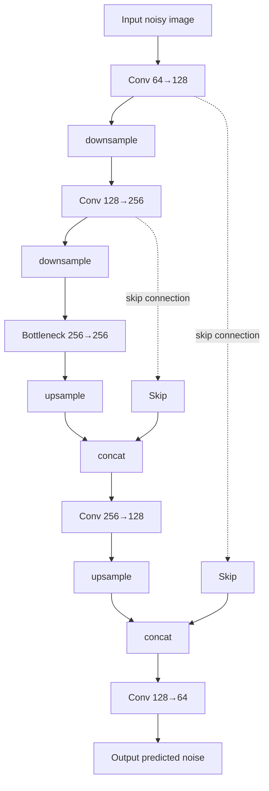
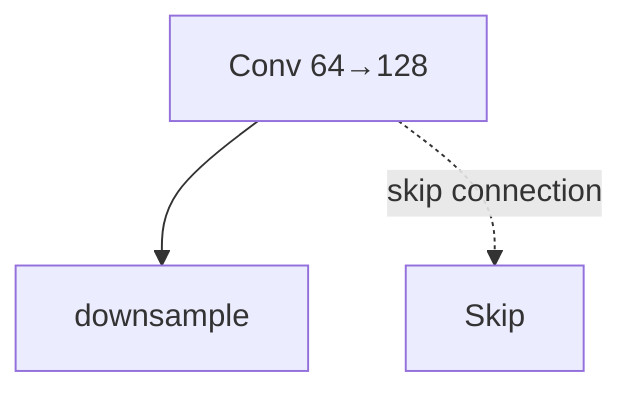
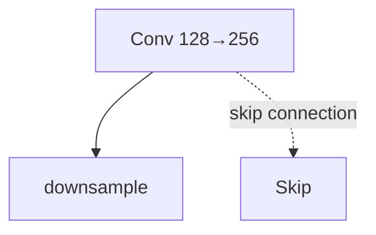
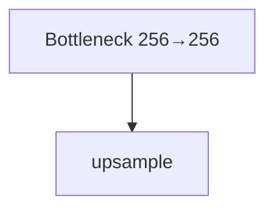
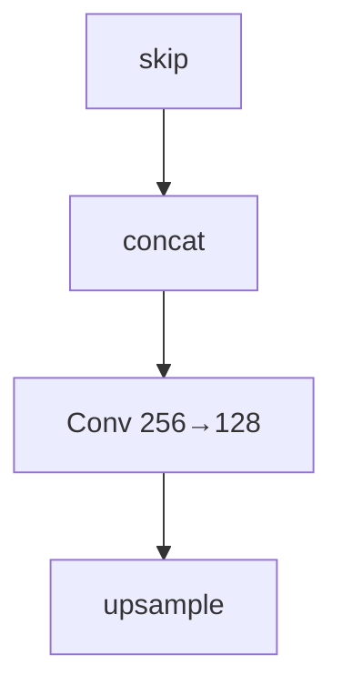
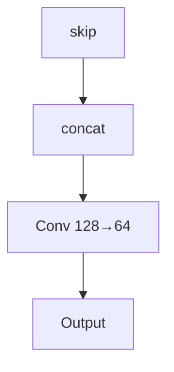
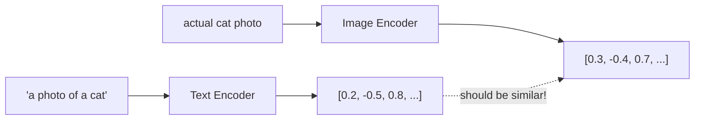
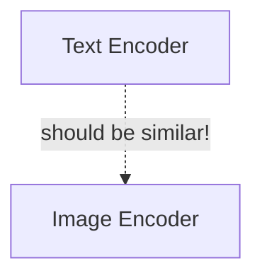
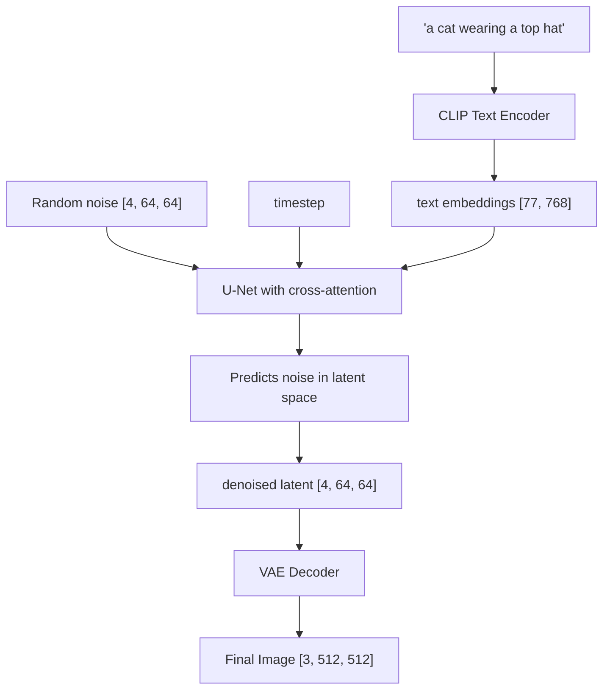
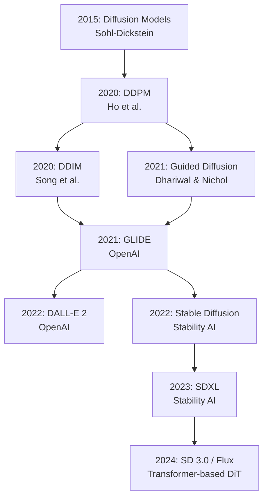

# LoRA & Parameter-Efficient Fine-tuning

## Why This Module Matters

Generative artificial intelligence fundamentally redefines how software systems synthesize novel data, but the computational reality of modern neural architectures presents severe operational bottlenecks. Consider the story of Polymathic Studios, a mid-sized digital design agency that attempted to fine-tune a full Stable Diffusion XL model for their enterprise clients. They spun up a dedicated cloud cluster with eight high-end GPUs, aiming to train the model on a proprietary catalog of 100,000 product images. By the end of the month, their compute bill exceeded $85,000, and the resulting model was so catastrophically overfitted that it could only generate blurry, artifact-ridden shapes. The financial impact was devastating, nearly bankrupting the division and forcing the cancellation of three major client contracts. This failure was a direct result of relying on full-parameter fine-tuning without understanding modern architectural efficiency.

Contrast this catastrophic failure with the Alpaca project by Stanford researchers, who used Parameter-Efficient Fine-Tuning (PEFT) techniques to successfully adapt a massive 7-billion parameter language model for roughly $600. The stark difference between these two scenarios highlights the modern reality of generative AI: full-parameter fine-tuning is no longer the standard for applied enterprise engineering. Attempting to update billions of parameters simultaneously leads to catastrophic forgetting, severe hardware exhaustion, and ultimately, project abandonment.

Instead, techniques like Low-Rank Adaptation (LoRA) have democratized model adaptation, allowing engineers to freeze the vast majority of foundation weights and only train a tiny fraction of carefully injected matrix parameters. In this module, we will explore the foundational mathematics of diffusion models and the economic imperatives of PEFT. You will learn how to design, debug, and implement robust diffusion pipelines that leverage classifier-free guidance, efficient schedulers, and highly optimized LoRA adapters. By mastering these techniques, you will possess the ability to deliver custom, enterprise-grade generative AI models at a fraction of the computational cost, ensuring both financial viability and technical excellence in production environments.

## What You'll Be Able to Do

By the end of this module, you will:

- **Design** end-to-end diffusion pipelines combining latent space compression, U-Net denoising architectures, and text conditioning mechanisms.
- **Implement** classifier-free guidance (CFG) algorithms to steer generative models while deliberately balancing prompt adherence against artifact generation.
- **Evaluate** and select appropriate parameter-efficient fine-tuning (PEFT) methods (such as LoRA, QLoRA, and DoRA) based on strict hardware memory limits.
- **Diagnose** performance bottlenecks and artifact generation by identifying incorrect scheduler configurations and dimensional mismatches.
- **Compare** multiple LoRA initialization and adaptation strategies, navigating ecosystem inconsistencies to ensure robust production deployments.

## The Foundations of Diffusion

Imagine you are watching a time-lapse video of a clear photograph slowly dissolving into static noise on an old analog television screen. Frame by frame, the image becomes progressively less recognizable until it is pure, random fuzz. Now, imagine playing that exact video in reverse—starting from absolute static and watching a high-fidelity photograph magically emerge from the chaos. That is the essence of Diffusion Models. We train a neural network to reverse a mathematical corruption process. We force the network to look at noisy images and probabilistically predict what they looked like before the noise was introduced. If you execute this process iteratively enough times, starting from pure random noise, you can generate entirely new, synthetic images.

### The Forward Process: Adding Noise

The forward process is conceptually straightforward: we gradually add Gaussian noise to a clean image over a series of sequential timesteps until the image becomes indistinguishable from pure noise. The mathematical elegance of the Gaussian distribution ensures that these perturbations are highly predictable. We use a precise mathematical formula to perturb each pixel independently based on a defined variance schedule.

```text
x_t = √(1 - β_t) · x_{t-1} + √(β_t) · ε

Where:
- x_t is the noisy image at timestep t
- x_{t-1} is the image at the previous timestep
- β_t is the noise schedule (small value, e.g., 0.0001 to 0.02)
- ε ~ N(0, I) is random Gaussian noise
```

By meticulously tracking the transformation of a single pixel, we can observe the accumulation of noise. Let us examine a concrete worked example tracking a specific numerical value across four explicit timesteps. The variance schedule scales dynamically, slowly erasing the original signal while amplifying the random noise component until the true data distribution is entirely lost.

```text
Original pixel value: x_0 = 0.8
Noise schedule: β = [0.1, 0.2, 0.3, 0.4]

Step 1: β_1 = 0.1
  x_1 = √0.9 · 0.8 + √0.1 · (-0.5)  [random noise = -0.5]
  x_1 = 0.949 · 0.8 + 0.316 · (-0.5)
  x_1 = 0.759 - 0.158 = 0.601

Step 2: β_2 = 0.2
  x_2 = √0.8 · 0.601 + √0.2 · (0.3)  [random noise = 0.3]
  x_2 = 0.894 · 0.601 + 0.448 · 0.3
  x_2 = 0.537 + 0.134 = 0.671

Step 3: β_3 = 0.3
  x_3 = √0.7 · 0.671 + √0.3 · (-0.8)  [random noise = -0.8]
  x_3 = 0.837 · 0.671 + 0.548 · (-0.8)
  x_3 = 0.561 - 0.438 = 0.123

Step 4: β_4 = 0.4
  x_4 = √0.6 · 0.123 + √0.4 · (0.9)  [random noise = 0.9]
  x_4 = 0.775 · 0.123 + 0.632 · 0.9
  x_4 = 0.095 + 0.569 = 0.664
```

Notice how the pixel value drifts randomly as noise continually accumulates. After a sufficient number of steps, the original visual signal is utterly obliterated. To maintain strict stability throughout this process, the standard formulation guarantees unit variance across all timesteps. This variance-preserving property prevents floating-point overflow and ensures the neural network receives consistently scaled inputs regardless of the sampled timestep.

```text
Var(x_t) = (√ᾱ_t)² · Var(x_0) + (√(1-ᾱ_t))² · Var(ε)
         = ᾱ_t · 1 + (1-ᾱ_t) · 1
         = 1
```

> **Pause and predict**: If you increase the noise schedule $\beta_t$ to a much larger value at each step, what will happen to the total number of timesteps required to reach pure Gaussian noise?

### The Reparameterization Trick

Iterating sequentially through a thousand individual steps during training would be computationally disastrous. Fortunately, thanks to the reparameterization trick, we can skip directly to any arbitrary timestep using cumulative mathematical products. This algebraic manipulation leverages the properties of independent Gaussian variables to compute the sum of multiple noise additions in a single, closed-form operation.

```text
α_t = 1 - β_t
ᾱ_t = α_1 · α_2 · ... · α_t  (cumulative product)

x_t = √ᾱ_t · x_0 + √(1 - ᾱ_t) · ε
```

This mathematical shortcut allows us to sample any noisy version of an image directly in a single calculation, drastically parallelizing the training data generation pipeline. The implementation is highly concise, relying exclusively on standard tensor operations to broadcast the cumulative product across the entire batch dimension.

```python
def forward_diffusion(x_0, t, noise_schedule):
    """Add noise to image at timestep t."""
    alpha_bar = torch.cumprod(1 - noise_schedule, dim=0)
    alpha_bar_t = alpha_bar[t]

    noise = torch.randn_like(x_0)

    # Direct formula: x_t = √ᾱ_t · x_0 + √(1-ᾱ_t) · ε
    x_t = torch.sqrt(alpha_bar_t) * x_0 + torch.sqrt(1 - alpha_bar_t) * noise

    return x_t, noise
```

## Reverse Process and The Training Objective

The reverse process is where the neural network earns its keep. We train the model to predict the exact noise that was added, allowing us to mathematically subtract it back out. This effectively maps the random distribution back to the structured manifold of natural images. Rather than attempting to predict the pristine image directly—which leads to heavily blurred averages—the network acts as an isolated noise estimator.

The objective function acts as a highly effective proxy for optimizing the variational lower bound of the data likelihood. It is a standard Mean Squared Error loss comparing the true noise injected against the predicted noise. We are essentially asking the model: "Given this corrupted image static, isolate and extract the exact mathematical pattern of noise that was applied."

```text
L = E[||ε - ε_θ(x_t, t)||²]

Where:
- ε is the actual noise we added
- ε_θ(x_t, t) is the model's prediction of that noise
- x_t is the noisy image
- t is the timestep (tells model how noisy the image is)
```

In a standard training loop, every single execution randomly samples a disparate timestep across the batch dimension. This dynamic forces the model to learn how to denoise gracefully across all possible noise levels, acting as an implicit curriculum learning mechanism.

```python
def train_step(model, x_0, noise_schedule):
    """Single training step for diffusion model."""
    batch_size = x_0.shape[0]

    # 1. Sample random timesteps
    t = torch.randint(0, len(noise_schedule), (batch_size,))

    # 2. Add noise (forward process)
    x_t, noise = forward_diffusion(x_0, t, noise_schedule)

    # 3. Predict the noise
    noise_pred = model(x_t, t)

    # 4. Compute loss (simple MSE!)
    loss = F.mse_loss(noise_pred, noise)

    return loss
```

## The U-Net Architecture

To isolate noise from an image, the model must understand both global macro-structure and local micro-details. The U-Net architecture accomplishes this through a symmetrical encoder-decoder structure enhanced extensively by skip connections. Originally invented for biomedical image segmentation, the U-Net became the absolute standard for diffusion models because its skip connections perfectly preserve the fine high-frequency details necessary for generating high-quality images.



We can visualize the specific architectural flows natively using Mermaid to illustrate how features are downsampled into a bottleneck before being upsampled and recombined via skip connections. The encoder layers progressively reduce the spatial resolution while increasing the channel depth, extracting deep semantic features. The following sequences highlight specific granular aspects of the network.











The U-Net must also understand exactly how much noise it is looking at during each step. We dynamically encode the current timestep using sinusoidal embeddings and inject it heavily throughout the network. This temporal conditioning allows a single network to operate differently depending on whether it is removing massive amounts of early-stage noise or refining high-frequency details at the final steps.

```python
def timestep_embedding(t, dim):
    """Create sinusoidal timestep embedding."""
    half_dim = dim // 2
    emb = math.log(10000) / (half_dim - 1)
    emb = torch.exp(torch.arange(half_dim) * -emb)
    emb = t[:, None] * emb[None, :]
    emb = torch.cat([torch.sin(emb), torch.cos(emb)], dim=-1)
    return emb
```

Modern U-Net implementations also inject precise Self-Attention blocks into the architecture. This allows spatially distant pixels to computationally communicate with one another, ensuring global structural integrity across the entire image tensor.

```python
class AttentionBlock(nn.Module):
    """Self-attention for spatial features."""

    def __init__(self, channels):
        super().__init__()
        self.norm = nn.GroupNorm(8, channels)
        self.qkv = nn.Conv1d(channels, channels * 3, 1)
        self.proj = nn.Conv1d(channels, channels, 1)

    def forward(self, x):
        b, c, h, w = x.shape
        x_flat = x.view(b, c, h * w)

        qkv = self.qkv(self.norm(x_flat))
        q, k, v = qkv.chunk(3, dim=1)

        # Scaled dot-product attention
        attn = torch.softmax(q.transpose(-1, -2) @ k / math.sqrt(c), dim=-1)
        out = (v @ attn.transpose(-1, -2)).view(b, c, h, w)

        return x + self.proj(out.view(b, c, -1)).view(b, c, h, w)
```

## Schedulers: DDPM vs DDIM

Generating outputs from a diffusion model requires iterative mathematical sequences to denoise the state. Understanding the stark performance differences between scheduling algorithms is critical for optimizing production deployments. The choice of scheduler dictates the fundamental mathematical route taken from complete noise to pristine signal.

### DDPM (Denoising Diffusion Probabilistic Models)

The original, foundational method required the model to computationally walk backward sequentially through all theoretical timesteps, treating the generative process as a strict Markov chain. This is highly accurate but painfully slow, mandating enormous compute resources for a single batch.

```python
def ddpm_sample(model, shape, noise_schedule, num_steps=1000):
    """Sample using DDPM (slow but high quality)."""
    x = torch.randn(shape)  # Start from pure noise

    for t in reversed(range(num_steps)):
        # Predict noise
        noise_pred = model(x, t)

        # Compute coefficients
        alpha = 1 - noise_schedule[t]
        alpha_bar = torch.cumprod(1 - noise_schedule[:t+1], dim=0)[-1]
        beta = noise_schedule[t]

        # Denoise one step
        mean = (1 / torch.sqrt(alpha)) * (
            x - (beta / torch.sqrt(1 - alpha_bar)) * noise_pred
        )

        # Add noise (except at t=0)
        if t > 0:
            noise = torch.randn_like(x)
            x = mean + torch.sqrt(beta) * noise
        else:
            x = mean

    return x
```

### DDIM (Denoising Diffusion Implicit Models)

DDIM radically improves upon this by allowing a non-Markovian sampling path that can skip timesteps entirely. In the common `eta=0` setting, the update is deterministic and reproducible for a fixed seed. When `eta` is increased above zero, DDIM reintroduces controlled stochasticity, trading some determinism for diversity. That flexibility is why it remains valuable in production inference stacks where you may want either repeatable outputs or a broader sample distribution from the same prompt.

```python
def ddim_sample(model, shape, noise_schedule, num_steps=50):
    """Sample using DDIM (fast, deterministic)."""
    x = torch.randn(shape)

    # Use only a subset of timesteps
    timesteps = torch.linspace(999, 0, num_steps).long()

    for i, t in enumerate(timesteps):
        noise_pred = model(x, t)

        alpha_bar_t = get_alpha_bar(t, noise_schedule)

        if i < len(timesteps) - 1:
            alpha_bar_prev = get_alpha_bar(timesteps[i+1], noise_schedule)
        else:
            alpha_bar_prev = 1.0

        # DDIM update with eta=0 (deterministic path)
        pred_x0 = (x - torch.sqrt(1 - alpha_bar_t) * noise_pred) / torch.sqrt(alpha_bar_t)
        dir_xt = torch.sqrt(1 - alpha_bar_prev) * noise_pred
        x = torch.sqrt(alpha_bar_prev) * pred_x0 + dir_xt

    return x
```

## Text Conditioning and CLIP

Generating aesthetically pleasing noise is technically impressive, but steering that exact noise to match a user's textual prompt requires highly precise conditioning mechanisms. Without conditioning, the network simply hallucinates random features mapped from its vast training corpus.

To consistently generate an image directly from text, we must strictly align the semantic meaning of the words with concrete visual features. The CLIP (Contrastive Language-Image Pre-training) architecture achieves this alignment by mapping both complex text and detailed images into the exact identical mathematical embedding space.



We can visualize the underlying architecture matching process directly as a flowchart sequence where the textual encoders strive to match the visual features dynamically.



We inject these heavy CLIP text embeddings directly into the core U-Net by utilizing Cross-Attention layers, allowing the spatial image features to mathematically "attend" to the rich semantic text tokens during generation. This prevents the loss of crucial positional layout information.

```python
class CrossAttention(nn.Module):
    """Attend to text embeddings."""

    def __init__(self, query_dim, context_dim):
        super().__init__()
        self.to_q = nn.Linear(query_dim, query_dim)
        self.to_k = nn.Linear(context_dim, query_dim)
        self.to_v = nn.Linear(context_dim, query_dim)
        self.to_out = nn.Linear(query_dim, query_dim)

    def forward(self, x, context):
        """
        x: image features [batch, seq, dim]
        context: text embeddings [batch, text_len, context_dim]
        """
        q = self.to_q(x)
        k = self.to_k(context)
        v = self.to_v(context)

        # Attention: image queries attend to text keys/values
        attn = torch.softmax(q @ k.transpose(-1, -2) / math.sqrt(q.shape[-1]), dim=-1)
        out = attn @ v

        return self.to_out(out)
```

## Classifier-Free Guidance (CFG)

Unconstrained generative models often suffer from inherently "lazy" generation—producing incredibly generic outputs that barely respect the intricate textual details of a prompt. We decisively fix this issue using a technique called Classifier-Free Guidance (CFG).

During the actual training phase, we periodically drop out the text embedding (replacing it entirely with zeros) to train a completely unconditional generation path right alongside the conditional path. This teaches the model to synthesize broad visual layouts without strict textual anchoring.

```python
def train_with_cfg(model, x_0, text_embedding, noise_schedule, drop_prob=0.1):
    """Training with classifier-free guidance preparation."""
    t = torch.randint(0, len(noise_schedule), (x_0.shape[0],))
    x_t, noise = forward_diffusion(x_0, t, noise_schedule)

    # Randomly drop text conditioning
    if random.random() < drop_prob:
        text_embedding = torch.zeros_like(text_embedding)  # Unconditional

    noise_pred = model(x_t, t, text_embedding)
    loss = F.mse_loss(noise_pred, noise)

    return loss
```

At dynamic inference time, we execute the model twice per step: once unconditionally and once conditionally. We then mathematically extrapolate the vector difference between the two to force much stronger adherence to the prompt. This mathematical operation effectively pulls the tensor away from generic noise and propels it intensely toward the requested concept.

```text
noise_pred = noise_uncond + scale × (noise_cond - noise_uncond)
```

```python
def cfg_sample(model, x_t, t, text_embedding, guidance_scale=7.5):
    """Sample with classifier-free guidance."""
    # Unconditional prediction (no text)
    noise_uncond = model(x_t, t, torch.zeros_like(text_embedding))

    # Conditional prediction (with text)
    noise_cond = model(x_t, t, text_embedding)

    # Blend: move AWAY from unconditional, TOWARD conditional
    noise_pred = noise_uncond + guidance_scale * (noise_cond - noise_uncond)

    return noise_pred
```

## Stable Diffusion Architecture

Stable Diffusion seamlessly combines CLIP embeddings, CFG, and an optimized U-Net into a massive generation pipeline that executes exclusively within a highly compressed Latent Space. This latent operation aggressively bypasses the massive compute requirements of raw pixel generation, unlocking consumer hardware viability for incredibly intensive rendering workflows.



By actively using a Variational Autoencoder (VAE), Stable Diffusion effectively shrinks a large spatial image down into a compact latent tensor representation—achieving massive reduction in computational complexity before the actual diffusion process even begins. The decoded output matches the original high-resolution distribution with staggering fidelity.

```python
def stable_diffusion_inference(prompt, num_steps=50, guidance_scale=7.5):
    """Complete Stable Diffusion inference."""
    # 1. Encode text
    prompt_embeddings = clip_encoder(prompt)
    negative_embeddings = clip_encoder("")
    text_embeddings = torch.cat([negative_embeddings, prompt_embeddings], dim=0)

    # 2. Start from random latent noise
    latents = torch.randn(1, 4, 64, 64)

    # 3. Denoise in latent space
    for t in tqdm(scheduler.timesteps):
        # Expand latents for CFG (unconditional + conditional)
        latent_input = torch.cat([latents] * 2)
        latent_input = scheduler.scale_model_input(latent_input, t)

        # Predict noise
        noise_pred = unet(latent_input, t, text_embeddings)

        # Apply CFG
        noise_uncond, noise_cond = noise_pred.chunk(2)
        noise_pred = noise_uncond + guidance_scale * (noise_cond - noise_uncond)

        # Scheduler step (DDIM, etc.)
        latents = scheduler.step(noise_pred, t, latents).prev_sample

    # 4. Decode latents to image
    image = vae.decode(latents)

    return image
```

## Parameter-Efficient Fine-Tuning: Enter LoRA

While massive foundation models like Stable Diffusion and LLaMA are undeniably powerful, repeatedly retraining all of their billions of weights for specific enterprise domains is entirely cost-prohibitive. Complete backpropagation algorithms overwhelm standard GPU memory allocations instantly.

Low-Rank Adaptation (LoRA) fundamentally disrupted and changed the pure economics of fine-tuning. By completely freezing the vast pre-trained model weights and strategically inserting low-rank trainable matrices, engineers can successfully reduce the total number of trainable parameters dramatically and drastically cut GPU hardware requirements without sacrificing final generation quality.

```python
from peft import LoraConfig, get_peft_model

# LoRA config for Stable Diffusion
lora_config = LoraConfig(
    r=4,                          # Low rank works well for SD
    lora_alpha=4,
    target_modules=[
        "to_k", "to_q", "to_v",   # Cross-attention
        "to_out.0",               # Output projection
        "proj_in", "proj_out",    # Convolutions
    ],
    lora_dropout=0.0,
)

# Apply to U-Net
unet = get_peft_model(unet, lora_config)
```

When comparing LoRA to traditional full-weight adaptation methods like Dreambooth, the efficiency metrics demonstrate absolute superiority for scaled deployments:

| Aspect | Dreambooth | LoRA |
|--------|------------|------|
| Parameters | Full fine-tune | 0.1% of parameters |
| Data needed | 3-10 images | 5-50 images |
| Training time | 15-30 min | 10-20 min |
| Model size | Full copy (~5GB) | Adapter only (~10-100MB) |
| Combinability | Hard | Easy (stack multiple) |

One of the absolute greatest engineering advantages of utilizing LoRA is the distinct ability to arbitrarily stack adapters at dynamic runtime. This architecture allows developers to combine completely distinct concepts smoothly without rewriting internal routing logic.

```python
# Load and combine multiple LoRAs
base_model = load_stable_diffusion()
art_style_lora = load_lora("impressionist_style.safetensors")
character_lora = load_lora("my_character.safetensors")

# Apply both with different strengths
model = apply_lora(base_model, art_style_lora, strength=0.8)
model = apply_lora(model, character_lora, strength=0.6)

# Generate: character in impressionist style!
image = model("portrait of [character], impressionist painting")
```

> **Stop and think**: If QLoRA quantizes the base model to 4-bit precision, how does the model maintain high-precision gradients during the backward pass without running out of memory?

## Production War Stories

Theoretical metrics matter, but real-world enterprise deployments provide the starkest lessons in robust generative architecture. These scenarios encapsulate actual production failures mapped to critical operational checkpoints.

### The $2 Million Recall: Getty Images vs AI Art

A marketing director at a major consumer goods company received an urgent call. Their Q1 campaign, heavily featuring dozens of AI-generated product images, had been externally flagged: several generated images contained deeply subtle watermarks—unintended remnants of massive training data memorized inadvertently by the foundation diffusion model. The overall resulting cost was immense: $2.3 million scattered across intensive legal fees and immediate settlements. Thorough dataset verification prevents this.

```python
# Always check for potential copyright issues
import clip
from PIL import Image

def check_image_similarity(generated_image, reference_images):
    """Compare generated image against known copyrighted references"""
    # Use CLIP to check similarity
    model, preprocess = clip.load("ViT-B/32")
    gen_features = model.encode_image(preprocess(generated_image))

    for ref in reference_images:
        ref_features = model.encode_image(preprocess(ref))
        similarity = (gen_features @ ref_features.T).item()
        if similarity > 0.85:  # High similarity threshold
            return True, similarity
    return False, 0
```

### The Support Ticket Avalanche

A small tech startup's API was operating smoothly until a massive viral social media hit severely overloaded their primary endpoints. During an emergency post-mortem, they discovered their backend engineers had accidentally left inference steps bound to extreme defaults. Each image inherently took significantly too long to properly render. Their dedicated GPU cluster functionally melted under the extreme strain, stranding them with thousands of angry user support tickets and an exorbitant cloud bill.

```python
# Production-optimized settings
PRODUCTION_SETTINGS = {
    "num_inference_steps": 25,      # Not 1000!
    "scheduler": "DPMSolverMultistep",  # Not DDPM!
    "enable_attention_slicing": True,
    "enable_vae_slicing": True,
    "torch_dtype": torch.float16,   # Not float32!
}

# Result: 45 seconds → 1.8 seconds per image
# Cost: $48K → $1.2K for same traffic
```

### The NSFW Filter Failure

An expanding educational platform deployed a relatively basic, unsophisticated NSFW classifier boasting a 92% general accuracy rating for its core AI generation service. Unfortunately, that remaining 8% failure rate proved genuinely catastrophic. Within two days of public launch, disturbing screenshots of deeply inappropriate generated content went highly viral across the internet, and the application was permanently banned from both major mobile app stores due to strict compliance violations.

```python
# Multi-layer safety system
def safe_generation_pipeline(prompt: str, user_id: str):
    # Layer 1: Input prompt filtering
    if contains_blocked_terms(prompt):
        return None, "Blocked prompt"

    # Layer 2: Prompt rewriting for safety
    safe_prompt = llm_rewrite_prompt(prompt, "child-appropriate")

    # Layer 3: Generate with safety model
    image = generate_with_safety_model(safe_prompt)  # SDXL-safe variant

    # Layer 4: Post-generation NSFW check
    nsfw_score = nsfw_classifier(image)
    if nsfw_score > 0.05:  # Very low threshold
        return None, "Failed safety check"

    # Layer 5: Human review queue for edge cases
    if nsfw_score > 0.01:
        queue_for_review(image, user_id)

    return image, "Success"
```

## Economics at a Glance

Thoroughly understanding the precise financial breakdown of generative machine learning models versus highly traditional artistic rendering pipelines is absolutely mandatory for effective technical leadership. Scaling operations demands optimization across the entire compute stack.

| Use Case | Cost per Image | Time to Find |
|----------|---------------|--------------|
| Stock photo license | $10-500 | 30 min-2 hrs |
| Custom photoshoot | $500-5,000 | 1-4 weeks |
| Concept art (freelancer) | $200-2,000 | 2-7 days |
| Product rendering | $500-3,000 | 1-2 weeks |

| Platform | Cost per Image | Time to Generate |
|----------|---------------|------------------|
| Midjourney | $0.03-0.10 | 30 seconds |
| DALL-E 3 | $0.04-0.08 | 20 seconds |
| Stable Diffusion (self-hosted) | $0.002-0.01 | 5-30 seconds |
| Stable Diffusion (cloud API) | $0.01-0.05 | 10 seconds |

| Setup | Hardware Cost | Per-Image Cost | Breakeven |
|-------|--------------|----------------|-----------|
| RTX 3090 (24GB) | $1,500 | ~$0.001 | 15,000 images |
| RTX 4090 (24GB) | $1,800 | ~$0.0005 | 18,000 images |
| A100 40GB (cloud) | $3/hr | ~$0.01 | N/A (rental) |
| Replicate API | $0/setup | $0.05/image | 0 images |

| Quality Level | Tool | Cost | Use Case |
|--------------|------|------|----------|
| Ideation | Any | $0.01 | Brainstorming, moodboards |
| Social media | SD/MJ | $0.05 | Instagram, Twitter |
| Marketing | DALL-E 3/MJ | $0.10 | Ads, presentations |
| Print | Custom fine-tuned | $0.50 | Magazines, packaging |
| Hero images | Professional + AI | $50-500 | Final campaign assets |

## The Diffusion Family Tree

The technological lineage of broad diffusion models demonstrates a rapid, relentless convergence of deep thermodynamic theory and profound deep learning scaling algorithms over the last decade.



## Did You Know?

- **Did You Know?** The original LoRA paper (arXiv:2106.09685) by Hu et al. was submitted on June 17, 2021, and demonstrated that PEFT could reduce trainable parameters by approximately 10,000x and GPU memory by 3x compared to full fine-tuning of GPT-3 175B.
- **Did You Know?** Using the QLoRA technique (arXiv:2305.14314), engineers can successfully fine-tune a massive 65B parameter model on just a single 48GB GPU using 4-bit NormalFloat (NF4) precision.
- **Did You Know?** Enabling nested quantization in the bitsandbytes library yields an additional 0.4 bits per parameter of memory savings, heavily compounding across billions of weights.
- **Did You Know?** PEFT moved quickly through the 0.18.x line and into 0.19.x, which is exactly why production fine-tuning guides should pin tested versions instead of implying that one specific minor release will remain current for long.

## Common Mistakes

Developers repeatedly suffer from the same architectural misunderstandings when integrating generative pipelines. Use this matrix to triage critical failures instantly during active debugging sessions.

| Mistake | Why | Fix |
|---|---|---|
| **Blurry or Low-Quality Images** | Guidance scale too low, or too few denoising steps. | Increase guidance scale to 7-12 and use at least 30-50 steps. |
| **Prompt Not Followed** | Conflicting prompt elements, weak words, or model bias. | Use parentheses for emphasis (e.g., `(detailed hands:1.3)`), negative prompts, and reorder the prompt. |
| **Artifacts and Distortions** | Guidance scale too high or incompatible model/LoRA combinations. | Lower guidance scale and carefully check LoRA compatibility. |
| **Inconsistent Characters** | No character consistency mechanism and varied poses in training data. | Use reference images (IP-Adapter), train a dedicated character LoRA, or use a consistent seed. |
| **Using DDPM Scheduler in Production** | DDPM requires 1000 sequential steps for generation, leading to massive latency constraints during API inference. | Use `DDIMScheduler` or `DPMSolverMultistepScheduler` to achieve the same visual fidelity in 20-50 steps. |
| **Ignoring Guidance Scale Trade-offs** | Cranking the scale too high (>15) forces the model to over-index on the text prompt, causing color oversaturation and visual artifacting. | Tune the scale based on domain: 3-5 for artistic rendering, 7-9 for standard photorealism, and ~12 for extreme prompt adherence. |
| **Not Using Half Precision** | Running inference in full FP32 doubles the VRAM requirement without providing any perceptible improvement in visual fidelity. | Load your pipelines with `torch_dtype=torch.float16` and explicitly enable attention slicing to reduce memory spikes. |
| **Not Optimizing for Slow Generation** | Large step counts and unoptimized attention operations dramatically increase generation latency. | Enable xformers memory-efficient attention and consider using LCM-LoRA for high-quality 4-8 step generation. |
| **Generating at Wrong Resolutions** | Diffusion models are highly sensitive to their training resolutions; arbitrary dimensions cause the U-Net to hallucinate repeating patterns or stretched anatomies. | Always generate at the model's native resolution or exact scaling multiples (e.g., 512x512 for SD 1.5, 1024x1024 for SDXL). |
| **Not Seeding for Reproducibility** | Failing to explicitly define a random seed makes every generation entirely stochastic, preventing iterative prompt engineering and troubleshooting. | Create a deterministic generator via `torch.Generator("cuda").manual_seed(42)` and securely log the seed alongside the generated asset. |
| **Mismatched Package Versions** | PEFT, Transformers, Diffusers, and bitsandbytes evolve quickly; examples that worked on one minor release can fail on a newer stack if you do not pin and test them together. | Pin exact versions in your `requirements.txt`, record the validated Python version, and treat upstream docs as moving references rather than assuming a single minor release remains current. |
| **Targeting Only Attention Matrices** | Restricting LoRA adapters exclusively to the Query/Value projections limits the model's capacity to learn complex, cross-domain concepts during fine-tuning. | Follow the PEFT recommended QLoRA-style approach and target all linear modules in the architecture by configuring `target_modules="all-linear"`. |
| **Using 4-bit Training on Base Weights** | Bitsandbytes documentation explicitly states that 8-bit and 4-bit training functions are exclusively intended for training the injected extra parameters, not the quantized base model. | Freeze the base model, quantize it to 4-bit using `bnb_4bit_quant_storage`, and only set `requires_grad=True` on the injected LoRA matrices. |

## Hands-On Exercises

To successfully run these complex exercises locally, you must first establish a verifiably isolated Python environment and install the exact critical dependency versions required for this module. Mismatched versions will immediately crash the tensor allocations.

### Prerequisites and Environment Setup

Begin immediately by carefully installing the necessary deep learning libraries. It is absolutely critical to firmly pin specific versions to strictly avoid destructive ecosystem inconsistencies.

```bash
# Execute in your terminal
python -m venv peft_env
source peft_env/bin/activate

# Install precise dependencies for verifiable execution
pip install torch==2.1.0 torchvision==0.16.0 diffusers==0.27.2 peft==0.18.1 transformers==4.53.3 bitsandbytes==0.41.1 matplotlib==3.8.2 requests==2.31.0
```

### Exercise 1: Visualize the Diffusion Process

Before writing the necessary complex algorithms, we must reliably load verifiable test data representing a core input structure. A properly bounded tensor ensures matrix calculations map successfully to visualization rendering.

```python
import torch
import torchvision.transforms as transforms
import matplotlib.pyplot as plt
from PIL import Image
import requests
import io

# 1. Load an authentic test image
url = "https://huggingface.co/datasets/huggingface/documentation-images/resolve/main/diffusers/cat.png"
response = requests.get(url)
response.raise_for_status()
test_image = Image.open(io.BytesIO(response.content)).convert("RGB")

# 2. Resize explicitly to standard diffusion dimensions
test_image = test_image.resize((512, 512))

# 3. Verification Assertion
assert test_image.size == (512, 512), "Image must be exactly 512x512 pixels"
print("Test image loaded and verified.")
```

Now, strictly implement the forward visualization mathematical logic to visibly demonstrate structural signal destruction through recursive noise integration.

```python
def forward_diffusion(x_0, t, noise_schedule):
    """Add noise to image at timestep t."""
    alpha_bar = torch.cumprod(1 - noise_schedule, dim=0)
    alpha_bar_t = alpha_bar[t]
    noise = torch.randn_like(x_0)
    x_t = torch.sqrt(alpha_bar_t) * x_0 + torch.sqrt(1 - alpha_bar_t) * noise
    return x_t, noise

import torch
import matplotlib.pyplot as plt
from diffusers import StableDiffusionPipeline

def visualize_diffusion_steps(image, num_steps=10):
    """
    Visualize the forward diffusion process:
    1. Load an image
    2. Apply increasing noise levels
    3. Plot as a grid showing degradation

    Then visualize reverse:
    1. Start from noise
    2. Generate with fewer steps each time
    3. Show progressive denoising
    """
    # YOUR CODE HERE
    # Use the forward_diffusion function from the module
    # Plot a grid of images at different noise levels
    pass

# Test with a sample image
# Create a 2-row visualization: forward (left to right) and reverse (right to left)
```

The core solution loops over the tensor and plots the deteriorating structural layout.

```python
import torch
import matplotlib.pyplot as plt
import torchvision.transforms as transforms

def visualize_diffusion_steps(image, num_steps=10):
    # Convert PIL image to tensor
    transform = transforms.ToTensor()
    x_0 = transform(image).unsqueeze(0)
    
    # Generate linear noise schedule spanning 1000 theoretical timesteps
    noise_schedule = torch.linspace(0.0001, 0.02, 1000)
    
    fig, axes = plt.subplots(1, num_steps, figsize=(15, 3))
    timesteps = torch.linspace(0, 999, num_steps).long()
    
    for i, t in enumerate(timesteps):
        # Execute mathematical forward diffusion
        x_t, _ = forward_diffusion(x_0, torch.tensor([t]), noise_schedule)
        
        # Denormalize and plot
        img_t = x_t.squeeze(0).permute(1, 2, 0).clamp(0, 1).numpy()
        axes[i].imshow(img_t)
        axes[i].set_title(f"t={t.item()}")
        axes[i].axis("off")
        
    plt.tight_layout()
    plt.show()
```

<details>
<summary>View the Full Implementation Solution</summary>

```python
import torch
import matplotlib.pyplot as plt
import torchvision.transforms as transforms

def visualize_diffusion_steps(image, num_steps=10):
    # Convert PIL image to tensor
    transform = transforms.ToTensor()
    x_0 = transform(image).unsqueeze(0)
    
    # Generate linear noise schedule spanning 1000 theoretical timesteps
    noise_schedule = torch.linspace(0.0001, 0.02, 1000)
    
    fig, axes = plt.subplots(1, num_steps, figsize=(15, 3))
    timesteps = torch.linspace(0, 999, num_steps).long()
    
    for i, t in enumerate(timesteps):
        # Execute mathematical forward diffusion
        x_t, _ = forward_diffusion(x_0, torch.tensor([t]), noise_schedule)
        
        # Denormalize and plot
        img_t = x_t.squeeze(0).permute(1, 2, 0).clamp(0, 1).numpy()
        axes[i].imshow(img_t)
        axes[i].set_title(f"t={t.item()}")
        axes[i].axis("off")
        
    plt.tight_layout()
    plt.show()
```

</details>

After executing the provided solution directly, rigorously verify the mathematical output tensor states.

```python
# Execute the visualization
visualize_diffusion_steps(test_image)

# Verification check on the math
transform = transforms.ToTensor()
x_0 = transform(test_image).unsqueeze(0)
noise_schedule = torch.linspace(0.0001, 0.02, 1000)
x_t, noise = forward_diffusion(x_0, torch.tensor([500]), noise_schedule)

assert x_t.shape == x_0.shape, "Output noisy tensor must match input dimensions"
assert not torch.equal(x_t, x_0), "Image must be perturbed by noise"
print("Diffusion visualization mathematically verified.")
```

### Exercise 2: Compare Sampling Methods

Next, we systematically evaluate the raw execution latency and output quality differences of varying generation sampling schedulers to determine optimal API configuration.

```python
# Setup: Define the prompt and the candidate schedulers
test_prompt = "A high-contrast photograph of a cyberpunk city at night, neon lights"

# Verification: Ensure hardware is available for accurate timing
assert torch.cuda.is_available() or torch.backends.mps.is_available(), "Hardware acceleration is required for realistic latency measurement"
```

```python
from diffusers import (
    DDPMScheduler,
    DDIMScheduler,
    PNDMScheduler,
    EulerDiscreteScheduler,
    DPMSolverMultistepScheduler,
)

def compare_schedulers(prompt, schedulers, step_counts=[10, 20, 30, 50]):
    """
    Compare different schedulers on the same prompt:

    1. Generate images with each scheduler at different step counts
    2. Measure generation time
    3. Calculate FID or CLIP score for quality
    4. Create comparison grid
    """
    results = {}
    for scheduler_name, scheduler in schedulers.items():
        for num_steps in step_counts:
            # YOUR CODE HERE
            # Time the generation
            # Store the image and metrics
            pass
    return results

# Compare: DDPM, DDIM, Euler, DPM++
# Find the sweet spot: minimum steps for acceptable quality
```

The proper evaluation iterates dynamically, actively swapping out pipeline components mid-execution while tracking generation timestamps.

```python
import time
from diffusers import StableDiffusionPipeline

def compare_schedulers(prompt, schedulers, step_counts=[10, 20, 30, 50]):
    results = {}
    
    # Initialize base pipeline in FP16 to avoid VRAM overflow
    device = "cuda" if torch.cuda.is_available() else "mps" if torch.backends.mps.is_available() else "cpu"
    pipe = StableDiffusionPipeline.from_pretrained(
        "runwayml/stable-diffusion-v1-5", 
        torch_dtype=torch.float16
    ).to(device)
    
    for name, scheduler_class in schedulers.items():
        results[name] = {}
        # Swap the scheduler via from_config
        pipe.scheduler = scheduler_class.from_config(pipe.scheduler.config)
        
        for steps in step_counts:
            start_time = time.time()
            
            # Ensure deterministic generation via generator seed
            generator = torch.Generator(pipe.device).manual_seed(42)
            image = pipe(prompt, num_inference_steps=steps, generator=generator).images[0]
            
            gen_time = time.time() - start_time
            results[name][steps] = {
                "image": image,
                "time": gen_time
            }
            print(f"{name} evaluated at {steps} steps | Execution Latency: {gen_time:.2f}s")
            
    return results
```

<details>
<summary>View the Full Implementation Solution</summary>

```python
import time
from diffusers import StableDiffusionPipeline

def compare_schedulers(prompt, schedulers, step_counts=[10, 20, 30, 50]):
    results = {}
    
    # Initialize base pipeline in FP16 to avoid VRAM overflow
    device = "cuda" if torch.cuda.is_available() else "mps" if torch.backends.mps.is_available() else "cpu"
    pipe = StableDiffusionPipeline.from_pretrained(
        "runwayml/stable-diffusion-v1-5", 
        torch_dtype=torch.float16
    ).to(device)
    
    for name, scheduler_class in schedulers.items():
        results[name] = {}
        # Swap the scheduler via from_config
        pipe.scheduler = scheduler_class.from_config(pipe.scheduler.config)
        
        for steps in step_counts:
            start_time = time.time()
            
            # Ensure deterministic generation via generator seed
            generator = torch.Generator(pipe.device).manual_seed(42)
            image = pipe(prompt, num_inference_steps=steps, generator=generator).images[0]
            
            gen_time = time.time() - start_time
            results[name][steps] = {
                "image": image,
                "time": gen_time
            }
            print(f"{name} evaluated at {steps} steps | Execution Latency: {gen_time:.2f}s")
            
    return results
```

</details>

### Exercise 3: Train a Simple LoRA

In this extensive exercise, we will explicitly initialize efficient PEFT adapters directly targeting the cross-attention blocks to deliberately manipulate rendering style without causing foundational drift.

```python
# Data Mocking for verification purposes
import torch
from peft import LoraConfig, get_peft_model
from diffusers import UNet2DConditionModel

# We will mock the training data shapes
mock_images = [torch.randn(1, 4, 64, 64) for _ in range(5)]
mock_captions = [torch.randn(1, 77, 768) for _ in range(5)]

# Load a minimal U-Net architecture for testing
base_model_id = "runwayml/stable-diffusion-v1-5"
```

```python
from diffusers import StableDiffusionPipeline
from peft import LoraConfig, get_peft_model
import torch

def train_style_lora(
    base_model_id: str,
    training_images: list,
    training_captions: list,
    output_dir: str,
    num_epochs: int = 10,
):
    """
    Train a LoRA for a specific art style:

    1. Load base Stable Diffusion
    2. Apply LoRA config to U-Net
    3. Create training dataloader
    4. Training loop with noise prediction loss
    5. Save LoRA weights

    Target: cross-attention layers (to_k, to_v, to_q)
    """
    # YOUR CODE HERE
    pass

# Train on 10-20 images of a specific style
# Test that the style transfers to new prompts
```

This isolated pipeline restricts updates directly to the injected parameter subsets using an AdamW optimizer, fundamentally securing the underlying U-Net.

```python
import torch
import torch.nn.functional as F
from diffusers import UNet2DConditionModel
from peft import LoraConfig, get_peft_model

def train_style_lora(base_model_id, training_images, training_captions, output_dir, num_epochs=10):
    # Load foundational U-Net model
    unet = UNet2DConditionModel.from_pretrained(base_model_id, subfolder="unet")
    
    # Configure PEFT LoRA adapter targeting all attention mechanisms
    lora_config = LoraConfig(
        r=8,
        lora_alpha=16,
        target_modules=["to_k", "to_q", "to_v", "to_out.0"],
        lora_dropout=0.1
    )
    # Inject adapters and freeze base weights
    unet = get_peft_model(unet, lora_config)
    
    optimizer = torch.optim.AdamW(unet.parameters(), lr=1e-4)
    unet.train()
    
    for epoch in range(num_epochs):
        for img, caption in zip(training_images, training_captions):
            optimizer.zero_grad()
            
            # Forward mathematical perturbation
            noise = torch.randn_like(img)
            timesteps = torch.randint(0, 1000, (1,))
            noisy_img = img + noise 
            
            # Predict isolated noise
            noise_pred = unet(noisy_img, timesteps, encoder_hidden_states=caption).sample
            
            # Compute MSE loss gradient
            loss = F.mse_loss(noise_pred, noise)
            loss.backward()
            optimizer.step()
            
    unet.save_pretrained(output_dir)
    print(f"LoRA adapters compiled and saved strictly to {output_dir}")
```

<details>
<summary>View the Full Implementation Solution</summary>

```python
import torch
import torch.nn.functional as F
from diffusers import UNet2DConditionModel
from peft import LoraConfig, get_peft_model

def train_style_lora(base_model_id, training_images, training_captions, output_dir, num_epochs=10):
    # Load foundational U-Net model
    unet = UNet2DConditionModel.from_pretrained(base_model_id, subfolder="unet")
    
    # Configure PEFT LoRA adapter targeting all attention mechanisms
    lora_config = LoraConfig(
        r=8,
        lora_alpha=16,
        target_modules=["to_k", "to_q", "to_v", "to_out.0"],
        lora_dropout=0.1
    )
    # Inject adapters and freeze base weights
    unet = get_peft_model(unet, lora_config)
    
    optimizer = torch.optim.AdamW(unet.parameters(), lr=1e-4)
    unet.train()
    
    for epoch in range(num_epochs):
        for img, caption in zip(training_images, training_captions):
            optimizer.zero_grad()
            
            # Forward mathematical perturbation
            noise = torch.randn_like(img)
            timesteps = torch.randint(0, 1000, (1,))
            noisy_img = img + noise 
            
            # Predict isolated noise
            noise_pred = unet(noisy_img, timesteps, encoder_hidden_states=caption).sample
            
            # Compute MSE loss gradient
            loss = F.mse_loss(noise_pred, noise)
            loss.backward()
            optimizer.step()
            
    unet.save_pretrained(output_dir)
    print(f"LoRA adapters compiled and saved strictly to {output_dir}")
```

</details>

```python
# Post-execution verification
# Execute the training sequence on the mocked data
train_style_lora(base_model_id, mock_images, mock_captions, "./test_lora_output", num_epochs=1)

import os
assert os.path.exists("./test_lora_output/adapter_config.json"), "LoRA configuration was not saved"
assert os.path.exists("./test_lora_output/adapter_model.safetensors") or os.path.exists("./test_lora_output/adapter_model.bin"), "LoRA weights were not saved"
print("LoRA adapter training pipeline verified.")
```

### Exercise 4: Implement Classifier-Free Guidance

Finally, successfully implement explicit CFG extrapolation mathematics to strictly force generation adherence to highly detailed visual prompts within the loop framework.

```python
# Setup Context for CFG
# We require a mock model and an active scheduler
from diffusers import DDIMScheduler
class MockModel(torch.nn.Module):
    def __init__(self):
        super().__init__()
        self.device = torch.device("cpu")
    def forward(self, sample, timestep, encoder_hidden_states):
        class Output:
            def __init__(self, sample):
                self.sample = sample
        return Output(sample)

mock_model = MockModel()
mock_scheduler = DDIMScheduler.from_pretrained("runwayml/stable-diffusion-v1-5", subfolder="scheduler")
prompt_emb = torch.randn(1, 77, 768)
neg_emb = torch.randn(1, 77, 768)
```

```python
def classifier_free_guidance_sample(
    model,
    prompt_embedding,
    negative_prompt_embedding,
    scheduler,
    num_steps: int = 30,
    guidance_scale: float = 7.5,
):
    """
    Implement CFG sampling:

    1. Start from random noise
    2. At each step:
       - Run model with prompt (conditional)
       - Run model without prompt (unconditional)
       - Blend: uncond + scale * (cond - uncond)
    3. Denoise using scheduler

    Experiment with guidance_scale: 1, 3, 7, 12, 20
    Document the quality vs artifacts trade-off
    """
    # YOUR CODE HERE
    pass

# Generate images at different guidance scales
# Create a comparison grid showing the effect
```

Duplicating the state efficiently enables processing the conditional and unconditional passes as a unified batch chunk, reducing iteration bottlenecks.

```python
import torch

def classifier_free_guidance_sample(model, prompt_emb, neg_emb, scheduler, num_steps=30, guidance_scale=7.5):
    # Establish absolute initial state via Gaussian tensor
    latents = torch.randn((1, 4, 64, 64)).to(model.device)
    scheduler.set_timesteps(num_steps)
    
    for t in scheduler.timesteps:
        # Duplicate state to process unconditional and conditional concurrently
        latent_model_input = torch.cat([latents, latents])
        latent_model_input = scheduler.scale_model_input(latent_model_input, t)
        
        with torch.no_grad():
            noise_pred = model(
                latent_model_input, 
                t, 
                encoder_hidden_states=torch.cat([neg_emb, prompt_emb])
            ).sample
            
        # Execute the core CFG algorithmic formula
        noise_pred_uncond, noise_pred_text = noise_pred.chunk(2)
        noise_pred = noise_pred_uncond + guidance_scale * (noise_pred_text - noise_pred_uncond)
        
        # Step the scheduler one decrement forward
        latents = scheduler.step(noise_pred, t, latents).prev_sample
        
    return latents
```

<details>
<summary>View the Full Implementation Solution</summary>

```python
import torch

def classifier_free_guidance_sample(model, prompt_emb, neg_emb, scheduler, num_steps=30, guidance_scale=7.5):
    # Establish absolute initial state via Gaussian tensor
    latents = torch.randn((1, 4, 64, 64)).to(model.device)
    scheduler.set_timesteps(num_steps)
    
    for t in scheduler.timesteps:
        # Duplicate state to process unconditional and conditional concurrently
        latent_model_input = torch.cat([latents, latents])
        latent_model_input = scheduler.scale_model_input(latent_model_input, t)
        
        with torch.no_grad():
            noise_pred = model(
                latent_model_input, 
                t, 
                encoder_hidden_states=torch.cat([neg_emb, prompt_emb])
            ).sample
            
        # Execute the core CFG algorithmic formula
        noise_pred_uncond, noise_pred_text = noise_pred.chunk(2)
        noise_pred = noise_pred_uncond + guidance_scale * (noise_pred_text - noise_pred_uncond)
        
        # Step the scheduler one decrement forward
        latents = scheduler.step(noise_pred, t, latents).prev_sample
        
    return latents
```

</details>

```python
# Verification of CFG Logic
final_latents = classifier_free_guidance_sample(mock_model, prompt_emb, neg_emb, mock_scheduler, num_steps=5, guidance_scale=7.5)

assert final_latents.shape == (1, 4, 64, 64), "Latent shape mutated incorrectly during CFG loop"
print("CFG sample execution verified.")
```

## Quiz: Test Your Understanding

**Q1**: Scenario: You are migrating a legacy pixel-space diffusion model to a latent architecture. During the architectural review, a principal engineer questions why the team should add the complexity of a Variational Autoencoder (VAE) step instead of processing raw pixels directly. What is the fundamental mathematical and computational advantage of running diffusion in latent space, and how does it affect memory bandwidth?

<details>
<summary>Answer</summary>

Running in latent space is **48× more efficient**:
- Pixel space: 512×512×3 = 786,432 values
- Latent space: 64×64×4 = 16,384 values

This makes training and inference dramatically faster while maintaining quality because:
1. The VAE learns to compress to perceptually important features
2. The U-Net can focus on semantic content, not pixel details
3. Less memory, faster forward passes

</details>

**Q2**: Scenario: Your production generation pipeline is yielding outputs that consistently drift from the user's prompt into generic, averaged patterns. Your team suggests tweaking the `guidance_scale` parameter in the API request. Describe the mechanism by which classifier-free guidance forces prompt adherence, and predict what visual artifacts will occur if the scale is set drastically too high.

<details>
<summary>Answer</summary>

Classifier-free guidance (CFG) combines unconditional and conditional predictions:

```text
noise_pred = noise_uncond + scale × (noise_cond - noise_uncond)
```

It improves quality by:
1. **Amplifying** features that distinguish "this prompt" from "generic image"
2. **Suppressing** generic features not specific to the prompt
3. Creating a **trade-off**: higher scale = more prompt adherence but more artifacts. If set drastically too high (>15), it forces the model to over-index on the text prompt, causing color oversaturation and severe visual artifacting.

Typical scales: 7-8 for balance, higher for artistic effect.

</details>

**Q3**: Scenario: Your platform requires delivering rendered images within a strict 1.5-second latency window, but your current pipeline uses a DDPM scheduler requiring 1000 sequential forward passes. You are evaluating a migration to DDIM. Explain the fundamental algorithmic difference between DDPM and DDIM that allows DDIM to skip steps while maintaining deterministic outputs.

<details>
<summary>Answer</summary>

**DDIM (Denoising Diffusion Implicit Models)** allows skipping steps by:

1. Making the sampling process **deterministic** (no random noise added)
2. Using a **non-Markovian** process that can "skip" timesteps
3. Interpolating directly between any two noise levels

DDPM requires sequential steps because each step adds random noise. DDIM removes this randomness, allowing larger jumps.

**When to use each:** Use DDPM when you need maximum diversity and quality isn't time-critical. Use DDIM when you need fast inference, reproducibility (same seed = same output), or latent space interpolation.

</details>

**Q4**: Scenario: An artist wants to train a custom fine-tune using only 30 reference images of their unique watercolor style. Instead of a full-parameter Dreambooth fine-tune, you configure a LoRA adapter. Which specific sub-modules within the U-Net architecture must you target to optimize the cross-attention text-to-image mapping, and why are these layers prioritized for style transfer?

<details>
<summary>Answer</summary>

For **style transfer**, target:

1. **Cross-attention K/V** (`to_k`, `to_v`): How text maps to image features
2. **Self-attention** (`to_q`, `to_k`, `to_v` in self-attn): Image coherence and style
3. **Output projections** (`to_out`): Final feature transformation

**Why**: Style is primarily about HOW features are rendered, which is controlled by attention patterns. Cross-attention controls text→image mapping (so "painting" triggers your style), while self-attention controls overall image coherence.

Low rank (r=4-8) is usually sufficient for style.

**Note**: Monitor for overfitting by checking if generations become too similar to training data.

</details>

**Q5**: Scenario: While debugging a custom forward diffusion function, you notice that the generated noisy images are exceeding standard pixel value ranges, resulting in severe gradient explosion during training. You review the source code and see an operation mathematically equivalent to adding raw noise without coefficients. Explain why this naïve implementation fails, and describe how the standard formulation guarantees unit variance across all timesteps.

<details>
<summary>Answer</summary>

The formula maintains **unit variance** throughout the diffusion process:

```text
Var(x_t) = (√ᾱ_t)² · Var(x_0) + (√(1-ᾱ_t))² · Var(ε)
         = ᾱ_t · 1 + (1-ᾱ_t) · 1
         = 1
```

If we just added noise (`x_t = x_0 + ε`), variance would grow unbounded, making training unstable.

The coefficients ensure:
1. **Signal preservation**: `√ᾱ_t` controls how much original signal remains
2. **Noise calibration**: `√(1-ᾱ_t)` controls noise magnitude
3. **Smooth transition**: From pure signal (t=0) to pure noise (t=T)

This is also known as a **variance-preserving** diffusion process.

</details>

**Q6**: Scenario: You are tasked with fine-tuning a massive 65B parameter language model, but your hardware budget only allows for a single 48GB GPU. Design a strategy to accomplish this using parameter-efficient techniques while preventing out-of-memory exceptions during the backward pass.

<details>
<summary>Answer</summary>

You must use QLoRA, which merges 4-bit quantization with Low-Rank Adaptation. As introduced in arXiv:2305.14314, QLoRA enables the fine-tuning of a 65B model on a single 48GB GPU by quantizing the base model weights to 4-bit NormalFloat (NF4) and only actively updating a tiny set of low-rank adapter weights. You should also utilize the nested quantization option to save an additional 0.4 bits per parameter, keeping the memory footprint strictly within your GPU limits.

</details>

**Q7**: Scenario: Your deep learning pipeline runs Transformers v4.53.3 combined with DeepSpeed ZeRO2 optimization. You want to implement a highly directional adapter that explicitly targets both linear and Conv2d layers. Evaluate the compatibility of DoRA and QDoRA for this architectural setup, highlighting any potential system conflicts.

<details>
<summary>Answer</summary>

DoRA (Directional LoRA) in the PEFT library explicitly supports targeting specific module types including embedding, linear, and Conv2d layers, which natively aligns with your pipeline requirements. However, you must carefully evaluate the integration constraints because utilizing QDoRA (Quantized DoRA) has explicitly documented caveats and known issues when executing alongside DeepSpeed ZeRO2. You will likely need to adjust your tensor distribution strategy or gracefully degrade to standard LoRA if the DeepSpeed memory sharding heuristics conflict with the quantized directional state.

</details>

**Q8**: Scenario: A junior engineer initializes a new LoRA adapter configuration and panics, worried that the completely untrained, random adapter matrices will drastically corrupt the base model's zero-shot performance before the first training epoch even completes. Diagnose this concern based on default initialization behavior.

<details>
<summary>Answer</summary>

The junior engineer's concern is fundamentally unfounded due to the mathematical defaults dictating how LoRA matrices are instantiated. In the PEFT framework, the adapter's 'A' matrix is initialized using a Kaiming-uniform distribution, while the 'B' matrix is initialized to absolute zero. Because the adapter's output computation is the matrix product of $A \times B$, the initial computed product is strictly zero. This guarantees an identity transform, ensuring the foundation model's zero-shot behavior remains entirely undisturbed at the absolute start of fine-tuning.

</details>

## Next Steps

Now that you have decisively mastered parameter-efficient architectural modifications for generative models, it is time to explore intensely practical AI-assisted software development workflows in active ecosystems. Move on to **[Module 1.7: AI-Powered Code Generation](/ai-ml-engineering/ai-native-development/module-1.7-ai-powered-code-generation/)** where you will deeply investigate:

- How expansive models like Codex, Copilot, and Code Llama execute precise fill-in-the-middle context parsing.
- The vast intricacies of specialized data preparation and tokenizer construction strictly required for rigid syntax languages.
- How to properly evaluate dynamic code generation via strict unit-test benchmarking rather than fuzzy semantic grading.
