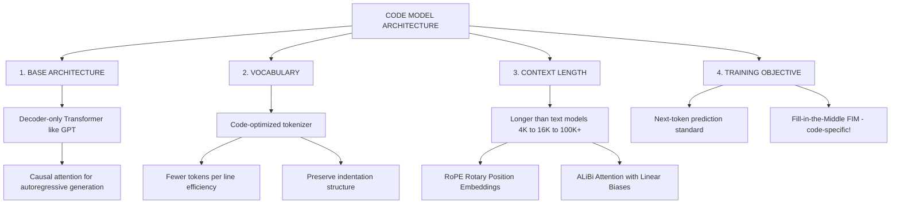
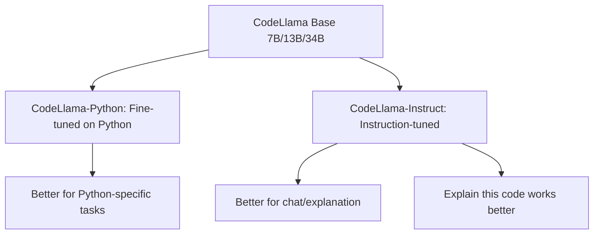
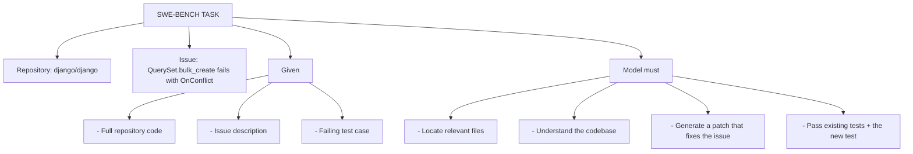
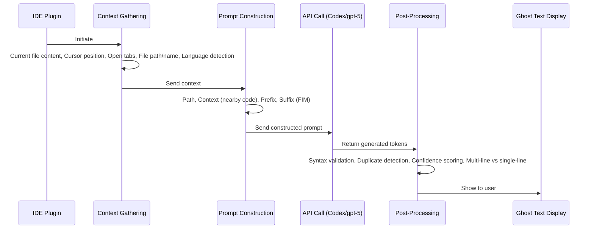
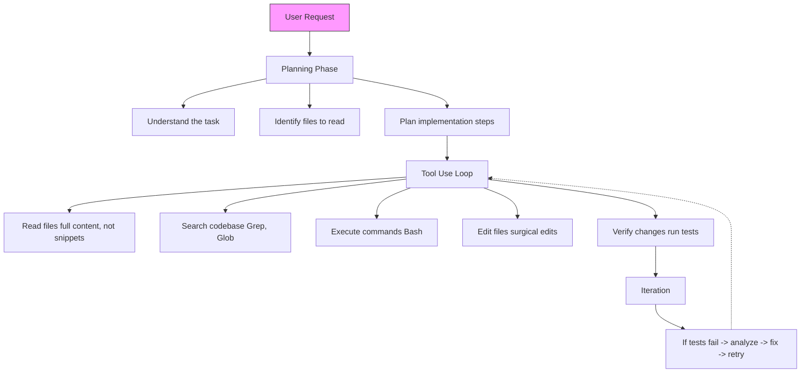

> **AI/ML Engineering Track** | Complexity: `[COMPLEX]` | Time: 6-8

---

**Prerequisites**: Module 33 (Diffusion Models)

---

## Why This Module Matters

In the world of generative AI, the stakes for structural precision and architectural understanding are incredibly high. Consider the devastating generative AI failures that have struck real companies in recent years. In 2023, developers at Samsung inadvertently leaked highly confidential proprietary source code into ChatGPT, causing unquantifiable intellectual property damage. However, the risks extend far beyond mere data leaks; they deeply impact active architectural integrity. Consider the infamous hallucinated API disaster at a major enterprise, where an engineering team blindly accepted an autoregressive model's code suggestion for a critical AWS infrastructure integration. The generated deployment script looked syntactically perfect and included robust error handling, but the specific scaling method it called simply did not exist.

The deployment crashed during a massive scaling event, trapping the cluster in an infinite initialization loop that took the entire production pipeline offline. This single generative failure cost the company over $50,000 in SLA penalties and wasted cloud compute resources over a single weekend. This incident highlights the profound risks of deploying predictive models without rigorously understanding their underlying mechanisms, limitations, and the absolute necessity of execution-based validation.

Conversely, the generative AI landscape is equally defined by continuous-space models that synthesize rich media. When a diffusion model generates a hyper-realistic but entirely fabricated image, it exploits the exact same conceptual leap—predicting missing information from noise—but applies it to continuous pixel states rather than discrete logic tokens. The duality of modern AI lies in these two distinct architectures: diffusion models mastering the continuous visual domain, and autoregressive models mastering the rigid, discrete domain of source code. Understanding both paradigms is no longer optional for ML engineers. You must navigate the architectural trade-offs, manage complex deployment constraints, and design inference pipelines that guarantee both semantic accuracy and operational safety.

## What You Will Be Able to Do

By the end of this module, you will be able to:

- **Diagnose** performance and quality trade-offs in continuous diffusion models, specifically evaluating DDPM against DDIM architectures.
- **Design** deterministic inference pipelines utilizing Hugging Face Diffusers v0.37.1 in a secure Kubernetes v1.35+ environment.
- **Compare** the massive architectural requirements of continuous-space diffusion models against discrete-space autoregressive code generation models.
- **Evaluate** the legal licensing, severe hardware resource constraints, and deployment topologies of generative assets like Stable Diffusion 3 Medium.
- **Implement** custom code generation workflows, including precise Fill-in-the-Middle (FIM) formatting strategies and Classifier-Free Guidance (CFG) for image conditioning.

## Section 1: The Continuous Realm: Diffusion Models and Architecture

The modern generative era for continuous data was fundamentally catalyzed by the submission of the Denoising Diffusion Probabilistic Models (DDPM) paper on 2020-06-19. Before DDPM, Generative Adversarial Networks (GANs) dominated the landscape but suffered from severe mode collapse and highly unstable training dynamics. DDPM demonstrated a mathematically elegant alternative based on principles derived from non-equilibrium thermodynamics: a neural network could learn to systematically reverse a Markovian process that gradually corrupts an image with Gaussian noise.

The forward process destroys information step-by-step until the data is indistinguishable from pure isotropic noise. Imagine dropping ink into a glass of water; over time, the ink diffuses until the water is uniformly colored. While effectively irreversible in the physical world, the reverse process in machine learning trains a specialized UNet architecture to predict the noise vector added at each discrete timestep. This effectively allows the model to learn to denoise and recover a pristine, coherent image from pure static. The paper's abstract reported groundbreaking empirical performance on the unconditional CIFAR-10 dataset, achieving an Inception score of 9.46 and a Frechet Inception Distance (FID) of 3.17. The original DDPM API in Hugging Face Diffusers uses a standard UNet model together with a DDPMScheduler and defaults to a computationally heavy 1000 inference steps.

However, DDPM required hundreds or even thousands of sequential forward passes through the network to generate a single image, making it computationally prohibitive for real-time applications. The massive inference latency was a critical roadblock for enterprise adoption. This severe limitation was solved when DDIM was submitted on 2020-10-06, presented as an implicit non-Markovian sampler with the exact same training objective as DDPM. By altering the sampling trajectory to safely skip intermediate steps without retraining, DDIM can be 10x to 50x faster than DDPM in wall-clock time while allowing a computation-quality tradeoff without having to retrain the underlying base model.

> **Stop and think**: How does an architecture designed to denoise continuous pixel values relate to an architecture designed to predict the next discrete word in a strict Python script?

Operating directly on high-resolution pixels proved devastatingly inefficient. Every time the resolution doubled, the computational cost squared, bottlenecking the models on strict hardware limits. The attention mechanisms within the standard UNet require massive amounts of VRAM, limiting raw pixel diffusion to relatively small images. Latent Diffusion (LDM) was submitted on 2021-12-20 and introduces latent-space diffusion using pretrained autoencoders plus cross-attention for flexible conditioning. The entire diffusion process occurs strictly within this tiny latent space, dramatically reducing the computational burden. The autoencoder compresses the image into a spatial latent representation that is a fraction of the original size, diffuses within that dimension, and then decodes back to pixel space.

Stable Diffusion is a latent diffusion text-to-image model built by CompVis, Stability AI, and LAION, trained on 512x512 LAION-5B subset images. To force the model to adhere strictly to textual prompts, the community adopted Classifier-Free Diffusion Guidance (CFG), submitted on 2022-07-26. Diffusers configures CFG with a default guidance scale of 7.5. This process involves evaluating both a conditional pass (with the prompt) and an unconditional pass (with an empty prompt), extrapolating away from the unconditional output towards the conditioned target.

> **Pause and predict**: If a diffusion model operates entirely in pixel space, how does the computational complexity scale as the resolution of the target image increases from 512x512 to 4K?

The architecture continued to scale aggressively to handle complex compositions. Stable Diffusion 3 Medium is a 2-billion-parameter MMDiT text-to-image model submitted on 2024-03-05. Its training data includes 1 billion pre-training images. The Multimodal Diffusion Transformer (MMDiT) replaces traditional cross-attention mechanisms by utilizing separate sets of weights for image and text representations, resulting in vastly improved typographic and compositional adherence. However, engineers must carefully note its licensing constraints: Stable Diffusion 3 Medium is released under a non-commercial community license and requires separate commercial licensing for enterprise use. Deploying this model in a commercial pipeline without acquiring proper licensing presents a massive legal liability.

## Section 2: Implementing Diffusion in Kubernetes

Translating these mathematical concepts into a reliable production endpoint requires robust API orchestration. The Hugging Face Diffusers library serves as the industry standard for pipelining diffusion topologies. To deploy a Diffusers v0.37.1 pipeline effectively, you must utilize a modern container orchestrator capable of explicit hardware management. The Kubernetes v1.35+ API provides the necessary primitives for exact GPU scheduling and memory allocation using isolated device plugins. Below is an example deployment manifest for an inference API targeting a modern cluster.

```yaml
apiVersion: apps/v1
kind: Deployment
metadata:
  name: sd3-diffusers-api
  namespace: ai-inference
  labels:
    app: diffusion-api
spec:
  replicas: 2
  selector:
    matchLabels:
      app: diffusion-api
  template:
    metadata:
      labels:
        app: diffusion-api
    spec:
      containers:
      - name: diffusers-worker
        image: internal-registry/diffusers-api:v0.37.1
        resources:
          limits:
            nvidia.com/gpu: "1"
            memory: "32Gi"
          requests:
            cpu: "4"
            memory: "16Gi"
```

When defining the resources block in a Kubernetes v1.35+ manifest for massive ML workloads, setting explicit limits is a matter of cluster survival. Requesting `nvidia.com/gpu: 1` gives the scheduler an integer GPU allocation target through the device plugin, but it does not magically guarantee full memory-level isolation in every runtime configuration. If you need stricter partitioning or reproducible tenancy boundaries, pair the manifest with the actual GPU-sharing mechanism in use, such as MIG or time-slicing policies enforced by the device plugin and runtime stack. Because a diffusion model must load multi-gigabyte safetensors into VRAM before accepting requests, any sudden resource starvation or unmanaged sharing can still crash the worker. Furthermore, isolating this workload in the `ai-inference` namespace prevents CPU-heavy web applications from causing noisy neighbor degradation.

## Section 3: The Discrete Realm: Pre-Neural Origins and Code Generation

While diffusion models map continuous, forgiving visual spaces where an extra pixel is imperceptible, autoregressive models are forced to map the strict, unforgiving, and discrete syntax of programming languages.

```python
# Natural language is forgiving:
"I want make a function that adds numbers"  # Understandable!

# Code is not:
def add(a b):  # SyntaxError! Missing comma
    return a + b
```

Natural language is like poetry; a misplaced comma or a misspelled word rarely prevents human understanding. Source code is like a combination lock. A single omitted character will throw a compiler error and halt execution entirely. Code requires maintaining exact state over incredibly long contexts. A variable defined at the top of a file must be correctly referenced hundreds of lines down.

```python
class DataProcessor:
    def __init__(self, config):
        self.config = config  # Defined here

    # ... 200 lines later ...

    def process(self, data):
        threshold = self.config.threshold  # Must remember self.config!
```

Furthermore, natural language requests are often highly ambiguous, whereas code interpretations are distinct and rigid. When asking a human to sort an array, the implementation details are assumed. When generating code, the syntax must explicitly declare the mutation strategy.

```python
# "Sort the list" in natural language → many valid interpretations
# In code, these are all different:
sorted(items)                    # Returns new list
items.sort()                     # Modifies in place
sorted(items, reverse=True)      # Descending
sorted(items, key=lambda x: x.name)  # By attribute
```

Code models must also resolve abstract dependencies across completely separate files in a vast repository hierarchy. An engineer navigating a massive monorepo naturally traces imports; a code generation model must hold all these external signatures within its context window simultaneously.

```python
# models/user.py
class User:
    def __init__(self, name: str, email: str):
        self.name = name
        self.email = email

# services/auth.py - needs to know User's structure!
from models.user import User

def create_user(data: dict) -> User:
    return User(name=data['name'], email=data['email'])
```

To handle these constraints, models are heavily customized. Code-optimized tokenizers are explicitly designed to preserve whitespace and indentation structure. The context windows must be vastly expanded using advanced techniques to maintain architectural coherence across massive repositories. This requires moving beyond traditional absolute position embeddings toward modern relative strategies.



Standard autoregressive models generate strictly left-to-right. This fails completely when attempting to inject logic into an existing block of code.

```python
# Given this prefix:
def calculate_average(numbers):
    total = sum(numbers)

# Model continues:
    count = len(numbers)
    return total / count
```

When you place your cursor inside the function, the model needs to know what comes next in order to intelligently synthesize the missing logic block.

```python
def calculate_average(numbers):
    # <-- Need to add validation HERE
    total = sum(numbers)
    count = len(numbers)
    return total / count
```

A standard prompt only provides the prefix, leaving the model utterly blind to the variables utilized below the cursor. To solve this, researchers developed the Fill-in-the-Middle (FIM) training objective.

```python
def greet(name):
    message = f"Hello, {name}!"
    return message
```

A FIM prompt structurally isolates the target generation point using explicit control tokens, completely altering the traditional autoregressive left-to-right generation assumption.

```text
<PREFIX>def greet(name):
    message = <SUFFIX>
    return message<MIDDLE>f"Hello, {name}!"
```

```text
<fim_prefix>def add(a, b):
    <fim_suffix>
    return result<fim_middle>result = a + b
```

```text
<fim_suffix>
    return result<fim_prefix>def add(a, b):
    <fim_middle>result = a + b
```

During training, continuous chunks of code are randomly split into three specific parts: a prefix, a middle, and a suffix. The model is then trained to predict the missing middle section given the context of both the prefix and the suffix simultaneously. This allows IDE integration tools to accurately auto-complete logic directly inside complex function bodies.

```python
def apply_fim_transform(code: str, fim_rate: float = 0.5) -> str:
    """Transform code for FIM training."""
    if random.random() > fim_rate:
        return code  # Regular left-to-right example

    # Choose random split point
    split_point = random.randint(0, len(code))

    prefix = code[:split_point]
    suffix = code[split_point:]

    # Find natural boundary (line break)
    if '\n' in suffix:
        boundary = suffix.index('\n')
        middle = suffix[:boundary]
        suffix = suffix[boundary:]
    else:
        middle = suffix
        suffix = ""

    # PSM format
    return f"<fim_prefix>{prefix}<fim_suffix>{suffix}<fim_middle>{middle}"
```

The acceleration of neural code generation architectures has been exponential, shifting from early closed-weight proof-of-concepts to massive, open-weight multilingual behemoths capable of analyzing thousands of lines of context simultaneously.

```mermaid
flowchart TD
    Y2020[2020] --> GPT3[GPT-3: General model, decent at code]
    Y2021[2021] --> Codex[Codex OpenAI: First dedicated code model]
    Y2021 --> CodeParrot[CodeParrot HuggingFace: Open-source attempt]
    Y2022[2022] --> InCoder[InCoder Meta: First open FIM model]
    Y2022 --> SantaCoder[SantaCoder BigCode: 1.1B, strong performance]
    Y2022 --> CodeGen[CodeGen Salesforce: Multi-turn code generation]
    Y2023[2023] --> StarCoder[StarCoder BigCode: 15B, open, multilingual]
    Y2023 --> CodeLlama[CodeLlama Meta: 7B/13B/34B]
    Y2023 --> WizardCoder[WizardCoder: Evol-Instruct for code]
    Y2024[2024] --> DeepSeek[DeepSeek Coder: 1.3B to 33B]
    Y2024 --> StarCoder2[StarCoder2 BigCode: 3B/7B/15B]
    Y2024 --> CodeQwen[CodeQwen Alibaba: 1.5B/7B]
    Y2024 --> Codestral[Codestral Mistral: 22B]
```



Furthermore, these base models undergo rigorous instruction tuning for specific tasks, bridging the gap from simple code completion to interactive conversational agents capable of explaining logic and debugging errors.



| Model | Size | Context | HumanEval | Open Weights | FIM |
|-------|------|---------|-----------|--------------|-----|
| gpt-5 | ~1.8T | 128K | 67.0% | No | Yes |
| Claude 3.5 Sonnet | Undisclosed | 200K | Vendor-reported strong coding performance; verify current benchmarks separately | No | Yes |
| CodeLlama-34B | 34B | 100K | 48.8% | Yes | Yes |
| DeepSeek Coder 33B | 33B | 16K | 56.1% | Yes | Yes |
| StarCoder2-15B | 15B | 16K | 46.3% | Yes | Yes |
| Codestral-22B | 22B | 32K | 57.1% | Partial | Yes |

## Section 4: Evaluating Code Generation and Metrics

How do we actually know if a code model is capable? Natural language metrics like BLEU or ROUGE are completely useless in the discrete realm. A model can output code that matches a reference string by 99% but fails to compile due to a single misplaced bracket. Execution is the most reliable ground truth.

```python
def has_close_elements(numbers: List[float], threshold: float) -> bool:
    """Check if in given list of numbers, are any two numbers
    closer to each other than given threshold.

    >>> has_close_elements([1.0, 2.0, 3.0], 0.5)
    False
    >>> has_close_elements([1.0, 2.8, 3.0, 4.0, 5.0, 2.0], 0.3)
    True
    """
```

Instead of looking at strings, the industry adopted execution-based metrics like Pass at K. This metric requires the model to generate multiple algorithmic candidates and then strictly executes them against an unseen unit test suite. Because models utilize temperature sampling to introduce variety, evaluating a single greedy generation is fundamentally inadequate.

```python
def estimate_pass_at_k(n: int, c: int, k: int) -> float:
    """
    Estimate pass at k metric from n samples with c correct.

    Args:
        n: Total samples generated
        c: Number that passed tests
        k: k for pass at k metric

    Uses unbiased estimator from Codex paper.
    """
    if n - c < k:
        return 1.0
    return 1.0 - np.prod(1.0 - k / np.arange(n - c + 1, n + 1))
```

Pass at K strictly evaluates whether at least one generated algorithmic sample passes hidden tests. A model might fail five times, but if the sixth generated candidate perfectly passes the execution block, the developer successfully solved the issue.

```python
"""
Write a function to find the volume of a sphere.
assert math.isclose(volume_sphere(10), 4188.79, rel_tol=0.01)
"""
```

While HumanEval tests isolated algorithmic functions perfectly, modern enterprise engineering happens in vast repositories. To evaluate true repository-scale capabilities beyond isolated functions, the industry advanced to the SWE-bench evaluation framework. SWE-bench tasks models with resolving real-world GitHub issues within massive, interrelated codebases like Django and Pytest.



## Section 5: Building Code Generation Systems

Building a robust generation system requires careful API design. You must structure prompts specifically to trigger the FIM pathways and establish defensive parsing limits.

```python
def complete_code(
    prefix: str,
    suffix: str = "",
    model: str = "deepseek-coder",
    max_tokens: int = 256,
    temperature: float = 0.2
) -> str:
    """Complete code given prefix and optional suffix (FIM)."""

    if suffix:
        # FIM mode
        prompt = f"<fim_prefix>{prefix}<fim_suffix>{suffix}<fim_middle>"
    else:
        # Standard completion
        prompt = prefix

    response = client.completions.create(
        model=model,
        prompt=prompt,
        max_tokens=max_tokens,
        temperature=temperature,
        stop=["<fim_suffix>", "\n\n\n"]  # Stop tokens
    )

    return response.choices[0].text
```

For critical generation where accuracy is paramount, you can sample multiple instances and rank them natively by passing execution tests before returning the ultimate result to the user. This guarantees the highest quality suggestion.

```python
def generate_with_ranking(
    prompt: str,
    n_samples: int = 10,
    test_cases: List[Tuple[Any, Any]] = None
) -> str:
    """Generate multiple samples and rank by test passing."""

    samples = []
    for _ in range(n_samples):
        code = complete_code(prompt, temperature=0.8)
        samples.append(code)

    if test_cases:
        # Rank by test passing
        scores = []
        for code in samples:
            passed = sum(
                run_test(code, inp, expected)
                for inp, expected in test_cases
            )
            scores.append(passed)

        best_idx = np.argmax(scores)
        return samples[best_idx]

    # Without tests, return most common (majority voting)
    from collections import Counter
    return Counter(samples).most_common(1)[0][0]
```

Providing deep, cross-file context is equally important. Models operate exactly like a new developer on their first day; they must be provided relevant imports and signatures to grasp repository intent. Without explicit context mapping, the model will simply hallucinate internal libraries.

```python
class RepoContextBuilder:
    """Build context from repository for better generation."""

    def __init__(self, repo_path: str):
        self.repo_path = Path(repo_path)
        self.file_index = self._build_index()

    def _build_index(self) -> Dict[str, str]:
        """Index all code files."""
        index = {}
        for ext in ['.py', '.js', '.ts', '.java']:
            for path in self.repo_path.rglob(f'*{ext}'):
                relative = path.relative_to(self.repo_path)
                index[str(relative)] = path.read_text()
        return index

    def get_relevant_context(
        self,
        current_file: str,
        cursor_position: int,
        max_context_tokens: int = 4000
    ) -> str:
        """Get relevant context for code completion."""

        context_parts = []

        # 1. Current file content
        current_content = self.file_index.get(current_file, "")
        context_parts.append(f"# Current file: {current_file}\n{current_content}")

        # 2. Imported files
        imports = self._extract_imports(current_content)
        for imp in imports:
            if imp in self.file_index:
                context_parts.append(
                    f"# Imported: {imp}\n{self.file_index[imp][:2000]}"
                )

        # 3. Similar files (by name/directory)
        similar = self._find_similar_files(current_file)
        for path in similar[:3]:
            context_parts.append(
                f"# Related: {path}\n{self.file_index[path][:1000]}"
            )

        # Combine and truncate
        full_context = "\n\n".join(context_parts)
        return self._truncate_to_tokens(full_context, max_context_tokens)
```

A robust Retrieval-Augmented Generation (RAG) implementation is often deployed for intelligent search, processing semantic clusters rather than rigid file paths. This powers the background intelligence of major IDE plugins.



```python
# Simplified Cursor-style RAG
class CursorStyleRAG:
    def __init__(self, repo_path: str):
        self.embedder = CodeEmbedder()
        self.index = self._build_vector_index(repo_path)

    def _build_vector_index(self, repo_path: str):
        """Build semantic index of code chunks."""
        chunks = []
        for file in Path(repo_path).rglob("*.py"):
            content = file.read_text()
            # Chunk by functions/classes
            for chunk in self._chunk_by_ast(content):
                embedding = self.embedder.embed(chunk)
                chunks.append({
                    "content": chunk,
                    "embedding": embedding,
                    "file": str(file)
                })
        return VectorIndex(chunks)

    def get_context(self, query: str, current_file: str) -> str:
        """Retrieve relevant code context."""
        query_embedding = self.embedder.embed(query)

        # Semantic search
        similar = self.index.search(query_embedding, k=10)

        # Filter and rank
        # - Prefer same directory
        # - Prefer imported modules
        # - Prefer recently edited
        ranked = self._rank_results(similar, current_file)

        return self._format_context(ranked[:5])
```

Modern generative interactions have shifted from reactive completions to fully autonomous loops, granting models access to Bash and Grep tools.



High latency destroys the developer experience. Speculative decoding speeds up inference securely by combining the rapidity of small models with the accuracy of large models. The small model drafts candidate tokens rapidly, and the massive target model verifies them in parallel batches.

```python
def speculative_decode(
    prompt: str,
    draft_model: Model,  # Small, fast (1B)
    target_model: Model,  # Large, accurate (34B)
    k: int = 4
) -> str:
    """Generate tokens speculatively for faster inference."""

    tokens = tokenize(prompt)

    while not is_complete(tokens):
        # 1. Draft model generates k tokens quickly
        draft_tokens = draft_model.generate(tokens, n=k)

        # 2. Target model verifies all k at once (batched)
        probs = target_model.get_probs(tokens + draft_tokens)

        # 3. Accept tokens while they match target's distribution
        accepted = 0
        for i, token in enumerate(draft_tokens):
            if accept_token(token, probs[i]):
                accepted += 1
            else:
                break

        tokens.extend(draft_tokens[:accepted])

        # 4. If rejected early, sample from target
        if accepted < k:
            tokens.append(target_model.sample(tokens))

    return detokenize(tokens)
```

Furthermore, standard neural generation guarantees no syntactic validity. Syntax constrained decoding ensures strict syntactic parseability by utilizing context-free grammars (like Lark) to mask out invalid token selections from the logits directly.

```python
from lark import Lark

class SyntaxConstrainedDecoder:
    """Generate only syntactically valid code."""

    def __init__(self, grammar_path: str):
        self.parser = Lark.open(grammar_path)

    def get_valid_next_tokens(
        self,
        partial_code: str,
        all_tokens: List[str]
    ) -> List[str]:
        """Return tokens that keep code parseable."""
        valid = []

        for token in all_tokens:
            candidate = partial_code + token
            try:
                # Check if still parseable (with error recovery)
                self.parser.parse(candidate, on_error=self._allow_incomplete)
                valid.append(token)
            except:
                pass

        return valid

    def decode_with_constraints(
        self,
        model: Model,
        prompt: str
    ) -> str:
        """Generate with syntax constraints."""
        tokens = []

        while True:
            # Get model's token probabilities
            probs = model.get_next_token_probs(prompt + ''.join(tokens))

            # Filter to valid tokens
            valid = self.get_valid_next_tokens(''.join(tokens), vocab)

            # Sample from valid tokens only
            valid_probs = {t: probs[t] for t in valid}
            next_token = sample_from(valid_probs)

            if next_token == '<eos>':
                break
            tokens.append(next_token)

        return ''.join(tokens)
```

Integrating dynamic type checks within prompt generation directly aligns output format constraints with execution logic. Providing clear examples within the prompt heavily guides the resulting output topology.

```python
def type_guided_completion(
    context: str,
    expected_type: str,
    model: Model
) -> str:
    """Generate code that satisfies type constraints."""

    type_examples = {
        "List[int]": ["[1, 2, 3]", "list(range(10))", "sorted(items)"],
        "str": ['"hello"', "f'value: {x}'", "text.strip()"],
        "bool": ["True", "False", "x > 0", "item in collection"],
        "Dict[str, Any]": ["{'key': value}", "dict(zip(keys, vals))"],
    }

    # Add type hint to prompt
    enhanced_prompt = f"""
{context}
# Note: Return type should be {expected_type}
# Examples of valid expressions:
{chr(10).join(f'#   {ex}' for ex in type_examples.get(expected_type, []))}
"""

    # Generate with lower temperature for type safety
    result = model.generate(enhanced_prompt, temperature=0.1)

    # Validate with type checker
    if not type_check(result, expected_type):
        # Retry with explicit type
        result = model.generate(
            enhanced_prompt + f"\n# Must return {expected_type}:\nreturn ",
            temperature=0.0
        )

    return result
```

## Section 6: Practical Applications, Economics, and Future Horizons

Automating workflows like code review and testing yields monumental productivity improvements. Generative architectures can parse massive diffs and isolate security flaws rapidly. The interaction generally involves a highly structured prompt configuration:

````python
class CodeReviewBot:
    """Automated code review using LLMs."""

    REVIEW_PROMPT = """Review this code change for:
1. Bugs or logic errors
2. Security vulnerabilities
3. Performance issues
4. Style/readability improvements

Provide specific, actionable feedback.

```
````

Which is then meticulously parsed to extract explicit line numbers and suggestions:

````text

Review:"""

    def review_pr(self, diff: str) -> List[ReviewComment]:
        response = self.model.generate(
            self.REVIEW_PROMPT.format(diff=diff),
            max_tokens=1000
        )
        return self._parse_review(response)

    def _parse_review(self, response: str) -> List[ReviewComment]:
        """Parse review into structured comments."""
        comments = []
        # Extract line numbers and feedback
        # Format: L{line}: {comment}
        for line in response.split('\n'):
            if match := re.match(r'L(\d+):\s*(.+)', line):
                comments.append(ReviewComment(
                    line=int(match.group(1)),
                    comment=match.group(2)
                ))
        return comments
````

Automating tedious unit test generation ensures robust edge case coverage. Developers can feed source functions to a fine-tuned target model, instantly extracting comprehensive boundary evaluations.

````python
def generate_tests(
    function_code: str,
    context: str = ""
) -> str:
    """Generate unit tests for a function."""

    prompt = f"""Write comprehensive unit tests for this function.
Include:
- Happy path tests
- Edge cases (empty, None, boundary values)
- Error cases (invalid input)

Context:
{context}

Function:
```
````

The generated test structure can then be validated natively:

````text

Tests (using pytest):
```
````

Beyond testing, we can automate the creation of project documentation structure:

````text

### 3. Documentation Generator

```
````

Which generates a robust output header ready to be filled with context:

````text

---
```
````

To deploy these workflows effectively at the enterprise level, you must navigate severe cost constraints and infrastructure overhead. Analyzing the financial impact provides clear justification for enterprise investment.

| Provider | Model | Cost per 1M tokens (input/output) | Typical Monthly Cost (10-dev team) |
|----------|-------|-----------------------------------|-----------------------------------|
| OpenAI | gpt-5 Turbo | $10 / $30 | $500-2,000 |
| Anthropic | Claude 3.5 Sonnet | $3 / $15 | Estimate this from your own token volume and acceptance-rate measurements |
| Google | Gemini 3.5 Pro | $3.50 / $10.50 | $250-900 |

Setting up internal infrastructure requires distinct capital outlays:

| Setup | Hardware | Monthly Cost | Break-even |
|-------|----------|--------------|------------|
| Single A100 | Cloud rental | $2,000 | 20+ developers |
| 4x A10G | Cloud rental | $1,200 | 15+ developers |
| RTX 4090 (local) | One-time $1,600 | ~$50 (power) | 2-3 months |

The integration impact must be accurately measured against time and quality bounds:

| Approach | Cost per 1000 LOC | Time | Quality |
|----------|-------------------|------|---------|
| Senior Developer (solo) | $500-800 | 40 hrs | High |
| Junior + AI Copilot | $200-350 | 30 hrs | Medium-High |
| AI Generation + Review | $100-200 | 15 hrs | Medium |
| Pure AI (no review) | $20-50 | 2 hrs | Low-Risky |

The overall business logic strongly supports integration when measured against traditional engineering costs, assuming proper validation guardrails remain intact.

```text
Monthly Copilot Cost: 100 × $19 = $1,900
Monthly Time Saved: 100 × 8 hrs × $75/hr = $60,000
Net Monthly Benefit: $58,100
Annual ROI: 3,057%
```

Code must be written with the specific intent of providing maximum semantic context to the generative architecture. If logic is obscure, the generation will be completely unpredictable.

```python
# Instead of this (vague)
def process():
    pass

# Write this (context-rich)
def process_user_payment(user_id: int, amount: Decimal, currency: str = "USD") -> PaymentResult:
    """Process a payment using Stripe API for the given user.

    Uses our internal PaymentService from services/payment.py.
    Follows company audit logging requirements.
    """
    pass  # Now AI has context for suggestions
```

When evaluating AI-generated output, always run a systematic quality check:

| Check | What to Look For |
|-------|------------------|
| API existence | Method names actually exist in the library |
| Type correctness | Parameters match expected types |
| Error handling | All failure paths handled |
| Edge cases | Empty inputs, nulls, boundaries |
| Security | SQL injection, XSS, path traversal |
| Performance | No O(n²) where O(n) is possible |

Despite their capabilities, code models possess severe architectural limitations. They suffer heavily from the "lost in the middle" phenomenon—they pay high attention to the very beginning and very end of a massive prompt but frequently ignore critical context buried in the middle of massive files. Structuring generation requests to maintain extreme brevity minimizes this degradation risk.

## Common Mistakes

| Mistake | Why | Fix |
|---|---|---|
| Blindly trusting generative code | Models reproduce patterns, including vulnerable anti-patterns, leading to critical system flaws. | Mandate rigorous human code review and SAST scanning for all generated logic. |
| Using DDPMScheduler for real-time APIs | Teams often carry over the training-time `num_train_timesteps=1000` mental model and then request too many inference steps for live serving. | Set `num_inference_steps` explicitly for the latency budget you actually need, and compare DDIM or DPM-Solver against the quality target before shipping. |
| Ignoring FIM suffix in code models | Autoregressive models default to appending text; without the suffix, they cannot understand context below the cursor. | Implement proper Prefix-Suffix-Middle (PSM) prompting to enable true code insertion. |
| Deploying SD3 Medium commercially | The model operates under a non-commercial community license; enterprise use requires explicit commercial licensing. | Audit all model licenses via the corporate legal team before integrating into commercial products. |
| Neglecting CFG scaling | Without Classifier-Free Guidance, diffusion models struggle to strictly adhere to complex text prompts. | Ensure `guidance_scale` is strictly greater than 1 (default 7.5) to enforce prompt alignment. |
| Assuming context is project-wide | LLMs only process the explicit text provided in the prompt, leading to hallucinated dependencies. | Implement repository-aware generation (RAG) to inject relevant imports and signatures into the context window. |

The following implementation snippets illustrate exact instances of typical code generation failures and how to correct them with context and boundary reviews.

```python
# WRONG - Accept AI suggestion blindly
def get_user_data(user_id):
    # AI generated this - looks fine
    return db.query(f"SELECT * FROM users WHERE id = {user_id}")  # SQL INJECTION!

# RIGHT - Review and fix
def get_user_data(user_id: int) -> dict:
    # AI suggestion fixed with parameterized query
    return db.query("SELECT * FROM users WHERE id = ?", (user_id,))
```

```python
# WRONG - Assume AI sees everything
# The AI doesn't know your custom UserService exists
user = create_user(data)  # AI suggests generic implementation

# RIGHT - Provide context in prompts
# "Using our UserService from services/user.py, create a user"
user = user_service.create(data)  # AI now suggests correct pattern
```

```python
# AI-generated test - looks comprehensive
def test_calculate_discount():
    assert calculate_discount(100, 10) == 90
    assert calculate_discount(200, 20) == 160
    # Missing: edge cases, invalid inputs, floating point precision

# Better - Add edge cases manually
def test_calculate_discount_edge_cases():
    assert calculate_discount(0, 50) == 0  # Zero base
    assert calculate_discount(100, 0) == 100  # No discount
    with pytest.raises(ValueError):
        calculate_discount(-100, 10)  # Invalid input
```

## Did You Know?

- The DDPM paper, submitted on 2020-06-19, established a massive leap in generative quality, reporting a CIFAR-10 Inception score of 9.46 and an FID of 3.17.
- Stable Diffusion 3 Medium, submitted on 2024-03-05, is a 2-billion-parameter MMDiT text-to-image architecture utilizing 1 billion pre-training images, 30 million fine-tuning images, and 3 million preference images.
- Classifier-Free Diffusion Guidance was formally submitted on 2022-07-26, proposing joint conditional and unconditional diffusion training to explicitly trade quality versus diversity.
- DDIM, submitted on 2020-10-06, introduced a non-Markovian sampler that can be 10 to 50 times faster than DDPM in wall-clock time while preserving the same training objective.

## Hands-On Exercise: Evaluating and Building GenAI Pipelines

### Task 1: Environment and Dependency Setup

First, prepare your local virtual environment to handle testing and Diffusers dependencies securely.

```bash
python3 -m venv venv
source venv/bin/activate
pip install diffusers==0.37.1 pytest numpy
```

Verify the Python installation to guarantee library presence:

```bash
python3 -c "import diffusers; print(diffusers.__version__)"
```

Next, ensure your environment has the correct kubectl CLI tool configured for the modern v1.35+ API specifications. This resolves previous lab environment issues where the tool was missing.

```bash
curl -LO "https://dl.k8s.io/release/v1.35.0/bin/linux/amd64/kubectl"
chmod +x kubectl
sudo mv kubectl /usr/local/bin/
kubectl version --client
```

### Task 2: Implement a Simple FIM Completer

Autoregressive models natively append to the end of a string. To insert code securely, you must construct a Fill-in-the-Middle (FIM) prompt. In this task, you will create an executable script containing a stub function and test harness.

Step 1: Create the stub file and execution environment using the command below.

```bash
cat << 'EOF' > fim_task.py
# TODO: Implement a code completion function
def simple_completer(prefix: str, suffix: str = "") -> str:
    """
    Complete code given prefix and optional suffix.

    If suffix is provided, use FIM format.
    Otherwise, use standard completion.

    Test cases:
    1. prefix="def add(a, b):\n    ", suffix=""
       → "return a + b"
    2. prefix="def greet(name):\n    message = ", suffix="\n    return message"
       → 'f"Hello, {name}!"'
    """
    pass

if __name__ == "__main__":
    print("Testing FIM Completer (Stub initialized).")
EOF
python3 fim_task.py
```

Step 2: Implement the logic. Ensure your implementation appropriately concatenates the FIM control tokens around the provided prefix and suffix data.

Step 3: Construct and execute the solution script to verify your implementation operates successfully against the test harness.

```bash
cat << 'EOF' > fim_solution.py
def simple_completer(prefix: str, suffix: str = "") -> str:
    if suffix:
        return f"<fim_prefix>{prefix}<fim_suffix>{suffix}<fim_middle>"
    return prefix

if __name__ == "__main__":
    print("Testing FIM Completer (Solution):")
    prefix_code = "def add(a, b):\n    "
    suffix_code = "\n    return result"
    print(simple_completer(prefix_code, suffix_code))
EOF
python3 fim_solution.py
```

Check your work against the official solution snippet:

<details>
<summary>Solution for Task 2</summary>

```python
def simple_completer(prefix: str, suffix: str = "") -> str:
    if suffix:
        return f"<fim_prefix>{prefix}<fim_suffix>{suffix}<fim_middle>"
    return prefix
```

</details>

### Task 3: Implement Pass Metric

Evaluating generative code requires strict execution-based metrics rather than basic text comparisons.

Step 1: Set up the executable environment. You will need a mock model and a mock scoring simulator to allow the code to execute locally without a massive LLM backend dependency.

```bash
cat << 'EOF' > evaluate_task.py
import numpy as np
from typing import List, Dict

class Model:
    """Mock model class to satisfy type hinting."""
    pass

# TODO: Evaluate a model on HumanEval-style problems
def evaluate_pass_at_k(
    model: Model,
    problems: List[Dict],
    k: int = 10,
    n_samples: int = 20
) -> float:
    """
    Evaluate model on coding problems.

    Each problem has:
    - prompt: The function signature and docstring
    - test: Test code to validate solution
    - entry_point: Function name to call

    Returns pass at k score.
    """
    pass

if __name__ == "__main__":
    print("Evaluation script stub created successfully.")
EOF
python3 evaluate_task.py
```

Step 2: Implement the mathematical formula for the unbiased Pass at K estimator using NumPy methods.

Step 3: Create the final executable solution script with the test harness and evaluate the complex logic loop.

```bash
cat << 'EOF' > evaluate_solution.py
import numpy as np

class Model:
    pass

def simulate_correct_samples(model, problem, n_samples):
    """Mock function to simulate a model passing 18 out of 20 tests."""
    return n_samples - 2 

def evaluate_pass_at_k(model, problems, k=10, n_samples=20):
    total_score = 0.0
    for problem in problems:
        # Simulate generating n_samples
        c = simulate_correct_samples(model, problem, n_samples)
        if n_samples - c < k:
            score = 1.0
        else:
            score = 1.0 - np.prod(1.0 - k / np.arange(n_samples - c + 1, n_samples + 1))
        total_score += score
    return total_score / len(problems)

if __name__ == "__main__":
    mock_model = Model()
    mock_problems = [{"prompt": "def test(): pass", "test": "", "entry_point": "test"}]
    score = evaluate_pass_at_k(mock_model, mock_problems, k=10, n_samples=20)
    print(f"Pass at K Metric Score: {score:.4f}")
EOF
python3 evaluate_solution.py
```

Review the official snippet structure against your work:

<details>
<summary>Solution for Task 3</summary>

```python
import numpy as np

def evaluate_pass_at_k(model, problems, k=10, n_samples=20):
    total_score = 0.0
    for problem in problems:
        # Simulate generating n_samples
        c = simulate_correct_samples(model, problem, n_samples)
        if n_samples - c < k:
            score = 1.0
        else:
            score = 1.0 - np.prod(1.0 - k / np.arange(n_samples - c + 1, n_samples + 1))
        total_score += score
    return total_score / len(problems)
```

</details>

### Task 4: Build a Code Search Engine

Context gathering is crucial for ensuring accuracy. You need to index and semantically search your specific codebase.

Step 1: Create the baseline stub script to begin logic implementation.

```bash
cat << 'EOF' > search_task.py
from typing import List

class CodeSnippet:
    pass

# TODO: Build semantic code search
class CodeSearchEngine:
    """
    Search a codebase semantically.

    Features:
    1. Index code by function/class
    2. Embed with code-specific model
    3. Search by natural language query
    4. Return relevant code snippets
    """

    def index_repository(self, repo_path: str):
        """Index all code files."""
        pass

    def search(self, query: str, k: int = 5) -> List[CodeSnippet]:
        """Search for relevant code."""
        pass

if __name__ == "__main__":
    print("Search engine stub initialized.")
EOF
python3 search_task.py
```

Step 2: Implement the logic to index a mock repository path efficiently and retrieve the correctly matching chunks.

Step 3: Test the working solution with the following executable block.

```bash
cat << 'EOF' > search_solution.py
from typing import List

class CodeSearchEngine:
    def __init__(self):
        self.index = []

    def index_repository(self, repo_path: str):
        # Implementation to read and chunk files
        self.index = [f"Mock chunk from {repo_path}"]

    def search(self, query: str, k: int = 5):
        # Implementation to compare query embedding against chunk embeddings
        return self.index[:k]

if __name__ == "__main__":
    engine = CodeSearchEngine()
    engine.index_repository("/var/lib/code")
    results = engine.search("auth handler", k=2)
    print("Search Results:", results)
EOF
python3 search_solution.py
```

Review the core class structure and functionality:

<details>
<summary>Solution for Task 4</summary>

```python
class CodeSearchEngine:
    def __init__(self):
        self.index = []

    def index_repository(self, repo_path: str):
        # Implementation to read and chunk files
        self.index = [f"Mock chunk from {repo_path}"]

    def search(self, query: str, k: int = 5):
        # Implementation to compare query embedding against chunk embeddings
        return self.index[:k]
```

</details>

### Task 5: Verify Deployment Readiness

Prepare your Kubernetes continuous diffusion inference manifest and thoroughly dry-run the deployment API request.

```bash
cat << 'EOF' > diffusers-deployment.yaml
apiVersion: apps/v1
kind: Deployment
metadata:
  name: sd3-diffusers-api
  namespace: ai-inference
  labels:
    app: diffusion-api
spec:
  replicas: 2
  selector:
    matchLabels:
      app: diffusion-api
  template:
    metadata:
      labels:
        app: diffusion-api
    spec:
      containers:
      - name: diffusers-worker
        image: internal-registry/diffusers-api:v0.37.1
        resources:
          limits:
            nvidia.com/gpu: "1"
            memory: "32Gi"
          requests:
            cpu: "4"
            memory: "16Gi"
EOF
```

```bash
kubectl apply --dry-run=client -f diffusers-deployment.yaml
```

**Success Checklist**:

- [ ] Virtual environment configured successfully.
- [ ] Kubernetes CLI properly installed and updated to v1.35+.
- [ ] Python script structures for Completer, Pass Metric, and Search Engine thoroughly executed without environment errors.
- [ ] YAML manifest properly created and syntax successfully passes the client-side Kubernetes dry run mechanism.

## Quiz

<details>
<summary><strong>Question 1: An ML engineer wants to deploy SD3 Medium for a high-traffic e-commerce platform. Evaluate the licensing and architectural requirements for this deployment.</strong></summary>

SD3 Medium is released strictly under a non-commercial community/Research license, meaning the enterprise must secure a separate commercial license from Stability AI before using it in production. Architecturally, running the 2B parameter MMDiT model efficiently requires careful GPU provisioning in the Kubernetes cluster. Deploying without addressing both legal and hardware constraints poses severe operational and legal risk to the enterprise.

</details>

<details>
<summary><strong>Question 2: You are tasked with migrating a codebase evaluation pipeline from a simple unit test suite to SWE-bench. Diagnose the primary infrastructure shift required to support this evaluation.</strong></summary>

HumanEval only requires a small sandbox to execute isolated Python function bodies. In stark contrast, SWE-bench requires a full repository environment to locate relevant files, apply patches across multiple modules, and run complex inter-dependent test suites. Your evaluation infrastructure must shift from isolated containers to full repository workspaces that can compile, link, and test large projects like Django.

</details>

<details>
<summary><strong>Question 3: Your platform relies on a 15B parameter autoregressive model for code completion, but developers complain of 800ms latency. Design a strategy to reduce this latency while maintaining output quality.</strong></summary>

You should implement speculative decoding within the generation pipeline. Deploy a much smaller, faster draft model (such as a 1B parameter model) to quickly generate candidate tokens. The 15B parameter target model then verifies these tokens in parallel batches, significantly reducing wall-clock latency while mathematically guaranteeing the final output matches the larger model's exact distribution.

</details>

<details>
<summary><strong>Question 4: A developer team generates raw deployment manifests using an LLM, but many fail validation due to invalid YAML syntax. Evaluate how constrained decoding could definitively solve this issue.</strong></summary>

Standard decoding allows the model to predict any available token from its vocabulary, which frequently leads to structural errors in strict formats like YAML. Constrained decoding solves this by forcing the model to only select next tokens that satisfy a formal grammar parser. By restricting the probability distribution to valid syntax tokens, you mathematically guarantee the generated manifests will parse correctly before they even reach the cluster.

</details>

<details>
<summary><strong>Question 5: You observe a generative pipeline that consistently produces high-quality images but suffers from extreme latency due to executing hundreds of inference steps. Diagnose which scheduler parameter is likely misconfigured.</strong></summary>

The pipeline is likely utilizing a standard Markovian scheduler like DDPMScheduler instead of the optimized DDIMScheduler. DDIM is an implicit non-Markovian sampler that achieves comparable image quality in 10 to 50 times fewer steps. Switching the Diffusers pipeline configuration to DDIMScheduler will allow you to reduce the step count dramatically without sacrificing structural sharpness or fidelity.

</details>

<details>
<summary><strong>Question 6: An engineering team wants to add precise composition control to a latent diffusion model without retraining the underlying autoencoder. Evaluate the architectural components that allow LDM to accept new layout conditions.</strong></summary>

Latent Diffusion Models (LDM) utilize a cross-attention mechanism directly within the UNet layers to inject external conditioning data. The autoencoder remains completely frozen, responsible solely for compressing the high-resolution image into latent space. You can introduce new conditioning signals simply by training specialized encoders that feed directly into the existing cross-attention layers of the UNet.

</details>

<details>
<summary><strong>Question 7: A developer runs a code generation script utilizing Fill-in-the-Middle (FIM) formatting, but the model simply appends text to the end of the file instead of inserting the required missing logic. What structural error in the prompt construction is causing this behavior?</strong></summary>

The structural error is the complete omission of the `<fim_suffix>` formatting and the suffix context in the prompt construction. Autoregressive models inherently generate strictly left-to-right. Without the explicit FIM tokens (`<fim_prefix>`, `<fim_suffix>`, and `<fim_middle>`) correctly sandwiching the context, the model forcefully falls back to standard autoregressive behavior, completely unaware of the code beneath the cursor. The generation pipeline must be completely rewritten to implement proper Prefix-Suffix-Middle (PSM) prompting logic.

</details>

<details>
<summary><strong>Question 8: An enterprise attempts to evaluate a new open-weight code model's readiness for production using BLEU and ROUGE scores, reporting 95% accuracy. Why is this evaluation methodology fundamentally flawed, and what metric must be adopted instead?</strong></summary>

BLEU and ROUGE are natural language metrics that exclusively measure superficial string similarity and n-gram overlap, which are entirely meaningless for software engineering. A model can generate code that looks 95% identical to the reference string but contains a single structural syntax error that completely prevents compilation, rendering the code utterly useless. The enterprise must adopt execution-based metrics like Pass at K or SWE-bench, which validate true semantic correctness by actually executing the generated code against robust, automated unit test suites.

</details>

## Next Steps

You have now thoroughly analyzed the architectural extremes of modern generative AI, spanning from predicting continuous visual variables in diffusion models to auto-completing strict syntax boundaries in complex repositories using autoregressive logic and execution-based evaluation techniques.

**Up Next**: [Module 1.5: Building AI Agents](/ai-ml-engineering/frameworks-agents/module-1.5-building-ai-agents/) — Discover how to wrap these generative assets in autonomous control loops, allowing models to independently execute terminal commands, inspect file systems, and orchestrate complex workflows seamlessly.

## Sources

- [Denoising Diffusion Probabilistic Models](https://arxiv.org/abs/2006.11239) — This is the foundational DDPM paper for the forward/reverse diffusion process and the original CIFAR-10 results.
- [High-Resolution Image Synthesis with Latent Diffusion Models](https://arxiv.org/abs/2112.10752) — This is the primary source for why latent-space diffusion reduces compute while preserving quality and enabling flexible conditioning.
- [Diffusers Stable Diffusion 3 Pipeline Docs](https://huggingface.co/docs/diffusers/api/pipelines/stable_diffusion/stable_diffusion_3) — This is the practical implementation reference for SD3 inference, guidance behavior, and memory/offloading considerations.
