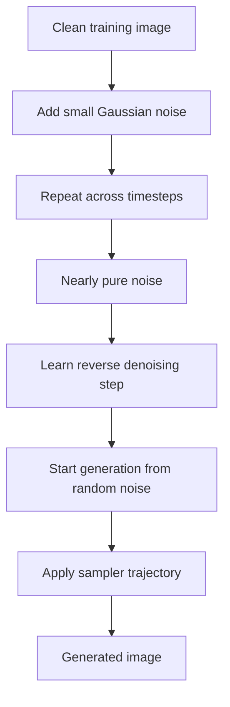
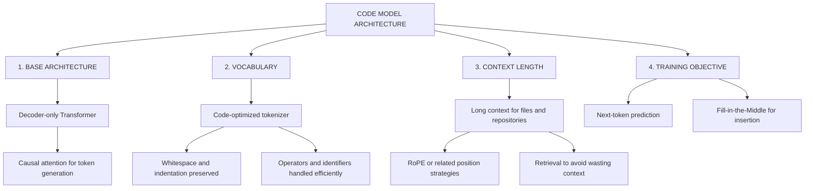
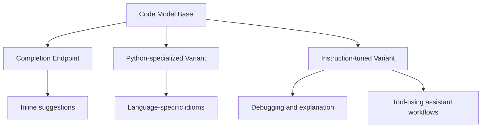
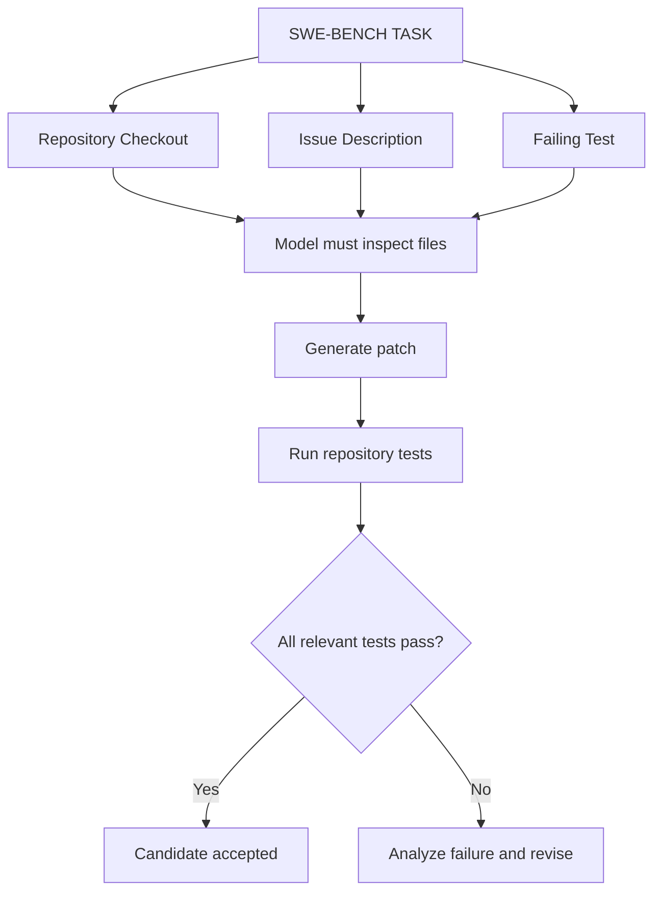
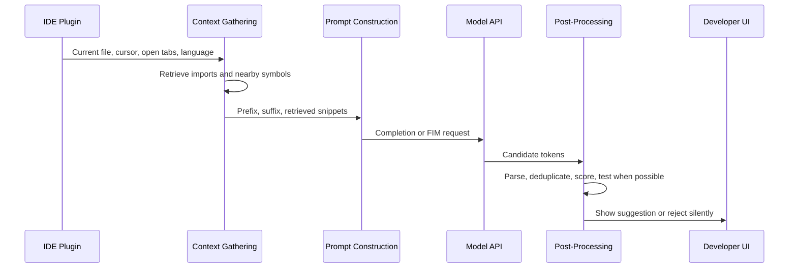
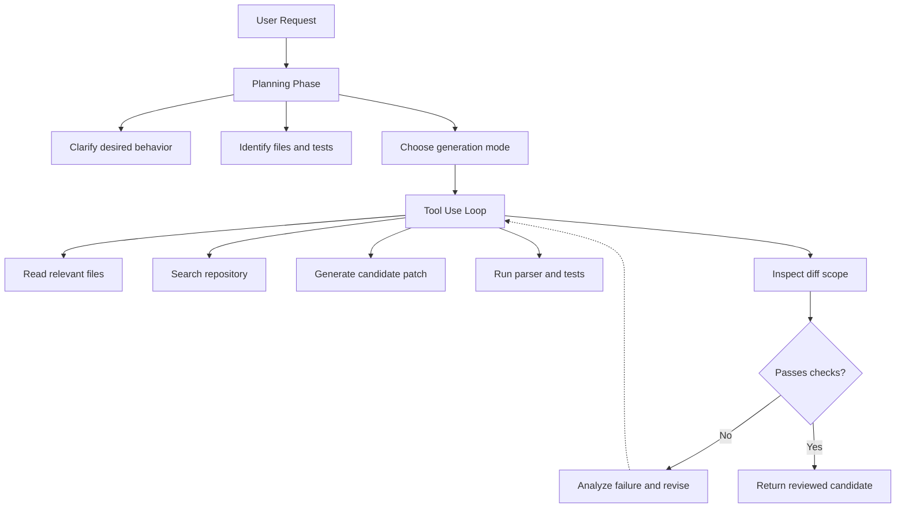

> **AI/ML Engineering Track** | Complexity: `[COMPLEX]` | Time: 6-8 hours

---

**Prerequisites**: Generative AI foundations, transformer attention, basic Kubernetes deployments, Python virtual environments, and introductory model-serving concepts.

---

## Learning Outcomes

By the end of this module, you will be able to:

- **Diagnose** latency, quality, and resource trade-offs between DDPM, DDIM, latent diffusion, and transformer-based diffusion serving pipelines.
- **Design** a Kubernetes v1.35+ inference deployment that accounts for GPU scheduling, model loading, memory pressure, and licensing constraints.
- **Compare** continuous-space diffusion generation with discrete autoregressive code generation, including why code requires stronger validation than natural language output.
- **Evaluate** code generation systems using execution-based metrics, repository-aware context retrieval, FIM prompting, speculative decoding, and syntax-constrained decoding.
- **Implement** small runnable prototypes that construct FIM prompts, estimate Pass at K, search repository context, and validate deployment manifests before production use.

---

## Why This Module Matters

A staff engineer at a media company receives an urgent incident report from the content platform team. Their new generative image service is producing beautiful campaign images during demos, but it cannot survive real traffic. Some requests take almost a minute, GPU memory spikes unpredictably, and the legal team has just discovered that the model selected during prototyping may not be licensed for commercial use. The service is technically impressive, but the deployment is unsafe because the team treated generative AI as a black box instead of an engineered system.

On the same week, another team ships an AI-assisted code review bot. It catches a few small style issues, then misses a generated SQL injection and confidently suggests an API method that does not exist in the production SDK. The failure is not that the model is useless. The failure is that the platform did not validate generated code through execution, did not provide repository context, and did not constrain output where syntax mattered. A generative model can accelerate engineering, but only when its architecture, context boundary, and validation loop are explicit.

Diffusion models and code generation systems look different on the surface. One starts from noise and denoises continuous latent states into images. The other predicts discrete tokens under strict syntax, type, and repository constraints. For an AI/ML engineer, the shared skill is architectural reasoning: identify what the model is allowed to know, what it is optimizing, where it can fail, and what guardrails convert a clever demo into a dependable system.

This module teaches diffusion from the beginner mental model to the senior production trade-offs. It then connects that understanding to advanced code generation architecture because modern generative platforms often serve both media and code workflows under the same reliability, cost, and governance constraints. You will practice reading model behavior as an engineering system rather than a magic endpoint.

---

## Section 1: From Noise to Images

Diffusion models generate continuous data by learning how to reverse a corruption process. The forward process adds small amounts of Gaussian noise to a real image over many timesteps until the image becomes nearly indistinguishable from random static. The reverse process trains a neural network to predict the noise added at each step, so generation can begin from random noise and repeatedly denoise toward a coherent sample. This framing matters because it makes image generation a controlled sequence of small corrections rather than a single attempt to draw an entire image at once.

A useful beginner analogy is restoration rather than drawing. Imagine a photo editor who receives a heavily damaged image and removes a tiny amount of distortion at a time. If the editor has seen enough examples, each correction becomes locally plausible, and the sequence of corrections eventually produces a globally coherent image. Diffusion models automate that restoration process, except the initial image is pure noise and the learned denoiser carries the statistical memory of the training data.

The original DDPM formulation made this idea practical and high quality, but it also exposed a production problem. Sampling with a traditional DDPMScheduler may require hundreds or thousands of model evaluations for one image. That is acceptable for research evaluation and offline generation, but it becomes expensive when a product team needs interactive latency, predictable GPU occupancy, or high request throughput. The first production lesson is that model quality and sampler cost must be evaluated together.

DDIM changes the sampling path while preserving the same training objective. Instead of walking through every small Markovian step, a DDIM sampler can take fewer, more deterministic jumps through the denoising trajectory. This is why teams often compare DDPM-style sampling against DDIM or modern solver schedulers before committing to a serving plan. The base neural network may be the same, but the scheduler can decide whether the product feels instant or unusable.



> **Stop and think**: If two pipelines use the same trained denoising network but different schedulers, which user-visible properties can change without retraining the model?

Pixel-space diffusion is conceptually simple but operationally expensive. A 512x512 RGB image already contains many values, and increasing resolution multiplies the denoising workload. When generation runs directly in pixel space, memory and compute grow quickly because the network must process large spatial tensors at every timestep. This is the reason high-resolution diffusion did not become practical simply by making pixel UNets larger.

Latent Diffusion Models solve this by moving generation into a compressed representation. A pretrained autoencoder maps the image into a smaller latent tensor, the diffusion model denoises inside that latent space, and the decoder maps the final latent back into pixels. The denoising model still learns image structure, but it does so in a space that is much cheaper to process. This is the architectural shift that made Stable Diffusion-style systems practical for many teams.

The compression does not remove all difficulty. Latent diffusion still needs strong conditioning to follow prompts, maintain composition, and render fine details. Text conditioning usually enters through attention layers, where image latents can attend to encoded prompt representations. Classifier-Free Guidance, often configured through a `guidance_scale`, strengthens prompt adherence by comparing conditional and unconditional predictions. A low guidance value can produce diverse but loosely aligned results; a very high value can overfit the prompt and harm visual quality.

> **Pause and predict**: If a team doubles target image width and height but keeps the same GPU and scheduler, what failure mode appears first: licensing risk, syntax failure, VRAM pressure, or missing repository context? Explain why before reading further.

Stable Diffusion 3 Medium adds another architectural layer by using a Multimodal Diffusion Transformer rather than the older UNet-centered design. Separate weights for image and text representations allow stronger multimodal reasoning, especially for layout and typography, but the operational story remains the same: model size, memory behavior, license terms, and inference latency must be designed together. A senior engineer does not ask only whether the model can generate a good sample. They ask whether it can generate a good sample legally, repeatedly, observably, and within the product's latency budget.

| Diffusion Stage | What It Does | Engineering Risk | Production Control |
|---|---|---|---|
| Forward noising | Corrupts training images into noise | Mostly training-side complexity | Dataset governance and training configuration |
| Reverse denoising | Predicts noise to remove at each step | High inference cost | Scheduler choice and step budget |
| Latent encoding | Compresses pixels into smaller tensors | Detail loss if compression is poor | Autoencoder selection and resolution testing |
| Text conditioning | Injects prompt meaning into generation | Weak prompt adherence or overguidance | Prompt design and guidance scale |
| Decoding | Converts final latents back to pixels | Artifacts and memory spikes | Batch size, precision, and offloading |

The important pattern is progressive control. First you learn the denoising mechanism, then the sampler, then the latent representation, then the conditioning path, and finally the deployment envelope. Each layer gives you a lever, but each lever also creates a way to misuse the system. That is why diffusion engineering is less about memorizing model names and more about matching architecture to constraints.

---

## Section 2: Serving Diffusion Models on Kubernetes

A diffusion model becomes a production system only after it is wrapped in reliable serving infrastructure. Kubernetes does not understand model quality, prompt adherence, or denoising trajectories by default. It schedules containers, reserves resources, applies health checks, and restarts failed pods. Your job is to translate model requirements into scheduling and runtime constraints that the cluster can enforce.

The most common mistake is to treat GPU allocation as if it were the same as CPU allocation. A manifest can request `nvidia.com/gpu: "1"` through a device plugin, but GPU memory behavior depends on the model, runtime, precision, batching strategy, and any sharing mechanism such as MIG or time slicing. A pod can be scheduled correctly and still fail during model load because the weights, activation memory, and safety margin exceed the available VRAM. For diffusion, readiness should mean "model loaded and one small inference path tested," not merely "HTTP server process started."

```yaml
apiVersion: apps/v1
kind: Deployment
metadata:
  name: sd3-diffusers-api
  namespace: ai-inference
  labels:
    app: diffusion-api
spec:
  replicas: 2
  selector:
    matchLabels:
      app: diffusion-api
  template:
    metadata:
      labels:
        app: diffusion-api
    spec:
      containers:
        - name: diffusers-worker
          image: internal-registry/diffusers-api:v0.37.1
          ports:
            - containerPort: 8080
          env:
            - name: MODEL_ID
              value: "stabilityai/stable-diffusion-3-medium-diffusers"
            - name: HF_HOME
              value: "/models/cache"
          resources:
            requests:
              cpu: "4"
              memory: "16Gi"
              nvidia.com/gpu: "1"
            limits:
              memory: "32Gi"
              nvidia.com/gpu: "1"
          readinessProbe:
            httpGet:
              path: /ready
              port: 8080
            initialDelaySeconds: 30
            periodSeconds: 10
          livenessProbe:
            httpGet:
              path: /healthz
              port: 8080
            initialDelaySeconds: 60
            periodSeconds: 20
```

This manifest is intentionally conservative. It separates readiness from liveness, requests enough CPU for preprocessing and tokenization, and makes model identity explicit. In a real platform, you would also pin image digests, mount model caches, configure node selectors or tolerations for GPU nodes, and expose observability signals for queue length, GPU memory, request duration, and generation failures. The deployment is not just a way to start a container; it is a contract between ML behavior and cluster scheduling.

Kubernetes v1.35+ gives you the primitives, but the inference service still needs application-level discipline. The container should load the model during startup, reject traffic until warm, and report readiness only after a minimal generation path succeeds. If the service uses half precision, CPU offload, quantization, or attention slicing, those choices should be recorded in configuration rather than hidden in ad hoc startup code. A future incident responder needs to know why the same model behaves differently across staging and production.

The `kubectl` command is the standard Kubernetes CLI. In this module's exercise, after showing the full command once, you may define `alias k=kubectl` in your shell and use `k` for shorter dry-run checks. The alias is only a convenience; the important habit is validating manifests before applying them to a live cluster.

```bash
kubectl apply --dry-run=client -f diffusers-deployment.yaml
alias k=kubectl
k get deployment sd3-diffusers-api -n ai-inference
```

| Serving Concern | Why It Matters | Practical Check |
|---|---|---|
| GPU scheduling | The pod must land on a node with compatible GPU resources | Confirm device plugin advertises allocatable GPUs |
| VRAM headroom | Model weights and activations can exceed available memory | Load the model before readiness succeeds |
| Cold start | First request may include model download or compilation cost | Warm the model during startup |
| License control | Some models restrict commercial use | Track model license before deployment approval |
| Prompt safety | Generated images may violate policy or brand constraints | Add moderation, logging, and review workflows |
| Latency budget | Too many denoising steps can break product UX | Test scheduler and step count under load |

A production diffusion platform should also distinguish offline batch generation from interactive serving. Batch generation can tolerate longer queue times, larger images, and more expensive samplers because users are not waiting in an editor. Interactive serving needs tight timeouts, cancellation, progress feedback, and strict step budgets. When teams mix these workloads in one deployment, batch jobs often consume GPU capacity and make interactive requests unreliable.

---

## Section 3: The Discrete Realm of Code Generation

Diffusion models operate over continuous values where small errors may be visually tolerable. Code generation operates over discrete tokens where one missing comma, colon, import, or indentation level can make the output invalid. This changes the engineering problem completely. A generated image can be slightly imperfect and still useful; generated code must parse, type check, execute, satisfy tests, and integrate with the surrounding repository.

```python
# Natural language is forgiving.
request = "make a function that adds numbers"

# Code is not forgiving.
def add(a b):
    return a + b
```

The second example fails before business logic can even be evaluated. This is why string similarity is weak evidence for code quality. A generated function can look nearly identical to a reference solution and still fail because of syntax, imports, mutation behavior, or edge cases. The output space is smaller than natural language in some ways, but the constraints are much sharper.

Code generation also depends on long-range context. A model completing a function may need the class fields defined above, helper functions in another file, project-specific error types, and conventions used by neighboring modules. A human developer follows imports and reads the repository. A model sees only the prompt and tool context you provide. If you omit the relevant signature, the model may invent a plausible helper that does not exist.

```python
class DataProcessor:
    def __init__(self, config):
        self.config = config

    def process(self, rows):
        threshold = self.config.threshold
        return [row for row in rows if row.score >= threshold]
```

A completion inside `process` must preserve `self.config.threshold`, the expected shape of `rows`, and the return type implied by callers. The model cannot infer project invariants from the filesystem unless your system retrieves and injects them. This is the foundation of repository-aware generation: prompt construction is not decoration; it is part of the model's effective architecture.



Standard autoregressive generation is left-to-right. That works when a model appends code to the end of a file, but it breaks down when a developer places a cursor inside an existing function. The missing code must agree with the prefix above and the suffix below. Fill-in-the-Middle training addresses this by presenting the model with prefix and suffix context while asking it to generate the middle span.

```python
def calculate_average(numbers):
    total = sum(numbers)
    count = len(numbers)
    return total / count
```

Suppose you need to insert validation between the signature and `total = sum(numbers)`. A naive completion sees only the prefix and may return code that conflicts with the later variables. A FIM prompt gives the model both sides of the gap, which makes insertion behavior much more reliable.

```text
<fim_prefix>def calculate_average(numbers):
    <fim_suffix>
    total = sum(numbers)
    count = len(numbers)
    return total / count
<fim_middle>
```

The exact control tokens vary by model family, so production systems must treat FIM formatting as model-specific configuration. A DeepSeek-style model, a Code Llama-style model, and a vendor-hosted code model may not use identical tokens or ordering. Hard-coding one token scheme across every backend is a subtle integration bug. The generation client should know which format each model expects and should test that the model actually inserts rather than appends.

```python
def build_fim_prompt(prefix: str, suffix: str, family: str) -> str:
    if family == "generic_psm":
        return f"<fim_prefix>{prefix}<fim_suffix>{suffix}<fim_middle>"
    if family == "suffix_prefix_middle":
        return f"<fim_suffix>{suffix}<fim_prefix>{prefix}<fim_middle>"
    raise ValueError(f"Unsupported FIM family: {family}")
```

> **Active check**: In a code editor, what should happen if the suffix contains `return result` but the model generates `return total` in the middle? Decide whether this is a syntax failure, context failure, or test failure, then justify your classification.

```mermaid
flowchart TD
    Y2020[2020] --> GPT3[GPT-3: General model with code ability]
    Y2021[2021] --> Codex[Codex: Dedicated code model]
    Y2021 --> CodeParrot[CodeParrot: Open code modeling attempt]
    Y2022[2022] --> InCoder[InCoder: Open FIM-capable model]
    Y2022 --> SantaCoder[SantaCoder: Compact code model]
    Y2023[2023] --> StarCoder[StarCoder: Open multilingual code model]
    Y2023 --> CodeLlama[Code Llama: Larger open code family]
    Y2024[2024] --> DeepSeek[DeepSeek Coder: Strong open code family]
    Y2024 --> StarCoder2[StarCoder2: Updated BigCode family]
    Y2024 --> Codestral[Codestral: Code-specialized model]
```



Instruction tuning changes the interface again. A base model may be strong at continuation but weak at following natural language requests. An instruction-tuned model can explain, refactor, and debug conversationally, but may sometimes be less predictable for raw completion. Senior platform teams separate these modes: one endpoint for low-latency inline completion, another for chat-style reasoning, and another for repository-scale agentic work.



| Model Family | Typical Strength | Typical Weakness | Best Fit |
|---|---|---|---|
| Base code model | Fast continuation and FIM insertion | Poor conversational instruction following | IDE ghost text |
| Instruction-tuned code model | Explains and follows task requests | May produce verbose or overbroad patches | Chat and debugging |
| Repository agent | Can inspect files and run tests | Needs careful permissions and verification | Issue resolution |
| Small draft model | Low latency token proposals | Lower standalone accuracy | Speculative decoding |
| Grammar-constrained model | Strong syntax validity | Can still be semantically wrong | Config and code skeleton generation |

This distinction prevents a common architecture mistake. Teams often ask one model endpoint to be an IDE completer, code reviewer, autonomous agent, test writer, and documentation generator. These workflows need different context windows, latency budgets, output constraints, and validation loops. A platform that separates them can make each one safer.

---

## Section 4: Evaluating Generated Code

Generated code should be evaluated by behavior, not surface similarity. Natural language metrics such as BLEU and ROUGE measure token overlap, which is not the same as correctness. In software, the decisive question is whether the output compiles, passes tests, respects types, avoids vulnerabilities, and fits the repository architecture. Execution is expensive, but it is the strongest available signal.

HumanEval-style tasks introduced a useful pattern: provide a function prompt and hidden tests, generate multiple candidates, and measure whether at least one passes. Pass at K captures the probability that a developer sees a correct solution among several sampled candidates. This matters because sampling temperature can produce diversity, and a single greedy output may underestimate a model's practical usefulness.

```python
from math import prod

def estimate_pass_at_k(n: int, c: int, k: int) -> float:
    """Estimate Pass at K with the standard unbiased estimator."""
    if n <= 0:
        raise ValueError("n must be positive")
    if c < 0 or c > n:
        raise ValueError("c must be between 0 and n")
    if k <= 0 or k > n:
        raise ValueError("k must be between 1 and n")
    if n - c < k:
        return 1.0
    terms = (1.0 - k / i for i in range(n - c + 1, n + 1))
    return 1.0 - prod(terms)
```

A high Pass at K score does not mean the model is production-ready. It means at least one sampled candidate often passes the available tests. If the tests are weak, the metric is weak. If the benchmark functions are tiny, the metric may not predict repository-scale performance. This is why SWE-bench-style evaluation is important: it asks the model to modify real projects with real dependencies, failing tests, and multi-file context.



Repository-scale evaluation introduces new failure modes. A patch may fix the provided failing test while breaking another subsystem. It may depend on an uncommitted generated artifact, modify unrelated files, or weaken an assertion to make tests pass. A serious evaluation harness must inspect the diff, run a relevant test suite, and reject changes that hide the failure rather than solving it. That is the same discipline you use for human contributors.

> **Stop and think**: If a model passes a tiny function benchmark but fails repeatedly on repository issues, what missing capability is most likely: syntax generation, retrieval, patch planning, or image denoising? Choose one and explain the evidence you would collect.

A practical model selection process therefore combines multiple signals. Use isolated tasks to measure algorithmic competence, repository tasks to measure navigation and patching, security scans to catch dangerous patterns, and human review to evaluate maintainability. No single benchmark is enough. The stronger the automation, the more important the review boundary becomes.

| Evaluation Layer | What It Measures | What It Misses | When To Use |
|---|---|---|---|
| Syntax parse | Whether output is structurally valid | Runtime behavior and security | Fast pre-checks |
| Unit tests | Local functional correctness | Missing test coverage | Candidate ranking |
| Pass at K | Probability of a passing sample | Maintainability and weak tests | Model comparison |
| SWE-bench style | Repository issue resolution | Product-specific conventions | Agent evaluation |
| Human review | Design, risk, and maintainability | Exhaustive execution paths | Production approval |

The key alignment is simple: if the product promises working code, assessment must execute code. If the product promises safe infrastructure manifests, assessment must validate manifests. If the product promises repository patches, assessment must run repository tests and inspect the diff. Evaluation should match the claim being made.

---

## Section 5: Building Code Generation Systems

A robust code generation system is a pipeline, not a single prompt. It starts with context gathering, selects the correct generation mode, constrains the output where possible, executes validation, and only then presents or applies the result. Each stage reduces a different class of failure. Context reduces hallucinated dependencies, FIM reduces insertion errors, speculative decoding reduces latency, grammar constraints reduce syntax errors, and execution checks reduce semantic mistakes.



The first implementation decision is whether the request is append, insert, explain, or patch. Append completion can use a prefix-only prompt. Insert completion should use FIM. Explanation should use an instruction-tuned model and include enough code to reason about. Patch generation should run in a workspace where the model can inspect files and tests. If you collapse these modes into one generic prompt, you make failures harder to diagnose.

```python
from dataclasses import dataclass

@dataclass
class CompletionRequest:
    prefix: str
    suffix: str
    language: str
    current_file: str
    mode: str

def construct_prompt(request: CompletionRequest) -> str:
    if request.mode == "insert":
        return f"<fim_prefix>{request.prefix}<fim_suffix>{request.suffix}<fim_middle>"
    if request.mode == "append":
        return request.prefix
    raise ValueError(f"Unsupported completion mode: {request.mode}")
```

> **Active check**: Before adding speculative decoding to this client, identify the invariant that must stay true. Should the final distribution match the draft model, the target model, or an average of both? Explain why this matters for correctness claims.

Repository context should be retrieved deliberately. A naive context builder that dumps thousands of lines into the prompt can trigger lost-in-the-middle behavior and waste tokens on irrelevant files. A better builder combines lexical signals, imports, symbol names, recently edited files, and semantic search. It should also preserve file paths because path names carry architectural meaning in real repositories.

```python
from pathlib import Path

class RepoContextBuilder:
    def __init__(self, repo_path: str):
        self.repo_path = Path(repo_path)

    def read_current_file(self, relative_path: str) -> str:
        path = self.repo_path / relative_path
        return path.read_text(encoding="utf-8")

    def collect_python_neighbors(self, relative_path: str, limit: int = 3) -> list[str]:
        current = self.repo_path / relative_path
        neighbors = []
        for candidate in current.parent.glob("*.py"):
            if candidate.name != current.name:
                neighbors.append(str(candidate.relative_to(self.repo_path)))
            if len(neighbors) >= limit:
                break
        return neighbors
```

A semantic search layer improves this by retrieving code based on meaning rather than only paths. The system chunks functions and classes, embeds them, and retrieves the snippets most related to the current task. The ranking layer should prefer same-directory files, imported modules, and recently edited files because those are often more relevant than globally similar examples. This is how modern IDE assistants build enough context without flooding the prompt.

```python
class CursorStyleRAG:
    def __init__(self, index):
        self.index = index

    def get_context(self, query: str, current_file: str) -> str:
        similar = self.index.search(query, k=10)
        ranked = sorted(
            similar,
            key=lambda item: (
                0 if item["file"].startswith(current_file.rsplit("/", 1)[0]) else 1,
                item["distance"],
            ),
        )
        return "\n\n".join(
            f"# File: {item['file']}\n{item['content']}"
            for item in ranked[:5]
        )
```

Speculative decoding is a latency optimization, not a license to accept lower-quality output. The draft model proposes several tokens quickly. The target model evaluates those proposed tokens in a batch and accepts only the prefix that is consistent with the target model's distribution. If tokens are rejected, the system samples from the target model. The final output should preserve the target model's distribution while reducing wall-clock time.

```python
def speculative_decode(prompt, draft_model, target_model, k=4, max_tokens=128):
    tokens = tokenize(prompt)

    while len(tokens) < max_tokens and not is_complete(tokens):
        draft_tokens = draft_model.generate(tokens, n=k)
        target_probs = target_model.get_probs(tokens, draft_tokens)

        accepted = []
        for token, probs in zip(draft_tokens, target_probs):
            if accept_token_under_target_distribution(token, probs):
                accepted.append(token)
            else:
                break

        tokens.extend(accepted)

        if len(accepted) < len(draft_tokens):
            tokens.append(target_model.sample_next(tokens))

    return detokenize(tokens)
```

> **Stop and think**: If the draft model is trained on outdated APIs, what must the verifier catch, and what will it not catch? Separate latency correctness from semantic correctness before designing the test.

Syntax-constrained decoding addresses a different problem. Standard decoding can choose any token with nonzero probability, including tokens that make the output impossible to parse. A constrained decoder masks invalid next tokens using a grammar or incremental parser, so every sampled token keeps the partial output syntactically valid. This is useful for JSON, YAML, SQL subsets, and code skeletons where parseability is non-negotiable.

```python
from lark import Lark, UnexpectedInput

class SyntaxConstrainedDecoder:
    def __init__(self, grammar_text: str):
        self.parser = Lark(grammar_text, parser="lalr")

    def valid_next_tokens(self, partial_text: str, candidate_tokens: list[str]) -> list[str]:
        valid = []
        for token in candidate_tokens:
            candidate = partial_text + token
            try:
                self.parser.parse(candidate)
                valid.append(token)
            except UnexpectedInput:
                if self._could_be_valid_prefix(candidate):
                    valid.append(token)
        return valid

    def _could_be_valid_prefix(self, candidate: str) -> bool:
        return bool(candidate.strip())
```

Constrained decoding does not guarantee correctness. A YAML manifest can parse perfectly and still request the wrong namespace, unsafe privileges, or a nonexistent image. A Python function can be syntactically valid and still return the wrong result. Constraints narrow the output space to syntactically acceptable candidates; tests and reviews still decide whether the candidate should ship.

> **Active check**: Your constrained decoder produces a valid Kubernetes Deployment, but the pod never becomes ready. List two checks that belong after syntax validation and explain which failure each check would catch.



Agentic code generation extends the pipeline by giving the model tools such as file search, shell commands, and patch editing. This raises the ceiling because the model can inspect a repository like a developer. It also raises the risk because the model can make broad changes, run expensive commands, or confuse generated artifacts with source files. Tool access must be scoped, auditable, and paired with diff review.

| Generation Control | Failure It Reduces | Failure It Does Not Solve | Senior Review Question |
|---|---|---|---|
| FIM prompting | Wrong insertion point | Incorrect algorithm | Did the suffix actually reach the model? |
| RAG context | Hallucinated internal APIs | Misused retrieved APIs | Were the right files retrieved? |
| Speculative decoding | High latency | Bad target model behavior | Does output still match target distribution? |
| Syntax constraints | Unparseable output | Wrong semantics | What semantic checks follow parsing? |
| Execution tests | Functional regressions | Untested vulnerabilities | Are the tests meaningful enough? |
| Human review | Design and maintainability risk | Exhaustive state exploration | Is the diff scoped and explainable? |

The strongest systems combine these controls instead of treating them as alternatives. For example, an IDE insertion workflow might use RAG to retrieve local symbols, FIM to place the code correctly, speculative decoding to keep latency low, syntax parsing to reject broken candidates, and a lightweight test runner for generated unit tests. Each layer has a job. When a layer is missing, the failure mode should be predictable.

---

## Section 6: Practical Economics, Governance, and Future Direction

Generative AI systems are expensive in more than token cost. They consume GPU capacity, engineering attention, legal review, security review, benchmark maintenance, and incident response time. A model that looks cheaper per request can become expensive if it produces unreviewable patches, requires constant retries, or forces engineers to debug false confidence. A senior platform decision compares total workflow cost, not only vendor pricing.

For diffusion, the economic levers are image resolution, batch size, scheduler steps, precision, hardware selection, and whether generation is interactive or queued. For code generation, the levers are context size, model tier, sampling strategy, tool use, test execution, and review time. The same organization may decide to host a smaller completion model internally, use a vendor model for complex reasoning, and run diffusion workloads on a separate GPU pool with stricter governance.

| Cost Driver | Diffusion Example | Code Generation Example | Optimization Lever |
|---|---|---|---|
| Compute intensity | Many denoising steps per image | Large model decoding long responses | Scheduler tuning or model routing |
| Context size | Prompt and image conditions | Repository snippets and open tabs | Retrieval ranking and truncation |
| Validation | Image safety and brand review | Tests, linters, security scans | Automated gates before human review |
| Latency target | Interactive image editor | IDE ghost text | Smaller models and speculative decoding |
| Governance | Model license and dataset risk | Code license and secret leakage | Policy checks and audit logs |

The legal layer is especially important for image models. Stable Diffusion 3 Medium has licensing constraints that must be reviewed before commercial deployment. The engineering team may be able to run the model technically while the business is not allowed to use its outputs commercially. Treat model licenses like dependency licenses: record them, review them, and block deployment when the usage rights do not match the product.

Code generation has its own governance hazards. Prompts may include proprietary source code, secrets, customer data, or unreleased architecture. Generated patches may reproduce insecure patterns from training data or from the current repository. A platform should log enough metadata to audit behavior without storing sensitive prompt contents unnecessarily. Security posture must be designed before broad rollout, not after the first incident.

A useful operating model is "generate, validate, review, then apply." For low-risk completions, validation may be parse checks and developer acceptance. For production patches, validation should include tests, linters, diff scope checks, and human review. For infrastructure manifests, validation should include schema checks, policy checks, dry runs, and environment-specific review. The higher the blast radius, the stronger the gate.

```text
Generate candidate
Validate syntax and schema
Run behavior checks
Inspect security and license risk
Review diff or output
Apply only after the gate passes
```

The future direction is not one universal model that does everything. The direction is composed systems: specialized models, retrieval systems, constrained decoders, schedulers, agents, policy engines, and evaluation harnesses working together. Diffusion and code generation are both examples of this pattern. The model is the core engine, but the surrounding architecture decides whether the engine is safe enough to use.

---

## Did You Know?

- The DDPM paper, submitted on 2020-06-19, established a major quality jump for diffusion generation by learning to reverse a gradual Gaussian noising process.
- DDIM, submitted on 2020-10-06, showed that sampling could be accelerated by changing the reverse trajectory without retraining the underlying diffusion model.
- Latent Diffusion Models reduce inference cost by denoising compressed latent representations rather than full-resolution pixel tensors.
- Fill-in-the-Middle training lets code models use both prefix and suffix context, which is why modern IDE insertion can work inside an existing function body.

---

## Common Mistakes

| Mistake | Why It Fails | Fix |
|---|---|---|
| Using a slow diffusion scheduler for interactive APIs | A research-friendly step count can produce unacceptable latency under real traffic. | Benchmark DDIM or solver schedulers against the product latency and quality target. |
| Treating GPU requests as full isolation | A scheduled GPU does not automatically guarantee VRAM headroom or tenant isolation. | Validate model load, use appropriate device-plugin policies, and test under concurrent traffic. |
| Deploying a restricted image model commercially | The service may be technically functional but legally unusable for the product. | Review model licenses before deployment and record approved usage terms. |
| Ignoring FIM suffix context | The model appends code or generates logic that conflicts with lines below the cursor. | Construct model-specific FIM prompts and test insertion behavior for each backend. |
| Assuming RAG context is always helpful | Irrelevant snippets can bury important information and trigger lost-in-the-middle failures. | Rank by imports, path locality, symbols, and recency, then keep context compact. |
| Misusing speculative decoding as a quality upgrade | A draft model can accelerate generation, but it does not make the target model more correct. | Verify that acceptance preserves the target distribution and keep semantic tests after decoding. |
| Relying only on syntax-constrained decoding | Parseable code or YAML can still be semantically wrong, insecure, or operationally invalid. | Follow constraints with type checks, unit tests, schema validation, policy checks, and review. |
| Reporting BLEU or ROUGE as code accuracy | Token overlap does not prove compilation, execution, security, or repository fit. | Use execution-based metrics such as Pass at K and repository-scale task evaluation. |

The most dangerous mistakes share one pattern: the team validates the wrong layer. A syntax checker cannot prove business logic. A unit test cannot prove licensing. A GPU request cannot prove readiness. A benchmark score cannot prove maintainability. Senior ML engineering means matching each risk to the correct control.

```python
# WRONG: accepts generated SQL because it looks plausible.
def get_user_data(user_id):
    return db.query(f"SELECT * FROM users WHERE id = {user_id}")

# RIGHT: reviews and repairs the generated code before use.
def get_user_data(user_id: int) -> dict:
    return db.query("SELECT * FROM users WHERE id = ?", (user_id,))
```

```python
# WRONG: assumes the model knows the repository's service layer.
user = create_user(data)

# RIGHT: provides context that points to the actual project abstraction.
user = user_service.create(data)
```

```python
# WRONG: tests only the happy path of a generated function.
def test_calculate_discount():
    assert calculate_discount(100, 10) == 90

# RIGHT: adds boundary and failure-path coverage.
def test_calculate_discount_edge_cases():
    assert calculate_discount(0, 50) == 0
    assert calculate_discount(100, 0) == 100
    with pytest.raises(ValueError):
        calculate_discount(-100, 10)
```

---

## Quiz

<details>
<summary><strong>Question 1: Your team moves a diffusion demo into an interactive product, and image quality is good but median latency is far above the UI budget. How do you diagnose the likely architecture issue and what change would you test first?</strong></summary>

Start by checking the scheduler and inference step count because the denoising trajectory directly controls how many model evaluations run per image. If the service is using a DDPM-style scheduler with a large step count, test DDIM or a modern solver scheduler with an explicit latency budget. Compare output quality, prompt adherence, and GPU utilization rather than changing the model weights first.

</details>

<details>
<summary><strong>Question 2: A Kubernetes diffusion pod is scheduled on a GPU node, but readiness never succeeds because the process exits during startup. What should you inspect before changing replica count?</strong></summary>

Inspect model load behavior, VRAM usage, precision settings, and whether the requested GPU resource provides enough usable memory for the model and activation overhead. Replica count will not fix a pod that cannot load one model instance. The readiness probe should only pass after a minimal inference path succeeds, so startup failure points to resource, image, cache, or runtime configuration problems.

</details>

<details>
<summary><strong>Question 3: An IDE completion system uses a strong code model, but insertion inside existing functions often ignores variables below the cursor. What prompt architecture change should you make?</strong></summary>

Use Fill-in-the-Middle prompting with the correct model-specific prefix, suffix, and middle control tokens. The suffix must include the code below the cursor so the model can generate a middle span that agrees with later variables and return statements. After adding FIM, test that the model inserts rather than appends.

</details>

<details>
<summary><strong>Question 4: A code model scores well on isolated benchmark functions but performs poorly when asked to fix real repository bugs. Which evaluation gap does this reveal?</strong></summary>

It reveals that isolated execution benchmarks are not measuring repository navigation, dependency understanding, patch planning, or multi-file integration. Add repository-scale evaluation, such as SWE-bench-style tasks, where the model must inspect files, modify the right locations, and pass relevant tests. Keep HumanEval-style metrics as one signal, not the production readiness decision.

</details>

<details>
<summary><strong>Question 5: Your platform adds speculative decoding and sees lower latency, but a reviewer claims the smaller draft model may reduce correctness. How do you evaluate that claim?</strong></summary>

The reviewer is right to ask, but speculative decoding should preserve the target model's distribution when implemented correctly. Verify that the target model accepts or rejects draft tokens according to the intended algorithm and samples from the target when rejection occurs. Then run the same semantic tests as before, because latency optimization does not remove the need for execution validation.

</details>

<details>
<summary><strong>Question 6: A generated Kubernetes manifest always parses as YAML but still fails cluster policy and never creates a healthy workload. Why did syntax-constrained decoding not solve the problem?</strong></summary>

Syntax-constrained decoding only guarantees that the token sequence remains parseable under a grammar or parser. It does not prove that the image exists, resource requests are appropriate, security policy is satisfied, or readiness checks reflect real application health. Follow syntax constraints with schema validation, policy checks, dry runs, and environment-specific review.

</details>

<details>
<summary><strong>Question 7: A product manager wants to use Stable Diffusion 3 Medium outputs in paid customer campaigns because the prototype works locally. What nontechnical gate must the engineering team enforce before production use?</strong></summary>

The team must enforce license review and confirm that the intended commercial use is permitted. A model can be technically deployable while legally restricted. Engineering should record the approved model identifier, license terms, and usage scope before allowing the deployment into a commercial workflow.

</details>

<details>
<summary><strong>Question 8: Your generated unit tests increase coverage numbers but miss edge cases and security regressions. How should you redesign the validation workflow?</strong></summary>

Treat generated tests as candidates rather than proof. Review whether they cover boundary values, invalid inputs, failure paths, security-sensitive behavior, and project-specific invariants. Combine generated tests with human review, existing regression tests, static analysis, and targeted scenarios derived from the code's real risk.

</details>

---

## Hands-On Exercise: Build and Validate a Small GenAI Pipeline

In this exercise, you will build small local components that mirror production generative AI controls. The goal is not to call a massive model. The goal is to practice the architecture around the model: FIM prompt construction, execution-based scoring, context retrieval, constrained validation thinking, and Kubernetes dry-run checks.

### Task 1: Prepare a Local Python Environment

Create a local virtual environment and install only the packages needed for the runnable examples. The commands below use the virtual environment explicitly so the lab does not depend on whichever interpreter happens to appear first in your shell path.

```bash
python -m venv .venv
.venv/bin/python -m pip install --upgrade pip
.venv/bin/python -m pip install numpy pytest lark
.venv/bin/python -c "import numpy, pytest, lark; print('ready')"
```

Success criteria:

- [ ] The virtual environment exists at `.venv`.
- [ ] The package import check prints `ready`.
- [ ] You can explain why relying on an arbitrary global interpreter would make results less reproducible.

### Task 2: Implement a FIM Prompt Builder

Create a file named `fim_task.py` and implement a function that switches between append completion and insertion completion. The worked example below shows the expected behavior before you implement the same pattern in your own code.

```bash
cat << 'EOF' > fim_task.py
def simple_completer(prefix: str, suffix: str = "") -> str:
    if suffix:
        return f"<fim_prefix>{prefix}<fim_suffix>{suffix}<fim_middle>"
    return prefix

if __name__ == "__main__":
    prefix_code = "def add(a, b):\n    "
    suffix_code = "\n    return result"
    print(simple_completer(prefix_code, suffix_code))
EOF

.venv/bin/python fim_task.py
```

Now modify the script to support two families: `generic_psm` and `suffix_prefix_middle`. Raise `ValueError` for unsupported families. This mirrors a real platform where different model backends may use different FIM token ordering.

Success criteria:

- [ ] `generic_psm` returns prefix, suffix, then middle token ordering.
- [ ] `suffix_prefix_middle` returns suffix, prefix, then middle token ordering.
- [ ] Unsupported families fail clearly instead of silently producing the wrong prompt.
- [ ] You can explain why FIM is needed for insertion but not for simple append completion.

<details>
<summary>One possible solution</summary>

```python
def build_fim_prompt(prefix: str, suffix: str = "", family: str = "generic_psm") -> str:
    if not suffix:
        return prefix
    if family == "generic_psm":
        return f"<fim_prefix>{prefix}<fim_suffix>{suffix}<fim_middle>"
    if family == "suffix_prefix_middle":
        return f"<fim_suffix>{suffix}<fim_prefix>{prefix}<fim_middle>"
    raise ValueError(f"Unsupported FIM family: {family}")
```

</details>

### Task 3: Implement Pass at K

Create `evaluate_task.py` and implement the unbiased Pass at K estimator. This task practices the evaluation logic used when a model generates several candidate programs and the harness checks whether at least one passes.

```bash
cat << 'EOF' > evaluate_task.py
from math import prod

def estimate_pass_at_k(n: int, c: int, k: int) -> float:
    if n <= 0:
        raise ValueError("n must be positive")
    if c < 0 or c > n:
        raise ValueError("c must be between 0 and n")
    if k <= 0 or k > n:
        raise ValueError("k must be between 1 and n")
    if n - c < k:
        return 1.0
    return 1.0 - prod(1.0 - k / i for i in range(n - c + 1, n + 1))

if __name__ == "__main__":
    print(f"{estimate_pass_at_k(n=20, c=18, k=10):.4f}")
EOF

.venv/bin/python evaluate_task.py
```

Add at least three assertions for edge cases. Include one case where all candidates are correct, one where no candidates are correct, and one where invalid input raises an exception.

Success criteria:

- [ ] The estimator returns a float between `0.0` and `1.0`.
- [ ] Invalid `n`, `c`, or `k` values raise `ValueError`.
- [ ] You can explain why Pass at K is stronger than string similarity for generated code.
- [ ] You can also explain why Pass at K is not enough when tests are weak.

### Task 4: Build a Tiny Repository Context Searcher

Create a small context searcher that indexes Python files and returns snippets whose text contains query terms. This is intentionally simpler than vector search, but it teaches the control boundary: a model only benefits from context that the system retrieves and includes.

```bash
cat << 'EOF' > search_task.py
from pathlib import Path

class CodeSearchEngine:
    def __init__(self):
        self.index = []

    def index_repository(self, repo_path: str):
        self.index.clear()
        for path in Path(repo_path).rglob("*.py"):
            text = path.read_text(encoding="utf-8")
            self.index.append({"file": str(path), "content": text})

    def search(self, query: str, k: int = 5):
        terms = [term.lower() for term in query.split()]
        scored = []
        for item in self.index:
            text = item["content"].lower()
            score = sum(1 for term in terms if term in text)
            if score:
                scored.append((score, item))
        scored.sort(key=lambda pair: pair[0], reverse=True)
        return [item for _, item in scored[:k]]

if __name__ == "__main__":
    engine = CodeSearchEngine()
    engine.index_repository(".")
    for result in engine.search("fim prompt", k=3):
        print(result["file"])
EOF

.venv/bin/python search_task.py
```

Improve the ranking so files in the same directory as `current_file` are preferred when scores tie. This is a practical approximation of path-local relevance in real code assistants.

Success criteria:

- [ ] The indexer reads Python files from a repository path.
- [ ] Search returns no more than `k` results.
- [ ] Same-directory files win ties when `current_file` is provided.
- [ ] You can explain how this toy search differs from embedding-based RAG.

### Task 5: Validate a Diffusion Deployment Manifest

Create a Kubernetes manifest for the diffusion service and run a client-side dry run. If you have `kubectl` installed, define the `k` alias after the first full command and use it for the second check.

```bash
cat << 'EOF' > diffusers-deployment.yaml
apiVersion: apps/v1
kind: Deployment
metadata:
  name: sd3-diffusers-api
  namespace: ai-inference
  labels:
    app: diffusion-api
spec:
  replicas: 2
  selector:
    matchLabels:
      app: diffusion-api
  template:
    metadata:
      labels:
        app: diffusion-api
    spec:
      containers:
        - name: diffusers-worker
          image: internal-registry/diffusers-api:v0.37.1
          ports:
            - containerPort: 8080
          resources:
            requests:
              cpu: "4"
              memory: "16Gi"
              nvidia.com/gpu: "1"
            limits:
              memory: "32Gi"
              nvidia.com/gpu: "1"
EOF

kubectl apply --dry-run=client -f diffusers-deployment.yaml
alias k=kubectl
k apply --dry-run=client -f diffusers-deployment.yaml
```

If you do not have `kubectl` locally, read the manifest and identify what the client-side dry run would validate. Then identify two things it would not validate, such as GPU availability or model license approval.

Success criteria:

- [ ] The manifest has valid Kubernetes object structure.
- [ ] GPU, CPU, and memory requests are explicit.
- [ ] You can distinguish client-side schema validation from runtime readiness.
- [ ] You can name the license review required before commercial SD3 Medium deployment.

### Task 6: Design the Production Gate

Write a short design note named `genai_gate_notes.md`. It should describe the validation stages you would require before a generated image or generated code patch reaches production. Keep the note concrete: name the check, the failure it catches, and the system that enforces it.

Success criteria:

- [ ] The note includes at least one diffusion-specific control.
- [ ] The note includes at least one code-generation-specific control.
- [ ] The note distinguishes syntax validation from semantic validation.
- [ ] The note explains where human review remains necessary.

---

## Next Module

**Up Next**: [Module 1.5: Building AI Agents](/ai-ml-engineering/frameworks-agents/module-1.5-building-ai-agents/) — Learn how generative models are wrapped in autonomous control loops that inspect files, run tools, plan changes, and verify results.

## Sources

- [Denoising Diffusion Probabilistic Models](https://arxiv.org/abs/2006.11239) — This is the foundational DDPM paper for the forward/reverse diffusion process and the original CIFAR-10 results.
- [High-Resolution Image Synthesis with Latent Diffusion Models](https://arxiv.org/abs/2112.10752) — This is the primary source for why latent-space diffusion reduces compute while preserving quality and enabling flexible conditioning.
- [Diffusers Stable Diffusion 3 Pipeline Docs](https://huggingface.co/docs/diffusers/api/pipelines/stable_diffusion/stable_diffusion_3) — This is the practical implementation reference for SD3 inference, guidance behavior, and memory/offloading considerations.
