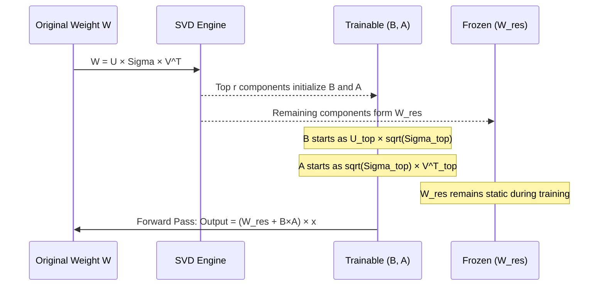

> **AI/ML Engineering Track** | NEW 2026 module
>
> **Topic**: Modern PEFT beyond standard LoRA — Weight-Decomposed Low-Rank Adaptation (DoRA) and Principal Singular values and Singular vectors Adaptation (PiSSA). Near full-parameter performance with the parameter budget of PEFT. Practical fine-tuning workflows, when to choose each method, integration with Hugging Face PEFT, and VRAM/compute tradeoffs.

## Learning Outcomes

After completing this module, you will be able to meet the following goals.

1. **Evaluate** the mathematical and operational differences between standard LoRA, DoRA, and PiSSA to select the optimal fine-tuning strategy for a given generative AI task.
2. **Implement** Weight-Decomposed Low-Rank Adaptation (DoRA) using the Hugging Face PEFT library to maximize model performance on complex reasoning datasets.
3. **Design** a Singular Value Decomposition (SVD) initialization pipeline for PiSSA to accelerate convergence rates during large language model adaptation.
4. **Diagnose** training instabilities and catastrophic forgetting anomalies specific to advanced PEFT methods by analyzing weight magnitude and direction shift metrics.
5. **Compare** the computational overhead, VRAM utilization, and inference latency trade-offs of deploying DoRA and PiSSA models in enterprise production environments.

## Why This Module Matters

When you fine-tune a large language model with standard Low-Rank Adaptation (LoRA), only a tiny fraction of the model's weights are trained while the rest stays frozen — a pattern that works well for many tasks but often falls short on harder workloads. As practitioners push LoRA into complex multi-step reasoning, domain adaptation that requires substantial reorientation of learned representations, and long-context generation where internal logic routing must change, a gap opens between LoRA-tuned models and their fully fine-tuned counterparts. That gap is not random noise. Standard LoRA couples changes in the *direction* of a weight vector to changes in its *magnitude*, and this coupling limits what the adapter can express.

The two methods at the center of this module — DoRA and PiSSA — attack this limitation from complementary angles. DoRA rewrites the adaptation equation itself, decomposing each weight matrix into an independently trainable magnitude component and a normalized directional component, then applying LoRA only to the direction. The result is a parameter update that can rotate representations freely without inflating their scale, closely mimicking the decoupled learning dynamics observed in full fine-tuning. PiSSA takes a different approach. Instead of changing *how* weights are updated, it changes *where* the adapter starts by initializing the LoRA matrices A and B from the principal singular components of the pre-trained weights rather than from random noise and zeros. That warm start frequently yields faster convergence and better final performance.

Understanding when and how to deploy these methods is no longer optional for AI engineers building production systems on frontier models. The choice between LoRA, DoRA, and PiSSA directly affects training stability, convergence speed, GPU memory consumption, inference latency, and the ultimate quality ceiling of your fine-tuned model. This module gives you the conceptual framework to make that choice deliberately, the mathematical understanding to debug when things go wrong, and the practical code patterns to implement both methods with the Hugging Face PEFT library. Along the way, we survey the broader modern PEFT landscape — including rsLoRA, LoRA+, VeRA, and quantized variants — so you can place DoRA and PiSSA in context and evaluate new methods as they emerge.

## Beyond Standard LoRA: Why DoRA and PiSSA Exist

Standard LoRA freezes a pretrained weight matrix \(W_0\) and learns a low-rank correction \(\Delta W = BA\) with rank \(r \ll \min(d,k)\). [Module 1.2: LoRA & Parameter-Efficient Fine-tuning](../module-1.2-lora-parameter-efficient-fine-tuning/) owns the full mathematics: intrinsic dimensionality, Kaiming-on-\(A\) / zero-on-\(B\) initialization, alpha scaling, merge-at-inference versus multi-adapter serving, and QLoRA memory patterns. Revisit that module if any of those mechanisms are still fuzzy — this section does not repeat them.

What matters here is the geometric ceiling standard LoRA hits on demanding tasks. The DoRA paper's decomposition analysis shows that full fine-tuning often adjusts weight **direction** and **magnitude** independently across layers: large directional rotations in early and middle attention blocks with minimal scaling changes, and strong magnitude scaling in feed-forward blocks with direction held relatively stable. Standard LoRA couples both properties through a single low-rank product \(BA\) that starts at zero, so pursuing a large directional correction frequently drags magnitude along for the ride. That coupling inflates activation norms downstream and is one root cause of the quality gap practitioners see when LoRA is pushed into hard reasoning, domain adaptation, or long-context routing workloads.

> **The Coupled Lever Analogy**
>
> Imagine a ship whose steering wheel (direction) and throttle (magnitude) are mechanically welded into a single lever. A sharp 90-degree turn to navigate a narrow channel forces maximum engine speed at the same time — precise maneuvering becomes impossible. In a deep neural network, the equivalent is activation norm inflation: as a directional update forces magnitude to grow, scaled-up activations pass through subsequent non-linearities and layer normalization modules, pushing them into saturation regions where gradients vanish or explode. The delicate balance of pre-trained representations is disrupted, which is why practitioners frequently observe catastrophic forgetting and training instability with heavily LoRA-tuned models on out-of-domain prompts.

This coupling is not a bug in LoRA's implementation. It is a direct consequence of the mathematical structure: one low-rank product \(BA\) simultaneously controls both direction and magnitude because it is the only source of change relative to the frozen \(W_0\). DoRA breaks the coupling by giving magnitude its own trainable pathway and letting LoRA rotate a **normalized** directional component. PiSSA does not change the update equation; it changes the **starting point** by initializing \(A\) and \(B\) from the top-\(r\) singular components of \(W_0\) while freezing the spectral residual \(W_{res}\). The sections below implement both patterns in PEFT, compare their serving trade-offs, and situate them beside rsLoRA, LoRA+, VeRA, and quantized stacks.

When you must choose between DoRA and PiSSA for a new project, the decision usually comes down to whether your bottleneck is **expressivity during training** or **convergence from a cold start**. DoRA helps when the task needs large directional reorientation without activation blow-up — medical reasoning chains, multi-hop logic, or domain shifts that require the model to "think differently" while preserving calibrated magnitudes. PiSSA helps when training data is scarce or expensive and you need every gradient step to count: the adapter already sits in the principal subspace of the pretrained weights, so optimization spends less time climbing from a zero baseline. Neither method replaces sound evaluation: run a small pilot with identical data, rank, and target modules before committing cluster budget to one path.

## Weight-Decomposed Low-Rank Adaptation (DoRA)

DoRA solves the direction-magnitude coupling problem by restructuring the adaptation itself. The key insight comes from a classic deep learning technique called weight normalization, introduced by Salimans and Kingma in 2016, which demonstrated that decoupling a weight vector's length from its direction could accelerate training convergence by giving the optimizer independent control over both properties. DoRA applies this same decomposition logic to the PEFT setting. Any weight matrix W can be factorized into a magnitude component and a normalized directional component using the following equation. Here, m is a scalar magnitude vector and V is the un-normalized directional matrix. The term ‖V‖c represents the vector-wise norm computed independently for each column.

W = m · (V / ‖V‖c)

Because V/‖V‖c is explicitly normalized, every column of the directional component has unit length — pure direction, completely stripped of magnitude information. The magnitude vector m is a separate, independently adjustable parameter that controls only the scale of each output feature, and because it is a one-dimensional vector rather than a two-dimensional matrix, it adds a negligible number of parameters to the model relative to the full weight size.

DoRA applies this decomposition to the pre-trained weights and then adapts each component separately. At initialization, both the magnitude vector m₀ and the directional matrix V₀ are extracted directly from the frozen pre-trained weight W₀. During fine-tuning, the magnitude vector m becomes a fully trainable parameter — a simple vector that can be scaled up or down by the optimizer independently for each output dimension. The directional matrix V, however, is far too large to train directly without destroying the parameter efficiency that makes PEFT valuable. training all of V would effectively be full fine-tuning. So DoRA updates V using a low-rank mechanism identical in structure to standard LoRA, where V' = W₀ + BA with trainable low-rank matrices B and A and frozen W₀. The critical difference is what happens next: the updated directional component V' is immediately re-normalized by its column-wise norm, clamping every column vector back to unit length, and then the independently trained magnitude vector m is multiplied back in. The complete forward pass equation for a DoRA-adapted layer is therefore:

W' = m · (W₀ + BA) / ‖W₀ + BA‖c

This sequence — decompose, adapt direction with LoRA, normalize direction to unit length, reapply independently trained magnitude — is what gives DoRA its power. If the loss function demands a large directional shift to capture a new reasoning pattern, the low-rank matrices B and A can update aggressively to rotate the vector, secure in the knowledge that the subsequent normalization will keep the length clamped at exactly 1.0 regardless of how far the direction rotates. The magnitude m, trained independently through its own gradient pathway, can then decide whether to scale up, scale down, or stay constant for that specific feature, based purely on what the optimization requires. This decoupled, two-part learning process — direction updated via LoRA, magnitude updated via direct gradient descent on a small vector — mirrors the behavior observed in full fine-tuning far more closely than standard LoRA ever could, while retaining the extreme parameter efficiency that made LoRA popular.

```mermaid
graph TD
    subgraph Pre-trained Model
        W0[Pre-trained Weight W0]
    end
    
    subgraph DoRA Decomposition
        M[Trainable Magnitude Vector m]
        V_Dir[Normalized Directional Matrix V / ||V||c]
    end
    
    subgraph LoRA Directional Update
        B[Trainable Matrix B d×r]
        A[Trainable Matrix A r×k]
        W0_Dir[Frozen W0]
        UpdateDir["V = W0 + (B × A)"]
    end
    
    W0 --> M
    W0 --> W0_Dir
    B --> UpdateDir
    A --> UpdateDir
    W0_Dir --> UpdateDir
    UpdateDir --> V_Dir
    M --> Final[Final Weight W' = m × V_Dir]
    V_Dir --> Final
```

The DoRA paper introduced not just the method but also a novel weight decomposition analysis that systematically compared how full fine-tuning and LoRA differ in their balance of magnitude versus direction updates across transformer layers. That analysis — which found that full fine-tuning exhibits strongly decoupled magnitude and direction learning patterns while LoRA shows a tight positive correlation between the two — was a significant contribution to understanding PEFT behavior beyond the specific method proposed. The paper was accepted as an oral presentation at ICML 2024, and the method was evaluated on commonsense reasoning benchmarks, visual instruction tuning with LLaVA, and image/video-text understanding with VL-BART across multiple model families including LLaMA. Importantly, because the decomposition and normalization steps are purely mathematical transformations of the forward pass — not architectural changes to the model itself — they can be folded into the static weights during a post-training merge step. The final deployed model after merging is architecturally identical to the original, introducing zero inference latency overhead compared to a merged standard LoRA model or even the unadapted base model.

## Implementing DoRA with PEFT

Implementing DoRA in practice is remarkably straightforward thanks to the Hugging Face PEFT library, which handles the entire weight decomposition, normalization, and integration logic internally through its PyTorch module system. From the developer's perspective, enabling DoRA requires exactly one additional parameter compared to a standard LoRA configuration: setting `use_dora=True` on the `LoraConfig` object. The complex mathematical machinery — column-wise norm computation, division, re-multiplication by the magnitude vector — all happens under the hood during the forward and backward passes, invisible to the training loop code.

> **Landscape snapshot — as of 2026-06. This changes fast; verify against vendor docs before relying on specifics.**

| Component | Pinned example | API-sensitive calls in this module |
|-----------|----------------|-------------------------------------|
| `peft` | 0.18.1 | `use_dora`, `init_lora_weights="pissa"` / `"pissa_niter_N"`, `use_rslora`, `create_loraplus_optimizer` |
| `transformers` | 4.53.3 | Model loading, `Trainer` `optimizers=` tuple for LoRA+ |
| `bitsandbytes` | 0.41.1 | `load_in_4bit` with DoRA and QPiSSA stacks |
| `torch` | 2.1.0+ | Column-wise norms in the hands-on DoRA simulation |

These pins are a tested known-good combination, not necessarily the newest releases. Re-verify mutual compatibility and field names in your environment before baking them into CI images.

However, getting good results with DoRA requires more care than simply toggling a flag. Two hyperparameter choices matter substantially more with DoRA than with standard LoRA: the rank r and the choice of target modules. Because DoRA relies on the low-rank matrices B and A exclusively for directional shifting — magnitude is handled separately by m — the rank directly determines how much capacity the model has to find the correct high-dimensional orientation for each adapted weight matrix. Standard LoRA can sometimes get by with very low ranks such as r=4 or r=8 for simple stylistic tasks where the required directional change is minimal and the zero-starting-point is close enough to the target that even a narrow low-rank subspace can reach it. DoRA, by contrast, typically needs a minimum rank of 16 or 32 to provide sufficient degrees of freedom for the directional matrix to rotate large weight vectors meaningfully. Setting the rank too low with DoRA starves the directional update of capacity, and the magnitude decomposition — however elegant the math — provides no benefit because the direction itself cannot shift enough to reach a good solution in the constrained subspace.

Target module selection also matters more with DoRA than with standard LoRA. Standard LoRA is frequently applied only to the query and value projections (`q_proj`, `v_proj`) to minimize memory usage on constrained hardware, and for many tasks this limited targeting combined with low rank is sufficient. DoRA achieves its strongest results when applied comprehensively across all attention projections (`q_proj`, `k_proj`, `v_proj`, `o_proj`) and ideally into the multilayer perceptron blocks (`gate_proj`, `up_proj`, `down_proj` for LLaMA-style architectures) as well. The broader the set of layers that can independently adjust their directional representations while controlling their magnitudes, the more the model can globally reconfigure its internal logic to match the target task without the destabilizing activation inflation that plagues standard LoRA at high adaptation intensities.

```python
from peft import LoraConfig, get_peft_model
from transformers import AutoModelForCausalLM

model_id = "mistralai/Mistral-7B-v0.1"
model = AutoModelForCausalLM.from_pretrained(
    model_id, load_in_4bit=True  # Quantize base model to fit within consumer GPU VRAM
)

# Define DoRA Configuration
dora_config = LoraConfig(
    r=16,                              # Rank 16 provides sufficient directional capacity
    lora_alpha=32,                     # Scaling factor for the LoRA update
    target_modules=["q_proj", "k_proj", "v_proj", "o_proj"],
    lora_dropout=0.05,
    bias="none",
    task_type="CAUSAL_LM",
    use_dora=True                      # The critical flag enabling weight decomposition
)

dora_model = get_peft_model(model, dora_config)
dora_model.print_trainable_parameters()
# Output shows slightly more parameters than standard LoRA due to the magnitude vectors (m)
```

The `load_in_4bit=True` pattern in this example demonstrates a common and highly effective production workflow. The base model is aggressively quantized using the `bitsandbytes` library to fit within tight VRAM constraints. At 4-bit precision, a 7B model requires roughly 4-6 GB rather than 14 GB at FP16. Meanwhile, the DoRA adapter operates in higher precision for training stability and gradient quality. The PEFT documentation confirms DoRA compatibility with bitsandbytes-quantized base weights, though as with any quantized training setup, you should validate that your specific combination of model architecture, quantization configuration, and training stack produces stable gradients before committing to a large-scale run.

When you print the trainable parameters after applying DoRA, you will notice a slight but predictable increase compared to an identically configured standard LoRA run. This delta represents the magnitude vectors m — one scalar value per output dimension of each targeted linear layer. For a transformer layer where the query projection has output dimension 4096, DoRA adds exactly 4096 trainable parameters for that layer's magnitude vector. Across all targeted layers in a typical 7B model with attention projections targeted, this typically amounts to less than a 2% increase in total trainable parameters relative to standard LoRA at the same rank.

The inference story is even better. During the merge step that prepares a model for deployment, both the low-rank matrices B and A and the magnitude vectors m are folded into the base weights offline. The merged checkpoint is a standard linear layer format that any inference engine — vLLM, SGLang, TGI, or a custom serving stack — can serve with zero additional computational overhead.

## PiSSA: Principal Singular Values and Singular Vectors Adaptation

While DoRA redefines *how* weight updates are structured during training, PiSSA takes an entirely different strategic bet. It optimizes *where* the trainable parameters start their optimization journey on the loss landscape. The pre-trained model's weight matrices encode an immensely rich, hierarchically structured representation of language and knowledge that cost millions of dollars in compute to produce. Standard LoRA throws all of that structure away at initialization by setting the adapter to zero.

In standard LoRA, the adapter matrices are initialized with A drawn from a random distribution (typically Kaiming-uniform) and B set to all zeros. This guarantees that at training step zero, the effective model adaptation ΔW = BA is exactly the zero matrix across every adapted layer, so the fine-tuned model begins as a perfect, undifferentiated copy of the frozen base model with no structural bias toward the downstream task. Every relevant feature representation, every domain-specific semantic pattern, every task-appropriate reasoning shortcut must be learned from absolute scratch, with gradient descent laboriously pushing those zero entries across a potentially vast and non-convex optimization landscape before they even reach a functional baseline that is competitive with the pre-trained model's existing capabilities.

PiSSA challenges this paradigm by asking a natural and elegant question: why start from zero when the pre-trained model already contains a highly structured weight matrix whose most important features can be precisely extracted using well-established tools from linear algebra? That weight matrix was trained on enormous, diverse corpora at enormous computational expense. It encodes a hierarchy of features — from low-level syntactic patterns to high-level semantic abstractions — organized by their importance to the model's pre-training objective. The most important features correspond to the directions in weight space that carry the most "spectral energy" or structural significance, and linear algebra gives us a precise, deterministic tool to extract them: Singular Value Decomposition (SVD).

Singular Value Decomposition is one of the most fundamental and widely used matrix factorizations in all of applied mathematics. Any real matrix W ∈ ℝ^{d×k} — including any weight matrix in a transformer — can be uniquely decomposed as W = U Σ V^T, where U ∈ ℝ^{d×d} contains the left singular vectors (orthonormal columns), V^T ∈ ℝ^{k×k} contains the right singular vectors (orthonormal rows), and Σ ∈ ℝ^{d×k} is a diagonal matrix of non-negative singular values, conventionally sorted in descending order of magnitude. Each singular value quantifies the importance — the "spectral energy" or contribution to the Frobenius norm — of its corresponding pair of singular vectors in reconstructing the original matrix. The top few singular values capture the dominant structural patterns that define the matrix's essential geometry. the long tail of smaller singular values captures fine-grained detail that, while collectively important for exact reconstruction, contributes far less to the matrix's overall shape.

PiSSA leverages this decomposition to initialize the LoRA adapter in a way that gives gradient descent a massive head start. Given a target rank r (the same rank hyperparameter used in standard LoRA), PiSSA slices the SVD into two groups based on singular value magnitude. The principal components — the top r largest singular values and their corresponding vectors from U and V^T — are extracted and used to deterministically initialize the trainable matrices A and B, such that their matrix product BA exactly reconstructs the r most structurally significant components of the original pre-trained weight W₀. The residual components — all remaining singular values and vectors from position r+1 onward — are multiplied back together to form a frozen residual weight matrix W_res that stays static and untrained throughout the entire fine-tuning process. The layer's forward pass is then rewritten as W = W_res + BA. At step zero, BA equals the principal components and W_res equals the remainder, so the initial effective weight is exactly W₀. The trainable parameters A and B are already populated with the most mathematically significant structural information from the pre-trained model.



PEFT's forward pass uses `(W_res + B @ A) · x`, so **B** sits on the output side (from **U**) and **A** on the input side (from **V**ᵀ); the PiSSA paper labels these factors in the opposite order, but the factorization above is dimensionally consistent with PEFT's `B @ A` convention.

This initialization strategy produces two distinct practical benefits that have been validated across a wide range of model scales and task types. First, convergence is substantially faster. Because the adapter begins in the principal subspace of the pre-trained weights rather than at the origin of the parameter space, the optimization landscape is effectively smoother. Fewer training steps are consumed climbing from zero to a functional baseline, and the model can begin making meaningful task-specific adjustments from the very first optimizer step. Second, final performance is often better: by operating explicitly on the most structurally significant components of the weight matrices from the beginning, PiSSA can achieve lower validation loss and better generalization than standard LoRA, frequently approaching or matching full fine-tuning quality on competitive benchmarks.

The PiSSA paper reports results across 12 different models spanning parameter counts from 184 million to 70 billion, encompassing 5 natural language generation tasks and 8 natural language understanding tasks. On GSM8K under the paper's main NLG setup — fine-tuning on a 100K subset of MetaMathQA for one epoch, then evaluating on GSM8K (Table 2, arXiv:2404.02948) — Mistral-7B-v0.1 with PiSSA reached **73.31±0.23%** versus **69.40±0.25%** for LoRA with Kaiming initialization, a margin of roughly four percentage points. When PiSSA is combined with quantization — dubbed QPiSSA — the SVD initialization is performed on a quantized base model. Fine-tuning LLaMA-3-70B on GSM8K with QPiSSA achieved 86.05% accuracy versus QLoRA's 81.73% in the paper's reported 4-bit experiment. The paper reports that QPiSSA exhibits measurably smaller quantization error in the initial stages of training compared to QLoRA. This is likely because initializing from the principal components preserves more structural information through the quantization process. The PiSSA paper was recognized as a NeurIPS 2024 spotlight presentation.

## Designing a PiSSA Pipeline

Building a production PiSSA pipeline requires careful management of the SVD computation itself, which is the method's primary operational cost and the most common source of pipeline failures. Performing exact, deterministic SVD on multi-gigabyte weight matrices — such as those found in 70B parameter models where individual linear layers can have dimensions in the tens of thousands — is computationally intensive and memory-hungry. The standard SVD algorithm has a time complexity that scales poorly with matrix dimensions, and computing it sequentially across every targeted layer of a large model can take hours and may trigger catastrophic out-of-memory (OOM) errors even on enterprise-grade hardware with large GPU memory pools. The PEFT library addresses this with a fast SVD approximation based on randomized subspace iteration, a well-established numerical linear algebra technique that efficiently approximates the top singular values and vectors of a large matrix without computing the full decomposition.

```python
from peft import LoraConfig

pissa_config = LoraConfig(
    r=16,
    target_modules=["q_proj", "v_proj"],
    task_type="CAUSAL_LM",
    init_lora_weights="pissa_niter_16"  # Fast-SVD with 16 subspace iterations
)
```

Setting `init_lora_weights="pissa_niter_16"` instructs PEFT to use the randomized subspace iteration algorithm, which rapidly approximates the top r singular components by iteratively refining a random initial guess through repeated multiplication with the target matrix. The numerical suffix — 16 in this example — controls how many algorithmic iterations are performed. Higher iteration counts produce a closer approximation to the exact SVD result at the cost of proportionally longer initialization time. lower counts are faster but may capture the principal components less accurately, especially for matrices with a slowly decaying singular value spectrum. In practice, even modest iteration counts like 8 or 16 typically produce initialization quality that is sufficient to preserve the rapid-convergence benefits that make PiSSA valuable, and the speedup over exact SVD can be dramatic — reducing initialization time from hours to minutes or even seconds for typical model scales.

For a mature, multi-user MLOps pipeline, computing this SVD on the fly for every training run is an unnecessary and wasteful duplication of effort. The optimal architecture pre-computes the PiSSA-initialized adapters and the corresponding residual base model W_res exactly once per base model version — for example, once for LLaMA-3-8B, once for Mistral-7B-v0.3 — and caches both artifacts in a centralized model registry or high-throughput object storage bucket. All subsequent fine-tuning runs across the entire engineering organization can simply pull these pre-processed, cache-warm artifacts over the local cluster network and begin training immediately, completely bypassing the initialization phase. This pattern transforms PiSSA from a per-run latency tax that penalizes every experiment into a one-time infrastructure cost that amortizes to near-zero across the lifetime of a base model version.

A critical deployment consideration separates PiSSA from both standard LoRA and DoRA, and failing to account for it is one of the most common causes of PiSSA production incidents. With standard LoRA, your inference server can keep a single pristine copy of the base model W₀ loaded in GPU memory and dynamically load and unload lightweight adapter weights for different tasks or tenants — the hot-swapping pattern behind multi-tenant LoRA serving stacks like LoRAX, S-LoRA, and Punica. DoRA shares the same **base-checkpoint sharing** model as LoRA: adapters attach on top of the unmodified frozen W₀, though each DoRA adapter carries extra magnitude-vector state and is heavier to hot-swap than a plain LoRA adapter before merge. PiSSA breaks this pattern because it permanently alters the base model itself: the principal components have been extracted from W₀ into the trainable matrices, leaving behind the residual matrix W_res rather than the original W₀. A PiSSA adapter applied to the unmodified base model W₀ would produce mathematically incoherent results — the adapter expects W_res as its foundation, and W₀ contains the principal components that the adapter was designed to supply, resulting in a doubled contribution from the principal subspace and incorrect weight values throughout the network.

The correct deployment path for PiSSA depends on your serving infrastructure. The most straightforward approach is to merge the trained PiSSA adapter back into W_res offline using PEFT's `merge_and_unload()` functionality, producing a standard monolithic weight file — safetensors or a PyTorch checkpoint — that any inference engine can serve without modification. Recovering a plain LoRA adapter that expects the original W₀ is not a one-line PEFT utility: it requires offline reconstruction (adding the principal components back into the residual, then validating that the forward pass matches the trained PiSSA model). Treat any such conversion as a custom pipeline step with explicit regression tests. Regardless of the specific approach, the key operational rule is simple and absolute: do not assume PiSSA adapters are drop-in replacements for LoRA adapters in your serving stack. Validate the artifact format your inference engine expects, verify that your merge or conversion step produces weights that reconstruct the correct forward pass, and test the deployed model on a known validation set before routing production traffic to it.

A practical training pitfall arises when teams migrate existing LoRA pipelines to PiSSA without adjusting their optimization hyperparameters. Standard LoRA initializes B to zero, meaning the model's initial adaptation is the zero matrix and the optimizer must push weights from nothing to functional values — a process that benefits from a relatively aggressive learning rate to cover ground quickly. PiSSA, by contrast, starts A and B populated with the principal singular values of the pre-trained weights, which are large, structurally critical numbers that encode the model's core pre-trained intelligence. Applying the same aggressive learning rate to these already-large initial values causes destabilizing gradient updates in the very first few batches — the optimizer effectively blows apart the principal structural components of the model's pre-trained knowledge before training has had a chance to stabilize, and the loss curve spikes or diverges to infinity within the first hundred steps. The fix is straightforward but essential: reduce the learning rate relative to your standard LoRA baseline (starting with a factor of 2-5× lower is a reasonable initial guess) and include a linear learning rate warmup phase that gradually introduces gradients to the pre-initialized weights over the first few hundred steps. This aligns the optimization dynamics with PiSSA's non-zero starting state and keeps training stable from the first optimizer step to convergence, preserving both the faster convergence and the improved final performance that motivated the switch to PiSSA in the first place.

## The Modern PEFT Landscape

DoRA and PiSSA are two prominent members of a rapidly growing family of methods that refine and extend the core LoRA idea. Understanding where they fit in the broader landscape of PEFT variants helps you evaluate new methods as they appear — the field moves fast and new papers appear weekly — and make informed, principled choices for your own projects rather than chasing every new arxiv preprint. Each of the following methods addresses a specific limitation or explores a different point on the parameter-efficiency frontier, and they can be understood as variations on a few core themes: initialization strategy, update structure, scaling, and learning dynamics.

Rank-Stabilized LoRA (rsLoRA) addresses a subtle but mathematically impactful issue with the scaling factor used in standard LoRA. The original LoRA formulation divides the adapter update by the rank r, a choice that makes intuitive sense as a normalization but has an unintended consequence: as the rank increases, the effective learning rate for the adapter shrinks proportionally, causing higher-rank adapters to learn more slowly than lower-rank ones. This has pushed practitioners toward very low ranks — typically 4 to 16 — limiting the expressive capacity of LoRA even when more parameters would be beneficial.

rsLoRA proves with theoretical analysis and empirical validation that the correct scaling factor is division by the square root of the rank (1/√r) rather than the rank itself (1/r). This rank-stabilized scaling eliminates the slowdown for higher ranks and makes it genuinely practical to use ranks of 64, 128, or higher with LoRA. PEFT supports rsLoRA natively through `use_rslora=True` on the `LoraConfig`.

LoRA+ makes a deceptively simple observation with significant practical implications: the two adapter matrices A and B serve fundamentally different roles in the optimization process, yet standard LoRA trains them with identical learning rates. Matrix A maps from the input space into the low-rank bottleneck subspace — compressing the high-dimensional input representation into a compact latent code — while matrix B maps from the bottleneck back to the output space, decompressing the latent code into a full-dimensional update. Because these matrices operate on spaces of different dimensionality and receive gradients of different scales, LoRA+ argues that they should not share the same learning rate. By setting a higher learning rate for B than for A — with the optimal ratio derived from scaling arguments for large-width networks — LoRA+ achieves faster convergence and modest accuracy improvements (typically 1–2% on benchmarks) at zero additional computational cost during training and zero architectural change. LoRA+ is **not** a `LoraConfig` flag. PEFT exposes it through an optimizer helper that builds parameter groups with asymmetric learning rates.

```python
from peft import LoraConfig, get_peft_model
from peft.optimizers import create_loraplus_optimizer
from transformers import Trainer
import torch

config = LoraConfig(r=16, target_modules=["q_proj", "v_proj"], task_type="CAUSAL_LM")
model = get_peft_model(base_model, config)

optimizer = create_loraplus_optimizer(
    model=model,
    optimizer_cls=torch.optim.AdamW,
    lr=2e-4,
    loraplus_lr_ratio=16,  # η(B) = 16 × η(A); paper recommends ratios in the 2³–2⁵ range
)
trainer = Trainer(..., optimizers=(optimizer, None))
```

Vector-based Random Matrix Adaptation (VeRA) explores the opposite end of the parameter-efficiency spectrum from DoRA and PiSSA. It asks how few parameters you can use while maintaining performance, rather than how to make LoRA more expressive. Instead of training unique low-rank matrices A and B for each adapted layer, VeRA uses a single pair of frozen, randomly initialized low-rank matrices that are *shared across all layers* of the model.

The only trainable parameters are small per-layer scaling vectors **b** (length **m**, the output dimension of each linear layer) and **d** (length **r**, the rank), which modulate the shared random projection for that layer. Across L adapted layers the trainable count scales as roughly L×(m + r) rather than L×r×(m + n) for full LoRA. VeRA was accepted at ICLR 2024 and maintains competitive performance on GLUE, E2E, and instruction-tuning tasks when the shared random basis is properly scaled.

The interaction between quantization and these advanced PEFT methods deserves specific attention for teams working under tight GPU memory constraints — which, in practice, is nearly every team fine-tuning models larger than 7B parameters. QLoRA, introduced by Dettmers et al., demonstrated that you can quantize the frozen base model to 4 bits using the NormalFloat (NF4) data type while training LoRA adapters in higher precision (BF16 or FP16), enabling fine-tuning of 33B and 65B parameter models on single consumer GPUs.

DoRA is documented by PEFT as compatible with bitsandbytes-quantized base weights through the standard integration pattern of loading the base model with `load_in_4bit=True` and applying DoRA adapters on top. Validate your specific model architecture and quantization configuration, because DoRA's normalization step can interact with 4-bit dequantized values in architecture-dependent ways.

PiSSA extends naturally to quantized settings as QPiSSA, where the SVD initialization is performed on the quantized weights rather than full-precision weights. The PiSSA paper reports that QPiSSA exhibits measurably smaller initial quantization error compared to QLoRA. Performing SVD on aggressively quantized 4-bit weights still requires an implicit dequantization step whose memory overhead can partially negate quantization benefits — another reason to pre-compute and cache QPiSSA artifacts rather than computing them on the fly.

## VRAM and Compute Trade-offs

Advanced PEFT methods do not come for free, and the differences in their resource profiles can determine whether a particular method is viable for your hardware budget and latency requirements. Each method introduces specific computational and memory costs that platform engineering teams must account for in capacity planning, cost estimation, and SLA design. Understanding these tradeoffs at a quantitative level — even when the exact numbers vary by model architecture, hardware generation, and software stack — allows you to make informed decisions and avoid surprises when a method that looks good on paper turns out to be impractical for your deployment constraints.

DoRA adds computational overhead during training because of the column-wise normalization that must be computed on every forward pass. The operation ‖W₀ + BA‖c requires summing squared elements across columns and taking square roots, then broadcasting the norm across the matrix. These steps are inexpensive relative to transformer matmuls but are not free: they add a measurable, though typically modest, percentage to per-step training time.

During training, VRAM consumption is somewhat higher than standard LoRA because the magnitude vectors m require their own parameter storage, gradient buffers, and optimizer state. The backward pass must also compute gradients through the normalization non-linearity, which consumes additional activation memory for intermediate tensors.

The most important operational fact about DoRA, however, is its inference profile. When preparing a model for deployment, both the low-rank matrices B and A and the magnitude vectors m can be merged into the static base weights entirely offline. The resulting deployed model has the same architecture, weight format, and inference latency as the original base model or a merged standard LoRA model.

PiSSA's resource profile is the mirror image of DoRA's: it pays its cost upfront during initialization and then operates with zero overhead during training. The one-time SVD computation is PiSSA's primary operational burden. For large models using exact SVD, initialization can take hours and may trigger out-of-memory errors before training even begins. The fast SVD approximation (`pissa_niter_*`) dramatically reduces this cost and should be the default choice for all but the smallest models.

Once initialization is complete, PiSSA's per-step training cost is mathematically and operationally identical to standard LoRA at the same rank and target module configuration. There are no extra normalization computations, no parameters beyond the standard A and B matrices, and no additional optimizer state beyond what LoRA requires.

The inference story, however, requires careful planning. PiSSA's residual base model W_res is specific to each adapter, so you cannot hot-swap PiSSA adapters onto a single shared W₀ the way LoRA serving stacks typically operate. Merge into W_res before deployment, or perform offline reconstruction if you must recover a W₀-compatible artifact. For single-task deployments this is not a constraint; for multi-tenant platforms it may push you toward DoRA or standard LoRA.

## Did You Know?

- The DoRA paper introduced a systematic weight decomposition analysis comparing full fine-tuning and LoRA across transformer layers, finding that full fine-tuning exhibits strongly decoupled magnitude and direction updates while LoRA shows a tight correlation between them — this analysis, not just the method, was a significant factor in the paper's ICML 2024 Oral acceptance.
- PiSSA's key insight — that initializing the adapter from the principal components of the pre-trained weights rather than from zero gives gradient descent a better starting point — is conceptually related to the broader idea of "warm-starting" optimization, a practice with a long history in numerical optimization and machine learning that PiSSA applies elegantly to the PEFT setting through SVD.
- The fast SVD technique used by PiSSA's `pissa_niter_*` option is based on randomized subspace iteration, a well-established numerical linear algebra method that can approximate the top singular components of a large matrix in a fraction of the time required for exact SVD, making PiSSA practical even for very large models where exact SVD would be prohibitively expensive.
- VeRA reduces trainable parameters by roughly an order of magnitude compared to standard LoRA by sharing a single pair of frozen random matrices across all adapted layers and learning only small per-layer scaling vectors, yet it maintains competitive performance on several standard benchmarks — demonstrating that the parameter-efficiency frontier extends far beyond the LoRA/DoRA/PiSSA region and that different deployment scenarios (storage-constrained vs. compute-constrained vs. quality-maximizing) call for different points on that frontier.

## Common Mistakes

| Mistake | Why it happens | How to fix it |
|:---|:---|:---|
| **Reusing LoRA learning rates for PiSSA** | Engineers assume PEFT methods are hyperparameter-compatible. PiSSA starts with non-zero, large-magnitude values unlike LoRA's zero-initialization, so the same learning rate causes destabilizing updates. | Reduce the learning rate by a factor of 2–5× relative to your standard LoRA baseline and include a linear warmup phase to gradually introduce gradients to the pre-initialized weights. |
| **Failing to merge PiSSA adapters correctly** | Applying a PiSSA adapter directly to the unmodified base model W₀ at inference time, which expects W₀ but gets residual base model W_res. The adapter's principal components get added to W₀'s principal components, doubling them. | Validate whether your toolchain expects merged weights or a converted adapter format compatible with the target base model, and execute the correct merge or conversion step offline before deployment. |
| **Using DoRA with very low rank (r < 8)** | Assuming DoRA is magically expressive at any rank because the magnitude decomposition seems powerful. If the rank is too low, the directional matrix lacks the capacity to rotate representations meaningfully. | Use a minimum rank of 16 or 32 for DoRA, and validate empirically on your specific model and task combination rather than assuming low ranks will work because they worked for standard LoRA. |
| **Skipping normalization tuning with DoRA** | DoRA focuses on linear layers, but large magnitude shifts can destabilize subsequent layer normalizations if they remain frozen while the preceding linear layer's output scale changes dramatically. | If DoRA training is unstable on a demanding task, evaluate whether including layernorm parameters in the trainable set (`modules_to_save`) improves stability for your specific setup. |
| **Using exact SVD for PiSSA on large models without memory planning** | Precise SVD is computationally expensive and memory-intensive; running it naively on large weight matrices directly on the GPU can trigger out-of-memory errors before training begins. | Use the fast SVD option (`pissa_niter_16` or similar), consider offloading SVD computation to CPU RAM if GPU memory is tight, or pre-compute and cache PiSSA artifacts in a model registry. |
| **Evaluating DoRA mid-training without folding** | The DoRA forward pass equation must compute the column-wise norm and division dynamically on every evaluation step, slowing down validation loop throughput compared to a merged model. | Use PEFT's evaluation mode or context managers that optimize the forward pass during evaluation; merge weights for final checkpoint evaluation if throughput on large validation sets is critical. |
| **Ignoring PiSSA initialization time in CI/CD pipelines** | PiSSA's SVD blocks the training script from starting the first epoch, and automated CI/CD runners often have strict execution timeouts that expire before initialization completes. | Pre-compute and cache PiSSA-initialized adapters and residual base models for standard foundation model versions used in your organization, so training jobs can start immediately. |

## Quiz

<details>
<summary>1. **Hypothetical scenario:** A team is fine-tuning a model for advanced medical diagnostics. They notice the model learns the terminology but completely forgets how to structure its reasoning — a sign that the fundamental direction of the weights is heavily restricted by the adaptation method. Which PEFT method is best suited to resolve this, and why?</summary>

DoRA is the best suited method for this scenario. The symptoms describe the fundamental limitation of standard LoRA, where changes in direction are unavoidably coupled with changes in magnitude because the single low-rank product BA controls both simultaneously. DoRA decouples these updates by decomposing each weight matrix into an independently trainable magnitude vector and a normalized directional matrix, with LoRA applied only to the direction. This allows the model to make significant structural (directional) changes to its reasoning patterns — rotating its internal representations to capture new logical structures — without inflating the magnitude of the weights, which would otherwise destabilize subsequent layers through activation norm inflation and saturation of non-linearities.

</details>

<details>
<summary>2. **Hypothetical scenario:** You migrate an existing training pipeline from standard LoRA to PiSSA. After making the switch, your training loss immediately explodes to infinity within the first 10 steps. What is the most likely cause of this failure?</summary>

The most likely cause is using a learning rate that is too high, inherited directly from the standard LoRA configuration. Standard LoRA initializes the B matrix with zeros, meaning the initial model adaptation is exactly zero and gradient descent must push those zero weights into useful values from scratch — a regime that benefits from an aggressive learning rate. PiSSA initializes A and B with the principal singular values extracted from the pre-trained weights, which are typically large, non-zero, structurally critical numbers. Applying the same aggressive learning rate to these already-large initial values causes massive, destabilizing gradient updates in the very first few batches — the optimizer effectively destroys the principal structural components of the model's pre-trained knowledge before training stabilizes.

</details>

<details>
<summary>3. **Hypothetical scenario:** An MLOps engineer is designing an inference server that needs to dynamically swap out adapters for 50 different enterprise clients on a single shared base model loaded in GPU memory. They are deciding between DoRA and PiSSA. Which method presents a significant architectural hurdle for this specific use case, and why?</summary>

PiSSA presents a significant architectural hurdle for dynamic adapter swapping. Standard LoRA and DoRA both attach adapters on top of the unmodified, shared base model W₀ in GPU memory — the same foundation checkpoint for every client, with only adapter weights changing per tenant (DoRA adapters are heavier than plain LoRA because of magnitude-vector state, but they still share W₀). PiSSA, however, permanently alters the base model itself by extracting the principal components into the adapter and leaving behind a residual base model W_res. Because each PiSSA adapter corresponds to a uniquely modified residual base model, you cannot hot-swap PiSSA adapters over a single shared W₀. The deployment path requires either merging each adapter into its W_res offline (producing a dedicated monolithic model per client) or offline reconstruction if you must recover a W₀-compatible LoRA artifact, both of which break the dynamic multi-tenant serving pattern.

</details>

<details>
<summary>4. **Hypothetical scenario:** A team is training a DoRA model to adjust the tone of a coding assistant but accidentally removes the normalization step (dividing by ‖V‖c) in their custom PyTorch training loop. What specific behavior will they observe in the model's weight updates, and what is the mathematical reason for this failure?</summary>

They will observe that the model's weight magnitudes are unintentionally changing alongside the directional updates, completely negating the primary benefit of the DoRA architecture and reverting to behavior similar to standard LoRA but with worse stability because the magnitude vector m is still being trained independently (creating conflicting gradient signals for magnitude control). Without dividing the directional matrix by its column-wise norm, any gradient updates applied to the low-rank matrices B and A will inherently alter the length (magnitude) of the resulting vectors. The normalization step is mathematically critical because it forces V to act strictly as a unit vector matrix, ensuring that it only dictates the direction of the weights while m is the exclusive controller of magnitude. By omitting this division, the trainable parameter m is no longer the sole magnitude controller, leading to coupled direction-magnitude updates that mimic the limitations of standard LoRA while introducing an additional, untethered magnitude parameter that creates optimization conflicts.

</details>

<details>
<summary>5. **Hypothetical scenario:** You are running an on-premise cluster with strict VRAM limits and want to use PiSSA for its faster convergence, but the initialization phase crashes with Out-Of-Memory (OOM) errors before training even begins. How can you diagnose and resolve this?</summary>

The OOM crash during initialization is caused by performing Singular Value Decomposition on massive weight matrices directly on the GPU, where VRAM is limited and the SVD algorithm's memory requirements scale poorly with matrix dimensions. To resolve this, you have several options, in order of increasing infrastructure investment. First, use the fast SVD approximation (`init_lora_weights="pissa_niter_16"`), which is substantially less memory-intensive than exact SVD and may fit within your VRAM budget. Second, offload the SVD computation to CPU RAM by moving weight matrices to CPU before calling the initialization. This bypasses GPU VRAM limits entirely, at the cost of slower computation. Third, pre-compute the PiSSA-initialized adapters and residual base model on a machine with sufficient memory, cache the artifacts in a model registry or shared filesystem, and load them directly for training runs on the constrained cluster. This last approach completely eliminates initialization from the critical path.

</details>

<details>
<summary>6. **Hypothetical scenario:** A deployment engineering team is hesitant to approve a transition from standard LoRA to DoRA for their real-time translation API. Their strict Service Level Agreement (SLA) dictates that any new fine-tuning method must not add even a single millisecond of inference latency over their current merged LoRA deployment. Should the team approve the transition to DoRA, and how must they prepare the model to ensure SLA compliance?</summary>

Yes, the team should approve the transition because DoRA introduces zero inference latency overhead when properly prepared for production deployment. To ensure compliance with their strict SLA, the engineering team must merge the DoRA adapter weights directly into the base model prior to deployment. During this merging process, both the magnitude vector m (via scalar multiplication broadcast across each output dimension) and the low-rank directional updates B and A (via standard matrix addition) are mathematically computed and baked into a standard, static linear weight matrix. Once this offline merge is complete, the resulting model architecture is mathematically identical to an unmodified base model or a merged standard LoRA model — there are no extra normalization computations, no additional parameters, and no architectural differences whatsoever during the forward pass at inference time.

</details>

<details>
<summary>7. **Hypothetical scenario:** A researcher is comparing DoRA and PiSSA for a task that requires training on a very small dataset (fewer than 1,000 examples). Based on how each method initializes and updates weights, which method is likely to have an advantage on such limited data, and why?</summary>

PiSSA is likely to have an advantage on very small datasets. The reason lies in the initialization strategy: PiSSA starts the adapter matrices A and B from the principal singular components of the pre-trained weights, meaning they already encode the most structurally important features of the base model at training step zero. With very limited training data — where every example must count and there is not enough signal for gradient descent to traverse a long optimization path from scratch — starting closer to a good solution is critically important. DoRA, while powerful in its ability to make decoupled directional updates once training is underway, still initializes its LoRA directional matrices from zero and must learn the appropriate direction from the data. Its advantage over standard LoRA comes from the ability to make those directional changes without magnitude interference, not from a better starting point. On tiny datasets, the head start PiSSA provides by initializing in the principal subspace can be the difference between a model that learns something useful and one that barely moves from the pre-trained baseline.

</details>

## Hands-On Exercise: Implementing and Analyzing DoRA

In this exercise, you will implement DoRA using the Hugging Face PEFT library. You will compare its parameter count against a standard LoRA baseline. You will also simulate the forward-pass normalization that makes DoRA uniquely powerful. Install the required packages before beginning the tasks below.

```bash
pip install -q torch transformers "peft>=0.14.0"
```

**Task 1 — Setup and Standard LoRA Baseline**

Load a small causal language model (for example, `sshleifer/tiny-gpt2`) to run this exercise quickly on a CPU or low-tier GPU. Configure a standard LoRA adapter targeting the `c_attn` and `c_proj` modules with rank r=16. Print the trainable parameters and record the baseline value for comparison.

**Task 2 — Implement DoRA**

Using the same base model architecture, construct a new PEFT configuration with `use_dora=True` in `LoraConfig`. Apply the configuration and print the total trainable parameters to observe the difference.

**Task 3 — Parameter Delta Analysis**

Calculate the numerical difference in trainable parameters between the standard LoRA model and the DoRA model. Identify what the extra parameters represent in DoRA's magnitude-vector decomposition.

**Task 4 — Simulating the Normalization (Advanced)**

Write a standalone PyTorch script with a dummy weight matrix W₀ of size 128×128, a LoRA A matrix of 16×128, and a LoRA B matrix of 128×16. Implement the DoRA forward pass step by step. Initialize m from the column norms of W₀. Assert that the column norms of (W₀ + BA) equal 1.0 within floating-point tolerance before multiplying by m.

<details>
<summary>View Solution for Task 1 & 2</summary>

```python
import torch
from transformers import AutoModelForCausalLM
from peft import LoraConfig, get_peft_model

model_id = "sshleifer/tiny-gpt2"
model = AutoModelForCausalLM.from_pretrained(model_id)
lora_config = LoraConfig(
    r=16,
    target_modules=["c_attn", "c_proj"],
    task_type="CAUSAL_LM"
)
lora_model = get_peft_model(model, lora_config)
print("Standard LoRA:")
lora_model.print_trainable_parameters()

# Task 2: DoRA
# Reload model to start fresh
model_dora = AutoModelForCausalLM.from_pretrained(model_id)
dora_config = LoraConfig(
    r=16,
    target_modules=["c_attn", "c_proj"],
    task_type="CAUSAL_LM",
    use_dora=True  # Enabling DoRA
)
dora_model = get_peft_model(model_dora, dora_config)
print("\nDoRA:")
dora_model.print_trainable_parameters()
```

</details>

**Success Checklist:**

- [ ] You have successfully initialized a model with both standard LoRA and DoRA configurations.
- [ ] You have empirically verified through printed output that DoRA introduces a precisely calculated, slight parameter overhead compared to standard LoRA.
- [ ] You mathematically understand that this exact parameter overhead stems strictly from the isolated magnitude vectors m that independently control per-feature scaling.
- [ ] You have built a programmatic simulation that thoroughly verifies the column-wise normalization step is correctly decoupling direction from magnitude updates in PyTorch.

## Next Module

Having thoroughly mastered the structural mathematical decompositions behind DoRA and PiSSA, the next step is to put these methods into practice on real hardware with real datasets. In [Module 1.10: Single-GPU Local Fine-Tuning](../module-1.10-single-gpu-local-fine-tuning/), you will learn how to set up a complete single-GPU fine-tuning environment — from environment configuration and dataset preparation through training loop instrumentation and evaluation to artifact export and deployment — applying the PEFT methods you have studied here to real models on real hardware.

## Sources

- [LoRA: Low-Rank Adaptation of Large Language Models](https://arxiv.org/abs/2106.09685) — Original LoRA paper (Hu et al., 2021). Defines the low-rank adaptation framework with frozen base weights and trainable A/B matrices, the zero-initialization strategy, and the parameter-efficiency argument that DoRA and PiSSA build upon.
- [DoRA: Weight-Decomposed Low-Rank Adaptation](https://arxiv.org/abs/2402.09353) — Primary source for DoRA (Liu et al., ICML 2024 Oral). Introduces the weight decomposition analysis comparing FT and LoRA magnitude/direction patterns, the decoupled update formula, and benchmark comparisons.
- [PiSSA: Principal Singular Values and Singular Vectors Adaptation of Large Language Models](https://arxiv.org/abs/2404.02948) — Primary source for PiSSA (Meng et al., NeurIPS 2024 Spotlight). Describes SVD-based initialization, fast SVD approximation via subspace iteration, convergence advantages, QPiSSA extension, and comprehensive multi-model/multi-task evaluation.
- [QLoRA: Efficient Finetuning of Quantized LLMs](https://arxiv.org/abs/2305.14314) — Foundational quantization-plus-LoRA paper (Dettmers et al., 2023). Introduces NF4 data type, double quantization, and paged optimizers. Relevant for understanding DoRA/PiSSA interactions with quantized base models.
- [rsLoRA: A Rank Stabilization Scaling Factor for Fine-Tuning with LoRA](https://arxiv.org/abs/2312.03732) — Proves the correct scaling factor for LoRA is 1/√r rather than 1/r (Kalajdzievski, 2023). Enables effective use of higher ranks without learning slowdown. PEFT support via `use_rslora=True`.
- [LoRA+: Efficient Low Rank Adaptation of Large Models](https://arxiv.org/abs/2402.12354) — Demonstrates that using different learning rates for A and B matrices improves convergence (Hayou, Ghosh, Yu, 2024). PEFT exposes this via `create_loraplus_optimizer` and `loraplus_lr_ratio`, not a `LoraConfig` field.
- [VeRA: Vector-based Random Matrix Adaptation](https://arxiv.org/abs/2310.11454) — Extreme parameter reduction via shared frozen random matrices and per-layer scaling vectors (Kopiczko et al., ICLR 2024). Demonstrates a different point on the parameter-efficiency frontier.
- [PEFT LoRA Developer Guide](https://huggingface.co/docs/peft/main/en/developer_guides/lora) — Official Hugging Face PEFT documentation covering `LoraConfig` parameters including `use_dora`, `init_lora_weights` values (`"pissa"`, `"pissa_niter_N"`), `use_rslora`, and all adapter initialization and merging workflows.
- [PEFT PiSSA Documentation](https://huggingface.co/docs/peft/main/en/developer_guides/lora#pissa) — Specific PEFT documentation section for PiSSA initialization, including exact SVD (`"pissa"`) and fast SVD (`"pissa_niter_N"`) options with iteration count tradeoffs.
- [PEFT DoRA Documentation](https://huggingface.co/docs/peft/main/en/developer_guides/lora#weight-decomposed-low-rank-adaptation-dora) — Specific PEFT documentation section for DoRA, including the `use_dora=True` flag, optimization guidance, and known caveats with quantization and gradient checkpointing.
- [Weight Normalization: A Simple Reparameterization to Accelerate Training of Deep Neural Networks](https://arxiv.org/abs/1602.07868) — The weight normalization technique (Salimans & Kingma, 2016) that provides the mathematical foundation for DoRA's magnitude-direction decomposition, demonstrating that decoupling length from direction accelerates convergence.
