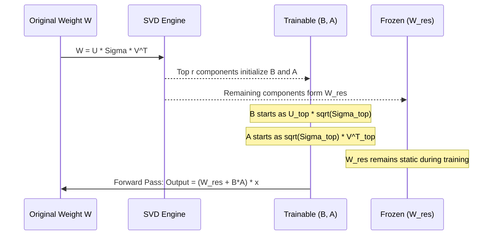

> **AI/ML Engineering Track** | NEW 2026 module — pipeline will expand this stub
>
> **Topic**: Modern PEFT beyond standard LoRA: Weight-Decomposed Low-Rank Adaptation (DoRA) and PiSSA. Near full-parameter performance with minimal compute. Practical fine-tuning workflows, when to choose each, integration with PEFT/Hugging Face, comparison with LoRA and full fine-tuning.

## Why This Module Matters

In late 2024, a leading European financial analytics firm attempted to fine-tune a 70-billion parameter language model to parse complex regulatory documents. Initially relying on standard LoRA to stay within their strict GPU budget (utilizing an on-premise cluster of 8x H100s), they found the model systematically failing to adapt its stylistic tone while maintaining factual accuracy. The LoRA-tuned model exhibited severe catastrophic forgetting of the base model's reasoning capabilities, leading to a botched deployment that cost the firm $2.3 million in delayed contracts and wasted compute cycles. 

The engineering team diagnosed the root cause: standard LoRA's coupled update of magnitude and direction was fundamentally unsuited for tasks requiring massive shifts in representational direction without blowing up the weight magnitudes. By migrating their pipeline to Weight-Decomposed Low-Rank Adaptation (DoRA), they decoupled these updates. The new DoRA-tuned model achieved parity with full fine-tuning benchmarks while consuming only 12% of the VRAM required for a full parameter update, saving the project and establishing a new internal standard for Parameter-Efficient Fine-Tuning (PEFT).

As standard LoRA reveals its limitations in complex reasoning and long-context adaptation tasks, modern PEFT techniques like DoRA and PiSSA (Principal Singular Values and Singular Vectors Adaptation) have emerged to bridge the performance gap with full fine-tuning. Understanding how to leverage these advanced decomposition strategies is no longer optional for AI engineers dealing with frontier models; it is the difference between an unreliable prototype and a production-grade deployment.

## Learning Outcomes

After completing this module, you will be able to:
1. **Evaluate** the mathematical and operational differences between standard LoRA, DoRA, and PiSSA to select the optimal fine-tuning strategy for a given generative AI task.
2. **Implement** Weight-Decomposed Low-Rank Adaptation (DoRA) using the Hugging Face PEFT library to maximize model performance on complex reasoning datasets.
3. **Design** a Singular Value Decomposition (SVD) initialization pipeline for PiSSA to accelerate convergence rates during large language model adaptation.
4. **Diagnose** training instabilities and catastrophic forgetting anomalies specific to advanced PEFT methods by analyzing weight magnitude and direction shift metrics.
5. **Compare** the computational overhead, VRAM utilization, and inference latency trade-offs of deploying DoRA and PiSSA models in production environments.

## Core Concept 1: The Limitations of Standard LoRA

To appreciate DoRA and PiSSA, we must dissect the limitations of standard LoRA. LoRA updates a pre-trained weight matrix $W_0 \in \mathbb{R}^{d \times k}$ with a low-rank decomposition $\Delta W = BA$, where $B \in \mathbb{R}^{d \times r}$ and $A \in \mathbb{R}^{r \times k}$, and $r \ll \min(d, k)$. 

While highly efficient, standard LoRA forces a strict correlation between the magnitude and direction of the weight updates. Analysis of Full Fine-Tuning (FT) reveals that FT often updates weight vectors with relatively small changes in magnitude but significant changes in direction (or vice versa, depending on the layer). LoRA struggles to replicate this decoupling. Because $B$ and $A$ are initialized near or at zero, LoRA dictates that any significant change in direction inherently requires a proportional increase in magnitude. This restriction limits LoRA's expressiveness, particularly in later layers of deep transformers where subtle directional shifts are critical for nuanced task adaptation.

> **Stop and think**: If a standard LoRA model requires a massive shift in direction to learn a new syntax, what consequence will this have on the magnitude of the updated weights, and how might this affect the activation outputs of that layer?

## Core Concept 2: Weight-Decomposed Low-Rank Adaptation (DoRA)

DoRA solves the magnitude-direction coupling problem by taking inspiration from weight normalization. It decomposes the pre-trained weight matrix into two distinct components: a magnitude vector ($m$) and a directional matrix ($V$). 

Mathematically, a weight matrix $W$ can be decomposed as:
$W = m \frac{V}{\|V\|_c}$
where $\|V\|_c$ is the vector-wise norm of $V$ across its columns, ensuring the directional matrix is normalized.

In DoRA, the pre-trained weights $W_0$ are used to initialize $m_0$ and $V_0$. During fine-tuning, the magnitude vector $m$ is set as a highly efficient trainable parameter. The directional matrix $V$ is updated using a LoRA-like mechanism:
$V' = W_0 + BA$

The final forward pass equation for DoRA becomes:
$W' = m \frac{W_0 + BA}{\|W_0 + BA\|_c}$

```mermaid
graph TD
    subgraph Pre-trained Model
        W0[Pre-trained Weight W0]
    end
    
    subgraph DoRA Decomposition
        M[Trainable Magnitude Vector m]
        V_Dir[Normalized Directional Matrix V / ||V||c]
    end
    
    subgraph LoRA Directional Update
        B[Trainable Matrix B d x r]
        A[Trainable Matrix A r x k]
        W0_Dir[Fixed W0]
        UpdateDir["V = W0 + (B * A)"]
    end
    
    W0 --> M
    W0 --> W0_Dir
    B --> UpdateDir
    A --> UpdateDir
    W0_Dir --> UpdateDir
    UpdateDir --> V_Dir
    M --> Final[Final Weight W' = m * V_Dir]
    V_Dir --> Final
```

This decomposition allows DoRA to learn changes in magnitude completely independently of changes in direction. It closely mirrors the learning pattern of full fine-tuning but retains the parameter efficiency of LoRA. In practice, DoRA often surpasses standard LoRA on complex tasks like coding and math, where structural logic (direction) must change without blowing up activation scales (magnitude).

## Implementing DoRA

Implementing DoRA is straightforward with modern PEFT libraries. The integration is typically just a boolean flag toggled over a standard LoRA configuration.

```python
from peft import LoraConfig, get_peft_model
from transformers import AutoModelForCausalLM

model_id = "mistralai/Mistral-7B-v0.1"
model = AutoModelForCausalLM.from_pretrained(model_id, load_in_4bit=True)

# Define DoRA Configuration
dora_config = LoraConfig(
    r=16,
    lora_alpha=32,
    target_modules=["q_proj", "k_proj", "v_proj", "o_proj"],
    lora_dropout=0.05,
    bias="none",
    task_type="CAUSAL_LM",
    use_dora=True  # The critical flag enabling Weight Decomposition
)

dora_model = get_peft_model(model, dora_config)
dora_model.print_trainable_parameters()
# Output will show slightly more parameters than standard LoRA due to the magnitude vectors (m)
```

## Core Concept 3: PiSSA (Principal Singular Values and Singular Vectors Adaptation)

While DoRA focuses on *how* the weights are updated, PiSSA focuses on *where* the trainable parameters start. Standard LoRA initializes matrix $A$ with a Gaussian distribution and matrix $B$ with zeros. This means the initial adaptation $\Delta W = BA$ is exactly zero. The model starts learning the adaptation from scratch.

PiSSA argues that a pre-trained model already contains a rich, dense matrix of knowledge. Instead of starting from zero, why not initialize our low-rank matrices with the most important, principal components of the pre-trained weights themselves?

PiSSA applies Singular Value Decomposition (SVD) to the pre-trained weight matrix $W \in \mathbb{R}^{d \times k}$:
$W = U \Sigma V^T$

It then slices these matrices into two groups based on the rank $r$:
1. **Principal Components**: The top $r$ singular values and their corresponding vectors. These are used to initialize the trainable matrices $A$ and $B$.
2. **Residual Components**: The remaining singular values and vectors. These are used to construct a frozen residual weight matrix $W_{res}$.

Mathematically:
$W = W_{res} + BA$
Where $A$ and $B$ are initialized such that $BA$ perfectly reconstructs the principal components of the original $W$.



By initializing with the principal components, PiSSA models converge dramatically faster than standard LoRA. The optimization landscape is smoother because the model is immediately adjusting its core representations rather than pushing a zero-initialized matrix up a steep gradient. Furthermore, PiSSA often achieves lower final loss values and better generalization, rivaling full fine-tuning on many benchmarks.

> **Pause and predict**: Because PiSSA modifies the base weights by extracting the principal components into the trainable matrices, what must happen during inference deployment compared to a standard LoRA adapter that simply adds to the base model?

## Core Concept 4: The VRAM and Compute Trade-offs

Advanced PEFT methods do not come for free. Understanding their resource implications is crucial for system design.

**DoRA Trade-offs:**
- **Training**: DoRA requires calculating the vector-wise norm of the directional matrix. This adds a slight computational overhead and requires computing gradients through the normalization step. VRAM usage is marginally higher (typically 1-3%) than standard LoRA due to the magnitude vectors.
- **Inference**: During inference, the trainable matrices $B$ and $A$ can be merged into the base weights, and the magnitude vector $m$ can be folded into the final weight matrix. Therefore, DoRA introduces **zero inference latency overhead** compared to standard LoRA or full fine-tuning.

**PiSSA Trade-offs:**
- **Initialization**: PiSSA requires performing SVD on every target weight matrix before training begins. For a 70B parameter model, this SVD initialization can take several minutes to an hour on CPU or require significant VRAM if performed on GPU. This is a one-time upfront cost.
- **Training**: Training speed and VRAM are identical to standard LoRA.
- **Inference**: Because PiSSA alters the base model (replacing $W$ with $W_{res}$), you cannot simply load an unmodified base model and attach a PiSSA adapter on the fly like you can with standard LoRA. You must either save the modified $W_{res}$ base model, or merge the PiSSA adapter back into $W_{res}$ to reconstruct a standard weight format for deployment.

## War Story: The PiSSA Convergence Trap

A generative AI startup was building an SQL-generating agent. They transitioned from LoRA to PiSSA to speed up training cycles. They initialized PiSSA with $r=64$ and launched a training run expecting rapid convergence. Instead, the loss spiked to NaN within 50 steps. 

The post-mortem revealed that they were using a highly aggressive learning rate schedule originally tuned for standard LoRA (which starts at zero). PiSSA's trainable matrices were already populated with massive principal singular values. Applying a high learning rate to these already large, critical values caused catastrophic gradient explosion. They fixed the issue by reducing the learning rate by a factor of 10 and adding a warm-up phase, aligning the optimization with the pre-initialized state of the weights.

## Did You Know?

- In original benchmarking by NVIDIA, DoRA achieved an average accuracy of 83.5% across commonsense reasoning tasks, matching full fine-tuning's 83.6% while updating less than 1% of the parameters.
- Performing SVD on a standard 4096 by 4096 projection matrix in PyTorch takes roughly 1.2 seconds on a modern CPU, meaning initializing a 7B model for PiSSA takes about 5 minutes before training starts.
- Standard LoRA matrices ($A$ and $B$) typically possess a cosine similarity of roughly 0.05 between magnitude and direction updates during training, whereas full fine-tuning exhibits a similarity closer to 0.8. DoRA consistently mirrors the 0.8 similarity, proving its alignment with full fine-tuning dynamics.
- When PiSSA is applied to LLaMA-2 7B, the top 16 singular values (out of 4096) often account for over 12% of the total spectral energy of the weight matrix, explaining why initializing with these values drastically shifts the starting point of optimization.

## Common Mistakes

| Mistake | Why it happens | How to fix it |
| :--- | :--- | :--- |
| **Reusing LoRA learning rates for PiSSA** | Engineers assume PEFT methods are hyperparameter-compatible. PiSSA starts with non-zero, large magnitude values unlike LoRA's zero-initialization. | Reduce the PiSSA learning rate by 5x to 10x compared to your standard LoRA baseline and use a conservative linear warmup. |
| **Failing to merge PiSSA adapters correctly** | Applying a PiSSA adapter directly to the unmodified base model at inference time. PiSSA requires the base model to be altered to the residual matrix ($W_{res}$). | Always merge PiSSA weights back into the residual base model prior to deploying for inference using `peft_model.merge_and_unload()`. |
| **Using DoRA with tiny rank ($r < 8$)** | Assuming DoRA is magically expressive at any rank. If the rank is too low, the directional matrix $V$ lacks the capacity to shift, rendering the magnitude decomposition useless. | Use $r=16$ or $r=32$ as a starting point for DoRA to ensure sufficient directional capacity. |
| **Skipping layernorm tuning with DoRA** | DoRA focuses on linear layers, but large magnitude shifts can destabilize subsequent layer normalizations if they remain frozen. | Unfreeze LayerNorm parameters during DoRA training for complex, long-context tasks to maintain activation stability. |
| **Using PiSSA on heavily quantized models (e.g., NF4)** | Precise SVD is computationally expensive or impossible on aggressively quantized 4-bit integer weights without extensive dequantization overhead. | Perform SVD on the 16-bit/32-bit weights first, initialize PiSSA, and *then* quantize the residual base model if required for training. |
| **Evaluating DoRA mid-training without folding** | Inference during a validation loop is slow because the DoRA equation $W' = m (W_0 + BA) / \|V\|_c$ must be calculated dynamically on every forward pass. | While standard for training, ensure your evaluation script uses context managers or specific PEFT evaluation modes that optimize the forward pass. |
| **Ignoring the SVD initialization time in CI/CD pipelines** | PiSSA's SVD initialization blocks the training script from actually starting the first epoch, leading to pipeline timeouts in automated runners. | Pre-compute and cache the PiSSA initialized adapters and residual base models for standard foundational models used in your organization. |

## Quiz

<details>
<summary>1. A machine learning team is fine-tuning a model for advanced medical diagnostics. They notice that while the model learns the terminology, it completely forgets how to structure its reasoning, a sign that the fundamental direction of the weights is heavily restricted. Which PEFT method is best suited to resolve this, and why?</summary>
DoRA is the best suited method for this scenario. The symptoms describe the fundamental limitation of standard LoRA, where changes in direction are coupled with changes in magnitude. DoRA decouples these updates by separating the weight matrix into a trainable magnitude vector and a directional matrix, allowing the model to make significant structural (directional) changes to its reasoning without blowing up the magnitude of the weights.
</details>

<details>
<summary>2. You are migrating an existing training pipeline from standard LoRA to PiSSA. After making the switch, your training loss immediately explodes to infinity within the first 10 steps. What is the most likely cause of this failure?</summary>
The most likely cause is using a learning rate that is too high, likely inherited directly from the LoRA configuration. Standard LoRA initializes the $B$ matrix with zeros, meaning the initial adaptation is zero. PiSSA initializes $A$ and $B$ with the principal singular values of the pre-trained weights, which are typically large, non-zero values. Applying a high learning rate to these large initial values causes a massive, destabilizing gradient update, leading to exploding loss.
</details>

<details>
<summary>3. An MLOps engineer is designing an inference server that needs to dynamically swap out adapters for 50 different enterprise clients on a single base model. They are deciding between DoRA and PiSSA. Which method presents a massive architectural hurdle for this specific use case, and why?</summary>
PiSSA presents a massive architectural hurdle for dynamic adapter swapping. Standard LoRA and DoRA allow adapters to be loaded and applied on top of the unmodified, shared base model in memory. PiSSA, however, alters the base model itself by subtracting the principal components to create a residual base model ($W_{res}$). Because each PiSSA adapter corresponds to a uniquely modified residual base model, you cannot easily hot-swap PiSSA adapters over a single, unmodified base model without significant dynamic reconstruction overhead.
</details>

<details>
<summary>4. A machine learning team is training a DoRA model to adjust the tone of a coding assistant but accidentally removes the normalization step (dividing by $\|V\|_c$) in their custom PyTorch training loop. What specific behavior will they observe in the model's weight updates during training, and what is the mathematical reason for this failure?</summary>
They will observe that the model's weight magnitudes are unintentionally changing alongside the directional updates, completely negating the primary benefit of the DoRA architecture. Without dividing the directional matrix by its column-wise norm, any gradient updates applied to the low-rank matrices $B$ and $A$ will inherently alter the length (magnitude) of the resulting vectors. The normalization step is mathematically critical because it forces $V$ to act strictly as a unit vector matrix, ensuring it only dictates the direction of the weights. By omitting this division, the trainable parameter $m$ is no longer the exclusive controller of magnitude, leading to coupled updates that mimic the limitations of standard LoRA and potentially destabilize training.
</details>

<details>
<summary>5. You are running an on-premise cluster and have strict VRAM limits. You want to use PiSSA for its fast convergence, but you observe that the initialization phase crashes due to Out-Of-Memory (OOM) errors before training even begins. How can you diagnose and resolve this?</summary>
The OOM crash during initialization is caused by performing Singular Value Decomposition (SVD) on massive weight matrices directly on the GPU. SVD is highly memory-intensive. To resolve this, you must configure the PiSSA initialization script to offload the SVD computation to the CPU. While CPU SVD takes significantly longer, it utilizes system RAM, bypassing the strict VRAM limits of the GPU. Once initialized, the low-rank matrices can be moved back to the GPU for training.
</details>

<details>
<summary>6. A deployment engineering team is hesitant to approve a transition from standard LoRA to DoRA for their real-time translation API. Their strict Service Level Agreement (SLA) dictates that any new fine-tuning method must not add even a single millisecond of inference latency over their current merged LoRA deployment. Should the team approve the transition to DoRA, and how must they prepare the model to ensure SLA compliance?</summary>
Yes, the team should approve the transition because DoRA introduces absolutely zero inference latency overhead when properly prepared for production. To ensure compliance with their strict SLA, the engineering team must merge the DoRA adapter weights directly into the base model prior to deployment. During this merging process, both the magnitude vector $m$ and the low-rank directional updates ($B$ and $A$) are mathematically computed and baked into a standard, static linear weight matrix. Once this offline merging is complete, the resulting model architecture is mathematically identical to an unmodified base model, meaning no extra calculations are required during the forward pass at runtime.
</details>

## Hands-On Exercise: Implementing and Analyzing DoRA

In this exercise, you will implement DoRA using the Hugging Face `peft` library, analyze the parameter count differences compared to standard LoRA, and simulate the forward pass decomposition.

**Task 1: Setup and Standard LoRA Baseline**
1. Load a causal language model (e.g., `sshleifer/tiny-gpt2`) to run this quickly on CPU or a small GPU.
2. Configure a standard LoRA adapter targeting the `c_attn` and `c_proj` modules with $r=16$.
3. Print the trainable parameters and record the exact number.

**Task 2: Implement DoRA**
1. Using the same base model architecture, create a new PEFT configuration.
2. Enable DoRA by setting the appropriate boolean flag in the `LoraConfig`.
3. Apply the configuration to the model and print the trainable parameters.

**Task 3: Parameter Delta Analysis**
1. Calculate the exact difference in trainable parameters between the standard LoRA model and the DoRA model.
2. Identify mathematically what these extra parameters represent based on the DoRA architecture.

**Task 4: Simulating the Normalization (Advanced)**
1. Write a standalone Python function using PyTorch that takes a dummy pre-trained weight matrix ($W_0$, $128 \times 128$), a LoRA $A$ matrix ($16 \times 128$), and a LoRA $B$ matrix ($128 \times 16$).
2. Implement the DoRA forward equation to compute the final weight matrix $W'$, assuming the magnitude vector $m$ is initialized as the column norms of $W_0$.
3. Assert that the column norms of the directional component ($W_0 + BA$) before multiplication by $m$ are exactly 1.0.

<details>
<summary>View Solution for Task 1 & 2</summary>

```python
import torch
from transformers import AutoModelForCausalLM
from peft import LoraConfig, get_peft_model

model_id = "sshleifer/tiny-gpt2"
model = AutoModelForCausalLM.from_pretrained(model_id)

# Task 1: Standard LoRA
lora_config = LoraConfig(
    r=16,
    target_modules=["c_attn", "c_proj"],
    task_type="CAUSAL_LM"
)
lora_model = get_peft_model(model, lora_config)
print("Standard LoRA:")
lora_model.print_trainable_parameters()
# Output will show X trainable parameters

# Task 2: DoRA
# Reload model to start fresh
model_dora = AutoModelForCausalLM.from_pretrained(model_id)
dora_config = LoraConfig(
    r=16,
    target_modules=["c_attn", "c_proj"],
    task_type="CAUSAL_LM",
    use_dora=True # Enabling DoRA
)
dora_model = get_peft_model(model_dora, dora_config)
print("\nDoRA:")
dora_model.print_trainable_parameters()
# Output will show Y trainable parameters, where Y > X
```
</details>

<details>
<summary>View Solution for Task 3</summary>

The difference in parameters directly correlates to the magnitude vectors ($m$). 
For every targeted linear layer with output dimension $d$, DoRA adds exactly $d$ trainable parameters for the magnitude vector. 
If you target a query projection layer where the output dimension is 4096, DoRA adds 4096 parameters to the budget for that layer compared to standard LoRA. Because $d$ is relatively small compared to the matrix size ($d \times k$), the overall parameter increase is minimal (usually under 2%), but it provides massive expressive power.
</details>

<details>
<summary>View Solution for Task 4</summary>

```python
import torch

def simulate_dora_forward(W0, B, A):
    # Initialize magnitude m as the column norms of W0
    m = torch.linalg.norm(W0, dim=0)
    
    # Directional update
    directional_update = W0 + (B @ A)
    
    # Calculate column norms of the directional update
    norm_c = torch.linalg.norm(directional_update, dim=0)
    
    # Normalize the directional matrix
    normalized_direction = directional_update / norm_c
    
    # Assert norms are 1.0 (with small epsilon for floating point math)
    assert torch.allclose(torch.linalg.norm(normalized_direction, dim=0), torch.ones_like(m), atol=1e-5)
    
    # Final weight calculation
    W_prime = m * normalized_direction
    return W_prime

# Dummy tensors
W0 = torch.randn(128, 128)
B = torch.randn(128, 16) * 0.01
A = torch.randn(16, 128) * 0.01

W_final = simulate_dora_forward(W0, B, A)
print("DoRA forward pass simulation successful. Norms validated.")
```
</details>

**Success Checklist:**
- [ ] You have successfully initialized a model with standard LoRA and DoRA.
- [ ] You have verified that DoRA introduces a slight parameter overhead.
- [ ] You mathematically understand that the overhead comes strictly from the magnitude vector $m$.
- [ ] You have successfully simulated the column-wise normalization step that decouples direction from magnitude.

## Next Module

Having mastered the structural decompositions of DoRA and PiSSA, it is time to look at optimizing the data that flows *through* these weights. In [Module 7.10: Unsloth and Flash Attention Integration](/ai-ml-engineering/advanced-genai/module-7.10-unsloth-flash-attention), we will explore how custom CUDA kernels and memory mapping can accelerate PEFT training by up to 300% without sacrificing mathematical precision.