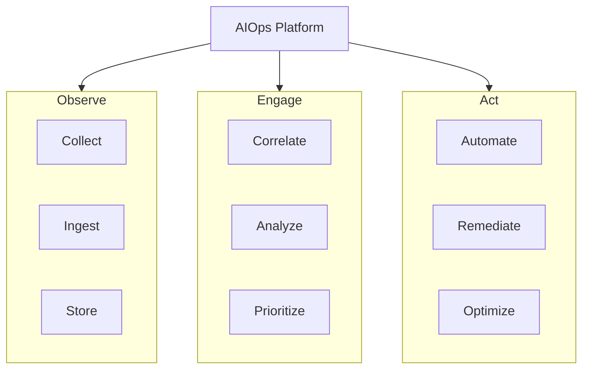
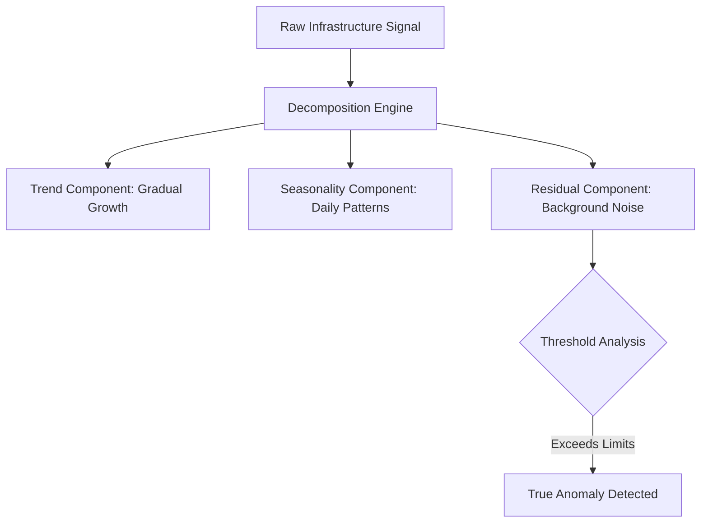
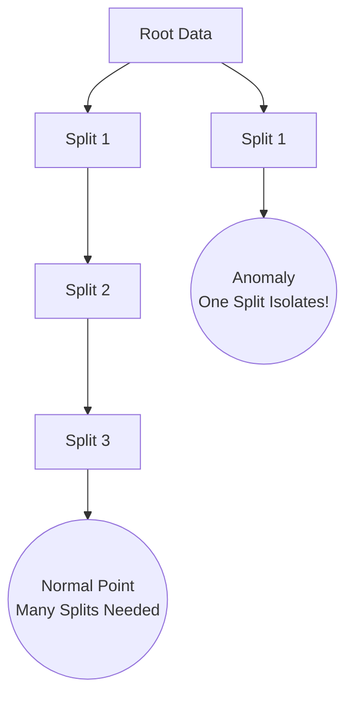
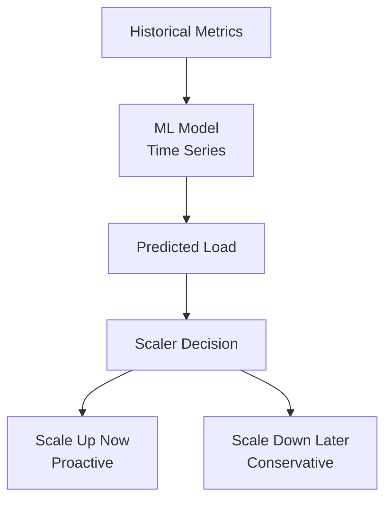
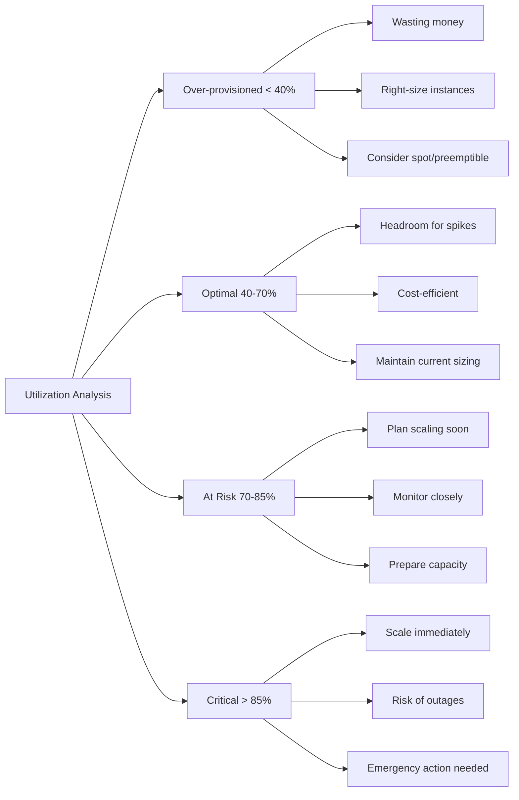

> **AI/ML Engineering Track** | Complexity: `[MEDIUM]` | Time: 5-6
**Prerequisites**: Phase 10 complete (DevOps & MLOps)

## The 3 AM Page That Broke the Generative AI Launch

**Seattle, Washington. November 27, 2025. 3:17 AM.**

Sarah Martinez was dreaming about her upcoming vacation when her phone started buzzing. Three alerts, then ten, then forty-seven in the span of two minutes. Her company's highly anticipated Generative AI shopping assistant had just gone live for Black Friday, and the system was completely buckling.

Half-asleep, she logged into their observability platform to find a wall of red. User-facing latency for the chat interface had spiked from 800ms to 12 seconds. Error rates had jumped from 0.1% to 42%. The underlying Kubernetes clusters (running v1.35) were perfectly healthy. CPU was low. Memory was stable. The problem wasn't their infrastructure—it was their consumption of managed Cloud AI services.

Four hours later, after escalating to their cloud provider's enterprise support, they found the cascading failure. The team had relied on a global endpoint for their foundation models without realizing the regional rate limits. A sudden spike in complex user queries exhausted their on-demand token quota. Retries amplified the traffic, triggering API throttling, which caused upstream services to queue requests until memory exhausted. The total revenue impact? $2.3 million in abandoned shopping carts. The fix? Purchasing provisioned throughput and implementing cross-region inference profiles—a change that took minutes to apply but hours to diagnose.

Sarah realized that while managed AI services (like Amazon Bedrock or Azure Foundry) abstract away the GPUs, they do *not* abstract away the need for rigorous capacity planning and proactive operations. What if an AIOps system had seen the token consumption velocity building before the 429 Too Many Requests errors fired? What if they had predicted the throughput requirements instead of reacting to failures? This module bridges these two worlds: mastering the landscape of Cloud AI Services, and applying AIOps to keep them running flawlessly.

## What You'll Be Able to Do

By the end of this module, you will:
- **Compare** regional and global deployment architectures across Amazon Bedrock, OCI, Azure Foundry, and Google Vertex AI.
- **Design** capacity plans for provisioned throughput and dedicated AI clusters to avoid rate-limiting cascades.
- **Implement** predictive autoscaling and time-series forecasting for LLM token consumption.
- **Diagnose** complex API latency and anomaly events using statistical and machine learning AIOps methods.
- **Evaluate** the asymmetric costs of over-provisioning versus under-provisioning in the context of expensive managed AI APIs.

---

## The Landscape of Managed Cloud AI Services

Before we can monitor and scale our AI usage, we must understand the strict boundaries and deployment models of the top-tier Cloud AI platforms. Because you don't manage the underlying hardware, your "infrastructure" becomes your configuration of endpoints, regions, and throughput commitments.

### Amazon Bedrock: Provisioned Throughput and Cross-Region Routing

Amazon Bedrock presents foundation models for text, image, and embedding workloads, actively supporting inference, evaluation, knowledge-base creation, and agent use cases. As of our latest evaluations, Bedrock's model catalog includes Anthropic Claude 4.x entries (including Claude Opus 4.6 and Claude Sonnet 4.6), DeepSeek 3.x family entries, and Meta Llama 4 models.

When deploying globally, you must understand Bedrock's regional strategy. Bedrock publishes per-model region availability with separate columns for single-region support and cross-region inference profile support. If you rely on a single region, a localized spike can throttle your application. Cross-region inference profiles dynamically route requests across multiple AWS regions to absorb spikes, but they introduce variable latency that your upstream microservices must be configured to handle gracefully.

For production workloads, relying on on-demand pricing is dangerous. Bedrock model customization uses *provisioned throughput*. Once purchased, custom model inference uses dedicated model IDs and ARNs, guaranteeing your capacity regardless of noisy neighbors.

### OCI Generative AI: Enterprise Agents and Dedicated Clusters

Oracle Cloud Infrastructure (OCI) Generative AI is positioned as a fully managed service for chat, embeddings, and rerank, notably featuring OpenAI-compatible API support. OCI is documented as available across commercial (OC1), government (OC4), and sovereign (OC19) region families.

Model availability in OCI Generative AI is strictly region-dependent and tracked with on-demand, dedicated, and (in some cases) interconnect-only availability markers. While OCI allows the use of pretrained hosted models via console, CLI, and API, enterprise scale requires custom model import, fine-tuning, and hosting on **dedicated AI clusters**. These clusters provide isolated compute resources that protect your workloads from multi-tenant throttling.

OCI enterprise AI features have rapidly expanded to support complex agentic workflows, including an Responses-compatible API plus tool hooks (including MCP), memory APIs, vector stores, and NL2SQL capabilities.

### Azure Foundry & Google Vertex AI: The Global Endpoint Dilemma

Microsoft Azure Foundry's "sold-directly" models page states that these include all Azure OpenAI models plus selected third-party providers, billed directly through your Azure subscription backed by a Microsoft SLA. The catalog currently includes the advanced GPT-5.4 series (e.g., gpt-5.4, gpt-5.4-mini, gpt-5.4-nano, gpt-5.4-pro). Azure documents both standard and provisioned deployment styles, including global routing options to distribute traffic automatically.

Conversely, Google Cloud's Vertex AI takes a different approach. Vertex AI does *not* offer a global location for standard operations; users must choose a supported region for most dataset and model tasks. For Generative AI specifically, a global endpoint exists at `locations/global`, but it comes with severe caveats: the global endpoint does not guarantee data residency and omits critical capabilities like model tuning and specific batch prediction paths. Despite this, the Vertex generative model endpoint tables boast massive models, including Gemini 2.5 and 3.1 preview model IDs.

> **Stop and think**: If your compliance team mandates strict data residency within the European Union, how does this requirement change your architectural choice between Azure Foundry's global routing and Vertex AI's regional endpoints?

### 4 Facts You Should Know

1. **Deprecation Horizons:** Azure's classic Foundry Agent Service docs were officially marked as deprecated as of 2027-03-31, migrating users to newer hub-based project limitations and strict GPT-5 registration requirements.
2. **Agent Maturation:** OCI Generative AI Enterprise AI Agents reached General Availability on 2026-03-31, signaling enterprise readiness for complex multi-step reasoning.
3. **Security Enhancements:** API keys for OCI Generative AI models were added on 2026-01-21, and OCI Generative AI added AI guardrails for on-demand mode shortly after on 2026-02-09.
4. **Historical Efficiency:** Google's Borg system (predecessor to Kubernetes) has used ML for resource prediction since 2013, achieving just 23% resource slack compared to 46-60% slack for manually-managed jobs.

---

## From Firefighting to Prevention: AIOps for AI APIs

### Why Traditional Operations Can't Scale

Think of traditional cloud operations like a fire department that can only respond after a building is engulfed. Even when consuming managed Cloud AI APIs, reacting to rate limits is too slow. Every incident follows a painful timeline:

```text
REACTIVE OPS TIMELINE
=====================

00:00  Problem begins (CPU spike, memory leak)
00:15  Threshold exceeded
00:16  Alert fires
00:20  Engineer acknowledges
00:35  Investigation begins
00:50  Root cause identified
01:10  Fix deployed
01:15  Service recovered

Total downtime: 1+ hour
User impact: Significant
```

By the time a human receives an alert that Bedrock is returning `429 Throttled` errors, the damage is done. Your LLM-powered application is already failing customer requests, and retries are only making the queue depth worse.

### The Proactive Alternative

AIOps (Artificial Intelligence for IT Operations) flips the script. Instead of reacting, it predicts.

```text
PROACTIVE AI OPS TIMELINE
=========================

-02:00  AI detects anomalous pattern
-01:45  Prediction: "CPU will exceed threshold in ~2 hours"
-01:30  Automated scaling triggered
-01:00  Additional capacity online
00:00   Would-be incident prevented

Total downtime: 0
User impact: None
```

What does an AIOps platform actually do? It observes, engages, and acts.



Without AIOps, operators suffer from **Alert Fatigue**. A sudden spike in API latency might trigger 500 alerts across different microservices. AIOps uses ML correlation to group those into a single, actionable root cause.

```text
ALERT NOISE REDUCTION
=====================

Before AIOps:
  500 alerts/day → 480 false positives → Alert fatigue!

After AIOps:
  500 alerts/day → ML correlation → 20 actionable incidents

Techniques:
  • Alert deduplication
  • Correlation (related alerts grouped)
  • Suppression (known patterns)
  • Dynamic thresholds
```

With AIOps, Root Cause Analysis happens at machine speed:

```text
RCA WITH AI
===========

Incident: API latency spike

Traditional approach:
  1. Check API servers
  2. Check database
  3. Check network
  4. Check dependencies... (hours later)
  5. Found: Redis memory pressure

AI approach:
  1. Correlate all metrics at incident time
  2. Identify: Redis memory spike precedes API latency
  3. Causal analysis: Redis evictions → cache misses → DB load → API latency
  4. Root cause: Redis memory (confidence: 94%)

Time: Minutes vs Hours
```

To build this capability, you need a proactive architecture that ingests everything from Kubernetes custom metrics to CloudWatch data from your Bedrock endpoints.

```mermaid
flowchart TD
    subgraph Data Collection
    P[Prometheus] & CW[CloudWatch] & CM[Custom Metrics] & L[Logs]
    end

    subgraph Data Processing
    TSDB[Time Series DB] & FE[Feature Engineering] & AGG[Aggregation]
    end

    subgraph AI/ML Engine
    AD[Anomaly Detection] & FM[Forecasting Models] & CP[Capacity Planning] & IP[Incident Prediction]
    end

    subgraph Action Engine
    AS[Auto-scaling] & AL[Alerting] & RB[Runbooks] & REC[Recommendations]
    end

    Data Collection --> Data Processing
    Data Processing --> AI/ML Engine
    AI/ML Engine --> Action Engine
```

The market has exploded with tools to implement this architecture:

```text
AIOPS TOOLS (2024)
==================

Full Platforms:
  • Datadog AI       - Watchdog for anomaly detection
  • Dynatrace Davis  - AI-powered root cause analysis
  • Splunk ITSI      - ML-powered IT service intelligence
  • New Relic AI     - Applied Intelligence
  • Moogsoft         - AI incident management

Open Source:
  • Prometheus + ML  - Custom anomaly detection
  • Grafana ML       - Machine learning for observability
  • OpenTelemetry    - Observability data collection
  • Skywalking       - APM with ML capabilities

Cloud Native:
  • AWS DevOps Guru  - ML-powered insights
  • Azure Monitor    - Smart detection
  • GCP Operations   - Anomaly detection
```

---

## Anomaly Detection: Finding Trouble in Token Streams

### Understanding What Makes Infrastructure Metrics Unique

Token consumption and API latency are highly seasonal. A spike at 9 AM on Monday is normal; a spike at 3 AM on Sunday is an anomaly. The challenge is decomposing a raw metric signal:

```text
METRIC DECOMPOSITION
====================

Raw Signal = Trend + Seasonality + Residual + Anomaly

         ┌─────────────────────────────────────────┐
Raw:     │  ∿∿∿∿∿╱∿∿∿∿∿∿∿∿∿∿∿∿∿∿∿∿∿∿∿∿∿∿∿∿∿  │
         └─────────────────────────────────────────┘
                    ↓ Decompose
         ┌─────────────────────────────────────────┐
Trend:   │  ────────────╱─────────────────────────  │  (gradual growth)
         └─────────────────────────────────────────┘
         ┌─────────────────────────────────────────┐
Season:  │  ∿∿∿∿∿∿∿∿∿∿∿∿∿∿∿∿∿∿∿∿∿∿∿∿∿∿∿∿∿∿∿  │  (daily pattern)
         └─────────────────────────────────────────┘
         ┌─────────────────────────────────────────┐
Residual:│  ─────────────────────────────────────── │  (noise)
         └─────────────────────────────────────────┘
         ┌─────────────────────────────────────────┐
Anomaly: │  ────────────────█─────────────────────  │  (true anomaly!)
         └─────────────────────────────────────────┘
```

For clarity in modern visualization, this decomposition pipeline can also be represented structurally:



### Statistical Methods

The simplest approaches use statistics. **Z-Score Detection** compares values to the mean, but it struggles with seasonality:

```python
def zscore_anomaly(value, mean, std, threshold=3.0):
    """
    Simple but effective for normally distributed data.
    Assumes: Data follows Gaussian distribution
    """
    z = abs(value - mean) / std
    return z > threshold

# Problem: Doesn't handle seasonality or trends
```

A **Modified Z-Score** using Median Absolute Deviation (MAD) is far more robust against outliers corrupting your baseline. Because it uses the median rather than the mean, a sudden extreme spike will not drag the entire baseline up, allowing the algorithm to correctly identify the spike as an anomaly rather than establishing a new normal:

```python
def mad_anomaly(value, median, mad, threshold=3.5):
    """
    More robust to outliers than standard Z-score.
    MAD = Median Absolute Deviation
    """
    modified_z = 0.6745 * (value - median) / mad
    return abs(modified_z) > threshold
```

### Machine Learning Methods

For multi-dimensional metrics (e.g., token count *and* response length *and* latency), we need ML. **Isolation Forests** work on the principle that anomalies are rare and distinct, making them easy to "isolate" with random splits in the data.



Anomalies have short isolation paths.

Autoencoders take a completely different approach. They learn to compress and reconstruct normal data. When fed an anomaly, the reconstruction fails dramatically.

```text
AUTOENCODER ANOMALY DETECTION
=============================

Normal data:
  Input: [0.5, 0.6, 0.4, 0.5]
  Reconstructed: [0.51, 0.59, 0.41, 0.49]
  Error: 0.02  Low = Normal

Anomalous data:
  Input: [0.5, 0.6, 9.9, 0.5]  ← Anomaly!
  Reconstructed: [0.52, 0.58, 0.45, 0.51]
  Error: 8.95  High = Anomaly!
```

### Time Series Specific Methods

Infrastructure metrics are sequential. **ARIMA** explicitly models temporal dependencies, capturing autoregression and moving averages to predict what the next point *should* be:

```python
# Fit ARIMA model to capture normal patterns
# Anomalies = points where residuals exceed threshold

from statsmodels.tsa.arima.model import ARIMA

model = ARIMA(data, order=(1, 1, 1))
fitted = model.fit()
residuals = fitted.resid

# Points where |residual| > 3 * std(residuals) are anomalies
threshold = 3 * residuals.std()
anomalies = abs(residuals) > threshold
```

Alternatively, Facebook's **Prophet** was built specifically to handle complex daily, weekly, and yearly seasonality, making it exceptionally powerful for long-term capacity planning:

```python
from prophet import Prophet

model = Prophet(interval_width=0.99)
model.fit(df)
forecast = model.predict(df)

# Anomalies fall outside prediction interval
anomalies = (df['y'] < forecast['yhat_lower']) | \
            (df['y'] > forecast['yhat_upper'])
```

---

## Predictive Autoscaling & Capacity Planning

If your anomaly detection works, you can predict load *before* it hits.

### Why Reactive Scaling Loses

If you wait for token queues to fill up, your users suffer.

```text
REACTIVE SCALING PROBLEM
========================

Time     Load    Replicas    Status
─────────────────────────────────────
09:00    100     2           OK
09:15    200     2           Overloaded!
09:16    200     2           Alert fires
09:18    200     3           Scaling...
09:20    200     4           Still catching up
09:22    200     5           Finally stable
09:25    150     5           Over-provisioned
09:30    100     5           Wasting money

Problem: Always chasing the load, never ahead of it
```

Predictive scaling forecasts the future and scales in advance.



To forecast the future, you can use simple methods like **Exponential Smoothing**:

```python
def exponential_smoothing(data, alpha=0.3):
    """
    alpha: smoothing factor (0-1)
    Higher alpha = more weight on recent observations
    """
    result = [data[0]]
    for i in range(1, len(data)):
        result.append(alpha * data[i] + (1 - alpha) * result[-1])
    return result
```

Or you can use **Holt-Winters** to factor in trend and seasonality:

```text
HOLT-WINTERS COMPONENTS
=======================

Level (L):      Base value, updated each period
Trend (T):      Rate of change
Seasonality (S): Repeating pattern

Forecast = (Level + k * Trend) * Seasonality[k]

Where k = periods ahead to forecast
```

For massive scale, Deep Learning architectures like **LSTMs** (Long Short-Term Memory networks) capture non-linear patterns over time:

```python
# Sequence-to-sequence prediction
# Input: Last 24 hours of metrics (hourly)
# Output: Next 4 hours prediction

model = Sequential([
    LSTM(64, input_shape=(24, n_features), return_sequences=True),
    LSTM(32),
    Dense(16, activation='relu'),
    Dense(4)  # Predict next 4 hours
])
```

### The Scaling Decision: Asymmetric Costs

If you are purchasing OCI Dedicated AI Clusters or Bedrock Provisioned Throughput, you must understand that the cost of being wrong is asymmetric. Wasting $100 on an unused node is annoying. Losing 10,000 user sessions to timeout errors is disastrous.

```python
def calculate_desired_replicas(
    predicted_load: float,
    current_replicas: int,
    target_utilization: float = 0.7,
    capacity_per_replica: float = 100,
    min_replicas: int = 2,
    max_replicas: int = 100
) -> int:
    """
    Calculate optimal replica count based on predicted load.

    Key insight: Scale for PREDICTED load, not current load.
    """
    # Required capacity with headroom
    required_capacity = predicted_load / target_utilization

    # Calculate replicas needed
    desired = math.ceil(required_capacity / capacity_per_replica)

    # Apply constraints
    desired = max(min_replicas, min(max_replicas, desired))

    # Scale up aggressively, scale down conservatively
    if desired > current_replicas:
        return desired  # Scale up immediately
    elif desired < current_replicas:
        # Only scale down if consistently lower for N periods
        return current_replicas  # Hold for now

    return current_replicas
```

To implement this practically in a modern cluster, you would utilize the Kubernetes Custom Metrics API. Here is how you configure a Kubernetes v1.35 HorizontalPodAutoscaler to consume a predictive metric and execute the asymmetric scaling behavior defined above:

```yaml
# Example Kubernetes v1.35+ HorizontalPodAutoscaler
# Demonstrating asymmetric predictive scaling
apiVersion: autoscaling/v2
kind: HorizontalPodAutoscaler
metadata:
  name: ai-inference-gateway
  namespace: production
spec:
  scaleTargetRef:
    apiVersion: apps/v1
    kind: Deployment
    name: ai-inference-gateway
  minReplicas: 3
  maxReplicas: 100
  metrics:
  - type: Object
    object:
      metric:
        name: predicted_token_usage_15m
      describedObject:
        apiVersion: apps/v1
        kind: Deployment
        name: ai-inference-gateway
      target:
        type: Value
        value: 50000
  behavior:
    scaleUp:
      stabilizationWindowSeconds: 0
      policies:
      - type: Percent
        value: 100
        periodSeconds: 15
    scaleDown:
      stabilizationWindowSeconds: 1800
      policies:
      - type: Pods
        value: 1
        periodSeconds: 300
```

### Feature Engineering: The Secret Sauce

None of these ML models work well on raw metrics alone. **Feature Engineering** transforms raw data into signals that ML algorithms can easily digest.

```python
def engineer_features(metrics_df, window_sizes=[5, 15, 60]):
    """
    Create features for infrastructure ML models.

    Key insight: Raw metrics alone are not enough.
    ML models need derived features that capture patterns.
    """
    features = {}

    for metric in metrics_df.columns:
        for window in window_sizes:
            # Rolling statistics
            features[f'{metric}_mean_{window}m'] = \
                metrics_df[metric].rolling(window).mean()
            features[f'{metric}_std_{window}m'] = \
                metrics_df[metric].rolling(window).std()
            features[f'{metric}_min_{window}m'] = \
                metrics_df[metric].rolling(window).min()
            features[f'{metric}_max_{window}m'] = \
                metrics_df[metric].rolling(window).max()

            # Rate of change
            features[f'{metric}_delta_{window}m'] = \
                metrics_df[metric].diff(window)

            # Percentiles
            features[f'{metric}_p95_{window}m'] = \
                metrics_df[metric].rolling(window).quantile(0.95)

    # Time-based features (for seasonality)
    features['hour_of_day'] = metrics_df.index.hour
    features['day_of_week'] = metrics_df.index.dayofweek
    features['is_weekend'] = features['day_of_week'] >= 5
    features['is_business_hours'] = \
        (features['hour_of_day'] >= 9) & (features['hour_of_day'] <= 17)

    return pd.DataFrame(features)
```

> **Pause and predict**: If you only fed raw CPU utilization into a model, without extracting the `hour_of_day` or `is_weekend` features, what kind of false positives would your model generate?

### Strategic Capacity Planning

Finally, AIOps isn't just for tomorrow; it's for next year. Capacity planning answers specific business questions across different horizons:

```text
CAPACITY PLANNING QUESTIONS
===========================

Short-term (days-weeks):
  "Will we have enough capacity for Black Friday?"
  "Can we handle the marketing campaign traffic?"

Medium-term (months):
  "When will we need to add more database nodes?"
  "How much should we budget for Q3 compute?"

Long-term (years):
  "When will we outgrow our current architecture?"
  "What's our 3-year infrastructure cost projection?"
```

To answer these, you apply mathematical growth models to your long-term metrics:

1. **Linear Growth:** Adds a constant amount.
   ```text
   Capacity = Initial + (Growth_Rate × Time)
   Example: 100 users + (10 users/day × 30 days) = 400 users
   ```
2. **Exponential Growth:** Growth compounds.
   ```text
   Capacity = Initial × (1 + Growth_Rate)^Time
   Example: 100 users × 1.10^30 = 1,745 users (10% daily growth)
   ```
3. **Logistic Growth:** The S-Curve. Growth accelerates, then hits market saturation and slows down.
   ```text
   Capacity = Carrying_Capacity / (1 + e^(-k(t-t0)))
   More realistic: Growth slows as market saturates
   ```

You pair these growth models with strict utilization analysis to decide *when* to buy more provisioned throughput.



---

## Common Mistakes

| Mistake | Why it Happens | How to Fix It |
| :--- | :--- | :--- |
| **Using Global Endpoints for Tuning** | Teams assume Vertex AI's `locations/global` supports everything. | Read the docs: `locations/global` omits capabilities like batch tuning and provides no data residency guarantees. Choose a specific region. |
| **Trusting Z-Scores for Traffic Spikes** | Z-scores assume a Gaussian distribution, but web traffic is highly seasonal. | Use Seasonal Decomposition (like Prophet or ARIMA) to subtract the daily/weekly pattern before looking for anomalies. |
| **Symmetric Autoscaling** | Engineers configure scale-down rules to be just as fast as scale-up rules. | Implement asymmetric scaling: scale up aggressively on predicted load, but scale down slowly (wait for N periods) to avoid thrashing. |
| **Ignoring API Key Security** | Teams hardcode credentials when connecting to OCI Generative AI. | OCI introduced dedicated API keys for generative models in early 2026. Use robust secret management (like HashiCorp Vault or K8s External Secrets). |
| **On-Demand for Production** | Betting that on-demand Bedrock limits won't be hit during a launch. | Purchase Provisioned Throughput for custom models. Use the dedicated Model ID/ARN to ensure guaranteed capacity. |
| **Feeding Raw Data to ML** | Throwing raw `token_count` metrics into an LSTM without preprocessing. | Implement a Feature Engineering pipeline (rolling means, standard deviations, deltas) before the model layer. |

---

## Hands-On Exercise: Implementing Proactive ML Scripts

In this lab, you will complete the foundational Python classes required to build an AIOps pipeline. We will build a fully executable environment where you will set up your virtual environment, generate synthetic test data to simulate an infrastructure load, and validate your anomaly detection, autoscaling, and capacity planning code against this data.

### Task 0: Environment Setup and Data Generation

Before writing our AIOps logic, we must establish a clean execution environment. We will use standard data science libraries. Follow these steps on your workstation to prepare your workspace.

1. **Create and activate a virtual environment:**
   ```bash
   python3 -m venv aiops-lab
   source aiops-lab/bin/activate
   ```

2. **Install the required dependencies:**
   ```bash
   pip install numpy pandas scikit-learn prophet statsmodels
   ```

3. **Generate Synthetic Infrastructure Data:**
   Create a file named `generate_data.py` and run it to create our test dataset. This script generates 30 days of synthetic token usage data, injecting trends, seasonality, and a distinct anomaly that our models will need to catch.

   ```python
   import pandas as pd
   import numpy as np
   from datetime import datetime

   print("Generating synthetic infrastructure metrics...")
   dates = pd.date_range(start='2026-03-01', periods=720, freq='h')
   base_load = 100
   trend = np.linspace(0, 50, 720)
   seasonality = np.sin(np.arange(720) * (2 * np.pi / 24)) * 30
   noise = np.random.normal(0, 5, 720)

   data = base_load + trend + seasonality + noise
   # Inject an artificial anomaly at hour 500
   data[500] += 200

   df = pd.DataFrame({'timestamp': dates, 'token_usage': data})
   df.to_csv('synthetic_metrics.csv', index=False)
   print("Test data created successfully: synthetic_metrics.csv")
   ```
   Execute this script from your terminal: `python generate_data.py`.

### Task 1: Build an Anomaly Detector

You are given the following class stub. Create a file named `detector.py` and implement the logic to combine Statistical Methods (MAD) and Machine Learning (Isolation Forest).

```python
# TODO: Implement multi-method anomaly detection
class InfrastructureAnomalyDetector:
    """
    Detect anomalies in infrastructure metrics using:
    1. Statistical methods (Z-score, MAD)
    2. Isolation Forest
    3. Seasonal decomposition

    Combine results with voting for robust detection.
    """
    pass
```

<details>
<summary><strong>View Solution: Task 1</strong></summary>

```python
import numpy as np
from sklearn.ensemble import IsolationForest

class InfrastructureAnomalyDetector:
    """
    Detect anomalies in infrastructure metrics using:
    1. Statistical methods (Z-score, MAD)
    2. Isolation Forest
    3. Seasonal decomposition

    Combine results with voting for robust detection.
    """
    def __init__(self):
        self.iso_forest = IsolationForest(contamination=0.05, random_state=42)

    def fit_predict(self, data):
        # Method 1: MAD
        median = np.median(data)
        mad = np.median(np.abs(data - median))
        modified_z = 0.6745 * (data - median) / mad
        mad_anomalies = np.abs(modified_z) > 3.5

        # Method 2: Isolation Forest
        data_reshaped = data.reshape(-1, 1)
        self.iso_forest.fit(data_reshaped)
        iso_preds = self.iso_forest.predict(data_reshaped)
        iso_anomalies = iso_preds == -1

        # Voting: Anomaly if both agree
        final_anomalies = mad_anomalies & iso_anomalies
        return final_anomalies
```
</details>

**Checkpoint Verification:**
To test your detector against the data we generated, append the following execution block to `detector.py` and run it:
```python
import pandas as pd

if __name__ == "__main__":
    df = pd.read_csv('synthetic_metrics.csv')
    detector = InfrastructureAnomalyDetector()
    anomalies = detector.fit_predict(df['token_usage'].values)
    anomaly_indices = np.where(anomalies)[0]
    print(f"Detected {len(anomaly_indices)} anomalies at indices: {anomaly_indices}")
    if 500 in anomaly_indices:
        print("SUCCESS: The injected anomaly at index 500 was successfully detected!")
    else:
        print("FAILURE: The injected anomaly was missed.")
```

### Task 2: Implement Predictive Autoscaler

You are given the following class stub for scaling decisions. Create a file named `autoscaler.py` and implement the exponential smoothing forecast and the asymmetric scaling decision logic.

```python
# TODO: Build a predictive autoscaler
class PredictiveAutoscaler:
    """
    1. Collect historical load data
    2. Train forecasting model
    3. Predict load N minutes ahead
    4. Calculate optimal replica count
    5. Make scaling decision
    """
    pass
```

<details>
<summary><strong>View Solution: Task 2</strong></summary>

```python
import math

class PredictiveAutoscaler:
    """
    1. Collect historical load data
    2. Train forecasting model
    3. Predict load N minutes ahead
    4. Calculate optimal replica count
    5. Make scaling decision
    """
    def __init__(self, target_utilization=0.7, capacity_per_replica=100):
        self.target_utilization = target_utilization
        self.capacity_per_replica = capacity_per_replica

    def predict_next_load(self, historical_data, alpha=0.3):
        # Simple Exponential Smoothing
        result = [historical_data[0]]
        for i in range(1, len(historical_data)):
            result.append(alpha * historical_data[i] + (1 - alpha) * result[-1])
        return result[-1]

    def make_decision(self, predicted_load, current_replicas, min_rep=2, max_rep=50):
        req_capacity = predicted_load / self.target_utilization
        desired = math.ceil(req_capacity / self.capacity_per_replica)
        desired = max(min_rep, min(max_rep, desired))

        if desired > current_replicas:
            return desired # Scale up aggressively
        return current_replicas # Hold steady / scale down conservatively
```
</details>

**Checkpoint Verification:**
To test your autoscaler, append this execution block to `autoscaler.py` and run it:
```python
if __name__ == "__main__":
    scaler = PredictiveAutoscaler(target_utilization=0.7, capacity_per_replica=100)
    # Simulate a sudden historical load spike
    recent_history = [100, 110, 105, 150, 250, 400]
    predicted = scaler.predict_next_load(recent_history, alpha=0.5)
    decision = scaler.make_decision(predicted, current_replicas=3)

    print(f"Predicted next load: {predicted:.2f} tokens/sec")
    print(f"Scaling decision: Update replicas to {decision}")
    if decision > 3:
        print("SUCCESS: Autoscaler aggressively scaled up in response to the predicted spike.")
```

### Task 3: Capacity Planning Model

You are given the final stub to project future long-term growth. Create a file named `planner.py` and implement the exponential growth calculation and the utilization recommendation engine.

```python
# TODO: Create capacity provision planner
class CapacityPlanner:
    """
    1. Analyze historical growth
    2. Fit growth model (linear, exponential, logistic)
    3. Forecast future capacity needs
    4. Generate recommendations
    """
    pass
```

<details>
<summary><strong>View Solution: Task 3</strong></summary>

```python
import numpy as np

class CapacityPlanner:
    """
    1. Analyze historical growth
    2. Fit growth model (linear, exponential, logistic)
    3. Forecast future capacity needs
    4. Generate recommendations
    """
    def __init__(self, initial_users, growth_rate):
        self.initial = initial_users
        self.growth_rate = growth_rate

    def forecast_exponential(self, days_ahead):
        # Capacity = Initial × (1 + Growth_Rate)^Time
        capacity = self.initial * (1 + self.growth_rate)**days_ahead
        return int(capacity)

    def generate_recommendation(self, current_utilization):
        if current_utilization < 0.40:
            return "Over-provisioned: Right-size instances to save costs."
        elif current_utilization <= 0.70:
            return "Optimal: Maintain current sizing."
        elif current_utilization <= 0.85:
            return "At Risk: Plan scaling soon. Monitor closely."
        else:
            return "Critical: Scale immediately to prevent outages."
```
</details>

**Checkpoint Verification:**
Test your capacity planner by appending this execution block to `planner.py` and running it:
```python
if __name__ == "__main__":
    planner = CapacityPlanner(initial_users=1000, growth_rate=0.05)
    forecast_30_days = planner.forecast_exponential(30)
    print(f"30-day capacity forecast: {forecast_30_days} users")

    recommendation = planner.generate_recommendation(current_utilization=0.88)
    print(f"System Recommendation: {recommendation}")
    if "Critical" in recommendation:
        print("SUCCESS: High utilization correctly flagged as Critical.")
```

### End-to-End Success Checklist
- [ ] Virtual environment created and dependencies installed without errors.
- [ ] Synthetic data script `generate_data.py` executed successfully and produced a CSV.
- [ ] Anomaly detector catches the strictly injected anomaly at index 500.
- [ ] Predictive autoscaler calculates a required replica count greater than the current count during simulated spikes.
- [ ] Capacity planner successfully evaluates a 0.88 utilization threshold as a critical systemic risk.

---

## Knowledge Check

<details>
<summary><strong>Scenario 1: You are deploying an application to Google Cloud that requires strict EU data residency and the ability to run custom fine-tuning jobs on Gemini 2.5. An engineer suggests using the `locations/global` endpoint to simplify routing. Is this a sound architectural decision?</strong></summary>
No, this is a dangerous decision. The `locations/global` endpoint in Vertex AI explicitly does not guarantee data residency, violating the EU compliance requirement. Furthermore, global endpoints omit critical capabilities, specifically preventing custom batch model tuning. You must explicitly choose a supported regional endpoint in the EU.
</details>

<details>
<summary><strong>Scenario 2: Your system experiences a massive, unexpected surge in token consumption at 2:00 PM on a Tuesday. Your monitoring system uses a standard Z-score anomaly detector. Why might the Z-score fail to flag the beginning of this spike?</strong></summary>
Standard Z-scores are highly susceptible to outliers. If the spike builds rapidly, the extreme values heavily inflate the standard deviation calculation of the recent window. As the standard deviation grows, the Z-score (which divides by the standard deviation) shrinks, effectively masking the anomaly. A Modified Z-score using Median Absolute Deviation (MAD) would be far more robust in this scenario.
</details>

<details>
<summary><strong>Scenario 3: Your team's Amazon Bedrock usage triggers an alert: you have hit 86% of your on-demand token limits during a marketing push. Your manager wants to know what action to take according to standard utilization analysis.</strong></summary>
At >85% utilization, the system is in a "Critical" state with a high risk of application outages due to 429 rate-limiting. The immediate action is to scale up by purchasing Provisioned Throughput for your custom models. This allocates dedicated model IDs and ARNs, ensuring you have the required headroom to survive the traffic spike.
</details>

<details>
<summary><strong>Scenario 4: You are building an AIOps predictive autoscaler. Your historical load indicates an incoming traffic spike, so the ML model predicts you need 15 replicas instead of the current 5. The traffic spike ends after 10 minutes, and the model predicts you only need 3 replicas. How should your autoscaler react at these two distinct moments?</strong></summary>
The autoscaler must handle the asymmetric cost of failure. When predicting 15 replicas, it must scale up *immediately* and aggressively to prevent user outages. When predicting 3 replicas after the spike, it must scale down *conservatively* (e.g., waiting for N consecutive periods of low predictions) to avoid thrashing and being caught off-guard if the traffic returns.
</details>

<details>
<summary><strong>Scenario 5: Your team wants to integrate an LLM agent that executes database queries natively (NL2SQL) while maintaining long-term conversation memory. Which OCI Generative AI capability directly supports this architecture?</strong></summary>
OCI Generative AI's Enterprise AI features include built-in agentic workflows. This includes an OpenAI-compatible Responses API, memory APIs, vector stores, and explicit tool hooks (including MCP) that support NL2SQL capabilities natively within the platform.
</details>

<details>
<summary><strong>Scenario 6: A team implements an Autoencoder for anomaly detection on their API gateway metrics. Over a period of three months, the model's false positive rate slowly increases until it is alerting constantly on normal traffic. What phenomenon is occurring, and how should the team address it?</strong></summary>
The model is experiencing data drift. As the baseline behavior of the system naturally evolves over months (due to feature releases, user growth, or natural pattern shifts), the static Autoencoder's reconstruction error for newly "normal" traffic increases. The team must implement a continuous training pipeline to periodically retrain the Autoencoder on recent healthy data to update its understanding of normal behavior.
</details>

<details>
<summary><strong>Scenario 7: You are configuring a Kubernetes v1.35 HorizontalPodAutoscaler to consume a custom metric generated by your predictive ML model. You want the HPA to scale up rapidly when the ML model predicts a spike, but scale down very slowly to prevent thrashing. How do you configure this natively in the HPA?</strong></summary>
You should utilize the HPA's `behavior` field, which allows independent configuration of `scaleUp` and `scaleDown` policies. By setting the `scaleDown.stabilizationWindowSeconds` to a high value (like 1800 seconds) and defining conservative scaling policies, while keeping `scaleUp` aggressive, you achieve the required asymmetric scaling.
</details>

---

## ⏭️ Next Steps

You now understand the architecture of Cloud AI Services and how to wrap them in an AIOps framework to prevent rate-limit disasters and capacity bottlenecks!

**Up Next**: Module 1.2 - LLM Gateways and Traffic Management

In Module 1.2, we'll dive deeper into:
- Implementing an API Gateway over multiple Bedrock and Azure endpoints.
- Semantic caching to reduce token consumption costs.
- Circuit breakers and fallback routing when a Cloud AI region fails.

---

_Module 1.1 Complete!_
_"The best incident is the one that never happens."_

## Sources

- [Amazon Bedrock Cross-Region Inference](https://docs.aws.amazon.com/bedrock/latest/userguide/cross-region-inference.html) — Best primary source for Bedrock geography, global routing, burst handling, and Provisioned Throughput tradeoffs.
- [Microsoft Foundry Deployment Types](https://learn.microsoft.com/en-us/azure/foundry/foundry-models/concepts/deployment-types) — Explains Azure global, data-zone, and regional deployment behavior, including routing, data processing location, and latency tradeoffs.
- [Vertex AI Deployments and Endpoints](https://docs.cloud.google.com/vertex-ai/generative-ai/docs/learn/locations) — Covers the global endpoint, data residency caveats, supported models, and feature limitations that drive architecture decisions.
- [OCI Generative AI Overview](https://docs.oracle.com/en-us/iaas/Content/generative-ai/overview.htm) — Summarizes OCI model access, dedicated AI clusters, Responses API, tools, memory, and NL2SQL in one place.
