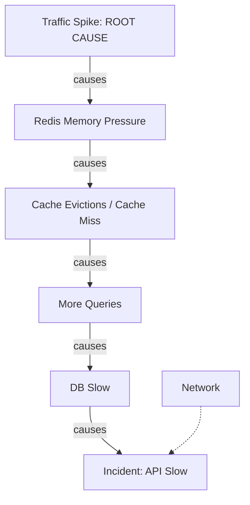
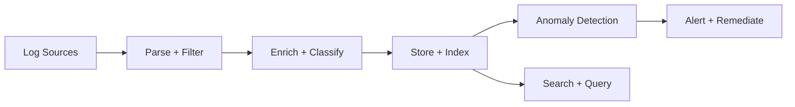
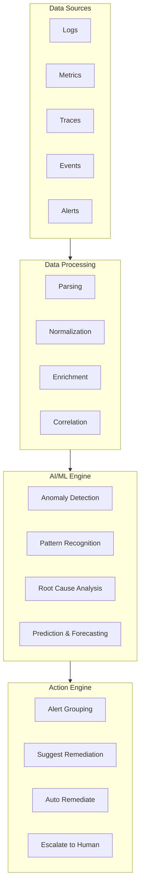

> **AI/ML Engineering Track** | Complexity: `[MEDIUM]` | Time: 6-8
**Prerequisites**: Module 53 (AI for Proactive Cloud Management)

## Why This Module Matters: The Incident That Changed Everything

**Austin, Texas. July 19, 2024. 04:09 UTC.**

What began as a routine sensor configuration update pushed by CrowdStrike to its Falcon sensor quickly escalated into one of the largest IT outages in global history. Within minutes, approximately 8.5 million Windows devices across the globe crashed into endless Blue Screen of Death (BSOD) boot loops. The financial impact was staggering, with direct losses estimated at over $5.4 billion. Airlines grounded thousands of flights, hospitals canceled critical surgeries, and global banking infrastructure ground to a halt.

The profound tragedy of the CrowdStrike outage was not just the bug itself—a logic error caused by an out-of-bounds memory read when processing a newly deployed channel file—but the catastrophic delay in Root Cause Analysis (RCA). Traditional monitoring systems were flooded with offline alerts, but the actual root cause was obscured by the sheer volume of disconnected infrastructure failures. Engineers spent crucial hours manually correlating the timing of the global crashes with recent deployment manifests. Because the affected machines could not boot to forward their crash dumps to centralized logging platforms, the observability pipeline was effectively blind.

If a mature, automated AIOps architecture had been orchestrating the rollout, the outcome could have been drastically different. An AI-driven causal graph could have instantaneously correlated the sub-millisecond deployment of the `C-00000291*.sys` channel file with the cascading host offline metrics, halting the staggered rollout before it reached global saturation. The transition to AI-powered operations is no longer just about saving engineering time; it is an absolute business necessity to prevent total systemic collapse at enterprise scale.

---

## Learning Outcomes

By the end of this module, you will be able to:
- **Diagnose** complex performance bottlenecks and distributed system failures using AI-powered causal graphs and topology mapping.
- **Design** a resilient, hybrid log parsing pipeline that combines deterministic template mining with dynamic LLM inference for unknown formats.
- **Implement** statistical baseline modeling and machine-learning-based anomaly detection for high-throughput time-series infrastructure telemetry.
- **Evaluate** the safety, maturity, and required technical guardrails for deploying automated runbook remediations in production environments.
- **Compare** proprietary vendor capabilities against modern open-source observability ecosystems for building an AIOps stack.

---

## The Log Analysis Revolution: From Regex to Machine Learning

### The Fundamental Problem: More Data Than Humans Can Process

Think of logs like the black box flight data recorder on an airplane. Every microservice, sidecar proxy, database cluster, and network appliance in your infrastructure is constantly streaming state changes to standard output. This diagnostic telemetry is invaluable until you confront the sheer mathematical scale involved in modern cloud-native architectures.

A moderately sized startup with a microservice architecture generates roughly 50 to 100 GB of logs per day. Enterprise platforms and hyperscalers routinely ingest over 1 PB (petabyte) of log data daily. At one petabyte per day, you are looking at approximately 10 billion individual log events. Human-scale analysis—the traditional workflow of `grep`, `awk`, and visual scanning—simply cannot keep pace with machine-scale data generation. To find the root cause of an incident, you are essentially looking for a specific drop of water while drinking from a firehose. 

### The Log Format Jungle

Before an AIOps pipeline can mathematically analyze logs for anomalies, it must parse them. Parsing is the act of extracting structured, typed data fields from raw, unstructured text streams. This sounds straightforward until you audit the diversity of log formats present in a typical Kubernetes cluster.

```text
DIVERSE LOG FORMATS
===================

Apache:
192.168.1.1 - - [10/Oct/2024:13:55:36 -0700] "GET /api/users HTTP/1.1" 200 2326

JSON:
{"timestamp":"2024-10-10T13:55:36Z","level":"ERROR","service":"auth","msg":"Failed login"}

Syslog:
Oct 10 13:55:36 webserver sshd[12345]: Failed password for root from 192.168.1.100

Custom:
[2024-10-10 13:55:36.123] [WARN] [RequestHandler] Connection timeout after 30s

Stack trace:
java.lang.NullPointerException
    at com.example.Service.process(Service.java:42)
    at com.example.Handler.handle(Handler.java:15)
```

### The Regex Maintenance Nightmare

Historically, Platform Engineering teams solved the parsing problem by writing regular expressions (regex). They would configure Logstash or Fluentd with a massive dictionary of regex capture groups to map unstructured text into searchable Elasticsearch fields.

```python
# The old way: regex for every format
import re

APACHE_PATTERN = r'(\S+) \S+ \S+ \[([^\]]+)\] "(\S+) (\S+) \S+" (\d+) (\d+)'
JSON_PATTERN = r'\{.*\}'
SYSLOG_PATTERN = r'(\w+\s+\d+\s+[\d:]+)\s+(\S+)\s+(\S+)\[(\d+)\]:\s+(.*)'

def parse_log(line):
    if re.match(APACHE_PATTERN, line):
        return parse_apache(line)
    elif re.match(JSON_PATTERN, line):
        return parse_json(line)
    # ... hundreds more patterns

# Problem: Brittle, hard to maintain, misses variations
```

Regular expressions are notoriously fragile and computationally expensive (prone to catastrophic backtracking). A simple version bump in a third-party dependency can slightly alter a log format, silently breaking your parser. Worse, regex only matches patterns you have explicitly programmed it to find, leaving you completely blind to novel error structures.

> **Pause and predict**: If a developer introduces a new multi-line log format for a critical microservice, what happens to your regex-based alerting pipeline? Will it false-positive or false-negative?

### LLM-Powered Parsing: Let the AI Figure It Out

Large Language Models (LLMs) provide a paradigm shift in data parsing. Instead of defining rigid, character-by-character syntax rules, you provide the LLM with a semantic prompt describing the desired output structure. The model leverages its vast pre-training on code and log structures to infer the correct extraction schema dynamically.

```python
def parse_with_llm(log_line: str) -> dict:
    """
    Use LLM to parse any log format into structured data.
    """
    prompt = f"""Parse this log line into structured JSON.
Extract: timestamp, level, source, message, and any other relevant fields.

Log line: {log_line}

Return only valid JSON."""

    response = llm.generate(prompt)
    return json.loads(response)

# Works for ANY format without regex maintenance!
```

**Did You Know?** On May 21, 2025, Datadog released Toto, an open-weights time-series foundation model containing 151 million parameters, released under the Apache 2.0 license to help democratize AI observability.

---

## Log Anomaly Detection: Finding Needles in Petabyte Haystacks

When engineers think about log analysis, they often focus exclusively on finding the word `ERROR` or `FATAL`. However, modern distributed systems fail in subtle ways. A database that is locked up might not print an error; it might just stop printing query logs entirely. Anomaly detection algorithms identify three core deviations: frequency spikes, sequence mutations, and volumetric silence.

### Log Template Mining: Finding the Signal in the Noise

To detect an anomaly, the AI must first establish a baseline of "normal." Log template mining algorithms (like Drain3) parse raw logs to extract the static structural template, stripping away dynamic variables like IP addresses, timestamps, and usernames. This reduces millions of raw logs into a few hundred behavioral templates.

```text
RAW LOGS → TEMPLATES
====================

Raw:
  "User john logged in from 192.168.1.1"
  "User alice logged in from 10.0.0.5"
  "User bob logged in from 172.16.0.1"

Template:
  "User <*> logged in from <*>"

Variables:
  john, alice, bob (usernames)
  192.168.1.1, 10.0.0.5, 172.16.0.1 (IPs)
```

### Statistical Anomaly Detection: When Numbers Tell the Story

Once logs are templated, the simplest anomaly detection strategy involves statistical frequency analysis. By tracking the occurrence rate of each template, the system can calculate a rolling mean and standard deviation.

```python
def detect_frequency_anomaly(
    log_counts: List[int],
    threshold_std: float = 3.0
) -> bool:
    """Detect if current log frequency is anomalous."""
    mean = sum(log_counts) / len(log_counts)
    std = statistics.stdev(log_counts)
    current = log_counts[-1]

    z_score = (current - mean) / std if std > 0 else 0
    return abs(z_score) > threshold_std
```

### Deep Learning for Sequence Analysis

Sometimes the volume of logs is perfectly normal, but the order of operations is wrong. Deep learning architectures, particularly Long Short-Term Memory networks (LSTMs), excel at modeling sequential data. By training an LSTM on normal log sequences, the model learns to predict the next log template. If the actual incoming log template has a vanishingly low predicted probability, it is flagged as an anomaly.

```python
# Train LSTM on normal log sequences
# Anomaly = low probability of observed sequence

class LogSequenceModel(nn.Module):
    def __init__(self, vocab_size, embedding_dim, hidden_dim):
        super().__init__()
        self.embedding = nn.Embedding(vocab_size, embedding_dim)
        self.lstm = nn.LSTM(embedding_dim, hidden_dim, batch_first=True)
        self.fc = nn.Linear(hidden_dim, vocab_size)

    def forward(self, x):
        embedded = self.embedding(x)
        output, _ = self.lstm(embedded)
        return self.fc(output)

# Low probability next token = potential anomaly
```

### LLM-Based Detection: Bringing Human Reasoning to Machine Scale

When statistical models flag an anomaly, they lack semantic context. They know the sequence is unusual, but they cannot explain *why*. Injecting an LLM at the final evaluation layer allows the system to analyze the anomalous log within its surrounding temporal context and provide a human-readable diagnosis.

```python
def detect_anomaly_with_llm(log_context: str, current_log: str) -> dict:
    """Use LLM to detect if a log is anomalous given context."""
    prompt = f"""You are a log analysis expert. Given the recent log context,
determine if the current log line is anomalous.

Recent logs:
{log_context}

Current log:
{current_log}

Is this anomalous? Explain why or why not.
Return JSON: {{"is_anomaly": bool, "confidence": 0-1, "explanation": "..."}}"""

    return llm.generate(prompt)
```

**Did You Know?** Prometheus became the second project ever to graduate from the CNCF in August 2018, following only Kubernetes. It revolutionized how we collect the time-series metrics that feed these sophisticated AI anomaly engines.

---

## Root Cause Analysis with AI: From Symptoms to Causes

### The RCA Challenge vs. AI RCA

Traditional incident response relies on human intuition and manual cross-referencing. When an alert fires, engineers open multiple browser tabs—tracing metrics, logs, and database performance individually—in a linear, time-consuming investigation process.

```text
TRADITIONAL RCA TIMELINE
========================

00:00  Alert fires: "API latency high"
00:15  Engineer starts investigation
00:30  Checks API servers - look fine
00:45  Checks database - look fine
01:00  Checks network - look fine
01:15  Checks dependencies...
01:30  Found: Redis memory pressure
01:45  Root cause confirmed
02:00  Fix deployed

Time to resolution: 2 hours
```

AI disrupts this linear process by performing parallel multidimensional correlation. The AIOps engine ingests thousands of metric streams simultaneously, isolating temporal correlations in milliseconds.

```text
AI RCA TIMELINE
===============

00:00  Alert fires: "API latency high"
00:01  AI correlates all metrics at incident time
00:02  AI identifies: Redis memory spike precedes API latency
00:03  AI generates causal chain:
       Redis memory ↑ → Cache evictions → DB load ↑ → API latency ↑
00:04  AI suggests: "Scale Redis or increase memory limit"
00:05  Engineer confirms and deploys fix

Time to resolution: 5 minutes
```

### Causal Graph Analysis: Understanding Cause and Effect

The most advanced AIOps platforms move beyond mere correlation to true causal inference. They construct topological maps of the infrastructure and overlay time-series events to build directed causal graphs. This allows the AI to differentiate between the true root cause (e.g., a Redis memory limit) and downstream symptoms (e.g., API timeouts).



> **Stop and think**: Look at the causal graph above. If you only had CPU monitoring on the API servers, would you be able to find the root cause? What false conclusions might you draw?

### LLM for Complex RCA: When the Graph Isn't Enough

Sometimes, the causal graph points to an application code issue or a complex configuration drift that requires semantic interpretation. In these scenarios, the telemetry is bundled and passed to a large language model.

```python
def ai_root_cause_analysis(
    incident_description: str,
    logs: List[str],
    metrics: Dict[str, List[float]],
    topology: Dict[str, List[str]]
) -> dict:
    """Use LLM for root cause analysis."""
    prompt = f"""You are an expert SRE performing root cause analysis.

INCIDENT: {incident_description}

RELEVANT LOGS (last 30 minutes):
{format_logs(logs)}

METRICS (showing anomalies):
{format_metrics(metrics)}

SYSTEM TOPOLOGY:
{format_topology(topology)}

Analyze this incident and provide:
1. Root cause (most likely)
2. Causal chain (how root cause led to incident)
3. Contributing factors
4. Recommended fix
5. Confidence level (0-100%)

Be specific and cite evidence from logs/metrics."""

    return llm.generate(prompt)
```

---

## Intelligent Incident Response: From Alert to Resolution

### The Evolution of Runbooks

Early automation in operations took the form of imperative runbooks—static scripts that codified specific troubleshooting paths. While useful, they were brittle and unable to adapt to novel edge cases.

```python
# Traditional runbook as code
def respond_to_high_cpu_alert(server):
    # Step 1: Check which process is using CPU
    top_processes = ssh_execute(server, "top -b -n 1 | head -20")

    # Step 2: If it's the app process, check for recent deployments
    if "app_server" in top_processes:
        recent_deploys = get_recent_deployments()
        if recent_deploys:
            # Step 3: Consider rollback
            return suggest_rollback(recent_deploys[0])

    # Step 4: Escalate to human
    return escalate("Platform team", "Unknown high CPU cause")
```

### AI-Powered Runbooks

The modern evolution replaces static scripts with autonomous, goal-oriented AI agents. The agent is provided with a suite of tools (API clients, SSH keys, Kubernetes RBAC tokens) and iterates continuously until the infrastructure returns to a healthy state.

```python
class IntelligentRunbook:
    """AI-powered runbook that adapts to context."""

    def __init__(self, llm, tools):
        self.llm = llm
        self.tools = tools  # SSH, metrics, logs, etc.

    async def execute(self, alert: Alert) -> RunbookResult:
        # Step 1: Gather context
        context = await self.gather_context(alert)

        # Step 2: AI determines next action
        while not context.resolved:
            action = await self.llm.decide_action(context)

            # Step 3: Execute action with human approval if needed
            if action.requires_approval:
                approved = await self.request_approval(action)
                if not approved:
                    continue

            result = await self.tools.execute(action)
            context.add_result(result)

            # Step 4: AI evaluates if issue is resolved
            context.resolved = await self.llm.check_resolved(context)

        return context.to_result()
```

### Automation Levels and Safety Guardrails

Granting an AI system write access to a production environment requires a highly disciplined governance structure. You cannot simply flip a switch and allow an LLM to mutate state. You must implement progressive automation levels.

```text
AUTOMATION LEVELS
=================

Level 0: Alert Only
  AI detects issue → Sends alert → Human investigates

Level 1: Suggest
  AI detects issue → Analyzes → Suggests fix → Human executes

Level 2: Approve
  AI detects issue → Prepares fix → Human approves → AI executes

Level 3: Auto-remediate (Low Risk)
  AI detects issue → Executes fix → Notifies human
  Examples: Restart service, scale up, clear cache

Level 4: Auto-remediate (High Risk)
  AI detects issue → Executes fix → Notifies human
  Examples: Rollback deployment, failover region
  Requires: High confidence + guardrails

TRUST PROGRESSION
=================
Start at Level 1 → Build trust → Progress to higher levels
Never skip levels. Trust is earned through successful remediations.
```

To implement these levels safely, engineering teams must wrap AI remediation workflows in rigorous programmatic guardrails that enforce circuit breakers and rate limits.

```python
async def auto_remediate(alert: Alert) -> RemediationResult:
    """Intelligent auto-remediation with safety guardrails."""

    # 1. Classify the issue
    classification = await classify_alert(alert)

    # 2. Check if auto-remediation is allowed
    if not is_auto_remediatable(classification):
        return escalate_to_human(alert)

    # 3. Determine remediation action
    action = await determine_action(classification)

    # 4. Safety checks
    if action.risk_level > MAX_AUTO_RISK:
        return request_human_approval(action)

    if recent_remediation_count > MAX_REMEDIATIONS_PER_HOUR:
        return escalate_to_human(alert, reason="too_many_remediations")

    # 5. Execute with rollback capability
    try:
        result = await execute_with_rollback(action)

        # 6. Verify fix
        if await verify_remediation(alert):
            return RemediationResult(success=True, action=action)
        else:
            await rollback(action)
            return escalate_to_human(alert, reason="remediation_failed")

    except Exception as e:
        await rollback(action)
        return escalate_to_human(alert, error=e)
```

**Did You Know?** On March 10, 2025, Gartner officially rebranded its "Market Guide for AIOps Platforms" to the "Market Guide for Event Intelligence Solutions (EIS)", defining its core objectives as Augmentation, Acceleration, and Automation.

---

## Ecosystem, Metrics, and OpenTelemetry

### Beyond Counting Errors

To feed advanced ML models effectively, logs must be distilled into numerical metrics. AIOps thrives not on individual text strings, but on multidimensional time-series data.

```text
LOG-DERIVED METRICS
===================

Error Metrics:
  • Error rate (errors/minute)
  • Error types distribution
  • New error rate (never-seen errors)

Performance Metrics:
  • Response time (p50, p95, p99)
  • Throughput (requests/second)
  • Queue depth

Security Metrics:
  • Failed login attempts
  • Unusual access patterns
  • Privilege escalations

Business Metrics:
  • Transactions completed
  • User actions (signup, purchase)
  • Feature usage
```

### Log Analytics Pipeline



### Commercial Platforms and Open Source

The observability landscape is fiercely competitive, split between heavy enterprise platforms and nimble open-source stacks. Adopting open-source tooling avoids vendor lock-in but requires significant engineering effort to maintain the underlying message brokers (like Kafka) and indexing databases (like Elasticsearch). 

```text
AIOPS PLATFORMS (2024)
======================

Enterprise:
  • Splunk ITSI        - ML-powered IT service intelligence
  • Datadog           - Watchdog AI for anomaly detection
  • Dynatrace Davis   - AI-powered root cause analysis
  • New Relic         - Applied Intelligence
  • ServiceNow ITOM   - AIOps with ITSM integration

Specialized:
  • Moogsoft          - AI incident management (pioneer)
  • BigPanda          - Event correlation and automation
  • PagerDuty         - Intelligent incident response
  • OpsRamp           - Hybrid infrastructure AIOps

Cloud-Native:
  • AWS DevOps Guru   - ML-powered operational insights
  • Azure Monitor     - Smart detection and diagnostics
  • GCP Operations    - Integrated logging and monitoring
```

**Did You Know?** In November 2023, New Relic was taken private by Francisco Partners and TPG in a massive transaction valued at $6.5 billion. According to New Relic's self-published 2026 data report, their AIOps users ship code at an 80% higher frequency.

```text
OPEN SOURCE AIOPS
=================

Log Management:
  • Elasticsearch + Kibana (ELK)
  • Grafana Loki
  • Apache Kafka (streaming)

Anomaly Detection:
  • Apache Spark MLlib
  • PyOD (Python Outlier Detection)
  • Alibi Detect

Log Parsing:
  • Drain3
  • Logparser
  • Spell

Automation:
  • Ansible + AWX
  • Rundeck
  • StackStorm
```

### Architecture Overview



When integrating these architectures, the central aggregation fabric becomes critical. The AIOps agent acts as a unified translation layer across disparate API endpoints.

```python
class AIOpsIntegration:
    """Example integrations for an AIOps system."""

    # Log sources
    log_sources = [
        "elasticsearch://logs-cluster:9200",
        "s3://company-logs/",
        "kafka://log-stream:9092"
    ]

    # Metric sources
    metric_sources = [
        "prometheus://metrics:9090",
        "cloudwatch://us-east-1",
        "datadog://api.datadoghq.com"
    ]

    # Alert destinations
    alert_destinations = [
        "pagerduty://events.pagerduty.com",
        "slack://hooks.slack.com/services/xxx",
        "email://alerts@company.com"
    ]

    # Remediation tools
    remediation_tools = [
        "kubernetes://cluster.local",
        "ansible://ansible-tower:443",
        "terraform://terraform-cloud"
    ]
```

### The State of OpenTelemetry (2026)

To feed the architecture above, the industry has standardized around the CNCF OpenTelemetry (OTel) project. OTel provides a single, vendor-agnostic standard for emitting telemetry. However, it is critical to understand the project's maturity matrix when architecting an AIOps pipeline. As of April 2026, OpenTelemetry traces, metrics, and logs have all reached full stability and are widely adopted in production. Conversely, the continuous profiling signal (*profiles*) remains in active development status. Relying on profiles for critical ML anomaly detection introduces risk, as breaking protocol changes are still occurring in upstream releases.

---

## Common Mistakes in AIOps Adoption

| Mistake | Why It Happens | How to Fix It |
| :--- | :--- | :--- |
| **Skipping parsing for LLMs** | Feeding raw logs to LLMs seems easier than building pipelines. | LLMs charge by the token. Use Drain3 to extract templates, sending only parameters to the LLM. |
| **Automating Level 4 immediately** | Teams get eager for "self-healing" and skip trust-building. | Start at Level 1 (Suggest). Require human approval for at least 30 days before automating. |
| **Ignoring Silence Anomalies** | Most alerts trigger on error spikes, not volume drops. | Implement dead-man's switches and throughput anomaly detection via OpenTelemetry metrics. |
| **Regex for stack traces** | Stack traces break across multiple log events in container runtimes. | Use native JSON logging at the application level to keep traces in a single payload. |
| **Trusting vendor correlations** | Vendors claim 90%+ noise reduction, confusing correlation with causation. | Measure Mean Time to Resolution (MTTR) with your own baseline data. |
| **Feeding PII to public LLMs** | Logs inadvertently capture tokens, passwords, or emails. | Implement an aggressive data masking layer before logs hit any external API. |
| **Over-relying on CPU metrics** | Infrastructure metrics only show symptoms, not the root cause. | Unify traces, logs, and metrics into a causal graph leveraging the OpenTelemetry model. |

---

## Hands-On Exercise: Building the AIOps Foundations

In this lab, you will move beyond theory and execute a local simulation of an AIOps pipeline. To ensure these examples are fully executable in your local terminal or CI/CD lab validation environments, we will begin by mocking the LLM integration.

### Task 0: Environment Setup

Execute the following Python setup in your local environment. This creates the foundational dependencies and the dummy LLM interface required for the subsequent tasks.

```python
# Save as lab_setup.py and run: python3 lab_setup.py
import json
import re
import statistics
from collections import deque

class MockLLMClient:
    def generate(self, prompt: str) -> str:
        if "strict JSON with fields" in prompt:
            return '{"timestamp": "2026-04-13T10:00:00Z", "level": "WARN", "message": "Unknown format detected by LLM fallback"}'
        if "causal chain" in prompt:
            return "High Traffic -> Resource Starvation -> API Timeout. Suggestion: Apply Horizontal Pod Autoscaler scaling."
        return "{}"

llm_client = MockLLMClient()
print("Environment initialized successfully.")
```

### Task 1: Build a Log Parser

**Challenge**: Implement an intelligent log parser that attempts deterministic pattern matching first, but falls back to the LLM for unknown formats. You must complete the implementation of the class stub below:

```python
# TODO: Implement intelligent log parser
class IntelligentLogParser:
    """
    Parse logs using pattern matching + LLM fallback.
    1. Try known patterns first (fast)
    2. Fall back to LLM for unknown formats
    3. Learn new patterns from LLM results
    """
    pass
```

<details>
<summary>View Task 1 Solution</summary>

```python
import re
import json

class IntelligentLogParser:
    def __init__(self, llm_client):
        self.llm = llm_client
        self.known_patterns = {
            "apache": re.compile(r'(?P<ip>\S+) \S+ \S+ \[(?P<timestamp>[^\]]+)\] "(?P<method>\S+) (?P<path>\S+) \S+" (?P<status>\d+) (?P<size>\d+)')
        }
        
    def parse(self, log_line: str) -> dict:
        # Step 1: Fast deterministic matching
        for name, pattern in self.known_patterns.items():
            match = pattern.match(log_line)
            if match:
                return {"format": name, "data": match.groupdict()}
                
        # Step 2: Fallback to LLM
        prompt = f"Parse this unknown log line into strict JSON with fields: timestamp, level, message. Log: {log_line}"
        llm_response = self.llm.generate(prompt)
        return {"format": "llm_inferred", "data": json.loads(llm_response)}

# Executable Test:
# parser = IntelligentLogParser(llm_client)
# print(parser.parse('192.168.1.1 - - [13/Apr/2026:10:00:00 +0000] "GET /" 200 123'))
```
</details>

### Task 2: Implement Anomaly Detection

**Challenge**: Build a log anomaly detector that identifies frequency anomalies using Z-scores over a rolling window. Complete the class stub below:

```python
# TODO: Build log anomaly detector
class LogAnomalyDetector:
    """
    Detect anomalies in log streams:
    1. Template extraction
    2. Frequency analysis
    3. Sequence analysis
    4. Content analysis
    """
    pass
```

<details>
<summary>View Task 2 Solution</summary>

```python
import statistics
from collections import deque

class LogAnomalyDetector:
    def __init__(self, window_size=60, threshold=3.0):
        self.history = deque(maxlen=window_size)
        self.threshold = threshold
        
    def analyze_frequency(self, current_count: int) -> bool:
        if len(self.history) < 10: # Need baseline
            self.history.append(current_count)
            return False
            
        mean = statistics.mean(self.history)
        std = statistics.stdev(self.history)
        
        if std == 0:
            z_score = 0
        else:
            z_score = abs(current_count - mean) / std
            
        self.history.append(current_count)
        return z_score > self.threshold

# Executable Test:
# detector = LogAnomalyDetector(threshold=2.0)
# for i in range(15): detector.analyze_frequency(10) # Seed baseline
# is_anomaly = detector.analyze_frequency(150) # Feed massive spike
# print(f"Spike detected? {is_anomaly}")
```
</details>

### Task 3: Create an RCA Assistant

**Challenge**: Create an RCA Assistant that takes incident context and formats a robust prompt to synthesize a causal chain. Complete the stub:

```python
# TODO: Build AI-powered RCA assistant
class RCAAssistant:
    """
    1. Gather relevant logs, metrics, events
    2. Use LLM to analyze and correlate
    3. Generate causal chain
    4. Suggest remediation
    """
    pass
```

<details>
<summary>View Task 3 Solution</summary>

```python
class RCAAssistant:
    def __init__(self, llm_client):
        self.llm = llm_client
        
    def synthesize_incident(self, incident_name: str, metrics: dict, logs: list) -> str:
        formatted_logs = "\n".join(logs[-5:]) # grab last 5
        prompt = f"""
        You are an expert SRE. We have an incident: {incident_name}
        Anomalous Metrics: {metrics}
        Recent Logs:
        {formatted_logs}
        
        Output a causal chain using arrows (A -> B -> C) and suggest a safe Level 1 remediation.
        """
        return self.llm.generate(prompt)

# Executable Test:
# rca = RCAAssistant(llm_client)
# report = rca.synthesize_incident("API Latency", {"cpu": "99%"}, ["Timeout occurred"])
# print(report)
```
</details>

### Task 4: Resource Optimization in K8s v1.35+

**Challenge**: Use the Robusta KRR (Kubernetes Resource Recommender) CLI tool to analyze your cluster's Prometheus data and output optimized CPU/Memory limits for your deployments running on Kubernetes v1.35.

<details>
<summary>View Task 4 Solution</summary>

Robusta KRR queries Prometheus for actual pod usage and recommends CPU/memory limits. Run this directly against your v1.35+ cluster context:

```bash
# Ensure you are connected to your K8s v1.35 context
kubectl cluster-info

# Run Robusta KRR via Docker to scan the 'production' namespace
docker run --rm -it \
  -v ~/.kube/config:/root/.kube/config \
  ghcr.io/robusta-dev/krr:latest simple \
  --namespace production \
  --prometheus-url http://prometheus-server.monitoring.svc.cluster.local:9090
```

*CI/CD Pipeline Note:* If you are executing this within an automated, non-interactive CI/CD pipeline script, omit the `-it` flags to prevent the process from hanging while attempting to allocate a TTY. 
This generates an AI-informed report suggesting exact YAML adjustments for your `resources.requests` and `resources.limits`.
</details>

### Success Checklist
- [ ] You implemented a hybrid deterministic/LLM parser and successfully ran the fallback branch.
- [ ] You successfully utilized rolling windows for statistical anomaly detection, catching a synthesized spike.
- [ ] You crafted a structured prompt for Root Cause Analysis and received a valid causal chain output.
- [ ] You executed Robusta KRR against a modern K8s deployment (or properly simulated the script locally).

---

## Knowledge Check

<details>
<summary><strong>Question 1: Scenario</strong> - An e-commerce site experiences a 400% spike in checkout latency, but the log aggregation tool shows zero error-level logs. Which anomaly detection strategy is best suited to catch this?</summary>

**Answer**: Performance and metrics-derived anomaly detection (specifically sequence or duration anomalies). Since the system is not failing outright, error logs will not exist. By evaluating the mathematical duration of the logs or tracking time-series metric throughput, an AI agent can flag the performance anomaly without relying on string-based "ERROR" flags.
</details>

<details>
<summary><strong>Question 2: Scenario</strong> - You are designing a log parsing pipeline for an enterprise with 500+ legacy microservices. Why is a hybrid approach combining Drain3 and LLMs superior to pure LLM parsing?</summary>

**Answer**: Pure LLM parsing is cost-prohibitive and relatively slow at petabyte scale. A hybrid pipeline leverages Drain3 to rapidly categorize known templates and variable structures using fixed-depth trees. The LLM is then selectively invoked only as a fallback for entirely new, unseen log formats, optimizing both compute costs and processing latency.
</details>

<details>
<summary><strong>Question 3: Scenario</strong> - A Level 4 automated runbook restarts a database during a traffic spike, which immediately corrupts the index and causes a prolonged outage. What critical safety guardrail was missing from the AIOps architecture?</summary>

**Answer**: The system lacked context-aware risk checks and rollback capability. A Level 4 automation should never execute a state-mutating operation (like a database restart) without verifying whether the issue is load-based versus crash-based. Furthermore, no auto-remediation should execute unless an automated rollback function is verified and available.
</details>

<details>
<summary><strong>Question 4: Scenario</strong> - An AIOps vendor claims their Event Intelligence Solution provides a "95% alert noise reduction." How do you technically validate their correlation engine against your actual infrastructure?</summary>

**Answer**: You must measure your historical Mean Time to Detect (MTTD) and Mean Time to Resolution (MTTR) baseline using your own data. By feeding historical incidents into their correlation engine and comparing the engine's consolidated alerts against your manual ticket logs, you verify causation over simple correlation, bypassing marketing metrics.
</details>

<details>
<summary><strong>Question 5: Scenario</strong> - A monitoring dashboard shows a spike in "Cache Miss" metrics, followed immediately by "DB Slow" alerts. How does an AI causal graph differentiate the root cause from the symptoms in this scenario?</summary>

**Answer**: The AI causal graph traces temporal and topological dependencies across the stack. It observes that the cache miss event mathematically preceded the database latency event, and understands topologically that a cache miss increases database queries. Therefore, it identifies the cache miss as the causal origin, labeling the database slowness as a downstream symptom.
</details>

<details>
<summary><strong>Question 6: Scenario</strong> - Your OpenTelemetry trace and metric signals are stable, but you want to incorporate continuous code profiling into your AIOps ML models. Based on the CNCF OpenTelemetry project's current status, what risk must you mitigate?</summary>

**Answer**: As of April 2026, while OpenTelemetry traces, metrics, and logs are stable, the *profiles* signal remains in the development stage. You must mitigate the risk of breaking API/Protocol changes and acknowledge it is not yet production-ready for enterprise deployment.
</details>

<details>
<summary><strong>Question 7: Scenario</strong> - A team wants to implement AI-generated Kubernetes remediation artifacts (like those introduced by Dynatrace in 2025) directly into their K8s v1.35 production cluster. What is the safest implementation strategy?</summary>

**Answer**: The team should implement the artifacts at Automation Level 2 (Approve). The AI generates the remediation YAML (e.g., adjusting CPU/Memory limits), but a human operator must review and apply the artifact to the v1.35 cluster. Full automation (Level 3 or 4) should only be adopted after establishing long-term trust in the AI's generation accuracy.
</details>

---

## ⏭ Next Steps

You've successfully completed all the core technical infrastructure modules!

**Up Next**: [History of AI/ML](../history/module-1.1-history-of-ai-machine-learning/)

Learn the fascinating history behind the statistical models and algorithms you've just deployed:
- Module 55: History of AI/ML - Foundations
- Module 56: History of AI/ML - Modern Era
- Module 57: History of AI/ML - Future Directions

---

_Module 1.2 Complete! You now understand AIOps and AI-powered log analysis!_  
_"The best alert is the one that tells you exactly what's wrong and how to fix it."_
