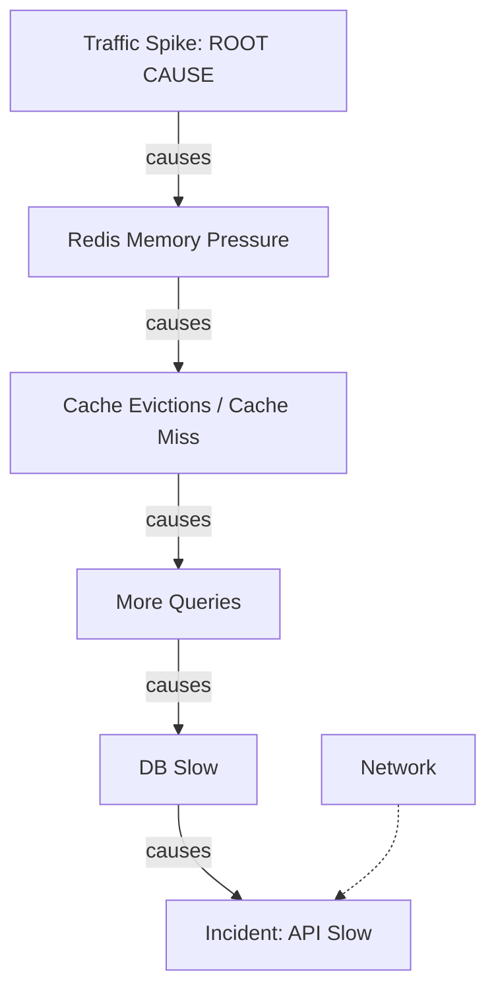
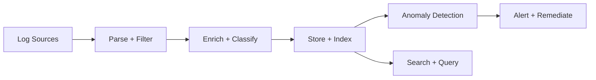
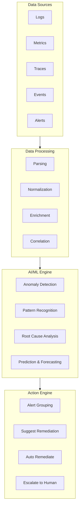

> **AI/ML Engineering Track** | Complexity: `[MEDIUM]` | Time: 6-8
**Prerequisites**: Module 1.1 (Cloud AI Services)

## Learning Outcomes

By the end of this module, you will be able to reason from raw telemetry to safe remediation decisions instead of treating AIOps as vendor magic:
- **Diagnose** complex performance bottlenecks and distributed system failures using AI-powered causal graphs and topology mapping.
- **Design** a resilient, hybrid log parsing pipeline that combines deterministic template mining with dynamic LLM inference for unknown formats.
- **Implement** statistical baseline modeling and machine-learning-based anomaly detection for high-throughput time-series infrastructure telemetry.
- **Evaluate** the safety, maturity, and required technical guardrails for deploying automated runbook remediations in production environments.
- **Compare** proprietary vendor capabilities against modern open-source observability ecosystems for building an AIOps stack.

---

## Why This Module Matters

**The incident that changed everything** is a useful starting point because it shows how quickly operational failure can move faster than manual diagnosis.

**Austin, Texas. July 19, 2024. 04:09 UTC.** What began as a routine sensor configuration update pushed by CrowdStrike to its Falcon sensor quickly escalated into one of the largest IT outages in global history. Within minutes, [Microsoft estimated that approximately 8.5 million Windows devices](https://blogs.microsoft.com/blog/2024/07/20/helping-our-customers-through-the-crowdstrike-outage/) across the globe crashed into endless Blue Screen of Death (BSOD) boot loops. Airlines grounded thousands of flights, hospitals canceled critical surgeries, and global banking infrastructure ground to a halt. [Parametrix Insurance's estimate](https://www.parametrixinsurance.com/reports-white-papers/crowdstrikes-impact-on-the-fortune-500) put US Fortune-500 direct losses at roughly $5.4 billion, though the total global economic impact was undoubtedly far larger once supply-chain ripple effects and lost productivity were accounted for.

The profound tragedy of the CrowdStrike outage was not just the bug itself -- [CrowdStrike's preliminary post-incident report described an out-of-bounds memory read](https://www.crowdstrike.com/en-us/blog/falcon-content-update-preliminary-post-incident-report/) when processing the Channel File 291 update -- but the catastrophic delay in Root Cause Analysis (RCA). Traditional monitoring systems were flooded with offline alerts, but the actual root cause was obscured by the sheer volume of disconnected infrastructure failures. Engineers spent crucial hours manually correlating the timing of the global crashes with recent deployment manifests. Because the affected machines could not boot to forward their crash dumps to centralized logging platforms, the observability pipeline was effectively blind.

If a mature, automated AIOps architecture had been orchestrating the rollout, the outcome could have been drastically different. An AI-driven causal graph could have correlated the deployment of the `C-00000291*.sys` channel file with the cascading host-offline metrics in a small canary cohort and blocked the global push — CrowdStrike's content updates were not staged or canaried at the time, which is precisely why the bad file reached global saturation within minutes (the public post-incident report committed to adding staged deployment afterward). The transition to AI-powered operations is no longer just about saving engineering time; it is an absolute business necessity to prevent total systemic collapse at enterprise scale.

The CrowdStrike incident is an extreme case, but the underlying pattern repeats every day in data centers and cloud regions around the world: a configuration change, a library update, a subtle memory leak -- each one silently degrading a system until it crosses a threshold and becomes an incident. The traditional response model treats each incident as a unique puzzle to be solved by human intuition, but modern infrastructure has outgrown human-scale reasoning. The number of possible failure modes in a Kubernetes cluster with 200 microservices, each with its own dependencies, configuration parameters, and resource profiles, is combinatorially vast. AIOps is the discipline of applying machine learning, statistical modeling, and automated reasoning to this operational complexity -- not to replace SREs, but to give them leverage over problems that would otherwise take hours or days to diagnose manually. This module will take you through the full AIOps stack: from ingesting and parsing the raw telemetry, through detecting anomalies and tracing their root causes, to safely automating the response.

## The Log Analysis Revolution: From Regex to Machine Learning

### The Fundamental Problem: More Data Than Humans Can Process

Think of logs like the black box flight data recorder on an airplane. Every microservice, sidecar proxy, database cluster, and network appliance in your infrastructure is constantly streaming state changes to standard output. This diagnostic telemetry is invaluable until you confront the sheer mathematical scale involved in modern cloud-native architectures.

A moderately sized startup with a microservice architecture generates roughly 50 to 100 GB of logs per day. Enterprise platforms and hyperscalers routinely ingest over 1 PB (petabyte) of log data daily. At one petabyte per day, you are looking at approximately 10 billion individual log events. Human-scale analysis—the traditional workflow of `grep`, `awk`, and visual scanning—simply cannot keep pace with machine-scale data generation. To find the root cause of an incident, you are essentially looking for a specific drop of water while drinking from a firehose.

The challenge is not just one of scale, but of three compounding dimensions. **Volume** is the raw byte count — petabytes streaming through your ingestion pipeline every day, far exceeding what any team can manually review. **Velocity** is the rate of arrival: a Kubernetes cluster can emit hundreds of thousands of log events per second during a cascading failure, and by the time a human opens a dashboard, the diagnostic window has already passed. **Variety** is the format diversity problem — every component in your stack speaks a different dialect, from structured JSON emitted by modern service meshes to semi-structured syslog from legacy appliances to completely unstructured stack traces from application code. AI is uniquely suited to address all three: machine learning models process volume at line speed, detect velocity anomalies in real time, and generalize across format variety without per-source configuration. This is why the shift from regex to AI is not an incremental improvement but a qualitative leap in what is operationally possible. 

### The Log Format Jungle

Before an AIOps pipeline can mathematically analyze logs for anomalies, it must parse them. Parsing is the act of extracting structured, typed data fields from raw, unstructured text streams. This sounds straightforward until you audit the diversity of log formats present in a typical Kubernetes cluster.

```text
DIVERSE LOG FORMATS
===================

Apache:
192.168.1.1 - - [10/Oct/2024:13:55:36 -0700] "GET /api/users HTTP/1.1" 200 2326

JSON:
{"timestamp":"2024-10-10T13:55:36Z","level":"ERROR","service":"auth","msg":"Failed login"}

Syslog:
Oct 10 13:55:36 webserver sshd[12345]: Failed password for root from 192.168.1.100

Custom:
[2024-10-10 13:55:36.123] [WARN] [RequestHandler] Connection timeout after 30s

Stack trace:
java.lang.NullPointerException
    at com.example.Service.process(Service.java:42)
    at com.example.Handler.handle(Handler.java:15)
```

### The Regex Maintenance Nightmare

Historically, Platform Engineering teams solved the parsing problem by writing regular expressions (regex). They would configure Logstash or Fluentd with a massive dictionary of regex capture groups to map unstructured text into searchable Elasticsearch fields.

```python
# The old way: regex for every format
import re

APACHE_PATTERN = r'(\S+) \S+ \S+ \[([^\]]+)\] "(\S+) (\S+) \S+" (\d+) (\d+)'
JSON_PATTERN = r'\{.*\}'
SYSLOG_PATTERN = r'(\w+\s+\d+\s+[\d:]+)\s+(\S+)\s+(\S+)\[(\d+)\]:\s+(.*)'

def parse_log(line):
    if re.match(APACHE_PATTERN, line):
        return parse_apache(line)
    elif re.match(JSON_PATTERN, line):
        return parse_json(line)
    # ... hundreds more patterns

# Problem: Brittle, hard to maintain, misses variations
```

Regular expressions are notoriously fragile and computationally expensive (prone to catastrophic backtracking). A simple version bump in a third-party dependency can slightly alter a log format, silently breaking your parser. Worse, regex only matches patterns you have explicitly programmed it to find, leaving you completely blind to novel error structures.

> **Pause and predict**: If a developer introduces a new multi-line log format for a critical microservice, what happens to your regex-based alerting pipeline? Will it false-positive or false-negative?

### LLM-Powered Parsing: Let the AI Figure It Out

Large Language Models (LLMs) provide a paradigm shift in data parsing. Instead of defining rigid, character-by-character syntax rules, you provide the LLM with a semantic prompt describing the desired output structure. The model leverages its vast pre-training on code and log structures to infer the correct extraction schema dynamically.

```python
def parse_with_llm(log_line: str) -> dict:
    """
    Use LLM to parse any log format into structured data.
    """
    prompt = f"""Parse this log line into structured JSON.
Extract: timestamp, level, source, message, and any other relevant fields.

Log line: {log_line}

Return only valid JSON."""

    response = llm.generate(prompt)
    return json.loads(response)

# Works for ANY format without regex maintenance!
```

This LLM-first approach is elegant but has a critical operational constraint: **token economics**. Every byte of log data passed to an LLM costs money and latency. Consider the math: at a conservative $0.50 per million input tokens, parsing 10 billion daily log events — even with an average of just 50 tokens per log line — costs roughly $250,000 per day. The LLM inference latency, measured in hundreds of milliseconds per call, also makes it far too slow for high-throughput streaming pipelines where decisions must be made in microseconds.

### The Hybrid Architecture: Drain3 + LLM

The production-grade solution is a two-tier pipeline. The first tier uses **Drain3**, a deterministic log template mining algorithm, to handle the vast majority of known log formats at near-zero computational cost. Drain3 works by constructing a fixed-depth parse tree where each tree node represents a token position in the log message. As raw log lines arrive, Drain3 traverses the tree token by token, matching static structure tokens (like `User`, `logged`, `in`, `from`) while parameterizing dynamic tokens (like `john`, `192.168.1.1`) into wildcard placeholders. The tree depth is fixed — typically 4 to 6 levels — which keeps both traversal and insertion to O(n) complexity where n is the token count of a single log line, not the size of the entire log corpus. This means Drain3 can process millions of log events per second on modest hardware.

The important detail is that Drain3 does not compare every new log line against every template already discovered. It first narrows the search space using cheap structural hints such as token count and early-position tokens, then compares the candidate line against only the cluster templates that could plausibly match. Dynamic values are masked before they pollute the tree: timestamps, UUIDs, pod names, request IDs, IP addresses, and numeric counters become parameters rather than new branches. Without that masking step, a Kubernetes pod restart would create a brand-new template every time because the pod suffix changed, and the parser would confuse normal identity churn with a novel operational behavior. Template mining is therefore less like natural-language understanding and more like building a high-speed grammar for your infrastructure.

This also explains why deterministic mining and LLM parsing complement each other instead of competing. Drain3 is excellent when the structure is stable and the variable fields are predictable, but it cannot infer intent from a previously unseen stack trace or a vendor message whose fields are reordered in a surprising way. The LLM is better at semantic recovery: it can infer that `upstream prematurely closed connection` is probably a proxy/backend relationship rather than a generic string. The safe architecture uses that semantic power sparingly, converts the LLM output into an explicit template, and stores the template with provenance, confidence, and review metadata. In production, you also need template aging and rollback. If a bad LLM parse turns a rare security event into a harmless-looking wildcard template, the pipeline must be able to quarantine that template, replay the affected log window, and restore the previous deterministic parser state.

The second tier is the LLM fallback. Only when Drain3 encounters a log line that fails to match any known template — typically an entirely new log format introduced by a recent deployment — does the system invoke the more expensive LLM path. The LLM parses the novel format and the resulting structured template is fed back into Drain3's parse tree, so the next occurrence of that format is handled deterministically. This hybrid design gives you the speed and cost-efficiency of deterministic parsing for 99%+ of your log volume, while retaining the flexibility of LLM-powered generalization for the long tail of unknown formats. It is the same architectural principle behind CPU cache hierarchies: keep the fast path fast, and pay the expensive path only when necessary.

A notable example of industry investment in this direction: Datadog released Toto, an open-weights time-series foundation model under the Apache 2.0 license in 2025, designed to democratize AI-driven observability beyond proprietary vendor stacks. Foundation models for observability data represent a shift from per-customer training to shared pre-trained representations that can be fine-tuned on individual infrastructure patterns.

---

## Log Anomaly Detection: Finding Needles in Petabyte Haystacks

When engineers think about log analysis, they often focus exclusively on finding the word `ERROR` or `FATAL`. However, modern distributed systems fail in subtle ways. A database that is locked up might not print an error; it might just stop printing query logs entirely. Anomaly detection algorithms identify three core deviations: frequency spikes, sequence mutations, and volumetric silence.

### Log Template Mining: Finding the Signal in the Noise

To detect an anomaly, the AI must first establish a baseline of "normal." Log template mining algorithms (like Drain3) parse raw logs to extract the static structural template, stripping away dynamic variables like IP addresses, timestamps, and usernames. This reduces millions of raw logs into a few hundred behavioral templates.

```text
RAW LOGS → TEMPLATES
====================

Raw:
  "User john logged in from 192.168.1.1"
  "User alice logged in from 10.0.0.5"
  "User bob logged in from 172.16.0.1"

Template:
  "User <*> logged in from <*>"

Variables:
  john, alice, bob (usernames)
  192.168.1.1, 10.0.0.5, 172.16.0.1 (IPs)
```

### Statistical Anomaly Detection: When Numbers Tell the Story

Once logs are templated, the simplest anomaly detection strategy involves statistical frequency analysis. By tracking the occurrence rate of each template, the system can calculate a rolling mean and standard deviation.

```python
def detect_frequency_anomaly(
    log_counts: List[int],
    threshold_std: float = 3.0
) -> bool:
    """Detect if current log frequency is anomalous."""
    mean = sum(log_counts) / len(log_counts)
    std = statistics.stdev(log_counts)
    current = log_counts[-1]

    z_score = (current - mean) / std if std > 0 else 0
    return abs(z_score) > threshold_std
```

The z-score approach is simple, but understanding its limitations is essential before deploying it in production. The z-score assumes a normal distribution of log frequencies, which holds reasonably well for steady-state systems but breaks down during deployments, traffic ramps, and scheduled maintenance windows — exactly the times when false positives are most disruptive. A more robust alternative is the **Median Absolute Deviation (MAD)**, which uses the median instead of the mean and is therefore resistant to the outlier contamination that plagues moment-based statistics during incident conditions. Another common refinement is **exponentially weighted moving averages (EWMA)**, which give more weight to recent observations and decay the influence of older data, allowing the anomaly threshold to adapt to slowly drifting baselines without manual recalibration. Production-grade anomaly detection systems typically combine multiple statistical tests — z-score for rapid detection, MAD for robustness, and EWMA for drift adaptation — and then use an ensemble voting mechanism to suppress false positives. The principle is that no single statistical test is reliable enough on its own; the system must cross-validate across methods before raising an alert.

### Deep Learning for Sequence Analysis

Sometimes the volume of logs is perfectly normal, but the order of operations is wrong. Deep learning architectures, particularly Long Short-Term Memory networks (LSTMs), excel at modeling sequential data. By training an LSTM on normal log sequences, the model learns to predict the next log template. If the actual incoming log template has a vanishingly low predicted probability, it is flagged as an anomaly.

To understand why LSTMs are the architecture of choice here, consider the problem through the lens of what makes log sequences difficult to model. A normal operational sequence might be: authentication success, then database query, then cache write, then HTTP 200 response. The critical information is not just which events occur but the **order** and **distance** between them. A cache write that happens before authentication is suspicious, even if the individual events are all normal. Traditional recurrent neural networks struggle with this because of the vanishing gradient problem — the influence of early tokens in a long sequence decays exponentially during backpropagation, making it impossible to learn dependencies that span more than a few steps.

LSTMs solve this with an explicit **memory cell** and three gating mechanisms: the forget gate decides what old information to discard, the input gate decides what new information to store, and the output gate decides what to expose to the next layer. This architecture allows an LSTM to remember that an authentication event occurred 50 steps ago and use that information to evaluate whether the current cache write is contextually appropriate.

The canonical application of this approach to log analysis is **DeepLog**, introduced by researchers at the University of Utah in 2017. DeepLog treats log anomaly detection as a multi-class classification problem: given a sequence of log template keys (the numeric IDs assigned by Drain3 or a similar template miner), predict the probability distribution over the next possible template key. During training, the model learns the normal transition patterns of your system. During inference, if the actual next template has a probability below a configurable threshold — typically set at the 0.1st percentile of the training distribution — the sequence is flagged as anomalous. The key insight is that DeepLog does not need labeled anomaly data; it learns normality from benign operational logs and treats deviation from that learned normality as the anomaly signal.

```python
# Train LSTM on normal log sequences
# Anomaly = low probability of observed sequence

class LogSequenceModel(nn.Module):
    def __init__(self, vocab_size, embedding_dim, hidden_dim):
        super().__init__()
        self.embedding = nn.Embedding(vocab_size, embedding_dim)
        self.lstm = nn.LSTM(embedding_dim, hidden_dim, batch_first=True)
        self.fc = nn.Linear(hidden_dim, vocab_size)

    def forward(self, x):
        embedded = self.embedding(x)
        output, _ = self.lstm(embedded)
        return self.fc(output)

# Low probability next token = potential anomaly
```

### LLM-Based Detection: Bringing Human Reasoning to Machine Scale

When statistical models flag an anomaly, they lack semantic context. They know the sequence is unusual, but they cannot explain *why*. Injecting an LLM at the final evaluation layer allows the system to analyze the anomalous log within its surrounding temporal context and provide a human-readable diagnosis.

```python
def detect_anomaly_with_llm(log_context: str, current_log: str) -> dict:
    """Use LLM to detect if a log is anomalous given context."""
    prompt = f"""You are a log analysis expert. Given the recent log context,
determine if the current log line is anomalous.

Recent logs:
{log_context}

Current log:
{current_log}

Is this anomalous? Explain why or why not.
Return JSON: {{"is_anomaly": bool, "confidence": 0-1, "explanation": "..."}}"""

    return llm.generate(prompt)
```

The value of LLM-based detection is not speed — an LLM call takes hundreds of milliseconds compared to microseconds for a statistical test — but **semantic precision**. Consider a log line that reads `Connection to payment-gateway-a timed out after 30s`. A statistical model sees a spike in timeout events and raises an alert. An LLM reads the same line and recognizes that `payment-gateway-a` is a critical dependency for the checkout flow, that the 30-second timeout matches the configured circuit-breaker threshold, and that the previous five occurrences were all against `payment-gateway-b` in the European region. The LLM can then produce an explanation like: "The timeout pattern has shifted from the EU region to the US-East payment gateway; this is not a global connectivity issue but a region-specific degradation, likely caused by the network configuration change deployed to us-east-1 at 14:00 UTC." This is the kind of contextual reasoning that turns an alert into a diagnosis.

The practical deployment model is a **cascade**: statistical and sequence-based models operate as the first line of defense, scanning every log event at line speed with near-zero latency. Only when these fast models flag an anomaly does the system assemble a context window — the anomalous event plus the surrounding log lines, related metrics, and topology information — and pass it to the LLM for semantic interpretation. This cascade design keeps the cost per log event at the sub-cent level for 99.9% of your ingest volume, while still delivering human-quality diagnostic reasoning on the events that actually matter.

It is worth noting the infrastructure that makes these ML pipelines possible at scale. Prometheus, which became the second project ever to graduate from the CNCF in August 2018 following only Kubernetes, revolutionized time-series metrics collection with its pull-based model. The metrics that feed AI anomaly engines — request latencies, error rates, resource utilization — flow through Prometheus and its ecosystem before reaching the ML models that reason about them.

---

## Root Cause Analysis with AI: From Symptoms to Causes

### The RCA Challenge vs. AI RCA

Traditional incident response relies on human intuition and manual cross-referencing. When an alert fires, engineers open multiple browser tabs—tracing metrics, logs, and database performance individually—in a linear, time-consuming investigation process.

```text
TRADITIONAL RCA TIMELINE
========================

00:00  Alert fires: "API latency high"
00:15  Engineer starts investigation
00:30  Checks API servers - look fine
00:45  Checks database - look fine
01:00  Checks network - look fine
01:15  Checks dependencies...
01:30  Found: Redis memory pressure
01:45  Root cause confirmed
02:00  Fix deployed

Time to resolution: 2 hours
```

AI disrupts this linear process by performing parallel multidimensional correlation. The AIOps engine ingests thousands of metric streams simultaneously, isolating temporal correlations in milliseconds.

But here is where the distinction between **correlation** and **causation** becomes the central engineering challenge of AIOps. A correlation engine can tell you that API latency spikes and Redis memory pressure both increased at 14:03:17 UTC. What it cannot tell you — without causal reasoning — is whether the Redis pressure *caused* the latency spike, whether both were caused by an unseen third factor (like a traffic surge), or whether the latency spike actually caused the Redis pressure through a feedback loop of retried requests flooding the cache. Mistaking correlation for causation in incident response leads to treating symptoms while the root cause continues to degrade the system. This is why every AIOps vendor's "90%+ noise reduction" claim must be scrutinized: reducing the number of alerts by grouping correlated events is easy; correctly identifying which single event is the root cause is hard.

```text
AI RCA TIMELINE
===============

00:00  Alert fires: "API latency high"
00:01  AI correlates all metrics at incident time
00:02  AI identifies: Redis memory spike precedes API latency
00:03  AI generates causal chain:
       Redis memory spike → Cache evictions → DB load increase → API latency spike
00:04  AI suggests: "Scale Redis or increase memory limit"
00:05  Engineer confirms and deploys fix

Time to resolution: 5 minutes
```

### Causal Graph Analysis: Understanding Cause and Effect

The most advanced AIOps platforms move beyond mere correlation to true causal inference. They construct topological maps of the infrastructure and overlay time-series events to build directed causal graphs. This allows the AI to differentiate between the true root cause (e.g., a Redis memory limit) and downstream symptoms (e.g., API timeouts).

Constructing a causal graph in a live production system is not a purely algorithmic exercise — it requires blending three sources of knowledge. First, the **topological layer** comes from service discovery, Kubernetes pod-to-service mappings, and network flow logs: these tell the system that Service A calls Service B, and Service B depends on Redis. Second, the **temporal layer** comes from time-series metric correlation with Granger causality tests: if Redis memory pressure consistently spikes 30 seconds before API latency increases, the temporal arrow points from Redis toward API — not the reverse. Third, the **domain layer** encodes SRE knowledge as explicit constraints: a database restart cannot be caused by a frontend JavaScript error, regardless of what the temporal data suggests. The resulting graph is a directed acyclic structure where edges represent causal influence, and the root cause is the node with no incoming edges within the incident's temporal window.

This approach draws from Judea Pearl's causal hierarchy, which distinguishes three levels of reasoning. Level 1 is **association** — observing that two variables move together (what pure correlation engines do). Level 2 is **intervention** — asking "if I scale Redis, will API latency decrease?" (what A/B tests and canary deployments answer). Level 3 is **counterfactual** reasoning — asking "would the outage have occurred if we had not deployed that configuration change?" (the gold standard for RCA). Production AIOps platforms operate primarily at Levels 1 and 2 today, with Level 3 remaining an active area of research. Understanding which level your toolchain operates at tells you exactly how much trust to place in its root cause attributions.


```mermaid
graph TD
    TS[Traffic Spike: ROOT CAUSE] -->|causes| RM[Redis Memory Pressure]
    RM -->|causes| CM[Cache Evictions / Cache Miss]
    CM -->|causes| MQ[More Queries]
    MQ -->|causes| DS[DB Slow]
    DS -->|causes| INC[Incident: API Slow]
    NW[Network] -.-> INC
```

> **Stop and think**: Look at the causal graph above. If you only had CPU monitoring on the API servers, would you be able to find the root cause? What false conclusions might you draw?

### LLM for Complex RCA: When the Graph Isn't Enough

Sometimes, the causal graph points to an application code issue or a complex configuration drift that requires semantic interpretation. In these scenarios, the telemetry is bundled and passed to a large language model.

```python
def ai_root_cause_analysis(
    incident_description: str,
    logs: List[str],
    metrics: Dict[str, List[float]],
    topology: Dict[str, List[str]]
) -> dict:
    """Use LLM for root cause analysis."""
    prompt = f"""You are an expert SRE performing root cause analysis.

INCIDENT: {incident_description}

RELEVANT LOGS (last 30 minutes):
{format_logs(logs)}

METRICS (showing anomalies):
{format_metrics(metrics)}

SYSTEM TOPOLOGY:
{format_topology(topology)}

Analyze this incident and provide:
1. Root cause (most likely)
2. Causal chain (how root cause led to incident)
3. Contributing factors
4. Recommended fix
5. Confidence level (0-100%)

Be specific and cite evidence from logs/metrics."""

    return llm.generate(prompt)
```

The word **evidence** in that prompt is not cosmetic. LLM-based RCA is only useful when it is grounded in telemetry, topology, deployment history, and known runbook constraints. If you hand a model a vague incident title and ask for a root cause, it will usually produce a plausible story, not an operationally defensible diagnosis. A production RCA assistant should therefore behave like a careful incident commander: retrieve the relevant traces, narrow the time window, compare the incident against recent changes, cite the exact log templates or metric deltas that support each claim, and explicitly name the evidence that is missing. The output should be a ranked hypothesis list with confidence and falsification steps, not a single confident paragraph.

Grounding also protects the organization from dangerous automation coupling. Suppose the LLM concludes that "database saturation" caused an outage because it sees high CPU on the primary database. If the topology graph shows that a cache deployment happened first, the metric history shows cache misses spiking before database CPU, and the deployment log shows a changed cache key prefix, then the database is a victim rather than the source. The model must be forced to reconcile those facts before it recommends a remediation. That is why the best AIOps systems combine causal graphs, retrieval, deterministic checks, and human-readable evidence trails. The LLM contributes synthesis and natural-language explanation; the telemetry graph contributes the discipline that keeps the explanation honest.

---

## Intelligent Incident Response: From Alert to Resolution

### The Evolution of Runbooks

Early automation in operations took the form of imperative runbooks—static scripts that codified specific troubleshooting paths. While useful, they were brittle and unable to adapt to novel edge cases.

Traditional runbooks encode the accumulated wisdom of on-call engineers into software: "when alert X fires, run diagnostic Y, and if result is Z, execute remediation W." This works beautifully for known failure modes but collapses the moment the system encounters a scenario the runbook author did not anticipate. The script hits its final `else` branch, escalates to a human, and the engineer is now debugging at 3 AM with no more context than if the runbook had never existed. Worse, runbooks rot over time. A script written six months ago assumes a specific process name, a specific log file path, a specific API endpoint -- any of which may have changed in the intervening releases. The runbook becomes not just useless but actively misleading, suggesting fixes for a system state that no longer exists.

The deeper structural problem with imperative runbooks is that they encode **what to do** but not **why to do it**. A runbook that says "restart the auth service if CPU exceeds 90% for 5 minutes" has no understanding of whether the CPU spike is caused by a deployment, a traffic surge, a memory leak, or a cryptographic operation gone exponential. The AI-powered approach addresses this by separating diagnosis from action: the AI first determines *why* the system is unhealthy, then selects the appropriate remediation from a library of safe actions, each tagged with its preconditions and blast radius.

```python
# Traditional runbook as code
def respond_to_high_cpu_alert(server):
    # Step 1: Check which process is using CPU
    top_processes = ssh_execute(server, "top -b -n 1 | head -20")

    # Step 2: If it's the app process, check for recent deployments
    if "app_server" in top_processes:
        recent_deploys = get_recent_deployments()
        if recent_deploys:
            # Step 3: Consider rollback
            return suggest_rollback(recent_deploys[0])

    # Step 4: Escalate to human
    return escalate("Platform team", "Unknown high CPU cause")
```

### AI-Powered Runbooks

The modern evolution replaces static scripts with autonomous, goal-oriented AI agents. The agent is provided with a suite of tools (API clients, SSH keys, Kubernetes RBAC tokens) and iterates continuously until the infrastructure returns to a healthy state.

```python
class IntelligentRunbook:
    """AI-powered runbook that adapts to context."""

    def __init__(self, llm, tools):
        self.llm = llm
        self.tools = tools  # SSH, metrics, logs, etc.

    async def execute(self, alert: Alert) -> RunbookResult:
        # Step 1: Gather context
        context = await self.gather_context(alert)

        # Step 2: AI determines next action
        while not context.resolved:
            action = await self.llm.decide_action(context)

            # Step 3: Execute action with human approval if needed
            if action.requires_approval:
                approved = await self.request_approval(action)
                if not approved:
                    continue

            result = await self.tools.execute(action)
            context.add_result(result)

            # Step 4: AI evaluates if issue is resolved
            context.resolved = await self.llm.check_resolved(context)

        return context.to_result()
```

### Automation Levels and Safety Guardrails

Granting an AI system write access to a production environment requires a highly disciplined governance structure. You cannot simply flip a switch and allow an LLM to mutate state. You must implement progressive automation levels.

```text
AUTOMATION LEVELS
=================

Level 0: Alert Only
  AI detects issue → Sends alert → Human investigates

Level 1: Suggest
  AI detects issue → Analyzes → Suggests fix → Human executes

Level 2: Approve
  AI detects issue → Prepares fix → Human approves → AI executes

Level 3: Auto-remediate (Low Risk)
  AI detects issue → Executes fix → Notifies human
  Examples: Restart service, scale up, clear cache

Level 4: Auto-remediate (High Risk)
  AI detects issue → Executes fix → Notifies human
  Examples: Rollback deployment, failover region
  Requires: High confidence + guardrails

TRUST PROGRESSION
=================
Start at Level 1 → Build trust → Progress to higher levels
Never skip levels. Trust is earned through successful remediations.
```

The level framework is useful, but its real-world value depends on understanding the **blast radius** at each tier and the **economic calculus** of false positives. At Level 1 (Suggest), a false positive costs an engineer 30 seconds of attention -- negligible. At Level 2 (Approve), a false positive costs the engineer a review cycle, and if the suggestion is poor enough to erode trust, the engineer starts ignoring the AI's recommendations entirely -- a hidden cost that compounds over time. At Level 3 (Auto-remediate, low risk), a false positive that needlessly restarts a pod during off-peak hours is a minor inconvenience. But at Level 4, a false positive that triggers a database failover or rolls back a production deployment can itself become the incident. The safety principle is simple: the maximum potential damage of an automated action must be strictly smaller than the damage of the incident it is trying to fix. If your pager alerts you to a 5% latency increase and the AI responds by failing over an entire region, the cure is worse than the disease.

Progressive adoption follows a maturity ladder that every organization must climb honestly. **Month 1**: operate exclusively at Level 1 in production, with the AI posting diagnostic suggestions to a Slack channel. Track how many suggestions the on-call engineer actually uses. **Month 2**: promote the highest-confidence suggestion categories to Level 2, requiring one-click approval. Track the approval-to-execution ratio -- if engineers are blindly approving without reading, the system is not providing enough context; if they are rejecting most suggestions, the model's confidence calibration is wrong. **Month 3 and beyond**: identify low-risk, high-volume actions (pod restarts, HPA scale adjustments, cache clears) and promote them to Level 3. Only after six months of demonstrated accuracy on Level 3 actions should any organization consider Level 4 for state-mutating operations. The organizations that have been most successful with AIOps -- and this is visible in the postmortems published by large-scale operators -- are those that treated automation maturity as an engineering discipline measured in months, not a feature flag toggled in an afternoon.

To implement these levels safely, engineering teams must wrap AI remediation workflows in rigorous programmatic guardrails that enforce circuit breakers and rate limits.

```python
async def auto_remediate(alert: Alert) -> RemediationResult:
    """Intelligent auto-remediation with safety guardrails."""

    # 1. Classify the issue
    classification = await classify_alert(alert)

    # 2. Check if auto-remediation is allowed
    if not is_auto_remediatable(classification):
        return escalate_to_human(alert)

    # 3. Determine remediation action
    action = await determine_action(classification)

    # 4. Safety checks
    if action.risk_level > MAX_AUTO_RISK:
        return request_human_approval(action)

    if recent_remediation_count > MAX_REMEDIATIONS_PER_HOUR:
        return escalate_to_human(alert, reason="too_many_remediations")

    # 5. Execute with rollback capability
    try:
        result = await execute_with_rollback(action)

        # 6. Verify fix
        if await verify_remediation(alert):
            return RemediationResult(success=True, action=action)
        else:
            await rollback(action)
            return escalate_to_human(alert, reason="remediation_failed")

    except Exception as e:
        await rollback(action)
        return escalate_to_human(alert, error=e)
```

The market landscape around AIOps has evolved significantly. In 2025, Gartner retired the "AIOps" market category label, rebranding it to "Event Intelligence Solutions (EIS)" with core objectives defined as Augmentation, Acceleration, and Automation. This nomenclature shift reflects the maturation of the space from a buzzword-driven category to a set of concrete operational capabilities that platforms are expected to deliver.

---

## Ecosystem, Metrics, and OpenTelemetry

### Beyond Counting Errors

To feed advanced ML models effectively, logs must be distilled into numerical metrics. AIOps thrives not on individual text strings, but on multidimensional time-series data.

```text
LOG-DERIVED METRICS
===================

Error Metrics:
  • Error rate (errors/minute)
  • Error types distribution
  • New error rate (never-seen errors)

Performance Metrics:
  • Response time (p50, p95, p99)
  • Throughput (requests/second)
  • Queue depth

Security Metrics:
  • Failed login attempts
  • Unusual access patterns
  • Privilege escalations

Business Metrics:
  • Transactions completed
  • User actions (signup, purchase)
  • Feature usage
```

### Log Analytics Pipeline


```mermaid
flowchart LR
    A[Log Sources] --> B[Parse + Filter]
    B --> C[Enrich + Classify]
    C --> D[Store + Index]
    D --> E[Anomaly Detection]
    D --> F[Search + Query]
    E --> G[Alert + Remediate]
```

### Commercial Platforms and Open Source

The observability landscape is fiercely competitive. The durable spine of AIOps — log parsing, anomaly detection, causal reasoning, and automated remediation — is independent of any specific vendor. The commercial platforms compete on integration depth, UI polish, and managed-service convenience; the open-source ecosystem competes on cost, transparency, and avoiding lock-in. Both are valid depending on organizational maturity and engineering capacity.

> **Landscape snapshot — as of June 2026. This changes fast; verify against vendor docs before relying on specifics.**
>
> | Category | Key Players |
> |---|---|
> | Enterprise AIOps | Splunk ITSI, Datadog Watchdog, Dynatrace Davis, New Relic (taken private 2023), ServiceNow ITOM |
> | Event Correlation | Moogsoft, BigPanda, PagerDuty |
> | Cloud-Native AIOps | AWS DevOps Guru, Azure Monitor, GCP Operations Suite |
> | Open-Source Log Management | Elasticsearch + Kibana (ELK), Grafana Loki, Apache Kafka |
> | Open-Source Anomaly Detection | Apache Spark MLlib, PyOD, Alibi Detect |
> | Open-Source Log Parsing | Drain3, Logparser, Spell |
> | Open-Source Automation | Ansible AWX, Rundeck, StackStorm |
>
> This table is illustrative of the category landscape, not a leaderboard or endorsement. Evaluate tools against your own operational requirements, not market-share claims.

### Architecture Overview


```mermaid
flowchart TD
    subgraph Sources [Data Sources]
        L[Logs]
        M[Metrics]
        T[Traces]
        E[Events]
        A[Alerts]
    end

    subgraph Processing [Data Processing]
        P[Parsing]
        N[Normalization]
        En[Enrichment]
        C[Correlation]
    end

    subgraph AI [AI/ML Engine]
        AD[Anomaly Detection]
        PR[Pattern Recognition]
        RCA[Root Cause Analysis]
        PF[Prediction & Forecasting]
    end

    subgraph Action [Action Engine]
        AG[Alert Grouping]
        SR[Suggest Remediation]
        AR[Auto Remediate]
        EH[Escalate to Human]
    end

    Sources --> Processing
    Processing --> AI
    AI --> Action
```

When integrating these architectures, the central aggregation fabric becomes critical. The AIOps agent acts as a unified translation layer across disparate API endpoints.

```python
class AIOpsIntegration:
    """Example integrations for an AIOps system."""

    # Log sources
    log_sources = [
        "elasticsearch://logs-cluster:9200",
        "s3://company-logs/",
        "kafka://log-stream:9092"
    ]

    # Metric sources
    metric_sources = [
        "prometheus://metrics:9090",
        "cloudwatch://us-east-1",
        "datadog://api.datadoghq.com"
    ]

    # Alert destinations
    alert_destinations = [
        "pagerduty://events.pagerduty.com",
        "slack://hooks.slack.com/services/xxx",
        "email://alerts@company.com"
    ]

    # Remediation tools
    remediation_tools = [
        "kubernetes://cluster.local",
        "ansible://ansible-tower:443",
        "terraform://terraform-cloud"
    ]
```

### The State of OpenTelemetry (2026)

To feed the architecture above, the industry has standardized around the CNCF OpenTelemetry (OTel) project. OTel provides a single, vendor-agnostic standard for emitting telemetry. However, it is critical to understand the project's maturity matrix when architecting an AIOps pipeline. As of June 2026, OpenTelemetry traces, metrics, and logs have all reached full stability and are widely adopted in production. Conversely, the continuous profiling signal (*profiles*) remains in active development status. Relying on profiles for critical ML anomaly detection introduces risk, as breaking protocol changes are still occurring in upstream releases. Always consult the official [OpenTelemetry Specification Status Summary](https://opentelemetry.io/docs/specs/status/) before making architecture decisions that depend on a particular signal's maturity.

The OTel signal maturity model is worth understanding in detail because it directly shapes what your AIOps pipeline can safely consume. Signals progress through three stages. **Experimental** signals have unstable APIs — field names, data structures, and semantic conventions can change between releases without notice. You should never build production AIOps logic on experimental signals; your anomaly detection models will break silently when the upstream schema shifts. **Stable** signals have frozen APIs with backward-compatibility guarantees. Traces reached stability first (the trace specification reached v1.0 in 2021), followed by metrics (2023), and finally logs (2024). These three signals now form the reliable backbone that every serious AIOps pipeline should ingest. **Deprecated** signals are being phased out — they still work but will be removed in a future release, and new deployments should not adopt them.

The *profiles* signal illustrates why maturity tracking matters practically. Continuous profiling gives you flame graphs of CPU and memory usage at the function level — precisely the kind of high-resolution data that would let an AIOps engine pinpoint whether a latency regression is caused by a specific code path in your authentication module or a garbage collection pause in your JVM. The data is extraordinarily valuable for RCA, but as of mid-2026, the protocol is still evolving. An AIOps pipeline that hard-codes assumptions about the profiles data model today will incur maintenance debt every time the specification changes. The prudent engineering decision is to architect your pipeline to accept profiles as an optional, non-critical signal — valuable when available, but never a dependency for your core anomaly detection and alerting paths.

---

## Did You Know?

- Prometheus became the second project ever to graduate from the CNCF in August 2018, following only Kubernetes. Its pull-based metrics collection model became the de facto standard that modern AI anomaly engines consume.
- Datadog released Toto, an open-weights time-series foundation model under the Apache 2.0 license in 2025, designed to democratize AI-driven observability beyond proprietary vendor stacks.
- In 2025, Gartner retired the "AIOps" market category label, rebranding it to "Event Intelligence Solutions (EIS)" with core objectives defined as Augmentation, Acceleration, and Automation.
- The CrowdStrike Falcon sensor outage of July 19, 2024 affected approximately 8.5 million Windows devices and is widely considered the largest single IT outage in history, with an insurer's estimate placing US Fortune-500 direct losses at roughly $5.4 billion.

---

## Common Mistakes in AIOps Adoption

| Mistake | Why It Happens | How to Fix It |
| :--- | :--- | :--- |
| **Skipping parsing for LLMs** | Feeding raw logs to LLMs seems easier than building pipelines. | LLMs charge by the token. Use Drain3 to extract templates, sending only parameters to the LLM. |
| **Automating Level 4 immediately** | Teams get eager for "self-healing" and skip trust-building. | Start at Level 1 (Suggest). Require human approval for at least 30 days before automating. |
| **Ignoring Silence Anomalies** | Most alerts trigger on error spikes, not volume drops. | Implement dead-man's switches and throughput anomaly detection via OpenTelemetry metrics. |
| **Regex for stack traces** | Stack traces break across multiple log events in container runtimes. | Use native JSON logging at the application level to keep traces in a single payload. |
| **Trusting vendor correlations** | Vendors claim 90%+ noise reduction, confusing correlation with causation. | Measure Mean Time to Resolution (MTTR) with your own baseline data. |
| **Feeding PII to public LLMs** | Logs inadvertently capture tokens, passwords, or emails. | Implement an aggressive data masking layer before logs hit any external API. |
| **Over-relying on CPU metrics** | Infrastructure metrics only show symptoms, not the root cause. | Unify traces, logs, and metrics into a causal graph leveraging the OpenTelemetry model. |

---

## Knowledge Check

<details>
<summary><strong>Question 1: Scenario</strong> - An e-commerce site experiences a 400% spike in checkout latency, but the log aggregation tool shows zero error-level logs. Which anomaly detection strategy is best suited to catch this?</summary>

**Answer**: Performance and metrics-derived anomaly detection (specifically sequence or duration anomalies). Since the system is not failing outright, error logs will not exist. By evaluating the mathematical duration of the logs or tracking time-series metric throughput, an AI agent can flag the performance anomaly without relying on string-based "ERROR" flags.
</details>

<details>
<summary><strong>Question 2: Scenario</strong> - You are designing a log parsing pipeline for an enterprise with 500+ legacy microservices. Why is a hybrid approach combining Drain3 and LLMs superior to pure LLM parsing?</summary>

**Answer**: Pure LLM parsing is cost-prohibitive and relatively slow at petabyte scale. A hybrid pipeline leverages Drain3 to rapidly categorize known templates and variable structures using fixed-depth trees. The LLM is then selectively invoked only as a fallback for entirely new, unseen log formats, optimizing both compute costs and processing latency.
</details>

<details>
<summary><strong>Question 3: Scenario</strong> - A Level 4 automated runbook restarts a database during a traffic spike, which immediately corrupts the index and causes a prolonged outage. What critical safety guardrail was missing from the AIOps architecture?</summary>

**Answer**: The system lacked context-aware risk checks and rollback capability. A Level 4 automation generally should not execute a state-mutating operation (like a database restart) without verifying whether the issue is load-based versus crash-based. Furthermore, no auto-remediation should execute unless an automated rollback function is verified and available.
</details>

<details>
<summary><strong>Question 4: Scenario</strong> - An AIOps vendor claims their Event Intelligence Solution provides a "95% alert noise reduction." How do you technically validate their correlation engine against your actual infrastructure?</summary>

**Answer**: You must measure your historical Mean Time to Detect (MTTD) and Mean Time to Resolution (MTTR) baseline using your own data. By feeding historical incidents into their correlation engine and comparing the engine's consolidated alerts against your manual ticket logs, you verify causation over simple correlation, bypassing marketing metrics.
</details>

<details>
<summary><strong>Question 5: Scenario</strong> - A monitoring dashboard shows a spike in "Cache Miss" metrics, followed immediately by "DB Slow" alerts. How does an AI causal graph differentiate the root cause from the symptoms in this scenario?</summary>

**Answer**: The AI causal graph traces temporal and topological dependencies across the stack. It observes that the cache miss event mathematically preceded the database latency event, and understands topologically that a cache miss increases database queries. Therefore, it identifies the cache miss as the causal origin, labeling the database slowness as a downstream symptom.
</details>

<details>
<summary><strong>Question 6: Scenario</strong> - Your OpenTelemetry trace and metric signals are stable, but you want to incorporate continuous code profiling into your AIOps ML models. Based on the CNCF OpenTelemetry project's current status, what risk must you mitigate?</summary>

**Answer**: As of June 2026, while OpenTelemetry traces, metrics, and logs are stable, the *profiles* signal remains in the development stage. You must mitigate the risk of breaking API/Protocol changes and acknowledge it is not yet production-ready for enterprise deployment.
</details>

<details>
<summary><strong>Question 7: Scenario</strong> - A team wants to implement AI-generated Kubernetes remediation artifacts (like those introduced by Dynatrace in 2025) directly into their K8s v1.35 production cluster. What is the safest implementation strategy?</summary>

**Answer**: The team should implement the artifacts at Automation Level 2 (Approve). The AI generates the remediation YAML (e.g., adjusting CPU/Memory limits), but a human operator must review and apply the artifact to the v1.35 cluster. Full automation (Level 3 or 4) should only be adopted after establishing long-term trust in the AI's generation accuracy.
</details>

---

## Hands-On Exercise: Building the AIOps Foundations

In this lab, you will move beyond theory and execute a local simulation of an AIOps pipeline. To ensure these examples are fully executable in your local terminal or CI/CD lab validation environments, we will begin by mocking the LLM integration.

### Task 0: Environment Setup

Execute the following Python setup in your local environment. This creates the foundational dependencies and the dummy LLM interface required for the subsequent tasks.

```python
# Save as lab_setup.py and run: .venv/bin/python lab_setup.py
import json
import re
import statistics
from collections import deque

class MockLLMClient:
    def generate(self, prompt: str) -> str:
        if "strict JSON with fields" in prompt:
            return '{"timestamp": "2026-04-13T10:00:00Z", "level": "WARN", "message": "Unknown format detected by LLM fallback"}'
        if "causal chain" in prompt:
            return "High Traffic -> Resource Starvation -> API Timeout. Suggestion: Apply Horizontal Pod Autoscaler scaling."
        return "{}"

llm_client = MockLLMClient()
print("Environment initialized successfully.")
```

### Task 1: Build a Log Parser

**Challenge**: Implement an intelligent log parser that attempts deterministic pattern matching first, but falls back to the LLM for unknown formats. You must complete the implementation of the class stub below:

```python
# TODO: Implement intelligent log parser
class IntelligentLogParser:
    """
    Parse logs using pattern matching + LLM fallback.
    1. Try known patterns first (fast)
    2. Fall back to LLM for unknown formats
    3. Learn new patterns from LLM results
    """
    pass
```

<details>
<summary>View Task 1 Solution</summary>

```python
import re
import json

class IntelligentLogParser:
    def __init__(self, llm_client):
        self.llm = llm_client
        self.known_patterns = {
            "apache": re.compile(r'(?P<ip>\S+) \S+ \S+ \[(?P<timestamp>[^\]]+)\] "(?P<method>\S+) (?P<path>\S+) \S+" (?P<status>\d+) (?P<size>\d+)')
        }
        
    def parse(self, log_line: str) -> dict:
        # Step 1: Fast deterministic matching
        for name, pattern in self.known_patterns.items():
            match = pattern.match(log_line)
            if match:
                return {"format": name, "data": match.groupdict()}
                
        # Step 2: Fallback to LLM
        prompt = f"Parse this unknown log line into strict JSON with fields: timestamp, level, message. Log: {log_line}"
        llm_response = self.llm.generate(prompt)
        return {"format": "llm_inferred", "data": json.loads(llm_response)}

# Executable Test:
# parser = IntelligentLogParser(llm_client)
# print(parser.parse('192.168.1.1 - - [13/Apr/2026:10:00:00 +0000] "GET / HTTP/1.1" 200 123'))
```
</details>

### Task 2: Implement Anomaly Detection

**Challenge**: Build a log anomaly detector that identifies frequency anomalies using Z-scores over a rolling window. Complete the class stub below:

```python
# TODO: Build log anomaly detector
class LogAnomalyDetector:
    """
    Detect anomalies in log streams:
    1. Template extraction
    2. Frequency analysis
    3. Sequence analysis
    4. Content analysis
    """
    pass
```

<details>
<summary>View Task 2 Solution</summary>

```python
import statistics
from collections import deque

class LogAnomalyDetector:
    def __init__(self, window_size=60, threshold=3.0):
        self.history = deque(maxlen=window_size)
        self.threshold = threshold
        
    def analyze_frequency(self, current_count: int) -> bool:
        if len(self.history) < 10: # Need baseline
            self.history.append(current_count)
            return False
            
        mean = statistics.mean(self.history)
        std = statistics.stdev(self.history)
        
        if std == 0:
            z_score = 0
        else:
            z_score = abs(current_count - mean) / std
            
        self.history.append(current_count)
        return z_score > self.threshold

# Executable Test:
# detector = LogAnomalyDetector(threshold=2.0)
# for c in [9, 11, 10, 12, 8, 10, 11, 9, 10, 12, 8, 11, 9, 10, 11]: detector.analyze_frequency(c)  # Seed a baseline WITH variance (a flat baseline gives std=0, which the guard treats as no-anomaly)
# is_anomaly = detector.analyze_frequency(150) # Feed massive spike
# print(f"Spike detected? {is_anomaly}")
```
</details>

### Task 3: Create an RCA Assistant

**Challenge**: Create an RCA Assistant that takes incident context and formats a robust prompt to synthesize a causal chain. Complete the stub:

```python
# TODO: Build AI-powered RCA assistant
class RCAAssistant:
    """
    1. Gather relevant logs, metrics, events
    2. Use LLM to analyze and correlate
    3. Generate causal chain
    4. Suggest remediation
    """
    pass
```

<details>
<summary>View Task 3 Solution</summary>

```python
class RCAAssistant:
    def __init__(self, llm_client):
        self.llm = llm_client
        
    def synthesize_incident(self, incident_name: str, metrics: dict, logs: list) -> str:
        formatted_logs = "\n".join(logs[-5:]) # grab last 5
        prompt = f"""
        You are an expert SRE. We have an incident: {incident_name}
        Anomalous Metrics: {metrics}
        Recent Logs:
        {formatted_logs}
        
        Output a causal chain using arrows (A -> B -> C) and suggest a safe Level 1 remediation.
        """
        return self.llm.generate(prompt)

# Executable Test:
# rca = RCAAssistant(llm_client)
# report = rca.synthesize_incident("API Latency", {"cpu": "99%"}, ["Timeout occurred"])
# print(report)
```
</details>

### Task 4: Resource Optimization in K8s v1.35+

**Challenge**: Use the Robusta KRR (Kubernetes Resource Recommender) CLI tool to analyze your cluster's Prometheus data and output optimized CPU/Memory limits for your deployments running on Kubernetes v1.35.

<details>
<summary>View Task 4 Solution</summary>

Robusta KRR queries Prometheus for actual pod usage and recommends CPU/memory limits. Run this directly against your v1.35+ cluster context:

```bash
# Ensure you are connected to your K8s v1.35 context
kubectl cluster-info

# First port-forward Prometheus to your host so the container can reach it:
#   kubectl port-forward -n monitoring svc/prometheus-server 9090:9090
# Then run Robusta KRR via Docker to scan the 'production' namespace.
# The image is published to Docker Hub as robustadev/krr (it is NOT on ghcr.io).
docker run --rm -it --add-host=host.docker.internal:host-gateway \
  -v ~/.kube/config:/root/.kube/config \
  robustadev/krr:latest simple \
  --namespace production \
  --prometheus-url http://host.docker.internal:9090
```

*CI/CD Pipeline Note:* If you are executing this within an automated, non-interactive CI/CD pipeline script, omit the `-it` flags to prevent the process from hanging while attempting to allocate a TTY. 
This generates an AI-informed report suggesting exact YAML adjustments for your `resources.requests` and `resources.limits`.
</details>

### Success Checklist
- [ ] You implemented a hybrid deterministic/LLM parser and successfully ran the fallback branch.
- [ ] You successfully utilized rolling windows for statistical anomaly detection, catching a synthesized spike.
- [ ] You crafted a structured prompt for Root Cause Analysis and received a valid causal chain output.
- [ ] You executed Robusta KRR against a modern K8s deployment (or properly simulated the script locally).

---

## Next Module

You now know how to build an AIOps pipeline end to end — from parsing raw telemetry through anomaly detection and root-cause analysis to safely automated remediation.

**Up Next**: [High-Performance LLM Inference](../module-1.3-vllm-sglang-inference/)

In module 1.3, you will explore how vLLM and SGLang push LLM inference to production scale -- the same class of models you've just learned to integrate into AIOps pipelines for log parsing, anomaly detection, and root cause analysis. Understanding inference infrastructure closes the loop: the AI models that power your operations platform must themselves run on infrastructure you can reason about.

After completing the AI Infrastructure modules, the [History of AI/ML](../history/module-1.1-history-of-ai-machine-learning/) track provides the historical context behind the algorithms and architectures you've deployed.

---

_Module 1.2 Complete! You now understand AIOps and AI-powered log analysis!_  
_"The best alert is the one that tells you exactly what's wrong and how to fix it."_

## Sources

- [OpenTelemetry Specification Status Summary](https://opentelemetry.io/docs/specs/status/) — Useful for verifying which telemetry signals are stable enough to treat as production-grade inputs to an AIOps stack.
- [OpenTelemetry Profiles](https://opentelemetry.io/docs/specs/otel/profiles/) — Defines the profiles signal and explains why code-level profiling is relevant to root-cause analysis.
- [OpenTelemetry Profiles Enters Public Alpha](https://opentelemetry.io/blog/2026/profiles-alpha/) — Documents the current maturity of the profiles signal and why it should be treated differently from stable logs, metrics, and traces.
- [CNCF Announces Prometheus Graduation](https://www.cncf.io/announcements/2018/08/09/prometheus-graduates/) — Provides historical context on Prometheus as a core metrics foundation in modern observability pipelines.
- [What Is Amazon DevOps Guru?](https://docs.aws.amazon.com/devops-guru/latest/userguide/welcome.html) — Gives a concrete example of a managed AIOps-style service and the kinds of ML-backed operational insights vendors actually document.
- [Helping Our Customers Through the CrowdStrike Outage](https://blogs.microsoft.com/blog/2024/07/20/helping-our-customers-through-the-crowdstrike-outage/) — Provides Microsoft's estimate of affected Windows devices and recovery context for the opener.
- [CrowdStrike's Impact on the Fortune 500](https://www.parametrixinsurance.com/reports-white-papers/crowdstrikes-impact-on-the-fortune-500) — Supports the insurer-estimated US Fortune-500 direct-loss figure used in the incident framing.
- [Falcon Content Update Preliminary Post Incident Report](https://www.crowdstrike.com/en-us/blog/falcon-content-update-preliminary-post-incident-report/) — Provides CrowdStrike's public technical description of the Channel File 291 failure mode.
- [Drain: An Online Log Parsing Approach with Fixed Depth Tree](https://pinjiahe.github.io/publication/2017-ICWS) — Primary publication page for the Drain algorithm used to explain fixed-depth-tree log-template mining.
- [Drain3](https://github.com/logpai/Drain3) — Open-source implementation reference for streaming log-template mining based on the Drain algorithm.
- [DeepLog: Anomaly Detection and Diagnosis from System Logs](https://users.cs.utah.edu/~lifeifei/papers/deeplog.pdf) — Primary paper for the LSTM-based log-sequence anomaly detection mechanics discussed in the module.
- [Introducing Winston: Event Driven Diagnostic and Remediation Platform](https://techblog.netflix.com/2016/08/introducing-winston-event-driven.html) — Practical runbook automation reference showing event-driven diagnostics and remediation in production operations.
- [Auto-Remediation Defined](https://stackstorm.com/2015/08/07/auto-remediation-defined/) — Defines auto-remediation as event-triggered automation and supports the automation-level discussion.
- [MicroHECL: High-Efficient Root Cause Localization in Large-Scale Microservice Systems](https://arxiv.org/abs/2103.01782) — Research reference for topology-aware root-cause localization in microservice systems.
- [Root Cause Analysis for Microservices Based on Causal Inference](https://arxiv.org/html/2408.13729v1) — Survey-style evaluation of causal inference methods for microservice RCA, useful for understanding limits and tradeoffs.
- [Toto and BOOM Unleashed](https://www.datadoghq.com/blog/ai/toto-boom-unleashed/) — Datadog's announcement of the Toto open-weights observability time-series foundation model and BOOM benchmark.
- [Gartner Market Guide for Event Intelligence Solutions](https://www.gartner.com/en/documents/6250551) — Primary Gartner page documenting the Event Intelligence Solutions framing and its augmentation, acceleration, and automation objectives.
