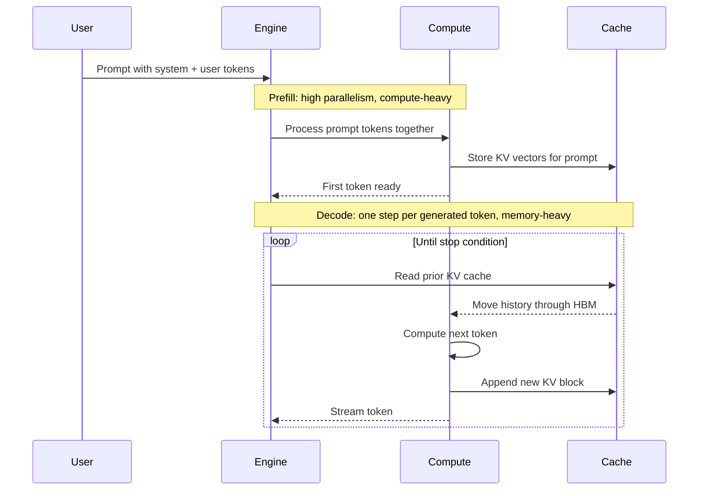
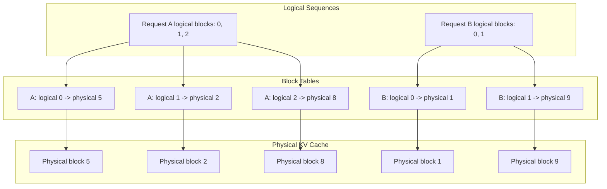

> **AI/ML Engineering Track** | Complexity: `[COMPLEX]` | Time: 3-4 hours | Prerequisites: AIOps, GPU fundamentals, transformer attention, and basic OpenAI-compatible HTTP APIs

## Learning Outcomes

By the end of this module, you will be able to:

- **Diagnose** whether an LLM serving workload is compute-bound, memory-bandwidth-bound, or queue-bound by separating prefill, decode, and scheduler behavior.
- **Explain** how PagedAttention, continuous batching, prefix caching, and RadixAttention reduce waste without pretending that any one engine removes hardware limits.
- **Design** a single-node inference service with realistic model IDs, pinned container tags, tensor parallelism, cache sizing, and Prometheus metrics.
- **Compare** serving optimizations such as chunked prefill, speculative decoding, quantization, and disaggregated prefill/decode using durable tradeoffs rather than vendor hype.
- **Validate** a vLLM deployment with a repeatable load test that measures TTFT, latency, throughput, and KV-cache pressure, and explain how validating an sglang deployment would differ.

## Why This Module Matters

Hypothetical scenario: a small AI product team ships a support assistant that works beautifully during internal testing. The prompt template is long, the model answers well, and a single request streams tokens quickly enough that nobody worries about infrastructure. Launch traffic changes the shape of the problem. Hundreds of users arrive at once, several paste long tickets, and the service starts reporting slow time to first token, uneven streaming, and GPU memory exhaustion even though the dashboard says the GPU arithmetic units are not fully busy.

The first instinct is often to buy a larger GPU or move to a larger model, but the symptoms point somewhere more specific. Autoregressive decoding is frequently limited by memory bandwidth and KV-cache capacity, not raw matrix multiplication. A naive server can waste memory through over-allocation, stall active users while a long prompt is being prefetched, or hold a static batch open while one slow request keeps generating. In that situation, adding hardware without changing the inference engine simply gives the same scheduler more room to waste.

Modern inference engines such as vLLM and sglang are important because they attack the serving problem at the right layer. They do not make transformer inference free, and they do not erase the need for capacity planning, but they provide better memory management, better batching, better cache reuse, and better control over latency/throughput tradeoffs. This module teaches the durable mechanics underneath those tools so you can reason from workload shape to engine configuration instead of copying flags from a stale blog post.

## The Inference Roofline: Prefill vs Decode

Autoregressive LLM serving has two phases that place very different pressure on the GPU. During prefill, the engine processes the entire prompt and builds the key/value vectors that future tokens will attend to. This work is mostly large matrix multiplication over a known sequence. The GPU can expose a lot of parallelism because many prompt tokens can be processed together, so prefill often behaves like a compute-heavy phase where arithmetic throughput matters.

Decode is different because the model produces one token at a time. For each new token, the attention layers need to read the previously stored KV cache, combine it with the current hidden state, and append new key/value vectors for the generated token. The amount of arithmetic per byte fetched from memory is much lower than in prefill. Once the model weights are resident and the batch is steady, decode often behaves like a memory-bandwidth-bound phase rather than a compute-bound phase.

The roofline model gives you a useful mental picture for this distinction. A workload with high arithmetic intensity performs many floating-point operations for every byte moved, so its speed is capped by compute throughput. A workload with low arithmetic intensity moves many bytes for relatively little math, so its speed is capped by memory bandwidth. Prefill usually sits closer to the compute side of that roofline; decode usually sits closer to the bandwidth side because every token must consult growing history.

This is why the phrase "GPU utilization" can mislead inference teams. A dashboard might show low streaming multiprocessor utilization during decode, yet the service cannot accept more users because HBM bandwidth or KV-cache memory is saturated. The GPU is not idle in a useful sense; it is waiting on memory movement. The correct response is not always a faster model kernel. Sometimes the response is larger effective batches, tighter KV-cache packing, shorter prompts, or a serving policy that protects interactive users from long-context requests.

Batch size changes the decode economics because a single decode iteration can process the next token for many active sequences at once. The engine still reads a lot of KV-cache data, but it amortizes scheduling overhead and uses the GPU more efficiently across users. Too small a batch underuses the hardware during decode. Too large a batch may increase queueing, TTFT, and inter-token latency for interactive users. The engineering goal is not "maximum batch size"; it is enough active work to keep the memory-bound phase productive without violating the product latency budget.

The prefill/decode split also explains why long prompts have a different failure mode from long answers. A long prompt causes a large prefill burst before the first token can stream, so it primarily damages TTFT for that request and can interrupt decode work for other users if the scheduler is naive. A long answer consumes KV-cache blocks over time, so it primarily increases cache residency and decode bandwidth demand. Both are expensive, but they stress different parts of the serving loop.

Think of an inference engine as an operating system for tokens. The GPU is the CPU, the KV cache is memory, user requests are processes, and every decode step is a scheduling tick. A simple server that treats each request as a private job wastes the shared machine. A high-performance server must multiplex requests, evict finished work, share cached prefixes, and keep memory allocation predictable while still returning tokens quickly enough for humans to trust the interface.



The practical lesson is that prefill and decode deserve separate measurements. A single "average latency" hides whether users are waiting before the first token, seeing stutters between tokens, or waiting in a queue before the engine admits the request. Good inference operations measure TTFT, inter-token latency, total request latency, throughput, and cache pressure together. If you only measure one of them, you can optimize a number while making the user experience worse.

## KV-Cache Memory: PagedAttention and Continuous Batching

The KV cache is the serving engine's working set. Each sequence stores key and value tensors for every layer and every token that the model may attend to in future decode steps. For large models, long contexts, and many active users, the cache can become the dominant memory consumer after model weights. A small mistake in allocation policy can therefore remove much more capacity than a small mistake in ordinary application memory.

Naive KV-cache management allocates large contiguous tensors for each request based on a maximum possible sequence length. That approach is simple because tensor indexing is straightforward, but it is wasteful because the engine does not know how many tokens the request will actually generate. If a request reserves room for thousands of tokens and stops after a short answer, the unused space is still trapped inside its allocation. Other requests cannot use it even though no meaningful data lives there.

The PagedAttention paper describes this waste using the same vocabulary operating systems use for memory allocation. Internal fragmentation appears when an allocation contains unused space, such as the unused tail of a reserved sequence buffer. External fragmentation appears when free memory exists in scattered gaps that cannot satisfy a large contiguous allocation. In the PagedAttention evaluation, conventional serving systems could waste a large fraction of KV-cache memory, which directly reduced the number of sequences that fit on the GPU.

PagedAttention changes the abstraction. Instead of requiring each sequence's KV cache to occupy one contiguous physical region, vLLM stores KV data in fixed-size blocks. A per-sequence block table maps logical token positions to physical blocks in GPU memory. The logical sequence still looks contiguous to the attention kernel, but physical memory can be non-contiguous. This is the same separation that makes virtual memory useful in an operating system: the program sees a clean address space while the system packs physical pages efficiently.



Blocks are allocated on demand as sequences grow. If a request stops early, the engine releases only the blocks it actually used. If a request needs more output, the engine attaches another block. The only unavoidable internal waste is usually the unused portion of the final block for a sequence, which is much smaller than reserving the full maximum length up front. The result is higher effective KV-cache capacity and more room for concurrent decode work.

PagedAttention also enables copy-on-write sharing. When two sequences share the same prefix, they can point to the same physical KV blocks for that prefix. If one sequence later diverges, the shared blocks remain read-only and the engine allocates new blocks for the divergent suffix. This matters for sampling, beam search, agent branches, and prompt templates where many requests begin with identical instructions. Sharing avoids recomputing and duplicating data that is logically the same.

Continuous batching solves a different but complementary problem. Static batching groups requests together and waits for the whole batch to finish before admitting new work. That policy is easy to reason about, but it is poor for generated text because outputs have variable length. One user may finish in ten tokens while another needs hundreds. If the engine holds the batch open until the longest request finishes, the short request's slot remains idle for many decode iterations.

Continuous batching, also called in-flight batching or iteration-level scheduling, treats each decode iteration as a scheduling opportunity. When a request emits an end token, hits a stop sequence, or reaches a token limit, the engine removes it from the active set. On the next iteration, the scheduler can admit a queued request into the batch. The active batch therefore changes over time, which keeps the GPU busy without forcing every request to have the same length.

The interesting scheduling problem is that new requests need prefill before they can join decode. A scheduler can prioritize prefill to reduce TTFT for queued users, but too much prefill work can interrupt smooth streaming for users already receiving tokens. A scheduler can prioritize decode to protect inter-token latency, but too much decode priority can leave new users waiting. Production tuning is a policy decision, not a single magic flag. You choose which latency you are willing to spend.

Chunked prefill is one answer to that tension. Instead of processing a very long prompt as one monolithic prefill operation, the engine can split the prompt into smaller chunks and interleave those chunks with decode work. The long-context request may take longer to reach its first token, but active streaming users see fewer stalls. That is usually the right tradeoff for interactive products where visible pauses in generated text are more damaging than a slightly slower first token for a document-sized request.

This memory/scheduling pair is the core reason engines such as vLLM produce better practical throughput than a basic transformer loop. PagedAttention increases how many useful sequences fit in memory. Continuous batching increases how often the GPU has useful work at each token step. Neither feature changes the mathematical cost of attention, but both reduce avoidable waste around the model. That is infrastructure engineering: keep the expensive accelerator doing work that users actually value.

## Cache Reuse: Prefix Caching and RadixAttention

Many LLM products repeat prompt material. A chat assistant may prepend the same system instructions to every request. A retrieval-augmented generation system may reuse a long policy block before adding user-specific context. An agent framework may branch into several candidate actions that share a conversation history. If the engine recomputes the shared prefix every time, it spends prefill compute on work whose result is already known.

Automatic prefix caching stores KV blocks for prompt prefixes and reuses them when a later request begins with the same token sequence. In vLLM, this is commonly explained as a hash-based cache over blocks. When a new request arrives, the engine can detect that the initial blocks match cached blocks and attach those blocks to the request's block table. The request still needs prefill for the new suffix, but it can skip the shared prefix.

The operational catch is that prefix caching requires exact token-level reuse. Two prompts that look similar to a human may not produce the same token sequence. A trailing space, a changed timestamp, reordered tool descriptions, or a per-user sentence inserted into the middle of the system prompt can break the cache hit. Platform teams often need prompt hygiene as much as engine configuration: keep stable instructions stable, place variable fields after stable prefixes, and avoid injecting request-specific noise near the beginning of the prompt.

sglang's RadixAttention approaches the same class of problem through a different data structure. Instead of only reacting to block hashes, it organizes reusable KV-cache prefixes in a radix tree. Shared prompt segments become paths through the tree, and divergent suffixes branch at the point where prompts differ. This is particularly natural for programs that generate many related prompts, such as tree search, self-consistency sampling, multi-agent debate, or structured generation with repeated schemas.

The durable distinction is "reactive hash reuse" versus "proactive prefix organization." Hash-based prefix caching is a powerful general optimization for identical prefixes, and it works well when a product sends the same system prompt repeatedly. A radix tree is more expressive for workloads with many branches that share long partial histories, because the cache structure mirrors the prompt program's branching shape. You should choose based on workload structure rather than assuming that one cache mechanism is universally superior.

Structured output generation adds another reason to care about inference engines. Prompting a model to "return valid JSON" is not the same as constraining the decoder to produce tokens that obey a schema. Runtime-level guided decoding can mask invalid tokens according to a grammar, JSON schema, or finite-state machine. This reduces format errors and can reduce wasted retries, but it can also add CPU-side overhead if the constraint machinery is inefficient.

sglang emphasizes programmable prompting and structured generation, while vLLM also supports guided decoding features through its OpenAI-compatible serving stack. The important production habit is to test the actual output contract under load. A schema-constrained endpoint may have different inter-token latency from an unconstrained endpoint, and a model that follows a JSON instruction in a notebook may still fail on edge cases when the prompt grows or the answer contains nested arrays.

Cache reuse is one place where product design and infrastructure design meet directly. A product manager may ask for per-user personalization at the start of every prompt because it reads naturally. An inference engineer may move that personalization after a stable system prefix because it preserves cache hits. Neither person is wrong; they are optimizing different layers. High-quality platform work makes the tradeoff explicit and gives teams a prompt layout that preserves both behavior and serving efficiency.

When debugging cache behavior, avoid relying only on subjective latency impressions. Measure first-run and second-run TTFT with identical prompts, inspect cache-related metrics when the engine exposes them, and vary only one part of the prompt at a time. If a supposed cache hit does not appear, compare tokenized prompts rather than raw strings. The engine caches tokens, not paragraphs, and the tokenizer is the authority on whether two prefixes are identical.

## Parallelism, Quantization, and Disaggregated Serving

Single-node inference often begins with one GPU, but real deployments quickly encounter models or concurrency targets that require multiple accelerators. Tensor parallelism splits individual matrix operations across GPUs, usually within the same node. Each GPU stores a shard of the model weights and participates in the same layer computation. This can make a model fit and can improve throughput, but every layer now requires communication across the interconnect.

The interconnect matters because tensor parallelism is synchronization-heavy. NVLink and NVSwitch provide much higher bandwidth and lower latency between GPUs than ordinary PCIe topologies. A tensor-parallel configuration that behaves well on an eight-GPU server with fast GPU-to-GPU links may underperform on a cheaper machine where GPUs communicate mostly through PCIe. The model may technically fit, but the communication overhead can erase the benefit of splitting the work.

Pipeline parallelism splits layers across devices. One GPU runs early layers, another runs later layers, and microbatches move through the pipeline. This is useful when the model is too large for one device and the topology favors a staged flow, but it introduces pipeline bubbles and can complicate scheduling for variable-length decode. Pipeline parallelism is common in training discussions, yet serving teams still need to evaluate whether the added scheduling complexity helps their specific inference workload.

Data parallelism is simpler: run multiple independent replicas of the serving engine and route requests across them. Each replica holds the whole model or its own tensor-parallel group. This is often the cleanest scaling method when one replica already meets single-request latency needs. The tradeoff is memory duplication. If each replica loads the same large model weights, you spend more VRAM on copies, but you also reduce cross-GPU synchronization and gain failure isolation.

Expert parallelism appears with mixture-of-experts models, where different tokens activate different expert networks. The serving challenge is routing tokens to the right experts while keeping communication and load balance under control. From an infrastructure perspective, MoE models are not simply dense models with more parameters. Active parameters, expert placement, router behavior, and all-to-all communication patterns all affect serving cost. Treat MoE deployment as its own architecture review, not a parameter-count comparison.

Quantization attacks a different bottleneck: representation size. Serving with FP16 or BF16 weights is common because it preserves quality and hardware support is broad, but smaller formats can reduce memory footprint and bandwidth demand. INT8, FP8, AWQ, and GPTQ approaches make different choices about calibration, activation awareness, hardware kernels, and quality preservation. The practical question is not whether quantization is fashionable; it is whether the chosen format is supported by the engine, the GPU, and the model family with acceptable quality loss.

Weight-only quantization can make a model fit into less memory, but it may not always speed up decode if kernels, cache format, or hardware support are weak. Activation or KV-cache quantization can reduce runtime memory movement, but it can be more sensitive to quality and implementation details. A benchmark that reports tokens per second without quality checks is incomplete. A benchmark that reports quality without latency and throughput is equally incomplete. Serving quantization is a three-way tradeoff among memory, speed, and answer quality.

FP8 is attractive on modern accelerators that provide native support because it can reduce memory bandwidth and storage pressure while retaining a floating-point dynamic range. INT8 is mature and widely understood, but actual speedups depend on optimized kernels. AWQ and GPTQ are post-training quantization families that compress weights with calibration data or layer-wise error control. These techniques are useful serving tools, but they should be validated on representative prompts, not only on a single benchmark score.

Disaggregated prefill/decode serving is a current architectural trend because the two phases want different resource shapes. Prefill benefits from compute-heavy parallel processing over long prompts. Decode benefits from memory bandwidth, KV-cache residency, and steady scheduling over many active sequences. A disaggregated architecture can send prompt processing to prefill workers and then transfer KV state to decode workers. That separation can improve utilization when prompt lengths and generation lengths vary widely.

The cost of disaggregation is data movement and operational complexity. KV transfer is not free, and a design that moves too much state across slow links can lose the benefit it sought. Disaggregation also creates new failure modes: prefill and decode pools must be sized separately, routing must preserve request state, and observability must explain which phase is saturated. It is a powerful pattern for larger platforms, but it is usually premature for a learner workstation or a small single-node service.

> **Landscape snapshot — as of 2026-06. This changes fast; verify against vendor docs before relying on specifics.**
>
> | Item | Snapshot value | Why it is quarantined here |
> | :--- | :--- | :--- |
> | vLLM release used in this module | `v0.22.1`, with lab image `vllm/vllm-openai:v0.22.1-ubuntu2404` | Container tags and CLI flags change between minor versions, so the lab pins a real tag instead of using `latest`. |
> | Prefix caching flag | vLLM V1 documentation describes prefix caching as enabled by default when supported, but the lab still passes `--enable-prefix-caching` for explicitness. | Defaults are volatile, and an explicit flag makes the exercise easier to audit against a pinned version. |
> | Speculative decoding syntax | Recent vLLM uses `--speculative-config '{"method":"draft_model","model":"...","num_speculative_tokens":5}'` rather than the older split flags. | Speculative-decoding CLI syntax has changed, so examples must be checked against the pinned docs. |
> | Small lab model | `Qwen/Qwen2.5-1.5B-Instruct` | The model ID exists on Hugging Face and is small enough for a 16 GB class GPU in a learner lab. |
> | Larger example target model | `Qwen/Qwen2.5-7B-Instruct`, optionally drafted by `Qwen/Qwen2.5-1.5B-Instruct` | These are real model IDs used only as examples; production choices depend on licenses, hardware, and quality tests. |
> | sglang package snapshot | PyPI lists the current sglang package line separately from vLLM; verify the exact release before installing. | sglang server options and structured-output behavior evolve quickly, so this module teaches concepts before flags. |
>
> This snapshot is illustrative, not a leaderboard, endorsement, or promise that these versions remain current after 2026-06.

The safest way to use a snapshot is to keep volatile details out of the durable explanation. The durable explanation says that prefill and decode have different bottlenecks, KV-cache memory needs careful allocation, cache reuse depends on prompt identity, tensor parallelism depends on interconnects, and quantization trades quality against memory and speed. The snapshot says which exact tag and model IDs were verified while this module was expanded. Future maintainers can update the snapshot without rewriting the underlying lesson.

A good design review turns those ideas into constraints before anyone writes a manifest. Start with the largest prompt you plan to accept, the longest answer you plan to stream, the number of simultaneous users you need to tolerate, and the latency budget for each user class. Then choose the smallest model that satisfies quality, the memory format that preserves that quality, the number of GPUs needed for weights and cache, and the routing policy that protects important traffic. This order prevents a common failure: selecting a serving engine first and then discovering that the workload shape contradicts the chosen configuration.

For a single-node service, the most useful design artifact is a capacity worksheet rather than a tool comparison table. List model weight memory, expected KV-cache memory per active request, maximum context length, target concurrent sequences, and memory reserved for framework overhead. Add the interconnect topology if tensor parallelism is required, because two GPUs connected through a slow path do not behave like two GPUs connected through NVLink. The worksheet will not predict every kernel-level detail, but it forces the team to make the hidden assumptions visible before launch traffic tests them.

## Serving Operations: Metrics, Tuning, and Failure Modes

Inference operations should begin with user-visible latency, not only accelerator counters. Time to first token measures how long a user waits before streaming begins. Inter-token latency measures the smoothness of the stream after it begins. Total request latency measures completion time. Throughput measures tokens or requests per second across the service. Goodput measures useful work that meets the service-level objective, which is often more important than raw maximum throughput.

TTFT is usually sensitive to queueing and prefill. If TTFT rises while inter-token latency stays acceptable, the engine may be admitting too much work, prefill may be overloaded, or prefix caching may be missing. If TTFT is good but generated text stutters, decode scheduling or memory bandwidth may be the bottleneck. If both are bad, the service may be saturated at the request queue, the KV cache may be full, or the model may simply be too large for the target hardware.

KV-cache utilization is a capacity signal rather than a vanity metric. A cache that is nearly full can still work for a short time, but it leaves little room for prompt length variation or sudden bursts. When cache pressure remains high, new requests queue, long requests are rejected, or the engine must evict reusable prefixes that would have improved TTFT. Watching cache utilization alongside request waiting time tells you whether the bottleneck is memory residency or scheduler policy.

Throughput should be interpreted in context. A batch offline job can optimize for tokens per second because no human is watching the stream. A support chatbot should usually sacrifice some aggregate throughput to protect TTFT and smooth decode. An internal evaluation harness might want deterministic runs and stable concurrency more than raw speed. The same engine can serve all three patterns, but not with the same configuration and routing policy.

The most common tuning mistake is changing one flag without designing the measurement. For example, increasing `--max-num-seqs` may improve throughput in an offline test and damage interactive latency in production. Lowering `--gpu-memory-utilization` may prevent out-of-memory failures but reduce concurrency. Enabling chunked prefill may smooth decode while increasing TTFT for long prompts. Every change should be paired with a hypothesis, a workload, and a metric that can disprove the hypothesis.

Prometheus metrics make this work less mysterious. vLLM exposes an HTTP metrics endpoint, including request, latency, and cache-related metrics. The exact metric names can change as the project evolves, so dashboards should be reviewed when the engine is upgraded. Still, the categories are durable: queue state, running requests, waiting requests, prompt/generation token counts, KV-cache usage, TTFT, and per-token latency. A useful dashboard shows all of them together.

Capacity planning should distinguish model memory from runtime memory. Model weights occupy a relatively fixed amount of VRAM once loaded. KV cache grows with active sequences and context length. Temporary activations, CUDA graphs, communication buffers, and framework overhead consume additional space. Setting a memory utilization flag to the absolute maximum leaves no room for these overheads, which can turn ordinary traffic variation into an out-of-memory incident.

Routing strategy becomes important once you operate more than one replica. If prefix caching is valuable, randomly balancing every request across every replica can destroy cache locality. If some requests need long contexts and others need short chat responses, mixing them in one pool can make latency noisy. A better platform may route stable system-prompt traffic to a warm cache pool, batch jobs to a throughput pool, and long-document work to a pool with chunked prefill and larger context limits.

Observability also helps separate model quality problems from serving problems. A user may report that the assistant is "slow and wrong." Slow might be queueing, prefill, decode, client rendering, or network buffering. Wrong might be a retrieval issue, a prompt issue, a quantization regression, or a model-selection issue. If the serving layer reports precise timing and cache behavior, the team can avoid blaming the model for infrastructure problems or blaming the scheduler for prompt-quality problems.

The final operational habit is version discipline. Do not copy a command with `latest`, do not assume a model repository exists because its name sounds plausible, and do not keep old flags after an engine changes its CLI. Pin the container image, pin the model ID, record the docs you used, and upgrade deliberately. High-performance inference is moving quickly enough that stale examples are a real reliability risk.

When a service degrades, write the incident question in the same language as the serving phases. "The model is slow" is too vague to guide action. "TTFT rose after the deploy while inter-token latency stayed flat" points toward queueing, prefill, model loading, or prefix-cache behavior. "Inter-token latency rose while TTFT stayed flat" points toward decode scheduling, memory bandwidth, cache pressure, or a noisy neighbor on the GPU. "Throughput rose but goodput fell" means the system is doing more work that violates the user-facing objective. This vocabulary is how platform engineers keep diagnosis from turning into random flag changes.

The same vocabulary helps with load testing. A realistic test should mix short chat prompts, long-context prompts, and repeated-prefix prompts in proportions that resemble the product. It should run long enough for cache warmth, memory fragmentation, and queue behavior to appear. It should report percentiles, not only averages, because the slowest users often reveal scheduler problems first. If the service has separate pools for interactive and batch traffic, test the pools separately and together. A benchmark that cannot reproduce the expected contention pattern is a demonstration, not evidence.

Here is a Kubernetes-oriented sketch that uses verified model IDs and a pinned vLLM image. It is intentionally small enough to read, not a complete production manifest with probes, autoscaling, authentication, or model download secrets.

```yaml
apiVersion: apps/v1
kind: Deployment
metadata:
  name: vllm-qwen-deployment
  labels:
    app: vllm-qwen
spec:
  replicas: 1
  selector:
    matchLabels:
      app: vllm-qwen
  template:
    metadata:
      labels:
        app: vllm-qwen
    spec:
      containers:
        - name: vllm-server
          image: vllm/vllm-openai:v0.22.1-ubuntu2404
          args:
            - "--model"
            - "Qwen/Qwen2.5-7B-Instruct"
            - "--tensor-parallel-size"
            - "2"
            - "--gpu-memory-utilization"
            - "0.90"
            - "--max-model-len"
            - "8192"
            - "--enable-prefix-caching"
          resources:
            limits:
              nvidia.com/gpu: "2"
          ports:
            - containerPort: 8000
```

The speculative decoding syntax below is deliberately shown as a pinned-version example, not a universal incantation. It uses a larger Qwen model as the target and a smaller Qwen model as the draft. The exact speedup depends on how often the draft model predicts tokens that the target model accepts, the overhead of running the draft, the hardware, and the workload.

```bash
vllm serve Qwen/Qwen2.5-7B-Instruct \
  --speculative-config '{"method":"draft_model","model":"Qwen/Qwen2.5-1.5B-Instruct","num_speculative_tokens":5}' \
  --gpu-memory-utilization 0.90
```

## Did You Know?

- > **PagedAttention memory waste was a measured systems problem, not a slogan.** The 2023 paper reported that conventional KV-cache allocation could waste up to 60-80% of memory in evaluated serving settings, which is why block-based allocation mattered.
- > **vLLM's 24x throughput claim belongs to its 2023 initial-release context.** The project reported up to 24x higher throughput than Hugging Face Transformers in launch benchmarks, but modern comparisons must be rerun against current versions.
- > **RadixAttention borrows the radix-tree idea for prompt programs.** Matching work grows with the relevant prefix path, which is useful when many requests branch from shared prompt histories rather than arriving as unrelated strings.
- > **Speculative decoding speedups are workload-dependent.** The 2023 speculative sampling paper reported around 2x-3x generation acceleration in studied settings, but acceptance rate and draft-model overhead decide whether a deployment benefits.

## Common Mistakes

| Mistake | Why it happens | How to fix |
| :--- | :--- | :--- |
| Treating decode as a compute-bound workload | GPU dashboards show idle arithmetic units, so the team assumes kernels are inefficient rather than recognizing memory-bandwidth pressure. | Separate prefill and decode metrics, then tune batch size, cache capacity, and prompt length before changing hardware. |
| Copying stale vLLM flags | Blog posts and examples survive longer than the CLI syntax they describe, especially for speculative decoding and cache defaults. | Pin the vLLM version, read the matching docs, and quarantine volatile flags in a dated snapshot. |
| Using invented model IDs | Model names sound regular, so teams guess repository names that do not exist or are gated differently than expected. | Verify model IDs on Hugging Face or the vendor registry before writing manifests, tests, or curriculum examples. |
| Maximizing `--gpu-memory-utilization` | The setting looks like a simple way to increase capacity, but frameworks need memory for activations, graphs, communication, and overhead. | Leave headroom, test with realistic prompt lengths, and watch cache usage plus out-of-memory behavior under burst traffic. |
| Breaking prefix-cache hits with prompt personalization | Teams insert timestamps, user names, or dynamic tool lists before stable system instructions, changing the token prefix every request. | Keep stable prompt material first, move variable fields after the shared prefix, and compare tokenized prompts when debugging cache misses. |
| Routing cache-sensitive traffic randomly | A load balancer distributes related requests across replicas, so each engine sees fewer repeated prefixes and cache warmth disappears. | Route by workload, tenant, or prompt family when cache locality matters, and monitor TTFT before and after routing changes. |
| Measuring only raw tokens per second | Offline throughput improves while interactive users see worse TTFT or uneven streaming, creating a misleading success metric. | Track goodput against SLOs, TTFT, inter-token latency, queue depth, and KV-cache utilization together. |

## Knowledge Check

<details>
<summary>1. Diagnose this LLM serving workload: it may be compute-bound, memory-bandwidth-bound, or queue-bound, and the service has low GPU compute utilization, high request waiting time, and high KV-cache utilization during long conversations. What bottleneck should you investigate first?</summary>
Investigate KV-cache capacity and decode memory bandwidth before assuming the GPU arithmetic units are too slow. Long conversations consume cache blocks, and decode must repeatedly read that history. If the cache is full, new requests queue even when compute utilization appears low. A useful next step is to inspect cache metrics, active sequence counts, context lengths, and waiting-request metrics together.
</details>

<details>
<summary>2. A team increases maximum batch size and sees better overnight summarization throughput, but live chat users report slower first tokens. What tradeoff did the team expose?</summary>
The team optimized aggregate throughput at the expense of interactive latency. Larger active batches can improve memory-bound decode efficiency, but they can also increase queueing and delay prefill for new chat requests. The correct response is usually workload separation or policy tuning, such as a throughput pool for offline jobs and a latency pool for live chat.
</details>

<details>
<summary>3. Two prompts share the same system instructions, but prefix caching does not appear to reduce TTFT. What should you check before blaming the engine?</summary>
Check whether the token prefixes are actually identical. Formatting differences, timestamps, user-specific text, reordered tools, or hidden whitespace can change the token sequence. Prefix caching works on token identity, not semantic similarity. Move variable content after the stable prefix and compare tokenized prompts if the behavior remains unclear.
</details>

<details>
<summary>4. Why can PagedAttention increase throughput without changing the model's mathematical outputs?</summary>
PagedAttention changes memory management, not model semantics. It stores KV cache in fixed-size physical blocks and maps logical sequence positions through block tables. That reduces internal and external fragmentation, allowing more concurrent sequences to fit in GPU memory. More useful concurrent decode work can improve throughput while the attention computation still produces the same kind of outputs.
</details>

<details>
<summary>5. When would sglang's RadixAttention be especially attractive compared with ordinary identical-prefix caching?</summary>
It is attractive when the workload contains many related prompt branches that share long partial histories, such as agent search, tree-of-thought exploration, self-consistency sampling, or structured prompt programs. A radix tree can organize shared prefixes and divergent suffixes in a way that mirrors the program structure. For simple repeated system prompts, hash-based prefix caching may already be sufficient.
</details>

<details>
<summary>6. A quantized model fits on a smaller GPU but produces subtle answer regressions in domain-specific prompts. What was missing from the validation plan?</summary>
The plan validated memory fit without validating answer quality on representative prompts. Serving quantization must be evaluated across memory footprint, latency/throughput, and task quality. The team should compare outputs against an unquantized baseline, include domain-specific tests, and verify that the chosen quantization format has optimized kernels on the target hardware.
</details>

<details>
<summary>7. Design a single-node inference service with a realistic model ID, pinned container tag, tensor parallelism only when needed, cache sizing, and Prometheus metrics. Why might disaggregating prefill and decode help a large platform but be premature for this learner workstation design?</summary>
Disaggregation can match compute-heavy prefill and memory-bandwidth-heavy decode to different worker pools, which helps at scale when prompt lengths and generation lengths vary widely. It also requires KV transfer, routing, separate pool sizing, and more observability. A learner workstation usually benefits more from understanding single-node scheduling, cache behavior, and metrics before adding distributed state movement.
</details>

## Hands-On Exercise

In this exercise, you will launch a local vLLM OpenAI-compatible server, send concurrent requests that share a long system prompt, and inspect metrics that reveal cache pressure. The lab uses `Qwen/Qwen2.5-1.5B-Instruct` because the model ID is real and the model is small enough for a 16 GB class GPU in many learner environments. If your GPU has less memory, use the same measurement structure with a smaller model that your hardware can load.

The exercise is not a benchmark contest. Its purpose is to make the serving mechanics visible. You will run the same prompt pattern twice, observe how repeated stable prefixes affect latency, and inspect the Prometheus endpoint for KV-cache utilization. The absolute numbers will depend on your GPU, driver, container runtime, and network path. The shape of the measurement is the lesson.

Before you run the commands, state your expectation in writing. The first run should include more cold-path work because the process has just loaded the model and has not yet reused the stable system prompt. The second run may show lower average latency if the shared prefix remains cached and the GPU has enough memory to keep those blocks resident. If the second run is not faster, that is still a useful result: it tells you to check cache pressure, prompt identity, warmup behavior, and whether the workload is large enough for the optimization to matter.

After the lab, resist the urge to generalize from one number. A single 20-request test can demonstrate the mechanics, but it cannot certify a production service. Repeat the test with different concurrency levels, different prompt lengths, and a version of the prompt that deliberately changes the first sentence on every request. That comparison shows why stable prefixes, cache capacity, and scheduler policy are part of the same design problem. The goal is not to memorize the exact latency on your GPU; the goal is to recognize which knob explains which symptom.

**Prerequisites:** Linux, Docker, an NVIDIA GPU with the NVIDIA Container Toolkit, enough disk space for the model cache, and a shell where Docker can access the GPU. If your environment requires Hugging Face authentication for other models, authenticate outside this lab; the Qwen model used here does not require inventing a private model name.

**Task 1: Launch the vLLM Server**

Start a pinned vLLM container and expose the OpenAI-compatible API on port 8000. The `--ipc=host` flag gives the container access to host shared memory, which avoids avoidable PyTorch multiprocessing problems in many Docker setups.

<details>
<summary>Solution</summary>

```bash
docker run --gpus all \
  -v ~/.cache/huggingface:/root/.cache/huggingface \
  -p 8000:8000 \
  --ipc=host \
  vllm/vllm-openai:v0.22.1-ubuntu2404 \
  --model Qwen/Qwen2.5-1.5B-Instruct \
  --enable-prefix-caching \
  --max-model-len 4096 \
  --gpu-memory-utilization 0.80
```

Wait for the server to report that the application is running, then verify the model endpoint from a second terminal.

```bash
curl -s http://127.0.0.1:8000/v1/models | grep Qwen
```
</details>

**Task 2: Create a Concurrent Client**

Create a small `asyncio` client that sends repeated requests with an identical long system prompt and unique short user messages. This shape is intentionally cache-friendly so the second run can show the effect of stable prefixes more clearly.

<details>
<summary>Solution</summary>

```bash
.venv/bin/python -m pip install aiohttp
cat << 'PY' > load_test.py
import asyncio
import time

import aiohttp


SYSTEM_PROMPT = "You are a precise technical assistant for infrastructure teams. " * 120
URL = "http://127.0.0.1:8000/v1/chat/completions"
MODEL = "Qwen/Qwen2.5-1.5B-Instruct"


async def fetch(session: aiohttp.ClientSession, index: int) -> float:
    payload = {
        "model": MODEL,
        "messages": [
            {"role": "system", "content": SYSTEM_PROMPT},
            {
                "role": "user",
                "content": f"Explain one practical inference-serving lesson for scenario {index}.",
            },
        ],
        "max_tokens": 60,
        "temperature": 0.2,
    }
    start = time.perf_counter()
    async with session.post(URL, json=payload, timeout=120) as response:
        response.raise_for_status()
        await response.json()
    return time.perf_counter() - start


async def main() -> None:
    async with aiohttp.ClientSession() as session:
        durations = await asyncio.gather(*(fetch(session, i) for i in range(20)))
    print(f"Average latency: {sum(durations) / len(durations):.2f} seconds")
    print(f"Maximum latency: {max(durations):.2f} seconds")
    print(f"Minimum latency: {min(durations):.2f} seconds")


if __name__ == "__main__":
    asyncio.run(main())
PY
```
</details>

**Task 3: Run the Client Twice**

Run the client twice without restarting the server. The first run warms the model path and shared prompt cache. The second run should often show lower latency when the stable prefix remains cached, although exact results depend on cache capacity and other activity on the GPU.

<details>
<summary>Solution</summary>

```bash
.venv/bin/python load_test.py
.venv/bin/python load_test.py
```

Compare the averages and maximums **across the two runs** — that cross-run delta is the prefix-cache signal, because within a single run concurrency and continuous batching also affect latency and can mask the cache effect. For a cleaner isolation, send one *sequential* identical request before and after warming the cache and compare just those two timings, then scale up to the concurrent load test. If the second run is not faster, inspect whether the server stayed up, whether memory pressure evicted cached blocks, and whether the prompt was exactly identical between runs.
</details>

**Task 4: Inspect Prometheus Metrics**

Fetch the metrics endpoint and look for cache usage. Metric names can evolve between vLLM versions, so start with a broad grep and then narrow the dashboard to the names exposed by your pinned image.

<details>
<summary>Solution</summary>

```bash
curl -s http://127.0.0.1:8000/metrics | grep -E 'vllm:.*cache|vllm:.*request|vllm:.*time'
```

For the pinned image, look for metrics that describe GPU cache usage, running requests, waiting requests, and latency buckets. If no metrics appear, verify that you queried the same port as the server and that the container is still running.
</details>

**Success Checklist:**

- [ ] The pinned vLLM container starts and serves `Qwen/Qwen2.5-1.5B-Instruct` without an out-of-memory error.
- [ ] You can design a single-node inference service from the pinned container tag, verified model ID, GPU count, cache budget, and metrics endpoint.
- [ ] The `/v1/models` endpoint returns the expected Qwen model ID from `127.0.0.1:8000`.
- [ ] The concurrent client sends 20 requests and prints average, maximum, and minimum latency.
- [ ] Two consecutive runs produce measurements you can explain using prefix reuse, cache pressure, or workload variation.
- [ ] The `/metrics` endpoint exposes request or cache metrics that you can connect to TTFT, throughput, or KV-cache utilization.

## Next Module

Single-node engines are easiest to understand when you can see the scheduler, cache, and metrics in one place. The next step is to choose a learner-scale local stack that lets you practice those ideas without overbuilding a production platform. Continue with [Module 1.4: Local Inference Stack for Learners](../module-1.4-local-inference-stack-for-learners/).

## Sources

- [vLLM PyPI release history](https://pypi.org/project/vllm/) — verifies the current vLLM package line and why the module pins a dated release snapshot.
- [vLLM Docker deployment documentation](https://docs.vllm.ai/en/v0.22.1/deployment/docker/) — official deployment reference for the `vllm/vllm-openai` image family and Docker serving pattern.
- [vLLM serve CLI documentation](https://docs.vllm.ai/en/v0.22.1/cli/serve/) — official CLI reference for pinned serve flags, including memory, prefix caching, and speculative configuration.
- [vLLM automatic prefix caching documentation](https://docs.vllm.ai/en/stable/features/automatic_prefix_caching/) — official explanation of prefix-cache behavior and current default guidance.
- [vLLM metrics documentation](https://docs.vllm.ai/en/stable/design/metrics/) — official reference for Prometheus metrics used to monitor request, latency, and KV-cache behavior.
- [vLLM launch blog: Easy, Fast, and Cheap LLM Serving with PagedAttention](https://vllm.ai/blog/2023-06-20-vllm) — source for the dated 2023 initial-release throughput comparison against Hugging Face Transformers.
- [Efficient Memory Management for Large Language Model Serving with PagedAttention](https://arxiv.org/abs/2309.06180) — primary paper for PagedAttention, block tables, KV-cache fragmentation, and cache sharing.
- [Orca: A Distributed Serving System for Transformer-Based Generative Models](https://www.usenix.org/conference/osdi22/presentation/yu) — primary systems paper for iteration-level scheduling and continuous batching concepts.
- [Efficiently Programming Large Language Models using SGLang](https://arxiv.org/abs/2312.07104) — primary paper for sglang, RadixAttention, and structured prompting runtime concepts.
- [SGLang project repository](https://github.com/sgl-project/sglang) — upstream project reference for sglang runtime, serving, and structured-generation capabilities.
- [Qwen/Qwen2.5-1.5B-Instruct model card](https://huggingface.co/Qwen/Qwen2.5-1.5B-Instruct) — verifies the small Hugging Face model ID used in the hands-on lab.
- [Qwen/Qwen2.5-7B-Instruct model card](https://huggingface.co/Qwen/Qwen2.5-7B-Instruct) — verifies the larger example target model ID used in the speculative-decoding example.
- [vLLM quantization documentation](https://docs.vllm.ai/en/stable/features/quantization/) — official reference for serving quantization options such as FP8, INT8, AWQ, and GPTQ support.
- [AWQ: Activation-aware Weight Quantization for LLM Compression and Acceleration](https://arxiv.org/abs/2306.00978) — primary quantization reference for activation-aware weight compression tradeoffs.
- [GPTQ: Accurate Post-Training Quantization for Generative Pre-trained Transformers](https://arxiv.org/abs/2210.17323) — primary quantization reference for layer-wise post-training compression.
- [Accelerating Large Language Model Decoding with Speculative Sampling](https://arxiv.org/abs/2302.01318) — primary paper for draft-and-verify speculative decoding and its reported speedups.
- [DistServe: Disaggregating Prefill and Decoding for Goodput-optimized Large Language Model Serving](https://arxiv.org/abs/2401.09670) — research source for disaggregated prefill/decode serving and goodput-oriented scheduling.
- [Splitwise: Efficient Generative LLM Inference Using Phase Splitting](https://arxiv.org/abs/2311.18677) — research source for separating inference phases across hardware to improve serving efficiency.
